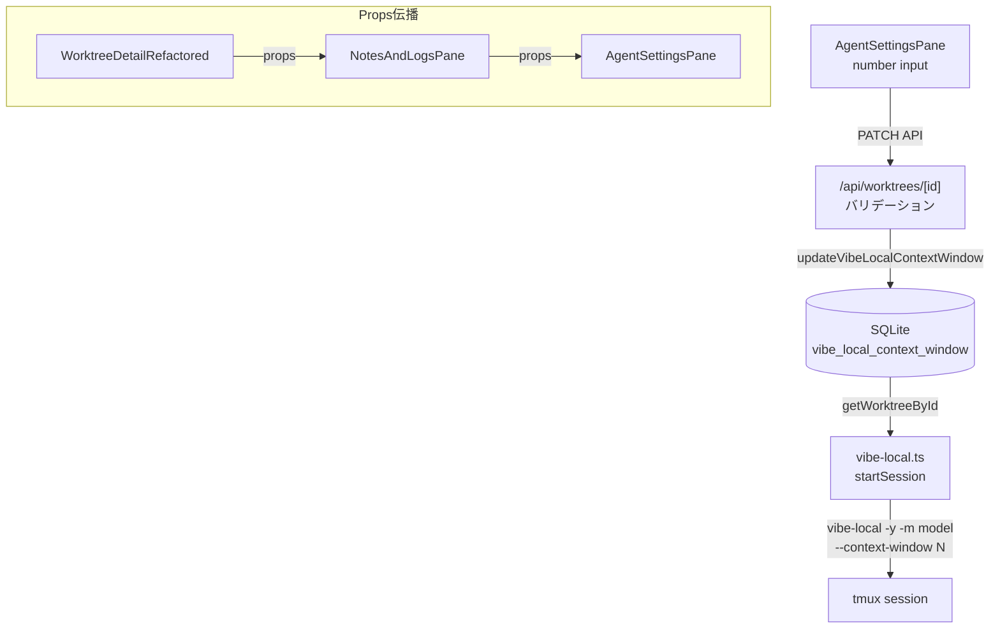

# Issue #374 設計方針書: Vibe Localコンテキストウィンドウサイズ設定

## 1. 概要

### 目的
Vibe Local CLIツールに `--context-window` オプションをサポートし、worktree単位でOllamaのコンテキストウィンドウサイズを設定可能にする。

### スコープ
- 対話モード（tmuxセッション）のみ対象
- スケジュール実行（claude-executor.ts 経由の `-p` モード）はスコープ外
  - **[I3-001]** `schedule-manager.ts` L320 の直接SQLクエリ（`SELECT path, vibe_local_model FROM worktrees WHERE id = ?`）および `claude-executor.ts` の `buildCliArgs()` 関数は修正不要。`-p` モードでの `--context-window` サポートは未確認のため、Issue #374では対応しない。

### 設計原則
- 既存の `vibeLocalModel` 実装パターンの踏襲（一貫性優先）
- KISS / YAGNI / DRY 原則の遵守
- Defense-in-depth によるセキュリティ確保

---

## レビュー履歴

| Stage | レビュー日 | ステータス | スコア | 反映日 |
|-------|----------|-----------|-------|--------|
| Stage 1 (通常レビュー / 設計原則) | 2026-02-28 | conditionally_approved | 4/5 | 2026-02-28 |
| Stage 2 (整合性レビュー) | 2026-02-28 | conditionally_approved | 4/5 | 2026-02-28 |
| Stage 3 (影響分析レビュー) | 2026-02-28 | conditional_pass | - | 2026-02-28 |
| Stage 4 (セキュリティレビュー) | 2026-02-28 | conditional_pass | - | 2026-02-28 |

---

## レビュー指摘事項サマリー

### Stage 1: 通常レビュー（設計原則）

| ID | 重要度 | 原則 | タイトル | 対応状況 |
|----|--------|------|---------|---------|
| S1-005 | must-fix | DIP | vibe-local.ts内でのDB直接アクセス | 反映済み（セクション3, 9） |
| S1-001 | should-fix | DRY | バリデーションロジックの重複（API層/CLI層） | 反映済み（セクション5） |
| S1-004 | should-fix | OCP | VIBE_LOCAL_CONTEXT_WINDOW定数のJSDoc追記方針 | 反映済み（セクション10） |
| S1-007 | should-fix | YAGNI | 下限値128の根拠と妥当性 | 反映済み（セクション9） |
| S1-002 | nice-to-have | SRP | AgentSettingsPaneの責務増加傾向 | 反映済み（セクション9） |
| S1-003 | nice-to-have | DRY | SELECT文への新カラム追加が6箇所に及ぶ | 反映済み（セクション3） |
| S1-006 | nice-to-have | KISS | Props伝播チェーン（3段階）の複雑さ | 反映済み（セクション6） |
| S1-008 | nice-to-have | OCP | updateVibeLocalContextWindowの個別関数パターン | 反映済み（セクション9） |

### Stage 2: 整合性レビュー

| ID | 重要度 | カテゴリ | タイトル | 対応状況 |
|----|--------|---------|---------|---------|
| C2-001 | must-fix | テスト整合性 | db-migrations.test.tsのCURRENT_SCHEMA_VERSION期待値の行番号確認 | 反映済み（セクション8） |
| C2-002 | must-fix | DB関数シグネチャ整合性 | APIバリデーションでのnull以外の不正型チェック | 反映済み（セクション4） |
| C2-003 | should-fix | SELECT文整合性 | SELECT文への追加位置の明記 | 反映済み（セクション3） |
| C2-004 | should-fix | i18nパターン整合性 | i18nキーの日本語訳の整合性 | 反映済み（セクション6） |
| C2-005 | should-fix | 型定義整合性 | Worktree interfaceのoptional型パターン | 反映済み（セクション7） |
| C2-006 | should-fix | APIバリデーション整合性 | APIバリデーションの型ガード方針 | 反映済み（セクション4） |
| C2-007 | nice-to-have | マイグレーションパターン整合性 | version 20のdown()関数パターンを明記 | 反映済み（セクション8） |
| C2-008 | nice-to-have | vibe-local.ts整合性 | startSession()内のcontextWindow取得コード例 | 反映済み（セクション5） |
| C2-009 | nice-to-have | WorktreeDetailRefactored整合性 | NotesAndLogsPaneの全呼び出し箇所 | 反映済み（セクション6） |

### Stage 3: 影響分析レビュー

| ID | 重要度 | カテゴリ | タイトル | 対応状況 |
|----|--------|---------|---------|---------|
| I3-001 | must-fix | 影響範囲分析 | schedule-manager.tsの直接SQLクエリへの影響が未分析 | 反映済み（セクション1, 9） |
| I3-002 | should-fix | テスト行番号 | db-migrations.test.tsの実際の行番号とテスト構造の確認 | 反映済み（セクション8） |
| I3-003 | should-fix | 将来影響 | claude-executor.ts buildCliArgs()への将来的影響の明示 | 反映済み（セクション9） |
| I3-004 | should-fix | テスト配置 | isValidVibeLocalContextWindow()のテストファイル配置場所 | 反映済み（セクション8） |
| I3-005 | should-fix | 変更詳細 | WorktreeDetailRefactored.tsxのMobileContentProps影響 | 反映済み（セクション10） |
| I3-006 | nice-to-have | ドキュメント | CLAUDE.mdのモジュール説明更新の具体的内容 | 認識済み |
| I3-007 | nice-to-have | 実装漏れ防止 | getWorktrees()の戻り値への追加漏れチェック | 認識済み |
| I3-008 | nice-to-have | i18n | i18nキーのネームスペース配置確認 | 対応不要（既存パターン一致） |

### Stage 4: セキュリティレビュー

| ID | 重要度 | カテゴリ | タイトル | 対応状況 |
|----|--------|---------|---------|---------|
| S4-001 | should-fix | コマンドインジェクション防止 | テンプレートリテラルでのCLI引数構築に関する追加防御（Number()キャスト） | 反映済み（セクション5） |
| S4-002 | should-fix | プロトタイプ汚染耐性 | JSON.parse後のプロトタイプ汚染キーに対する型ガード保護の明記 | 反映済み（セクション4, 5） |
| S4-003 | nice-to-have | クライアントバリデーション | HTML number inputのクライアント側バリデーション回避に対する設計文書上の明示 | 認識済み |
| S4-004 | nice-to-have | 上限値保守 | 上限値2097152の将来的な見直し基準の明示 | 認識済み |

#### OWASP Top 10 セキュリティチェック結果

| OWASP カテゴリ | 結果 | 根拠 |
|---------------|------|------|
| A03 Injection | PASS | 数値型バリデーション（typeof + Number.isInteger + 範囲チェック）による防御。テンプレートリテラル埋め込み前の追加キャスト（S4-001）で多層防御強化。型ガードによりCLI引数に非数値が到達することは不可。 |
| A04 Insecure Design | PASS | 多層防御（API層→DB層→CLI層）の設計。isValidVibeLocalContextWindow()をDRY原則で共有。defense-in-depthパターン適用済み。 |
| A05 Security Misconfiguration | PASS | デフォルト値NULLは安全（CLIフラグ省略）。新規環境変数の追加なし。 |

---

## 2. アーキテクチャ設計

### データフロー



### レイヤー構成

| レイヤー | コンポーネント | 責務 |
|---------|-------------|------|
| プレゼンテーション | AgentSettingsPane.tsx | 数値入力UI、PATCH API呼び出し |
| プレゼンテーション | WorktreeDetailRefactored.tsx | state管理、API応答からの値取得 |
| プレゼンテーション | NotesAndLogsPane.tsx | props伝播 |
| API | route.ts (PATCH) | バリデーション、DB更新呼び出し |
| ビジネスロジック | vibe-local.ts | defense-in-depth バリデーション、CLIコマンド構築 |
| データアクセス | db.ts | updateVibeLocalContextWindow(), SELECT文修正 |
| インフラ | db-migrations.ts | DDL (ALTER TABLE) |
| 型定義 | models.ts, types.ts | Worktree interface、定数、バリデーション関数 |

---

## 3. データモデル設計

### テーブル変更（マイグレーション version 20）

```sql
ALTER TABLE worktrees ADD COLUMN vibe_local_context_window INTEGER DEFAULT NULL;
```

| カラム | 型 | デフォルト | 制約 | 説明 |
|-------|-----|----------|------|------|
| `vibe_local_context_window` | INTEGER | NULL | NULLable | コンテキストウィンドウサイズ（128〜2097152） |

### 設計判断

- **NULL = デフォルト値使用**: vibe-local CLIの組み込みデフォルトに委ねる
- **INTEGER型**: SQLiteのINTEGERアフィニティ。JavaScript側でNumber.isInteger()チェック
- **upsertWorktree() は修正不要**: vibeLocalModel と同じく個別update関数パターンを踏襲
- **[S1-005] startSession()内でのDB直接アクセス**: startSession()内でgetDbInstance()/getWorktreeById()を直接呼び出すのは既存のvibeLocalModelパターンと一貫性を保つため。将来的にはstartSession()の引数としてcontextWindowを渡す設計（DIP準拠）へのリファクタリングが望ましいが、vibeLocalModelとの同時リファクタリングが必要なため、Issue #374スコープ外とする。

### DB関数パターン

```typescript
// 新規追加: updateVibeLocalContextWindow()
// vibeLocalModel と同一パターン
export function updateVibeLocalContextWindow(
  db: Database.Database,
  id: string,
  contextWindow: number | null
): void {
  const stmt = db.prepare(`
    UPDATE worktrees
    SET vibe_local_context_window = ?
    WHERE id = ?
  `);
  stmt.run(contextWindow, id);
}
```

### SELECT文修正（計6箇所）

**[C2-003] 追加位置**: `w.vibe_local_context_window` は `w.vibe_local_model` の直後に配置する（カラムの論理的なグルーピング）。

| 関数 | 修正箇所 | 修正内容 |
|------|---------|---------|
| `getWorktrees()` | SELECT文 | `w.vibe_local_context_window` を `w.vibe_local_model` の直後に追加 |
| `getWorktrees()` | 型キャスト（as句） | `vibe_local_context_window: number \| null` を `vibe_local_model` の直後に追加 |
| `getWorktrees()` | マッピング | `vibeLocalContextWindow: row.vibe_local_context_window ?? null` を `vibeLocalModel` の直後に追加 |
| `getWorktreeById()` | SELECT文 | `w.vibe_local_context_window` を `w.vibe_local_model` の直後に追加 |
| `getWorktreeById()` | 型キャスト（as句） | `vibe_local_context_window: number \| null` を `vibe_local_model` の直後に追加 |
| `getWorktreeById()` | マッピング | `vibeLocalContextWindow: row.vibe_local_context_window ?? null` を `vibeLocalModel` の直後に追加 |

### [S1-003] 将来のリファクタリング候補: mapWorktreeRow()

getWorktrees()とgetWorktreeById()のマッピングロジックには重複が存在する。長期的にはmapWorktreeRow()関数を抽出し、両関数で共有することで新カラム追加時の修正箇所を削減できる。Issue #374のスコープでは既存パターンを踏襲するが、リファクタリング候補として認識する。

---

## 4. API設計

### PATCH /api/worktrees/[id]

#### リクエスト

```typescript
// 既存フィールドと併存（オプショナル）
{
  vibeLocalContextWindow?: number | null  // 128〜2097152 の整数、またはnull
}
```

#### バリデーション

```typescript
if ('vibeLocalContextWindow' in body) {
  const ctxWindow = body.vibeLocalContextWindow;
  if (ctxWindow !== null) {
    // [S1-001] 共有バリデーション関数を使用（DRY原則）
    // [C2-006] isValidVibeLocalContextWindow()は value: unknown を受け取る
    // 型ガード関数であり、typeof value === 'number' チェックを内包するため、
    // string/boolean等の不正型は自動的にfalseを返し400エラーとなる。
    if (!isValidVibeLocalContextWindow(ctxWindow)) {
      return NextResponse.json(
        { error: 'vibeLocalContextWindow must be null or an integer (128-2097152)' },
        { status: 400 }
      );
    }
  }
  updateVibeLocalContextWindow(db, params.id, ctxWindow);
}
```

#### [C2-002] 型安全性の保証

API層のバリデーションでは、`ctxWindow` が `null` の場合はバリデーションをスキップし、そのまま `updateVibeLocalContextWindow()` に渡す。`null` でない場合は `isValidVibeLocalContextWindow()` が型ガードとして機能し、`typeof value === 'number'` を含む全チェックを行う。したがって、`string`、`boolean`、`undefined` 等の不正な型は `isValidVibeLocalContextWindow()` が `false` を返すことで400エラーとなる。

この設計は既存の `vibeLocalModel` バリデーション（`typeof model !== 'string'` を明示チェック）とは異なるアプローチを採用している。`vibeLocalModel` は明示的な型チェック、`vibeLocalContextWindow` は型ガード関数への委譲という違いがある。これは `isValidVibeLocalContextWindow()` がセキュリティ層（defense-in-depth）で再利用される共有関数であり、型ガードとしての責務を一元化する設計意図による。

#### [C2-006] 型ガード方針

`isValidVibeLocalContextWindow(value: unknown): value is number` は以下の検証を一括で行う型ガード関数である:

1. `typeof value === 'number'` -- number型であることの確認
2. `Number.isInteger(value)` -- 整数であることの確認
3. `value >= VIBE_LOCAL_CONTEXT_WINDOW_MIN` -- 下限チェック
4. `value <= VIBE_LOCAL_CONTEXT_WINDOW_MAX` -- 上限チェック

この関数は `value: unknown` を受け取るため、API層で明示的な `typeof` チェックを追加する必要はない。既存の `vibeLocalModel` バリデーション（明示的型チェック方式）とは意図的に異なるアプローチであるが、型安全性は同等に保証される。

#### [S4-002] JSON.parse後のプロトタイプ汚染耐性

API route.tsのPATCHハンドラでは `request.json()` でbodyを取得し、`'vibeLocalContextWindow' in body` で存在チェックを行っている。Next.jsの `request.json()` は内部的に `JSON.parse()` を使用するため、`__proto__` や `constructor` 等のプロトタイプ汚染キーが含まれるペイロードが送信される可能性がある。

しかし、`vibeLocalContextWindow` フィールドの値は `isValidVibeLocalContextWindow()` が `typeof value === 'number'` を最初のチェックとして要求するため、Object型やFunction型のプロトタイプ汚染ペイロードはバリデーション段階で確実に排除される。したがって、プロトタイプ汚染攻撃が `updateVibeLocalContextWindow()` のDB更新関数に到達することはない。

リスク評価: **極めて低い** -- 型ガードが防御層として機能しているため、追加の `Object.create(null)` やプロトタイプチェーンの切断は不要。

#### 後方互換性

- `'vibeLocalContextWindow' in body` パターンにより、フィールド未送信時は既存動作に影響なし
- GETレスポンスには `getWorktreeById()` マッピング経由で自動的に含まれる

---

## 5. セキュリティ設計

### コマンドインジェクション防止

vibe-local.ts の `startSession()` では tmux `sendKeys` に文字列を渡してCLIコマンドを実行する。`--context-window` の値は文字列結合でコマンドに埋め込まれるため、数値以外の値が混入するとコマンドインジェクションのリスクがある。

#### 多層防御（Defense-in-depth）

| レイヤー | バリデーション | 目的 |
|---------|-------------|------|
| API層 | `isValidVibeLocalContextWindow()` 共有関数 | 入力値の正規化 |
| DB層 | SQLite INTEGER型制約 | 型の保証 |
| CLI層 | `isValidVibeLocalContextWindow()` 共有関数（再検証） | 使用時点での最終防御 |

```typescript
// src/lib/cli-tools/vibe-local.ts startSession() 内
// [SEC-002] Re-validate context-window at point of use (defense-in-depth)
// [S1-001] 共有バリデーション関数を使用（DRY原則）
// [S4-001] Number()による明示的キャストで、万が一の非数値混入を追加防御
if (isValidVibeLocalContextWindow(ctxWindow)) {
  vibeLocalCommand += ` --context-window ${Number(ctxWindow)}`;
}
```

#### [S4-001] テンプレートリテラル埋め込み時の追加防御

`startSession()` 内でテンプレートリテラルを使用してCLI引数を構築する際、`isValidVibeLocalContextWindow()` による型ガードが通過した値に対しても、`Number(ctxWindow)` で明示的な数値キャストを行う。これは `sendKeys` 内部で `exec()` を使用してtmuxコマンドを実行するという高リスクパスにおける追加防御（defense-in-depth）である。

`isValidVibeLocalContextWindow()` が `typeof value === 'number'` を要求するため、`Number()` キャストは実質的にno-op（同一値を返す）であるが、以下の設計意図がある:

- **明示性**: コード読者に対して「この値は必ず数値としてCLI引数に渡される」ことを視覚的に明示する
- **将来の変更耐性**: 仮にバリデーション関数の実装が変更された場合でも、テンプレートリテラル埋め込み箇所で数値であることを保証する
- **既存パターンとの差異**: `vibeLocalModel` は `OLLAMA_MODEL_PATTERN.test()` による正規表現ホワイトリストで保護されているのに対し、`contextWindow` は数値型チェックのみであるため、`Number()` キャストで同等レベルの明示的サニタイズを確保する

#### [C2-008] startSession()内のcontextWindow取得コード例

既存の `vibeLocalModel` 取得パターン（vibe-local.ts L89-97）と同じ try-catch 内で `contextWindow` を取得する。`vibeLocalModel` と `contextWindow` は同一の `getWorktreeById()` 呼び出しで取得されるため、追加のDB呼び出しは不要。

```typescript
// src/lib/cli-tools/vibe-local.ts startSession() 内（既存try-catch内に追記）
try {
  const db = getDbInstance();
  const wt = getWorktreeById(db, worktreeId);
  // 既存: vibeLocalModel 取得
  if (wt?.vibeLocalModel && OLLAMA_MODEL_PATTERN.test(wt.vibeLocalModel)) {
    vibeLocalCommand += ` -m ${wt.vibeLocalModel}`;
  }
  // [C2-008] contextWindow 取得（vibeLocalModel と同じ wt オブジェクトから）
  // wt?.vibeLocalContextWindow の型は number | null | undefined
  const ctxWindow = wt?.vibeLocalContextWindow;
  // [SEC-002] Defense-in-depth: 使用時点での再検証
  // [S4-001] Number()による明示的キャストで追加防御
  if (isValidVibeLocalContextWindow(ctxWindow)) {
    vibeLocalCommand += ` --context-window ${Number(ctxWindow)}`;
  }
} catch {
  // DB接続失敗時はデフォルト動作（--context-window なし）にフォールバック
}
```

### [S1-001] 共有バリデーション関数（DRY原則）

API層とCLI層で同一のバリデーション条件をインラインで記述すると、将来MIN/MAX値を変更した際に修正漏れのリスクがある。バリデーションロジック自体も関数として共有することでDRY原則への準拠度を高める。

```typescript
// src/lib/cli-tools/types.ts
/**
 * Validate vibe-local context window value.
 * Shared between API layer and CLI layer (defense-in-depth).
 * [S1-001] DRY: Single source of truth for context window validation.
 */
export function isValidVibeLocalContextWindow(value: unknown): value is number {
  return (
    typeof value === 'number' &&
    Number.isInteger(value) &&
    value >= VIBE_LOCAL_CONTEXT_WINDOW_MIN &&
    value <= VIBE_LOCAL_CONTEXT_WINDOW_MAX
  );
}
```

### 定数定義

```typescript
// src/lib/cli-tools/types.ts
/**
 * Minimum context window size for vibe-local.
 * [S1-007] Lower bound rationale: Ollama's actual minimum context window is
 * typically 2048+, but 128 is set as a permissive lower bound to accommodate
 * custom models or future models with smaller contexts. Users are recommended
 * to use practical values (e.g., 2048+).
 * [S1-004] vibe-local specific constant. If more vibe-local constants are added,
 * consider extracting to src/lib/cli-tools/vibe-local-config.ts.
 * [SEC-002] Used to prevent unreasonable values in CLI arguments.
 */
export const VIBE_LOCAL_CONTEXT_WINDOW_MIN = 128;

/**
 * Maximum context window size for vibe-local (2M tokens).
 * Shared between API validation and defense-in-depth (DRY principle).
 * [S1-004] vibe-local specific constant. If more vibe-local constants are added,
 * consider extracting to src/lib/cli-tools/vibe-local-config.ts.
 * [SEC-002] Used to prevent unreasonable values in CLI arguments.
 */
export const VIBE_LOCAL_CONTEXT_WINDOW_MAX = 2097152;
```

---

## 6. UI設計

### AgentSettingsPane コンポーネント追加

Ollamaモデルセレクターの下にコンテキストウィンドウ入力欄を追加。

```tsx
{/* Context window input - shown when vibe-local is checked */}
<div className="mt-3">
  <h4 className="text-sm font-semibold text-gray-700 mb-2">
    {t('vibeLocalContextWindow')}
  </h4>
  <input
    type="number"
    step="1"
    min="128"
    value={vibeLocalContextWindow ?? ''}
    onChange={handleContextWindowChange}
    placeholder={t('vibeLocalContextWindowDefault')}
    className="w-full text-sm border border-gray-300 rounded-md px-3 py-2 ..."
  />
</div>
```

### Props伝播パターン

```
WorktreeDetailRefactored
  ├── useState<number | null>(vibeLocalContextWindow)
  ├── useCallback(handleVibeLocalContextWindowChange)
  └── NotesAndLogsPane
        └── AgentSettingsPane
              ├── props: vibeLocalContextWindow
              └── props: onVibeLocalContextWindowChange
```

#### [C2-009] NotesAndLogsPaneの全呼び出し箇所

NotesAndLogsPaneはモバイルとデスクトップの複数箇所で呼び出されており、全箇所に `vibeLocalContextWindow` および `onVibeLocalContextWindowChange` のprops追加が必要である。

| 呼び出し箇所 | コンテキスト | 必要な対応 |
|-------------|------------|----------|
| MobileContent内（memoケース） | モバイルレイアウト | vibeLocalContextWindow, onVibeLocalContextWindowChange props追加 |
| デスクトップレイアウト（leftPaneTab === 'memo'） | デスクトップレイアウト | vibeLocalContextWindow, onVibeLocalContextWindowChange props追加 |

実装時は全呼び出し箇所で漏れなくpropsを追加すること。既存の `vibeLocalModel` / `onVibeLocalModelChange` と同じ箇所に追加すればよい。

#### [S1-006] 将来的なProps伝播の改善候補

現在の3段階伝播（WorktreeDetailRefactored -> NotesAndLogsPane -> AgentSettingsPane）は既存のvibeLocalModelと同一パターンであり、一貫性の観点で妥当。ただし、将来vibe-local固有のpropsが更に増える場合は、以下の改善を検討する:

- **vibeLocalSettingsオブジェクトへの構造化**: `{ model, contextWindow, onModelChange, onContextWindowChange }` のようにまとめ、NotesAndLogsPaneの「素通し」propsを削減する
- **Context APIの導入**: vibe-local設定専用のContextを導入し、props drillingを回避する

Issue #374のスコープでは現行パターン踏襲で適切。

### i18nキー

| キー | en | ja |
|-----|-----|-----|
| `vibeLocalContextWindow` | Context Window | コンテキストウィンドウ |
| `vibeLocalContextWindowDefault` | Default (auto) | デフォルト（自動） |

**[C2-004] 日本語訳の表現差異について**: `vibeLocalContextWindowDefault` の日本語訳「デフォルト（自動）」は、既存の `vibeLocalModelDefault` の「デフォルト」と表現が異なる。これは意図的な差異である。コンテキストウィンドウの場合、null（デフォルト）はvibe-local CLIの組み込みデフォルト値に自動的に委ねることを意味するため、「（自動）」を付加してユーザーに対して「CLIが自動決定する」ことを明示する。一方、`vibeLocalModelDefault` の「デフォルト」はOllamaのデフォルトモデルを使用することを指し、同じく自動決定だがUIの文脈上は単に「デフォルト」で十分と判断されている。

### 空欄→nullリセット

number input の value が空文字列の場合、`null` としてAPIに送信しデフォルト値に戻す。

---

## 7. 型定義

### Worktree interface（models.ts）

```typescript
export interface Worktree {
  // ... 既存フィールド
  vibeLocalModel?: string | null;
  /** Ollama context window size for vibe-local (Issue #374) - null means default */
  vibeLocalContextWindow?: number | null;
  // ...
}
```

**[C2-005] optional型パターンに関する注記**: `vibeLocalContextWindow?: number | null` は型定義上 optional（`?`）であるが、DB由来フィールドとして `db.ts` のマッピングで `vibeLocalContextWindow: row.vibe_local_context_window ?? null` と常に値を設定するため、実際には `undefined` にはならない（常に `null` または `number`）。これは既存の `vibeLocalModel?: string | null` と同一のパターンであり、既存の技術的負債を踏襲する。将来的には Worktree interface の DB由来フィールドを Required に変更するリファクタリングを検討する余地がある。

### AgentSettingsPaneProps

```typescript
export interface AgentSettingsPaneProps {
  // ... 既存フィールド
  vibeLocalModel: string | null;
  onVibeLocalModelChange: (model: string | null) => void;
  /** Current vibe-local context window (null = default) */
  vibeLocalContextWindow: number | null;
  /** Callback when vibe-local context window changes */
  onVibeLocalContextWindowChange: (ctxWindow: number | null) => void;
}
```

---

## 8. テスト設計

### ユニットテスト

| テスト対象 | テストケース |
|-----------|------------|
| APIバリデーション | 正常値(8192), null, 境界値(128/127), 上限(2097152/2097153), 非整数(128.5), 負数(-1), 文字列 |
| CLIコマンド構築 | --context-window付与ケース、省略ケース（null時） |
| DBマイグレーション | カラム追加確認、デフォルトNULL |
| down()関数 | rollbackMigrationsテスト互換 |
| isValidVibeLocalContextWindow() | [S1-001] 型ガード関数の正常値/異常値テスト。**[I3-004] テストファイル配置**: `tests/unit/lib/cli-tools/types.test.ts` に新規作成（既存の `tests/unit/lib/cli-tools/` ディレクトリ配下、`claude-executor.test.ts` と同階層）。既存の `claude-executor.test.ts` にはbuildCliArgs()のvibe-localテストケース（L128-139）が存在するが、isValidVibeLocalContextWindow()はtypes.tsに定義されるため、テストファイルも分離する。 |

### インテグレーションテスト

| テストケース | 期待結果 |
|------------|---------|
| PATCH `{ vibeLocalContextWindow: 8192 }` | 200 OK |
| PATCH `{ vibeLocalContextWindow: null }` | 200 OK（リセット） |
| PATCH `{ vibeLocalContextWindow: 128 }` | 200 OK（下限） |
| PATCH `{ vibeLocalContextWindow: 2097152 }` | 200 OK（上限） |
| PATCH `{ vibeLocalContextWindow: 127 }` | 400 Bad Request |
| PATCH `{ vibeLocalContextWindow: 2097153 }` | 400 Bad Request |
| PATCH `{ vibeLocalContextWindow: 128.5 }` | 400 Bad Request |
| PATCH `{ vibeLocalContextWindow: -1 }` | 400 Bad Request |
| PATCH `{ vibeLocalContextWindow: 'abc' }` | 400 Bad Request |

### 既存テスト修正

#### [C2-001] db-migrations.test.ts の修正箇所（詳細）

| 行番号(参考) | 修正対象 | 修正内容 | コンテキスト |
|-------------|---------|---------|------------|
| L37 | `expect(CURRENT_SCHEMA_VERSION).toBe(19)` | `toBe(20)` に変更 | CURRENT_SCHEMA_VERSION定数の値検証 |
| L430 | `expect(getCurrentVersion(db)).toBe(19)` | `toBe(20)` に変更 | rollbackMigrationsテスト内: ロールバック前の現在バージョン検証 |
| L443 | `expect(getCurrentVersion(db)).toBe(19)` | `toBe(20)` に変更 | rollbackMigrationsテスト内: 別のロールバックシナリオでの現在バージョン検証 |

**注意**: 行番号はStage 3影響分析レビュー時点（2026-02-28）で実ファイルと照合済みの値であり、L37, L430, L443 はいずれも正確であることを確認している。ただし、実装時にはファイル内容を再確認して正確な箇所を特定すること。

**[I3-002] rollbackMigrationsテストのit文タイトルについて**: rollbackMigrationsテストのit文タイトルは `'should rollback Migration #17 and remove schedule tables'`（L428付近）であり、バージョン番号（19/20）は含まれていないため、**タイトルの変更は不要**である。

#### [C2-007] version 20のdown()関数パターン

version 20の `down()` 関数は、version 19（add-vibe-local-model-column）と同じパターンを踏襲する。SQLiteでは `ALTER TABLE ... DROP COLUMN` がサポートされないため、`console.log` でSQLite limitation注記を出力するのみの実装とする。

```typescript
// db-migrations.ts version 20
{
  version: 20,
  name: 'add-vibe-local-context-window-column',
  up: (db: Database.Database) => {
    db.exec(`ALTER TABLE worktrees ADD COLUMN vibe_local_context_window INTEGER DEFAULT NULL`);
  },
  down: (_db: Database.Database) => {
    console.log('SQLite does not support DROP COLUMN. Manual migration required.');
  },
}
```

rollbackMigrationsテストでは、version 20からのロールバック動作が正しくテストされることを確認する。

#### その他のテスト修正

- `AgentSettingsPane.test.tsx`: props factory更新（vibeLocalContextWindow, onVibeLocalContextWindowChange追加）
- `NotesAndLogsPane.test.tsx`: props factory更新（vibeLocalContextWindow, onVibeLocalContextWindowChange追加）

---

## 9. 設計上の決定事項とトレードオフ

| 決定事項 | 理由 | トレードオフ |
|---------|------|-------------|
| vibeLocalModel と同一パターン | 一貫性・予測可能性 | 類似カラム増加時の関数増加 |
| 上限2097152設定 | 極端値防止 | 将来の大規模モデル対応時に変更要 |
| 下限128設定 | [S1-007] Ollamaの実際の最小コンテキストウィンドウは通常2048以上だが、一部のカスタムモデルや将来のモデルへの対応も考慮して余裕を持たせた下限値として128を設定。ユーザーは実用的な範囲（2048以上等）での設定が推奨される。 | 128未満が有効なケースは想定しない |
| スケジュール実行はスコープ外 | -pモードでの--context-windowサポート未確認。[I3-001] schedule-manager.ts L320の直接SQLクエリ（`SELECT path, vibe_local_model FROM worktrees WHERE id = ?`）およびclaude-executor.ts buildCliArgs()関数（L100-104 vibe-localケース）は修正不要。 | 対話/非対話モードの非対称 |
| number input（select不使用） | 任意の値入力が必要 | UIバリデーションが別途必要 |
| 専用update関数 | 既存パターンとの一貫性。[S1-008] 4フィールド以上になった場合は汎用updateWorktreeField()へのリファクタリングを技術的負債として追跡する。 | 汎用関数による集約は将来課題 |
| [S1-005] startSession()内DB直接アクセス | 既存のvibeLocalModelパターンと一貫性を保つため、startSession()内でgetDbInstance()/getWorktreeById()を直接呼び出す。将来的にはstartSession()の引数としてcontextWindowを渡す設計（DIP準拠）へのリファクタリングが望ましいが、vibeLocalModelとの同時リファクタリングが必要なため、Issue #374スコープ外とする。 | テスタビリティの低下。DIP非準拠だが既存パターンとの一貫性を優先。 |

### 代替案

| 代替案 | 不採用理由 |
|-------|----------|
| select/dropdown UI | コンテキストウィンドウサイズは連続値であり、select では不十分 |
| API上限なし | 極端な値（Number.MAX_SAFE_INTEGER等）がCLI引数に渡るリスク |
| upsertWorktreeに統合 | vibeLocalModelも別関数のため既存パターンと不一致 |
| 汎用updateWorktreeField関数 | YAGNI。現時点で2フィールドのみ（Issue #374で3つ目）。[S1-008] 4フィールド以上で汎用化を検討。 |
| startSession()引数渡し（DIP準拠） | [S1-005] vibeLocalModelも同じDB直接アクセスパターンのため、単独での変更は一貫性を損なう。vibeLocalModelとの同時リファクタリングが必要であり、Issue #374スコープ外。 |

### [I3-003] スケジュール実行での将来対応時の修正箇所

将来的にスケジュール実行（`-p` モード）で `--context-window` をサポートする場合、以下の修正が必要となる:

| ファイル | 修正箇所 | 修正内容 |
|---------|---------|---------|
| `src/lib/claude-executor.ts` | `ExecuteCommandOptions` interface | `contextWindow?: number \| null` フィールド追加 |
| `src/lib/claude-executor.ts` | `buildCliArgs()` 関数（L100-104 vibe-localケース） | `--context-window` 引数の追加ロジック |
| `src/lib/schedule-manager.ts` | L320 直接SQLクエリ | `SELECT path, vibe_local_model, vibe_local_context_window FROM worktrees WHERE id = ?` に更新 |

### [S1-002] AgentSettingsPaneの将来的な分割方針

AgentSettingsPane.tsxは現在3つのUI領域（エージェント選択、Ollamaモデル、コンテキストウィンドウ）を管理している。現時点のサイズ（約270行＋Issue #374追加分）は管理可能な範囲であるためYAGNI原則により分割は行わない。ただし、将来vibe-local固有の設定が更に増える場合は、VibeLocalSettingsSectionサブコンポーネントとして切り出すことを検討する。

---

## 10. 変更対象ファイル一覧

| ファイル | 変更種別 | 変更内容 |
|---------|---------|---------|
| `src/lib/db-migrations.ts` | 追加 | version 20マイグレーション（up/down） |
| `src/lib/db.ts` | 追加+修正 | updateVibeLocalContextWindow()追加、SELECT文x2修正 |
| `src/types/models.ts` | 修正 | Worktree interfaceにフィールド追加 |
| `src/lib/cli-tools/types.ts` | 追加 | VIBE_LOCAL_CONTEXT_WINDOW_MIN/MAX定数、[S1-001] isValidVibeLocalContextWindow()バリデーション関数追加、[S1-004] JSDocでvibe-local固有の定数であることを明記する。将来的にvibe-local固有設定が更に増える場合はsrc/lib/cli-tools/vibe-local-config.tsへの切り出し候補として認識する。 |
| `src/app/api/worktrees/[id]/route.ts` | 修正 | PATCHバリデーション追加（[S1-001] isValidVibeLocalContextWindow()使用） |
| `src/lib/cli-tools/vibe-local.ts` | 修正 | startSession()にcontext-windowオプション追加（[S1-001] isValidVibeLocalContextWindow()使用、[S1-005] DB直接アクセスは既存パターン踏襲） |
| `src/components/worktree/AgentSettingsPane.tsx` | 修正 | UI入力欄追加、props追加 |
| `src/components/worktree/WorktreeDetailRefactored.tsx` | 修正 | **[I3-005]** useState/useCallback追加（vibeLocalContextWindow state, handleVibeLocalContextWindowChange callback）、MobileContentProps interfaceにvibeLocalContextWindow/onVibeLocalContextWindowChange props追加、MobileContentコンポーネントのmemoケース（switch文内）でNotesAndLogsPaneへのprops伝播追加、デスクトップレイアウトのNotesAndLogsPaneへのprops伝播追加、API応答からのvibeLocalContextWindow同期（既存vibeLocalModelパターンと同一） |
| `src/components/worktree/NotesAndLogsPane.tsx` | 修正 | props伝播追加 |
| `locales/ja/schedule.json` | 修正 | i18nキー追加 |
| `locales/en/schedule.json` | 修正 | i18nキー追加 |
| `CLAUDE.md` | 修正 | モジュール説明更新 |

---

## 11. 制約条件

- CLAUDE.md の SOLID / KISS / YAGNI / DRY 原則に準拠
- `strict: true` TypeScript設定に準拠
- 既存テストの破壊なし（修正箇所は明確化済み）
- セキュリティ: defense-in-depth バリデーション必須

---

## 12. 実装チェックリスト

### Must Fix

- [ ] **[S1-005]** セクション3（データモデル設計）およびセクション9（設計上の決定事項）にstartSession()内DB直接アクセスの設計判断を明記 -- **設計方針書に反映済み**
- [ ] **[S1-005]** vibe-local.ts実装時、startSession()内のDB直接アクセスパターンにJSDocコメントで将来DIPリファクタリング対象である旨を記載
- [ ] **[C2-001]** db-migrations.test.ts: L37の `expect(CURRENT_SCHEMA_VERSION).toBe(19)` を `toBe(20)` に変更
- [ ] **[C2-001]** db-migrations.test.ts: L430の `expect(getCurrentVersion(db)).toBe(19)` を `toBe(20)` に変更（rollbackMigrationsテスト内）
- [ ] **[C2-001]** db-migrations.test.ts: L443の `expect(getCurrentVersion(db)).toBe(19)` を `toBe(20)` に変更（rollbackMigrationsテスト内）
- [x] **[C2-001]** db-migrations.test.ts: rollbackMigrationsテストのit文タイトルにバージョン番号は含まれていないため変更不要（[I3-002]で確認済み）
- [ ] **[C2-002]** API層バリデーション: `isValidVibeLocalContextWindow()` が型ガードとして `typeof value === 'number'` を含むため、null以外の不正型（string, boolean等）は自動的に400エラーとなることを確認
- [ ] **[I3-001]** schedule-manager.ts L320の直接SQLクエリおよびclaude-executor.ts buildCliArgs()が修正不要であることを実装時に確認

### Should Fix (Stage 4 Security)

- [ ] **[S4-001]** vibe-local.ts startSession(): テンプレートリテラル埋め込み時に `Number(ctxWindow)` による明示的な数値キャストを使用（defense-in-depth追加防御）
- [ ] **[S4-002]** API層バリデーション: JSON.parse後のプロトタイプ汚染耐性について、isValidVibeLocalContextWindow()の `typeof === 'number'` チェックが保護層として機能することをコードコメントに記載

### Should Fix (Stage 1-3)

- [ ] **[S1-001]** types.tsにisValidVibeLocalContextWindow()バリデーション関数を実装
- [ ] **[S1-001]** route.ts（API層）でisValidVibeLocalContextWindow()を使用
- [ ] **[S1-001]** vibe-local.ts（CLI層）でisValidVibeLocalContextWindow()を使用（defense-in-depth）
- [ ] **[S1-004]** types.tsのVIBE_LOCAL_CONTEXT_WINDOW_MIN/MAX定数にvibe-local固有であることをJSDocに明記
- [ ] **[S1-004]** 将来vibe-local固有定数が増加した場合のvibe-local-config.ts切り出しを認識
- [ ] **[S1-007]** VIBE_LOCAL_CONTEXT_WINDOW_MINのJSDocに下限128の根拠を明記
- [ ] **[C2-003]** SELECT文への `w.vibe_local_context_window` 追加時、`w.vibe_local_model` の直後に配置
- [ ] **[C2-004]** i18nキー `vibeLocalContextWindowDefault` の日本語訳「デフォルト（自動）」が意図的な表現であることをコードコメントに記載
- [ ] **[C2-005]** Worktree interface: `vibeLocalContextWindow?: number | null` は既存 `vibeLocalModel` と同一パターン（optional だが DB由来で常に null | number）であることを確認
- [ ] **[C2-006]** API層バリデーション: `isValidVibeLocalContextWindow()` による型ガード方式を採用（既存vibeLocalModelの明示的typeof方式とは意図的に異なるアプローチ）
- [ ] **[I3-004]** isValidVibeLocalContextWindow()のユニットテストを `tests/unit/lib/cli-tools/types.test.ts` に新規作成
- [ ] **[I3-005]** WorktreeDetailRefactored.tsx: MobileContentProps interfaceへのprops追加、MobileContent memoケースおよびデスクトップレイアウトでのNotesAndLogsPaneへのprops伝播を実装

### Nice to Have（将来課題として認識）

- [ ] **[S1-002]** AgentSettingsPane: vibe-local固有設定増加時のVibeLocalSettingsSection切り出し
- [ ] **[S1-003]** db.ts: mapWorktreeRow()抽出によるマッピングロジック重複削減
- [ ] **[S1-006]** Props伝播: vibeLocalSettingsオブジェクト構造化またはContext API導入
- [ ] **[S1-008]** 個別update関数: 4フィールド以上になった場合の汎用化リファクタリング
- [ ] **[C2-007]** version 20のdown()関数: version 19と同じconsole.logパターン（SQLite limitation注記付き）で実装
- [ ] **[C2-008]** vibe-local.ts startSession(): 既存try-catch内でvibeLocalModelと同じwtオブジェクトからcontextWindowを取得
- [ ] **[C2-009]** NotesAndLogsPane: モバイル/デスクトップの全呼び出し箇所にvibeLocalContextWindow props追加を漏れなく実施

---

*Generated by /design-policy command for Issue #374*
*Updated by Stage 1 review findings (2026-02-28)*
*Updated by Stage 2 review findings (2026-02-28)*
*Updated by Stage 3 review findings (2026-02-28)*
*Updated by Stage 4 security review findings (2026-02-28)*
