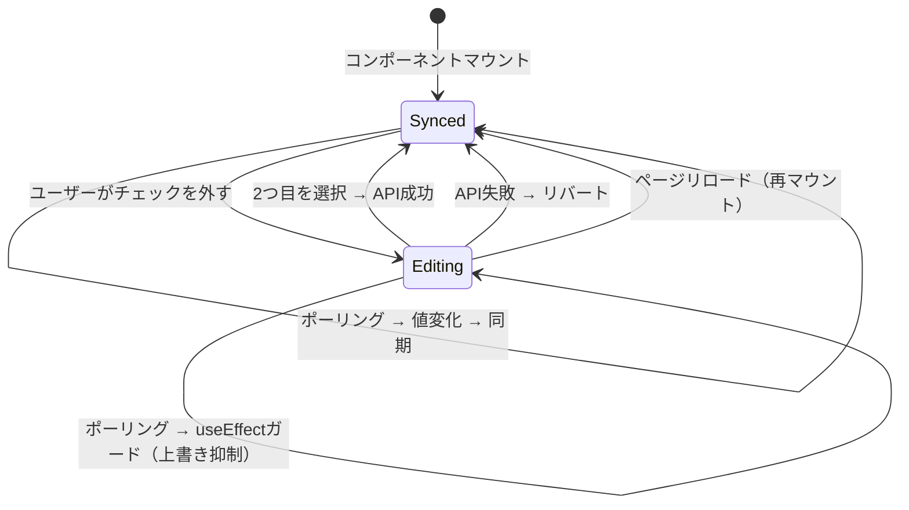
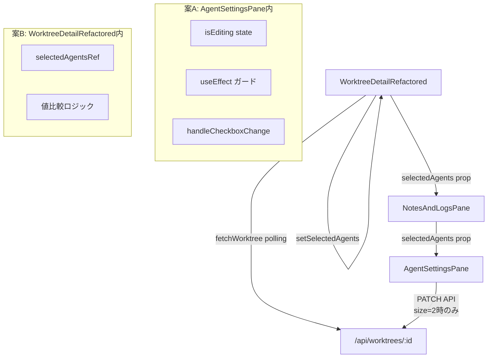

# Issue #391 設計方針書: エージェント選択チェックボックスの自動リチェック修正

## 1. 概要

### 問題
`AgentSettingsPane`のチェックボックスを外すと、ポーリングによるサーバー値の上書きで約2-5秒後に自動で再チェックされる。

### 根本原因
1. チェックを外すと選択数が1になりPATCH APIが呼ばれない（`handleCheckboxChange` L152: 選択数=2の時のみ）
2. ポーリングで`fetchWorktree()`が`if (data.selectedAgents)`条件付きで、**値の等値チェックなしに**`setSelectedAgents()`を呼ぶ（L1035-1036）。参照が毎回新しく生成されるためuseEffectが不要発火する
3. `useEffect`（L98-100）が`selectedAgents` prop変更で`checkedIds`を無条件上書き

### 修正方針
案A（isEditingフラグ）と案B（selectedAgents同一値チェック）の組み合わせにより、中間状態の保護と不要な再レンダリング防止を実現する。

## 2. アーキテクチャ設計

### 状態フロー図



### 修正対象コンポーネント図



## 3. 詳細設計

### 3-1. 案A: isEditingフラグによるuseEffectガード

**変更ファイル**: `src/components/worktree/AgentSettingsPane.tsx`

> **[S1-001] DRYパターン注記**: このisEditingガードパターンは、contextWindowInput（blur契機）と同種の問題を解決する。どちらも「ローカル状態での編集中はprop同期を抑制し、完了時にAPI保存する」というOptimistic Syncパターンである。将来3箇所以上になった場合は`useOptimisticSync`カスタムフックへの抽出を検討する。

#### 新規state
```typescript
const [isEditing, setIsEditing] = useState(false);
```

#### useEffect修正（L98-100）
```typescript
// Before
useEffect(() => {
  setCheckedIds(new Set(selectedAgents));
}, [selectedAgents]);

// After
useEffect(() => {
  if (!isEditing) {
    setCheckedIds(new Set(selectedAgents));
  }
}, [selectedAgents, isEditing]);
```

#### handleCheckboxChange修正（L141-176）

**Before（既存コード）**:
```typescript
const handleCheckboxChange = useCallback(
  async (toolId: CLIToolType, checked: boolean) => {
    const next = new Set(checkedIdsRef.current);
    if (checked) {
      next.add(toolId);
    } else {
      next.delete(toolId);
    }
    setCheckedIds(next);

    if (next.size === MAX_SELECTED_AGENTS) {
      const pair = Array.from(next) as [CLIToolType, CLIToolType];
      setSaving(true);
      try {
        const response = await fetch(`/api/worktrees/${worktreeId}`, {
          method: 'PATCH',
          headers: { 'Content-Type': 'application/json' },
          body: JSON.stringify({ selectedAgents: pair }),
        });
        if (response.ok) {
          onSelectedAgentsChange(pair);
        } else {
          setCheckedIds(new Set(selectedAgents));
        }
      } catch {
        setCheckedIds(new Set(selectedAgents));
      } finally {
        setSaving(false);
      }
    }
  },
  [worktreeId, selectedAgents, onSelectedAgentsChange]
);
```

**After（修正後）**:

> **注記**: 既存の`checkedIdsRef`（L94-95）を引き続き使用する。

```typescript
const handleCheckboxChange = useCallback(
  async (toolId: CLIToolType, checked: boolean) => {
    const next = new Set(checkedIdsRef.current);
    if (checked) {
      next.add(toolId);
    } else {
      next.delete(toolId);
      setIsEditing(true); // 中間状態開始
    }
    setCheckedIds(next);

    if (next.size === MAX_SELECTED_AGENTS) {
      const pair = Array.from(next) as [CLIToolType, CLIToolType];
      setSaving(true);
      try {
        const response = await fetch(`/api/worktrees/${worktreeId}`, {
          method: 'PATCH',
          headers: { 'Content-Type': 'application/json' },
          body: JSON.stringify({ selectedAgents: pair }),
        });
        if (response.ok) {
          setCheckedIds(new Set(pair)); // [S1-002] isEditing解除前にローカル状態を確定値で更新
          onSelectedAgentsChange(pair);
        } else {
          setCheckedIds(new Set(selectedAgents));
        }
      } catch {
        setCheckedIds(new Set(selectedAgents));
      } finally {
        setSaving(false);
        setIsEditing(false); // 操作完了（成功/失敗いずれも）
      }
    }
  },
  [worktreeId, selectedAgents, onSelectedAgentsChange]
);
```

#### 設計決定事項

| 決定事項 | 選択 | 理由 |
|---------|------|------|
| isEditingタイムアウト | なし | ユーザーが検討中に勝手にリセットされるのは混乱を招く |
| リセット契機 | API完了時 / 再マウント時 | finallyで確実にリセット。再マウントはuseState初期値falseで自動 |
| チェック追加時のisEditing設定 | しない | チェック追加で選択数=2ならAPIが呼ばれるため中間状態にならない |
| [S1-006] handleCheckboxChangeの依存配列にisEditingを含めない | 除外 | setIsEditingはuseStateのsetterで安定参照。isEditing値自体をコールバック内で読み取らないため不要 |

#### [S1-007] 既知制限

isEditing=trueの間はポーリングによるサーバー同期が停止する。ユーザーがチェックを1つ外した状態で長時間放置した場合、サーバー側の変更（別ブラウザや直接DB変更）は反映されない。この状態はページリロード/再マウントで自動解消される。この制限は設計上の判断（タイムアウトなし）に起因し、YAGNIの原則に基づきタイムアウトの追加は行わない。

**[S3-005] 自然な回復パス**: Agentサブタブから他のサブタブ（Notes/Logs）に切り替えた際、AgentSettingsPaneがアンマウントされるため、isEditingがuseState初期値falseで自動リセットされる。実用上、長時間の中間状態残留はこの動作により解消される（NotesAndLogsPane.tsxの条件付きレンダリングによる自然なリセット）。同様に、マルチタブ/マルチウィンドウシナリオでも、isEditing=true中は他タブからの変更がポーリングで反映されないが、サブタブ切り替えにより自然にリセットされる。

### 3-2. 案B: selectedAgents同一値チェック

**変更ファイル**: `src/components/worktree/WorktreeDetailRefactored.tsx`

#### 新規ref
```typescript
// selectedAgentsの最新値をrefで保持（fetchWorktreeのuseCallback依存配列に影響しない）
const selectedAgentsRef = useRef(selectedAgents);
useEffect(() => {
  selectedAgentsRef.current = selectedAgents;
}, [selectedAgents]);
```

#### fetchWorktree修正（L1034-1037）
```typescript
// Before
if (data.selectedAgents) {
  setSelectedAgents(data.selectedAgents);
}

// After
if (data.selectedAgents) {
  const current = selectedAgentsRef.current;
  const isSame = data.selectedAgents.length === current.length &&
    data.selectedAgents.every((v: string, i: number) => v === current[i]);
  if (!isSame) {
    setSelectedAgents(data.selectedAgents);
  }
}
```

#### 設計決定事項

| 決定事項 | 選択 | 理由 |
|---------|------|------|
| 比較方法 | 要素順序込み個別比較 | JSON.stringifyより高速。配列順序は意味を持つ（タブ表示順） |
| useCallback依存配列 | 変更なし（`[worktreeId]`のまま） | useRefパターンにより依存不要 |
| 副次効果 | activeCliTab同期の発火頻度減少 | 同一値時にsetSelectedAgentsがスキップされるため。機能的に正しい動作 |
| [S3-001] スコープ限定 | selectedAgentsのみ対象 | vibeLocalContextWindow/vibeLocalModelはユーザーが直接値を変更するため、ポーリングによる上書き問題が発生しにくい。vibeLocalContextWindowはblur契機でAPI保存されるため中間状態が短く、selectedAgentsと同パターンの問題が顕在化しにくい。将来的に問題が発生した場合は同一値チェックの追加を検討するが、今回はスコープ外とする |

> **[S1-008] 将来の抽出検討**: 現時点ではインライン実装で問題ないが、将来的に同パターンの配列比較が繰り返される場合は、`src/lib/utils.ts`に`arraysEqual()`汎用比較関数を抽出することを検討する。

## 4. テスト設計

### 4-1. 既存テスト更新

**ファイル**: `tests/unit/components/worktree/AgentSettingsPane.test.tsx`

- L62-80「should sync checked state when selectedAgents prop changes」→ `isEditing=false`前提を追加

### 4-2. 追加テストケース

| # | テストケース | 検証内容 |
|---|------------|---------|
| T1 | isEditing中のprop変更無視 | チェックを外した後、selectedAgents propが変更されてもcheckedIdsが上書きされない |
| T2 | isEditing解除後の同期 | 2つ選択完了後、次のselectedAgents prop変更が正しく同期される。[S1-002] isEditing解除タイミングでuseEffectが古いselectedAgentsで発火しないことを検証する（setCheckedIds(new Set(pair))による明示的な確定値設定が機能していること）。**[S2-005]** isEditingは内部stateのため直接検査不可。setCheckedIdsの呼び出し順序（API成功時にpair設定 -> finallyのisEditingリセット順）をuseStateのモック等で外部から間接検証する。具体的にはrerenderでselectedAgents propを変更した際にcheckedIdsが正しく同期されることを外部振る舞いとして検証する |
| T3 | API失敗時のリバート＋isEditingリセット | API失敗でcheckedIdsリバート、isEditingがfalseにリセット |
| T4 | ネットワークエラー時のリバート＋isEditingリセット | catch節でリバート＋isEditingリセット |

### 4-3. テスト対象外

- `WorktreeDetailRefactored`のユニットテスト: 既存テスト不在のため今回は対象外。AgentSettingsPane統合テストで間接検証。

## 5. 影響範囲

| ファイル | 変更種別 | 内容 |
|---------|---------|------|
| `src/components/worktree/AgentSettingsPane.tsx` | 修正 | isEditing state追加、useEffectガード、handleCheckboxChange修正 |
| `src/components/worktree/WorktreeDetailRefactored.tsx` | 修正 | selectedAgentsRef追加、fetchWorktree内値比較ロジック |
| `tests/unit/components/worktree/AgentSettingsPane.test.tsx` | 修正 | 既存テスト更新＋新規テストケース追加 |
| `src/components/mobile/MobileContent.tsx` | 影響なし | モバイルレイアウトでAgentSettingsPaneを表示。selectedAgents propsの透過的中継のみでコード変更不要。案Bの同一値チェックによりモバイルでも不要な再レンダリングが抑制される [S3-003] |

### Props/API変更: なし

`AgentSettingsPaneProps`インターフェース、PATCH APIエンドポイント、DBスキーマのいずれも変更不要。

## 6. セキュリティ設計

本修正はクライアントサイドの状態管理ロジックのみの変更であり、セキュリティ上の新規リスクはない。

- 入力値バリデーション: 変更なし（既存のPATCH APIバリデーションで担保）
- XSS: 変更なし（表示名はtext nodeとしてレンダリング、R4-006準拠）

### OWASP Top 10評価（Stage 4セキュリティレビュー）

| OWASP カテゴリ | 評価 | 根拠 |
|---|---|---|
| A01: Access Control | PASS | isEditingはReact内部状態。認証ミドルウェア（middleware.ts）はisEditing状態とは独立して動作し、PATCH APIへの全リクエストに対してトークン認証・IP制限を適用する |
| A03: Injection | PASS | selectedAgentsはサーバーサイドのvalidateSelectedAgentsInput()で(1)Array.isArray、(2)length===2、(3)CLI_TOOL_IDSへのincludes、(4)重複チェックを実施。クライアントサイドのworktreeIdテンプレートリテラルも/^[a-zA-Z0-9_-]+$/パターンでバリデーション済み |
| A04: Insecure Design | PASS | 中間状態（isEditing=true）はUI表示のみに影響し、サーバーデータへの悪用経路なし。API成功時にselectedAgentsを確定値で更新し、失敗時にリバートする二重防御 |
| A08: Integrity | PASS | API成功時にsetCheckedIds(new Set(pair))でローカル状態を確定値に更新してから、onSelectedAgentsChangeを呼び出し。失敗時にリバート。これにより、クライアント-サーバー間の整合性を維持 |

## 7. パフォーマンス設計

案Bの同一値チェックにより、以下のパフォーマンス改善が期待される：

- selectedAgentsが変化していない場合の`setSelectedAgents()`呼び出しスキップ
- 結果として`AgentSettingsPane`のuseEffect発火回数減少、不要な再レンダリング抑制

追加コスト:
- useRef 1つ追加（メモリ影響: 無視可能）
- 配列比較（毎ポーリング2要素比較: 無視可能）

## 8. 代替案との比較

| 案 | メリット | デメリット | 採否 |
|----|---------|-----------|------|
| A+B組み合わせ（採用） | 中間状態保護＋不要更新防止の二重防御 | 変更箇所が2ファイル | **採用** |
| Aのみ | 単一ファイル変更で完結 | ポーリングごとの不要なprop更新は継続 | 不採用 |
| Bのみ | 不要更新を根本的に防止 | ユーザー操作中にサーバー側で別ユーザーが変更した場合の衝突未対応 | 不採用 |
| デバウンス方式 | 実装がシンプル | タイミング依存で信頼性が低い | 不採用 |

> **[S1-003] 二重防御の判断根拠**: シングルユーザー前提では案Bのみで十分だが、防御的プログラミングとして案Aも併用する。実装コストが低い（isEditing state 1つ + useEffectガード条件1行）ため、二重防御を採用する。

## 9. レビュー履歴

| Stage | レビュー名 | 日付 | 結果 | スコア |
|-------|-----------|------|------|--------|
| 1 | 通常レビュー（設計原則） | 2026-03-02 | 条件付き承認 | 4/5 |
| 2 | 整合性レビュー | 2026-03-02 | 条件付き承認 | high |
| 3 | 影響分析レビュー | 2026-03-02 | 条件付き承認 | 4/5 |
| 4 | セキュリティレビュー | 2026-03-02 | 承認 | 5/5 |

## 10. レビュー指摘事項サマリー

### Stage 1: 通常レビュー

**Must Fix**: 0件
**Should Fix**: 4件（全件反映済み）
**Nice to Have**: 4件（2件反映済み、2件は設計承認のため対応不要）

| ID | 重要度 | 原則 | タイトル | ステータス | 反映先セクション |
|----|--------|------|---------|-----------|----------------|
| S1-001 | should_fix | DRY | isEditing/contextWindowInputパターンの類似性コメント | 反映済み | 3-1 |
| S1-002 | should_fix | React | isEditing解除タイミングのエッジケース対応 | 反映済み | 3-1, 4-2 |
| S1-003 | nice_to_have | KISS | 二重防御の判断根拠を明記 | 反映済み | 8 |
| S1-004 | nice_to_have | SRP | isEditing状態の責務配置は適切 | 対応不要 | - |
| S1-005 | nice_to_have | OCP | 既存インターフェース変更なし - OCP準拠 | 対応不要 | - |
| S1-006 | should_fix | React | useCallback依存配列からisEditing除外の理由明記 | 反映済み | 3-1 |
| S1-007 | should_fix | YAGNI | isEditing=trueの既知制限を文書化 | 反映済み | 3-1 |
| S1-008 | nice_to_have | DIP | arraysEqual将来抽出の検討コメント | 反映済み | 3-2 |

### Stage 2: 整合性レビュー

**Must Fix**: 1件（反映済み）
**Should Fix**: 3件（全件反映済み）
**Nice to Have**: 4件（S2-002注記反映済み、S2-004/S2-006/S2-008は設計品質確認のため対応不要）

| ID | 重要度 | カテゴリ | タイトル | ステータス | 反映先セクション |
|----|--------|---------|---------|-----------|----------------|
| S2-001 | should_fix | code_mismatch | handleCheckboxChange修正にBefore/After対比を追加 | 反映済み | 3-1 |
| S2-002 | nice_to_have | code_mismatch | checkedIdsRef（L94-95）の注記追加 | 反映済み | 3-1 |
| S2-003 | must_fix | code_mismatch | 根本原因の記述精度向上（条件付き・等値チェックなし） | 反映済み | 1 |
| S2-004 | nice_to_have | internal_inconsistency | API失敗時リバートフローの冗長発火は副作用なし | 対応不要 | - |
| S2-005 | should_fix | internal_inconsistency | T2テストケースのisEditing内部状態検証方針を明確化 | 反映済み | 4-2 |
| S2-006 | nice_to_have | convention | CLAUDE.md規約との整合性は良好 | 対応不要 | - |
| S2-007 | should_fix | internal_inconsistency | 案BのuseEffect依存配列`[selectedAgents]`を明記 | 反映済み | 11 |
| S2-008 | nice_to_have | internal_inconsistency | NotesAndLogsPane.tsxはprops中継のみでコード変更不要 | 対応不要 | - |

### Stage 3: 影響分析レビュー

**Must Fix**: 0件
**Should Fix**: 2件（全件反映済み）
**Nice to Have**: 4件（S3-003反映済み、S3-002/S3-004/S3-006は設計品質確認のため対応不要）

| ID | 重要度 | カテゴリ | タイトル | ステータス | 反映先セクション |
|----|--------|---------|---------|-----------|----------------|
| S3-001 | should_fix | state_impact | vibeLocalContextWindow/vibeLocalModelへの同一値チェック適用範囲の明確化 | 反映済み | 3-2 |
| S3-002 | nice_to_have | test_impact | WorktreeDetailRefactored案Bの間接テスト戦略の明確化 | 対応不要 | - |
| S3-003 | nice_to_have | component_impact | モバイルレイアウトのMobileContent経由のprops中継を影響範囲に追記 | 反映済み | 5 |
| S3-004 | nice_to_have | performance | memo()ラッパーとの相互作用の確認 | 対応不要 | - |
| S3-005 | should_fix | state_impact | サブタブ切り替えによるisEditingリセット（自然な回復パス）を文書化 | 反映済み | 3-1 |
| S3-006 | nice_to_have | state_impact | マルチタブ/マルチウィンドウでのselectedAgents競合シナリオ | 対応不要 | - |

### Stage 4: セキュリティレビュー

**Must Fix**: 0件
**Should Fix**: 0件
**Nice to Have**: 3件（全件対応不要）

| ID | 重要度 | OWASP | タイトル | ステータス | 反映先セクション |
|----|--------|-------|---------|-----------|----------------|
| S4-001 | nice_to_have | A04 | isEditing中間状態のセキュリティ上の影響は限定的であることの明記 | 対応不要 | - |
| S4-002 | nice_to_have | A03 | クライアントサイドのworktreeIdテンプレートリテラル注入リスクの確認 | 対応不要 | - |
| S4-003 | nice_to_have | A08 | selectedAgents配列のクライアント-サーバー間整合性担保 | 対応不要 | - |

## 11. 実装チェックリスト

### 案A: AgentSettingsPane修正
- [ ] `isEditing` state追加（`useState(false)`）
- [ ] useEffect内に`if (!isEditing)`ガード条件追加
- [ ] handleCheckboxChange内: チェック解除時に`setIsEditing(true)`設定
- [ ] handleCheckboxChange内: API成功時に`setCheckedIds(new Set(pair))`を`onSelectedAgentsChange`前に呼び出し [S1-002]
- [ ] handleCheckboxChange内: finally節で`setIsEditing(false)`設定
- [ ] useCallback依存配列にisEditingを含めないこと確認 [S1-006]

### 案B: WorktreeDetailRefactored修正
- [ ] `selectedAgentsRef` useRef追加
- [ ] selectedAgents同期用useEffect追加（依存配列: `[selectedAgents]`）[S2-007]
- [ ] fetchWorktree内: 配列比較ロジック追加（要素順序込み個別比較）
- [ ] 同一値の場合setSelectedAgentsをスキップ

### テスト
- [ ] T1: isEditing中のprop変更無視テスト
- [ ] T2: isEditing解除後の同期テスト（タイミング検証含む）[S1-002]
- [ ] T3: API失敗時のリバート＋isEditingリセットテスト
- [ ] T4: ネットワークエラー時のリバート＋isEditingリセットテスト
- [ ] 既存テスト更新（isEditing=false前提の明記）

---

*Issue #391 設計方針書 - 2026-03-02作成*
*Stage 1レビュー反映 - 2026-03-02*
*Stage 2レビュー反映 - 2026-03-02*
*Stage 3レビュー反映 - 2026-03-02*
*Stage 4レビュー反映 - 2026-03-02*
