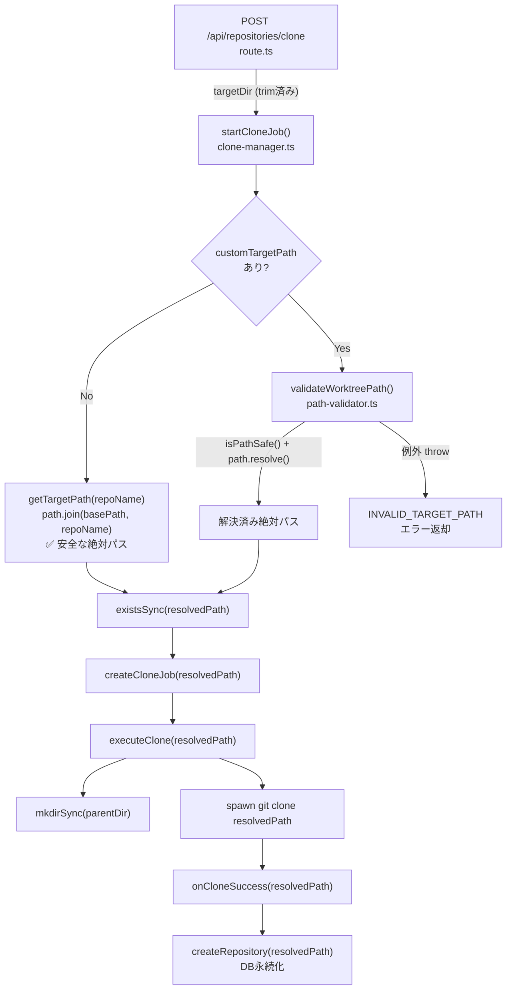

# 設計方針書: Issue #392 Clone Target Path Validation Bypass Fix

## 1. 概要

### 対象Issue
- **Issue #392**: security: clone target path validation bypass allows repositories outside CM_ROOT_DIR
- **重要度**: High（セキュリティ脆弱性）

### 問題の本質
`POST /api/repositories/clone` で `customTargetPath` を `isPathSafe()` で検証後、カノニカル化（`path.resolve(basePath, customTargetPath)`）せずに `git clone` に渡しているため、相対パスが `process.cwd()` から解決され、`CM_ROOT_DIR` 外にクローンできる。

### 修正スコープ
| ファイル | 変更内容 |
|---------|---------|
| `src/lib/clone-manager.ts` | `startCloneJob()` のパス検証・解決ロジック修正（L336-343付近） |
| `src/app/api/repositories/clone/route.ts` | `targetDir` の `trim()` 追加（L96） |
| `tests/unit/lib/clone-manager.test.ts` | 相対パステストケース追加 |

## 2. アーキテクチャ設計

### 変更箇所のデータフロー



### レイヤー構成（変更対象のみ）

| レイヤー | ファイル | 変更内容 |
|---------|---------|---------|
| プレゼンテーション | `route.ts` | 入力サニタイズ（`trim()`） |
| ビジネスロジック | `clone-manager.ts` | パス検証・解決ロジック |
| ユーティリティ | `path-validator.ts` | **変更なし**（既存の `validateWorktreePath()` を使用） |

## 3. 技術選定

### 設計選択: Option A（validateWorktreePath 活用）を採用

| 比較項目 | Option A: validateWorktreePath | Option B: 手動 path.resolve |
|---------|-------------------------------|---------------------------|
| 安全性 | ✅ 検証+カノニカル化が一関数内で原子的 | ⚠️ 検証と解決が分離、TOCTOU リスク |
| DRY原則 | ✅ 既存関数を再利用 | ❌ isPathSafe + path.resolve を手動で組み合わせ |
| 保守性 | ✅ パス検証ロジックの一元管理 | ❌ 検証ロジックが分散 |
| エラー処理 | ⚠️ 例外→CloneResult 変換が必要 | ✅ 既存パターンに合致 |
| 情報漏洩 | ⚠️ D4-001対応（例外メッセージにrootDir含む）| ✅ 既存エラーメッセージ |

**選定理由**: 安全性・DRY原則を優先。エラー処理の不整合はヘルパー関数で解決可能。

### 採用しない案
- **Option B（手動 path.resolve）**: isPathSafe() と path.resolve() が分離されることで、将来的に片方だけ修正する不整合リスクがある。validateWorktreePath が既に存在し、同じことを単一関数で行うため採用しない。

## 4. 設計パターン

### 4-1. ヘルパー関数パターン（例外→CloneResult変換）

`validateWorktreePath()` の例外ベースエラーを既存の boolean/null チェックパターンに合わせるため、ヘルパー関数を導入する。

```typescript
/**
 * Resolve and validate a custom target path.
 * Returns the resolved absolute path, or null if the path is invalid.
 *
 * [D1-001] Wraps validateWorktreePath() to maintain consistency with
 * the existing boolean/null error pattern used throughout startCloneJob().
 * [D4-001] Exception messages from validateWorktreePath() contain rootDir
 * values and must not be exposed to clients.
 *
 * @internal
 */
function resolveCustomTargetPath(
  customTargetPath: string,
  basePath: string
): string | null {
  try {
    return validateWorktreePath(customTargetPath, basePath);
  } catch {
    // [S1-001] Log rejection for attack detection and debugging.
    // Use a fixed message string to avoid leaking rootDir from exception messages.
    console.warn('[CloneManager] Invalid custom target path rejected');
    return null;
  }
}
```

> **[S2-002] 注記**: 上記コード例は設計パターンの概念説明用であり、`export` キーワードを省略している。実装時はセクション 5-2b の定義（`export function resolveCustomTargetPath(...)`）に従うこと。

**設計根拠**:
- **D1-001（エラー処理整合性）**: `startCloneJob()` 内の他の検証（`validateCloneRequest`, `checkDuplicateRepository` 等）は boolean/null パターンを使用。ヘルパー関数で例外を吸収し、同一パターンに統一する。
- **D4-001（情報漏洩防止）**: `validateWorktreePath()` の例外メッセージ（rootDir含む）がクライアントに漏洩しないよう、catch で握り潰す。

### 4-2. 関数配置

`resolveCustomTargetPath()` は `clone-manager.ts` のモジュールスコープ関数として配置する。

**理由**:
- 使用箇所が `CloneManager.startCloneJob()` のみ
- `path-validator.ts` に追加すると、`clone-manager.ts` 固有のエラーハンドリング規約が別モジュールに漏洩する
- `@internal` export としてテストからアクセス可能にする

## 5. 変更詳細設計

### 5-1. route.ts の変更

**ファイル**: `src/app/api/repositories/clone/route.ts`
**行**: L96

```typescript
// Before
const result = await cloneManager.startCloneJob(cloneUrl.trim(), targetDir);

// After
const trimmedTargetDir = targetDir?.trim() || undefined;
// [S1-003] DoS defense: reject excessively long targetDir values.
// Consistent with existing patterns (schedule-config.ts MAX_NAME_LENGTH, cmate-parser.ts NAME_PATTERN).
if (trimmedTargetDir && trimmedTargetDir.length > 1024) {
  return NextResponse.json(
    { error: 'Target directory path is too long' },
    { status: 400 }
  );
}
const result = await cloneManager.startCloneJob(cloneUrl.trim(), trimmedTargetDir);
```

**設計根拠**:
- `cloneUrl.trim()` と同等の入力サニタイズ
- `trim()` 結果が空文字の場合 `undefined` にフォールバック（`customTargetPath` 未指定と同じ動作）
- [S1-003] `targetDir` の長さ制限（1024文字）を追加。非常に長いパス文字列による `path.resolve()` や `decodeURIComponent()` での不必要なメモリ消費・処理時間を防御。本プロジェクトの既存 DoS 防御パターン（`schedule-config.ts` の `MAX_NAME_LENGTH`、`cmate-parser.ts` の `NAME_PATTERN`）と整合
- API レスポンスの変更なし（長さ超過時は 400 エラー）
- **[S4-007]** 1024 文字のマジックナンバーを避け、`const MAX_TARGET_DIR_LENGTH = 1024` として `route.ts` の先頭に定義することを推奨する。テストでも同じ定数を参照することで値の整合性を保証できる

### 5-2. clone-manager.ts の変更

**ファイル**: `src/lib/clone-manager.ts`

#### 5-2a. import 追加

```typescript
// Before
import { isPathSafe } from './path-validator';

// After
import { validateWorktreePath } from './path-validator';
```

**注意**: [S1-004] `isPathSafe()` の直接呼び出し箇所は `startCloneJob()` の L341 のみであることを確認済み。修正後は `validateWorktreePath()` 経由での間接使用のみとなるため、`isPathSafe` の import を明示的に削除する。ESLint の unused import 検出に委任せず、設計決定として削除を明記する。

#### 5-2b. ヘルパー関数追加

`CloneManager` クラス定義直前（L193以前、`resetWorktreeBasePathWarning()` の直後かつクラスの JSDoc コメントの前）にモジュールスコープ関数として追加:

```typescript
/**
 * Resolve and validate a custom target path.
 * Returns the resolved absolute path, or null if the path is invalid.
 *
 * [D1-001] Wraps validateWorktreePath() to maintain consistency with
 * the existing boolean/null error pattern used throughout startCloneJob().
 * [D4-001] Exception messages from validateWorktreePath() contain rootDir
 * values and must not be exposed to clients.
 *
 * @internal
 */
export function resolveCustomTargetPath(
  customTargetPath: string,
  basePath: string
): string | null {
  try {
    return validateWorktreePath(customTargetPath, basePath);
  } catch {
    // [S1-001] Log rejection for attack detection and debugging.
    // Use a fixed message string to avoid leaking rootDir from exception messages.
    console.warn('[CloneManager] Invalid custom target path rejected');
    return null;
  }
}
```

#### 5-2c. startCloneJob() のパス処理修正

```typescript
// Before (L336-343)
// 4. Determine target path
const targetPath = customTargetPath || this.getTargetPath(repoName);

// 4.1. Validate target path (prevent path traversal)
// [D4-001] Use default error message to avoid leaking basePath value
if (customTargetPath && !isPathSafe(customTargetPath, this.config.basePath!)) {
  return { success: false, error: ERROR_DEFINITIONS.INVALID_TARGET_PATH };
}

// After
// 4. Determine target path
// [D1-002] When customTargetPath is provided, validate AND resolve to absolute path
// using resolveCustomTargetPath() to prevent relative path bypass (Issue #392).
let targetPath: string;
if (customTargetPath) {
  const resolved = resolveCustomTargetPath(customTargetPath, this.config.basePath!);
  if (!resolved) {
    // [D4-001] Use default error message to avoid leaking basePath value
    return { success: false, error: ERROR_DEFINITIONS.INVALID_TARGET_PATH };
  }
  targetPath = resolved;
} else {
  targetPath = this.getTargetPath(repoName);
}
```

**設計根拠**:
- **D1-002（検証と解決の統合）**: `isPathSafe()` の boolean 検証と `path.resolve()` のカノニカル化を `validateWorktreePath()` 経由で単一ステップに統合。
- `targetPath` は以降のすべての処理（`existsSync`, `createCloneJob`, `executeClone`, `onCloneSuccess`）で解決済み絶対パスとして使用される。
- `executeClone()`, `onCloneSuccess()` のコード変更は不要（引数の値が変わるだけ）。
- **[S4-003] mkdirSync の basePath 検証について**: `validateWorktreePath()` で解決済み絶対パスを得た後、`executeClone()` 内の `mkdirSync(parentDir, { recursive: true })` も同一の解決済みパスを使用するため、`basePath` 内に限定される。defense-in-depth として `executeClone()` 内での追加 `basePath` 検証は実施しない（変更スコープ最小化のため）。`validateWorktreePath()` にバイパスが存在した場合のリスクは S4-001 の実証テストで検証する。

## 6. セキュリティ設計

### 6-1. 脆弱性の修正

| 脆弱性 | 修正前 | 修正後 |
|--------|-------|-------|
| 相対パスバイパス | `isPathSafe()` 検証後、未解決パスで `git clone` 実行 | `validateWorktreePath()` で検証+カノニカル化を原子的に実行 |
| 入力サニタイズ不備 | `targetDir` が `trim()` されない | `targetDir?.trim() \|\| undefined` |

### 6-2. 情報漏洩防止（D4-001）

- `validateWorktreePath()` の例外メッセージには `rootDir` が含まれる
- `resolveCustomTargetPath()` ヘルパーで例外を catch し、`ERROR_DEFINITIONS.INVALID_TARGET_PATH`（固定メッセージ）を返却
- クライアントにはサーバーのディレクトリ構造を一切公開しない

### 6-3. 攻撃ベクトルの遮断

| 攻撃パターン | 対応 |
|-------------|------|
| 相対パス (`"tmp-escape"`) | `path.resolve(basePath, "tmp-escape")` → `basePath` 内の絶対パスに解決 |
| パストラバーサル (`"../escape"`) | `isPathSafe()` 内の `relative.startsWith('..')` チェックで拒否 |
| 空白付きパス (`"  my-repo  "`) | `route.ts` の `trim()` で前後空白除去 |
| null バイト (`"repo\x00/../etc"`) | `isPathSafe()` 内の null バイトチェックで拒否 |
| URL エンコード (`"repo%2f..%2fetc"`) | `isPathSafe()` 内の `decodeURIComponent()` で展開後にチェック |
| シンボリックリンク攻撃 (`targetDir` がシンボリックリンク先を指す場合) | [S4-002] `validateWorktreePath()` は `path.resolve()` でシンボリックリンクを解決しないため、`lstatSync()` ベースの検証は行わない。ただし `existsSync(targetPath)` によるディレクトリ存在チェックで、既存シンボリックリンクへの上書きは防御される。新規シンボリックリンク作成は `git clone` の動作に依存する（`git clone` は targetPath にディレクトリを新規作成するため、既存のシンボリックリンクがある場合は clone 自体が失敗する）。リスクは限定的だが、将来的な `realpath` 検証の検討を推奨する。 |

### 6-4. 認証状態による攻撃表面（S4-004）

Issue #392 の脆弱性修正は認証機構の追加ではなく、認証済み（または認証未設定環境の）ユーザーが不正なパスを指定できないようにするものである。認証状態に応じたセキュリティ境界の差異を以下に明記する。

| 認証状態 | 動作 | 攻撃表面 |
|---------|------|---------|
| `CM_AUTH_TOKEN_HASH` **設定済み** | `middleware.ts` がトークン認証を実施。認証済みユーザーのみが clone API にアクセス可能 | 認証済みユーザーによる不正パス指定のみ（本修正で防御） |
| `CM_AUTH_TOKEN_HASH` **未設定** | `middleware.ts` は `NextResponse.next()` を即時返却し、認証なしでのアクセスが可能 | 外部攻撃面に注意。`CM_BIND=127.0.0.1`（デフォルト）によるネットワーク境界での防御に依存。`0.0.0.0` バインド時は `CM_AUTH_TOKEN_HASH` の設定を強く推奨 |

**注意**: 認証未設定環境では、本修正適用後もパストラバーサルは防止されるが、`CM_ROOT_DIR` 内への任意リポジトリクローンが依然として可能である。

## 7. テスト設計

### 7-1. 追加テストケース

| # | テストケース | 入力 | 期待結果 |
|---|-----------|------|---------|
| T-001 | 相対パスが basePath 内に解決される | `customTargetPath="my-repo"`, `basePath="/tmp/repos"` | `success=true`, DB の `targetPath="/tmp/repos/my-repo"` |
| T-002 | ネストされた相対パス | `customTargetPath="nested/deep/repo"` | `success=true`, `targetPath="/tmp/repos/nested/deep/repo"` |
| T-003 | パストラバーサル拒否 | `customTargetPath="../escape"` | `success=false`, `INVALID_TARGET_PATH` |
| T-004 | 既存絶対パステストの後方互換 | `customTargetPath="/tmp/repos/custom/target/path"` | `success=true`, `targetPath="/tmp/repos/custom/target/path"` |
| T-005 | existsSync に解決済みパスが渡される | `customTargetPath="my-repo"` | `vi.mocked(existsSync)` の引数が `"/tmp/repos/my-repo"` |
| T-006 | エラーメッセージに basePath が漏洩しない | `customTargetPath="/etc/passwd"` | `error.message` に `/tmp/repos` が含まれない |

**[S3-006] T-005 および existsSync に関する既存テストへの非影響の補足**:

- 既存テストで `vi.mocked(existsSync).mockReturnValue(false)` を使用しているテストケースは、引数（絶対パス vs 相対パス）に依存せず動作するため影響なし
- 既存テスト 'should reject when target directory already exists'（L197-206）は `customTargetPath` を使用せず `repoName` ベースの `getTargetPath()` 経由であるため、`existsSync` の mock 引数に変化なし
- 既存テスト 'should use custom target path if provided (within basePath)'（L208-225）は `customPath` が既に絶対パスであるため、`validateWorktreePath` の `path.resolve` は同じ値を返し、`existsSync` の mock 引数に変化なし
- T-005 は新規テストとして、相対パス解決後の絶対パスが `existsSync` に渡されることを明示的に検証する

### 7-2. resolveCustomTargetPath ユニットテスト

**[S3-002] テストファイルの import 文**: `resolveCustomTargetPath` は `@internal export` として公開されるため、テストファイルでは以下のように import する:

```typescript
import { CloneManager, CloneManagerError, resetWorktreeBasePathWarning, resolveCustomTargetPath } from '@/lib/clone-manager';
```

| # | テストケース | 入力 | 期待結果 |
|---|-----------|------|---------|
| H-001 | 正常な相対パス | `("my-repo", "/tmp/repos")` | `"/tmp/repos/my-repo"` |
| H-002 | パストラバーサル | `("../escape", "/tmp/repos")` | `null` |
| H-003 | 空文字 | `("", "/tmp/repos")` | `null` |
| H-004 | null バイト | `("repo\x00evil", "/tmp/repos")` | `null` |

### 7-3. route.ts テスト

| # | テストケース | 入力 | 期待結果 |
|---|-----------|------|---------|
| R-001 | targetDir 前後空白除去 | `targetDir="  my-repo  "` | `startCloneJob()` に `"my-repo"` が渡される |
| R-002 | targetDir 空白のみ | `targetDir="   "` | `startCloneJob()` に `undefined` が渡される |

### 7-4. 既存テストへの影響分析（S3-001）

`isPathSafe()` から `validateWorktreePath()` への切り替えに伴う既存テストへの影響を以下の通り確認した。

**結論: 既存テストは変更不要**

- 既存テスト（`tests/unit/lib/clone-manager.test.ts`）では `vi.mock('src/lib/path-validator', ...)` や `isPathSafe` を直接モックしていない（実際の `isPathSafe` を使用）
- `validateWorktreePath()` への切り替え後も、テストの `basePath = '/tmp/repos'` 設定と絶対パス `customPath = '/tmp/repos/custom/target/path'` の組み合わせは引き続き valid と判定されるため、既存テストは変更不要

**技術的根拠**: `validateWorktreePath()` 内部で `path.resolve(basePath, absolutePath)` が呼び出された場合、第2引数が絶対パスであれば `path.resolve()` はそのまま第2引数を返す（Node.js の仕様）。したがって、既存テストの `customPath = '/tmp/repos/custom/target/path'`（絶対パス）は `path.resolve('/tmp/repos', '/tmp/repos/custom/target/path')` により `/tmp/repos/custom/target/path` に解決され、`basePath` 内であることの検証もパスする。テスト作成者はこの内部動作の変化を認識しておく必要があるが、テストコードの修正は不要である。

### 7-5. validateWorktreePath() 安全性実証テスト（S4-001）

`validateWorktreePath()` を「信頼の核（single point of validation）」として採用する本設計において、二重 `decodeURIComponent` によるバイパスリスク（S1-002 で認識済み）が実際に成立しないことを実証的に検証するテストを追加する。**実装に先行してこれらのテストを実行し、安全性を確認すること。**

| # | テストケース | 入力 | 期待結果 |
|---|-----------|------|---------|
| S4-001-T1 | URL 二重エンコードによるパストラバーサル拒否 | `validateWorktreePath('%252e%252e%252fetc', '/home/user')` | 例外 throw（パストラバーサル拒否） |
| S4-001-T2 | 部分 URL エンコードによるパストラバーサル拒否 | `validateWorktreePath('..%2fetc', '/home/user')` | 例外 throw（パストラバーサル拒否） |
| S4-001-T3 | 正常な相対パスの解決 | `validateWorktreePath('normal-repo', '/home/user')` | `'/home/user/normal-repo'` を返す |

**攻撃シナリオ（S4-001-T1 の根拠）**:
1. 入力 `'%252e%252e%252fetc'` に対し、`isPathSafe()` 内の `decodeURIComponent()` で `'%2e%2e%2fetc'` に展開
2. `isPathSafe()` 内の `path.resolve(rootDir, '%2e%2e%2fetc')` はリテラル文字列として rootDir 配下に解決される可能性がある
3. `validateWorktreePath()` の独自 `decodeURIComponent()` で `'../etc'` に展開
4. `path.resolve(rootDir, '../etc')` で rootDir 外にトラバーサルが成立する可能性がある

**S4-001-T1 が失敗した場合（バイパスが成立する場合）**: `validateWorktreePath()` 内の独自 `decodeURIComponent`（L109-113）を削除し、`isPathSafe()` のデコード結果のみを使用するよう修正する必要がある。この修正は Issue #392 のスコープ内で対処するか、先行して別 Issue で修正を完了させてから Issue #392 の修正を適用すること。

## 8. 設計上の決定事項とトレードオフ

| # | 決定事項 | 理由 | トレードオフ |
|---|---------|------|-------------|
| D1-001 | ヘルパー関数で例外→null 変換 | 既存エラーパターン整合性 | 例外情報（エラー種別）が失われる |
| D1-002 | validateWorktreePath 採用 | 検証+解決の原子性、DRY | 微小な間接呼び出しコスト |
| D4-001 | 例外メッセージの握り潰し + console.warn ログ | rootDir 情報漏洩防止。[S1-001] catch ブロック内で `console.warn('[CloneManager] Invalid custom target path rejected')` を出力し、攻撃検知・デバッグ観測性を確保 | ログ出力のオーバーヘッド（無視可能） |
| D5-001 | isPathSafe import を明示的に削除する | [S1-004] `isPathSafe()` の直接呼び出し箇所が `startCloneJob()` L341 のみであることを確認済み。修正後は `validateWorktreePath()` 経由の間接使用のみとなるため、KISS 原則に基づき明示的に削除 | ESLint 任せではなく設計決定として記録 |

## 9. 影響範囲の確認

### 影響あり（コード変更必要）
- `src/lib/clone-manager.ts`: `startCloneJob()` 内パス処理
- `src/app/api/repositories/clone/route.ts`: `targetDir` trim
- `tests/unit/lib/clone-manager.test.ts`: テストケース追加

### [S3-003] 影響あり（テスト追加を検討）
- `tests/integration/` 以下にクローン API の integration テストが存在する場合、以下のテスト追加を検討すること（ファイルの存在確認後に判断）:
  1. `targetDir` に相対パスを送信した場合の拒否テスト
  2. `targetDir` に前後空白を含む値を送信した場合の trim 動作テスト
  3. `targetDir` に長さ制限（1024文字）を超える値を送信した場合の 400 エラーテスト

### 影響なし（コード変更不要）
- `src/lib/path-validator.ts`: 既存関数をそのまま使用
- `src/lib/db-repository.ts`: スキーマ・型変更なし
- `clone-manager.ts` の `executeClone()`, `onCloneSuccess()`, `getCloneJobStatus()`, `cancelCloneJob()`: コード変更不要（引数値のみ変化）
- フロントエンド: `api-client.ts` は `targetDir` を送信していない

### [S2-001] basePath 注入経路と resolveDefaultBasePath() の関係

`CloneManager` の `basePath` は以下の2つの経路で決定される:

1. **外部注入経路（実際の API コールフロー）**: `route.ts` L91-92 で `getEnv().CM_ROOT_DIR` を取得し、`CloneManager` コンストラクタの `config.basePath` として注入する。本設計方針書の修正対象はこの経路である。
2. **resolveDefaultBasePath() フォールバック経路**: `CloneManager` の `resolveDefaultBasePath()` メソッド（clone-manager.ts L222-234）は `CM_ROOT_DIR` を直接参照せず、`WORKTREE_BASE_PATH` -> `process.cwd()` の2段階フォールバックのみを実装している。この経路は `config.basePath` が未指定の場合のデフォルト値生成に使用される。

**CLAUDE.md との差異に関する注記**: CLAUDE.md の `clone-manager.ts` 説明（Issue #308 で追加）では `resolveDefaultBasePath()` の優先順位を `CM_ROOT_DIR/WORKTREE_BASE_PATH/process.cwd()` の3段階と記載しているが、実際には `CM_ROOT_DIR` は `route.ts` から外部注入される構造であり、`resolveDefaultBasePath()` 自体は `WORKTREE_BASE_PATH` -> `process.cwd()` の2段階である。この差異は CLAUDE.md の記述上の不正確さであり、コードベースの動作は正しい。CLAUDE.md の修正は Issue #392 のスコープ外として別途対応を推奨する。

## 10. 制約条件

- **SOLID**: SRP（resolveCustomTargetPath は単一責務）、OCP（既存メソッドの変更を最小限に）
- **KISS**: ヘルパー関数は5行のシンプルなラッパー
- **YAGNI**: Option A に必要な最小限の変更のみ
- **DRY**: `validateWorktreePath()` を再利用し、パス検証ロジックの重複を排除
- **D4-001**: エラーメッセージからサーバー内部情報を漏洩させない

### 10-1. 既知のリスク（Issue #392 スコープ外）

#### [S1-002] validateWorktreePath() の decodeURIComponent 二重適用リスク

`path-validator.ts` の `validateWorktreePath()` は以下の順序で処理を行う:

1. `isPathSafe(inputPath, rootDir)` を呼び出し（内部で `decodeURIComponent(inputPath)` を実行）
2. 自身でも `decodeURIComponent(inputPath)` を実行（L109-113）してから `path.resolve(rootDir, decodedPath)` に渡す

この二段階のデコードにより、URL 二重エンコードされた入力（例: `%252e%252e`）に対して以下のリスクが存在する:

- `isPathSafe()` の 1 回目のデコードで `%2e%2e` になり、安全と判定される
- `validateWorktreePath()` の 2 回目のデコードで `..` に変換され、`path.resolve()` でトラバーサルが発生する可能性がある

**本リスクは Issue #392 のスコープ外である**。`validateWorktreePath()` を信頼の核（single point of validation）として採用する本設計において、上記の既存動作は認識しておくべきリスクとして記録する。対処として `validateWorktreePath()` 内の独自 `decodeURIComponent` を削除し、`isPathSafe()` の結果に委譲するリファクタリングを別 Issue で検討することを推奨する。

**[S4-001] 実装前の安全性実証**: Issue #392 の修正実装に先行して、セクション 7-5 の S4-001-T1 ~ S4-001-T3 テストを実行し、二重デコードバイパスが成立しないことを実証すること。バイパスが成立する場合は、`validateWorktreePath()` の修正を Issue #392 のスコープ内で対処するか、先行して別 Issue で完了させる必要がある。

## 11. テスト設計補足

### [S1-005] H-003 テストケース補足（参考情報）

H-003（空文字入力テスト）について、実際のコードフローでは `route.ts` の `targetDir?.trim() || undefined` 処理により、空文字や空白のみの入力は `undefined` に変換され、`startCloneJob()` では `customTargetPath` が falsy となり `resolveCustomTargetPath()` には到達しない。H-003 テストは `resolveCustomTargetPath()` 単体の防御的テストとして設計されたものであり、統合テスト観点では到達不能パスをテストしていることになるが、防御的プログラミングの観点から有効である。

## 12. レビュー履歴

| Stage | レビュー日 | フォーカス | Must Fix | Should Fix | Nice to Have |
|-------|----------|-----------|----------|------------|-------------|
| Stage 1 | 2026-03-02 | 設計原則（SOLID/KISS/YAGNI/DRY/Security） | 0 | 2 | 3 |
| Stage 2 | 2026-03-02 | 整合性（コード記述正確性/設計書内部整合性/既存コード整合性/CLAUDE.md整合性） | 0 | 2 | 2 |
| Stage 3 | 2026-03-02 | 影響分析（影響範囲/後方互換性/テスト波及/回帰リスク） | 0 | 4 | 3 |
| Stage 4 | 2026-03-02 | セキュリティ（OWASP Top 10 準拠、パストラバーサル実証検証/シンボリックリンク/認証境界） | 1 | 3 | 3 |

## 13. レビュー指摘事項サマリー

| ID | 重要度 | 原則 | タイトル | 反映セクション | ステータス |
|----|--------|------|---------|---------------|-----------|
| S1-001 | should_fix | Security / Defense in Depth | resolveCustomTargetPath() に console.warn ログ追加 | 4-1, 5-2b, 8 (D4-001) | 反映済み |
| S1-002 | should_fix | Security / Defense in Depth | validateWorktreePath() の decodeURIComponent 二重適用リスク記録 | 10-1 | 反映済み（スコープ外注記） |
| S1-003 | nice_to_have | Security / Defense in Depth | route.ts での targetDir 長さ制限（1024文字） | 5-1 | 反映済み |
| S1-004 | nice_to_have | DRY / KISS | isPathSafe import の明示的削除 | 5-2a, 8 (D5-001) | 反映済み |
| S1-005 | nice_to_have | YAGNI / テスト設計 | H-003 空文字テストの到達不能パス注記 | 11 | 反映済み |
| S2-001 | should_fix | doc_alignment | CLAUDE.md の resolveDefaultBasePath() 優先順位記述と実コードの不一致を注記 | 9 | 反映済み（スコープ外注記） |
| S2-002 | should_fix | internal_consistency | セクション4-1と5-2bの export キーワード差異を注記で明示 | 4-1 | 反映済み |
| S2-003 | nice_to_have | internal_consistency | ヘルパー関数配置位置の記述精密化 | 5-2b | 反映済み |
| S2-004 | nice_to_have | code_accuracy | 「直接使用箇所」を「直接呼び出し箇所」に修正 | 5-2a, 8 (D5-001) | 反映済み |
| S3-001 | should_fix | ripple_effect | 既存テストへの影響根拠の明記（path-validator モック構造変更が不要な理由） | 7-4 | 反映済み |
| S3-002 | should_fix | ripple_effect | resolveCustomTargetPath の export がテストインポートに影響 | 7-2 | 反映済み |
| S3-003 | should_fix | missing_coverage | integration テスト（api-clone.test.ts）への影響が未分析 | 9 | 反映済み |
| S3-004 | nice_to_have | missing_coverage | CLAUDE.md の clone-manager.ts 説明に resolveCustomTargetPath() 追加 | 14 | 反映済み（チェックリスト追加） |
| S3-005 | nice_to_have | backward_compatibility | api-client.ts が targetDir を送信しないことの明確化 | - | スキップ（現状記載で十分） |
| S3-006 | should_fix | regression_risk | existsSync 引数変化の既存テストへの非影響を補足 | 7-1 | 反映済み |
| S3-007 | nice_to_have | ripple_effect | executeClone/onCloneSuccess への間接的影響の確認記述が適切 | - | スキップ（現状記載で十分） |
| S4-001 | must_fix | Security (OWASP A01) | validateWorktreePath() の二重 decodeURIComponent バイパスの実証的検証テスト追加 | 7-5, 10-1 | 反映済み |
| S4-002 | should_fix | Security (OWASP A01) | シンボリックリンク攻撃に対する防御の考慮と記載 | 6-3 | 反映済み |
| S4-003 | should_fix | Security (OWASP A01) | executeClone() の mkdirSync が basePath 内に限定される根拠の明記 | 5-2c | 反映済み |
| S4-004 | should_fix | Security (OWASP A05) | CM_AUTH_TOKEN_HASH 未設定時の認証境界の明記 | 6-4 | 反映済み |
| S4-005 | nice_to_have | Security (OWASP A09) | console.warn ログに攻撃者の入力値の一部を含めることの検討 | - | スキップ（D4-001 の固定メッセージ設計で対応済み） |
| S4-006 | nice_to_have | Security (OWASP A03) | git clone への引数インジェクション防御の確認記述 | - | スキップ（validateWorktreePath() が絶対パスを返すため暗黙的に防御済み） |
| S4-007 | nice_to_have | Security (OWASP A05) | targetDir 長さ制限（1024）の定数化推奨 | 5-1 | 反映済み |

## 14. 実装チェックリスト

### Stage 1 レビュー反映分

- [ ] **[S1-001]** `resolveCustomTargetPath()` の catch ブロックに `console.warn('[CloneManager] Invalid custom target path rejected')` を追加
- [ ] **[S1-002]** `validateWorktreePath()` の二重デコードリスクを認識した上で実装（別 Issue でリファクタリング検討）
- [ ] **[S1-003]** `route.ts` で `trimmedTargetDir.length > 1024` の長さ制限チェックを追加
- [ ] **[S1-004]** `clone-manager.ts` から `isPathSafe` の import を明示的に削除し、`validateWorktreePath` のみ import
- [ ] **[S1-005]** H-003 テストケースに防御的テストである旨のコメントを追加

### Stage 3 レビュー反映分

- [ ] **[S3-001]** 既存テスト（clone-manager.test.ts）が変更不要であることを実装時に確認（セクション 7-4 参照）
- [ ] **[S3-002]** テストファイルで `resolveCustomTargetPath` を `@/lib/clone-manager` から import（セクション 7-2 参照）
- [ ] **[S3-003]** `tests/integration/` にクローン API の integration テストが存在する場合、相対パス拒否・trim 動作・長さ制限テストの追加を検討
- [ ] **[S3-004]** CLAUDE.md の `clone-manager.ts` モジュール説明に `resolveCustomTargetPath()` の追加を記録（実装完了後）
- [ ] **[S3-006]** T-005 テストケースで相対パス解決後の絶対パスが `existsSync` に渡されることを検証

### Stage 4 レビュー反映分

- [ ] **[S4-001]** 実装に先行して `validateWorktreePath()` の安全性実証テスト（S4-001-T1 ~ T3）を実行し、二重デコードバイパスが成立しないことを確認する。バイパスが成立する場合は `validateWorktreePath()` の修正を先行して実施する
- [ ] **[S4-002]** シンボリックリンク攻撃パターンが設計方針書に記載されていることを確認（セクション 6-3）
- [ ] **[S4-003]** `executeClone()` 内の `mkdirSync` が `validateWorktreePath()` の解決済みパスを使用し、basePath 内に限定されることを確認（セクション 5-2c）
- [ ] **[S4-004]** `CM_AUTH_TOKEN_HASH` 未設定時の認証境界をチームで認識（セクション 6-4）
- [ ] **[S4-007]** `route.ts` の `targetDir` 長さ制限を `const MAX_TARGET_DIR_LENGTH = 1024` として定数化する

---

*Generated by design-policy command for Issue #392*
