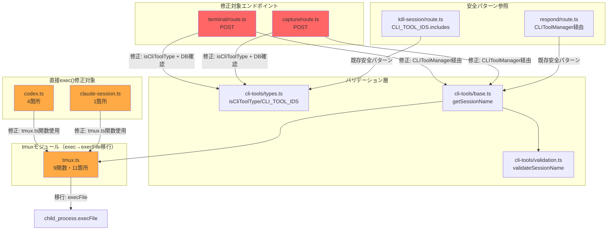

# Issue #393 設計方針書: セキュリティ修正 - RCE/シェルインジェクション防止

## 1. 概要

### 対象Issue
- **Issue番号**: #393
- **タイトル**: security: authenticated RCE and shell injection via /api/worktrees/[id]/terminal
- **重要度**: Critical（認証無効時）/ High（認証有効時）

### 修正目的
`terminal/route.ts` と `capture/route.ts` のシェルインジェクション脆弱性を修正し、`tmux.ts` モジュール全体の `exec()` → `execFile()` 移行により根本的な防御を実現する。

### スコープ
1. エンドポイントレベルの入力バリデーション追加
2. `tmux.ts` の `exec()` → `execFile()` 移行（全9関数、exec()呼び出し11箇所）[R2F002]
3. `codex.ts` / `claude-session.ts` の直接 `exec()` 呼び出し統一
4. テスト追加

---

## 2. アーキテクチャ設計

### 修正対象の構成図



### 修正レイヤー構成

| レイヤー | 修正内容 | ファイル |
|---------|---------|---------|
| **L1: エンドポイント** | cliToolIdバリデーション、worktreeId DB確認、セッション自動作成制限 | terminal/route.ts, capture/route.ts |
| **L2: tmuxモジュール** | exec()→execFile()移行（全9関数、exec()呼び出し11箇所） | tmux.ts |
| **L3: CLI実装** | 直接exec()呼び出しをtmux.ts関数に統一 | codex.ts, claude-session.ts |
| **L4: テスト** | 新規テスト追加、既存テストのモック変更 | tests/unit/ |

---

## 3. 設計方針

### D1: エンドポイントバリデーション（terminal/route.ts, capture/route.ts）

#### D1-001: cliToolId ランタイムバリデーション
- `isCliToolType()` 型ガード（`src/lib/cli-tools/types.ts`）を使用
- 無効値は 400 Bad Request を返す
- 参照: `kill-session/route.ts:37-46` の既存安全パターン

```typescript
// Before (脆弱)
const sessionName = getSessionName(params.id, cliToolId as CLIToolType);

// After (安全)
if (!isCliToolType(cliToolId)) {
  return NextResponse.json(
    { error: 'Invalid cliToolId parameter' },
    { status: 400 }
  );
}
```

- **[R4F006] エラーメッセージへのユーザー入力値埋め込み禁止**: バリデーションエラーレスポンスには固定文字列のみを使用し、ユーザー入力値（`cliToolId`）をエラーメッセージに埋め込まないこと。理由: (1) ログインジェクション防止 - `console.error` 経由でログに書き込まれた場合、制御文字を含む攻撃文字列がログビューアの解釈に影響する。(2) XSS リスク軽減 - JSON レスポンスの `error` フィールドにユーザー入力がそのまま含まれ、フロントエンドが `dangerouslySetInnerHTML` 等で表示した場合のリスクを排除する。`kill-session/route.ts` の固定文字列エラーパターンに合わせること。
- **適用範囲**: terminal/route.ts および capture/route.ts の `isCliToolType()` バリデーション失敗時のレスポンスの両方に適用する

#### D1-002: worktreeId DB存在確認
- `getWorktreeById()` で DB ルックアップを実施
- **インポート元**: `import { getWorktreeById } from '@/lib/db'`（`db-repository.ts` ではなく `db.ts` に定義されている点に注意）[R2F001]
- 未登録 worktreeId は 404 Not Found を返す
- 参照: `respond/route.ts:126-131`（`respond/route.ts:8` の `import { getWorktreeById } from '@/lib/db'`）, `kill-session/route.ts:28-34`（`kill-session/route.ts:14` の同インポート）の既存パターン
- **[R4F007] セッション不在時レスポンスの固定文字列化**: capture/route.ts のセッション不在時レスポンスにおいても `cliToolId` をメッセージに埋め込まず、固定文字列を使用すること。現在の `'Session not running. Starting ${cliToolId} session...'` を廃止し、D1-004 のセッション自動作成廃止に伴い 404 レスポンスとして `{ error: 'Session not found. Use startSession API to create a session first.' }` を返す。terminal/route.ts も同様に、セッション不在時は固定文字列のエラーメッセージで 404 を返す。ユーザー入力値のレスポンス埋め込みを全面的に排除する

#### D1-003: ローカル getSessionName() 関数の廃止 [R1F001, R1F011]
- 各ルートのローカル `getSessionName()` を削除
- `CLIToolManager.getInstance().getTool(cliToolId).getSessionName(worktreeId)` に統一
- これにより `validateSessionName()` が自動適用される
- **重複箇所（3箇所）** [R1F001]: ローカル `getSessionName()` が `mcbd-${cliToolId}-${worktreeId}` フォーマットで重複定義されている箇所は以下の3つ:
  1. `src/app/api/worktrees/[id]/terminal/route.ts` - ローカル関数
  2. `src/app/api/worktrees/[id]/capture/route.ts` - ローカル関数
  3. `src/lib/cli-tools/base.ts` - `BaseCLITool.getSessionName()` (正規実装、validateSessionName()付き)
- 上記 1, 2 のローカル関数を全て廃止し、3 の `BaseCLITool.getSessionName()` に統一する
- 統合テストで全エンドポイントが CLIToolManager 経由のセッション名を使用していることを検証すること
- **DIP準拠** [R1F011]: `terminal/route.ts` の `import * as tmux from '@/lib/tmux'` による低レベルモジュールへの直接依存を廃止し、`CLIToolManager.getInstance().getTool(cliToolId)` 経由（ICLITool インターフェース）に統一する。これにより高レベルのエンドポイントが低レベルの tmux モジュールに直接依存しなくなり、依存関係逆転の原則（DIP）に準拠する。`import * as tmux` の削除を確実に実施すること。

#### D1-004: セッション自動作成の制限
- terminal/route.ts: セッション不在時の `createSession()` 呼び出しを削除
- セッションが存在しない場合は 404 を返す
- CLIToolManager 経由で `startSession()` を使用すべきフローに誘導
- **sendToTmux() の廃止方針** [R2F009, R3F003]: terminal/route.ts のプライベート関数 `sendToTmux()`（line 55-58、`tmux.sendKeys()` ラッパー）は、D1-003 の `import * as tmux` 廃止に伴い削除する。terminal/route.ts の POST ハンドラは任意のコマンドを tmux セッションに送信する機能だが、`ICLITool` インターフェースの `sendMessage()` とはセマンティクスが異なる。本 Issue では以下の方針で対応する:
  - `sendToTmux()` 関数を廃止する
  - **意味的差異に関する注意** [R3F003]: `sendMessage()` は各ツールの前処理・後処理を含む（例: CodexTool は 100ms 待機 + C-m 送信 + 200ms 待機 + Pasted text 検知で合計約 300ms 以上の遅延が追加される）。一方、現在の `sendToTmux()` は `tmux.sendKeys(sessionName, command, true)` で即座にコマンド + Enter を送信しており、追加の待機や Pasted text 検知は行わない。terminal エンドポイントの用途は「任意コマンドの即時送信」であり、`sendMessage()` の「プロンプト応答」セマンティクスとは異なる
  - **推奨代替方針**: CLIToolManager 経由でセッション名の取得・バリデーションのみ行い、コマンド送信は `tmux.sendKeys()` を直接使用する。この場合 `import { sendKeys } from '@/lib/tmux'` のインポートが 1 つ残るが、セッション名の安全性は CLIToolManager 経由で担保される。`import * as tmux` の全面削除ではなく、必要最小限の名前付きインポート（`sendKeys` のみ）に変更する形で DIP 方針との実質的な整合性を保つ
  - **代替案**: ICLITool インターフェースに `sendRawKeys(sessionName: string, keys: string, sendEnter?: boolean)` メソッドを追加して完全な DIP を実現する案もあるが、YAGNI 原則によりオーバーエンジニアリングのリスクがあるため不採用

#### D1-005: capture/route.ts の lines パラメータバリデーション [S5F002, R1F010]
- `lines` パラメータを正の整数（1-100000範囲）として検証
- 型チェック（typeof === 'number'）と範囲チェック
- **具体的なバリデーション実装方針** [R1F010]: JSON.parse 経由で受け取る値が number 型であることは保証されないため、以下の4段階バリデーションを実施する:
  1. `typeof lines === 'number'` - 型チェック
  2. `Number.isInteger(lines)` - 整数チェック（浮動小数点数の排除）
  3. `lines >= 1 && lines <= 100000` - 境界値チェック
  4. `Math.floor()` による整数化（defense-in-depth、capturePane() に渡す直前）

```typescript
// lines パラメータバリデーション実装例
if (typeof lines !== 'number' || !Number.isInteger(lines) || lines < 1 || lines > 100000) {
  return NextResponse.json(
    { error: 'Invalid lines parameter: must be an integer between 1 and 100000' },
    { status: 400 }
  );
}
const safelines = Math.floor(lines); // defense-in-depth
```

#### D1-006: command パラメータの長さ制限 [R4F001]
- terminal/route.ts の `command` パラメータに `MAX_COMMAND_LENGTH` 定数による長さ制限を追加する
- **上限値**: 10000 文字（`claude-executor.ts` の `MAX_MESSAGE_LENGTH=10000` と同等、プロジェクトのセキュリティ標準として一貫性を保つ）
- **定数定義場所**: terminal/route.ts 内にローカル定数として定義（他エンドポイントで共有不要の場合）。共有が必要な場合は `config/` 配下に配置
- **目的**: `execFile()` 移行により OS コマンドインジェクションは防止されるが、巨大な `command` 文字列（例: 100MB）の送信による tmux `send-keys` コマンドのメモリ消費 DoS を防止する
- **バリデーション実装方針**: `typeof command !== 'string'` またはトリム後の空文字チェックと `command.length > MAX_COMMAND_LENGTH` を検証し、超過時は 400 Bad Request を返す

```typescript
// command パラメータの長さ制限
const MAX_COMMAND_LENGTH = 10000;

if (typeof command !== 'string' || command.trim().length === 0) {
  return NextResponse.json(
    { error: 'command parameter is required and must be a non-empty string' },
    { status: 400 }
  );
}
if (command.length > MAX_COMMAND_LENGTH) {
  return NextResponse.json(
    { error: 'command parameter exceeds maximum allowed length' },
    { status: 400 }
  );
}
```

#### D1-007: 500 エラーレスポンスの情報漏洩防止 [R4F002]
- terminal/route.ts および capture/route.ts の `catch` ブロックにおいて、`(error as Error).message` をクライアントにそのまま返却しない
- **理由**: `error.message` にはファイルパス、DB 接続情報、内部モジュール名など攻撃者に有用な情報が含まれる可能性がある
- **方針**: 500 エラーレスポンスには固定文字列を使用する。詳細エラーは `console.error` でサーバーログにのみ記録する（現在既にそうしている）
- **参照パターン**: `kill-session/route.ts` は固定文字列 `{ error: 'Failed to kill sessions' }` を返しており、これがプロジェクトのセキュリティ標準に準拠したパターンである

```typescript
// Before (情報漏洩リスクあり)
return NextResponse.json(
  { error: (error as Error).message },
  { status: 500 }
);

// After (固定文字列)
// terminal/route.ts の場合:
console.error('Failed to send command to terminal:', error);
return NextResponse.json(
  { error: 'Failed to send command to terminal' },
  { status: 500 }
);

// capture/route.ts の場合:
console.error('Failed to capture terminal output:', error);
return NextResponse.json(
  { error: 'Failed to capture terminal output' },
  { status: 500 }
);
```

### D2: tmux.ts exec()→execFile() 移行

#### D2-001: 移行方針
- `child_process.exec()` を `child_process.execFile()` に置き換え
- コマンドを実行ファイルパスと引数配列に分離
- 公開インターフェース（関数シグネチャ、例外型）は変更しない
- 参照実装: `opencode.ts:113-120` の既存 `execFileAsync` パターン
- **maxBuffer オプションの引き継ぎ** [R3F008]: `capturePane()` は現在 `exec()` に `maxBuffer: 10 * 1024 * 1024`（10MB）を渡している。`execFile()` も `maxBuffer` オプションをサポートしているため、移行時にこのオプションを必ず維持すること。`execFile()` のデフォルト `maxBuffer` は `exec()` と同じ 1MB であるため、明示的に 10MB を指定している `capturePane()` 以外の関数はデフォルト値で問題ない。実装時に `capturePane()` の `execFile()` 呼び出しで `maxBuffer: 10 * 1024 * 1024` が正しく機能することを手動確認またはテストで検証すること。

```typescript
// Before (exec - シェル経由)
await execAsync(`tmux has-session -t "${sessionName}"`, { timeout: DEFAULT_TIMEOUT });

// After (execFile - 引数配列)
await execFileAsync('tmux', ['has-session', '-t', sessionName], { timeout: DEFAULT_TIMEOUT });
```

#### D2-002: 対象関数一覧（全9関数、exec()呼び出し11箇所）[R2F002]

| 関数 | 現在のexec()箇所 | 移行方針 | 備考 |
|------|----------------|---------|------|
| `isTmuxAvailable()` | `tmux -V` | execFile('tmux', ['-V']) | 固定コマンド・低リスク |
| `hasSession()` | `tmux has-session -t "${sessionName}"` | execFile('tmux', ['has-session', '-t', sessionName]) | |
| `listSessions()` | `tmux list-sessions -F "..."` | execFile('tmux', ['list-sessions', '-F', format]) | 固定フォーマット文字列 |
| `createSession()` | `tmux new-session -d -s "${sessionName}" -c "${workingDirectory}"` | execFile('tmux', ['new-session', '-d', '-s', sessionName, '-c', workingDirectory]) | |
| `createSession()` (set-option) | `tmux set-option -t "${sessionName}" history-limit ${historyLimit}` | execFile('tmux', ['set-option', '-t', sessionName, 'history-limit', String(historyLimit)]) | [S7F001] historyLimit |
| `sendKeys()` | `tmux send-keys -t "${sessionName}" '${escapedKeys}' C-m` | execFile('tmux', ['send-keys', '-t', sessionName, keys, 'C-m']) | [S7F002] エスケープ不要化 |
| `sendSpecialKeys()` | `tmux send-keys -t "${sessionName}" ${keys[i]}` | execFile('tmux', ['send-keys', '-t', sessionName, keys[i]]) | ALLOWED_SPECIAL_KEYS検証済み |
| `sendSpecialKey()` | `tmux send-keys -t "${sessionName}" ${key}` | execFile('tmux', ['send-keys', '-t', sessionName, key]) | SpecialKey型制約 + ランタイムバリデーション（R1F004対応） |
| `capturePane()` | `tmux capture-pane -t "${sessionName}" -p -e -S ${startLine} -E ${endLine}` | execFile('tmux', ['capture-pane', '-t', sessionName, '-p', '-e', '-S', String(startLine), '-E', String(endLine)]) | |
| `killSession()` | `tmux kill-session -t "${sessionName}"` | execFile('tmux', ['kill-session', '-t', sessionName]) | |

#### D2-003: sendKeys() のエスケープロジック変更 [S7F002]
- `exec()` 使用時は、keys 文字列のシングルクォートをシェルレベルでエスケープする必要があった
- `execFile()` 移行後はシェル解釈されないため、エスケープ処理を除去
- `keys` は引数配列の要素として直接渡す

```typescript
// Before
const escapedKeys = keys.replace(/'/g, "'\\''");
const command = sendEnter
  ? `tmux send-keys -t "${sessionName}" '${escapedKeys}' C-m`
  : `tmux send-keys -t "${sessionName}" '${escapedKeys}'`;
await execAsync(command, { timeout: DEFAULT_TIMEOUT });

// After
const args = sendEnter
  ? ['send-keys', '-t', sessionName, keys, 'C-m']
  : ['send-keys', '-t', sessionName, keys];
await execFileAsync('tmux', args, { timeout: DEFAULT_TIMEOUT });
```

#### D2-004: ensureSession() はラッパーのため変更不要
- `ensureSession()` は `hasSession()` + `createSession()` を呼ぶだけのため、内部関数の移行で自動的にカバーされる

#### D2-005: sendSpecialKey() のランタイムバリデーション追加 [R1F004]
- **背景**: `sendSpecialKey()` は `SpecialKey` 型（`'Escape' | 'C-c' | 'C-d' | 'C-m' | 'Enter'`）でTypeScriptコンパイル時の制約があるが、ランタイムでの防御がない。TypeScript型はコンパイル時のみ有効であり、ランタイムバリデーションなしでは defense-in-depth が不十分。
- **方針**: `sendSpecialKeys()` の `ALLOWED_SPECIAL_KEYS`（Set）と同様に、`sendSpecialKey()` にもSetベースのランタイムホワイトリスト検証を追加する。
- **実装**: `ALLOWED_SINGLE_SPECIAL_KEYS` として `new Set(['Escape', 'C-c', 'C-d', 'C-m', 'Enter'])` を定義し、`sendSpecialKey()` の先頭で検証を行う。

```typescript
// sendSpecialKey() に追加するランタイムバリデーション
const ALLOWED_SINGLE_SPECIAL_KEYS = new Set<string>(['Escape', 'C-c', 'C-d', 'C-m', 'Enter']);

export async function sendSpecialKey(sessionName: string, key: SpecialKey): Promise<void> {
  if (!ALLOWED_SINGLE_SPECIAL_KEYS.has(key)) {
    throw new Error(`Invalid special key: ${key}`);
  }
  // ... execFile() 呼び出し
}
```

- **根拠**: execFile() 移行により根本防御は確保されるが、ランタイムバリデーションを追加することで defense-in-depth を強化し、将来的な型制約のバイパス（as any キャスト等）に対しても防御できる。

#### D2-006: ALLOWED_SPECIAL_KEYS と SpecialKey 型の不整合解消 [R1F005]
- **背景**: `sendSpecialKeys()` の `ALLOWED_SPECIAL_KEYS = new Set(['Up', 'Down', 'Left', 'Right', 'Enter', 'Space', 'Tab', 'Escape', 'BSpace', 'DC'])` と `SpecialKey = 'Escape' | 'C-c' | 'C-d' | 'C-m' | 'Enter'` は異なるキーセットを定義している。`sendSpecialKeys` はランタイムチェック、`sendSpecialKey` はコンパイル時チェックのみという二重基準は混乱を招く。
- **方針**: 以下のいずれかで統一する（実装時に判断）:
  - **案A（推奨）**: `ALLOWED_SINGLE_SPECIAL_KEYS`（D2-005で定義）を `sendSpecialKey()` 用に個別定義し、`ALLOWED_SPECIAL_KEYS` とは用途を明確に区別する。JSDocコメントで各Setの用途（複数キー送信用 vs 単一特殊キー送信用）を明記する。
  - **案B**: 統合的な `ALLOWED_ALL_KEYS = new Set([...ALLOWED_SPECIAL_KEYS, 'C-c', 'C-d', 'C-m'])` を定義し、両関数で共有する。ただし、用途の異なるキーが混在するため可読性が低下するリスクがある。
- **必須**: いずれの案でも、SpecialKey 型の全値がランタイムホワイトリストに含まれていることをテスト（D4-005拡張）で検証する。
- **テスト検証方法** [R2F007]: TypeScript のリテラルユニオン型はランタイムで値を列挙できないため、以下のいずれかの方法で同期を保証する:
  - **推奨（案1）**: `SPECIAL_KEY_VALUES = ['Escape', 'C-c', 'C-d', 'C-m', 'Enter'] as const` 配列を定義し、`type SpecialKey = typeof SPECIAL_KEY_VALUES[number]` で型を派生させる。これにより配列とユニオン型が常に同期する（既存パターン: `CLI_TOOL_IDS` と `CLIToolType` の関係と同じ）。テストでは `SPECIAL_KEY_VALUES.forEach(key => expect(ALLOWED_SINGLE_SPECIAL_KEYS.has(key)).toBe(true))` で検証する。
  - **代替（案2）**: テストで `ALLOWED_SINGLE_SPECIAL_KEYS` の要素をハードコードで列挙して検証する。よりシンプルだが、型定義変更時にテストの手動更新が必要で同期漏れリスクがある。

### D3: codex.ts / claude-session.ts の直接exec()統一

#### D3-001: codex.ts の修正方針
- 4箇所の直接 `execAsync(\`tmux send-keys ...\`)` を `tmux.ts` の安全な関数に置き換え

| 行 | 現在のコード | 修正後 |
|----|------------|-------|
| 102 | `execAsync(\`tmux send-keys -t "${sessionName}" Down\`)` | `tmux.sendSpecialKeys(sessionName, ['Down'])` |
| 104 | `execAsync(\`tmux send-keys -t "${sessionName}" Enter\`)` | `tmux.sendSpecialKeys(sessionName, ['Enter'])` |
| 139 | `execAsync(\`tmux send-keys -t "${sessionName}" C-m\`)` | `tmux.sendSpecialKey(sessionName, 'C-m')` |
| 170 | `execAsync(\`tmux send-keys -t "${sessionName}" C-d\`)` | `tmux.sendSpecialKey(sessionName, 'C-d')` |

- `Down` と `Enter` は `ALLOWED_SPECIAL_KEYS` に含まれているため `sendSpecialKeys()` で安全に送信可能
- `C-m` と `C-d` は `SpecialKey` 型に含まれるため `sendSpecialKey()` で送信可能
- **SPECIAL_KEY_DELAY_MS の影響分析** [R3F006]: `sendSpecialKeys()` は keys 配列の各要素間に `SPECIAL_KEY_DELAY_MS=100ms` のディレイを挿入する仕様がある（tmux.ts line 270-272）。ただし、変更後の各呼び出しは単一キーの配列（`['Down']` および `['Enter']`）であるため、ループは 1 回しか回らず `SPECIAL_KEY_DELAY_MS` は発動しない（ディレイは最終要素ではスキップされる: `if (i < keys.length - 1)`）。よって `sendSpecialKeys()` 経由への置換による動作変更リスクは無い。実装者はこの分析を前提として、追加の待機時間調整を行う必要はない。
- **追加インポート** [R2F012]: codex.ts は現在 `hasSession, createSession, sendKeys, killSession` を tmux からインポートしているが、`sendSpecialKeys` と `sendSpecialKey` はインポートしていない。上記修正に伴い、既存の tmux インポートに `sendSpecialKeys, sendSpecialKey` を追加する必要がある: `import { hasSession, createSession, sendKeys, killSession, sendSpecialKeys, sendSpecialKey } from '../tmux'`

#### D3-002: claude-session.ts の修正方針
- Line 783 の `execAsync(\`tmux send-keys -t "${sessionName}" C-d\`)` → `tmux.sendSpecialKey(sessionName, 'C-d')`

#### D3-003: codex.ts のインポート変更（追加と削除）[R2F012]
- **削除**: 上記修正後、`codex.ts` の `import { exec } from 'child_process'`（line 14）および `const execAsync = promisify(exec)`（line 18）が不要になるため削除する
- **追加**: tmux インポートに `sendSpecialKeys, sendSpecialKey` を追加する。変更前: `import { hasSession, createSession, sendKeys, killSession } from '../tmux'` → 変更後: `import { hasSession, createSession, sendKeys, killSession, sendSpecialKeys, sendSpecialKey } from '../tmux'`
- 他に exec() 使用箇所がない場合のみインポートを削除すること（念のため確認）

### D4: テスト設計

#### D4-001: terminal/route.ts 新規テスト

| テストケース | 検証内容 | 期待結果 |
|------------|---------|---------|
| 有効なcliToolIdでコマンド送信 | 正常系 | 200 success |
| 無効なcliToolId（シェルメタ文字含む） | バリデーション拒否（固定文字列エラー）[R4F006] | 400 Bad Request |
| DBに存在しないworktreeId | DB確認拒否 | 404 Not Found |
| セッション不在時 | 自動作成制限、セッション不在で404（固定文字列エラー）[R4F007] | 404 Not Found |
| command未指定 | 必須パラメータ欠如 | 400 Bad Request |
| command長がMAX_COMMAND_LENGTH超過 | 長さ制限バリデーション [R4F001] | 400 Bad Request |
| サーバー内部エラー発生時 | 固定文字列エラーレスポンス（error.message非露出）[R4F002] | 500 Internal Server Error |

- **セッション不在時の 404 確認補強** [R3F001]: 「セッション不在時」テストケースでは、(1) tmux セッションが存在しない場合に 404 が返ること、(2) レスポンスボディに適切なエラーメッセージ（例: `'Session not found. Use startSession API to create a session first.'`）が含まれることの両方を検証すること。`createSession()` が呼ばれないことも併せてアサーションに含める。

#### D4-002: capture/route.ts 新規テスト

| テストケース | 検証内容 | 期待結果 |
|------------|---------|---------|
| 有効なcliToolIdでキャプチャ | 正常系 | 200 + output |
| 無効なcliToolId | バリデーション拒否（固定文字列エラー）[R4F006] | 400 Bad Request |
| DBに存在しないworktreeId | DB確認拒否 | 404 Not Found |
| セッション不在時 | セッション不在で404（固定文字列エラー、cliToolId非埋め込み）[R4F007] | 404 Not Found |
| linesが負数または文字列 | パラメータ検証 | 400 Bad Request |
| サーバー内部エラー発生時 | 固定文字列エラーレスポンス（error.message非露出）[R4F002] | 500 Internal Server Error |

- **セッション不在時の 404 確認** [R3F001]: capture/route.ts のセッション不在時レスポンスについても 404 を返すテストケースを含める。現在の capture/route.ts はセッション不在時に `'Session not running. Starting ${cliToolId} session...'` というメッセージを 200 OK で返しているが、terminal/route.ts と同様にセッション自動作成を廃止し 404 を返す方針とする場合、このテストケースが必要となる。

#### D4-003: tmux.test.ts モック変更
- `vi.mock('child_process')` のモック対象を `exec` → `execFile` に変更
- 既存テストの `expect(exec).toHaveBeenCalledWith(...)` を `expect(execFile).toHaveBeenCalledWith(...)` に更新
- 引数が文字列→配列に変わるため、検証パターンも更新

```typescript
// Before
expect(exec).toHaveBeenCalledWith(
  'tmux has-session -t "test-session"',
  { timeout: 5000 },
  expect.any(Function)
);

// After
expect(execFile).toHaveBeenCalledWith(
  'tmux',
  ['has-session', '-t', 'test-session'],
  { timeout: 5000 },
  expect.any(Function)
);
```

- **'should escape single quotes' テストの更新方針** [R3F007]: tmux.test.ts の既存テスト `'should escape single quotes'`（line 224-237）は、`exec()` 時代のシェルレベルエスケープ（`keys.replace(/'/g, "'\\\\''")` ）を検証している。`execFile()` 移行後はシェル解釈が行われないためエスケープ処理自体が除去される（D2-003参照）。このテストは以下のいずれかの方針で対応する:
  - **推奨**: テストを「シングルクォートがエスケープされずにそのまま引数として渡されること」を検証するよう更新する: `expect(execFile).toHaveBeenCalledWith('tmux', ['send-keys', '-t', 'test-session', "echo 'hello'", 'C-m'], ...)`
  - **代替**: テスト名を `'should pass single quotes as-is without shell escaping'` に変更し、テスト内容を上記に合わせて更新する
  - テストの削除は推奨しない（シングルクォートを含む入力が正しく処理される検証として引き続き価値がある）

- **execFile() 移行後のエラーメッセージ互換性確認** [R3F010]: `exec()` と `execFile()` ではエラーオブジェクトの形状が異なる（ExecException vs ExecFileException）。tmux.ts の各関数は `error.message` のみを使用しているため基本的には影響ないが、`killSession()` の `errorMessage.includes('no server running')` / `errorMessage.includes("can't find session")` パターンマッチが `execFile()` でも同様に機能することを以下のテストで検証する:
  - 既存テスト `'should return false when session does not exist'`（line 330-338）を `execFile` モックで正しく動作するよう更新
  - 既存テスト `'should return false when no server running'`（line 340-348）を `execFile` モックで正しく動作するよう更新
  - tmux 自体が見つからない場合（`ENOENT`）のエラーメッセージが `exec()` と `execFile()` で異なる可能性があるため、エラーハンドリングがメッセージ文字列に過度に依存していないことを確認する

#### D4-004: インジェクション防止テスト（tmux.test.ts 追加）

```typescript
// セッション名にシェルメタ文字を含む入力が安全に処理されることを検証
describe('shell injection prevention', () => {
  it('should pass session name as argument array element (not shell-interpreted)', async () => {
    const malicious = 'test"; rm -rf /; #';
    await tmux.hasSession(malicious);
    expect(execFile).toHaveBeenCalledWith(
      'tmux', ['has-session', '-t', malicious], // 引数配列として渡される
      expect.any(Object), expect.any(Function)
    );
  });
});
```

#### D4-005: sendSpecialKeys テスト追加 [S7F003]

| テストケース | 検証内容 | 期待結果 |
|------------|---------|---------|
| 有効なキー配列 | 正常送信 | 成功 |
| 無効なキー名 | ALLOWED_SPECIAL_KEYS外 | Error throw |
| 空配列 | 早期return | 呼び出しなし |

#### D4-006: claude-session.test.ts のモック更新 [R3F002]
- **背景**: `claude-session.test.ts` は `vi.mock('@/lib/tmux')` で tmux モジュールをモックしており、現在は `hasSession, createSession, sendKeys, capturePane, killSession` のモック関数のみ定義している。Issue #393 で `claude-session.ts` の `stopClaudeSession()` が `tmux.sendSpecialKey(sessionName, 'C-d')` を使用するよう変更されるため、tmux モックに `sendSpecialKey` を追加する必要がある。
- **必須変更**: `vi.mock('@/lib/tmux')` のモック定義に `sendSpecialKey: vi.fn()` を追加する
- **追加テストケース**: `stopClaudeSession()` のテストで、`tmux.sendSpecialKey(sessionName, 'C-d')` が呼ばれることを検証するテストを追加する

```typescript
// claude-session.test.ts のモック更新例
vi.mock('@/lib/tmux', () => ({
  hasSession: vi.fn(),
  createSession: vi.fn(),
  sendKeys: vi.fn(),
  capturePane: vi.fn(),
  killSession: vi.fn(),
  sendSpecialKey: vi.fn(), // R3F002: Issue #393 で追加
}));
```

---

## 4. セキュリティ設計

### SEC-001: 入力バリデーション多層防御

```
Layer 1: isCliToolType() - CLI_TOOL_IDS ホワイトリスト検証
Layer 2: getWorktreeById() - DB存在確認
Layer 3: BaseCLITool.getSessionName() → validateSessionName() - セッション名形式検証
Layer 4: execFile() - シェル非経由のコマンド実行（根本防御）
```

### SEC-002: 攻撃ベクター対策マッピング

| 攻撃ベクター | 防御策 | レイヤー |
|------------|--------|---------|
| cliToolId インジェクション | isCliToolType() ホワイトリスト | L1 |
| worktreeId 任意指定 | getWorktreeById() DB確認 | L1 |
| セッション名インジェクション | validateSessionName() 正規表現 | L3 |
| tmux コマンドインジェクション | execFile() 引数配列 | L4 |
| command パラメータ経由のRCE | エンドポイント機能制限（D1-004） | L1 |
| command パラメータ経由のDoS | MAX_COMMAND_LENGTH=10000 長さ制限（D1-006）[R4F001] | L1 |
| lines パラメータインジェクション | 正の整数範囲検証 | L1 |
| エラーメッセージへのユーザー入力埋め込み | 固定文字列エラーレスポンス（D1-001）[R4F006] | L1 |
| 500 エラーレスポンスの情報漏洩 | 固定文字列 + サーバーログのみ記録（D1-007）[R4F002] | L1 |
| セッション不在レスポンスの入力値漏洩 | 固定文字列 404 レスポンス（D1-002）[R4F007] | L1 |

### SEC-003: 後方互換性への配慮
- `tmux.ts` の公開インターフェースは変更しない（内部実装のみ exec→execFile）
- terminal/route.ts のセッション自動作成を削除するが、コードベース内に直接呼び出し元は確認されていない
- エラーメッセージには修正方法のガイダンスを含める
- **[R4F002] サーバー内部エラーの詳細漏洩防止**: 500 エラーレスポンスでは `error.message` をそのままクライアントに返さず、固定文字列を使用する。詳細はサーバーログ（`console.error`）にのみ記録する。D1-007 参照
- **[R4F006/R4F007] ユーザー入力値のレスポンス埋め込み禁止**: バリデーションエラーレスポンスおよびセッション不在レスポンスにおいて、ユーザー入力値（`cliToolId` 等）をエラーメッセージに含めない。固定文字列のみを使用し、ログインジェクション・XSS リスクを排除する

---

## 5. 設計上の決定事項とトレードオフ

### 採用した設計

| 決定事項 | 理由 | トレードオフ |
|---------|------|-------------|
| exec→execFile全面移行 | シェル非経由で根本防御 | sendKeysのエスケープロジック変更が必要 |
| CLIToolManager経由に統一 | 既存安全パターンとの整合性 | ローカルgetSessionName()廃止で変更箇所増加 |
| セッション自動作成廃止 | 攻撃面の縮小 | 外部連携があれば破壊的変更 |
| codex.ts をtmux.ts関数に統一 | DRY原則、修正漏れ防止 | 関数呼び出しオーバーヘッド微増 |

### 代替案との比較

#### 代替案A: tmux.ts にバリデーション層のみ追加（exec維持）
- メリット: 変更範囲が小さい
- デメリット: シェル経由実行の根本リスクが残る
- **不採用理由**: セキュリティ修正はdefense-in-depthが原則。exec()→execFile()は根本防御として必須。

#### 代替案B: terminal/route.ts エンドポイント自体を削除
- メリット: 攻撃面を完全に除去
- デメリット: terminal API を使用する外部連携が壊れる可能性
- **不採用理由**: バリデーション追加で十分に安全化可能。エンドポイント自体の機能は正当な用途がある。

---

## 6. 修正ファイル一覧

### 直接修正

| ファイル | 修正内容 | 優先度 |
|---------|---------|--------|
| `src/app/api/worktrees/[id]/terminal/route.ts` | cliToolIdバリデーション、DB確認、セッション自動作成廃止、CLIToolManager経由、command長さ制限[R4F001]、固定文字列エラーレスポンス[R4F002/R4F006/R4F007] | S1-高 |
| `src/app/api/worktrees/[id]/capture/route.ts` | cliToolIdバリデーション、DB確認、linesバリデーション、CLIToolManager経由、固定文字列エラーレスポンス[R4F002/R4F006/R4F007] | S1-高 |
| `src/lib/tmux.ts` | exec()→execFile()移行（全9関数、11箇所）、sendKeysエスケープ除去 | S1-高 |
| `src/lib/cli-tools/codex.ts` | 直接exec()→tmux.ts関数呼び出し（4箇所） | S1-高 |
| `src/lib/claude-session.ts` | 直接exec()→tmux.sendSpecialKey()（1箇所） | S1-高 |

### テスト追加/修正

| ファイル | 内容 |
|---------|------|
| `tests/unit/terminal-route.test.ts` | 新規作成: バリデーション、DB確認、セッション不在404確認、正常系テスト [R3F001] |
| `tests/unit/capture-route.test.ts` | 新規作成: バリデーション、DB確認、セッション不在404確認、正常系テスト [R3F001] |
| `tests/unit/tmux.test.ts` | 修正: exec→execFileモック変更 + インジェクション防止テスト追加 + エスケープテスト更新 [R3F007] + エラーメッセージ互換性確認 [R3F010] |
| `tests/unit/lib/claude-session.test.ts` | 修正: tmuxモックに `sendSpecialKey: vi.fn()` 追加 + stopClaudeSession() の C-d 送信検証テスト追加 [R3F002] |

### 間接的に影響するファイル（テスト確認のみ）

| ファイル | 確認内容 |
|---------|---------|
| `src/lib/cli-session.ts` | tmux.tsインポート元 - インターフェース不変のため影響なし |
| `src/lib/cli-tools/gemini.ts` | tmux.tsインポート元 - 同上 |
| `src/lib/cli-tools/vibe-local.ts` | tmux.tsインポート元 - 同上 |
| `src/lib/cli-tools/opencode.ts` | 既にexecFile使用 - 参照実装 |

---

## 7. 実装順序

```
Phase 1: tmux.ts の exec→execFile 移行（基盤）
  ↓
Phase 2: codex.ts / claude-session.ts の直接exec統一（依存修正）
  ↓
Phase 3: terminal/route.ts のバリデーション追加（エンドポイント修正）
  ↓
Phase 4: capture/route.ts のバリデーション追加（エンドポイント修正）
  ↓
Phase 5: テスト追加・修正
```

Phase 1 を先行することで、後続の修正が全て execFile() ベースの安全な基盤上で動作する。

---

## 8. 制約条件

### CLAUDE.md準拠
- **SOLID**: 各レイヤーの責務分離（バリデーション/セッション管理/コマンド実行）。DIP準拠として terminal/route.ts の tmux 直接依存を CLIToolManager 経由に統一 [R1F011]
- **KISS**: 既存安全パターン（CLIToolManager経由）の再利用
- **YAGNI**: exec→execFile 移行のみ。spawn() 等への過度な抽象化は不要
- **DRY**: getSessionName() の 3箇所の重複実装（terminal/route.ts, capture/route.ts, BaseCLITool）を CLIToolManager 経由に統一 [R1F001]
- **Defense-in-Depth**: sendSpecialKey() にランタイムバリデーションを追加し、TypeScript型制約のみに依存しない多層防御を実現 [R1F004]

### 非スコープ
- CSRF対策（Issue #393 のスコープ外、別途Issue化を推奨）
- claude-session.ts の固定文字列 exec() 呼び出し（line 237, 250, 465 は低リスク・別Issue）
- **claude-session.ts:417 sanitizeSessionEnvironment()** [R2F003]: `tmux set-environment -g -u CLAUDECODE 2>/dev/null || true` をシェル経由で exec() 実行している。このコマンドはシェルリダイレクト（`2>/dev/null`）と OR 演算子（`|| true`）に依存しているため、execFile() への単純移行が不可能。ただし引数は全て固定文字列（`CLAUDECODE`）でありユーザー入力を含まないため、インジェクションリスクは無い。代替案として execFile() + stderr 無視 + try-catch パターンへの移行も技術的には可能だが、YAGNI として別 Issue 化が妥当。
- base.ts:29 の `which` コマンド（定数値のみ・低リスク）

---

## 9. Stage 1 レビュー指摘事項サマリー

### レビュー概要
- **レビューステージ**: Stage 1 通常レビュー（設計原則）
- **結果**: 条件付き承認（スコア: 4/5）
- **レビュー日**: 2026-03-03

### Must Fix（1件）

| ID | 原則 | タイトル | 対応箇所 | ステータス |
|----|------|---------|---------|-----------|
| R1F004 | Security | sendSpecialKey() にランタイムバリデーション欠如 | D2-005 に方針追記 | 設計反映済み |

### Should Fix（4件）

| ID | 原則 | タイトル | 対応箇所 | ステータス |
|----|------|---------|---------|-----------|
| R1F001 | DRY | getSessionName() の3箇所重複定義を明記 | D1-003 に詳細追記 | 設計反映済み |
| R1F005 | DRY | ALLOWED_SPECIAL_KEYS と SpecialKey 型の不整合 | D2-006 に解消方針追記 | 設計反映済み |
| R1F010 | Security | lines パラメータの型安全性強化 | D1-005 に具体実装方針追記 | 設計反映済み |
| R1F011 | DIP | terminal/route.ts の tmux 直接依存を CLIToolManager 経由に統一 | D1-003 に DIP 方針追記 | 設計反映済み |

### Nice to Have（7件 - 設計変更不要）

| ID | 原則 | タイトル | 判断 |
|----|------|---------|------|
| R1F002 | DRY | getErrorMessage() 重複 | YAGNI - 本Issueスコープ外 |
| R1F003 | SRP | tmux.ts モジュール分割 | YAGNI - 将来検討 |
| R1F006 | OCP | execFile 移行のインターフェース不変 | 対応不要（高評価） |
| R1F007 | Security | base.ts isInstalled() の exec() | 非スコープ（別Issue推奨） |
| R1F008 | KISS | CLIToolManager 呼び出しチェーン | 対応不要（適切な複雑度） |
| R1F009 | YAGNI | 非スコープの明示 | 対応不要（高評価） |
| R1F012 | DRY | テストモック変更パターン | 対応不要（文書化済み） |

---

## 10. 実装チェックリスト（Stage 1 レビュー反映）

### R1F004 対応チェックリスト
- [ ] `ALLOWED_SINGLE_SPECIAL_KEYS` の Set 定義を `tmux.ts` に追加
- [ ] `sendSpecialKey()` の先頭にランタイムバリデーションを追加
- [ ] 無効キーで Error が throw されるテストを D4-005 に追加

### R1F001 対応チェックリスト
- [ ] `terminal/route.ts` のローカル `getSessionName()` を削除
- [ ] `capture/route.ts` のローカル `getSessionName()` を削除
- [ ] 両エンドポイントで `CLIToolManager.getInstance().getTool(cliToolId).getSessionName(worktreeId)` に統一
- [ ] 統合テストで全エンドポイントが CLIToolManager 経由であることを検証

### R1F005 対応チェックリスト
- [ ] `ALLOWED_SINGLE_SPECIAL_KEYS` と `ALLOWED_SPECIAL_KEYS` の用途をJSDocで明記
- [ ] SpecialKey 型の全値が `ALLOWED_SINGLE_SPECIAL_KEYS` に含まれていることをテストで検証
- [ ] 案A/案Bのいずれかを実装時に選択し、コメントで選択理由を記載

### R1F010 対応チェックリスト
- [ ] `typeof lines === 'number'` チェック追加
- [ ] `Number.isInteger(lines)` チェック追加
- [ ] `lines >= 1 && lines <= 100000` 境界値チェック追加
- [ ] `Math.floor()` による defense-in-depth 整数化追加
- [ ] D4-002 のテストケース「linesが負数または文字列」で上記バリデーションをカバー

### R1F011 対応チェックリスト
- [ ] `terminal/route.ts` から `import * as tmux from '@/lib/tmux'` を削除
- [ ] `CLIToolManager.getInstance().getTool(cliToolId)` 経由で tmux 操作を実施
- [ ] `createSession()` / `sendKeys()` 等の直接呼び出しが残っていないことを確認

---

## 11. Stage 2 レビュー指摘事項サマリー（整合性レビュー）

### レビュー概要
- **レビューステージ**: Stage 2 整合性レビュー
- **結果**: 条件付き承認（スコア: 4/5）
- **レビュー日**: 2026-03-03
- **整合性評価**: 高 - 設計方針書と実際のコードベースの整合性は全体として高い水準

### Must Fix（1件）

| ID | カテゴリ | タイトル | 対応箇所 | ステータス |
|----|---------|---------|---------|-----------|
| R2F003 | 設計漏れ | claude-session.ts:417 sanitizeSessionEnvironment() の exec() がスコープ外として不十分に分類 | セクション8 非スコープに詳細理由追記 | 設計反映済み |

### Should Fix（5件）

| ID | カテゴリ | タイトル | 対応箇所 | ステータス |
|----|---------|---------|---------|-----------|
| R2F001 | 参照誤り | D1-002: getWorktreeById() のインポート元が未特定 | D1-002 に `'@/lib/db'` を明記 | 設計反映済み |
| R2F002 | 設計漏れ | D2-002: 「全10関数」は「9関数、11箇所」が正確 | D2-002 タイトル・本文・関連箇所を修正 | 設計反映済み |
| R2F007 | 設計漏れ | D2-005: SpecialKey型とALLOWED_SINGLE_SPECIAL_KEYSの同期保証メカニズム未定義 | D2-006 にテスト検証方法を具体化 | 設計反映済み |
| R2F009 | 設計漏れ | D1-004: terminal/route.ts の sendToTmux() 関数の廃止方針が未明確 | D1-004 に廃止方針を追記 | 設計反映済み |
| R2F012 | 設計漏れ | D3-001: codex.ts の sendSpecialKeys/sendSpecialKey インポート追加が未明記 | D3-001 に追加インポート明記、D3-003 を「インポート変更」に拡張 | 設計反映済み |

### Nice to Have（6件 - 設計変更不要）

| ID | カテゴリ | タイトル | 判断 |
|----|---------|---------|------|
| R2F004 | 参照誤り | D1-002: 参照行番号が現時点で正確 | 対応不要（行番号は正確、将来ずれ得るが実装に支障なし） |
| R2F005 | 整合性不一致 | D3-001: codex.ts の修正対象行番号は正確 | 対応不要（高評価、全て正確に一致） |
| R2F006 | 整合性不一致 | D3-002: claude-session.ts Line 783 は正確 | 対応不要（正確に一致） |
| R2F008 | 整合性不一致 | D1-003: isCliToolType() の型ナローイング | 対応不要（TypeScript標準パターン） |
| R2F010 | 整合性不一致 | D2-002: listSessions() フォーマット文字列の execFile() 移行 | 対応不要（正しく動作する） |
| R2F011 | 整合性不一致 | D4: テストファイル名の配置パターン | 対応不要（プロジェクト規約として厳密ではない） |

---

## 12. 実装チェックリスト（Stage 2 レビュー反映）

### R2F003 対応チェックリスト
- [ ] 非スコープの理由が設計方針書に文書化されていることを確認
- [ ] claude-session.ts:417 の exec() がユーザー入力を含まない固定文字列であることを実装時に再確認

### R2F001 対応チェックリスト
- [ ] terminal/route.ts に `import { getWorktreeById } from '@/lib/db'` を追加
- [ ] capture/route.ts に `import { getWorktreeById } from '@/lib/db'` を追加
- [ ] `db-repository.ts` からではなく `db.ts` からインポートしていることを確認

### R2F002 対応チェックリスト
- [ ] tmux.ts の移行作業で9関数・11箇所の exec() を漏れなく execFile() に変更
- [ ] createSession() の2つの exec() 呼び出し（new-session と set-option）を両方移行

### R2F007 対応チェックリスト
- [ ] `SPECIAL_KEY_VALUES` 配列を定義し `SpecialKey` 型を派生させる（推奨案1の場合）
- [ ] テストで `SPECIAL_KEY_VALUES.forEach()` による ALLOWED_SINGLE_SPECIAL_KEYS との同期検証を実装
- [ ] 案2を選択する場合は選択理由をコメントで記載

### R2F009 対応チェックリスト
- [ ] terminal/route.ts の `sendToTmux()` プライベート関数を削除
- [ ] CLIToolManager 経由でセッション名取得・バリデーションを実施（`sendMessage()` ではなく `tmux.sendKeys()` を直接使用 [R3F003]）
- [ ] `import * as tmux` を `import { sendKeys } from '@/lib/tmux'` に変更（完全削除ではなく最小限の名前付きインポート [R3F003]）

### R2F012 対応チェックリスト
- [ ] codex.ts の tmux インポートに `sendSpecialKeys, sendSpecialKey` を追加
- [ ] codex.ts の `import { exec } from 'child_process'` と `const execAsync = promisify(exec)` を削除
- [ ] 削除前に codex.ts 内で他に exec() 使用箇所がないことを確認

---

## 13. Stage 3 レビュー指摘事項サマリー（影響分析レビュー）

### レビュー概要
- **レビューステージ**: Stage 3 影響分析レビュー
- **結果**: 条件付き承認
- **レビュー日**: 2026-03-03
- **リスク評価**: 技術: medium / セキュリティ: low / 運用: low
- **破壊的変更リスク**: low

### Must Fix（2件）

| ID | カテゴリ | タイトル | 対応箇所 | ステータス |
|----|---------|---------|---------|-----------|
| R3F002 | 波及影響 | claude-session.test.ts の tmux モックに sendSpecialKey 追加が必要 | D4-006 を新規追加 | 設計反映済み |
| R3F008 | 波及影響 | capturePane() の maxBuffer=10MB が execFile() でも機能するか確認が必要 | D2-001 に maxBuffer 引き継ぎ方針を追記 | 設計反映済み |

### Should Fix（5件）

| ID | カテゴリ | タイトル | 対応箇所 | ステータス |
|----|---------|---------|---------|-----------|
| R3F003 | 波及影響 | sendToTmux() 廃止と sendMessage() 代替の意味的差異 | D1-004 を tmux.sendKeys() 直接使用に修正 | 設計反映済み |
| R3F007 | 波及影響 | sendKeys() エスケープロジック除去による 'should escape single quotes' テスト更新 | D4-003 にテスト更新方針を追記 | 設計反映済み |
| R3F010 | 動作変更リスク | exec() と execFile() のエラーメッセージ形状差異 | D4-003 にエラーメッセージ互換性確認テストを追記 | 設計反映済み |
| R3F001 | 動作変更リスク | codex.ts sendSpecialKeys() 経由置換で SPECIAL_KEY_DELAY_MS の影響確認 | D3-001 に影響分析（影響なし）を追記 | 設計反映済み |
| R3F006 | テスト影響 | D4-001/D4-002 にセッション不在時の 404 確認テスト補強 | D4-001, D4-002 にテストケース補強を追記 | 設計反映済み |

### Nice to Have（4件 - 設計変更不要）

| ID | カテゴリ | タイトル | 判断 |
|----|---------|---------|------|
| R3F004 | 後方互換性 | terminal/route.ts のセッション自動作成廃止が既存クライアントに影響 | 対応不要（フロントエンドが REST API を直接呼ぶコード未確認） |
| R3F005 | テスト影響 | tmux.test.ts の exec->execFile モック変更は他テストに波及しない | 対応不要（Vitest モジュールモック独立性で安全） |
| R3F009 | 波及影響 | tmux.ts インポート元14ファイルのうちインターフェース不変で影響なし | 対応不要（公開インターフェース不変） |
| R3F011 | 後方互換性 | terminal/capture の POST リクエスト/レスポンス形式は変更なし | 対応不要（内部使用のみ） |

---

## 14. 実装チェックリスト（Stage 3 レビュー反映）

### R3F002 対応チェックリスト
- [ ] `claude-session.test.ts` の `vi.mock('@/lib/tmux')` に `sendSpecialKey: vi.fn()` を追加
- [ ] `stopClaudeSession()` のテストケースで `tmux.sendSpecialKey(sessionName, 'C-d')` が呼ばれることを検証
- [ ] 他の tmux モック関数（hasSession, createSession, sendKeys, capturePane, killSession）が引き続き正しく動作することを確認

### R3F008 対応チェックリスト
- [ ] `capturePane()` の `execFile()` 呼び出しで `maxBuffer: 10 * 1024 * 1024` オプションを維持
- [ ] 手動確認またはテストで大きな出力（10MB近傍）が正しく取得できることを検証
- [ ] 他の関数（listSessions 等）はデフォルト maxBuffer（1MB）で問題ないことを確認

### R3F003 対応チェックリスト
- [ ] terminal/route.ts の `sendToTmux()` を廃止
- [ ] CLIToolManager 経由でセッション名取得・バリデーションを実施
- [ ] コマンド送信は `import { sendKeys } from '@/lib/tmux'` で `tmux.sendKeys()` を直接使用
- [ ] `sendMessage()` は使用しない（セマンティクスの違いによる遅延追加を回避）

### R3F007 対応チェックリスト
- [ ] tmux.test.ts の `'should escape single quotes'` テストケースを更新
- [ ] シングルクォートがエスケープされずそのまま `execFile` の引数配列に渡されることを検証
- [ ] テスト名の変更を検討（`'should pass single quotes as-is without shell escaping'` 等）

### R3F010 対応チェックリスト
- [ ] `killSession()` の `'no server running'` / `"can't find session"` パターンマッチが `execFile` モックで正しく動作することを検証
- [ ] tmux 未インストール時の `ENOENT` エラーハンドリングが `execFile()` でも適切に動作することを確認

### R3F001 対応チェックリスト
- [ ] terminal-route.test.ts にセッション不在時の 404 テストケースが含まれていることを確認
- [ ] capture-route.test.ts にセッション不在時の 404 テストケースを追加
- [ ] 両テストで適切なエラーメッセージが返されることを検証
- [ ] `createSession()` が呼ばれないことをアサーション

### R3F006 対応チェックリスト
- [ ] codex.ts の `sendSpecialKeys(sessionName, ['Down'])` / `sendSpecialKeys(sessionName, ['Enter'])` 置換を実施
- [ ] 単一要素配列での呼び出しにより SPECIAL_KEY_DELAY_MS が発動しないことの分析が設計方針書に記載済みであることを確認
- [ ] 既存の CODEX_MODEL_SELECT_WAIT_MS=200ms の待機は変更しないことを確認

---

## 15. Stage 4 レビュー指摘事項サマリー（セキュリティレビュー）

### レビュー概要
- **レビューステージ**: Stage 4 セキュリティレビュー
- **結果**: 条件付き承認（スコア: 4/5）
- **レビュー日**: 2026-03-03
- **セキュリティポスチャー**: strong
- **OWASP準拠状況**: A03 Injection: compliant / A01 Broken Access Control: partial / A05 Security Misconfiguration: partial

### Must Fix（1件）

| ID | OWASP | タイトル | 対応箇所 | ステータス |
|----|-------|---------|---------|-----------|
| R4F006 | A03 | cliToolId バリデーション後のエラーメッセージに無効な入力値が含まれる - ログインジェクション/XSS リスク | D1-001 のコード例を固定文字列に修正、SEC-003 に方針追記 | 設計反映済み |

### Should Fix（3件）

| ID | OWASP | タイトル | 対応箇所 | ステータス |
|----|-------|---------|---------|-----------|
| R4F001 | A03 | command パラメータの長さ制限が設計方針書に未定義 | D1-006 を新規追加（MAX_COMMAND_LENGTH=10000）、SEC-002 に攻撃ベクター追記 | 設計反映済み |
| R4F002 | A05 | terminal/route.ts の 500 エラーレスポンスで error.message をそのまま返却 - 情報漏洩リスク | D1-007 を新規追加（固定文字列方針）、SEC-003 に方針追記 | 設計反映済み |
| R4F007 | A03 | capture/route.ts のセッション不在時レスポンスに cliToolId が未サニタイズのまま含まれる | D1-002 に固定文字列レスポンス方針追記、SEC-003 に方針追記 | 設計反映済み |

### Nice to Have（4件 - 設計変更不要）

| ID | OWASP | タイトル | 判断 |
|----|-------|---------|------|
| R4F003 | Other | terminal/capture エンドポイントにレートリミット未適用 | 本 Issue スコープ外 - 別 Issue 推奨 |
| R4F004 | A05 | lines パラメータ上限 100000 の妥当性評価 | 対応不要（技術的に安全、maxBuffer=10MB 二重防御あり） |
| R4F005 | A01 | 認証無効時のアクセス制御スキップ設計 | 対応不要（意図的な後方互換性設計、execFile 移行で防御十分） |
| R4F008 | A01 | worktreeId DB 存在確認のみでは所有権チェック不足（マルチテナント非対応） | 対応不要（シングルユーザー設計、既存パターンと一致） |

---

## 16. 実装チェックリスト（Stage 4 レビュー反映）

### R4F006 対応チェックリスト
- [ ] terminal/route.ts の `isCliToolType()` バリデーション失敗時のエラーレスポンスが固定文字列 `'Invalid cliToolId parameter'` であることを確認
- [ ] capture/route.ts の `isCliToolType()` バリデーション失敗時のエラーレスポンスも同様に固定文字列であることを確認
- [ ] エラーメッセージに `cliToolId` の値が一切含まれていないことを確認
- [ ] D4-001/D4-002 のテストケースで、無効な cliToolId に対するレスポンスが固定文字列であることを検証

### R4F001 対応チェックリスト
- [ ] terminal/route.ts に `MAX_COMMAND_LENGTH = 10000` 定数を定義
- [ ] `command` パラメータの型チェック（`typeof command !== 'string'`）を追加
- [ ] `command.length > MAX_COMMAND_LENGTH` の長さチェックを追加
- [ ] 超過時に 400 Bad Request（固定文字列エラー）を返すことを確認
- [ ] D4-001 のテストケースで command 長超過のバリデーションをカバー

### R4F002 対応チェックリスト
- [ ] terminal/route.ts の catch ブロックで `(error as Error).message` をクライアントに返していないことを確認
- [ ] terminal/route.ts の 500 エラーレスポンスが `'Failed to send command to terminal'` 固定文字列であることを確認
- [ ] capture/route.ts の 500 エラーレスポンスが `'Failed to capture terminal output'` 固定文字列であることを確認
- [ ] 両エンドポイントで `console.error` にて詳細エラーがサーバーログに記録されていることを確認
- [ ] D4-001/D4-002 のテストケースで 500 エラー時の固定文字列レスポンスを検証

### R4F007 対応チェックリスト
- [ ] capture/route.ts のセッション不在時レスポンスが 404 に変更されていることを確認
- [ ] セッション不在時のエラーメッセージに `cliToolId` が含まれていないことを確認
- [ ] 固定文字列 `'Session not found. Use startSession API to create a session first.'` が使用されていることを確認
- [ ] terminal/route.ts のセッション不在時も同様の固定文字列 404 レスポンスであることを確認
- [ ] D4-001/D4-002 のテストケースでセッション不在時のレスポンスに `cliToolId` が含まれないことを検証

---

*Generated by design-policy command for Issue #393*
*Updated by Stage 1 review apply (2026-03-03): R1F004, R1F001, R1F005, R1F010, R1F011 findings applied*
*Updated by Stage 2 review apply (2026-03-03): R2F003, R2F001, R2F002, R2F007, R2F009, R2F012 findings applied*
*Updated by Stage 3 review apply (2026-03-03): R3F002, R3F008, R3F003, R3F007, R3F010, R3F001, R3F006 findings applied*
*Updated by Stage 4 review apply (2026-03-03): R4F006, R4F001, R4F002, R4F007 findings applied*
