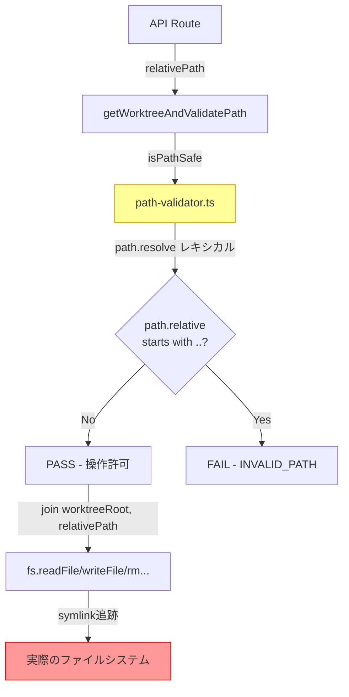
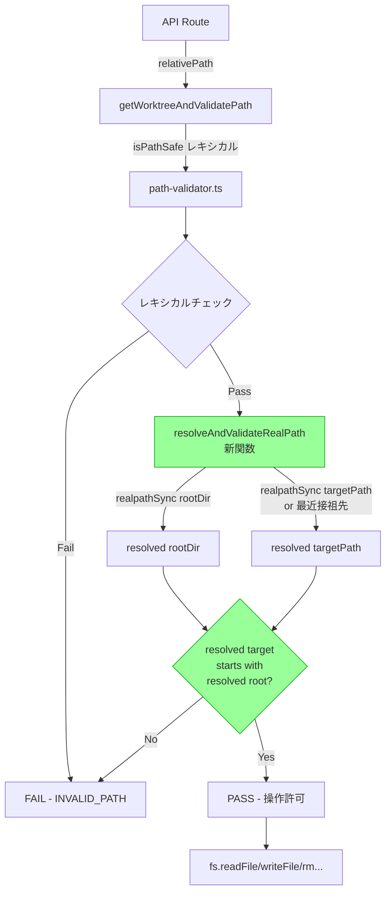

# Issue #394: Symlink Traversal Fix - 設計方針書

## 1. 概要

### 対象Issue
- **Issue**: #394 - security: symlink traversal in file APIs allows access outside worktree root
- **重要度**: High（セキュリティ脆弱性）
- **目的**: ファイルAPIのシンボリックリンクトラバーサル脆弱性を修正し、ワークツリー境界を超えたファイルアクセスを防止する

### 問題の要約
`isPathSafe()`がレキシカル（文字列ベース）パス正規化のみを行い、`realpathSync()`によるシンボリックリンク解決を行わないため、ワークツリー内のシンボリックリンクを経由してワークツリー外のファイルにアクセスできる。

---

## 2. アーキテクチャ設計

### 現在のパス検証フロー


### 修正後のパス検証フロー


### レイヤー構成と修正範囲

| レイヤー | ファイル | 修正内容 |
|---------|--------|---------|
| **バリデーション層** | `src/lib/path-validator.ts` | `resolveAndValidateRealPath()` 新関数追加 |
| **ビジネスロジック層** | `src/lib/file-operations.ts` | 各操作関数にrealpath検証を追加 |
| **API層** | `src/app/api/worktrees/[id]/files/[...path]/route.ts` | `getWorktreeAndValidatePath()`にrealpath検証追加 |
| **API層** | `src/app/api/worktrees/[id]/upload/[...path]/route.ts` | upload検証にrealpath追加 |
| **API層** | `src/app/api/worktrees/[id]/tree/[...path]/route.ts` | tree検証にrealpath追加 |
| **テスト層** | `tests/unit/path-validator.test.ts` | symlink検証テスト追加 |
| **テスト層** | `tests/unit/file-operations-symlink.test.ts` | 新規テストファイル |

---

## 3. 技術選定

### 採用技術

| カテゴリ | 選定 | 理由 |
|---------|------|------|
| symlink解決 | `fs.realpathSync()` | 同期関数で十分（ファイルパス検証は同期で完結）、moveFileOrDirectoryの既存パターンと一致 |
| 存在チェック | `fs.existsSync()` | 既存のfile-operations.tsのパターンに準拠 |
| パス比較 | `startsWith(resolved + sep)` | moveFileOrDirectoryのSEC-006パターンと一致 |

### 不採用の代替案

| 代替案 | 不採用理由 |
|-------|----------|
| `fs.promises.realpath()` (async) | パス検証は同期で完結すべき。既存の`isPathSafe()`も同期関数 |
| `fs.lstatSync()` + `isSymbolicLink()` | 中間パスのsymlinkは検出できない（最終パスのみチェック） |
| chroot/namespace | サーバー環境の変更が必要で導入コストが高すぎる |

---

## 4. 設計パターン

### 実装戦略: Option B（新関数追加）

Issue内で検討された3つのオプションから**Option B**を採用する。

#### Option A: isPathSafe()直接変更 - **不採用**
- 8ファイルに影響（file-search.ts、repositories/scan等）
- file-search.tsの再帰走査で毎エントリrealpathが必要になりパフォーマンス劣化
- 既存テストへの後方互換性リスク

#### Option B: 新関数追加 - **採用**
- `resolveAndValidateRealPath()` を `path-validator.ts` に追加
- ファイルAPI層でのみ使用、既存の`isPathSafe()`は変更なし
- `moveFileOrDirectory()`の既存SEC-006パターンを汎用化

#### Option C: 各関数に個別追加 - **不採用**
- コード重複（DRY違反）
- 漏れリスクが高い

### 新関数の設計

```typescript
// src/lib/path-validator.ts に追加

/**
 * Resolve symlinks and validate the real path stays within the worktree root.
 *
 * For existing paths: resolves realpath of the target directly.
 * For non-existing paths (create/upload): resolves realpath of the nearest
 * existing ancestor directory.
 *
 * Both rootDir and targetPath are resolved via realpathSync() to handle
 * OS-level symlinks (e.g., macOS /var -> /private/var).
 *
 * [S2-002] Parameter order follows targetPath-first convention of
 * path-validator.ts (consistent with isPathSafe(targetPath, rootDir)).
 * Note: file-operations.ts functions use rootDir-first order
 * (e.g., validateFileOperation(worktreeRoot, sourcePath)), so callers
 * from file-operations.ts must be careful about argument order.
 *
 * @param targetPath - Relative path to validate
 * @param rootDir - Worktree root directory (absolute)
 * @returns true if the resolved path is within the resolved rootDir
 */
export function resolveAndValidateRealPath(
  targetPath: string,
  rootDir: string
): boolean;
```

### 防御レイヤー設計（Defense in Depth）

```
Layer 1: isPathSafe()                  ← レキシカルチェック（既存・変更なし）
Layer 2: resolveAndValidateRealPath()  ← シンボリックリンク解決チェック（新規）
Layer 3: lstat() + isSymbolicLink()    ← ツリー表示時のsymlinkスキップ（既存・変更なし）
```

- Layer 1とLayer 2を**API層**で組み合わせて使用
- Layer 3は**ディレクトリ走査層**（file-tree.ts, file-search.ts）で既存のまま維持

### 防御責務の分担方針（[S1-002] レビュー指摘対応）

API層とビジネスロジック層の間で`resolveAndValidateRealPath()`の呼び出しが重複することを防ぐため、以下の責務分担を採用する。

| 層 | 責務 | resolveAndValidateRealPath() | 根拠 |
|----|------|------------------------------|------|
| **API層**（getWorktreeAndValidatePath等） | **主防御** | 適用する | 全APIリクエストの入り口で一元的にsymlink検証を行い、漏れを防止 |
| **ビジネスロジック層**（file-operations.ts各関数） | **二次防御（Defense-in-depth）** | 適用する | ビジネスロジック関数が将来API層を経由せずに呼び出される可能性への備え |

**設計根拠**:
- **[S2-001修正]** getWorktreeAndValidatePath()は**files APIルートのみ**の共通入口である。upload/tree APIルートはgetWorktreeAndValidatePath()を使用せず、それぞれのハンドラ内でインラインにisPathSafe()を呼び出している。そのため、防御の追加方法はルートごとに異なる:
  - **files APIルート**: getWorktreeAndValidatePath()内にresolveAndValidateRealPath()を追加することで、GET/PUT/POST/DELETE/PATCHの全ハンドラに一元的な防御を適用
  - **upload APIルート**: POSTハンドラ内のインラインisPathSafe()（行117付近）の直後にresolveAndValidateRealPath()を個別追加
  - **tree APIルート**: GETハンドラ内のインラインisPathSafe()（行75付近）の直後にresolveAndValidateRealPath()を個別追加
- file-operations.tsの各関数は二次防御として`resolveAndValidateRealPath()`を追加するが、これはAPI層の検証と重複するケースでもセキュリティ上許容する（realpathSyncのコストは無視できる程度）
- 既存のisPathSafe()も同様にAPI層・ビジネスロジック層の両方で呼び出されており、この二重チェック構造は既存パターンと一致する
- **注意**: realpathSync()の二重実行はI/Oコストとして1リクエストあたり最大4回（API層2回+ビジネスロジック層2回）だが、VFSキャッシュにより実質的な影響は無視できる

---

## 5. 詳細設計

### 5.1 新関数: resolveAndValidateRealPath()

**配置**: `src/lib/path-validator.ts`

**アルゴリズム**:

```
1. rootDir を realpathSync() で解決 → resolvedRoot
2. fullPath = path.resolve(rootDir, targetPath) を構築
3. fullPath が存在する場合:
   a. realpathSync(fullPath) → resolvedTarget
   b. resolvedTarget が resolvedRoot + sep で始まるか、resolvedRoot と等しいか確認
      [S2-006] resolvedTarget === resolvedRoot の場合もtrueを返す（ルートディレクトリ
      自体へのアクセスは許可する。isPathSafe()でも許可されている操作であり一貫性を保つ。
      moveFileOrDirectory()のSEC-006は「resolvedDest !== resolvedRoot」条件を持つが、
      これは移動先がルート自体であることを許可する移動操作固有のセマンティクスであり、
      resolveAndValidateRealPath()のパスアクセス検証とは目的が異なる）
4. fullPath が存在しない場合（create/upload）:
   a. fullPath のパスコンポーネントを末尾から走査
      **[S4-002] 明示的停止条件**: ループ条件は `while (currentPath !== path.dirname(currentPath))`
      とし、ルートファイルシステム（/）到達時に安全停止を保証する。
      path.dirname('/')は'/'を返すため、この条件により無限ループが防止される。
      rootDirが存在しない異常状態ではステップ1のrealpathSync(rootDir)が失敗し
      falseを返すため、通常はルート到達前に停止するが、Defense-in-depthとして
      ループ自体にも明示的な終了条件を設ける。
   b. 最も近い既存の祖先ディレクトリを特定
      （resolvedRoot到達時: 祖先が存在すればtrue、存在しなければfalse）
   c. その祖先に realpathSync() を適用 → resolvedAncestor
   d. resolvedAncestor が resolvedRoot + sep で始まるか、resolvedRoot と等しいか確認
5. チェックをパスすれば true、失敗すれば false
```

**エラーハンドリング**:
- `realpathSync(rootDir)` が失敗: `false` を返す（rootDirが存在しない異常状態）
- `realpathSync(target)` が `ENOENT`: 祖先走査にフォールバック
- その他のエラー: `false` を返す（安全側に倒す）

**[S3-004] symlink拒否時のサーバーログ出力**:
- resolveAndValidateRealPath()がfalseを返す場合、拒否理由をconsole.warn()で出力する
- ログに含める情報: ターゲットパス（相対パス）、realpathSync解決先パス、ルートパス（realpathSync解決後）
- ログはサーバーサイドのみに出力し、クライアントへのレスポンスには含めない（クライアントには既存のINVALID_PATHエラーコードのみ返す）
- エラーコードの新設（SYMLINK_OUTSIDE_ROOT等）はS1-005（見送り）との関連でスコープ外とする。将来的にエラー識別が必要になった場合に検討する
- ログ出力例: `console.warn('[SEC-394] Symlink traversal blocked: target resolves to "%s" which is outside root "%s"', resolvedTarget, resolvedRoot)`

### 5.2 既存関数の修正箇所

#### file-operations.ts（二次防御層）

**[S1-001] 統合方針の明確化**: `validateFileOperation()`は現在`renameFileOrDirectory()`と`moveFileOrDirectory()`でのみ使用されており、`readFileContent()`/`updateFileContent()`/`createFileOrDirectory()`/`deleteFileOrDirectory()`/`writeBinaryFile()`では使用されていない。そのため、以下の方針を採用する:

- **validateFileOperation()を使用する関数（renameFileOrDirectory, moveFileOrDirectory）**: `validateFileOperation()`内にresolveAndValidateRealPath()を統合する。これにより、これらの関数は個別にresolveAndValidateRealPath()を追加する必要がない
- **validateFileOperation()を使用しない関数（readFileContent, updateFileContent, createFileOrDirectory, deleteFileOrDirectory, writeBinaryFile）**: 各関数のisPathSafe()チェック直後にresolveAndValidateRealPath()を個別追加する
- **validateFileOperation()の利用範囲拡大は行わない**: readFileContent等にvalidateFileOperation()を導入するリファクタリングは本Issueのスコープ外とする。各関数のシグネチャやエラーハンドリングの差異（readFileContentはファイル存在前提、createFileOrDirectoryは未存在前提）があるため、統合はリスクが高い

| 関数 | 修正方法 | 備考 |
|------|---------|------|
| `readFileContent()` | isPathSafe後にresolveAndValidateRealPath追加 | 個別追加（validateFileOperation未使用） |
| `updateFileContent()` | 同上 | 個別追加（validateFileOperation未使用） |
| `createFileOrDirectory()` | 同上（祖先走査フォールバック使用） | 個別追加（validateFileOperation未使用）。**[S4-003]** mkdir(recursive: true)はsymlink検証後に実行されるため、検証-操作間のTOCTOU窓が存在する。このリスクはS4-001（セクション6脅威モデル）で許容判断した同一カテゴリのリスクであり、追加の対策は不要とする。ただし、mkdir()はwriteFile()と異なりディレクトリ構造を変更するため、仮にTOCTOU攻撃が成功した場合の影響は外部ディレクトリへのディレクトリ作成に限定される（ファイル内容の書き込みは後続のwriteFile()で発生） |
| `deleteFileOrDirectory()` | 同上 | 個別追加（validateFileOperation未使用） |
| `renameFileOrDirectory()` | validateFileOperation()経由で自動適用 | validateFileOperation内で統合 |
| `moveFileOrDirectory()` | validateFileOperation()経由で自動適用 | validateFileOperation内で統合。**[S4-004]** SEC-006のdestination検証は既存のrealpathSync+startsWith比較であり、resolveAndValidateRealPath()と同等の検証を行っている。本Issueのスコープではdestination側にresolveAndValidateRealPath()を追加しない（SEC-006が同等の機能を提供するため）。将来SEC-006をresolveAndValidateRealPath()に置き換える場合は、S3-004のログ出力との二重出力を回避するよう考慮すること |
| `writeBinaryFile()` | isPathSafe後にresolveAndValidateRealPath追加（祖先走査フォールバック使用） | 個別追加（validateFileOperation未使用）。**[S4-003]** createFileOrDirectory()と同様、mkdir(recursive: true)実行時のTOCTOU窓が存在する。S4-001の許容判断に基づき追加対策は不要。writeBinaryFile()ではupload操作を通じてリモートから新規ファイルパスを指定できるため攻撃面がcreateFileOrDirectory()よりやや広いが、API層でのresolveAndValidateRealPath()（主防御）がnormalizedDirに対して先行検証を行うため、実質的なリスク増加は限定的 |
| `validateFileOperation()` | isPathSafe後にresolveAndValidateRealPath追加。**[S2-003]** JSDocコメントに`[SEC-394] symlink traversal prevention (resolveAndValidateRealPath)`を追記し、責務拡張（isPathSafe + realpath検証 + 存在チェック）を反映すること。**[S3-001]** `resolvedSource`の返却値は変更しない（既存の`join(worktreeRoot, sourcePath)`を維持）。realpathSync解決済みパスはresolveAndValidateRealPath()内部で検証のみに使用し、返却値には反映しない。理由: macOS tmpdirベースの既存テスト（file-operations-validate.test.ts行36等）がjoin()結果を期待しており、realpathSync解決済みパスに変更するとパスの不一致でテストが失敗する | **共通ヘルパーへの統合** |

#### API routes（主防御層）

**[S2-001]** 各APIルートのパス検証方式は異なるため、resolveAndValidateRealPath()の追加方法もルートごとに異なる:

| ルート | 現在のパス検証方式 | 修正方法 |
|-------|-------------------|---------|
| `files/[...path]/route.ts` | `getWorktreeAndValidatePath()`共通関数を使用 | `getWorktreeAndValidatePath()`内のisPathSafe()後にresolveAndValidateRealPath追加（[S1-004]詳細は後述） |
| `upload/[...path]/route.ts` | POSTハンドラ内でインラインにisPathSafe()を呼び出し（行117付近） | インラインisPathSafe()直後にresolveAndValidateRealPath追加（getWorktreeAndValidatePath()は使用しない）。**[S3-003]** 二重検証フロー: API層ではnormalizedDir（アップロード先ディレクトリ）に対してresolveAndValidateRealPath()が適用される。その後writeBinaryFile()が呼ばれ、writeBinaryFile()内でrelativePath（normalizedDir + '/' + filename）に対して再度resolveAndValidateRealPath()が適用される（ファイルは未存在のため祖先走査フォールバックが使用され、最近接祖先としてnormalizedDirに帰着する）。結果として同一ディレクトリの二重検証となるが、Defense-in-depth原則に基づき意図的に許容する |
| `tree/[...path]/route.ts` | GETハンドラ内でインラインにisPathSafe()を呼び出し（行75付近） | インラインisPathSafe()直後にresolveAndValidateRealPath追加（getWorktreeAndValidatePath()は使用しない。ルートパスのみ検証、子エントリはlstatで防御） |

#### [S1-004] 画像・動画GETパスの保護箇所の明確化

`files/[...path]/route.ts`のGETハンドラでは、テキストファイルは`readFileContent()`経由でアクセスするが、画像（行153付近）と動画（行200-211付近）は`readFile(absolutePath)`を直接呼び出している。

**保護方針**: `files/[...path]/route.ts`は`getWorktreeAndValidatePath()`を使用しており、この関数内にresolveAndValidateRealPath()を追加するため、画像・動画パスは`getWorktreeAndValidatePath()`通過時点で自動的にsymlink検証済みとなる。`readFile()`直接呼び出し箇所への個別追加は不要。（注: [S2-001]で明確化した通り、この方式はfiles APIルートのみに適用される。upload/tree APIルートはgetWorktreeAndValidatePath()を使用していないため個別対応が必要。）

```
GETハンドラの処理フロー:
1. getWorktreeAndValidatePath() → isPathSafe() + resolveAndValidateRealPath()  [主防御]
2. 拡張子判定（画像/動画/テキスト）
3a. 画像: readFile(absolutePath)           ← 手順1で検証済みのためsymlink安全
3b. 動画: readFile(absolutePath)           ← 手順1で検証済みのためsymlink安全
3c. テキスト: readFileContent()            ← 手順1（主防御）+ readFileContent内（二次防御）
```

**テスト観点**: getWorktreeAndValidatePath()のsymlink拒否テストにおいて、画像拡張子（.png等）と動画拡張子（.mp4等）のパスを含むテストケースを追加し、readFile()直接呼び出しパスでもsymlink防御が有効であることを確認する。

#### 変更しないファイル

| ファイル | 理由 |
|---------|------|
| `file-search.ts` | 既存のlstat() + isSymbolicLink()スキップで十分。realpathを毎エントリに適用するとパフォーマンス劣化 |
| `file-tree.ts` | **[S3-007]** 既存のlstat() + isSymbolicLink()スキップで子エントリのsymlinkを防御。ルートパスのみtree APIルートでresolveAndValidateRealPath()を検証する。file-tree.ts自体の修正は不要 |
| `repositories/scan/route.ts` | ファイルI/Oを行わないため直接的な脆弱性なし |
| `url-path-encoder.ts` | isPathSafeのimportのみ、パス検証目的ではない |

### 5.3 macOS tmpdir互換性

**問題**: macOSでは`os.tmpdir()`が`/var/folders/...`を返すが、`/var`は`/private/var`へのシンボリックリンク。テストでtmpdirをworktreeRootとして使用した場合、targetのrealpathが`/private/var/...`に解決され、未解決のrootDir `/var/...`と不一致になる。

**解決**: `resolveAndValidateRealPath()`がrootDirにも`realpathSync()`を適用することで自動的に解決。これは`moveFileOrDirectory()`のSEC-006（行546-547）と同一パターン。

### 5.4 renameFileOrDirectory()のリネーム先検証省略根拠（[S1-003] レビュー指摘対応）

`renameFileOrDirectory()`では、ソースパスに対するresolveAndValidateRealPath()のみを追加し、リネーム先（newRelativePath）に対するsymlink検証は行わない。その根拠は以下の通り。

**省略が安全である理由**:

1. **リネーム操作はbasename変更のみ**: `renameFileOrDirectory()`は`newName`（新しいファイル名のみ）を受け取り、親ディレクトリは変更しない。リネーム先のフルパスは`join(dirname(relativePath), newName)`で構築されるため、リネーム先は常にソースと同一の親ディレクトリ内に留まる
2. **ソースパスの検証で親ディレクトリの安全性は担保済み**: ソースパスのresolveAndValidateRealPath()がパスする場合、ソースの実パスがworktreeRoot配下にあることが確認されている。リネーム先は同じ親ディレクトリ内のため、親ディレクトリの実パスもworktreeRoot配下にあることが保証される
3. **newNameのバリデーション**: `isValidNewName()`によりnewNameにはパス区切り文字（`/`）や`..`が含まれないことが保証されるため、リネーム先が親ディレクトリを脱出することはない
4. **既存のisPathSafe()チェック**: リネーム先に対する`isPathSafe(newRelativePath, worktreeRoot)`のレキシカルチェックは既に実施されている

**moveFileOrDirectory()との差異**: `moveFileOrDirectory()`は異なるディレクトリへの移動が可能であり、移動先ディレクトリがsymlinkの場合にworktreeRoot外へ脱出するリスクがある。そのため、moveFileOrDirectory()ではSEC-006で既にdestinationに対するrealpath検証を実施している。renameは同一ディレクトリ内の操作であるため、この追加検証は不要。

### 5.5 内部シンボリックリンクの扱い

ワークツリーRoot内部を指すシンボリックリンク（内部symlink）はアクセスを許可する。`resolveAndValidateRealPath()`は解決後のパスがworktreeRoot配下にあるかを検証するため、内部symlinkは自然にパスする。

---

## 6. セキュリティ設計

### 脅威モデル

| 攻撃シナリオ | 現状 | 修正後 |
|-------------|------|-------|
| gitリポジトリ内symlinkコミット | 脆弱 | INVALID_PATH拒否 |
| 手動作成のsymlink | 脆弱 | INVALID_PATH拒否 |
| ビルドツール生成symlink | 脆弱 | INVALID_PATH拒否 |
| 多段symlink（symlink→symlink→外部） | 脆弱 | INVALID_PATH拒否（realpathが完全解決） |
| dangling symlink | ENOENT | 祖先走査で検出 |
| 内部symlink（worktree内完結） | アクセス可 | アクセス可（維持） |
| **[S4-001] TOCTOU: realpathSync検証後のsymlink置換** | N/A（理論的リスク） | **許容（下記根拠に基づく）** |
| **[S4-006] hardlink経由のファイルアクセス** | 対処外 | **対処外（下記根拠に基づく）** |

#### [S4-001] TOCTOUレースコンディション: 許容根拠

resolveAndValidateRealPath()はrealpathSync()でファイルの実パスを検証した後、fs.readFile/writeFile/rm等の実際のファイルI/O操作が実行される。この検証-操作間（Time-of-Check-to-Time-of-Use）にsymlinkが作成・変更されるレースコンディション窓が理論的に存在する。

**攻撃シナリオ**: (1) resolveAndValidateRealPath()がworktree内ファイルとして検証をパス、(2) 攻撃者がファイルを削除してworktree外を指すsymlinkに置換、(3) readFile()がsymlinkを追跡して外部ファイルを読み取る。

**許容理由**:
1. **O_NOFOLLOW付きopen()はNode.js標準APIで利用できない**: カーネルレベルでのsymlink追跡防止がNode.jsでは不可能
2. **カーネルレベルのsandbox（chroot/namespace）は不採用判断済み**: セクション3で導入コストが高すぎるとして不採用
3. **ローカル開発ツールとしてのリスク評価**: 本アプリケーションはローカル開発ツールであり、同一ホスト上の攻撃者がworktreeディレクトリへの書き込み権限を持つ場合は、symlink置換以外にも多数の攻撃経路（直接ファイル改ざん、プロセス注入等）が存在する。TOCTOU攻撃の前提条件（同一ホスト上でworktreeディレクトリへの書き込み権限を持つ攻撃者がレースウィンドウ内にsymlink操作を完了する必要がある）は極めて高い
4. **Defense-in-depthのLayer 3（lstat+isSymbolicLink）による部分的緩和**: ディレクトリ走査時（file-tree.ts, file-search.ts）にはLayer 3がTOCTOUリスクを部分的に緩和する

#### [S4-006] hardlink経由のファイルアクセス: 対処外根拠

hardlinkはrealpathSync()では検出されないため、worktree内にworktree外ファイルへのhardlinkが存在する場合、resolveAndValidateRealPath()を通過する。ただし以下の理由により対処外とする:
- ディレクトリのhardlinkは多くのOSで禁止されている
- ファイルhardlinkの作成にはターゲットファイルへのアクセス権限が必要
- gitはhardlinkをサポートしないため、リポジトリ操作経由でのhardlink作成は不可能
- 実質的なリスクは限定的

### セキュリティ原則

1. **Fail-safe defaults**: realpathSync()失敗時はアクセス拒否（falseを返す）
2. **Defense in depth**: Layer 1（レキシカル）+ Layer 2（realpath）+ Layer 3（lstat）の3層防御
3. **Least privilege**: シンボリックリンクの解決先がworktreeRoot外であれば一律拒否
4. **Consistent policy**: 全ファイルAPIエンドポイントで同一の検証関数（resolveAndValidateRealPath()）を使用（[S2-001] 呼び出し方法はルートにより異なる: files APIはgetWorktreeAndValidatePath()経由、upload/tree APIはインライン呼び出し）

---

## 7. パフォーマンス設計

### I/O影響分析

| API | 追加I/O | 影響 |
|-----|---------|------|
| files GET/PUT/POST/DELETE/PATCH | realpathSync x2（root + target） | 無視できる（1リクエスト1回） |
| upload POST | realpathSync x2 | 無視できる |
| tree GET | realpathSync x2（ルートパスのみ） | 無視できる（子エントリは既存lstatで防御） |
| search GET | なし（変更なし） | 影響なし |

### キャッシング

realpathSync()のキャッシングは不要。理由:
- 1リクエストあたり最大2回の呼び出し
- ファイルシステムのVFSキャッシュが有効
- シンボリックリンクは動的に変更される可能性があるためキャッシュは危険

---

## 8. テスト設計

### 新規テストケース

| # | テスト内容 | 期待結果 |
|---|----------|---------|
| 1 | 外部symlink経由のファイル読み取り | INVALID_PATH |
| 2 | 外部symlink経由のファイル書き込み | INVALID_PATH |
| 3 | 外部symlink経由のファイル削除 | INVALID_PATH |
| 4 | 外部symlink経由のリネーム（source） | INVALID_PATH |
| 5 | 外部symlinkディレクトリ下のファイル作成 | INVALID_PATH |
| 6 | 外部symlinkディレクトリへのアップロード | INVALID_PATH |
| 7 | 内部symlink（worktree内完結）の読み取り | 成功 |
| 8 | dangling symlink（壊れたリンク先）へのアクセス | 適切なエラー |
| 9 | 多段symlink（symlink→symlink→外部） | INVALID_PATH |
| 10 | worktreeRoot自体がsymlinkを含む場合（macOS tmpdir） | 正常動作 |

### [S3-002] 既存テストへの影響分析

resolveAndValidateRealPath()の導入により影響を受ける可能性のある既存テストを以下に分析する。

**1. tmpdir使用テストの互換性**

resolveAndValidateRealPath()はrootDirとtargetPathの両方にrealpathSync()を適用するため、macOSでtmpdir（`/var/folders/...`）をworktreeRootとして使用するテストでは、rootDir側もtarget側も同様に`/private/var/folders/...`に解決される。そのため、startsWith比較は自動的に互換性が保たれ、既存のtmpdir使用テストは修正不要で通過する。

**2. validateFileOperation()のresolvedSource返却値への影響**

validateFileOperation()は返却値の`resolvedSource`として`join(worktreeRoot, sourcePath)`（レキシカルパス）を返している。S3-001の方針により、この返却値は変更しない（realpathSync解決済みパスは内部検証のみに使用）。従って、resolvedSourceを検証する既存テスト（file-operations-validate.test.ts行36: `expect(result.resolvedSource).toBe(join(testDir, 'test.txt'))`）は影響を受けない。

**3. 影響を受ける可能性のあるテストファイル一覧**

| テストファイル | tmpdir使用 | 影響 | 理由 |
|--------------|-----------|------|------|
| `tests/unit/lib/file-operations.test.ts` | Yes | なし | rootDir/target両方がrealpathSync解決される |
| `tests/unit/lib/file-operations-validate.test.ts` | Yes | なし | S3-001によりresolvedSource返却値は変更しない |
| `tests/unit/lib/file-operations-move.test.ts` | Yes | なし | rootDir/target両方がrealpathSync解決される |
| `tests/integration/api-file-operations.test.ts` | Yes | なし | worktree.pathもtargetPathも同様にrealpath解決される |
| `tests/unit/lib/file-tree.test.ts` | Yes | なし | symlinkスキップは既存のlstat + isSymbolicLink()で処理。tree APIルートのresolveAndValidateRealPath()はルートパスのみ検証 |

**4. file-tree.tsのsymlinkスキップテストとの整合性**

tests/unit/lib/file-tree.test.ts（行359付近）にはsymlinkSync()を使用したsymlinkスキップテストが存在する。tree APIルートにresolveAndValidateRealPath()を追加しても、このテストはルートパスの検証のみであり、子エントリのsymlinkスキップはfile-tree.tsのlstat() + isSymbolicLink()で処理される。そのため、既存のsymlinkスキップテストには影響がない。

### テストファイル構成

```
tests/
├── unit/
│   ├── path-validator.test.ts             ← resolveAndValidateRealPath()テスト追加
│   └── file-operations-symlink.test.ts    ← 新規: 各操作のsymlink検証テスト
└── integration/
    └── api-symlink-traversal.test.ts      ← 新規: APIレベルのsymlinkテスト（オプション）
```

### テスト環境

テストではtmpdir内に実際のシンボリックリンクを作成して検証する:
```typescript
// テストセットアップ例
const worktreeRoot = path.join(os.tmpdir(), 'test-worktree');
const externalDir = path.join(os.tmpdir(), 'test-external');
fs.mkdirSync(worktreeRoot, { recursive: true });
fs.mkdirSync(externalDir, { recursive: true });
fs.writeFileSync(path.join(externalDir, 'secret.txt'), 'secret data');
fs.symlinkSync(externalDir, path.join(worktreeRoot, 'external-link'));
```

---

## 9. 設計上の決定事項とトレードオフ

| 決定事項 | 理由 | トレードオフ |
|---------|------|-------------|
| Option B（新関数追加） | 既存isPathSafe()の8呼び出し元に影響を与えない | 2関数のAPI面が増える |
| realpathSync（同期） | 既存パターンとの一貫性、パス検証は同期で十分 | async版よりブロッキング |
| 祖先走査フォールバック | create/upload時にtarget自体が存在しない | アルゴリズムがやや複雑 |
| file-search.tsは変更なし | 既存lstatで十分、パフォーマンス維持 | 防御レイヤーが異なる |
| rootDirもrealpathSync適用 | macOS tmpdir互換性 | 追加のI/O 1回 |
| 内部symlink許可 | 正当なユースケース（worktree内のsymlink） | 外部/内部の判定コスト |
| [S1-001] validateFileOperation()使用関数と未使用関数で追加方法を分離 | validateFileOperation()はrename/moveのみで使用されており、全関数への拡張はシグネチャ差異によるリスクが高い | 追加パターンが2種類になる |
| [S1-002] API層を主防御、ビジネスロジック層を二次防御 | 既存のisPathSafe()二重チェックパターンと一致。将来のAPI層バイパスに対する備え | realpathSync二重実行のI/Oコスト（VFSキャッシュで軽微） |
| [S1-003] rename先のsymlink検証を省略 | basename変更のみで同一親ディレクトリ内に留まる。ソースパス検証で親ディレクトリの安全性は担保済み | rename先が将来ディレクトリ横断可能になった場合の追加対応が必要 |
| [S1-004] 画像・動画パスはgetWorktreeAndValidatePath()で自動保護 | 個別箇所への挿入を不要にし、防御漏れリスクを排除 | getWorktreeAndValidatePath()への依存度が増す |
| [S2-001] upload/tree APIルートはgetWorktreeAndValidatePath()を使用せずインライン防御 | 実コードの構造を正確に反映。files APIのみがgetWorktreeAndValidatePath()を使用する事実に基づく | 防御追加箇所が3パターンに分散するが、API routes表で明確に管理 |
| [S2-002] resolveAndValidateRealPath()のパラメータ順序はtargetPath-first | path-validator.tsの既存パターン（isPathSafe(targetPath, rootDir)）と一致 | file-operations.ts（rootDir-first）から呼び出す際にパラメータ順序が逆になる点に注意 |
| [S2-003] validateFileOperation()のJSDoc更新を実装時に実施 | 責務拡張（realpath検証追加）をドキュメントに正確に反映 | 追加の作業工数は軽微 |
| [S2-006] resolveAndValidateRealPath()はresolvedTarget === resolvedRootを許可 | isPathSafe()と一貫性を保つ。SEC-006の条件とは目的が異なる | 明確なドキュメント記載が必要 |
| [S3-001] validateFileOperation()のresolvedSource返却値は変更しない | resolvedSourceは既存の`join(worktreeRoot, sourcePath)`（レキシカルパス）を維持する。realpathSync解決済みパスはresolveAndValidateRealPath()内部で検証のみに使用し、返却値には反映しない。理由: macOSでは`os.tmpdir()`が`/var/folders/...`を返し、realpathSync()は`/private/var/folders/...`を返すため、返却値を変更すると既存テスト（file-operations-validate.test.ts行36）が失敗する | resolvedSourceの意味が「検証済み安全パス」ではなく「レキシカル解決パス」のままとなる。将来リファクタリングで変更する場合はテスト更新が必要 |
| [S3-003] upload APIルートでは二重検証（API層ディレクトリ + writeBinaryFile内ファイルパス祖先走査）が発生する | 設計上正しい動作であり、意図的に許容する。API層ではnormalizedDir（ディレクトリ）に対してresolveAndValidateRealPath()が適用され、writeBinaryFile()内ではrelativePath（ファイルパス）に対して祖先走査フォールバックが適用される。祖先走査はnormalizedDirに帰着するため同一ディレクトリの二重検証となる | 冗長な検証だが、Defense-in-depth原則に基づき維持する |
| [S3-004] resolveAndValidateRealPath()がfalseを返した場合にサーバーログを出力する | symlink拒否時にconsole.warn()で拒否理由（ターゲットパス、解決先パス、ルートパス）をログ出力し、管理者のデバッグを容易にする。エラーコードの変更（SYMLINK_OUTSIDE_ROOT等）はS1-005（見送り）との関連でスコープ外とする | ログ出力によるパス情報漏洩リスクはサーバーサイドログのみのため許容。クライアントへのレスポンスは既存のINVALID_PATHを維持 |

---

## 10. 実装順序

1. `resolveAndValidateRealPath()` 関数の実装（`src/lib/path-validator.ts`）とユニットテスト追加（`tests/unit/path-validator.test.ts`）
2. `validateFileOperation()` にrealpath検証を統合（[S1-001] rename/moveに自動適用）
3. `file-operations.ts` のvalidateFileOperation未使用関数（readFileContent, updateFileContent, createFileOrDirectory, deleteFileOrDirectory, writeBinaryFile）にrealpath検証を個別追加（[S1-001]）
4. `getWorktreeAndValidatePath()` にrealpath検証を追加（[S1-002] API層主防御。[S1-004] 画像・動画readFile()パスの自動保護を含む）
5. upload/tree APIルートのrealpath検証追加
6. テスト追加（画像・動画拡張子のsymlinkトラバーサルテストケースを含む）（[S1-004]）
7. renameFileOrDirectory()のテストでソースパスのみ検証されることを確認（[S1-003]）

---

## 11. CLAUDE.md更新計画

修正完了後、以下のモジュール説明を更新:

| ファイル | 更新内容 |
|---------|---------|
| `src/lib/path-validator.ts` | `resolveAndValidateRealPath()` 関数の追加を記載 |
| `src/lib/file-operations.ts` | symlink検証追加を記載 |

---

## 12. 制約条件の確認

- **SOLID**: SRP - resolveAndValidateRealPath()はsymlink検証の単一責務
- **KISS**: 既存のmoveFileOrDirectoryのSEC-006パターンを汎用化（新規パターン導入なし）
- **YAGNI**: 必要なAPIエンドポイントのみ保護、file-search.tsは既存防御で十分
- **DRY**: 共通関数resolveAndValidateRealPath()で検証ロジックを一元化

---

## 13. レビュー履歴

| Stage | レビュー名 | 実施日 | 指摘数 | must_fix | should_fix | nice_to_have |
|-------|-----------|--------|--------|----------|------------|--------------|
| 1 | 通常レビュー（設計原則） | 2026-03-02 | 8 | 0 | 4 | 4 |
| 2 | 整合性レビュー（コードベースとの整合性） | 2026-03-02 | 7 | 1 | 3 | 3 |
| 3 | 影響分析レビュー（影響範囲） | 2026-03-02 | 7 | 1 | 3 | 3 |
| 4 | セキュリティレビュー（セキュリティ） | 2026-03-03 | 7 | 1 | 3 | 3 |

---

## 14. レビュー指摘事項サマリー

### Stage 1 レビュー（通常レビュー - 設計原則）

| ID | 重要度 | カテゴリ | タイトル | 対応 |
|----|--------|---------|---------|------|
| S1-001 | should_fix | SOLID | validateFileOperation()への統合と各関数個別追加の重複 | セクション5.2で方針を一本化（validateFileOperation使用関数は統合、未使用関数は個別追加） |
| S1-002 | should_fix | DRY | API層とビジネスロジック層の二重パス検証 | セクション4「防御責務の分担方針」に責務分担テーブルと根拠を追加 |
| S1-003 | should_fix | 設計パターン | renameFileOrDirectory()のdestination検証省略 | セクション5.4に省略根拠（basename変更のみ、同一親ディレクトリ内）を明記 |
| S1-004 | should_fix | エラーハンドリング | 画像・動画readFile()直接呼び出しのsymlink防御 | セクション5.2「画像・動画GETパスの保護箇所の明確化」を追加。getWorktreeAndValidatePath()で自動保護される旨を明記 |
| S1-005 | nice_to_have | SOLID | resolveAndValidateRealPath()の戻り値がbooleanのみ | 対応見送り（YAGNI原則に基づき現時点ではbooleanで十分） |
| S1-006 | nice_to_have | KISS | 祖先走査の終了条件が暗黙的 | 対応見送り（isPathSafe() Layer 1で既に拒否済みの前提で安全） |
| S1-007 | nice_to_have | DRY | ERROR_CODE_TO_HTTP_STATUSの重複 | 対応見送り（本Issueスコープ外） |
| S1-008 | nice_to_have | YAGNI | API統合テストがオプション扱い | 対応見送り（ユニットテストで十分な信頼性を確保） |

### Stage 2 レビュー（整合性レビュー - コードベースとの整合性）

| ID | 重要度 | カテゴリ | タイトル | 対応 |
|----|--------|---------|---------|------|
| S2-001 | must_fix | API整合性 | upload/tree APIルートはgetWorktreeAndValidatePath()を使用していない | セクション4「防御責務の分担方針」の設計根拠を修正。セクション5.2のAPI routes表に現在のパス検証方式カラムを追加。セクション6セキュリティ原則のConsistent policyに注記追加 |
| S2-002 | should_fix | 関数整合性 | resolveAndValidateRealPath()のパラメータ順序が既存関数と逆順 | セクション4の関数シグネチャJSDocにパラメータ順序の根拠注記を追加（path-validator.tsのisPathSafe準拠、file-operations.ts呼び出し時の注意点） |
| S2-003 | should_fix | 関数整合性 | validateFileOperation()のJSDocとrealpath統合設計の不一致 | セクション5.2のvalidateFileOperation()行にJSDoc更新指示を追加。実装チェックリストにも追加 |
| S2-004 | nice_to_have | テスト整合性 | テスト設計のセットアップ例がbeforeEach/afterEachパターンを示していない | 対応見送り（テスト実装時に決定可能） |
| S2-005 | nice_to_have | 実装順序 | 実装順序ステップ1でのユニットテストの範囲が不明確 | セクション10ステップ1にファイルパスを明記 |
| S2-006 | should_fix | 既存パターン整合性 | moveFileOrDirectory()のSEC-006パターンとresolveAndValidateRealPath()のアルゴリズムの差異を明確化すべき | セクション5.1アルゴリズムのステップ3bにresolvedTarget === resolvedRootの許可根拠とSEC-006との差異を注記 |
| S2-007 | nice_to_have | API整合性 | tree APIルートのエラーレスポンス形式がfiles APIルートと異なる | 対応見送り（レスポンス形式統一は本Issueスコープ外。tree APIルートは既存のcreateAccessDeniedError()パターンを踏襲） |

### Stage 3 レビュー（影響分析レビュー - 影響範囲）

| ID | 重要度 | カテゴリ | タイトル | 対応 |
|----|--------|---------|---------|------|
| S3-001 | must_fix | テスト影響 | validateFileOperation()のresolvedSource返却値がmacOS tmpdirテストで不一致になるリスク | セクション5.2のvalidateFileOperation()行にresolvedSource返却値ポリシーを明記（返却値は変更しない、realpathSync解決済みパスは内部検証のみに使用）。セクション9の設計上の決定事項テーブルにも追加 |
| S3-002 | should_fix | テスト影響 | tmpdir使用テストへの影響分析の未記載 | セクション8に「既存テストへの影響分析」サブセクションを追加。tmpdir互換性の自動保持、resolvedSource返却値の非変更、影響を受ける可能性のあるテストファイル一覧、file-tree.tsのsymlinkスキップテストとの整合性を記載 |
| S3-003 | should_fix | 既存パターン重複 | upload APIルートのwriteBinaryFile()での二重検証フローが文書化されていない | セクション5.2のupload APIルート行に二重検証の具体的フロー（API層ディレクトリ検証 -> writeBinaryFile内ファイルパス祖先走査 -> 同一ディレクトリに帰着）を記載。セクション9の設計上の決定事項にもDefense-in-depth原則に基づく許容を明記 |
| S3-004 | should_fix | エラー動作変化 | symlink拒否時のサーバーログ出力が未計画 | セクション5.1のエラーハンドリングにconsole.warn()ログ出力計画を追加。ログに含める情報（ターゲットパス、解決先パス、ルートパス）、クライアントレスポンスは既存INVALID_PATH維持、エラーコード新設はスコープ外とする方針を明記。セクション9にも追加 |
| S3-005 | nice_to_have | パフォーマンス | Defense-in-depth二重チェックのrealpathSync呼び出し回数の定量評価 | 対応見送り（move操作時の最大8回呼び出しは正確な指摘だが、VFSキャッシュにより実質的な影響は軽微であり、セクション7の既存の「無視できる」評価は妥当） |
| S3-006 | nice_to_have | 既存パターン重複 | moveFileOrDirectory()のSEC-006とresolveAndValidateRealPath()の防御範囲の重複整理 | 対応見送り（SEC-006はdestinationDir固有のセマンティクスを持ち、汎用関数とは目的が異なる。将来のリファクタリング候補として認識するが、本Issueスコープ外） |
| S3-007 | nice_to_have | テスト影響 | file-tree.test.tsのsymlinkスキップテストとの整合性確認が未記載 | S3-002の対応に包含（セクション8の既存テスト影響分析にfile-tree.test.tsの分析を含めた） |

### Stage 4 レビュー（セキュリティレビュー - セキュリティ）

| ID | 重要度 | カテゴリ | タイトル | 対応 |
|----|--------|---------|---------|------|
| S4-001 | must_fix | TOCTOU | realpathSync()検証とファイルI/O操作の間のレースコンディション窓に対する設計上の認識と許容根拠が未記載 | セクション6脅威モデルに「TOCTOU: realpathSync検証後のsymlink置換」行を追加。攻撃の前提条件（同一ホスト上のworktreeディレクトリ書き込み権限）と4つの許容理由（O_NOFOLLOWの不可用、sandbox不採用判断済み、ローカル開発ツールとしてのリスク評価、Layer 3による部分的緩和）を明記 |
| S4-002 | should_fix | 祖先走査 | 祖先走査アルゴリズムにおけるルートファイルシステム（/）到達時の明示的停止条件が未記載 | セクション5.1アルゴリズムのステップ4aに `while (currentPath !== path.dirname(currentPath))` による明示的な停止条件を追加。ルート到達時の安全停止を保証 |
| S4-003 | should_fix | TOCTOU | createFileOrDirectory/writeBinaryFileのmkdir(recursive:true)がsymlink検証後に親ディレクトリを作成するフローでの安全性が未明確 | セクション5.2のcreateFileOrDirectory()およびwriteBinaryFile()の備考にmkdir()のTOCTOU窓の存在とS4-001に基づく許容判断を明記。writeBinaryFile()はupload経由の攻撃面がやや広い点も記載 |
| S4-004 | should_fix | ログ | moveFileOrDirectoryのSEC-006とresolveAndValidateRealPath()の両方がfalse/拒否を返す場合のログ二重出力 | セクション5.2のmoveFileOrDirectory()備考にSEC-006のdestination検証とresolveAndValidateRealPath()の関係を明記。本IssueスコープではSEC-006の置き換えは行わず、将来置き換え時のログ二重出力回避の考慮事項を記載 |
| S4-005 | nice_to_have | OWASP | A01 Broken Access Control: worktree.pathの信頼性に依存する設計の前提条件が未明示 | 対応見送り（worktree.pathはDBから取得される信頼された値であり、DB操作はbetter-sqlite3のパラメータ化クエリで保護されている。本Issueスコープ外） |
| S4-006 | nice_to_have | 残存リスク | hardlink経由のworktree境界越えが対処されていない | セクション6脅威モデルに「hardlink経由のファイルアクセス」行を追加し、対処外根拠（ディレクトリhardlinkはOS禁止、ファイルhardlinkは権限必要、gitは非サポート）を明記 |
| S4-007 | nice_to_have | ログ | symlink拒否ログのフォーマットにリクエストコンテキスト情報が含まれていない | 対応見送り（resolveAndValidateRealPath()はビジネスロジック層に配置されるためHTTPリクエスト情報の参照は責務の混在になる。将来必要な場合はAPI層での追加ログ出力を検討。本Issueスコープ外） |

### 実装チェックリスト

Stage 1/Stage 2/Stage 3レビュー指摘を踏まえた実装時の確認事項:

- [ ] **[S1-001]** `validateFileOperation()`内にresolveAndValidateRealPath()を追加する（renameFileOrDirectory/moveFileOrDirectoryに自動適用される）
- [ ] **[S1-001]** readFileContent/updateFileContent/createFileOrDirectory/deleteFileOrDirectory/writeBinaryFileの各関数にはisPathSafe()直後にresolveAndValidateRealPath()を個別追加する
- [ ] **[S1-001]** validateFileOperation()経由の関数（rename/move）には個別のresolveAndValidateRealPath()を追加しない（二重チェック回避）
- [ ] **[S1-002]** getWorktreeAndValidatePath()内のisPathSafe()後にresolveAndValidateRealPath()を追加する（API層主防御）
- [ ] **[S1-002]** file-operations.ts各関数のresolveAndValidateRealPath()は二次防御として追加する（API層との重複は許容）
- [ ] **[S1-003]** renameFileOrDirectory()ではソースパスのみにresolveAndValidateRealPath()を適用する。リネーム先への適用は不要（同一親ディレクトリ内操作のため）
- [ ] **[S1-004]** getWorktreeAndValidatePath()への追加により、画像・動画のreadFile()直接呼び出しパスが自動保護されることをテストで確認する
- [ ] **[S1-004]** テストケースに画像拡張子（.png等）と動画拡張子（.mp4等）のsymlinkトラバーサル検証を含める
- [ ] **[S2-001]** upload/[...path]/route.tsのPOSTハンドラ内のインラインisPathSafe()（行117付近）の直後にresolveAndValidateRealPath()を追加する（getWorktreeAndValidatePath()経由ではない）
- [ ] **[S2-001]** tree/[...path]/route.tsのGETハンドラ内のインラインisPathSafe()（行75付近）の直後にresolveAndValidateRealPath()を追加する（getWorktreeAndValidatePath()経由ではない）
- [ ] **[S2-002]** resolveAndValidateRealPath(targetPath, rootDir)の引数順序はpath-validator.tsのisPathSafe()と同じtargetPath-firstであることを確認する。file-operations.tsから呼び出す際はパラメータ順序が逆になる点に注意する
- [ ] **[S2-003]** validateFileOperation()にresolveAndValidateRealPath()を統合後、JSDocコメントに`[SEC-394] symlink traversal prevention (resolveAndValidateRealPath)`を追記し、責務が「isPathSafe + realpath検証 + 存在チェック」に拡張されたことを反映する
- [ ] **[S2-006]** resolveAndValidateRealPath()のパス比較でresolvedTarget === resolvedRootの場合もtrueを返す実装とすること（ルートディレクトリ自体へのアクセスを許可）
- [ ] **[S2-007]** tree APIルートでresolveAndValidateRealPath()が失敗した場合のエラーレスポンスは、既存のcreateAccessDeniedError()パターンを踏襲すること（files APIルートのcreateErrorResponse()パターンとは異なる）
- [ ] **[S3-001]** validateFileOperation()にresolveAndValidateRealPath()を統合する際、返却値の`resolvedSource`は既存の`join(worktreeRoot, sourcePath)`を維持すること。realpathSync解決済みパスは検証のみに使用し、返却値には反映しない
- [ ] **[S3-001]** realpathSync解決済みパスが必要な場合は、resolveAndValidateRealPath()内部の別変数（例: `resolvedForValidation`）で管理し、resolvedSourceとは分離すること
- [ ] **[S3-002]** 新規テスト（file-operations-symlink.test.ts等）でtmpdirを使用する場合、rootDirとtargetの両方がrealpathSync()で解決されるため、macOS環境での自動互換性を前提としてテストを記述すること
- [ ] **[S3-003]** upload APIルートのPOSTハンドラ内でresolveAndValidateRealPath(normalizedDir)を追加した後、writeBinaryFile()内でも同関数が二重に呼ばれることを認識し、意図的に許容すること（Defense-in-depth）
- [ ] **[S3-004]** resolveAndValidateRealPath()がfalseを返す際にconsole.warn()でログを出力すること。ログには`[SEC-394]`プレフィックスとターゲットパス、解決先パス、ルートパスを含めること
- [ ] **[S3-004]** クライアントへのエラーレスポンスは既存のINVALID_PATHを維持すること（symlink固有のエラーコードは導入しない）
- [ ] **[S4-001]** セクション6脅威モデルのTOCTOU許容根拠に記載した通り、resolveAndValidateRealPath()とファイルI/O間のTOCTOUレースコンディションは既知のリスクとして許容すること。追加の対策は不要
- [ ] **[S4-002]** resolveAndValidateRealPath()の祖先走査ループ条件を `while (currentPath !== path.dirname(currentPath))` とし、ルートファイルシステム（/）到達時の安全停止を保証すること
- [ ] **[S4-003]** createFileOrDirectory()およびwriteBinaryFile()のmkdir(recursive: true)がsymlink検証後に実行されるTOCTOU窓を認識し、S4-001の許容判断に基づき追加対策は不要とすること
- [ ] **[S4-004]** moveFileOrDirectory()のSEC-006（destination検証）はresolveAndValidateRealPath()と同等の検証を既に行っているため、destination側にresolveAndValidateRealPath()を追加しないこと。将来SEC-006を置き換える場合はS3-004のログ出力との二重出力に注意すること

---

*Generated by design-policy command for Issue #394*
*Stage 1 review findings applied: 2026-03-02*
*Stage 2 review findings applied: 2026-03-02*
*Stage 3 review findings applied: 2026-03-02*
*Stage 4 review findings applied: 2026-03-03*
