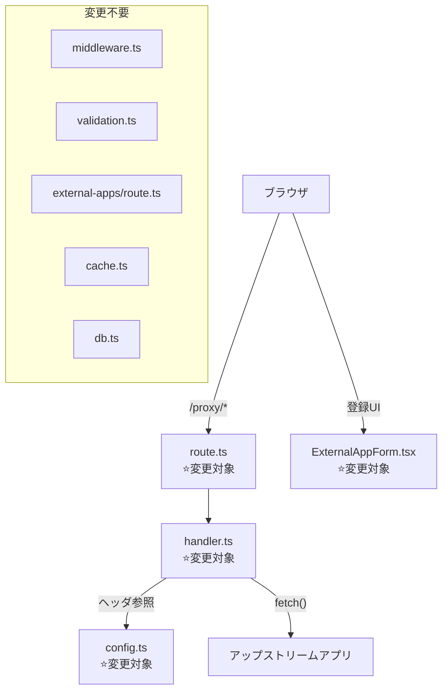

# Issue #395: Proxy Security Hardening - 設計方針書

## 1. 概要

### 目的
`/proxy/*` 機能における同一オリジン信頼境界崩壊と資格情報漏洩の脆弱性を修正する。

### スコープ
- リクエストヘッダからの機密情報ストリッピング（Cookie, Authorization, X-Forwarded-*）
- レスポンスヘッダからの機密情報ストリッピング（Set-Cookie, CSP関連）
- proxyWebSocket() 426レスポンスからの内部情報漏洩防止
- 外部アプリ登録フォームへのセキュリティ警告追加

### スコープ外
- iframe sandboxing（別Issue）
- restrictive CSPヘッダの強制注入オプション（別Issue）
- オリジン分離/サブドメイン方式への移行

## 2. アーキテクチャ設計

### 変更対象コンポーネント図



> **[DR4-001] route.ts を変更対象に移動**: Stage 4 セキュリティレビューにより、route.ts L106-109 の catch ブロックで `(error as Error).message` をクライアントに直接返しており内部情報（ポート番号、接続先ホスト等）が漏洩する問題が指摘された。route.ts を「変更不要」から「変更対象」に移動する。

### レイヤー構成

変更は以下の2レイヤーに限定される：

| レイヤー | ファイル | 変更内容 |
|---------|---------|---------|
| 設定層 | `src/lib/proxy/config.ts` | SENSITIVE_*定数追加 |
| ルーティング層 | `src/app/proxy/[...path]/route.ts` | catch節・404/503エラーレスポンスの固定文字列化 [DR4-001][DR4-003] |
| ビジネスロジック層 | `src/lib/proxy/handler.ts` | ヘッダストリッピングロジック追加、proxyWebSocket()情報漏洩修正 |
| プレゼンテーション層 | `src/components/external-apps/ExternalAppForm.tsx` | セキュリティ警告バナー追加 |

## 3. 設計パターン

### 既存パターンの踏襲: 定数配列 + `.includes()` フィルタリング

既存の `HOP_BY_HOP_REQUEST_HEADERS` / `HOP_BY_HOP_RESPONSE_HEADERS` パターンをそのまま拡張する。

**選定理由**:
- 既存コードとの一貫性（KISS原則）
- `as const` 配列 + TypeScript型推論による型安全性
- 新しい抽象化やクラスは不要（YAGNI原則）

**代替案との比較**:

| 方式 | メリット | デメリット | 採否 |
|------|---------|-----------|------|
| `as const` 配列 + `.includes()` | 既存パターンと一貫、シンプル | O(n)検索 | ✅ 採用 |
| `Set<string>` | O(1)検索 | 既存コードと不一貫、ヘッダ数が少なくO(n)で十分 | ❌ 不採用 |
| `Map<string, boolean>` | 設定可能性 | 過剰な複雑性 | ❌ 不採用 |
| handler.ts内ハードコード | 変更箇所が少ない | 保守性低下、DRY違反 | ❌ 不採用 |

## 4. 詳細設計

### 4-1. config.ts: 機密ヘッダ定数

```typescript
/**
 * Sensitive request headers that should NOT be forwarded to upstream apps
 * These contain credentials or internal routing information
 * Issue #395: Prevent credential leakage to proxied applications
 */
export const SENSITIVE_REQUEST_HEADERS = [
  'cookie',
  'authorization',
  'proxy-authorization',  // [DR4-002] RFC 7235 Section 4.4 プロキシ認証資格情報漏洩防止
  'x-forwarded-for',
  'x-forwarded-host',
  'x-forwarded-proto',
  'x-real-ip',
] as const;

/**
 * Sensitive response headers that should NOT be forwarded from upstream apps
 * These could inject cookies or override security policies
 * Issue #395: Prevent cookie injection and CSP override
 */
export const SENSITIVE_RESPONSE_HEADERS = [
  'set-cookie',
  'content-security-policy',
  'content-security-policy-report-only',  // [DR4-008] CSP Report-Only による外部レポートサーバーへの情報漏洩防止
  'x-frame-options',
  'strict-transport-security',  // [DR4-004] アップストリームの HSTS がCommandMateオリジンに伝播することを防止
  'access-control-allow-origin',       // [DR4-005] アップストリームの CORS ポリシーが
  'access-control-allow-credentials',  //   CommandMate オリジンのセキュリティを
  'access-control-allow-methods',      //   緩和することを防止
  'access-control-allow-headers',
  'access-control-expose-headers',
  'access-control-max-age',
] as const;
```

**設計判断**:
- `cookie` は全Cookie（cm_auth_token含む）のアップストリーム漏洩を防止
- `authorization` は将来的なBearer Token拡張への防御的対応
- `proxy-authorization` はプロキシ認証資格情報のアップストリーム漏洩防止（RFC 7235 Section 4.4。ブラウザがシステムプロキシ設定に基づき自動付与する場合がある） [DR4-002]
- `x-forwarded-*` はホストヘッダインジェクション・IPスプーフィング防止
- `set-cookie` はCookie注入（セッション乗っ取り）防止
- `content-security-policy` / `x-frame-options` はnext.config.js設定の上書き防止
- `content-security-policy-report-only` はCSP Report-Onlyヘッダによる外部レポートサーバーへのCommandMateオリジン露出防止。CSP関連ヘッダは全てCommandMate側で制御すべきである [DR4-008]
- `strict-transport-security` はアップストリームのHSTSポリシーがCommandMateオリジン全体に適用されることの防止。CommandMateがHTTPで動作する環境でアップストリームのHSTSによりアクセス不能になるリスクを排除する。CommandMate自身のHSTSはnext.config.jsのheaders()で制御すべきである [DR4-004]
- `access-control-*` (6ヘッダ) はアップストリームのCORSポリシーがCommandMateオリジン上で外部サイトからの認証付きリクエストを許可することの防止。CORSポリシーはCommandMate側で制御すべきである [DR4-005]

### 4-2. handler.ts: proxyHttp() ヘッダストリッピング

#### コメント更新 [DR1-006]

handler.ts L60 の既存コメント `// Clone headers, removing hop-by-hop headers` を以下に更新すること:

```typescript
// Clone headers, removing hop-by-hop and sensitive headers (Issue #395)
```

機密ヘッダストリッピングが追加されたことをコメントに反映し、コードの自己文書化を維持する。レスポンスヘッダフィルタリング側のコメントも同様に更新すること。

#### リクエストヘッダフィルタリング（L60-68）

```typescript
import {
  PROXY_TIMEOUT,
  HOP_BY_HOP_REQUEST_HEADERS,
  SENSITIVE_REQUEST_HEADERS,    // Issue #395: 新規追加（proxy-authorization含む [DR4-002]）
  HOP_BY_HOP_RESPONSE_HEADERS,
  SENSITIVE_RESPONSE_HEADERS,   // Issue #395: 新規追加（HSTS/CORS/CSP-RO含む [DR4-004][DR4-005][DR4-008]）
  PROXY_STATUS_CODES,
  PROXY_ERROR_MESSAGES,
} from './config';
// NOTE: import順序は既存handler.tsの順序に準拠。SENSITIVE_*は対応するHOP_BY_HOP_*の直後に配置。
// 「既存」「新規」のコメントは設計説明用であり、実装コードには含めない。

// Clone headers, removing hop-by-hop and sensitive headers (Issue #395)
const headers = new Headers();
request.headers.forEach((value, key) => {
  const lowerKey = key.toLowerCase();
  if (
    !HOP_BY_HOP_REQUEST_HEADERS.includes(lowerKey as typeof HOP_BY_HOP_REQUEST_HEADERS[number]) &&
    !SENSITIVE_REQUEST_HEADERS.includes(lowerKey as typeof SENSITIVE_REQUEST_HEADERS[number])
  ) {
    headers.set(key, value);
  }
});
```

#### レスポンスヘッダフィルタリング（L86-94）

```typescript
// Clone headers, removing hop-by-hop and sensitive headers (Issue #395)
const responseHeaders = new Headers();
response.headers.forEach((value, key) => {
  const lowerKey = key.toLowerCase();
  if (
    !HOP_BY_HOP_RESPONSE_HEADERS.includes(lowerKey as typeof HOP_BY_HOP_RESPONSE_HEADERS[number]) &&
    !SENSITIVE_RESPONSE_HEADERS.includes(lowerKey as typeof SENSITIVE_RESPONSE_HEADERS[number])
  ) {
    responseHeaders.set(key, value);
  }
});
```

#### ヘッダフィルタリングの重複に関する設計判断 [DR1-001]

リクエスト/レスポンスのヘッダフィルタリングループは構造的に同一のパターン（`forEach` + `toLowerCase` + 2配列に対する`.includes()`否定チェック + `headers.set`）を繰り返している。将来的にはヘルパー関数（例: `filterHeaders(source: Headers, excludeLists: ReadonlyArray<ReadonlyArray<string>>): Headers`）への抽出を検討するが、本Issueでは既存コードとの一貫性を優先しインライン実装を採用する（KISS原則）。フィルタリング条件を変更する際は、リクエスト側・レスポンス側の両箇所を同期修正する必要がある点に注意すること。

### 4-3. handler.ts: proxyWebSocket() 情報漏洩修正

#### 現在のコード（L143-166）

`directUrl` フィールドと `message` フィールドに内部URL情報が含まれている。

#### 修正後

```typescript
export async function proxyWebSocket(
  _request: Request,
  _app: ExternalApp,
  _path: string
): Promise<Response> {
  return new Response(
    JSON.stringify({
      error: 'Upgrade Required',
      message: PROXY_ERROR_MESSAGES.UPGRADE_REQUIRED,
    }),
    {
      status: PROXY_STATUS_CODES.UPGRADE_REQUIRED,
      headers: {
        'Content-Type': 'application/json',
        'Upgrade': 'websocket',
      },
    }
  );
}
```

**変更点**:
- `directUrl` フィールド削除（内部ホスト:ポート漏洩防止）
- `message` からインターポレーション除去（`PROXY_ERROR_MESSAGES.UPGRADE_REQUIRED` 固定文字列のみ）
- `directWsUrl` ローカル変数削除（未使用になるため）
- パラメータは `_request`, `_app`, `_path` としてアンダースコアプレフィックスを付与し、意図的な未使用を示す（TypeScript慣例）[DR1-002]。route.tsでの呼び出しシグネチャ変更を避けるためパラメータ自体は維持する

#### errorフィールドの設計判断 [DR1-007]

`error: 'Upgrade Required'` のハードコードは、既存の`proxyHttp()`エラーレスポンスパターン（handler.ts L106 `'Gateway Timeout'`, L119 `'Bad Gateway'` 参照）と一貫している。将来的には`PROXY_ERROR_NAMES`のような定数をconfig.tsに追加し、errorフィールドも一元管理することを検討するが、本Issueでは既存パターン踏襲とする。

### 4-4. ExternalAppForm.tsx: セキュリティ警告バナー

フォーム上部にアラートバナーを追加する。

```tsx
<div className="rounded-md bg-amber-50 p-3 mb-4 border border-amber-200">
  <p className="text-sm text-amber-800">
    Proxied apps run under the CommandMate origin and can access CommandMate APIs. Only register trusted applications.
  </p>
</div>
```

**設計判断**:
- i18n対応は本Issueスコープ外（英語固定文字列）
- `amber` カラーは警告レベルの視覚表現として適切
- 作成/編集両モードで表示

### 4-5. route.ts: エラーレスポンスの固定文字列化 [DR4-001][DR4-003]

#### catch節の内部エラーメッセージ漏洩修正 [DR4-001]

route.ts L106-109 の catch ブロックで `(error as Error).message` をクライアントに直接返している。これは内部情報（ポート番号、接続先ホスト、ネットワーク構成）を攻撃者に漏洩する。例えば ECONNREFUSED エラーの場合、`connect ECONNREFUSED 127.0.0.1:5173` のようなメッセージが返され、内部サービスのポート番号が露出する。

`proxyHttp()` 内部のエラーハンドリング（handler.ts L101-129）は `PROXY_ERROR_MESSAGES` の固定文字列を使用しており適切だが、route.ts 側で `proxyHttp()` / `proxyWebSocket()` 自体が throw した場合（予期しないランタイムエラー）の catch が固定文字列化されていない。

**修正方針**:

```typescript
// 修正前（L106-109）
return NextResponse.json(
  { error: 'Proxy error', message: (error as Error).message },
  { status: 502 }
);

// 修正後
return NextResponse.json(
  { error: 'Proxy error', message: PROXY_ERROR_MESSAGES.BAD_GATEWAY },
  { status: 502 }
);
```

内部エラーの詳細はサーバーサイドログ（`logProxyError` が既にL104で呼ばれている）にのみ記録し、クライアントレスポンスには返さない。`PROXY_ERROR_MESSAGES.BAD_GATEWAY` を使用するため、route.ts に config.ts からの import を追加する。

#### 404/503 レスポンスの情報漏洩修正 [DR4-003]

route.ts L50-51 で `No external app found for path prefix: ${pathPrefix}` を返しており、L58-59 で `app.displayName` を返している。応答の差分（存在する pathPrefix に対する 503 disabled vs 存在しない pathPrefix に対する 404）によって、登録済みアプリの列挙（enumeration）が可能になる。

**修正方針**:

```typescript
// 修正前（L50-51）
return NextResponse.json(
  { error: `No external app found for path prefix: ${pathPrefix}` },
  { status: 404 }
);

// 修正後
return NextResponse.json(
  { error: 'Not Found' },
  { status: 404 }
);

// 修正前（L57-59）
return NextResponse.json(
  { error: `External app "${app.displayName}" is currently disabled` },
  { status: 503 }
);

// 修正後
return NextResponse.json(
  { error: 'Service Unavailable' },
  { status: 503 }
);
```

pathPrefix や displayName 等のアプリ固有情報はクライアントに返さず、固定文字列を使用する。

## 5. セキュリティ設計

### 防御の多層化

| 層 | 対策 | 防御対象 |
|----|------|---------|
| L1 | middleware.ts 認証 | 未認証アクセス（既存、変更不要） |
| L2 | リクエストヘッダストリッピング | Cookie/Authorization/Proxy-Authorization漏洩 |
| L3 | レスポンスヘッダストリッピング | Set-Cookie注入、CSP/HSTS/CORS上書き |
| L4 | proxyWebSocket()情報除去 | 内部ネットワーク情報漏洩 |
| L4b | route.tsエラーレスポンス固定文字列化 | 内部エラーメッセージ・アプリ列挙による情報漏洩 [DR4-001][DR4-003] |
| L5 | UI警告バナー | ユーザーの意識的なリスク認識 |

### next.config.js CSP との相互作用 [DR3-005]

upstream の CSP / X-Frame-Options をストリップした後、next.config.js の `headers()` 設定が `/proxy/*` ルートの Route Handler レスポンスに適用されることを実装時に確認する。Next.js の Route Handler から返された `Response` オブジェクトに対して、next.config.js の headers() が自動的にマージされるかはランタイム動作に依存する。適用されない場合は、`proxyHttp()` 内で next.config.js 相当のセキュリティヘッダ（Content-Security-Policy, X-Frame-Options 等）を明示的に付与するフォールバックが必要である。

### 残存リスク（スコープ外）

同一オリジンプロキシの構造的リスクは本修正では完全には解消されない：
- アップストリームHTMLのインラインスクリプトは依然として同一オリジンで実行可能
- `/api/*` への直接fetchは技術的に可能（CSP `script-src 'unsafe-inline'` のため）
- **CSP connect-src の ws:/wss: 許可によるWebSocket接続リスク** [DR4-007]: next.config.js L65 の CSP 設定で `connect-src` に `ws: wss:` が含まれている。プロキシ経由で提供されるアップストリームアプリの JavaScript コードが、任意の WebSocket サーバーに接続可能である。Issue #395 のヘッダストリッピング実装後も、この CSP 設定によりアップストリームアプリのスクリプトが CommandMate のオリジンを利用して外部 WebSocket サーバーと通信できる。ws:/wss: は CommandMate 自体の HMR (Hot Module Replacement) に必要なため本 Issue では変更しない
- これらは iframe sandboxing や restrictive CSP注入（別Issue）で対応。CSP connect-src の制限強化も将来の CSP 強化 Issue で対応する

## 6. テスト設計

### テストファイル構成

既存の `tests/unit/proxy/handler.test.ts` に追加する（新ファイル作成は不要）。

| テストカテゴリ | テスト内容 |
|--------------|----------|
| リクエストヘッダストリッピング | Cookie, Authorization, Proxy-Authorization, X-Forwarded-For, X-Forwarded-Host, X-Forwarded-Proto, X-Real-IP がストリップされること [DR4-002] |
| 安全なヘッダ転送（回帰） | Content-Type, Accept, User-Agent 等が引き続き転送されること |
| レスポンスヘッダストリッピング | Set-Cookie, Content-Security-Policy, Content-Security-Policy-Report-Only, X-Frame-Options, Strict-Transport-Security, Access-Control-Allow-Origin, Access-Control-Allow-Credentials, Access-Control-Allow-Methods, Access-Control-Allow-Headers, Access-Control-Expose-Headers, Access-Control-Max-Age がストリップされること [DR4-004][DR4-005][DR4-008] |
| proxyWebSocket()情報除去 | directUrlフィールド不在、messageに内部URL不在、PROXY_ERROR_MESSAGES.UPGRADE_REQUIREDが含まれること。既存テスト "should include WebSocket upgrade instructions in error response" (L194-210) は修正後もパスするが、テスト名が「instructions」を含む点と実装がインストラクション情報を削除する点が矛盾するため、テスト名を "should return 426 without internal URL information" などに変更することを推奨 |
| 既存テスト修正 | "should forward request headers" (L83-105) を以下の方針で修正する: (a) テストリクエストに Cookie, Authorization, X-Forwarded-For, X-Forwarded-Host, X-Forwarded-Proto, X-Real-IP の全機密ヘッダを含める。(b) fetch に渡された Headers オブジェクトの `.has()` を使い、`cookie`, `authorization`, `x-forwarded-for`, `x-forwarded-host`, `x-forwarded-proto`, `x-real-ip` キーが **含まれないこと** を明示的にアサートする（`expect(headers.has('cookie')).toBe(false)` 等）。(c) Content-Type, Accept 等の安全なヘッダが引き続き転送されていることをアサートする（`expect(headers.get('content-type')).toBe(...)` 等）。これにより、機密ヘッダのストリッピングと安全なヘッダの透過の両方を検証し、回帰テストとしての信頼性を確保する [DR3-001] |

### テスト戦略

- Red-Green-Refactorサイクル遵守
- 既存テスト修正を先に行い、回帰を防止
- モック: `global.fetch` をvi.fn()でモック（既存パターン踏襲）

## 7. 設計上の決定事項とトレードオフ

| 決定事項 | 理由 | トレードオフ |
|---------|------|-------------|
| ヘッダストリッピング方式 | 最小変更・低リスク | 同一オリジンの根本問題は残存 |
| `as const`配列方式 | 既存パターンと一貫 | Set型のO(1)性能は得られない（要素数が少ないため影響なし） |
| CSP/X-Frame-Options除去 | next.config.js設定の確実な適用 | アップストリームが正当なCSPを設定しても無視される |
| directUrl完全削除 | 情報漏洩の根本防止 | WebSocket直接接続の案内ができなくなる |
| 英語固定警告文 | i18n対応はスコープ外 | 日本語ユーザーへのアクセシビリティ |
| Referer/Originヘッダ: ストリップしない（既存動作維持） [DR4-006] | アップストリームアプリのCSRF保護が依存する可能性がある。ストリップするとアップストリームの正常動作に影響するリスクが高い | CommandMateの内部パス構造（例: `http://localhost:3000/proxy/app-name/page`）がアップストリームアプリのログに記録される可能性がある。内部パス漏洩のリスクは残存するが、アップストリームはlocalhost上の信頼されたアプリであるためリスクは限定的 |

## 8. 変更ファイル一覧

| ファイル | 変更種別 | 概要 |
|---------|---------|------|
| `src/lib/proxy/config.ts` | 修正 | SENSITIVE_REQUEST_HEADERS, SENSITIVE_RESPONSE_HEADERS 追加 |
| `src/lib/proxy/handler.ts` | 修正 | proxyHttp()ヘッダストリッピング、proxyWebSocket()情報除去 |
| `src/app/proxy/[...path]/route.ts` | 修正 | catch節のエラーレスポンスを `PROXY_ERROR_MESSAGES.BAD_GATEWAY` 固定文字列に変更 [DR4-001]、404/503レスポンスの固定文字列化（pathPrefix, displayName除去） [DR4-003] |
| `src/components/external-apps/ExternalAppForm.tsx` | 修正 | セキュリティ警告バナー追加 |
| `src/lib/external-apps/interfaces.ts` | 修正 | `IProxyHandler.proxyWebSocket()` の JSDoc 更新（directUrl 削除後の動作を反映。`@returns` を `A 426 response indicating WebSocket proxy is not supported` に変更） [DR3-003] |
| `tests/unit/proxy/handler.test.ts` | 修正 | 既存テスト修正 + セキュリティテスト追加 |
| `CLAUDE.md` | 修正 | handler.ts, config.ts モジュール説明更新 |

## 9. 受け入れ条件

1. `SENSITIVE_REQUEST_HEADERS` / `SENSITIVE_RESPONSE_HEADERS` が `config.ts` に追加されている
2. `proxyHttp()` がCookie, Authorization, Proxy-Authorization, X-Forwarded-*, X-Real-IP をストリップする [DR4-002]
3. `proxyHttp()` がSet-Cookie, Content-Security-Policy, Content-Security-Policy-Report-Only, X-Frame-Options, Strict-Transport-Security, Access-Control-* (6ヘッダ) をストリップする [DR4-004][DR4-005][DR4-008]
4. `proxyWebSocket()` 426レスポンスに `directUrl` フィールドが含まれない
5. `proxyWebSocket()` 426レスポンスの `message` に内部URL情報が含まれない
6. `ExternalAppForm.tsx` にセキュリティ警告バナーが表示される
7. 全テストがパスする（既存テスト修正 + 新規テスト追加）
8. `CLAUDE.md` の handler.ts / config.ts 説明が更新されている
9. `npx tsc --noEmit` でエラーなし
10. `npm run lint` でエラーなし
11. next.config.js の CSP / X-Frame-Options ヘッダが `/proxy/*` ルートのレスポンスに適用されることを確認済み。適用されない場合は `proxyHttp()` 内でセキュリティヘッダを明示的に付与するフォールバックが実装されている [DR3-005]
12. route.ts の catch 節エラーレスポンスが `PROXY_ERROR_MESSAGES.BAD_GATEWAY` 固定文字列を使用しており、`(error as Error).message` を返していない [DR4-001]
13. route.ts の 404/503 エラーレスポンスが固定文字列（`Not Found`, `Service Unavailable`）を使用しており、pathPrefix や displayName を含まない [DR4-003]

## 10. Stage 1 レビュー指摘反映サマリー

Stage 1（通常レビュー: 設計原則）のレビュー結果を本設計方針書に反映した。

### 反映済み指摘

| ID | 重要度 | カテゴリ | 対応内容 | 反映先 |
|----|--------|---------|---------|--------|
| DR1-006 | must_fix | DRY / 正確性 | handler.tsのコメントを`removing hop-by-hop and sensitive headers`に更新する方針を追記 | Section 4-2 コメント更新 |
| DR1-001 | should_fix | DRY | ヘッダフィルタリング重複に対する設計判断（KISS原則によるインライン維持）を明記 | Section 4-2 末尾 |
| DR1-002 | should_fix | YAGNI / SRP | proxyWebSocket()の未使用パラメータにアンダースコアプレフィックス付与を明記 | Section 4-3 コード例・変更点 |
| DR1-007 | should_fix | 防御的設計 | errorフィールドのハードコードが既存パターン踏襲であることを設計判断として明記 | Section 4-3 末尾 |

### スキップした指摘（nice_to_have）

| ID | カテゴリ | 理由 |
|----|---------|------|
| DR1-003 | OCP | 既存パターンの踏襲であり本Issueでの修正は不要。将来リファクタリング時に対応 |
| DR1-004 | KISS | i18n対応はスコープ外と既に明記済み（Section 4-4）。TODOコメント追加は実装時に判断 |
| DR1-005 | テスト設計 | テスト修正の詳細方針は実装時にTDDサイクル内で決定。設計方針書レベルでの追記は不要 |

### 実装チェックリスト

Stage 1レビュー反映に基づく追加チェック項目:

- [ ] handler.ts L60のコメントを `// Clone headers, removing hop-by-hop and sensitive headers (Issue #395)` に更新 [DR1-006]
- [ ] レスポンスヘッダフィルタリング側のコメントも同様に更新 [DR1-006]
- [ ] proxyWebSocket()パラメータに `_request`, `_app`, `_path` アンダースコアプレフィックス付与 [DR1-002]
- [ ] ヘッダフィルタリング条件変更時の両箇所同期修正を認識 [DR1-001]
- [ ] errorフィールドのハードコードが既存パターンと一貫していることを確認 [DR1-007]

## 11. Stage 2 レビュー指摘反映サマリー

Stage 2（整合性レビュー）のレビュー結果を本設計方針書に反映した。

### 反映済み指摘

| ID | 重要度 | カテゴリ | 対応内容 | 反映先 |
|----|--------|---------|---------|--------|
| DR2-001 | must_fix | 整合性 | リクエストヘッダフィルタリングの行番号表記を「L62-68」から「L60-68」に修正（コメント行L60を変更範囲に含む） | Section 4-2 見出し |
| DR2-002 | must_fix | 整合性 | レスポンスヘッダフィルタリングの行番号表記を「L87-94」から「L86-94」に修正（コメント行L86を変更範囲に含む） | Section 4-2 見出し |
| DR2-003 | should_fix | 整合性 | 既存テスト修正記述を明確化。現テストにAuthorizationアサーションが存在しないことを踏まえ、ヘッダ内容確認アサーション追加方針を具体的に記載 | Section 6 テスト設計テーブル |
| DR2-004 | should_fix | 整合性 | proxyWebSocket()テスト行に既存テスト名「should include WebSocket upgrade instructions」と実装変更の矛盾を注記。テスト名変更を推奨 | Section 6 テスト設計テーブル |
| DR2-005 | should_fix | 整合性 | import文コード例を既存handler.tsのimport順序に合わせて再整列。SENSITIVE_*は対応するHOP_BY_HOP_*の直後に配置。コメントが実装コードに含めないことを明記 | Section 4-2 import文 |

### スキップした指摘（nice_to_have）

| ID | カテゴリ | 理由 |
|----|---------|------|
| DR2-006 | 整合性 | route.tsの暗黙的動作変更の注記は有用だが、「コード変更不要」の定義はSection 2のコンテキストから明確であり、本時点での追記は不要 |
| DR2-007 | 整合性 | handler.ts L106/L119の行番号ずれは軽微。行番号は実装変更に伴いずれるため、実装時に確認すれば十分 |
| DR2-008 | 整合性 | CLAUDE.md更新内容の具体化は有用だが、実装時にCLAUDE.mdの既存記載パターンに合わせて記述すれば十分。設計方針書への詳細記載は過剰 |
| DR2-009 | 整合性 | ExternalAppForm.tsx警告バナーの挿入位置詳細は実装時にコード構造から自明であり、設計方針書への追記は不要 |

### 実装チェックリスト

Stage 2レビュー反映に基づく追加チェック項目:

- [ ] リクエストヘッダフィルタリングの変更範囲がL60(コメント行)からL68まで含むことを確認 [DR2-001]
- [ ] レスポンスヘッダフィルタリングの変更範囲がL86(コメント行)からL94まで含むことを確認 [DR2-002]
- [ ] 既存テスト "should forward request headers" にヘッダ内容確認アサーション（cookieやauthorizationキーが含まれないこと）を追加 [DR2-003]
- [ ] 既存テスト "should include WebSocket upgrade instructions in error response" のテスト名を更新（例: "should return 426 without internal URL information"） [DR2-004]
- [ ] import文の順序が既存handler.tsと整合していることを確認（PROXY_TIMEOUT先頭、SENSITIVE_*はHOP_BY_HOP_*の直後） [DR2-005]

## 12. Stage 3 レビュー指摘反映サマリー

Stage 3（影響分析レビュー）のレビュー結果を本設計方針書に反映した。

### 反映済み指摘

| ID | 重要度 | カテゴリ | 対応内容 | 反映先 |
|----|--------|---------|---------|--------|
| DR3-001 | must_fix | 影響範囲 | 既存テスト "should forward request headers" の修正方針を具体化。全機密ヘッダをテストリクエストに含め、(a) `.has()` による機密ヘッダ不在アサーション、(b) 安全なヘッダ転送アサーションの両方を明記 | Section 6 テスト設計テーブル |
| DR3-003 | should_fix | 影響範囲 | `src/lib/external-apps/interfaces.ts` を変更ファイル一覧に追加。`IProxyHandler.proxyWebSocket()` の JSDoc を directUrl 削除後の動作に合わせて更新する方針を記載 | Section 8 変更ファイル一覧 |
| DR3-005 | should_fix | 影響範囲 | next.config.js の CSP/X-Frame-Options ヘッダが `/proxy/*` Route Handler レスポンスに適用されることの確認方針を追記。適用されない場合の `proxyHttp()` 内フォールバック方針を明記 | Section 5 セキュリティ設計、Section 9 受け入れ条件 |

### スキップした指摘

| ID | 重要度 | カテゴリ | 理由 |
|----|--------|---------|------|
| DR3-002 | should_fix | 影響範囲 | route.test.ts は handler.ts をモックしており、シグネチャ変更の影響を受けない。変更不要であることは Section 2 のコンポーネント図と Section 8 の変更ファイル一覧から自明であり、追記は不要 |
| DR3-004 | should_fix | 影響範囲 | SENSITIVE_* 定数は handler.ts 内部でのみ消費されるため、proxy/index.ts への re-export 追加は不要。テストでの参照は config.ts から直接インポートすればよく、設計方針書への追記は過剰 |
| DR3-006 | nice_to_have | 影響範囲 | ExternalAppCard.tsx への警告インジケーター追加は本 Issue のスコープ外。UI 改善は別 Issue で対応 |
| DR3-007 | nice_to_have | 影響範囲 | logger.test.ts は handler.ts / config.ts の変更の影響を受けない。変更ファイル一覧に含まれていないことから自明 |
| DR3-008 | nice_to_have | 影響範囲 | proxyWebSocket() の情報削減による認証済みユーザーへの影響は Section 7 の「directUrl完全削除」行で既にトレードオフとして記載済み |

### 実装チェックリスト

Stage 3 レビュー反映に基づく追加チェック項目:

- [ ] 既存テスト "should forward request headers" にCookie, Authorization, X-Forwarded-For, X-Forwarded-Host, X-Forwarded-Proto, X-Real-IP を含むリクエストを設定 [DR3-001]
- [ ] fetch に渡された Headers に機密ヘッダキーが含まれないことを `.has()` で明示的にアサート [DR3-001]
- [ ] Content-Type, Accept 等の安全なヘッダが転送されていることをアサート [DR3-001]
- [ ] `src/lib/external-apps/interfaces.ts` の `IProxyHandler.proxyWebSocket()` JSDoc を更新 [DR3-003]
- [ ] handler.ts の `proxyWebSocket()` 関数 JSDoc（L136 付近の 'with instructions' 記述）を更新 [DR3-003]
- [ ] next.config.js の CSP / X-Frame-Options が `/proxy/*` レスポンスに適用されることを実装時に確認 [DR3-005]
- [ ] 適用されない場合、`proxyHttp()` 内でセキュリティヘッダを明示的に付与するフォールバックを実装 [DR3-005]

## 13. Stage 4 レビュー指摘反映サマリー

Stage 4（セキュリティレビュー）のレビュー結果を本設計方針書に反映した。

### 反映済み指摘

| ID | 重要度 | カテゴリ | 対応内容 | 反映先 |
|----|--------|---------|---------|--------|
| DR4-001 | must_fix | セキュリティ | route.ts L106-109 の catch 節で `(error as Error).message` を直接返している問題。`PROXY_ERROR_MESSAGES.BAD_GATEWAY` 固定文字列に変更する方針を追記。route.ts を変更対象に移動 | Section 2 コンポーネント図、Section 4-5 新規追加、Section 5 防御層テーブル、Section 8 変更ファイル一覧、Section 9 受け入れ条件 |
| DR4-002 | must_fix | セキュリティ | SENSITIVE_REQUEST_HEADERS に `proxy-authorization` が含まれていない問題。RFC 7235 Section 4.4 に基づきプロキシ認証資格情報のアップストリーム漏洩を防止 | Section 4-1 定数定義、設計判断 |
| DR4-003 | should_fix | セキュリティ | route.ts L50-51 の 404 レスポンスで pathPrefix 値が、L58-59 の 503 レスポンスで displayName が漏洩し、アプリ列挙（enumeration）が可能になる問題。固定文字列化方針を追記 | Section 4-5 新規追加、Section 5 防御層テーブル、Section 8 変更ファイル一覧、Section 9 受け入れ条件 |
| DR4-004 | should_fix | セキュリティ | SENSITIVE_RESPONSE_HEADERS に `strict-transport-security` を追加。アップストリームの HSTS がCommandMateオリジンに伝播することを防止 | Section 4-1 定数定義、設計判断、Section 6 テスト設計、Section 9 受け入れ条件 |
| DR4-005 | should_fix | セキュリティ | SENSITIVE_RESPONSE_HEADERS に `access-control-*` (CORS) 6ヘッダを追加。アップストリームの CORS ポリシーによるセキュリティ緩和を防止 | Section 4-1 定数定義、設計判断、Section 6 テスト設計、Section 9 受け入れ条件 |
| DR4-006 | should_fix | セキュリティ | Referer/Origin ヘッダのアップストリームへの転送による内部パス漏洩リスク。ストリップしない（既存動作維持）とし、トレードオフとして記録 | Section 7 トレードオフ表 |
| DR4-007 | should_fix | セキュリティ | CSP connect-src の ws:/wss: 許可によりプロキシ経由アプリから任意 WebSocket サーバーへの接続が可能な問題。残存リスクとして明示化 | Section 5 残存リスク |
| DR4-008 | should_fix | セキュリティ | SENSITIVE_RESPONSE_HEADERS に `content-security-policy-report-only` を追加。CSP Report-Only による外部レポートサーバーへの情報漏洩を防止 | Section 4-1 定数定義、設計判断、Section 6 テスト設計、Section 9 受け入れ条件 |

### スキップした指摘（nice_to_have）

| ID | カテゴリ | 理由 |
|----|---------|------|
| DR4-009 | セキュリティ | denylist vs allowlist の設計判断は Section 3 および Section 7 の既存記述から方針が明確（denylist 採用）。保守コストとアップストリーム互換性のトレードオフは現時点で十分に認識されており、追記は過剰 |
| DR4-010 | セキュリティ | HTTP スキームのハードコードは VALID_TARGET_HOSTS が localhost/127.0.0.1 に限定されている現時点で問題ない。将来的な HTTPS アップストリーム対応は別 Issue で検討 |

### 実装チェックリスト

Stage 4 レビュー反映に基づく追加チェック項目:

- [ ] route.ts の catch 節（L106-109）で `(error as Error).message` を `PROXY_ERROR_MESSAGES.BAD_GATEWAY` に変更 [DR4-001]
- [ ] route.ts に `PROXY_ERROR_MESSAGES` の import を追加 [DR4-001]
- [ ] route.ts の 404 レスポンス（L50-51）を固定文字列 `'Not Found'` に変更 [DR4-003]
- [ ] route.ts の 503 レスポンス（L57-59）を固定文字列 `'Service Unavailable'` に変更 [DR4-003]
- [ ] SENSITIVE_REQUEST_HEADERS に `'proxy-authorization'` を追加 [DR4-002]
- [ ] SENSITIVE_RESPONSE_HEADERS に `'content-security-policy-report-only'` を追加 [DR4-008]
- [ ] SENSITIVE_RESPONSE_HEADERS に `'strict-transport-security'` を追加 [DR4-004]
- [ ] SENSITIVE_RESPONSE_HEADERS に `'access-control-allow-origin'`, `'access-control-allow-credentials'`, `'access-control-allow-methods'`, `'access-control-allow-headers'`, `'access-control-expose-headers'`, `'access-control-max-age'` を追加 [DR4-005]
- [ ] テストに Proxy-Authorization のストリッピング検証を追加 [DR4-002]
- [ ] テストに Strict-Transport-Security, Access-Control-*, Content-Security-Policy-Report-Only のストリッピング検証を追加 [DR4-004][DR4-005][DR4-008]

---

*Generated by design-policy command for Issue #395*
*Stage 1 review findings applied: 2026-03-03*
*Stage 2 review findings applied: 2026-03-03*
*Stage 3 review findings applied: 2026-03-03*
*Stage 4 review findings applied: 2026-03-03*
