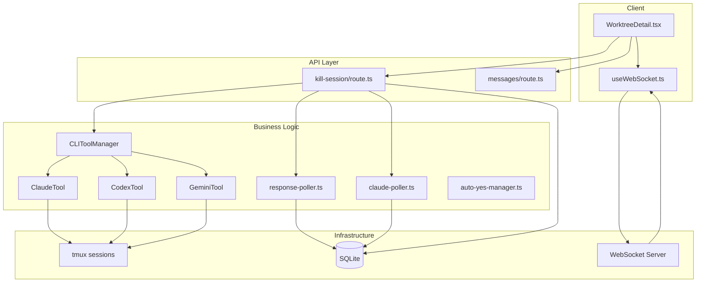
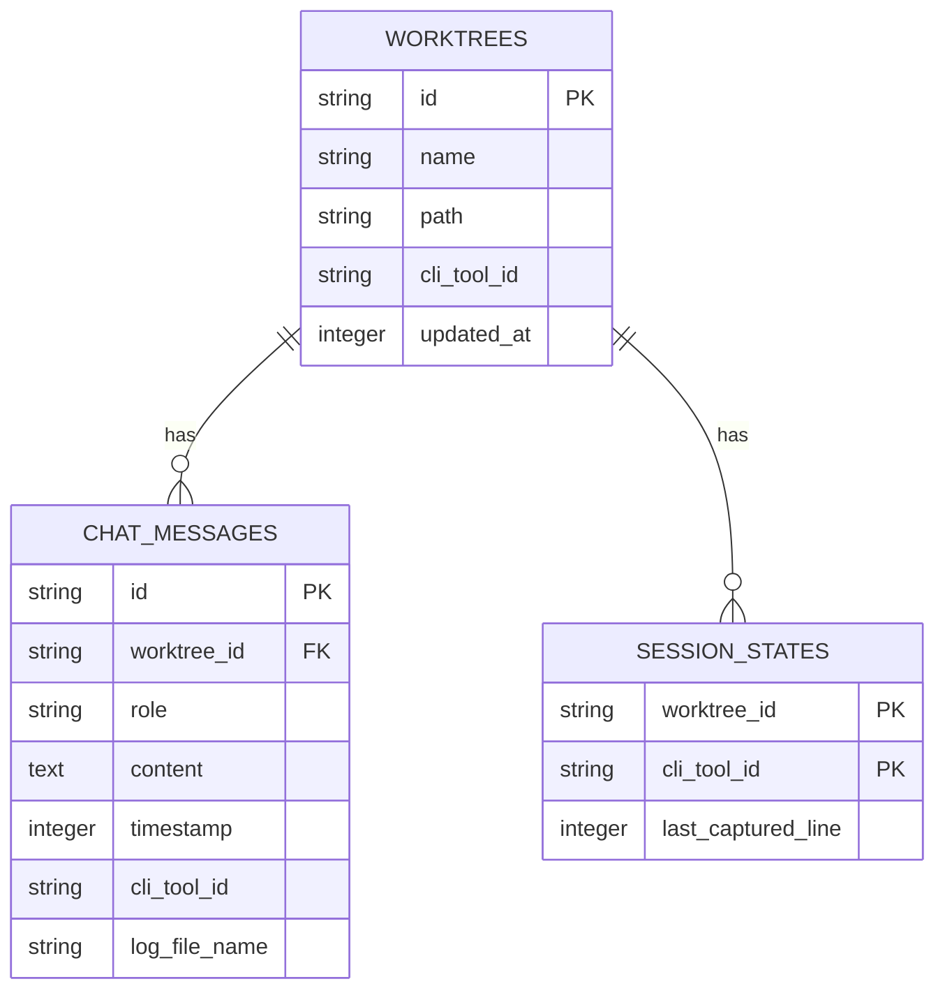

# Issue #4 Codex CLI サポート - 設計方針書

## 概要

| 項目 | 値 |
|------|-----|
| Issue番号 | #4 |
| Issue名 | CLIツールサポート（Codex CLI）|
| 作成日 | 2026-02-05 |
| ステータス | APPROVED_FOR_IMPLEMENTATION |

### 目的

Codex CLI（OpenAI）をCommandMateでサポートし、ユーザーがClaude CLIと同等のUXでCodex CLIと対話できるようにする。

### スコープ

1. **Codex CLIの有効化**: 既存のStrategy実装（`codex.ts`）をUIで有効化
2. **パターン修正**: 実機検証結果に基づくプロンプト/思考パターンの改善
3. **初期化処理修正**: モデル選択ダイアログのスキップ処理
4. **個別セッション終了機能**: Claude/Codex/Geminiを個別に終了可能に
5. **テスト更新**: 新パターンのテストカバレッジ確保

---

## 1. アーキテクチャ設計

### システム構成図



### レイヤー構成

| レイヤー | 責務 | 主要ファイル |
|---------|------|-------------|
| プレゼンテーション | UI表示、ユーザー操作 | `WorktreeDetail.tsx` |
| フック | WebSocket通信、状態管理 | `useWebSocket.ts` |
| APIルート | HTTP API エンドポイント | `kill-session/route.ts` |
| ビジネスロジック | CLIツール管理、ポーリング | `cli-tools/`, `*-poller.ts` |
| データアクセス | DB操作 | `db.ts` |
| インフラ | tmux、WebSocket | `tmux.ts`, `ws-server.ts` |

---

## 2. 技術選定

| カテゴリ | 選定技術 | 選定理由 |
|---------|---------|---------|
| CLIツール抽象化 | Strategy パターン | 既存実装（Claude/Codex/Gemini）との整合性 |
| セッション管理 | tmux | 既存実装、複数セッションの同時管理 |
| パターン検出 | RegExp | 軽量、リアルタイム検出に適合 |
| 状態管理 | SQLite | 既存DB、cli_tool_idカラム活用 |
| リアルタイム通信 | WebSocket | 既存実装、双方向通信 |

---

## 3. 設計パターン

### 3.1 Strategy パターン（既存）

CLIツールの共通インターフェースを定義し、各ツール固有の実装を分離。

```typescript
// src/lib/cli-tools/types.ts
export interface ICLITool {
  readonly id: CLIToolType;
  readonly name: string;
  readonly command: string;

  isInstalled(): Promise<boolean>;
  isRunning(worktreeId: string): Promise<boolean>;
  startSession(worktreeId: string, worktreePath: string): Promise<void>;
  sendMessage(worktreeId: string, message: string): Promise<void>;
  killSession(worktreeId: string): Promise<void>;
  getSessionName(worktreeId: string): string;
  interrupt(worktreeId: string): Promise<void>;
}

// MF1-003対応: CLI_TOOL_IDS定数から型を派生（DRY原則）
export const CLI_TOOL_IDS = ['claude', 'codex', 'gemini'] as const;
export type CLIToolType = typeof CLI_TOOL_IDS[number];
```

> **Stage 1 レビュー対応 (MF1-003)**: CLI_TOOL_IDS定数から型を派生させることで、型と定数の同期を保証。既存の`type CLIToolType = 'claude' | 'codex' | 'gemini';`は削除し、この定義に置き換える。
>
> **Stage 2 整合性確認 (MF2-001)**: 既存コード(`src/lib/cli-tools/types.ts`)の型定義を本方式に変更する必要あり。変更は軽微（型定義の置き換えのみ）で、既存のCLIToolType参照箇所への影響なし。

### 3.2 Manager パターン（既存 + 拡張）

CLIToolManagerがツールインスタンスを管理し、統一的なアクセスを提供。

```typescript
// src/lib/cli-tools/manager.ts
export class CLIToolManager {
  private static instance: CLIToolManager;
  private tools: Map<CLIToolType, ICLITool>;

  static getInstance(): CLIToolManager;
  getTool(toolId: CLIToolType): ICLITool;
  getAllTools(): ICLITool[];

  // MF1-001対応 + MF2-002対応: ポーラー停止処理を抽象化（DIP準拠、既存インターフェースと整合）
  /**
   * 指定CLIツールのポーラーを停止
   * API層がclaude-pollerへの直接依存を避けるための抽象化
   * @param worktreeId - Worktree ID
   * @param cliToolId - CLIツールID
   */
  stopPollers(worktreeId: string, cliToolId: CLIToolType): void {
    // response-pollerは全ツール共通
    stopResponsePolling(worktreeId, cliToolId);

    // MF2-002対応: 既存ICLIToolインターフェースを拡張せず、
    // CLIToolManager内でcliToolIdによる条件分岐を維持（シンプルな実装）
    // claude-pollerはClaude固有
    if (cliToolId === 'claude') {
      stopClaudePolling(worktreeId);
    }
    // 将来的に他ツール固有ポーラーが追加された場合もここで対応
  }
}
```

> **Stage 1 レビュー対応 (MF1-001)**: ポーラー停止ロジックをCLIToolManagerに集約し、API層からclaude-pollerへの直接参照を排除。これにより新CLIツール追加時もAPI層の変更が不要になる（DIP準拠）。
>
> **Stage 2 整合性確認 (MF2-002)**: 既存ICLIToolインターフェースを拡張せず、CLIToolManager内でcliToolIdによる条件分岐を維持。インターフェース拡張は大規模変更のため、シンプルな実装を採用。

### 3.3 Observer パターン（既存）

WebSocketによるリアルタイム更新通知。

```typescript
// src/lib/ws-server.ts
export function broadcast(worktreeId: string, payload: BroadcastPayload): void;

// src/hooks/useWebSocket.ts
import type { CLIToolType } from '@/lib/cli-tools/types';  // MF2-006対応: import追加

export interface SessionStatusPayload {
  type: 'session_status_changed';
  worktreeId: string;
  cliTool?: CLIToolType | null;  // 新規追加: 個別終了時のcliTool指定
  isRunning: boolean;
  messagesCleared?: boolean;
}
```

---

## 4. データモデル設計

### ER図



### 主要テーブル変更

**変更なし** - 既存スキーマで対応可能。

| テーブル | cli_tool_idカラム | 用途 |
|---------|------------------|------|
| `chat_messages` | 存在（既存） | メッセージをCLIツール別に分類 |
| `session_states` | 存在（既存） | セッション状態をCLIツール別に管理 |

### 新規関数

```typescript
// src/lib/db.ts
/**
 * 特定のCLIツールのメッセージのみを削除
 * @param db - DBインスタンス
 * @param worktreeId - Worktree ID
 * @param cliTool - CLIツールID
 * @returns 削除件数
 */
export function deleteMessagesByCliTool(
  db: Database.Database,
  worktreeId: string,
  cliTool: CLIToolType
): number {
  const stmt = db.prepare(`
    DELETE FROM chat_messages
    WHERE worktree_id = ? AND cli_tool_id = ?
  `);
  const result = stmt.run(worktreeId, cliTool);
  return result.changes;
}
```

---

## 5. API設計

### 5.1 個別セッション終了API

#### エンドポイント

```
POST /api/worktrees/:id/kill-session[?cliTool={claude|codex|gemini}]
```

#### リクエスト

| パラメータ | 位置 | 必須 | 説明 |
|-----------|------|------|------|
| `id` | パス | ✅ | Worktree ID |
| `cliTool` | クエリ | - | 終了対象のCLIツール |
| `cliToolId` | ボディ | - | 終了対象（後方互換） |

**優先順位**: クエリパラメータ > ボディパラメータ

#### レスポンス

```typescript
// 成功
{
  "success": true,
  "message": "Session killed successfully: claude-main",
  "killedSessions": ["claude-main"]
}

// エラー（404）
{
  "error": "No active sessions found for this worktree"
}

// エラー（400）
{
  "error": "Invalid cliTool: invalid. Valid values: claude, codex, gemini"
}
```

#### 実装

```typescript
// src/app/api/worktrees/[id]/kill-session/route.ts
import { CLI_TOOL_IDS, type CLIToolType } from '@/lib/cli-tools/types';
import { stopPolling as stopResponsePolling } from '@/lib/response-poller';
import { stopPolling as stopClaudePolling } from '@/lib/claude-poller';
import { deleteMessagesByCliTool, deleteAllMessages } from '@/lib/db';

export async function POST(
  request: NextRequest,
  { params }: { params: { id: string } }
) {
  const { searchParams } = new URL(request.url);

  // クエリパラメータ優先、ボディも受け付け（後方互換）
  let cliTool: CLIToolType | null = searchParams.get('cliTool') as CLIToolType | null;

  if (!cliTool) {
    try {
      const body = await request.json();
      if (body.cliToolId) {
        cliTool = body.cliToolId as CLIToolType;
      }
    } catch {
      // ボディなし = 全ツール終了
    }
  }

  // 検証
  if (cliTool && !CLI_TOOL_IDS.includes(cliTool)) {
    return NextResponse.json(
      { error: `Invalid cliTool: ${cliTool}. Valid values: ${CLI_TOOL_IDS.join(', ')}` },
      { status: 400 }
    );
  }

  const targetTools = cliTool ? [cliTool] : CLI_TOOL_IDS;

  for (const toolId of targetTools) {
    // セッション終了処理...

    // ポーラー停止
    stopResponsePolling(params.id, toolId);

    // claude-pollerはClaude終了時のみ
    if (toolId === 'claude') {
      stopClaudePolling(params.id);
    }
  }

  // メッセージ削除
  if (cliTool) {
    deleteMessagesByCliTool(db, params.id, cliTool);
  } else {
    deleteAllMessages(db, params.id);
  }

  // WebSocket通知
  broadcast(params.id, {
    type: 'session_status_changed',
    worktreeId: params.id,
    cliTool: cliTool || null,
    isRunning: false,
    messagesCleared: true,
  });

  // ...
}
```

---

## 6. セキュリティ設計

### 6.1 コマンドインジェクション対策

**対象**: `codex.ts`の`execAsync`呼び出し

```typescript
// 問題: sessionNameがそのまま使用されている
await execAsync(`tmux send-keys -t "${sessionName}" Down`);
```

**対策**: sessionName検証ガード（MF1-008対応: BaseCLIToolに共通実装）

```typescript
// src/lib/cli-tools/validation.ts（新規ファイル）
// MF1-008対応: 検証パターンを一元管理（DRY原則）
export const SESSION_NAME_PATTERN = /^[a-zA-Z0-9_-]+$/;

export function validateSessionName(sessionName: string): void {
  if (!SESSION_NAME_PATTERN.test(sessionName)) {
    throw new Error(`Invalid session name format: ${sessionName}`);
  }
}

// src/lib/cli-tools/base.ts
import { validateSessionName } from './validation';

export abstract class BaseCLITool implements ICLITool {
  // MF1-008対応 + MF2-007対応: getSessionNameで自動検証、mcbd-プレフィックス維持
  getSessionName(worktreeId: string): string {
    // MF2-007対応: 既存コードのセッション名フォーマット`mcbd-{id}-{worktreeId}`を維持
    const sessionName = `mcbd-${this.id}-${worktreeId}`;
    validateSessionName(sessionName);  // 取得時に自動検証
    return sessionName;
  }
}
```

> **Stage 1 レビュー対応 (MF1-008)**: sessionName検証をBaseCLIToolに移動し、getSessionName()で自動検証を行う。検証パターンは`validation.ts`に一元管理し、Claude/Codex/Gemini全てで共通利用。
>
> **Stage 2 整合性確認 (MF2-007)**: 既存コードのセッション名フォーマット`mcbd-{id}-{worktreeId}`を維持。これにより既存セッションとの互換性を確保。

**影響範囲**:
- `startSession()` - 行78-79
- `sendMessage()` - 行116
- `killSession()` - 行141

### 6.2 入力検証

**対象**: kill-session APIのcliToolパラメータ

```typescript
// CLI_TOOL_IDSを使用した検証
const validCliTools: CLIToolType[] = CLI_TOOL_IDS;
if (cliTool && !validCliTools.includes(cliTool)) {
  return NextResponse.json(
    { error: `Invalid cliTool: ${cliTool}` },
    { status: 400 }
  );
}
```

### 6.3 セキュリティチェックリスト

| 項目 | 対策 | ステータス | OWASP |
|------|------|-----------|-------|
| コマンドインジェクション | sessionName形式検証 | **必須実装（MF4-001）** | A03 |
| 入力検証 | CLI_TOOL_IDS定数でホワイトリスト検証 | 実装必要 | A03 |
| 権限エスカレーション | tmuxセッションはユーザー権限で実行 | 既存で対応済 | A01 |
| 情報漏洩 | ログファイルはworktree単位で隔離 | 既存で対応済 | A01 |

> **Stage 4 セキュリティレビュー (MF4-001)**: sessionName検証（MF1-008）の実装は**セキュリティ上必須**。execAsync呼び出し前にBaseCLITool.getSessionName()で自動検証されることを確認。検証パターン: `/^[a-zA-Z0-9_-]+$/`

> **Stage 4 セキュリティレビュー (MF4-002)**: tmux.ts全体にも同様のインジェクションリスクが存在するが、本Issue (#4) のスコープ外。将来のセキュリティ強化Issueで対応を推奨。

---

## 7. パフォーマンス設計

### 7.1 ポーラー管理

| ポーラー | キー形式 | 停止条件 |
|---------|---------|---------|
| response-poller | `worktreeId:cliToolId` | 該当cliTool終了時 |
| claude-poller | `worktreeId` | cliTool='claude'終了時のみ |
| auto-yes-manager | `worktreeId` | worktree削除時のみ（個別終了では停止しない） |

### 7.2 待機時間定数化

```typescript
// src/lib/cli-tools/codex.ts
const CODEX_INIT_WAIT_MS = 3000;  // Codex起動待機
const CODEX_MODEL_SELECT_WAIT_MS = 200;  // モデル選択待機

// 使用
await new Promise((resolve) => setTimeout(resolve, CODEX_INIT_WAIT_MS));
await execAsync(`tmux send-keys -t "${sessionName}" Down`);
await new Promise((resolve) => setTimeout(resolve, CODEX_MODEL_SELECT_WAIT_MS));
await execAsync(`tmux send-keys -t "${sessionName}" Enter`);
```

---

## 8. パターン修正詳細

> **Stage 1 レビュー対応 (MF1-004)**: パターン定義をデータ駆動型に変更し、OCP準拠を改善。将来的にはICLIToolインターフェースにgetPatterns()メソッドを追加することも検討。

### 8.0 パターン定義の設計方針（MF1-004対応）

```typescript
// src/lib/cli-patterns.ts
// OCP準拠: パターンをMapで管理し、新ツール追加時にswitch文修正不要

interface CliToolPatterns {
  promptPattern: RegExp;
  separatorPattern: RegExp;
  thinkingPattern: RegExp;
  skipPatterns: RegExp[];
}

// パターン定義をMapで一元管理
const CLI_TOOL_PATTERNS: Map<CLIToolType, CliToolPatterns> = new Map([
  ['claude', { /* Claude patterns */ }],
  ['codex', { /* Codex patterns */ }],
  ['gemini', { /* Gemini patterns */ }],
]);

// getCliToolPatterns関数はMapから取得するだけ
export function getCliToolPatterns(cliToolId: CLIToolType): CliToolPatterns {
  const patterns = CLI_TOOL_PATTERNS.get(cliToolId);
  if (!patterns) {
    // デフォルトはClaude
    return CLI_TOOL_PATTERNS.get('claude')!;
  }
  return patterns;
}
```

### 8.1 CODEX_THINKING_PATTERN拡張

```typescript
// 現在
/•\s*(Planning|Searching|Exploring|Running|Thinking|Working|Reading|Writing|Analyzing)/m

// 修正後（Ran, Deciding追加）
/•\s*(Planning|Searching|Exploring|Running|Thinking|Working|Reading|Writing|Analyzing|Ran|Deciding)/m
```

### 8.2 CODEX_PROMPT_PATTERN改善

```typescript
// 現在（文字がある場合のみ）
/^›\s+.+/m

// 修正後（空プロンプトも検出）
/^›\s*/m
```

### 8.3 skipPatterns追加

```typescript
// src/lib/cli-patterns.ts
case 'codex':
  return {
    // ...
    skipPatterns: [
      /^─.*─+$/,
      /^›\s*$/,
      /^›\s+(Implement|Find and fix|Type)/,
      CODEX_THINKING_PATTERN,
      /^\s*\d+%\s+context left/,
      /^\s*for shortcuts$/,
      /╭─+╮/,
      /╰─+╯/,
      // 新規追加
      /•\s*Ran\s+/,             // コマンド実行行
      /^\s*└/,                  // コマンド出力（ツリー表示）
      /^\s*│/,                  // コマンド出力（継続行）
      /\(.*esc to interrupt\)/, // 中断ヒント
    ],
  };
```

---

## 9. UI変更

### 9.1 タブ構成

```
┌─────────────────────────────────────────────────────────┐
│  [Claude●] [Codex]                                  │
│  ↑処理中   ↑未選択                                  │
├─────────────────────────────────────────────────────────┤
│  History（選択中タブのCLIツールのみ表示）            │
├─────────────────────────────────────────────────────────┤
│  [入力...]               [×セッション終了] [送信]   │
└─────────────────────────────────────────────────────────┘
```

### 9.2 セッション終了ボタン

```typescript
// src/components/worktree/WorktreeDetail.tsx
const handleKillSession = async (cliTool: CLIToolType) => {
  try {
    await worktreeApi.killSession(worktreeId, cliTool);
    // メッセージクリア
    setMessages([]);
  } catch (error) {
    setError(handleApiError(error));
  }
};

// JSX
<Button
  variant="destructive"
  size="sm"
  onClick={() => handleKillSession(activeCliTool)}
  disabled={!isSessionRunning}
>
  ×セッション終了
</Button>
```

---

## 10. 実装フェーズ

### Phase 1: パターン修正

| ファイル | 変更内容 |
|---------|---------|
| `src/lib/cli-patterns.ts` | CODEX_THINKING_PATTERN拡張、CODEX_PROMPT_PATTERN改善、skipPatterns追加、Map化（MF1-004） |

### Phase 2: 初期化処理修正

| ファイル | 変更内容 |
|---------|---------|
| `src/lib/cli-tools/codex.ts` | モデル選択スキップ処理 |
| `src/lib/cli-tools/types.ts` | CLI_TOOL_IDS定数追加、CLIToolType型派生（MF1-003） |
| `src/lib/cli-tools/validation.ts` | sessionName検証を一元管理（MF1-008） |
| `src/lib/cli-tools/base.ts` | getSessionNameで自動検証（MF1-008） |
| `src/lib/cli-tools/manager.ts` | stopPollers()メソッド追加（MF1-001） |
| `src/lib/session-cleanup.ts` | 重複CLI_TOOL_IDS定義を削除、types.tsからimport（MF3-003） |

### Phase 3: UI有効化

| ファイル | 変更内容 |
|---------|---------|
| `src/components/worktree/WorktreeDetail.tsx` | Codexタブ有効化、セッション終了ボタン追加 |

### Phase 4: 個別セッション終了

| ファイル | 変更内容 |
|---------|---------|
| `src/app/api/worktrees/[id]/kill-session/route.ts` | cliToolパラメータ対応、重複CLI_TOOL_IDS定義を削除（MF3-003） |
| `src/lib/db.ts` | deleteMessagesByCliTool関数追加（MF3-001: 新規実装必須） |
| `src/hooks/useWebSocket.ts` | SessionStatusPayload型拡張 |

> **Stage 3 影響分析 (MF3-001)**: deleteMessagesByCliTool関数は設計書で定義されているが既存コードには存在しない。Phase 4で新規実装が必須。

### Phase 5: テスト更新

| ファイル | 変更内容 |
|---------|---------|
| `tests/unit/lib/cli-patterns.test.ts` | 新パターンテスト追加、Map化回帰テスト（MF3-007） |
| `tests/unit/lib/cli-tools/codex.test.ts` | sessionName検証テスト |
| `tests/unit/lib/cli-tools/base.test.ts` | getSessionName検証テスト（MF3-009） |
| `tests/unit/lib/cli-tools/types.test.ts` | CLI_TOOL_IDS定数と型の同期テスト（MF3-002） |
| `tests/unit/lib/db.test.ts` | deleteMessagesByCliTool単体テスト（MF3-001） |
| `tests/integration/kill-session.test.ts` | 個別終了テスト（MF3-005） |

> **Stage 3 影響分析 (MF3-005)**: 以下のテストケースを追加:
> 1. cliToolクエリパラメータ指定時の個別終了
> 2. 無効なcliTool値での400エラー
> 3. WebSocket通知にcliToolが含まれることの検証

---

## 11. 設計上の決定事項とトレードオフ

### 11.1 採用した設計

| 決定事項 | 理由 | トレードオフ |
|---------|------|-------------|
| クエリパラメータ+ボディ両対応 | 後方互換性確保 | API複雑化 |
| sessionName検証ガード | セキュリティ強化 | パフォーマンス微減 |
| auto-yes-manager非停止 | worktreeId単位設計維持 | 個別終了後も動作継続 |
| claude-poller条件分岐 | Claude専用ロジック維持 | 条件分岐追加 |

### 11.2 代替案との比較

#### API設計

| 方式 | メリット | デメリット | 採否 |
|------|---------|-----------|------|
| クエリパラメータのみ | シンプル | 既存api-client.ts互換なし | × |
| ボディのみ | RESTful | 既存パターンと不整合 | × |
| **両方対応** | 後方互換+新方式 | 実装複雑化 | ✅ |

#### sessionName検証

| 方式 | メリット | デメリット | 採否 |
|------|---------|-----------|------|
| 検証なし | シンプル | インジェクションリスク | × |
| spawnAsync使用 | 安全 | 大規模リファクタリング | × |
| **正規表現検証** | 最小変更で安全確保 | パターン維持必要 | ✅ |

---

## 12. スラッシュコマンドフィルタリング

### 12.1 概要

Claude CLIとCodex CLIでは利用可能なスラッシュコマンドが異なるため、CLIツール別にコマンドをフィルタリングする機能を実装。

### 12.2 コマンド分類

| カテゴリ | Claude専用 | Codex専用 | 共通 |
|---------|-----------|-----------|------|
| コマンド数 | 12 | 10 | 4 |

#### Claude専用コマンド (12)

| コマンド | 説明 | カテゴリ |
|---------|------|---------|
| `/clear` | 会話履歴クリア | session |
| `/resume` | 前の会話を再開 | session |
| `/rewind` | 会話を巻き戻し | session |
| `/config` | 設定を開く | config |
| `/permissions` | 権限設定 | config |
| `/context` | コンテキスト使用量表示 | monitor |
| `/cost` | コスト統計表示 | monitor |
| `/pr-comments` | PRコメント表示 | git |
| `/help` | ヘルプ表示 | util |
| `/doctor` | インストール診断 | util |
| `/export` | 会話エクスポート | util |
| `/todos` | TODO一覧表示 | util |

#### Codex専用コマンド (10)

| コマンド | 説明 | カテゴリ |
|---------|------|---------|
| `/approvals` | 承認ポリシー管理 | config |
| `/diff` | 変更差分表示 | git |
| `/mention` | @メンション管理 | util |
| `/mcp` | MCPサーバー管理 | util |
| `/init` | プロジェクト初期化 | util |
| `/feedback` | フィードバック送信 | util |
| `/new` | 新規会話開始 | session |
| `/undo` | 直前の変更を取消 | session |
| `/logout` | ログアウト | session |
| `/quit` | Codex終了 | session |

#### 共通コマンド (4)

| コマンド | 説明 | カテゴリ |
|---------|------|---------|
| `/compact` | コンテキスト圧縮 | session |
| `/model` | モデル切り替え | config |
| `/status` | ステータス表示 | monitor |
| `/review` | コードレビュー | git |

### 12.3 実装詳細

#### データモデル

```typescript
// src/types/slash-commands.ts
export interface SlashCommand {
  name: string;
  description: string;
  category: SlashCommandCategory;
  // ...
  /**
   * CLI tools this command is available for
   * - undefined: available for ALL tools (backward compatible)
   * - ['claude']: Claude Code only
   * - ['codex']: Codex CLI only
   * - ['claude', 'codex']: both tools
   */
  cliTools?: CLIToolType[];
}
```

#### フィルタリング関数

```typescript
// src/lib/command-merger.ts
export function filterCommandsByCliTool(
  groups: SlashCommandGroup[],
  cliToolId: CLIToolType
): SlashCommandGroup[] {
  return groups
    .map((group) => ({
      ...group,
      commands: group.commands.filter((cmd) => {
        // cliTools未定義 = 全ツール対応（後方互換）
        if (!cmd.cliTools) return true;
        return cmd.cliTools.includes(cliToolId);
      }),
    }))
    .filter((group) => group.commands.length > 0);
}
```

#### API

```
GET /api/worktrees/:id/slash-commands?cliTool=claude|codex|gemini
```

| パラメータ | 位置 | 必須 | 説明 |
|-----------|------|------|------|
| `id` | パス | ✅ | Worktree ID |
| `cliTool` | クエリ | - | フィルタ対象CLIツール（デフォルト: claude） |

#### 主要ファイル

| ファイル | 変更内容 |
|---------|---------|
| `src/types/slash-commands.ts` | `cliTools`フィールド追加 |
| `src/lib/standard-commands.ts` | CLIツール別コマンド定義 |
| `src/lib/command-merger.ts` | `filterCommandsByCliTool()`追加 |
| `src/app/api/worktrees/[id]/slash-commands/route.ts` | クエリパラメータ対応 |
| `src/hooks/useSlashCommands.ts` | `cliToolId`パラメータ追加 |
| `src/components/worktree/MessageInput.tsx` | `cliToolId`をフックに渡す |

### 12.4 将来拡張（Issue #166）

Codexカスタムコマンド読み込み機能は別Issueとして分離：
- `~/.codex/prompts/` からのプロンプト読み込み
- `.codex/skills/` からのスキル読み込み

---

## 13. 関連ドキュメント

| ドキュメント | 説明 |
|-------------|------|
| [Issue #4](https://github.com/Kewton/CommandMate/issues/4) | 元Issue |
| [Issue #166](https://github.com/Kewton/CommandMate/issues/166) | Codexカスタムコマンド読み込み |
| [Issue Review Cycle 3](../issue/4/issue-review/cycle3/summary-report.md) | レビュー結果 |
| [CLAUDE.md](../../CLAUDE.md) | プロジェクトガイドライン |

---

## 14. レビュー履歴

### Stage 1: 通常レビュー（設計原則）- 2026-02-05

| ID | 優先度 | カテゴリ | 指摘内容 | 対応 |
|----|--------|---------|---------|------|
| MF1-001 | must_fix | DIP | kill-session APIがclaude-pollerに直接依存 | ✅ CLIToolManager.stopPollers()に抽象化 |
| MF1-003 | should_fix | DRY | CLI_TOOL_IDS定数の重複リスク | ✅ 型を定数から派生 |
| MF1-004 | should_fix | OCP | getCliToolPatternsのswitch文 | ✅ Map化で対応 |
| MF1-008 | should_fix | DRY | sessionName検証の重複リスク | ✅ BaseCLIToolに共通実装 |

### Stage 2: 整合性レビュー - 2026-02-05

| ID | 優先度 | カテゴリ | 指摘内容 | 対応 |
|----|--------|---------|---------|------|
| MF2-001 | must_fix | 整合性 | CLI_TOOL_IDS型定義の既存コードとの不整合 | ✅ 実装時の変更点を明記 |
| MF2-002 | must_fix | 整合性 | stopPollers()のICLITool拡張不整合 | ✅ 条件分岐方式に変更 |
| MF2-006 | should_fix | 整合性 | SessionStatusPayloadへのCLIToolType import不足 | ✅ import文追加 |
| MF2-007 | should_fix | 整合性 | セッション名フォーマット（mcbd-プレフィックス）不整合 | ✅ 既存フォーマット維持 |

### Stage 3: 影響分析レビュー - 2026-02-05

| ID | 優先度 | カテゴリ | 指摘内容 | 対応 |
|----|--------|---------|---------|------|
| MF3-001 | must_fix | 影響範囲 | deleteMessagesByCliTool関数が未実装 | ✅ Phase 4で新規実装必須を明記 |
| MF3-003 | must_fix | 影響範囲 | CLI_TOOL_IDS定数がsession-cleanup.ts等で重複 | ✅ Phase 2に重複解消を追加 |
| MF3-005 | should_fix | テスト | 個別CLIツール終了の統合テスト不足 | ✅ Phase 5にテストケース追加 |

### Stage 4: セキュリティレビュー - 2026-02-05

| ID | 優先度 | カテゴリ | 指摘内容 | 対応 |
|----|--------|---------|---------|------|
| MF4-001 | must_fix | A03:Injection | execAsync呼び出しのsessionNameインジェクションリスク | ✅ MF1-008の実装が必須であることを強調 |
| MF4-002 | must_fix | A03:Injection | tmux.ts全体のインジェクションリスク | ⏭️ スコープ外、将来Issue推奨 |

---

*Generated by /design-policy command - Issue #4*
*Updated by /multi-stage-design-review - Stage 1, Stage 2, Stage 3, Stage 4*
