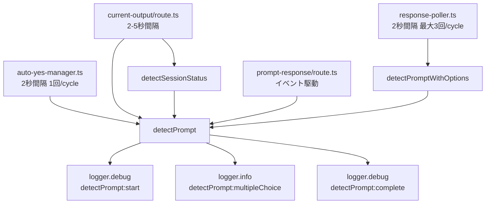
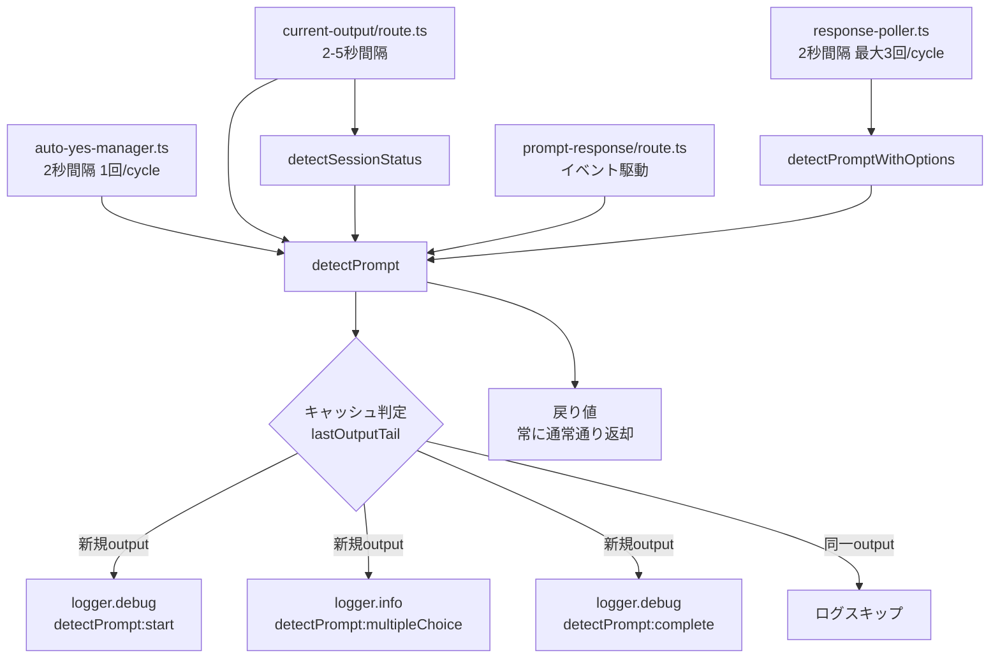

# Issue #402: detectPromptの重複ログ出力抑制 設計方針書

## 1. 概要

### 目的
`prompt-detector.ts`の`detectPrompt()`関数が1ポーリングサイクル（2秒間隔）で最大7回呼び出されており（response-poller経由 最大3回 + auto-yes-manager 1回 + status-detector 1回 + current-output/route 1回 + prompt-response/route 1回）、同一プロンプト出力に対する重複ログがサーバーログの大部分を占めている。前回と同一のoutputが渡された場合のログ出力を抑制し、I/O負荷を軽減する。 [S2-003]

### スコープ
- `src/lib/prompt-detector.ts` への重複ログ抑制キャッシュ追加
- 既存の `detectPrompt()` 関数の戻り値・振る舞いへの影響ゼロ
- テスト用キャッシュリセット関数の提供

### 対象外
- ポーリング頻度自体の変更
- ログレベル設定の変更
- `detectPrompt()` のAPIシグネチャ変更（worktreeIdパラメータ追加は見送り）
- 呼び出し元（response-poller, auto-yes-manager等）の変更

---

## 2. アーキテクチャ設計

### システム構成図（変更前）



### システム構成図（変更後）



### レイヤー構成

変更はビジネスロジック層（`src/lib/`）に閉じる。

| レイヤー | ファイル | 変更 |
|---------|---------|------|
| ビジネスロジック層 | `src/lib/prompt-detector.ts` | キャッシュ追加（主要変更） |
| プレゼンテーション層 | API routes各種 | 変更なし |
| テスト | `tests/unit/prompt-detector.test.ts` | テスト追加 |

---

## 3. 技術選定

### 設計方式: 方式(A) output末尾文字列比較

Issue内で検討された3方式のうち、方式(A)を採用する。

| 方式 | 採用 | 理由 |
|------|------|------|
| **(A) output末尾文字列比較** | **採用** | API変更不要、全呼び出し元に一括効果、実装シンプル |
| (B) worktreeIdパラメータ追加 | 不採用 | 7箇所のAPI変更が必要、YAGNI（実害が小さい誤抑制を防ぐためだけの大規模変更） [S2-003] |
| (C) 呼び出し元でキャッシュ管理 | 不採用 | DRY原則違反、7箇所で個別実装が必要 [S2-003] |

### キャッシュキー設計

- `detectPrompt()` の `output` パラメータの**末尾50行**を比較対象とする
  - 理由: `detectMultipleChoicePrompt()` の scan window が末尾50行（`effectiveEnd - 50`）、yes/noパターンは末尾20行
  - output全体の比較は不要（先頭の行はプロンプト検出に無関係）
  - 末尾50行であれば比較コストは無視できる

### 比較方式

- **単純文字列比較**を採用
  - 理由: 末尾50行のjoin結果をそのまま前回値と比較する
  - キャッシュエントリは1つのみ（前回値の保持）→メモリ影響は最小限
  - crypto.createHash等の外部依存を避けてシンプルに保つ
  - 文字列比較のコストは、50行 × 最大200文字 = 10KB程度であり、ログI/O削減効果と比較して無視できる

---

## 4. 詳細設計

### D1: モジュールスコープ変数

```typescript
// prompt-detector.ts モジュールスコープ

/**
 * Last output tail used for duplicate log suppression.
 * Only the last 50 lines of the output are compared.
 * This is a performance optimization to reduce log I/O -- it does NOT
 * affect detectPrompt()'s return value in any way.
 * @internal
 */
let lastOutputTail: string | null = null;
```

設計根拠:
- モジュールスコープ変数は `ip-restriction.ts` のモジュールスコープキャッシュと同パターン [S2-004]
- 注: `auto-yes-manager.ts` の `pollerState` は `globalThis` パターン（Hot Reload耐性目的）を使用しており、純粋なモジュールスコープ変数ではない。`lastOutputTail` はログ抑制のみが目的であり、Hot Reloadでリセットされても機能上の問題はないため、`globalThis` は不要で純粋モジュールスコープで十分である [S2-004]
- Next.js のサーバー環境ではモジュールスコープはプロセス内で共有される
- エントリ数は常に1（前回値のみ）→メモリリーク不要

### D2: detectPrompt() への組み込み

> **SRP逸脱のトレードオフ根拠 [S1-001]**: detectPrompt()に重複抑制の責務が追加されるが、outputへの直接アクセスが必要であり外部分離はKISS/YAGNIに反するため、関数内インライン実装を採用する。将来ログ抑制ロジックが複雑化した場合（worktreeId別キャッシュ等）は `shouldSuppressLog(output): boolean` ヘルパーへの抽出を検討する。

```typescript
export function detectPrompt(output: string, options?: DetectPromptOptions): PromptDetectionResult {
  // D2-001: 末尾50行の抽出（ログ抑制判定用 + yes/noパターン用にlinesを共有）
  const lines = output.split('\n');
  const tailForDedup = lines.slice(-50).join('\n');
  const isDuplicate = tailForDedup === lastOutputTail;

  // D2-002: 新規outputの場合のみログ出力
  if (!isDuplicate) {
    logger.debug('detectPrompt:start', { outputLength: output.length });
  }

  // D2-003: キャッシュ更新（ログ抑制のみ。戻り値には一切影響しない）
  lastOutputTail = tailForDedup;

  // ... 既存のプロンプト検出ロジック（変更なし） ...

  // D2-004: multipleChoice検出時のログも同様に制御
  if (multipleChoiceResult.isPrompt) {
    if (!isDuplicate) {
      logger.info('detectPrompt:multipleChoice', { ... });
    }
    return multipleChoiceResult;  // 戻り値は常に返す
  }

  // ... yes/no パターン検出（linesを再利用: detectPrompt()内でoutput.split('\n')を1回だけ実行し、
  //     キャッシュ判定用tailForDedupとyes/noパターン用lastLinesの両方で共有する。
  //     なおdetectMultipleChoicePrompt()は独立したスコープで独自にsplit()を実行しており、
  //     これは関数カプセル化の範囲内である [S1-004][S2-001]） ...

  // D2-005: No prompt detected ログも同様に制御
  if (!isDuplicate) {
    logger.debug('detectPrompt:complete', { isPrompt: false });
  }
  return { isPrompt: false, cleanContent: output.trim() };
}
```

### D3: キャッシュリセット関数

```typescript
/**
 * Reset the duplicate log suppression cache.
 * Intended for test isolation only.
 * @internal
 */
export function resetDetectPromptCache(): void {
  lastOutputTail = null;
}
```

### D4: 設計制約

| ID | 制約 | 根拠 |
|----|------|------|
| D4-001 | `detectPrompt()` の戻り値は、キャッシュ有無に関わらず常に同一であること | 5モジュール7箇所から呼び出されており、戻り値変更は広範な影響を持つ [S2-003] |
| D4-002 | ログ抑制はログ出力のみに影響し、プロンプト検出ロジック自体には影響しないこと | 既存機能の動作保証 |
| D4-003 | キャッシュエントリは1つ（前回値のみ）に限定すること | メモリリーク防止、KISS原則 |
| D4-004 | `@internal` エクスポートの `resetDetectPromptCache()` はテスト専用であること | 本番コードからの呼び出し禁止 |

---

## 5. ログ抑制戦略

### 採用: 完全スキップ方式

| 方式 | 採用 | 理由 |
|------|------|------|
| **完全スキップ** | **採用** | ログ削減効果最大、実装シンプル |
| 集約ログ（N回検出形式） | 不採用 | 実装複雑化（タイマー管理・カウント管理が必要）、YAGNI |

根拠:
- 新しいプロンプトが検出された場合は必ずログが出力される → デバッグに必要な情報は失われない
- 同一outputの繰り返し検出はログ価値がゼロ（「同じ出力を見た」は情報として無価値）
- 集約ログのタイマー管理は新たな複雑性を導入する → KISS原則に反する

### 抑制対象のログ箇所

| 箇所 | ログレベル | 抑制対象 | 理由 |
|------|----------|---------|------|
| L171 `detectPrompt:start` | debug | **対象** | 全呼び出しで出力、ログ量の主要原因 |
| L185 `detectPrompt:multipleChoice` | info | **対象** | 同一プロンプトの繰り返し検出は情報価値なし |
| L216 `detectPrompt:complete` | debug | **対象** | 全プロンプト未検出時に出力、ログ量の主要原因 |

---

## 6. セキュリティ設計

### 影響なし

- キャッシュにはoutput末尾50行の文字列が保持されるが、これはプロセスメモリ内のみ
- 外部に公開されない（APIレスポンスにキャッシュ状態は含まれない）
- 既存のログサニタイズ（logger.tsのsanitize()）には影響しない

---

## 7. パフォーマンス設計

### 期待される効果

| 指標 | 変更前 | 変更後（推定） |
|------|--------|--------------|
| ログ行数/ポーリングサイクル | 最大14行（7回×2行） | 最大2行（新規output時のみ） |
| ログファイルサイズ | 46MB（実測値） | 大幅削減（同一セッション継続中は最小限） |
| メモリ使用量 | 0 | +10KB程度（末尾50行文字列1エントリ） |
| CPU負荷 | ログI/O | 文字列比較（10KB程度、無視できるレベル） |

### キャッシュ効率

- 同一プロンプトが表示されている間（ユーザー未応答時）: **100%キャッシュヒット**
- プロンプト非表示（thinking/応答処理中）: output末尾が毎回変わるため **キャッシュミス**（通常動作でログ出力）
- status-detector.ts SF-001の2重呼び出し: 同一HTTPリクエスト内で連続呼び出しされるため **確実にキャッシュヒット**

---

## 8. テスト設計

### テストカテゴリ

| カテゴリ | テスト内容 | 優先度 |
|---------|----------|-------|
| T1: 基本動作 | 同一output→2回目以降のログスキップ | 必須 |
| T2: キャッシュミス | 異なるoutput→通常ログ出力 | 必須 |
| T3: 戻り値保証 | キャッシュヒット時の戻り値が非キャッシュ時と同一 | 必須 |
| T4: リセット | resetDetectPromptCache()後はログ出力される | 必須 |
| T5: テスト分離 | beforeEach/afterEachでキャッシュリセット | 必須 |

### テスト方式

- 重複ログ抑制テストは `describe('Duplicate log suppression')` ブロック内で `vi.spyOn(logger, 'debug')` / `vi.spyOn(logger, 'info')` を使用し、呼び出し回数を検証する [S1-008][S2-002]
- `vi.mock()` ではなく `vi.spyOn()` 方式を採用する理由: vi.mock() はファイルトップレベルにホイストされるため同一ファイル内の全テストに影響する。vi.spyOn() を describe ブロック内で使用すれば、他テストへの影響を局所化できる [S2-002]
- 重複ログ抑制テストは別ファイル (`tests/unit/prompt-detector-cache.test.ts`) または既存ファイル内の describe ブロックに配置する。別ファイルに分離する場合は vi.mock() の使用も許容される [S2-002]
- `resetDetectPromptCache()` を各テストのbeforeEachで呼び出し、テスト間の状態分離を保証

### 既存テストへの影響

| テストファイル | 影響 | 対応 |
|--------------|------|------|
| `tests/unit/prompt-detector.test.ts` | キャッシュ状態の共有 | beforeEachにresetDetectPromptCache()追加 |
| `tests/unit/lib/status-detector.test.ts` | 間接影響（detectPromptをmock可能性） | 影響確認、必要に応じてリセット追加 |
| `tests/integration/issue-256-acceptance.test.ts` | 間接影響 | 影響確認 |
| `tests/integration/issue-208-acceptance.test.ts` | 間接影響 | 影響確認 |

---

## 9. 設計上の決定事項とトレードオフ

### 採用した設計

| ID | 決定事項 | 理由 | トレードオフ |
|----|---------|------|-------------|
| DC-001 | 方式(A): output末尾文字列比較 | API変更不要、全呼び出し元に一括効果 | 異なるワークツリーの同一出力が相互に抑制される（実害小：同一outputは事実上発生しない）。複数worktreeが同時にアクティブな場合、異なるworktreeの呼び出しがキャッシュを交互に上書きしキャッシュヒット率が低下するが、最悪ケースでも変更前と同等のログ量に留まり、機能劣化は生じない。CommandMateはローカル単一プロセスでの動作を前提としており、サーバーレス/クラスタ環境は対象外である [S1-002][S3-003] |
| DC-002 | 文字列比較（ハッシュ計算なし） | 10KB程度の比較コストは無視できる。crypto依存なし | 出力が大きい場合の比較コスト（50行に限定で緩和済み） |
| DC-003 | 完全スキップ（集約ログなし） | 実装シンプル、KISS原則 | デバッグ時にログが少なくなる（新規output時は出力されるため実害小） |
| DC-004 | キャッシュエントリ1つ | メモリリーク防止、KISS原則 | 高速にワークツリーが切り替わる場合にキャッシュヒット率が下がる（実害なし） |
| DC-005 | 末尾50行の比較 | 検出ウィンドウ（50行）と一致、先頭行は無関係 | output全体の微小な違いを検出できない（検出に使われない部分の変化なので問題なし） |

### 代替案との比較

| 代替案 | 不採用理由 |
|--------|----------|
| logger.ts側にグローバル重複抑制 | 他モジュールのログにも影響、スコープが広すぎる |
| env変数でログレベルをinfoに設定 | 根本解決ではない、他のdebugログも消える |
| ポーリング頻度の削減 | 機能への影響大、別Issue扱い |
| detectPrompt()のメモ化（結果キャッシュ） | 戻り値のキャッシュは複雑性が高い。ログ抑制のみが目的なので不要 |

---

## 10. 影響範囲

### 変更対象ファイル

| ファイル | 変更内容 |
|---------|---------|
| `src/lib/prompt-detector.ts` | モジュールスコープキャッシュ変数追加、detectPrompt()内のログ出力にisDuplicateガード追加、resetDetectPromptCache() `@internal` export追加 |
| `tests/unit/prompt-detector.test.ts` | キャッシュリセットのbeforeEach追加、重複抑制テストケース追加 |
| `CLAUDE.md` | prompt-detector.tsのモジュール説明にキャッシュ機構の記載を追加 |

### 影響確認対象（コード変更なし）

| ファイル | 確認内容 |
|---------|---------|
| `src/lib/response-poller.ts` | detectPromptWithOptions()経由の呼び出しに影響がないこと |
| `src/lib/auto-yes-manager.ts` | ポーリング動作に影響がないこと |
| `src/lib/status-detector.ts` | SF-001の2重呼び出しがキャッシュで自然に抑制されること |
| `src/app/api/worktrees/[id]/current-output/route.ts` | レスポンスに影響がないこと |
| `src/app/api/worktrees/[id]/prompt-response/route.ts` | プロンプト応答に影響がないこと |

---

## 11. CLAUDE.md更新内容

prompt-detector.tsのモジュール説明に以下を追加:

```
**Issue #402: 重複ログ抑制** - lastOutputTailモジュールスコープキャッシュで同一output末尾50行の重複ログをスキップ、resetDetectPromptCache() @internal exportでテスト分離
```

---

## 12. レビュー指摘反映サマリー

### Stage 1: 通常レビュー（設計原則）

| ID | 重要度 | カテゴリ | 対応 | 反映箇所 |
|----|--------|---------|------|---------|
| S1-001 | should_fix | SRP | 反映済 | セクション4 D2: SRP逸脱のトレードオフ根拠を追記 |
| S1-002 | should_fix | その他 | 反映済 | セクション9 DC-001: 複数worktree時のキャッシュヒット率低下の説明を補強 |
| S1-003 | nice_to_have | 命名 | 反映済 | セクション3タイトル・mermaid図・キャッシュキー設計: 「ハッシュ」用語を「文字列比較」に統一 |
| S1-004 | nice_to_have | KISS | 反映済 | セクション4 D2: output.split()を1回に統一し、lines変数を共有するコメントを追加 |
| S1-005 | nice_to_have | OCP | 指摘なし | OCP遵守の確認（変更不要） |
| S1-006 | nice_to_have | DRY | 指摘なし | 現時点では3箇所のインラインガードで十分（KISS優先） |
| S1-007 | nice_to_have | YAGNI | 指摘なし | YAGNI遵守の確認（変更不要） |
| S1-008 | should_fix | その他 | 反映済 | セクション8: テスト方式のモック記述をloggerモック方式に修正 |

### 実装チェックリスト

- [ ] D2コード例に基づき、`output.split('\n')`を`detectPrompt()`関数冒頭で1回だけ実行し、キャッシュ判定用tailForDedupとyes/noパターン用lastLinesの両方でlinesを共有する。`detectMultipleChoicePrompt()`内のsplit()は独立スコープのため共有対象外 [S1-004][S2-001]
- [ ] 重複ログ抑制テストは`describe('Duplicate log suppression')`ブロック内で`vi.spyOn(logger, 'debug')`/`vi.spyOn(logger, 'info')`を使用し呼び出し回数を検証する。vi.mock()ではなくvi.spyOn()方式を採用し他テストへの影響を局所化する [S1-008][S2-002]
- [ ] 重複ログ抑制テストを別ファイル(`tests/unit/prompt-detector-cache.test.ts`)または既存ファイル内のdescribeブロックに配置する [S2-002]
- [ ] SRP逸脱に関するトレードオフはコードコメントとしても残す [S1-001]
- [ ] 将来ログ箇所が増えた場合のconditionalLoggerパターンを実装時のコードコメントとして留意事項に残す [S1-006]
- [ ] D1のモジュールスコープ変数は`globalThis`パターンではなく純粋モジュールスコープで実装する（Hot Reload耐性不要のため） [S2-004]
- [ ] `tests/unit/prompt-detector.test.ts` の全テスト describe ルートレベルの beforeEach に `resetDetectPromptCache()` を追加する（テスト分離の保証） [S3-001]
- [ ] `tests/unit/lib/status-detector.test.ts` に `resetDetectPromptCache()` のインポートと beforeEach での呼び出しを追加する（推奨: テスト分離のベストプラクティス） [S3-009]

### Stage 2: 整合性レビュー

| ID | 重要度 | カテゴリ | 対応 | 反映箇所 |
|----|--------|---------|------|---------|
| S2-001 | should_fix | 整合性 | 反映済 | セクション4 D2: split()共有コメントを正確化。detectMultipleChoicePrompt()の独立スコープでのsplit()について明記 |
| S2-002 | should_fix | 整合性 | 反映済 | セクション8: テスト方式をvi.mock()からvi.spyOn()方式に変更、別ファイル分離オプションを追記 |
| S2-003 | nice_to_have | 整合性 | 反映済 | セクション1概要: 「最大6回」を「最大7回」に修正、呼び出し元の内訳を明記。セクション3, 7, 9の関連箇所も整合性を確保 |
| S2-004 | nice_to_have | 整合性 | 反映済 | セクション4 D1: auto-yes-manager.tsのglobalThisパターンとの違いを明記、ip-restriction.tsを参照パターンに変更 |
| S2-005 | nice_to_have | 整合性 | 未反映 | D2-004のlogger.info引数の完全記載は実装時に対応（設計方針書ではコード例を簡略表記する方針を維持） |

### Stage 3: 影響分析レビュー

| ID | 重要度 | カテゴリ | 対応 | 反映箇所 |
|----|--------|---------|------|---------|
| S3-001 | should_fix | テスト分離 | 反映済 | セクション12 実装チェックリスト: `tests/unit/prompt-detector.test.ts` の beforeEach に `resetDetectPromptCache()` 追加を必須項目として明記 |
| S3-002 | nice_to_have | Hot Reload | 対応不要 | 設計判断は妥当。Hot Reload時リセットの影響なしはセクション4 D1で説明済み。コードコメントでの補足は実装時に検討 |
| S3-003 | should_fix | マルチプロセス | 反映済 | セクション9 DC-001: 「CommandMateはローカル単一プロセスでの動作を前提としており、サーバーレス/クラスタ環境は対象外」を追記 |
| S3-004 | nice_to_have | 間接影響 | 対応不要 | status-detector.ts SF-001の2重呼び出しキャッシュヒットはセクション7で分析済み |
| S3-005 | nice_to_have | 間接影響 | 対応不要 | response-poller.ts の戻り値影響なし（D4-001/D4-002制約による） |
| S3-006 | nice_to_have | 間接影響 | 対応不要 | auto-yes-manager.ts のglobalThisパターンはlastOutputTailのモジュールスコープキャッシュと独立 |
| S3-007 | nice_to_have | パフォーマンス | 対応不要 | 文字列比較コスト対ログI/O削減のトレードオフはセクション7で分析済み |
| S3-008 | nice_to_have | 統合テスト | 対応不要 | 統合テストへの影響は軽微。セクション8のテスト影響表で対応方針記載済み |
| S3-009 | should_fix | テスト分離 | 反映済 | セクション12 実装チェックリスト: `tests/unit/lib/status-detector.test.ts` への `resetDetectPromptCache()` 追加を推奨項目として明記 |

---

*Generated by /design-policy command for Issue #402*
*Stage 1 review findings applied on 2026-03-03*
*Stage 2 review findings applied on 2026-03-03*
*Stage 3 review findings applied on 2026-03-03*
