# 設計方針書: Issue #404 長期運用時のリソースリーク対策

## 0. レビュー指摘事項サマリー

本設計方針書はStage 1レビュー（通常レビュー / 設計原則）、Stage 2レビュー（整合性レビュー）、Stage 3レビュー（影響分析レビュー）、およびStage 4レビュー（セキュリティレビュー）の指摘事項を反映済みである。

### Stage 1 レビュー（通常レビュー / 設計原則）

| ID | 重要度 | カテゴリ | タイトル | 対応状況 |
|----|--------|---------|---------|---------|
| R1-001 | must_fix | DRY | MCPプロセス検出ロジックのshell/TypeScript二重実装 | 反映済み: TypeScript実装に一本化（Section 3.1, 3.6, 6） |
| R1-002 | should_fix | SRP | resource-cleanup.tsの責務境界明確化 | 反映済み: 責務区分を明記（Section 3.1） |
| R1-003 | should_fix | インターフェース | stopScheduleForWorktree()の引数簡素化 | 反映済み: worktreePath引数を削除（Section 3.3） |
| R1-004 | should_fix | OCP | stopScheduleForWorktree()の計算量 | スキップ: 現行設計で許容範囲（MAX_CONCURRENT_SCHEDULES=100） |
| R1-005 | nice_to_have | YAGNI | カプセル化改善の代替案 | 反映済み: 代替案を注記（Section 6） |
| R1-006 | nice_to_have | KISS | コンテナ環境検出ロジックの簡素化 | スキップ: 現行設計維持 |
| R1-007 | nice_to_have | DIP | resource-cleanup.tsの直接依存 | スキップ: 現時点では過剰設計（YAGNI） |

### Stage 2 レビュー（整合性レビュー）

| ID | 重要度 | カテゴリ | タイトル | 対応状況 |
|----|--------|---------|---------|---------|
| R2-001 | must_fix | Issue整合性 | 変更対象モジュールにresponse-poller.tsが欠落 | 反映済み: Section 2.2に追加 |
| R2-002 | must_fix | Issue整合性 | activeProcesses方式(c)ラベルのIssue本文との混乱 | 反映済み: Section 3.3に注記追加 |
| R2-003 | should_fix | コード整合性 | gracefulShutdownシーケンス図のisShuttingDownガード未反映 | スキップ: 図のスコープ外で修正不要 |
| R2-004 | should_fix | コード整合性 | CLAUDE.mdのstopScheduleForWorktree()事前記載と未実装の矛盾 | 反映済み: Section 3.4に注記追加 |
| R2-005 | should_fix | 内部整合性 | R1-001チェックリストが存在しないbash関数を参照 | 反映済み: チェックリストと Section 3.6の表現修正 |
| R2-006 | nice_to_have | 内部整合性 | CleanupMapResultにschedule-manager関連の拡張注記 | スキップ: 現時点では不要（設計決定済み） |

### Stage 3 レビュー（影響分析レビュー）

| ID | 重要度 | カテゴリ | タイトル | 対応状況 |
|----|--------|---------|---------|---------|
| R3-001 | must_fix | テスト | session-cleanup.test.tsのモック不足による既存テスト破壊リスク | 反映済み: Section 5.1にモック前提条件を追記 |
| R3-002 | must_fix | 既存機能 | stopScheduleForWorktree()のDB lookup前提条件とフォールバック未定義 | 反映済み: Section 3.3の制約表に前提条件・フォールバックを追記 |
| R3-003 | should_fix | ホットリロード | initResourceCleanup()の重複タイマー防止ロジック未明示 | 反映済み: Section 3.1のインターフェースに二重実行防止コメントを追記 |
| R3-004 | should_fix | 並行処理 | cleanupOrphanedMapEntries()のレース条件リスク | 反映済み: Section 3.1のインターフェースにレース条件なしの設計根拠を追記 |
| R3-005 | should_fix | 既存機能 | cleanupMultipleWorktrees()のN回DB lookupパターン | スキップ: 性能影響は無視できる範囲（MAX_CONCURRENT_SCHEDULES=100、better-sqlite3同期API） |
| R3-006 | nice_to_have | 干渉 | stopScheduleForWorktree()のcmateFileCache削除の副作用 | スキップ: 現時点ではworktree削除コンテキストのみが呼び出し元であり実害なし |

### Stage 4 レビュー（セキュリティレビュー）

| ID | 重要度 | カテゴリ | タイトル | 対応状況 |
|----|--------|---------|---------|---------|
| R4-001 | must_fix | globalThis | deleteAutoYesState()のworktreeId入力バリデーション欠如 | 反映済み: Section 3.2にisValidWorktreeId()ガード追加（SEC-404-001） |
| R4-002 | should_fix | プロセスkill | PID再利用によるプロセス誤killリスクの軽減策が未記載 | 反映済み: Section 4セキュリティ設計表にTOCTOUリスク行を追加 |
| R4-003 | should_fix | シェルインジェクション | psコマンド出力パーサーの防御的実装ガイダンス不足 | 反映済み: Section 3.1に防御的パーサー実装ガイダンスを追記 |
| R4-004 | should_fix | DoS | psコマンド出力サイズの上限未設定 | 反映済み: Section 3.1にMAX_PS_OUTPUT_BYTES定数を追加 |
| R4-005 | nice_to_have | 情報漏洩 | OrphanCleanupResultのログ出力における機密情報制御の明記 | スキップ: 現時点ではPID+プロセス名のみの固定フォーマットで十分 |
| R4-006 | nice_to_have | globalThis | globalThis.__resourceCleanupTimerIdの型安全性強化 | スキップ: 現行設計で十分（レビュー所見と一致） |

### 実装チェックリスト

- [ ] R1-001: `build-and-start.sh` にMCPクリーンアップのbash関数を追加しない（TypeScript実装 `cleanupOrphanedMcpProcesses()` に一本化済み）
- [ ] R1-002: `resource-cleanup.ts` 内にセクションコメントで責務境界を明記（Section 1: MCPプロセス / Section 2: globalThis Map）
- [ ] R1-003: `stopScheduleForWorktree()` のシグネチャを `(worktreeId: string)` に簡素化し、worktreePath解決を内部実装に閉じる
- [ ] R1-005: `getAutoYesStateWorktreeIds()` / `getAutoYesPollerWorktreeIds()` の代替案（auto-yes-manager.ts内にクリーンアップ関数を配置）を実装時に再検討
- [ ] R3-001: `session-cleanup.test.ts` に `vi.mock('@/lib/auto-yes-manager')` と `vi.mock('@/lib/schedule-manager')` を追加し、既存テストの回帰確認を最初に実施
- [ ] R3-002: `stopScheduleForWorktree()` にDB lookup失敗時のフォールバック処理（スケジュール・cronJob停止のみ実施、`console.warn` ログ出力）を実装
- [ ] R3-003: `initResourceCleanup()` 冒頭で `globalThis.__resourceCleanupTimerId` の存在チェックを行い、既存タイマーがある場合は処理をスキップ
- [ ] R3-004: `cleanupOrphanedMapEntries()` のDB照会とMap走査を同一同期区間で実行（async/awaitを挟まない）
- [ ] R4-001: `deleteAutoYesState()` の冒頭で `isValidWorktreeId(worktreeId)` チェックを追加し、不正な worktreeId の場合は `false` を返却（defense-in-depth）
- [ ] R4-002: Section 4 セキュリティ設計表に「ps取得→killのTOCTOUリスク」行が記載されていることを実装時に確認し、SIGTERM→確認→SIGKILL の2段階方式を検討
- [ ] R4-003: ps出力パーサーで `parseInt()` 後に `Number.isInteger(pid) && pid > 0` チェックを実装、不正フォーマット行をスキップ、`MCP_PROCESS_PATTERNS` マッチに境界マッチを使用
- [ ] R4-004: `execFile('ps', [...], { maxBuffer: MAX_PS_OUTPUT_BYTES })` で `MAX_PS_OUTPUT_BYTES = 1MB` を設定

---

## 1. 概要

長期運用時に蓄積するリソースリーク（孤立MCPプロセス・globalThis Mapメモリリーク）を一括で対処する。

### スコープ

| カテゴリ | 内容 |
|---------|------|
| A. 孤立MCPプロセス | サーバー起動時の残留プロセス検出・停止 |
| B. globalThis Mapリーク | worktree削除時のエントリ削除 + 定期クリーンアップ |

---

## 2. アーキテクチャ設計

### 2.1 システム構成図

```mermaid
graph TD
    subgraph "サーバー起動シーケンス"
        Start[server.listen] --> Init[initializeWorktrees]
        Init --> SM[initScheduleManager]
        SM --> RC[initResourceCleanup - 新規]
        RC --> MCP[cleanupOrphanedMcpProcesses - 新規]
    end

    subgraph "Graceful Shutdown"
        Signal[SIGTERM/SIGINT] --> SP[stopAllPolling]
        SP --> SAY[stopAllAutoYesPolling]
        SAY --> SAS[stopAllSchedules]
        SAS --> SRC[stopResourceCleanup - 新規]
        SRC --> WS[closeWebSocket]
        WS --> Close[server.close]
    end

    subgraph "Worktree削除フロー"
        Del[DELETE /api/repositories] --> CMS[cleanupMultipleWorktrees]
        CMS --> CWS[cleanupWorktreeSessions]
        CWS --> Kill[killSessionFn per CLI tool]
        CWS --> SRP[stopResponsePolling per CLI tool]
        CWS --> SAYP[stopAutoYesPolling]
        CWS --> DAS[deleteAutoYesState - 新規]
        CWS --> SSFW[stopScheduleForWorktree - 新規]
    end

    subgraph "定期クリーンアップ（24h）"
        Timer[setInterval 24h] --> Scan[DBとMapの差分検出]
        Scan --> DelAY[autoYesStates孤立エントリ削除]
        Scan --> DelAYP[autoYesPollerStates孤立エントリ削除]
    end
```



### 2.2 変更対象モジュール

| モジュール | 変更種別 | 内容 |
|-----------|---------|------|
| `src/lib/resource-cleanup.ts` | **新規** | 定期クリーンアップ + MCP孤立プロセス検出（唯一のMCP検出ロジック実装箇所） |
| `src/lib/session-cleanup.ts` | 修正 | `stopAllSchedules()` → `stopScheduleForWorktree()` + `deleteAutoYesState()` 追加 |
| `src/lib/auto-yes-manager.ts` | 修正 | `deleteAutoYesState()` エクスポート関数追加 |
| `src/lib/schedule-manager.ts` | 修正 | `stopScheduleForWorktree(worktreeId)` エクスポート関数追加（worktreePath引数なし） |
| `server.ts` | 修正 | `initResourceCleanup()` / `stopResourceCleanup()` 組み込み |
| `src/lib/response-poller.ts` | 確認 | `tuiResponseAccumulator` Mapのworktreeエントリクリーンアップ確認（`stopPolling()`内の`clearTuiAccumulator()`で対応済みの確認、未カバーケースの補完） |

> **R1-001対応**: `scripts/build-and-start.sh` にMCPクリーンアップのbash関数は追加しない。`initResourceCleanup()` 内の `cleanupOrphanedMcpProcesses()` に一本化し、DRY原則を遵守する。server.tsの起動シーケンスでNode.jsは起動済みであり、TypeScript実装のみで十分である。

---

## 3. 詳細設計

### 3.1 新規モジュール: `src/lib/resource-cleanup.ts`

#### 責務（R1-002対応: 責務境界の明確化）

このモジュールは「リソースクリーンアップ」という上位概念で2つの独立した責務を束ねる。
将来的にどちらかの責務が肥大化した場合は、個別モジュールへの分離を検討する。

| セクション | 責務 | 実行タイミング | 変更理由 |
|-----------|------|--------------|---------|
| **Section 1: MCPプロセスクリーンアップ** | 孤立MCPプロセスの検出・停止（外部プロセス管理） | サーバー起動時1回のみ | MCPプロセスパターンの追加・変更 |
| **Section 2: globalThis Mapクリーンアップ** | 孤立Mapエントリの定期削除（Node.jsプロセス内メモリ管理） | 24時間ごと（setInterval） | クリーンアップ対象Mapの追加 |

- `initResourceCleanup()` は両セクションを初期化する**オーケストレーター**として設計する
- `cleanupOrphanedMcpProcesses()` と `cleanupOrphanedMapEntries()` はそれぞれ独立してテスト可能であること
- ファイル内のコメントでセクション区切りを明示すること（`// === Section 1: MCP Process Cleanup ===` 等）

#### インターフェース

```typescript
// サーバー起動時に呼び出し（initScheduleManager()の後）
// R3-003対応: initScheduleManager()と同様にinitializedフラグ（globalThis.__resourceCleanupTimerId）で二重実行を防止する。
// globalThis.__resourceCleanupTimerId が既に存在する場合は console.log で通知して return する。
// これによりNext.js dev mode（hot reload）でのモジュール再評価時に24時間タイマーが重複起動することを防止する。
// 参考: schedule-manager.ts L604-609 の initScheduleManager() の initialized ガードパターン。
export function initResourceCleanup(): void;

// gracefulShutdown時に呼び出し
export function stopResourceCleanup(): void;

// 孤立MCPプロセスの検出・停止（起動時1回のみ）
export function cleanupOrphanedMcpProcesses(): Promise<OrphanCleanupResult>;

// 孤立Mapエントリのクリーンアップ（定期実行 + オンデマンド）
// @internal export for testing
//
// R3-004設計根拠: レース条件なしの保証
// better-sqlite3の同期API（getAllWorktrees()）とMap走査（Map.keys()イテレーション + Map.delete()）は
// 同一同期区間で実行される（async/awaitを挟まない）。Node.jsのシングルスレッド特性により、
// DB照会からMap削除完了までの間にイベントループが介入しないため、worktree削除フローとの
// レース条件は構造的に発生しない。
// 注意: 将来的にDB APIが非同期化（async/await導入）された場合、DB照会とMap走査の間に
// イベントループが介入し、レース条件が発生する可能性がある。その場合は同期保証の再設計が必要。
export function cleanupOrphanedMapEntries(): CleanupMapResult;
```

#### 型定義

```typescript
interface OrphanCleanupResult {
  detected: number;
  killed: number;
  errors: string[];
}

interface CleanupMapResult {
  autoYesStatesRemoved: number;
  autoYesPollerStatesRemoved: number;
}
```

#### globalThisタイマー管理

```typescript
declare global {
  var __resourceCleanupTimerId: ReturnType<typeof setInterval> | undefined;
}
```

#### 定数

```typescript
const CLEANUP_INTERVAL_MS = 24 * 60 * 60 * 1000; // 24時間
const MCP_PROCESS_PATTERNS = ['codex mcp-server', 'playwright-mcp'] as const;
const LOG_PREFIX = '[Resource Cleanup]';
const MAX_PS_OUTPUT_BYTES = 1 * 1024 * 1024; // 1MB (ps出力上限, tmux.tsのcapturePane 10MBより小さく設定)
```

> **R4-004対応**: `execFile('ps', [...], { maxBuffer: MAX_PS_OUTPUT_BYTES })` でps出力サイズを制限し、異常な数のプロセスが存在するシステムでのメモリ圧迫を防止する。

#### 孤立MCPプロセス検出ロジック

```typescript
// macOS/Linux共通: psコマンドでppid=1のNodeプロセスを検索
// 多段階フィルタ:
// 1. ppid=1（init/launchdにリペアレントされたプロセス）
// 2. プロセス名パターンマッチ（MCP_PROCESS_PATTERNS）
// 3. コンテナ環境検出: /proc/1/cgroup 存在チェック → Docker環境ではスキップ
```

**ps出力パーサーの防御的実装ガイダンス（R4-003対応）**:

- PIDの `parseInt()` 後に `Number.isInteger(pid) && pid > 0` チェック必須。不正値の行はスキップする
- 不正フォーマット行はスキップ（例外を投げない）。各行のパースは独立して安全に処理する
- `MCP_PROCESS_PATTERNS` のマッチは部分一致（`includes()`）ではなく境界マッチを推奨（プロセス引数配列のexact matchまたは正規表現の単語境界`\b`を使用）

**設計決定**: `execFile('ps', [...])` を使用（シェルインジェクション防止、プロジェクト規約に準拠）

### 3.2 `auto-yes-manager.ts` への追加

#### 新規エクスポート関数

```typescript
/**
 * Delete auto-yes state for a worktree (cleanup on worktree deletion).
 * MUST be called AFTER stopAutoYesPolling(worktreeId) to prevent race conditions.
 * [SEC-404-001] Validates worktreeId via isValidWorktreeId() before deletion.
 */
export function deleteAutoYesState(worktreeId: string): boolean {
  if (!isValidWorktreeId(worktreeId)) return false; // defense-in-depth
  return autoYesStates.delete(worktreeId);
}

/**
 * Get all worktree IDs that have auto-yes state entries.
 * @internal Exported for resource-cleanup periodic scanning.
 */
export function getAutoYesStateWorktreeIds(): string[] {
  return Array.from(autoYesStates.keys());
}

/**
 * Get all worktree IDs that have poller state entries.
 * @internal Exported for resource-cleanup periodic scanning.
 */
export function getAutoYesPollerWorktreeIds(): string[] {
  return Array.from(autoYesPollerStates.keys());
}
```

### 3.3 `schedule-manager.ts` への追加

#### 新規エクスポート関数（R1-003対応: 引数簡素化）

```typescript
/**
 * Stop all schedules for a specific worktree.
 * Unlike stopAllSchedules() (server shutdown), this targets a single worktree.
 *
 * Responsibilities:
 * (a) Stop cron jobs + delete schedules Map entries for this worktree
 * (b) Delete cmateFileCache entry for this worktree (internal DB lookup for path resolution)
 * (c) Does NOT stop global timer or kill all active processes
 */
export function stopScheduleForWorktree(worktreeId: string): void;
```

> **R1-003変更**: `worktreePath?: string` オプション引数を削除。
> - **理由**: 呼び出し元の `session-cleanup.ts` の `cleanupWorktreeSessions()` は `worktreeId` のみを保持しており、`worktreePath` は常に省略される。オプション引数の存在が関数の動作に暗黙的な分岐を生じさせていた。
> - **対応**: `cmateFileCache` のキー（worktree path）の解決は、`stopScheduleForWorktree()` の内部実装でDB lookup（`getWorktreeById(worktreeId)`）を行う。KISS原則に合致する。

#### 実装上の制約

| 制約 | 対応方針 |
|------|---------|
| `schedules` MapのキーはscheduleId（UUID） | 全エントリをイテレーションしworktreeIdフィルタ |
| `cmateFileCache` のキーはworktree path | 内部でDB lookup（worktreeId → path変換）を実行 |
| `activeProcesses` のキーはPID（number） | **方式(c)採用**: 自然回収に委ねる（下記参照） |
| **前提条件（R3-002）**: DB lookup依存 | `stopScheduleForWorktree()` はDBからworktreeレコードが削除される**前に**呼び出されること。`repositories/route.ts` の `cleanupMultipleWorktrees()` → `deleteWorktreesByIds()` の順序に依存する |
| **フォールバック（R3-002）**: DB lookup失敗時 | `getWorktreeById()` がnullを返した場合、worktreeパスの解決をスキップする（`cmateFileCache` エントリは残留するが、次回の定期クリーンアップ `cleanupOrphanedMapEntries()` で回収される）。スケジュールMapの走査とcronJob停止は worktreeId ベースのため DB lookup に依存せず実施可能。DB lookup失敗時は `console.warn` でログ出力しデバッグ可能にする |

#### activeProcesses のworktree単位停止方針

**採用: 方式(c) - 自然回収委任**

> **注意**: Issue本文中の責務(c)「activeProcessesのworktreeプロセスをSIGKILL」という記載は旧設計案であり、設計方針書では**方式(c): 自然回収委任**を採用している。「方式(c)」というラベルが同じだが内容が異なるため、Issue本文の記述よりも本設計方針書の記述が優先される。

理由:
- `cronJob.stop()` で新規実行は即座に防止される
- 実行中プロセスは `EXECUTION_TIMEOUT_MS=5分` で自動タイムアウト
- `executeClaudeCommand()` の `ExecuteCommandOptions` 型変更を避けられる（YAGNI原則）
- worktree削除は緊急度の低い操作であり、5分の遅延は許容範囲

### 3.4 `session-cleanup.ts` の修正

#### 変更箇所

```typescript
export async function cleanupWorktreeSessions(
  worktreeId: string,
  killSessionFn: KillSessionFn
): Promise<WorktreeCleanupResult> {
  // ... 既存処理 ...

  // 2. Stop auto-yes-poller (Issue #138)
  stopAutoYesPolling(worktreeId);

  // 3. Delete auto-yes state (Issue #404) - MUST be AFTER stopAutoYesPolling
  deleteAutoYesState(worktreeId);

  // 4. Stop schedules for this worktree (Issue #404)
  // 旧: stopAllSchedules() → 新: stopScheduleForWorktree()
  stopScheduleForWorktree(worktreeId);

  return result;
}
```

> **注意（R2-004）**: CLAUDE.mdには「Issue #294: stopScheduleForWorktree()呼び出し追加」と記載されているが、実際のコード（`src/lib/session-cleanup.ts` L109-117）では `stopAllSchedules()` が呼ばれており未実装である。本Issueで実装する。

#### 呼び出し順序（レース条件防止）

```
1. killSessionFn() per CLI tool    ← セッション停止
2. stopResponsePolling() per tool  ← レスポンスポーラー停止
3. stopAutoYesPolling(worktreeId)  ← ポーラータイマークリア + pollerState削除
4. deleteAutoYesState(worktreeId)  ← autoYesState削除（3の後に実行必須）
5. stopScheduleForWorktree(worktreeId) ← スケジュール停止
```

### 3.5 `server.ts` の修正

```typescript
// 起動シーケンス
server.listen(port, hostname, async () => {
  console.log(`Ready on ...`);
  await initializeWorktrees();
  initScheduleManager();
  initResourceCleanup(); // ← 追加（定期クリーンアップ開始 + MCPプロセスクリーンアップ）
});

// シャットダウンシーケンス
function gracefulShutdown(signal: string) {
  // ... 既存処理 ...
  stopAllPolling();
  stopAllAutoYesPolling();
  stopAllSchedules();
  stopResourceCleanup(); // ← 追加（定期クリーンアップタイマー停止）
  closeWebSocket();
  // ...
}
```

### 3.6 `scripts/build-and-start.sh` の方針（R1-001対応: DRY原則）

**方針**: `build-and-start.sh` にMCPクリーンアップのbash関数を**追加しない**（TypeScript実装 `cleanupOrphanedMcpProcesses()` に一本化済み）。

MCPプロセスクリーンアップは `initResourceCleanup()` 内の `cleanupOrphanedMcpProcesses()` （TypeScript実装）に一本化する。これにより:

- `MCP_PROCESS_PATTERNS` の定義箇所が単一（`resource-cleanup.ts`）になる
- パターンの追加・変更時に修正漏れのリスクがなくなる
- テストがTypeScript側のみで完結する

server.tsの起動シーケンスで `initResourceCleanup()` が呼ばれる時点ではNode.jsが起動済みであり、`build-and-start.sh` で別途bashクリーンアップを実行する必要性がない。

> **参考**: 旧設計案では `ps -eo pid,ppid,args | awk` によるbash実装が検討されていたが、TypeScript側の `execFile('ps', [...])` と同一ロジックの二重実装となるため採用せず、TypeScript実装に一本化した。

---

## 4. セキュリティ設計

| リスク | 対策 |
|-------|------|
| シェルインジェクション | `execFile()` 使用（exec()禁止、プロジェクト規約 Issue #393 準拠） |
| 誤プロセスkill | ppid=1 + プロセス名パターン複合チェック |
| コンテナ偽陽性 | `/proc/1/cgroup` 存在チェックでDocker環境検出 |
| DoSリスク（Map肥大化） | 24時間定期クリーンアップで孤立エントリを回収 |
| タイマーリーク | gracefulShutdown時のclearInterval保証 |
| ps取得→killのTOCTOUリスク | PID再利用による誤kill可能性あり。ppid=1+プロセス名パターンの複合チェックで確率を最小化。SIGKILL前にプロセス名の再確認を推奨（SIGTERM→確認→SIGKILLの2段階方式も検討） |

---

## 5. テスト設計

### 5.1 ユニットテスト

| テストファイル | テストケース |
|--------------|------------|
| `resource-cleanup.test.ts` | `initResourceCleanup()` でタイマー開始、`stopResourceCleanup()` でクリア |
| `resource-cleanup.test.ts` | 孤立Mapエントリのdelta検出ロジック |
| `auto-yes-manager.test.ts` | `deleteAutoYesState()` が autoYesStates から削除し autoYesPollerStates に影響しない |
| `schedule-manager.test.ts` | `stopScheduleForWorktree()` が対象worktreeのcronJobのみ停止 |
| `schedule-manager.test.ts` | `stopScheduleForWorktree()` が他worktreeに影響しない |
| `session-cleanup.test.ts` | 呼び出し順序検証（stopAutoYesPolling → deleteAutoYesState → stopScheduleForWorktree） |
| `session-cleanup.test.ts` | `stopAllSchedules()` が呼ばれないことの回帰テスト |

#### session-cleanup.test.ts のモック前提条件（R3-001対応）

既存の `session-cleanup.test.ts` は `response-poller` のみを `vi.mock()` でモックしている。本Issueの変更により `session-cleanup.ts` に `deleteAutoYesState()` のimport追加および `stopAllSchedules()` から `stopScheduleForWorktree()` への変更を行うが、`stopScheduleForWorktree()` は内部でDB lookup（`getLazyDbInstance()` + `getWorktreeById()`）を実行する。テスト環境ではDBインスタンスが未初期化のため、モックなしでは既存テストが破壊される。

**実装時の必須前提ステップ**:

1. `session-cleanup.test.ts` に以下のモックを追加する（既存テストケースの修正前に実施）:
   ```typescript
   vi.mock('@/lib/auto-yes-manager');
   vi.mock('@/lib/schedule-manager');
   ```
2. `stopAutoYesPolling` / `deleteAutoYesState` / `stopScheduleForWorktree` がモック化されることを確認する
3. 既存テストケースが全て通過することを回帰テストとして最初に確認する
4. 新規テストケース（呼び出し順序検証等）はモック追加後に追加する

### 5.2 テスト方針

- **MCPプロセス検出**: `execFile('ps', ...)` の出力をモックし、パーサーのロジックをテスト
- **globalThis Map**: globalThis変数を直接操作するテスト（`clearAllAutoYesStates()` の既存パターンに準拠）
- **タイマー**: `vi.useFakeTimers()` でsetInterval/clearIntervalを検証

---

## 6. 設計上の決定事項とトレードオフ

| 決定事項 | 採用理由 | トレードオフ |
|---------|---------|-------------|
| activeProcesses worktree単位停止は方式(c)（自然回収） | YAGNI原則、型変更の波及範囲が大きい | 最大5分のプロセス残留 |
| 定期クリーンアップは新規モジュール `resource-cleanup.ts` | SRP原則、schedule-managerとは異なる責務（R1-002: セクション区分で責務境界を明確化） | ファイル増加 |
| MCPプロセス検出はTypeScript実装のみに一本化（R1-001対応） | DRY原則遵守、MCP_PROCESS_PATTERNSの定義箇所が単一 | `build-and-start.sh` でのクリーンアップは不可（Node.js起動後のみ対応） |
| 24時間間隔の定期クリーンアップ | リークの緊急度が低い（disabled状態のMap entry） | 最大24時間の孤立エントリ残留 |
| `stopScheduleForWorktree(worktreeId)` 引数はworktreeIdのみ（R1-003対応） | KISS原則、呼び出し元が常にworktreeIdのみ保持 | DB lookupが内部で必須発生 |

### 代替案との比較

| 代替案 | メリット | デメリット | 判定 |
|-------|---------|-----------|------|
| WeakRef/FinalizationRegistry | 自動GC連動 | worktreeIdが文字列のため適用不可 | 不採用 |
| Map.delete()をsetAutoYesEnabled/disableAutoYesに組み込み | 変更箇所が少ない | disableAutoYesはstate保持が意図的（UI表示用） | 不採用 |
| schedule-managerの60秒ポーリングに相乗り | 追加タイマー不要 | SRP違反、責務の混在 | 不採用 |
| activeProcesses Map構造拡張（方式a） | worktree単位の即時kill可能 | ExecuteCommandOptions型変更の波及が大きい | 将来検討 |

### カプセル化改善の代替案（R1-005注記）

現設計では `getAutoYesStateWorktreeIds()` / `getAutoYesPollerWorktreeIds()` を `@internal` export して `resource-cleanup.ts` から呼び出す方式を採用している。

**代替案**: `auto-yes-manager.ts` 内に `cleanupOrphanedAutoYesEntries(validWorktreeIds: Set<string>): { statesRemoved: number, pollersRemoved: number }` を配置し、内部Mapの走査・削除をモジュール内に閉じる方式。`resource-cleanup.ts` はDB照会で有効なworktreeId一覧を取得し、この関数に渡すだけとなる。

- **メリット**: `getAutoYesStateWorktreeIds()` / `getAutoYesPollerWorktreeIds()` のexportが不要になり、ISP原則（Interface Segregation Principle）に合致
- **デメリット**: `auto-yes-manager.ts` にクリーンアップ責務が追加される
- **判定**: 実装時に再検討。現段階では現行方式で進め、クリーンアップ対象が3モジュール以上に増えた場合に代替案への切り替えを検討する

---

## 7. 制約事項

- CLAUDE.md準拠: SOLID/KISS/YAGNI/DRY原則
- `exec()` 使用禁止（Issue #393: `execFile()` 全面移行済み）
- コンテナ環境でのppid=1偽陽性を考慮
- gracefulShutdownの3秒タイムアウト制約内で完了すること
- `stopResourceCleanup()` は同期関数として実装（既存の`stopAll*()` パターンに準拠）
