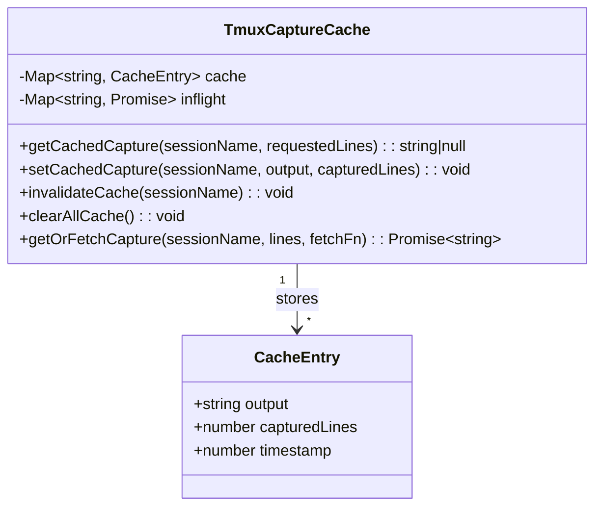

# 設計方針書: Issue #405 tmux capture最適化

## 1. 概要

GET /api/worktrees のN+1クエリパターン解消、tmux captureキャッシュ導入、ポーリング効率改善を一体的に実施する。

### 目的
- tmux操作回数を1/5〜1/10に削減（キャッシュ共有 + N+1解消）
- 同一セッションの重複capture排除
- UIの応答性を維持しつつサーバー負荷を軽減

### スコープ
- 新規: tmux captureキャッシュモジュール
- 既存: API routes、poller、session管理のキャッシュ統合
- 除外: tmuxプロトコル自体の変更、クライアントサイドキャッシュ

---

## 2. アーキテクチャ設計

### 2.1 システム構成図

```mermaid
graph TD
    subgraph Client["クライアント（ブラウザ）"]
        WSC[WorktreeSelectionContext<br/>ポーリング 2/5/10秒]
        WDR[WorktreeDetailRefactored<br/>current-output ポーリング]
    end

    subgraph APILayer["API Layer（Next.js API Routes）"]
        WR[GET /api/worktrees]
        WIR[GET /api/worktrees/:id]
        COR[GET /api/worktrees/:id/current-output]
        PRR[POST /api/worktrees/:id/prompt-response]
        TR[POST /api/worktrees/:id/terminal]
    end

    subgraph CacheLayer["キャッシュ層（新規）"]
        TCC[TmuxCaptureCache<br/>globalThis + Map + TTL]
    end

    subgraph ServerPoller["サーバーサイドポーラー"]
        AYM[auto-yes-manager<br/>2秒間隔]
        RP[response-poller<br/>2-5秒間隔]
        ARS[assistant-response-saver]
    end

    subgraph TmuxLayer["tmux Layer"]
        TMUX[tmux.ts<br/>execFile()ベース]
        LS[listSessions]
        HS[hasSession]
        CP[capturePane]
        SK[sendKeys]
        KS[killSession]
    end

    WSC -->|fetch| WR
    WSC -->|fetch| WIR
    WDR -->|fetch| COR

    WR -->|cache get/set| TCC
    WIR -->|cache get/set| TCC
    COR -->|cache get/set| TCC
    PRR -->|cache bypass| TCC
    AYM -->|cache get/set| TCC
    RP -->|cache get/set| TCC
    ARS -->|cache get/set| TCC

    TCC -->|cache miss| CP
    TCC -->|batch query| LS

    TR -->|invalidate| TCC
    SK -->|invalidate| TCC
    KS -->|invalidate| TCC

    WR -->|1回呼び出し| LS
```

### 2.2 レイヤー構成

| レイヤー | 役割 | 主要ファイル |
|---------|------|------------|
| キャッシュ層（新規） | tmux capture結果のTTLキャッシュ | `src/lib/tmux-capture-cache.ts` |
| API層 | HTTPリクエスト処理 | `src/app/api/worktrees/*/route.ts` |
| ビジネスロジック層 | ポーリング・状態管理 | `src/lib/auto-yes-manager.ts`, `response-poller.ts` |
| インフラ層 | tmuxプロセス操作 | `src/lib/tmux.ts` |

---

## 3. 詳細設計

### 3.1 tmux captureキャッシュモジュール

#### 3.1.1 インターフェース設計

```typescript
// src/lib/tmux-capture-cache.ts

/** キャッシュエントリ */
interface CacheEntry {
  /** キャプチャされた出力（最大行数で保持） */
  output: string;
  /** キャプチャ時の行数 */
  capturedLines: number;
  /** キャッシュ書き込み時刻（Date.now()） */
  timestamp: number;
}

/** キャッシュ設定定数 */
export const CACHE_TTL_MS = 2000;
export const CACHE_MAX_ENTRIES = 100;
export const CACHE_MAX_CAPTURE_LINES = 10000;

/**
 * キャッシュ取得（TTL内かつ要求行数以上の場合にヒット）
 * TTL切れエントリは呼び出し時に自動削除される（lazy eviction）
 *
 * [SEC4-002] 注意: TTL失効はlazy evictionであり、getCachedCapture()が
 * 呼ばれない限りメモリ上にデータが残存する。センシティブデータの長期残留を
 * 防止するため、setCachedCapture()呼び出し時にfull sweepを実施する。
 */
export function getCachedCapture(
  sessionName: string,
  requestedLines: number
): string | null;

/**
 * キャッシュされた出力から要求行数分を末尾から切り出す。
 * requestedLines >= capturedLines の場合はそのまま返却する。
 *
 * @example
 * // 内部ロジック:
 * // const lines = output.split('\n');
 * // if (requestedLines >= lines.length) return output;
 * // return lines.slice(-requestedLines).join('\n');
 */
export function sliceOutput(
  fullOutput: string,
  requestedLines: number
): string;

/**
 * キャッシュ書き込み
 *
 * [SEC4-002] 書き込み前に全エントリをスキャンし、TTL切れエントリを
 * 能動的に削除する（full sweep）。これにより、getCachedCapture()が
 * 呼ばれないセッションの期限切れデータがメモリ上に長期残留することを防止する。
 * センシティブデータ（認証情報、APIキー等がtmux出力に含まれる可能性）の
 * メモリ上残留時間を最小化するためのセキュリティ対策である。
 *
 * sweep処理の擬似コード:
 *   const now = Date.now();
 *   for (const [key, entry] of cache) {
 *     if (now - entry.timestamp > CACHE_TTL_MS) {
 *       cache.delete(key);
 *     }
 *   }
 */
export function setCachedCapture(
  sessionName: string,
  output: string,
  capturedLines: number
): void;

/**
 * 特定セッションのキャッシュ無効化
 *
 * [SEC4-006] 呼び出し時にdebugレベルでセッション名と呼び出し元を記録する。
 * B案の分散無効化方式（8箇所以上）での漏れ検出のため、
 * トラブルシューティング時にキャッシュ無効化チェーンの追跡を可能にする。
 * 本番環境ではdebugログは通常無効だが、NODE_DEBUG設定で有効化可能。
 *
 * @example
 * // 実装時のログ出力イメージ:
 * // console.debug('invalidateCache:', { sessionName, caller: new Error().stack?.split('\n')[2] });
 */
export function invalidateCache(sessionName: string): void;

/** 全キャッシュクリア（graceful shutdown用） */
export function clearAllCache(): void;

/** テスト用: キャッシュリセット */
export function resetCacheForTesting(): void;
```

#### 3.1.2 キャッシュキー設計

| 項目 | 値 |
|------|-----|
| キー | `sessionName`（`mcbd-{cliToolId}-{worktreeId}` 形式） |
| 値 | `CacheEntry`（最大行数の出力 + メタデータ） |
| TTL | 2秒（`CACHE_TTL_MS = 2000`） |
| 最大エントリ | 100（`CACHE_MAX_ENTRIES = 100`） |

> **キャッシュキーとsingleflightキーの一致に関する根拠 [DA3-002]**: キャッシュキーおよびsingleflightのinflightキーは共にsessionName（`mcbd-{cliToolId}-{worktreeId}` 形式）を使用する。sessionNameにcliToolIdが含まれるため、同一セッションに対して異なるcliToolId経由でcaptureSessionOutput()が呼ばれることはない。これにより、singleflightパターンでfetchFnが失敗した場合に共有Promiseを通じてエラーが伝播しても、エラーメッセージ内の`{cliTool.name}`が呼び出し元のコンテキストと不整合になることはない。この前提をgetOrFetchCapture()のJSDocにも明記すること。

> **キャッシュキーのバリデーション信頼チェーン [SEC4-001]**: `tmux-capture-cache.ts`のgetCachedCapture/setCachedCapture/invalidateCacheはsessionNameをキャッシュキーとして直接使用するが、sessionNameのバリデーションは呼び出し元のTrust Boundaryに依存する。具体的には以下の信頼チェーンが成立する:
>
> ```
> Trust Boundary:
>   captureSessionOutput() / captureSessionOutputFresh()
>     -> CLIToolManager.getTool(cliToolId).getSessionName(worktreeId)
>       -> BaseCLITool.getSessionName()
>         -> validateSessionName() [バリデーション実施箇所]
>           -> SESSION_NAME_PATTERN による正規表現チェック
> ```
>
> - **必須制約**: sessionNameは必ず`BaseCLITool.getSessionName()`経由で生成すること。直接文字列を構築してキャッシュ関数に渡すことはTrust Boundary違反であり禁止する。
> - **defense-in-depth検討**: `setCachedCapture()`にSESSION_NAME_PATTERNによるランタイムチェック（`/^mcbd-[a-z]+-[a-zA-Z0-9_-]+$/`等）を追加し、不正なキーでのキャッシュ書き込みを防御することを実装時に検討する。実装コストが低い場合は積極的に導入する。
> - **モジュールJSDoc**: `tmux-capture-cache.ts`のモジュール冒頭JSDocにセキュリティ前提条件として「sessionNameはvalidateSessionName()によりバリデーション済みであること」を明記すること。

#### 3.1.3 行数差異の解決（A案）

```
キャッシュ: 10,000行で保持

呼び出し元          要求行数    キャッシュ動作
───────────────────────────────────────────────
worktrees/route.ts  100行      → slice(-100)で末尾100行を返却
current-output API  10,000行   → そのまま返却
auto-yes-manager    5,000行    → slice(-5000)で末尾5,000行を返却
response-poller     10,000行   → そのまま返却
prompt-response     5,000行    → バイパス（フレッシュ取得）
```

> **lastCapturedLineとの整合性に関する注記 [DA3-001]**: captureSessionOutput()はキャッシュ導入後、常にCACHE_MAX_CAPTURE_LINES=10000行でcapturePane()を呼び出し、要求行数に応じてsliceOutput()で末尾から切り出す。response-poller.tsのextractResponse()はlastCapturedLineを基に差分抽出を行い、`output.split('\n').length`（totalLines）とlastCapturedLineの大小関係で重複検出・バッファリセット検出を実施している。キャッシュ導入により以下の点を実装時に必ず検証すること:
> - capturePane()が`startLine=-10000`で取得する出力と、`startLine=-requestedLines`で取得する出力の行数が一致するか（tmuxバッファが10000行未満の場合の挙動）
> - sliceOutput()が`output.split('\n')`で分割する際、末尾改行の有無でoff-by-oneが発生しないこと
> - current-output/route.tsのtotalLines算出（`const totalLines = lines.length`）がキャッシュ前後で変化しないこと（tmuxバッファの先頭空行がトリムされていないか）
> - response-poller.tsの差分検出ロジック（output.split('\n').length比較）との整合性をユニットテストで検証すること

#### 3.1.4 globalThisパターン

```typescript
declare global {
  // eslint-disable-next-line no-var
  var __tmuxCaptureCache: Map<string, CacheEntry> | undefined;
}

const cache: Map<string, CacheEntry> = globalThis.__tmuxCaptureCache ??
  (globalThis.__tmuxCaptureCache = new Map<string, CacheEntry>());
```

> **globalThis型拡張の競合リスクに関する注記 [DA3-003]**: 同一プロセスで複数モジュールが`globalThis.__tmuxCaptureCache`を宣言する場合、TypeScriptのdeclare global宣言が競合する可能性がある。本プロジェクトでは`__tmuxCaptureCache`の宣言は`tmux-capture-cache.ts`の1箇所のみとし、他モジュールからはexport関数（getCachedCapture、setCachedCapture、invalidateCache等）経由でアクセスする。globalThisプロパティ名にはプレフィックス`__tmux`を使用して他のglobalThisキャッシュ（例: `__scheduleManagerStates`、`__scheduleActiveProcesses`）との名前衝突を回避する。

> **globalThisアクセスのリスク受容 [SEC4-003]**: `globalThis.__tmuxCaptureCache`はプロセス内の全モジュールからアクセス可能であり、export関数経由のアクセスを技術的に強制することはできない（意図しないモジュールからの直接参照によるキャッシュ汚染リスクが理論上存在する）。本設計では以下の根拠に基づきこのリスクを受容する:
> - (1) 同一Node.jsプロセス内のコードは全て信頼されたファーストパーティコードであり、悪意ある直接アクセスのリスクは低い
> - (2) サードパーティモジュールによるglobalThisプロパティへのアクセスリスクはnpmサプライチェーン攻撃に限定され、その場合はプロセス全体が侵害されるため個別防御の実効性がない
> - (3) tmuxキャプチャデータのセンシティブ性に対し、TTL=2秒による短期保持とsetCachedCapture()時のfull sweep（SEC4-002）によりメモリ上残留時間が最小化されている
> - (4) 既存の他globalThisキャッシュ（`__scheduleManagerStates`、`__scheduleActiveProcesses`等）と同等のリスクレベルであり、プロジェクト全体で一貫したリスク受容方針を適用する

#### 3.1.5 singleflightパターン（同時リクエスト集約）

> **将来的な分離検討 [DR1-001]**: singleflight部分（inflightMap + getOrFetchCapture()）は、現時点ではモジュールサイズが小さいためtmux-capture-cache.ts内に同居する。ただし、schedule-manager.tsやversion-checker.ts等の他モジュールでもstampede防止が必要になった場合、汎用singleflightユーティリティ（例: `src/lib/singleflight.ts`）への分離を検討する。分離コストは10-15行程度の関数移動であり、現時点でのインターフェース設計（コールバックパターン）は分離を阻害しない。

```typescript
/** 進行中のcapture Promise（stampede防止） */
const inflight = new Map<string, Promise<string>>();

export async function getOrFetchCapture(
  sessionName: string,
  requestedLines: number,
  fetchFn: () => Promise<string>
): Promise<string> {
  // 1. キャッシュヒット確認
  const cached = getCachedCapture(sessionName, requestedLines);
  if (cached !== null) return cached;

  // 2. 進行中のfetchがあれば共有
  const key = sessionName;
  if (inflight.has(key)) {
    const result = await inflight.get(key)!;
    return sliceOutput(result, requestedLines);
  }

  // 3. 新規fetch開始
  const promise = fetchFn();
  inflight.set(key, promise);
  try {
    const result = await promise;
    setCachedCapture(sessionName, result, CACHE_MAX_CAPTURE_LINES);
    return sliceOutput(result, requestedLines);
  } finally {
    inflight.delete(key);
  }
}
```

> **singleflightのエラー共有に関する設計判断 [DA3-002]**: fetchFnが失敗した場合、inflight Promiseを共有する全呼び出し元が同一エラーを受け取る。本設計では「可用性優先」のアプローチを採用し、fetchFn失敗時にinflight PromiseがfinallyブロックでMapから削除されるため、次回の呼び出しでは新規fetchが開始される（リトライ可能）。エラーをcatchしてnullを返すfallbackパターンは不採用とする。理由: captureSessionOutput()の呼び出し元（response-poller, auto-yes-manager等）は各自のエラーハンドリングを持っており、エラーを隠蔽するよりも伝播させる方が既存の障害検出ロジックと整合する。inflightキーがsessionName（cliToolIdを含む `mcbd-{cliToolId}-{worktreeId}` 形式）であるため、異なるcliToolIdからの同時fetchが同一inflightエントリを共有することはない（DA3-002参照）。

> **Node.jsイベントループモデルとの整合性に関する注記**: Node.jsのシングルスレッドイベントループモデルにより、Map操作の原子性は保証される。inflight Mapのhas/get/set/deleteは同期操作であり、awaitポイント間のrace conditionは発生しない。

### 3.2 captureSessionOutput()の変更

#### 設計方針: インターフェース非変更

```typescript
// src/lib/cli-session.ts - シグネチャは変更しない
export async function captureSessionOutput(
  worktreeId: string,
  cliToolId: CLIToolType,
  lines: number = 1000
): Promise<string>
```

#### 内部実装の変更

```typescript
export async function captureSessionOutput(
  worktreeId: string,
  cliToolId: CLIToolType,
  lines: number = 1000
): Promise<string> {
  const manager = CLIToolManager.getInstance();
  const cliTool = manager.getTool(cliToolId);
  const sessionName = cliTool.getSessionName(worktreeId);

  // キャッシュ経由で取得（singleflightパターン）
  return getOrFetchCapture(sessionName, lines, async () => {
    // キャッシュミス時のみtmux操作を実行
    const exists = await hasSession(sessionName);
    if (!exists) {
      throw new Error(`${cliTool.name} session ${sessionName} does not exist`);
    }
    const output = await capturePane(sessionName, { startLine: -CACHE_MAX_CAPTURE_LINES });
    return output;
  });
}
```

**ポイント**:
- シグネチャ非変更 → 既存テスト（90箇所以上のモック）に影響なし
- エラーメッセージの後方互換性を完全維持
- hasSession()はキャッシュミス時のみ実行

> **singleflightエラー共有時のAPIレスポンスへの情報漏洩防止 [SEC4-005]**: getOrFetchCapture()のsingleflightパターンでfetchFnが失敗した場合、エラーオブジェクトは全ての待機中呼び出し元に共有される。エラーメッセージにはセッション名やCLIツール名が含まれるが、これがAPIレスポンスとして外部に返される経路を遮断する必要がある。**実装ガイドライン**: captureSessionOutput()のエラーがAPI層（route.ts）に到達した際は、固定文字列メッセージのみをAPIレスポンスに返すこと（既存D1-007パターン: `terminal/route.ts`、`capture/route.ts`と一貫性を保つ）。singleflightのエラー詳細（セッション名、CLIツール名、tmuxエラーメッセージ等）は`console.error()`による内部ログにのみ記録し、HTTPレスポンスボディには含めない。

#### エラーハンドリング方針 [DC2-004]

fetchFn内部でのエラーは既存のエラーメッセージ形式を維持する。具体的には、fetchFn内にtry-catchを追加し、capturePane()のエラーを既存形式で再throwする。

```typescript
return getOrFetchCapture(sessionName, lines, async () => {
  const exists = await hasSession(sessionName);
  if (!exists) {
    throw new Error(`${cliTool.name} session ${sessionName} does not exist`);
  }
  try {
    const output = await capturePane(sessionName, { startLine: -CACHE_MAX_CAPTURE_LINES });
    return output;
  } catch (error) {
    // 既存エラーメッセージ形式を維持（後方互換性）
    const errorMessage = error instanceof Error ? error.message : String(error);
    throw new Error(`Failed to capture ${cliTool.name} output: ${errorMessage}`);
  }
});
```

#### ログ出力方針 [DC2-003]

キャッシュ統合後も既存のlogger.withContext()パターンを維持し、キャッシュ関連のログを追加する。

| ログポイント | レベル | 内容 |
|-------------|--------|------|
| キャッシュヒット時 | debug | `captureSessionOutput:cacheHit` - sessionName, requestedLines, cacheAge(ms) |
| キャッシュミス時 | debug | `captureSessionOutput:cacheMiss` - sessionName, requestedLines（既存のstart/success/failedログも維持） |
| singleflightヒット時 | debug | `captureSessionOutput:singleflightHit` - sessionName（進行中のfetchに相乗り） |

- キャッシュヒット時: 既存のsuccess/failedログは出力されない（tmux操作が発生しないため）
- キャッシュミス時: 既存のstart → success/failed ログパターンを維持
- ログ実装はgetOrFetchCapture()の呼び出し前後ではなく、captureSessionOutput()内でキャッシュヒット判定後に出力する

> **DI移行の余地に関する注記 [DR1-004]**: キャッシュモジュール（`tmux-capture-cache.ts`）のimportは、captureSessionOutput()の実装ファイル冒頭で明確に分離配置する。現在のfetchFnコールバックパターンは既にDI的な構造を持っているため、将来的に`getOrFetchCapture`自体を引数として外部から注入する設計への拡張が容易である。現時点では「既存テスト90箇所以上への影響回避」を優先し直接importとするが、キャッシュ戦略の変更（TTL変更、条件付きバイパス等）が複数回発生した場合にDIパターンへの移行を検討する。

### 3.3 isRunning()最適化（listSessions一括取得）

#### 設計方針: route.ts側でlistSessions()を1回呼び出し

```typescript
// src/app/api/worktrees/route.ts
export async function GET(request: NextRequest) {
  // ...
  const manager = CLIToolManager.getInstance();
  const allCliTools: readonly CLIToolType[] = CLI_TOOL_IDS;

  // N+1解消: listSessions()で全セッション名を一括取得
  const sessions = await listSessions();
  const sessionNames = new Set(sessions.map(s => s.name));

  const worktreesWithStatus = await Promise.all(
    worktrees.map(async (worktree) => {
      const sessionStatusByCli: Partial<Record<CLIToolType, ...>> = {};

      for (const cliToolId of allCliTools) {
        const cliTool = manager.getTool(cliToolId);
        const sessionName = cliTool.getSessionName(worktree.id);

        // hasSession()の代わりにセッション名セットでO(1)判定
        const isRunning = sessionNames.has(sessionName);
        // ...captureはキャッシュ経由
      }
      // ...
    })
  );
}
```

**効果**:
- 変更前: 10worktree × 5CLI = 50回の`tmux has-session`
- 変更後: 1回の`tmux list-sessions` + Claude Sessionのみ追加HealthCheck
- ICLIToolインターフェース変更不要

> **listSessions()一括取得のコスト根拠 [DA3-006]**: `listSessions()`は1回の`tmux list-sessions`コマンド実行（約5-10ms）で全セッション情報を取得する。これに対し、N回の`hasSession()`呼び出しはN回の`tmux has-session`コマンド実行（約5ms x N）を要する。10worktree x 5CLI = 50回の場合、listSessions()は50回のhasSession()に対して約1/50のtmuxプロセス生成コストで済む。tmuxコマンド実行のボトルネックはexecFile()によるプロセス生成（fork+exec）であり、tmux内部の検索コスト（セッション数に対するO(n)走査）は無視可能なレベルである。

#### ClaudeTool HealthCheck統合の実装設計 [DR1-005]

ClaudeToolの`isRunning()`は`isClaudeRunning()`経由で`hasSession()` + `isSessionHealthy()`の2段階チェックを行う。`listSessions()`一括取得に置き換えた場合、ClaudeセッションについてのみHealthCheckを追加で呼び出す必要がある。

```typescript
// src/app/api/worktrees/route.ts (擬似コード)
import { isSessionHealthy } from '@/lib/claude-session';

// Step 1: listSessions()で全セッション名を一括取得
const sessions = await listSessions();
const sessionNames = new Set(sessions.map(s => s.name));

const worktreesWithStatus = await Promise.all(
  worktrees.map(async (worktree) => {
    const sessionStatusByCli: Partial<Record<CLIToolType, ...>> = {};

    for (const cliToolId of allCliTools) {
      const cliTool = manager.getTool(cliToolId);
      const sessionName = cliTool.getSessionName(worktree.id);

      // Step 2: セッション名セットでO(1)存在判定
      let isRunning = sessionNames.has(sessionName);

      // Step 3: Claude Sessionのみ追加HealthCheck
      if (isRunning && cliToolId === 'claude') {
        const healthResult = await isSessionHealthy(sessionName);
        if (!healthResult.healthy) {
          // HealthCheck失敗時はisRunning=falseとして扱う
          // セッション再作成はroute.tsの責務外（ensureHealthySession()は呼ばない）
          isRunning = false;
        }
      }

      // ... captureはキャッシュ経由
    }
    // ...
  })
);
```

**設計根拠**:
- `listSessions()`の一括取得メリット（50回→1回）を維持
- ClaudeToolの安全性（壊れたセッションの検出）を確保
- セッション再作成（`ensureHealthySession()`）はroute.tsの責務外 -- 別途ユーザー操作やポーラーで対応
- HealthCheck失敗時は`isRunning=false`として扱い、UI上で「停止中」と表示する

> **isSessionHealthy()のキャッシュバイパスに関する設計判断 [DA3-003]**: `isSessionHealthy()`は内部の`getCleanPaneOutput()`経由で`capturePane()`を直接呼び出しており、キャッシュ層（10000行保持）を経由しない。HealthCheckは50行のキャプチャで健全性を判定するため、常にフレッシュな出力で判定する必要がある。このキャッシュバイパスは意図的な設計判断である。将来のリファクタリングで誤ってキャッシュ経由に変更しないこと。

#### isSessionHealthy()の@internal export問題への対応方針 [DC2-002]

`isSessionHealthy()`は現在`claude-session.ts`において`@internal` exportとして定義されている（テスト用途を主目的としたexport）。route.tsからの直接呼び出しは`@internal`の意図と矛盾する可能性がある。

**採用方針: (a) @internalアノテーションをproduction exportに変更する**

`isSessionHealthy()`はセッションの健全性を判定する汎用的なユーティリティであり、route.tsでの使用はプロダクションコードとして正当なユースケースである。Phase 3実装時に`@internal`アノテーションを除去し、通常のproduction exportに変更する。

- 根拠: `isSessionHealthy()`は副作用なし（capturePane + パターンマッチのみ）で、route.tsからの呼び出しが安全である
- 代替案(b)（`ClaudeTool.isRunning()`にsessionNamesセットを受け取る設計）はICLIToolインターフェース変更が必要となり、本Issueのスコープ（インターフェース非変更）に反するため不採用
- `HealthCheckResult` interfaceも同様にproduction exportとして扱う

#### HealthCheck呼び出し頻度の変化に関する影響分析 [DC2-005]

現在の`isClaudeRunning()`は毎回`hasSession()` + `isSessionHealthy()`の2段階チェックを実行する。変更後は`listSessions()`でセッション存在が確認できた場合のみ`isSessionHealthy()`を呼び出す。

- **セッション不在時**: 現在は`hasSession()`がfalseを返しHealthCheckは実行されない。変更後は`sessionNames.has()`がfalseを返しHealthCheckは実行されない。動作は同等。
- **セッション存在時**: 現在は`isSessionHealthy()`が呼ばれる。変更後も`isSessionHealthy()`が呼ばれる。動作は同等。
- **結論**: HealthCheckの呼び出し頻度は変わらない。変化するのは「セッション存在確認の方法」のみ（`hasSession()`個別呼び出し → `listSessions()`一括取得 + Set.has()）。

#### current-output APIのisRunning()に関する設計判断 [DA3-008]

current-output/route.tsの`cliTool.isRunning(params.id)`はlistSessions()最適化の対象外とする。単一worktree・単一CLIツールに対する操作であり、hasSession()の個別呼び出しコスト（5ms）は許容範囲内である。ClaudeToolの場合のhasSession()+isSessionHealthy()合計コスト（約55ms）も、current-output APIの処理全体（capturePane含む約60-110ms）に対して許容可能。Phase 3でworktrees/route.tsにlistSessions()を導入した後もcurrent-output APIは旧来のパターンを維持する。

#### listSessions()一括取得による非実行中CLIツールのcaptureスキップ [DC2-007]

Issue #405の受入条件「非実行中CLIツールへの不要なtmux操作がスキップされること」は、`listSessions()`一括取得 + `sessionNames.has()`判定によって自然に充足される。

- `sessionNames.has(sessionName)`がfalseの場合、そのCLIツールのcaptureSessionOutput()は呼び出されない（isRunning=falseとなるため）
- これにより、tmuxセッションが存在しないCLIツール（非実行中）に対するcapturePane()やhasSession()の不要な呼び出しが完全にスキップされる
- DBからのselectedAgents情報を使った事前フィルタリングは不要 -- listSessions()の結果が実行中セッションの真のソースとなる

### 3.4 キャッシュ無効化設計

#### 3.4.1 無効化トリガー一覧

| トリガー | 対象 | 実装箇所 |
|---------|------|---------|
| sendKeys()呼び出し | 該当セッション | terminal/route.ts, prompt-answer-sender.ts, claude-session.ts, codex.ts, gemini.ts, opencode.ts, vibe-local.ts, pasted-text-helper.ts [DA3-009] |
| sendSpecialKeys()呼び出し | 該当セッション | prompt-answer-sender.ts |
| killSession()呼び出し | 該当セッション | session-cleanup.ts, opencode.ts, ensureHealthySession()内 [DA3-012] |
| auto-yes応答後 | 該当セッション | auto-yes-manager.ts (try-finallyパターン) |
| graceful shutdown | 全キャッシュ | session-cleanup.ts |
| TTL切れ | 該当エントリ | 自動（getCachedCapture()時にチェック） |

> **pasted-text-helper.tsのキャッシュ無効化 [DA3-009]**: `pasted-text-helper.ts`の`detectAndResendIfPastedText()`関数は内部で`tmux.sendKeys()`を呼び出す可能性がある。claude-session.tsの`sendMessageToClaude()`およびcodex.tsの`sendMessage()`から条件付きで呼ばれるため、これらの呼び出し元の末尾でinvalidateCache()を1回だけ実行する方針とする。pasted-text-helper.ts自体の内部実装に依存しない設計とし、呼び出し元での一括無効化パターンを採用する。

> **ensureHealthySession()内のkillSession() [DA3-012]**: `ensureHealthySession()`はclaude-session.ts内の関数であり、`startClaudeSession()`からのみ呼ばれる。内部でkillSession()を呼び出すが、直後に新しいセッションが作成されるため、古いキャッシュが参照される期間はTTL=2秒以内に自然失効する。明示的なinvalidateCache()挿入は不要とし、TTL失効による自然な無効化で対応する。

> **B案の補足: 薄いラッパー関数による集約の検討 [DR1-002]**: B案（呼び出し元での明示的クリア）は循環依存回避のため合理的な選択であるが、8箇所以上のinvalidateCache()挿入は新規CLIツール追加時の漏れリスクがある。Phase 4実装時に、tmux.tsのsendKeys/killSessionをラップした薄いヘルパー関数（例: `sendKeysAndInvalidate(sessionName, keys)` / `killSessionAndInvalidate(sessionName)`）を作成し、キャッシュ無効化ロジックをラッパー側に集約するC案軽量版を再評価する。ラッパーはtmux-capture-cache.tsへの依存をラッパーモジュール（例: `src/lib/tmux-cache-bridge.ts`）に閉じ込め、8箇所の分散をDRYに集約できる可能性がある。Phase 4の実装開始時に、B案のままで漏れリスクが許容範囲内かを判断し、必要に応じてラッパー方式に切り替える。

#### 3.4.2 auto-yes応答後の無効化シーケンス

```
detectAndRespondToPrompt()
  ↓
  sendPromptAnswer(...)        ← L610付近
  ↓
  invalidateCache(sessionName) ← L615付近、sendPromptAnswer()直後に直列配置 [DA3-006]
  ↓
  updateLastServerResponseTimestamp() / resetErrorCount()
  ↓
  (detectAndRespondToPrompt()終了)
  ↓
  scheduleNextPoll(...)        ← pollAutoYes()内、L680付近
```

> **invalidateCache()の配置に関する設計判断 [DA3-006]**: `invalidateCache(sessionName)`はsendPromptAnswer()の直後（L615付近）に直列配置し、try-finallyパターンではなく直列配置とする。理由: sendPromptAnswer()がthrowした場合もsendKeys()が部分的に実行されている可能性があり、キャッシュ無効化が必要である。sendPromptAnswer()内でsendKeys()実行前にthrowした場合は無効化は不要だが、防御的に無効化しても害はない（次のfetchで最新データを取得するだけ）。updateLastServerResponseTimestamp()やresetErrorCount()の前に実行する。

#### 3.4.3 prompt-response APIのキャッシュバイパス

**captureSessionOutputFresh()の関数設計 [DR1-008]**

B方式（別関数として新設）を採用する。captureSessionOutput()のインターフェースにbypassCacheオプションを追加するA方式は、既存テスト90箇所以上のモック定義に影響を与える可能性があるため不採用。

```typescript
// src/lib/cli-session.ts - 新規関数として定義

/**
 * キャッシュをバイパスしてtmux captureをフレッシュ取得する。
 * 取得結果はキャッシュに書き戻し、他の呼び出し元が恩恵を受ける。
 * prompt-response API等、リアルタイム性要求が高い箇所で使用。
 *
 * [DA3-005] capturePane()成功後にのみキャッシュに書き込む（TOCTOU安全）。
 * capturePane()失敗時はinvalidateCache()で古いキャッシュを明示的に削除する。
 */
export async function captureSessionOutputFresh(
  worktreeId: string,
  cliToolId: CLIToolType,
  lines: number = 5000
): Promise<string> {
  const manager = CLIToolManager.getInstance();
  const cliTool = manager.getTool(cliToolId);
  const sessionName = cliTool.getSessionName(worktreeId);

  // セッション存在確認
  const exists = await hasSession(sessionName);
  if (!exists) {
    throw new Error(`${cliTool.name} session ${sessionName} does not exist`);
  }

  // capturePane()直接呼び出し（キャッシュバイパス）
  // [DA3-005] capturePane()成功後にのみキャッシュに書き込む順序とする。
  // hasSession()とcapturePane()の間にセッションが消失するTOCTOUケースでは、
  // catchブロックでinvalidateCache()を呼び、古いキャッシュの残存を防止する。
  try {
    const output = await capturePane(sessionName, { startLine: -CACHE_MAX_CAPTURE_LINES });

    // [SEC4-007] capturePane()結果が空文字列の場合はキャッシュへの書き戻しをスキップする。
    // tmuxバグ等により空/破損データが返された場合に、他の呼び出し元への伝播を防止する。
    // 空文字列の場合はinvalidateCache()で古いキャッシュも削除し、
    // 次回の呼び出しでフレッシュデータを取得できるようにする。
    if (output === '') {
      invalidateCache(sessionName);
      return output;
    }

    // キャッシュに書き戻し（他の呼び出し元が恩恵を受ける）
    setCachedCapture(sessionName, output, CACHE_MAX_CAPTURE_LINES);

    // 要求行数に応じてslice
    return sliceOutput(output, lines);
  } catch (error) {
    // [DA3-005] capturePane()失敗時は古いキャッシュを明示的に削除
    invalidateCache(sessionName);
    throw error;
  }
}
```

```typescript
// prompt-response/route.ts での使用例
// リアルタイム性要求高のため、キャッシュをバイパス
const output = await captureSessionOutputFresh(params.id, cliToolId, 5000);
// フレッシュ取得結果はキャッシュに書き戻し済み（他の呼び出し元が恩恵を受ける）
```

> **prompt-response/route.tsの既存isRunning()チェックとの関係 [DC2-008]**: 現在のprompt-response/route.ts（L79付近）ではcliTool.isRunning()によるセッション存在確認を行っている。captureSessionOutputFresh()内部でも`hasSession()`を呼び出すため、セッション存在確認が重複する。この重複は許容する。理由: (1) route.ts側のisRunning()はClaudeToolの場合HealthCheckを含む包括的なチェックであり、captureSessionOutputFresh()内のhasSession()とは目的が異なる（安全性チェック vs. capture前の存在確認）。(2) hasSession()のコスト（約5ms）はprompt-response APIの処理全体に対して無視可能。(3) route.ts側のisRunning()をPhase 3でlistSessions()ベースに変更した場合も、captureSessionOutputFresh()のhasSession()はフレッシュ取得の安全弁として維持する。

### 3.5 capture/route.tsの設計判断（キャッシュ対象外）

`capture/route.ts`は`capturePane()`を直接呼び出しており、`captureSessionOutput()`を経由しない。ターミナルUI向けの専用APIとして、ユーザーが指定した行数での直接captureという異なるユースケースのため、意図的にキャッシュ対象外とする。

> **hasSession()コストの正当性 [DR1-011]**: capture/route.tsの`hasSession()`呼び出し（L61）はlistSessions()一括取得の恩恵を受けず、個別に`tmux has-session`を実行し続ける。しかし、以下の理由によりこのコストは問題にならない:
> - capture/route.tsは**個別worktreeのターミナルUI表示中**にのみ呼ばれるAPIであり、`GET /api/worktrees`のように全worktreeを巡回するN+1パターンとは根本的に異なる
> - 呼び出し頻度は1 worktree当たり1リクエスト/ポーリングサイクルであり、hasSession()のコスト（約5ms/回）は単一呼び出しとして許容範囲内
> - ターミナルUI表示中のcapturePane()自体のコスト（約10-50ms）に比べ、hasSession()の5msは相対的に小さい
> - 将来的にcapture/route.tsの呼び出し頻度が問題になった場合は、listSessions()結果のモジュールスコープキャッシュ（TTL=2秒）を別途導入可能

---

## 4. データモデル設計

### 4.1 キャッシュデータ構造



### 4.2 メモリ使用量見積もり

#### 通常想定

| 項目 | 計算 | 値 |
|------|------|-----|
| 1エントリ | 10,000行 × 約100bytes/行 | 約1MB |
| 最大同時稼働worktree | 10 × 2 CLIツール（平均） | 20エントリ |
| 合計メモリ | 20 × 1MB | 約20MB |
| inflight Promise | 数個 × 微量 | 無視可能 |
| **合計（通常最大）** | | **約20MB** |

#### 理論上限 [SEC4-004]

| 項目 | 計算 | 値 |
|------|------|-----|
| 1エントリ最大サイズ | CACHE_MAX_CAPTURE_LINES=10,000行 × 平均100bytes/行 | 約1MB |
| CACHE_MAX_ENTRIES | MAX_WORKTREES(=10) x CLI_TOOL_IDS.length(=5) x 安全係数(=2) | 100 |
| **理論上限メモリ** | 100 × 1MB | **約100MB** |
| Node.js V8ヒープ比率 | 100MB / 1.5GB（V8デフォルトヒープ） | **約6.7%** |

> **CACHE_MAX_ENTRIES=100の算出根拠**: `MAX_WORKTREES`(=10、port-allocator.tsで定義) x `CLI_TOOL_IDS.length`(=5、現在5ツール) = 50エントリが実運用上の最大値。安全係数2（TTL切れエントリの遅延削除やテスト環境での並行実行等を考慮）を乗じて100とした。理論上限100MBはNode.js V8ヒープ（通常1.5GB、`--max-old-space-size`未指定時）の約6.7%であり、DoS攻撃（大量worktree+CLIツール組み合わせ）に対しても許容範囲内である。実際にはsetCachedCapture()時のfull sweep（SEC4-002）により期限切れエントリが能動的に削除されるため、100エントリに到達することは通常の運用では発生しない。

---

## 5. API設計

### 5.1 変更対象API一覧

| API | 変更内容 | キャッシュ利用 |
|-----|---------|-------------|
| GET /api/worktrees | listSessions()一括取得 + キャッシュ利用 | あり |
| GET /api/worktrees/:id | listSessions()一括取得 + キャッシュ利用 | あり |
| GET /api/worktrees/:id/current-output | キャッシュ利用 | あり |
| POST /api/worktrees/:id/prompt-response | キャッシュバイパス + 書き戻し | バイパス |
| POST /api/worktrees/:id/terminal | sendKeys()後のキャッシュ無効化 | 無効化のみ |
| GET /api/worktrees/:id/capture | キャッシュ対象外（capturePane直接呼び出し） | なし |

### 5.2 レスポンス形式

APIレスポンス形式の変更はなし。キャッシュは内部実装の最適化であり、外部インターフェースに影響しない。

---

## 6. セキュリティ設計

### 6.1 センシティブデータの扱い

| リスク | 対策 |
|--------|------|
| キャッシュにセンシティブ情報が含まれる可能性 | TTL=2秒で自動失効、setCachedCapture()時のfull sweep [SEC4-002]、graceful shutdownで全クリア |
| メモリ上の残留時間延長（lazy eviction制約） | getCachedCapture()が呼ばれない間は期限切れデータがメモリ残留するため、setCachedCapture()時にfull sweepを実施して能動的に削除 [SEC4-002] |
| キャッシュサイズ制限 | CACHE_MAX_ENTRIES=100でDoS防止（理論上限100MB、V8ヒープの約6.7%） [SEC4-004] |
| globalThisアクセスのリスク | プロセス内全モジュールからアクセス可能だがリスク受容（詳細はセクション3.1.4 [SEC4-003]参照） |
| キャッシュポイズニング（破損データの伝播） | captureSessionOutputFresh()で空文字列ガード [SEC4-007]、capturePane()失敗時のinvalidateCache() [DA3-005] |
| singleflightエラー情報の外部漏洩 | API層で固定文字列メッセージのみを返却、D1-007パターン準拠 [SEC4-005] |

### 6.2 Trust Boundary図 [SEC4-001]

```
                     Trust Boundary
                          |
  [API Layer / Poller]    |    [キャッシュ層]
                          |
  captureSessionOutput()  |
    |                     |
    v                     |
  CLIToolManager          |
    .getTool(cliToolId)   |
    .getSessionName()     |
      |                   |
      v                   |
  BaseCLITool             |
    .getSessionName()     |
      |                   |
      v                   |
  validateSessionName() --+--> sessionName (バリデーション済み)
                          |      |
                          |      v
                          |  getCachedCapture(sessionName, ...)
                          |  setCachedCapture(sessionName, ...)
                          |  invalidateCache(sessionName)
                          |  getOrFetchCapture(sessionName, ...)
```

- sessionNameはTrust Boundaryの左側（API Layer/Poller側）でバリデーションされ、バリデーション済みの値がキャッシュ層に渡される
- キャッシュ層はsessionNameの正当性を前提として動作する（defense-in-depthのランタイムチェックは検討事項）
- 直接文字列を構築してキャッシュ関数に渡すことはTrust Boundary違反であり禁止

### 6.3 キャッシュ無効化の監査ログ [SEC4-006]

invalidateCache()呼び出し時にdebugレベルでセッション名と呼び出し元を記録する。B案の分散無効化方式（8箇所以上）での漏れ検出に必要であり、キャッシュ無効化はセキュリティイベント（出力データの更新トリガー）として監査対象とする。

| ログポイント | レベル | 内容 |
|-------------|--------|------|
| invalidateCache()呼び出し時 | debug | sessionName、呼び出し元スタック情報 |
| clearAllCache()呼び出し時 | debug | graceful shutdown時の全キャッシュクリア |

### 6.4 既存セキュリティ機構との整合

- tmux.ts: Issue #393でexecFile()に全面移行済み → キャッシュ層はexecFile()の上位に位置するため影響なし
- session-cleanup.ts: graceful shutdown時にclearAllCache()を追加
- env-sanitizer.ts: キャッシュモジュールは環境変数を扱わないため影響なし
- middleware.ts: 認証チェック後のAPI層からキャッシュが呼ばれるため、キャッシュアクセスの前提条件として既存認証が機能する [SEC4-011]

---

## 7. パフォーマンス設計

### 7.1 期待される改善効果

| シナリオ | 変更前 | 変更後 | 改善率 |
|---------|--------|--------|-------|
| 10worktree × 5CLI isRunning() | 50回 tmux has-session | 1回 tmux list-sessions | 98% |
| 同時capture（3 API/poller） | 3回 tmux capture-pane | 1回（キャッシュ共有） | 67% |
| 2秒ポーリング × 10worktree | 毎秒25-75回 tmux操作 | 毎秒5-10回 | 67-87% |

### 7.2 キャッシュヒット率の見積もり

```
TTL=2秒、ポーリング間隔=2秒の場合:
- 単一呼び出し元: ヒット率 ≈ 0%（TTL切れとポーリングが同期）
- 複数呼び出し元（3-4個）: ヒット率 ≈ 50-75%
  （最初の呼び出しでキャッシュ書き込み、2秒以内の他の呼び出しがヒット）
- singleflight: 同時リクエストの重複排除で実効的にヒット率向上
```

### 7.3 eviction戦略

- **TTLベース（lazy eviction）**: getCachedCapture()時にtimestampチェック、期限切れは削除して返却
- **TTLベース（full sweep）[SEC4-002]**: setCachedCapture()時に全エントリをスキャンし、期限切れエントリを能動的に削除。センシティブデータの長期メモリ残留を防止する
- **サイズベース**: setCachedCapture()時にcache.size >= CACHE_MAX_ENTRIES なら最古エントリを削除（full sweep後に実施）
- **明示的無効化**: invalidateCache()でMap.delete()、debugログ出力 [SEC4-006]

---

## 8. テスト戦略

### 8.1 テスト方針

| テスト種別 | 対象 | 方針 |
|-----------|------|------|
| ユニットテスト | tmux-capture-cache.ts | TTL、eviction、singleflight、invalidation |
| ユニットテスト | 既存テスト | **変更なしでパス**（captureSessionOutput()インターフェース非変更） |
| 結合テスト | route.ts + キャッシュ | listSessions()一括取得の動作確認 |
| 網羅的テスト | 全CLIツールの無効化 | sendMessage()後にキャッシュが無効化されること |

> **captureSessionOutputFresh()のモック追加に関する注記 [DA3-011]**: `captureSessionOutputFresh()`はcli-session.tsに新規追加される関数である。Phase 2実装時に以下を確認すること:
> - `prompt-response/route.ts`のテストファイルでcaptureSessionOutputのモックをcaptureSessionOutputFreshに更新する必要があるか確認
> - cli-session.tsのモジュールモック（`vi.mock('./cli-session', ...)`）がcaptureSessionOutputFreshも自動的にモック対象に含むか確認（vi.mock()はモジュール全体をモックするため通常は自動的に含まれるが、明示的なモック定義がある場合は追加が必要）
> - `tests/unit/api/prompt-response-verification.test.ts`（38箇所のcaptureSessionOutput参照）は主要な影響対象ファイルである

### 8.2 テスト分離方針

```typescript
// テストではキャッシュをリセットして分離
beforeEach(() => {
  resetCacheForTesting();
});
```

既存テストでは`captureSessionOutput()`がvi.mock()でモックされているため、キャッシュ層は呼ばれない。インターフェース非変更によりモック定義の変更は不要。

---

## 9. 設計上の決定事項とトレードオフ

### 9.1 採用した設計

| 決定事項 | 理由 | トレードオフ |
|---------|------|-------------|
| A案: 最大行数でキャッシュ+slice | 実装シンプル、ヒット率最大化 | メモリ使用量増加（約20MB） |
| A案: captureSessionOutput()インターフェース非変更 | 既存テスト90箇所以上の修正回避 | キャッシュ制御の柔軟性が低い |
| A案: route.ts側でlistSessions()判定 | ICLIToolインターフェース変更不要 | ClaudeToolのHealthCheck別途必要 |
| B案: 呼び出し元での明示的キャッシュ無効化 | 循環依存回避 | 新規CLIツール追加時の漏れリスク |
| globalThisパターン（独立Map方式） | 既存パターンとの整合性、hot reload対応、複数モジュールからの参照に適合 | プロセス再起動でキャッシュ消失 |
| singleflightパターン | stampede防止 | 複雑性増加 |
| capture/route.tsはキャッシュ対象外 | capturePane直接呼び出しで異なるユースケース | 該当APIのtmux操作は削減されない |

> **globalThisパターンの使い分け基準 [DA3-010]**: 本プロジェクトでは2種類のglobalThisキャッシュパターンが存在する:
> - **構造体フィールドパターン**（schedule-manager.tsのcmateFileCache）: 単一モジュール内でキャッシュと状態管理が密結合の場合に採用。ManagerState構造体のフィールドとして管理され、stopAllSchedules()でcmateFileCache.clear()が呼ばれる。
> - **独立Mapパターン**（tmux-capture-cache.ts）: 複数モジュールから参照されるキャッシュの場合に採用。globalThisに独立したMapとして格納され、clearAllCache()で全クリアされる。
>
> tmux-capture-cacheが独立Mapパターンを採用する理由は、captureSessionOutput()、captureSessionOutputFresh()、invalidateCache()が複数モジュール（cli-session.ts、prompt-answer-sender.ts、claude-session.ts等）から呼ばれるためである。新規キャッシュモジュール追加時は、参照元モジュール数に応じてどちらのパターンを採用するか判断すること。

### 9.2 代替案との比較

#### キャッシュ層の位置

| 案 | 説明 | メリット | デメリット |
|----|------|---------|-----------|
| A案: captureSessionOutput()内部（採用） | 既存関数の内部実装を変更 | インターフェース非変更、既存テスト影響なし | キャッシュ制御がcli-session.tsに集中 |
| B案: tmux.ts capturePane()内部 | より低レベルでキャッシュ | 全呼び出し元に透過的 | capture/route.ts等直接呼び出しも影響、責務違反 |
| C案: 各呼び出し元で個別キャッシュ | 各APIが独自にキャッシュ管理 | 呼び出し元ごとに最適化可能 | DRY違反、キャッシュ不整合リスク |

#### キャッシュ無効化方式

| 案 | 説明 | メリット | デメリット |
|----|------|---------|-----------|
| A案: tmux.ts内部でフック | sendKeys/killSession内でキャッシュクリア | 漏れなし | tmux.tsがキャッシュモジュールに依存（循環依存リスク） |
| B案: 呼び出し元で明示的クリア（採用） | 各呼び出し元がキャッシュクリアを呼ぶ | 循環依存なし | 漏れリスク → ガイドライン+網羅テストで軽減 |
| C案: ラッパー層 | tmux.tsの上にキャッシュ対応ラッパー | 透過的 | アーキテクチャ変更大 |

---

## 10. 実装順序

### Phase 1: キャッシュモジュール基盤
1. `src/lib/tmux-capture-cache.ts` 新規作成（Map + TTL + eviction + singleflight）
2. ユニットテスト作成

### Phase 2: captureSessionOutput()統合 + captureSessionOutputFresh()追加
3. `src/lib/cli-session.ts` のcaptureSessionOutput()にキャッシュ統合（getOrFetchCapture()使用）
4. `src/lib/cli-session.ts` にcaptureSessionOutputFresh()新規関数追加（キャッシュバイパス + 書き戻し）
5. `src/app/api/worktrees/[id]/prompt-response/route.ts` のcaptureSessionOutput()呼び出しをcaptureSessionOutputFresh()に変更
6. 既存テストが変更なしでパスすることを確認

### Phase 3: isRunning()最適化
7. `src/app/api/worktrees/route.ts` にlistSessions()一括取得を導入
8. `src/app/api/worktrees/[id]/route.ts` に同等の最適化を適用（[DA3-004] 単一worktreeのGETでも5回のhasSession()が1回のlistSessions()に削減される。CLIツール数の増加やClaudeToolの追加HealthCheck（50ms）を考慮すると合理的）
9. `isSessionHealthy()`の`@internal`アノテーションをproduction exportに変更

### Phase 4: キャッシュ無効化
10. 各呼び出し元にinvalidateCache()フック挿入（B案: 8箇所）
11. session-cleanup.tsにclearAllCache()追加
12. auto-yes-managerのtry-finallyパターン実装

### Phase 5: テスト・ドキュメント
13. 全CLIツールの網羅的キャッシュ無効化テスト
14. CLAUDE.mdモジュール説明テーブル更新（captureSessionOutputFresh()の記載含む）
15. 新規CLIツール追加ガイドライン追記

---

## 11. ファイル変更一覧

| ファイル | 変更種別 | 内容 |
|---------|---------|------|
| `src/lib/tmux-capture-cache.ts` | 新規 | キャッシュモジュール（globalThisパターン） |
| `src/lib/cli-session.ts` | 修正 | captureSessionOutput()にキャッシュ統合 + captureSessionOutputFresh()新規追加 |
| `src/app/api/worktrees/route.ts` | 修正 | listSessions()一括取得 + キャッシュ利用 |
| `src/app/api/worktrees/[id]/route.ts` | 修正 | listSessions()一括取得 + キャッシュ利用 |
| `src/app/api/worktrees/[id]/current-output/route.ts` | 修正 | キャッシュ経由に変更（captureSessionOutput内部で自動） |
| `src/app/api/worktrees/[id]/prompt-response/route.ts` | 修正 | キャッシュバイパスオプション利用 |
| `src/app/api/worktrees/[id]/terminal/route.ts` | 修正 | sendKeys()後のキャッシュ無効化 |
| `src/lib/auto-yes-manager.ts` | 修正 | try-finallyキャッシュ無効化 |
| `src/lib/response-poller.ts` | 修正 | キャッシュ経由に変更（captureSessionOutput内部で自動） |
| `src/lib/assistant-response-saver.ts` | 修正 | キャッシュ経由に変更（captureSessionOutput内部で自動） |
| `src/lib/prompt-answer-sender.ts` | 修正 | sendKeys/sendSpecialKeys後のキャッシュ無効化 |
| `src/lib/claude-session.ts` | 修正 | sendMessageToClaude/stopClaudeSession後のキャッシュ無効化 |
| `src/lib/cli-tools/codex.ts` | 修正 | sendMessage後のキャッシュ無効化 |
| `src/lib/cli-tools/gemini.ts` | 修正 | sendMessage後のキャッシュ無効化 |
| `src/lib/cli-tools/opencode.ts` | 修正 | sendMessage/killSession後のキャッシュ無効化 |
| `src/lib/cli-tools/vibe-local.ts` | 修正 | sendMessage後のキャッシュ無効化 |
| `src/lib/session-cleanup.ts` | 修正 | graceful shutdown時のclearAllCache()追加 |
| `CLAUDE.md` | 修正 | モジュール説明追加 + CLIツール追加ガイドライン |

---

---

## 12. レビュー履歴

| ステージ | 日付 | レビュー種別 | 結果 | スコア |
|---------|------|------------|------|--------|
| Stage 1 | 2026-03-04 | 通常レビュー（設計原則） | 条件付き承認 | 4/5 |
| Stage 2 | 2026-03-04 | 整合性レビュー | 条件付き承認 | 4/5 |
| Stage 3 | 2026-03-04 | 影響分析レビュー | 条件付き承認 | high |
| Stage 4 | 2026-03-04 | セキュリティレビュー | 条件付き承認 | 4/5 |

---

## 13. レビュー指摘事項サマリー

### Stage 1: 通常レビュー（設計原則）

| ID | 重要度 | カテゴリ | タイトル | 対応状況 | 対応セクション |
|----|--------|---------|---------|---------|--------------|
| DR1-001 | should_fix | SRP/SOLID | singleflightパターンの将来的な分離検討 | 反映済 | 3.1.5 |
| DR1-002 | should_fix | DRY | B案キャッシュ無効化の漏れリスク軽減策 | 反映済 | 3.4 |
| DR1-003 | nice_to_have | YAGNI | singleflightの定量的根拠 | 記録のみ | - |
| DR1-004 | should_fix | OCP/SOLID | captureSessionOutput()のキャッシュimport分離・DI余地 | 反映済 | 3.2 |
| DR1-005 | must_fix | モジュール設計 | ClaudeTool HealthCheckとlistSessions()の整合性 | 反映済 | 3.3 |
| DR1-006 | nice_to_have | パターン | globalThis型宣言の統一化 | 記録のみ | - |
| DR1-007 | nice_to_have | KISS | CACHE_MAX_CAPTURE_LINES=10000の一律保持は良設計 | 記録のみ（変更不要） | - |
| DR1-008 | should_fix | モジュール設計 | captureSessionOutputFresh()の関数設計 | 反映済 | 3.4.3 |
| DR1-009 | nice_to_have | DRY/Facade | session-cleanup.tsのclearAllCache()は適切 | 記録のみ（変更不要） | - |
| DR1-010 | nice_to_have | LSP/ISP | ICLIToolインターフェース非変更は優れた設計 | 記録のみ（変更不要） | - |
| DR1-011 | should_fix | モジュール設計 | capture/route.tsのhasSession()コストの正当性 | 反映済 | 3.5 |

### Stage 2: 整合性レビュー

| ID | 重要度 | カテゴリ | タイトル | 対応状況 | 対応セクション |
|----|--------|---------|---------|---------|--------------|
| DC2-001 | must_fix | design_code | sliceOutput()関数の定義が設計書に欠落 | 反映済 | 3.1.1 |
| DC2-002 | must_fix | design_code | isSessionHealthy()の@internal export問題 | 反映済 | 3.3 |
| DC2-003 | should_fix | design_code | captureSessionOutput()の既存ログ出力との整合性 | 反映済 | 3.2 |
| DC2-004 | should_fix | design_code | captureSessionOutput()変更後のエラーハンドリング不一致 | 反映済 | 3.2 |
| DC2-005 | should_fix | design_code | HealthCheck呼び出し頻度変化の影響分析 | 反映済 | 3.3 |
| DC2-006 | should_fix | design_claude_md | cli-session.tsモジュール説明にcaptureSessionOutputFresh()の言及がない | 反映済 | 11 |
| DC2-007 | should_fix | traceability | 非実行中CLIツールへのスキップ設計カバレッジ | 反映済 | 3.3 |
| DC2-008 | should_fix | design_code | prompt-response/route.tsのisRunning()チェックとの関係 | 反映済 | 3.4.3 |
| DC2-009 | should_fix | checklist | Phase 2タスクリストの不整合 | 反映済 | 10 |
| DC2-010 | nice_to_have | design_code | getCachedCapture()のlazy eviction副作用の明記 | 反映済 | 3.1.1（DC2-001に統合） |
| DC2-011 | nice_to_have | design_code | session-cleanup.tsのclearAllCache()呼び出し箇所 | 記録のみ | - |
| DC2-012 | nice_to_have | design_code | sliceOutput()の各行数に対するテストケース | 記録のみ | - |

### Stage 3: 影響分析レビュー

| ID | 重要度 | カテゴリ | タイトル | 対応状況 | 対応セクション |
|----|--------|---------|---------|---------|--------------|
| DA3-001 | must_fix | existing_feature | response-poller.tsのlastCapturedLineとキャッシュ保持行数の不整合リスク | 反映済 | 3.1.3 |
| DA3-002 | must_fix | concurrency | singleflightパターンにおけるfetchFnエラー時の共有Promiseの振る舞い | 反映済 | 3.1.2, 3.1.5 |
| DA3-003 | should_fix | existing_feature | isSessionHealthy()のcapturePane()とキャッシュの独立性 / globalThis型拡張の競合リスク | 反映済 | 3.1.4, 3.3 |
| DA3-004 | should_fix | existing_feature | worktrees/[id]/route.tsのN+1解消パターンの設計根拠 | 反映済 | 10 (Phase 3) |
| DA3-005 | should_fix | error_propagation | captureSessionOutputFresh()のTOCTOU問題とキャッシュ書き戻し順序 | 反映済 | 3.4.3 |
| DA3-006 | should_fix | existing_feature | auto-yes-managerのinvalidateCache()配置タイミング / listSessions()コスト根拠 | 反映済 | 3.3, 3.4.2 |
| DA3-007 | should_fix | lifecycle | inflight MapのPromiseリーク防止策 | 記録のみ（Phase 5テスト時に検討） | - |
| DA3-008 | should_fix | performance | current-output APIのisRunning()とキャッシュの設計判断 | 反映済 | 3.3 |
| DA3-009 | should_fix | existing_feature | pasted-text-helper.tsがキャッシュ無効化テーブルに未記載 | 反映済 | 3.4.1 |
| DA3-010 | should_fix | lifecycle | schedule-manager.tsのcmateFileCacheパターンとの設計一貫性 | 反映済 | 9.1 |
| DA3-011 | should_fix | test_impact | captureSessionOutputFresh()追加に伴うモック更新の必要性 | 反映済 | 8.1 |
| DA3-012 | should_fix | existing_feature | Issue #265 ensureHealthySession()内のkillSession()とキャッシュ無効化 | 反映済 | 3.4.1 |
| DA3-013 | nice_to_have | performance | キャッシュヒット率の実測検証 | 記録のみ | - |
| DA3-014 | nice_to_have | lifecycle | session-cleanup.tsへのclearAllCache()挿入位置 | 記録のみ | - |
| DA3-015 | nice_to_have | concurrency | Node.jsイベントループとsingleflightの安全性 | 反映済 | 3.1.5（注記として統合） |
| DA3-016 | nice_to_have | existing_feature | OpenCodeの固定バッファとメモリ見積もり | 記録のみ | - |

### Stage 4: セキュリティレビュー

| ID | 重要度 | カテゴリ | タイトル | 対応状況 | 対応セクション |
|----|--------|---------|---------|---------|--------------|
| SEC4-001 | must_fix | A03_Injection | キャッシュキー(sessionName)のバリデーション信頼チェーンの明文化 | 反映済 | 3.1.2, 6.2 |
| SEC4-002 | must_fix | A04_Insecure_Design | lazy evictionの制約とsweep処理の設計追記 | 反映済 | 3.1.1, 6.1, 7.3 |
| SEC4-003 | should_fix | A01_Broken_Access_Control | globalThisキャッシュへのプロセス内アクセス制御のリスク受容根拠 | 反映済 | 3.1.4 |
| SEC4-004 | should_fix | A05_Security_Misconfiguration | CACHE_MAX_ENTRIES=100時の理論上限メモリ算出根拠 | 反映済 | 4.2 |
| SEC4-005 | should_fix | A04_Insecure_Design | singleflightエラー共有時のAPIレスポンスへの情報漏洩防止 | 反映済 | 3.2 |
| SEC4-006 | should_fix | A09_Insufficient_Logging | invalidateCache()への監査ログ追加 | 反映済 | 3.1.1 (interface), 6.3 |
| SEC4-007 | should_fix | A04_Insecure_Design | captureSessionOutputFresh()の空文字列ガード | 反映済 | 3.4.3 |
| SEC4-008 | consider | A02_Cryptographic_Failures | キャッシュ内データの暗号化/難読化の不要性確認 | 対策不要 | - |
| SEC4-009 | consider | A10_SSRF | SSRF観点: キャッシュモジュールによるSSRFリスクの不在確認 | 対策不要 | - |
| SEC4-010 | consider | A06_Vulnerable_Components | 新規サードパーティ依存の不在確認 | 対策不要 | - |
| SEC4-011 | consider | A07_Authentication | 認証・セッション管理との独立性確認 | 対策不要（既存認証が機能） | 6.4 |
| SEC4-012 | consider | A08_Data_Integrity | キャッシュとtmux出力のデータ整合性 | 対策不要（バイパス方式で対応済） | - |

---

## 14. 実装チェックリスト（レビュー指摘反映分）

### Must Fix

- [ ] **[DR1-005]** Phase 3実装時: `worktrees/route.ts`の`listSessions()`一括取得ロジックに、`cliToolId === 'claude'`条件分岐で`isSessionHealthy(sessionName)`を追加呼び出し
- [ ] **[DR1-005]** HealthCheck失敗時は`isRunning=false`として扱い、`ensureHealthySession()`は呼ばない（route.tsの責務外）
- [ ] **[DR1-005]** `isSessionHealthy`のimportを`@/lib/claude-session`から追加
- [ ] **[DC2-001]** Phase 1実装時: `sliceOutput()`関数を`tmux-capture-cache.ts`にexport関数として実装（シグネチャ: `export function sliceOutput(fullOutput: string, requestedLines: number): string`）
- [ ] **[DC2-001]** `sliceOutput()`の行ベースsliceロジック: `output.split('\n').slice(-requestedLines).join('\n')`、`requestedLines >= capturedLines`の場合はそのまま返却
- [ ] **[DC2-002]** Phase 3実装時: `isSessionHealthy()`の`@internal`アノテーションを除去し、production exportに変更

### Should Fix

- [ ] **[DR1-001]** Phase 1実装時: `getOrFetchCapture()`のJSDocに将来的な`singleflight.ts`汎用ユーティリティへの分離検討コメントを記載
- [ ] **[DR1-002]** Phase 4実装時: B案（呼び出し元での明示的クリア）で8箇所挿入後、漏れリスクが許容範囲内か評価し、必要に応じて`sendKeysAndInvalidate()`ラッパー方式（C案軽量版）への切り替えを判断
- [ ] **[DR1-004]** Phase 2実装時: `cli-session.ts`でのキャッシュモジュールimportを明確に分離配置（他importと混在させない）
- [ ] **[DR1-008]** Phase 2実装時: `captureSessionOutputFresh()`を`cli-session.ts`に新規関数として追加（capturePane()直接呼び出し + setCachedCapture()書き戻し）
- [ ] **[DR1-008]** `prompt-response/route.ts`の呼び出しを`captureSessionOutputFresh()`に変更
- [ ] **[DR1-011]** 設計文書に記載済み（実装作業なし）: capture/route.tsのhasSession()コストが問題にならない根拠を確認
- [ ] **[DC2-003]** Phase 2実装時: `captureSessionOutput()`にキャッシュヒット/ミス/singleflightヒット時のdebugログを追加（既存logger.withContext()パターン維持）
- [ ] **[DC2-004]** Phase 2実装時: fetchFn内にtry-catchを追加し、capturePane()エラー時に既存形式のエラーメッセージ（`Failed to capture {cliTool.name} output: {errorMessage}`）を維持
- [ ] **[DC2-005]** 設計文書に記載済み（実装作業なし）: HealthCheck呼び出し頻度が変更前後で同等であることの確認
- [ ] **[DC2-006]** Phase 5実装時: CLAUDE.mdのcli-session.tsモジュール説明にcaptureSessionOutputFresh()の記載を追加
- [ ] **[DC2-007]** 設計文書に記載済み（実装作業なし）: listSessions()一括取得による非実行中CLIツールのcaptureスキップの仕組みの確認
- [ ] **[DC2-008]** 設計文書に記載済み（実装作業なし）: prompt-response/route.tsの既存isRunning()チェックとcaptureSessionOutputFresh()内hasSession()の重複は許容
- [ ] **[DC2-009]** 設計文書に記載済み: Phase 2タスクリストにcaptureSessionOutputFresh()追加とprompt-response/route.ts変更を明示的に含める

### Must Fix (Stage 3)

- [ ] **[DA3-001]** Phase 1-2実装時: sliceOutput()のユニットテストに以下を含めること: (1) tmuxバッファが10000行未満の場合のstartLine=-10000とstartLine=-requestedLinesの出力行数一致検証、(2) 末尾改行有無でのoff-by-oneテスト、(3) current-output APIのtotalLines算出がキャッシュ前後で変化しないことの検証
- [ ] **[DA3-001]** Phase 2実装時: response-poller.tsのlastCapturedLineベース差分検出ロジックとの整合性テストを追加（output.split('\n').length比較が正しく動作すること）
- [ ] **[DA3-002]** Phase 1実装時: getOrFetchCapture()のJSDocにinflightキーがsessionName（cliToolIdを含む `mcbd-{cliToolId}-{worktreeId}` 形式）である前提を明記すること
- [ ] **[DA3-002]** Phase 1実装時: singleflightのエラー共有設計（可用性優先: finally内でinflightから削除しリトライ可能にする）の方針に従って実装すること

### Should Fix (Stage 3)

- [ ] **[DA3-003]** 設計文書に記載済み: isSessionHealthy()がキャッシュバイパスである設計判断を実装コメントにも明記
- [ ] **[DA3-003]** 設計文書に記載済み: globalThis.__tmuxCaptureCacheの型宣言はtmux-capture-cache.tsの1箇所のみとすること
- [ ] **[DA3-004]** 設計文書に記載済み: Phase 3 #8 worktrees/[id]/route.tsへのlistSessions()適用理由コメントを実装コードに追記
- [ ] **[DA3-005]** Phase 2実装時: captureSessionOutputFresh()のcapturePane()失敗時にinvalidateCache(sessionName)を呼ぶcatchブロックを実装すること
- [ ] **[DA3-006]** Phase 4実装時: detectAndRespondToPrompt()内のsendPromptAnswer()直後（L615付近）にinvalidateCache(sessionName)を直列配置すること
- [ ] **[DA3-008]** 設計文書に記載済み: current-output APIのisRunning()はlistSessions()最適化対象外であることの確認
- [ ] **[DA3-009]** Phase 4実装時: pasted-text-helper.tsのsendKeys()呼び出しを考慮し、claude-session.tsのsendMessageToClaude()末尾およびcodex.tsのsendMessage()末尾でinvalidateCache()を一括実行すること
- [ ] **[DA3-010]** 設計文書に記載済み: globalThisパターンの使い分け基準（構造体フィールド vs 独立Map）を理解して実装すること
- [ ] **[DA3-011]** Phase 2実装時: prompt-response/route.tsのテストファイルでcaptureSessionOutputFresh()のモック追加が必要か確認し、必要に応じて更新すること
- [ ] **[DA3-012]** 設計文書に記載済み: ensureHealthySession()内のkillSession()はTTL失効による自然な無効化で対応（明示的invalidateCache()不要）

### Must Fix (Stage 4)

- [ ] **[SEC4-001]** Phase 1実装時: `tmux-capture-cache.ts`のモジュール冒頭JSDocにセキュリティ前提条件として「sessionNameはvalidateSessionName()によりバリデーション済みであること」を明記
- [ ] **[SEC4-001]** Phase 1実装時: sessionNameは必ず`BaseCLITool.getSessionName()`経由で生成し、直接文字列を構築してキャッシュ関数に渡すことを禁止するルールをコードコメントに明記
- [ ] **[SEC4-001]** Phase 1実装時（defense-in-depth検討）: `setCachedCapture()`にSESSION_NAME_PATTERNによるランタイムチェックの追加を検討し、実装コストが低い場合は導入する
- [ ] **[SEC4-002]** Phase 1実装時: `setCachedCapture()`の実装に全エントリスキャンによるfull sweep処理を追加（TTL切れエントリの能動的削除）
- [ ] **[SEC4-002]** Phase 1実装時: full sweepのユニットテストを追加（TTL切れエントリがsetCachedCapture()呼び出し時に削除されることを検証）

### Should Fix (Stage 4)

- [ ] **[SEC4-003]** 設計文書に記載済み（実装作業なし）: globalThisアクセスのリスク受容根拠を理解し、export関数経由でのみアクセスする方針を遵守すること
- [ ] **[SEC4-004]** 設計文書に記載済み（実装作業なし）: CACHE_MAX_ENTRIES=100の算出根拠（MAX_WORKTREES x CLI_TOOL_IDS.length x 安全係数2）と理論上限メモリ（100MB、V8ヒープの約6.7%）の妥当性を確認
- [ ] **[SEC4-005]** Phase 2実装時: captureSessionOutput()のエラーがAPI層（route.ts）に到達した際に固定文字列メッセージのみをAPIレスポンスに返すことを確認（D1-007パターン準拠）。singleflightのエラー詳細はconsole.error()の内部ログにのみ記録する
- [ ] **[SEC4-006]** Phase 1実装時: `invalidateCache()`内にdebugレベルのログ出力（sessionName、呼び出し元情報）を追加する
- [ ] **[SEC4-006]** Phase 1実装時: `clearAllCache()`内にdebugレベルのログ出力を追加する
- [ ] **[SEC4-007]** Phase 2実装時: `captureSessionOutputFresh()`でcapturePane()結果が空文字列の場合にキャッシュ書き戻しをスキップし、invalidateCache()を呼ぶガードを実装する

---

*Generated by design-policy command for Issue #405*
*Date: 2026-03-04*
*Stage 1 review findings applied: 2026-03-04*
*Stage 2 review findings applied: 2026-03-04*
*Stage 3 review findings applied: 2026-03-04*
*Stage 4 review findings applied: 2026-03-04*
