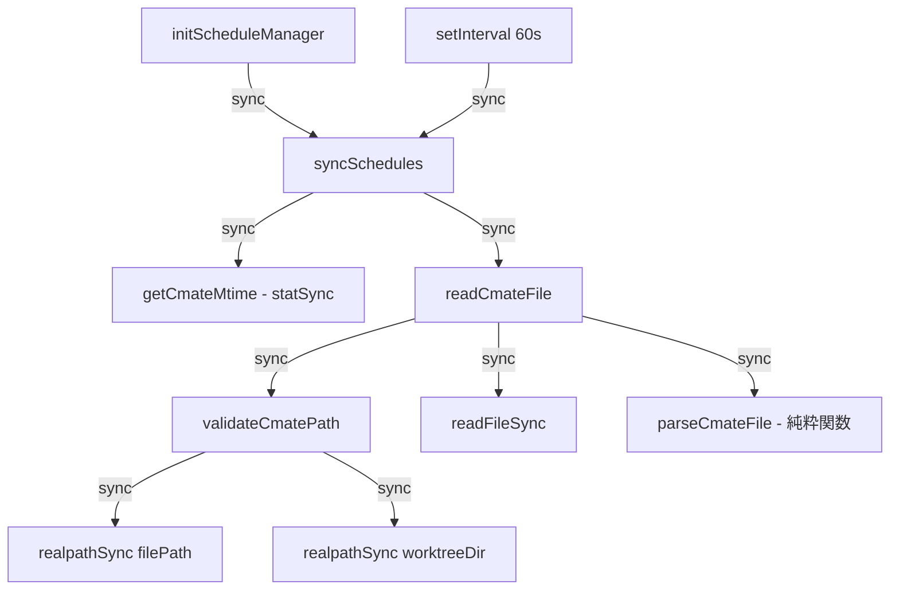
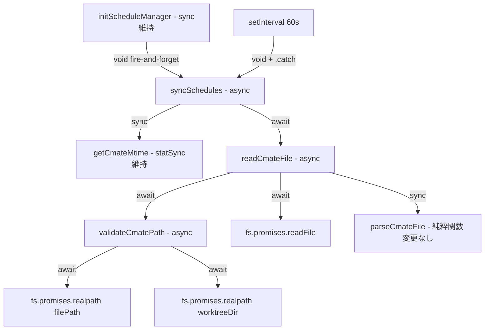

# Issue #406: cmate-parserの同期I/O非同期化 設計方針書

## 1. 概要

`src/lib/cmate-parser.ts` の `validateCmatePath()` と `readCmateFile()` 内の同期I/O（`realpathSync()` / `readFileSync()`）を `fs.promises` の非同期版に置き換え、スケジュールマネージャのポーリングループでのイベントループブロックを解消する。

## 2. アーキテクチャ設計

### 呼び出しフロー（変更前）



### 呼び出しフロー（変更後）



### レイヤー影響

| レイヤー | ファイル | 変更 |
|---------|---------|------|
| ビジネスロジック層 | `src/lib/cmate-parser.ts` | `validateCmatePath()` / `readCmateFile()` async化 |
| インフラ層 | `src/lib/schedule-manager.ts` | `syncSchedules()` async化、呼び出し元のfire-and-forget |
| テスト層 | `tests/unit/lib/cmate-parser.test.ts` | async/await対応 |
| テスト層 | `tests/unit/lib/schedule-manager*.test.ts` | モック方式変更 |
| ドキュメント | `CLAUDE.md` | モジュール説明更新 |

## 3. 設計判断

### DJ-001: `validateCmatePath()` の export 維持

| 項目 | 内容 |
|------|------|
| **判断** | `validateCmatePath()` は引き続き export する |
| **理由** | 現在 cmate-parser.test.ts で直接テストしている。public APIとしての一貫性を維持 |
| **型変更** | `boolean` → `Promise<boolean>` （破壊的変更だが外部呼び出し元なし） |

### DJ-002: `initScheduleManager()` の同期API維持

| 項目 | 内容 |
|------|------|
| **判断** | `initScheduleManager()` は sync のまま維持し、内部の `syncSchedules()` は fire-and-forget |
| **理由** | `server.ts` (L260) で同期的に呼ばれており、async化すると `server.ts` への波及が発生する |
| **実装** | `void syncSchedules()` （`.catch()` なし。`syncSchedules()` 内部のtry-catch L486/L574で全エラー捕捉済み） |
| **DJ-003との非対称性の根拠** | DJ-003（setInterval）では想定外エラーに対する多重防御として `.catch()` を付与するが、`initScheduleManager()` 内の初回呼び出しはサーバー起動直後の単発実行であり、`syncSchedules()` 内部の try-catch がエラーを完全にカバーするため `.catch()` を省略する（[DR1-001] Stage 1レビュー指摘による明記） |
| **unhandled rejection のトレードオフ（[DR3-002]）** | `.catch()` を省略することにより、`syncSchedules()` 内部の try-catch (L486/L574) を突破する想定外エラー（例: cmate-parser.ts の import 失敗、モジュールロードエラー等）は unhandled rejection として Node.js のデフォルトハンドラに到達する。Node.js v15+ ではデフォルトで unhandled rejection がプロセスを終了させるため、実質的にはサーバーがクラッシュする。これは **fail-fast として意図的に許容する**: サーバー起動直後のモジュール読み込みエラーは致命的であり、静かに無視するよりもプロセスを停止させて問題を即座に検出する方が運用上安全である。なお `server.ts` の process.on('uncaughtException') ハンドラは WebSocket エラーのみを無視する設計であり、unhandledRejection ハンドラは定義されていないため、この fail-fast 挙動は Node.js のデフォルト動作に依存する |
| **async化による新規一時的エラーカテゴリ（[SEC4-003]）** | 同期版では発生しなかった一時的エラー（例: `EPERM` - 短時間の権限変更による `fs.promises.realpath()` 失敗、`EMFILE` - ファイルディスクリプタ枯渇）が `syncSchedules()` 内部の try-catch を突破し、unhandled rejection を引き起こす可能性がある。**分析**: (1) `readCmateFile()` の catch ブロックは ENOENT のみを選択的にキャッチし、それ以外のエラーは re-throw する。(2) re-throw されたエラーは `syncSchedules()` の外側 try-catch (L486) で捕捉される。(3) したがって `EPERM`/`EMFILE` 等は L486 の catch でログ出力後に正常終了し、unhandled rejection には至らない。**DJ-003との非対称性の維持根拠**: `initScheduleManager()` はサーバー起動直後の単発実行であり、try-catch を突破するエラー（モジュールロード失敗等）は致命的→fail-fast が適切。一方 `setInterval` (DJ-003) は繰り返し実行であり、一時的エラーでサーバーを停止させるべきではないため `.catch()` を付与する。この非対称性は意図的である |

### DJ-003: `setInterval` 内の未処理Promise rejection対策

| 項目 | 内容 |
|------|------|
| **判断** | `.catch()` パターンを使用 |
| **理由** | `syncSchedules()` 内部のtry-catchでカバーされない想定外エラーに対する防御 |
| **実装** | `void syncSchedules().catch(err => console.error('[schedule-manager] Unexpected sync error:', err))` |

### DJ-004: `getCmateMtime()` の `statSync()` はスコープ外

| 項目 | 内容 |
|------|------|
| **判断** | `statSync()` は同期のまま維持 |
| **理由** | メタデータのみの読み取りでブロッキング時間が極めて短い（<1ms）。Issue #409のmtimeキャッシュにより毎回実行されるが、impact minimal |

### DJ-006: `syncSchedules()` 内の worktree ループは逐次 await を維持

| 項目 | 内容 |
|------|------|
| **判断** | `syncSchedules()` 内の for...of ループ (L485) では `await readCmateFile()` を逐次実行し、`Promise.all()` による並列化は行わない |
| **理由** | 既存の同期版と同じ逐次処理パターンを維持する。並列化は本 Issue #406 のスコープ外とし、将来の最適化候補とする |
| **トレードオフ** | 並列化による高速化の機会を見送るが、既存の動作パターンを保持し変更リスクを最小化する |
| **参照** | Section 6 パフォーマンス設計「注意点」、Section 8 トレードオフ表 |

### DJ-007: `syncSchedules()` 並行実行防止ガード

| 項目 | 内容 |
|------|------|
| **判断** | `ManagerState` に `isSyncing: boolean` フラグを追加し、`syncSchedules()` の並行実行を防止する |
| **理由** | async化により、`syncSchedules()` の実行が60秒のポーリング間隔を超過した場合、`setInterval` が次の呼び出しをトリガーし、2つの `syncSchedules()` が同一の `manager.schedules` Map および `manager.cmateFileCache` Map を同時に読み書きする競合状態が発生しうる（[SEC4-004]）。同期版ではイベントループをブロックしていたためこの問題は発生しなかった |
| **既存パターンとの一貫性** | `executeSchedule()` (L422-425) で `state.isExecuting` ガードが既に使用されており、同一パターンを適用する |
| **実装** | `ManagerState` に `isSyncing: boolean` フィールドを追加（初期値 `false`）。`syncSchedules()` の先頭で `if (manager.isSyncing) return;` チェックを行い、実行中の場合はスキップ。try-finally で `manager.isSyncing = false` をリセットする |

### DJ-005: `schedule-manager.test.ts` のモック方式

| 項目 | 内容 |
|------|------|
| **判断** | 方針(B): cmate-parserモジュール自体を `vi.mock()` でモック化 |
| **理由** | (A) fs/fs.promisesの2モジュール同時モック化は複雑。(B)はテスト対象を明確化し保守性が高い |
| **実装** | `vi.mock('../../../src/lib/cmate-parser', ...)` でデフォルト `mockResolvedValue(null)`、特定テストで `mockResolvedValueOnce()` |
| **statSync対応** | `vi.mock('fs', ...)` ファイルスコープで `statSync` のみモック化（`vi.doMock` はstatic importに効かないため） |

## 4. 変更対象の詳細設計

### 4.1 `src/lib/cmate-parser.ts`

#### import文変更

```typescript
// Before
import { readFileSync, realpathSync } from 'fs';

// After
import { realpath, readFile } from 'fs/promises';
```

**確認事項**: 既存の `import { readFileSync, realpathSync } from 'fs'` は完全に削除される。`parseCmateFile()`、`parseSchedulesSection()`、`sanitizeMessageContent()` 等の他の関数は `fs` モジュールに依存しない純粋関数のため、`'fs'` からの import 削除による影響はない（[DR1-007] Stage 1レビュー指摘による明記）。

**fs/promises インポートパターンの統一注記（[DR2-006]）**: 本プロジェクトでは `fs/promises` の named import パターン（`import { readFile, ... } from 'fs/promises'`）が標準である。以下のファイルで同パターンが使用されており、提案する `import { realpath, readFile } from 'fs/promises'` はプロジェクト規約に合致する。
- `src/lib/file-operations.ts`: `import { readFile, writeFile, mkdir, rm, rename, stat, readdir } from 'fs/promises'`
- `src/lib/claude-session.ts`: `import { access, constants } from 'fs/promises'`
- `src/lib/file-search.ts`: `import { readdir, readFile, lstat } from 'fs/promises'`
- `src/lib/file-tree.ts`: `import { readdir, stat, lstat } from 'fs/promises'`
- `src/app/api/worktrees/[id]/files/[...path]/route.ts`: `import { readFile, stat } from 'fs/promises'`

なお、`src/lib/log-manager.ts` のみ `import fs from 'fs/promises'`（default import）を使用しているが、これは例外的なパターンであり、本変更では多数派の named import パターンに従う。

#### `validateCmatePath()` 変更

```typescript
// Before
export function validateCmatePath(filePath: string, worktreeDir: string): boolean {
  const realFilePath = realpathSync(filePath);
  const realWorktreeDir = realpathSync(worktreeDir);
  // ...validation...
  return true;
}

// After
export async function validateCmatePath(filePath: string, worktreeDir: string): Promise<boolean> {
  const realFilePath = await realpath(filePath);
  const realWorktreeDir = await realpath(worktreeDir);
  // ...validation logic unchanged...
  return true;
}
```

#### `readCmateFile()` 変更

```typescript
// Before
export function readCmateFile(worktreeDir: string): CmateConfig | null {
  const filePath = path.join(worktreeDir, CMATE_FILENAME);
  try {
    validateCmatePath(filePath, worktreeDir);
    const content = readFileSync(filePath, 'utf-8');
    return parseCmateFile(content);
  } catch (error) {
    if (error instanceof Error && 'code' in error &&
        (error as NodeJS.ErrnoException).code === 'ENOENT') {
      return null;
    }
    throw error;
  }
}

// After
export async function readCmateFile(worktreeDir: string): Promise<CmateConfig | null> {
  const filePath = path.join(worktreeDir, CMATE_FILENAME);
  try {
    await validateCmatePath(filePath, worktreeDir);
    const content = await readFile(filePath, 'utf-8');
    return parseCmateFile(content);
  } catch (error) {
    if (error instanceof Error && 'code' in error &&
        (error as NodeJS.ErrnoException).code === 'ENOENT') {
      return null;
    }
    throw error;
  }
}
```

**エラーハンドリング確認**: `fs.promises.realpath()` と `fs.promises.readFile()` は ENOENT エラー時に `realpathSync()` / `readFileSync()` と同一の `NodeJS.ErrnoException` (code: 'ENOENT') を throw する。既存の catch ブロックのENOENT判定は async 化後も正しく動作する。

### 4.2 `src/lib/schedule-manager.ts`

#### `ManagerState` に `isSyncing` フラグ追加（DJ-007）

```typescript
// ManagerState interface/type に追加
isSyncing: boolean; // 初期値: false
```

#### `syncSchedules()` async化 + 並行実行防止ガード

```typescript
// Before
function syncSchedules(): void {

// After
async function syncSchedules(): Promise<void> {
  if (manager.isSyncing) return; // DJ-007: 並行実行防止
  manager.isSyncing = true;
  try {
    // ...既存ロジック...
  } finally {
    manager.isSyncing = false;
  }
}
```

L516の呼び出しに `await` を追加:
```typescript
// Before
const config = readCmateFile(worktree.path);

// After
const config = await readCmateFile(worktree.path);
```

#### `initScheduleManager()` 変更

```typescript
// Before (L617)
syncSchedules();

// After
void syncSchedules();
```

#### `setInterval` 変更

```typescript
// Before (L620-622)
manager.timerId = setInterval(() => {
  syncSchedules();
}, POLL_INTERVAL_MS);

// After
manager.timerId = setInterval(() => {
  void syncSchedules().catch(err =>
    console.error('[schedule-manager] Unexpected sync error:', err)
  );
}, POLL_INTERVAL_MS);
```

### 4.3 テスト変更

#### `cmate-parser.test.ts`

```typescript
// Before
expect(() => validateCmatePath(correctFile, worktreeDir)).not.toThrow();
expect(() => validateCmatePath(symlinkPath, worktreeDir)).toThrow('Path traversal detected');

// After
await expect(validateCmatePath(correctFile, worktreeDir)).resolves.toBe(true);
await expect(validateCmatePath(symlinkPath, worktreeDir)).rejects.toThrow('Path traversal detected');
```

**実ファイルシステムを使用するテストの注記（[DR3-003]）**: `validateCmatePath` テスト（L358-391）は、実際のファイルシステム上に `tmpDir`/`worktreeDir`/`outsideDir` を作成し、シンボリックリンクを生成して `realpathSync()` の実際の動作を通じてパストラバーサル検出を検証している。async 化後は `fs.promises.realpath()` が `realpathSync()` と同一のシンボリックリンク解決を行うため、これらのテストは**モック変更不要**でそのまま動作する。必要な変更は async/await 構文の変更のみ（テストコールバックを `async` に変更、`expect().not.toThrow()` を `await expect().resolves.toBe(true)` に変更、`expect().toThrow()` を `await expect().rejects.toThrow()` に変更）。

#### `schedule-manager-cleanup.test.ts`

```typescript
// Before (L79)
readCmateFile: vi.fn().mockReturnValue(null),

// After (L79)
readCmateFile: vi.fn().mockResolvedValue(null),
```

**変更詳細**: `schedule-manager-cleanup.test.ts` (L78-81) では既に `vi.mock('../../../src/lib/cmate-parser', ...)` で `readCmateFile` をモック化している。`readCmateFile()` が `Promise<CmateConfig | null>` を返すようになるため、L79 の `mockReturnValue(null)` を `mockResolvedValue(null)` に変更する（[DR1-003] Stage 1レビュー指摘による追記）。

#### `schedule-manager.test.ts`

**Before（現状 L273-281）**: 現在は `mtime cache (syncSchedules behavior)` describe ブロック内の個別テスト（例: `should skip DB queries when mtime is unchanged`）で `vi.doMock('fs', ...)` を使用し、`statSync` / `readFileSync` / `realpathSync` の3関数をまとめてモック化している。`readFileSync` と `realpathSync` のモックは、現在の `readCmateFile()` が `fs` モジュールの同期I/Oを直接使用しているために必要である。

```typescript
// Before: 現状のテスト（L274-281）
it('should skip DB queries when mtime is unchanged', () => {
  const mockStatSync = vi.fn().mockReturnValue({ mtimeMs: 1000 });
  vi.doMock('fs', () => ({
    statSync: mockStatSync,
    readFileSync: vi.fn().mockReturnValue('## Schedules\n| Name | ...'),
    realpathSync: vi.fn().mockImplementation((p: string) => p),
  }));
  // ...test logic（sync call: initScheduleManager()）
});
```

**After（変更後）**: `cmate-parser` モジュール自体をファイルスコープで `vi.mock()` する方式に変更する。これにより、`readCmateFile()` がモジュールレベルで差し替えられるため、`readFileSync` と `realpathSync` のモックは不要になる（`readCmateFile` の内部実装に依存しなくなる）。`statSync` のみが `getCmateMtime()` で直接使用されるため、`fs` モジュールのファイルスコープモックは `statSync` のみに限定される。

```typescript
// After: ファイルスコープで追加
vi.mock('../../../src/lib/cmate-parser', () => ({
  readCmateFile: vi.fn().mockResolvedValue(null),
  parseSchedulesSection: vi.fn().mockReturnValue([]),
}));

// statSync のファイルスコープモック（readFileSync/realpathSync は不要になる）
vi.mock('fs', async (importOriginal) => {
  const original = await importOriginal<typeof import('fs')>();
  return {
    ...original,
    statSync: vi.fn().mockReturnValue({ mtimeMs: 12345 }),
  };
});

// mtime cache テストでの上書き
it('should skip DB queries when mtime is unchanged', async () => {
  const { readCmateFile } = await import('../../../src/lib/cmate-parser');
  vi.mocked(readCmateFile).mockResolvedValueOnce(mockCmateConfig);
  // ...rest of test
});
```

**既存テストの async/await 対応**: `mtime cache (syncSchedules behavior)` セクション内の既存テストケース（L274 `should skip DB queries when mtime is unchanged`、L314 `should process normally on first sync (no cache)`、L320 `should remove cache entry when CMATE.md is deleted (mtime=null)`、L330 `should clear cmateFileCache when stopAllSchedules is called`）は、`syncSchedules()` が async 化されるため `initScheduleManager()` 内の fire-and-forget 呼び出しの完了を待つ必要がある。各テストケースのコールバックを `async` に変更し、必要に応じて `await vi.advanceTimersByTimeAsync()` を使用する。

**fire-and-forget 初回 syncSchedules() の完了待ちパターン（[DR3-001]）**: `initScheduleManager()` 内の `void syncSchedules()` は fire-and-forget であるため、テスト内で `initScheduleManager()` を呼び出した直後には `syncSchedules()` の Promise は未解決の状態にある。mtime cache テスト4件全てで、初回 `syncSchedules()` の完了を保証するために以下のパターンを使用する:

```typescript
// Pattern: await vi.advanceTimersByTimeAsync(0) で microtask queue を flush し、
// fire-and-forget の syncSchedules() Promise を解決させる
it('should skip DB queries when mtime is unchanged', async () => {
  const { readCmateFile } = await import('../../../src/lib/cmate-parser');
  const { statSync } = await import('fs');

  // 初回 sync 用のモック設定
  vi.mocked(statSync).mockReturnValue({ mtimeMs: 1000 } as ReturnType<typeof statSync>);
  vi.mocked(readCmateFile).mockResolvedValueOnce(mockCmateConfig);

  // initScheduleManager() は内部で void syncSchedules() を呼ぶ
  initScheduleManager();

  // fire-and-forget の syncSchedules() Promise を解決させる
  // advanceTimersByTimeAsync(0) は pending microtasks (Promise callbacks) を flush する
  await vi.advanceTimersByTimeAsync(0);

  // この時点で初回 syncSchedules() は完了済み
  expect(vi.mocked(readCmateFile)).toHaveBeenCalledTimes(1);

  // 2回目の sync をトリガー（setInterval 経由）
  vi.mocked(statSync).mockReturnValue({ mtimeMs: 1000 } as ReturnType<typeof statSync>);
  await vi.advanceTimersByTimeAsync(POLL_INTERVAL_MS);

  // mtime 未変更のため readCmateFile は再呼び出しされない
  expect(vi.mocked(readCmateFile)).toHaveBeenCalledTimes(1);
});
```

**重要**: `vi.advanceTimersByTime()` (同期版) ではなく `vi.advanceTimersByTimeAsync()` (非同期版) を使用すること。同期版は Promise の microtask を flush しないため、fire-and-forget の `syncSchedules()` が完了せず、テストが期待通りに動作しない。4件全てのテストで `async` コールバック + `await vi.advanceTimersByTimeAsync()` の組み合わせを使用する。

## 5. セキュリティ設計

### SEC-406-001: パストラバーサル防御の維持

`validateCmatePath()` の async 化によりセキュリティロジックの変更はない。`fs.promises.realpath()` は `realpathSync()` と同一のシンボリックリンク解決を行い、パストラバーサル防御は維持される。

### SEC-406-002: TOCTOU (Time of Check, Time of Use) リスク

`validateCmatePath()` と `readFile()` が別々の非同期操作になることで、理論的にはTOCTOUリスクが発生しうる（パス検証後、ファイル読み取り前にシンボリックリンクが変更される可能性）。

**原子性ギャップの拡大（[SEC4-002]）**: 同期版ではTOCTOUウィンドウはOSレベルのコンテキストスイッチ（マイクロ秒オーダー）に限定されるが、非同期版では `await validateCmatePath()` と `await readFile()` の間でイベントループが他の操作にyieldするため、ウィンドウがミリ秒オーダー（高負荷時はそれ以上）に拡大する。

**リスク受容の根拠**: 以下の理由により、このTOCTOUウィンドウ拡大は許容される:
1. CMATE.mdのパスはDB由来（`worktree.path`）であり、サーバー制御下にある
2. 攻撃者がシンボリックリンクを差し替えるにはworktreeディレクトリへのファイルシステム書き込みアクセスが必要
3. そのアクセス権限を持つ攻撃者はCMATE.mdの内容を直接改変可能であり、TOCTOU攻撃の動機が低い

**スコープ外**: `O_NOFOLLOW` ベースの読み取りや `fstat`-after-open パターンによる原子性保証は、本リファクタリングのスコープ外とする。

### SEC-406-003: エラーメッセージの情報開示リスク

`validateCmatePath()` のエラーメッセージ（L92-94: `Path traversal detected: ${filePath} is not within ${worktreeDir}`）は内部サーバーパス（`filePath` および `worktreeDir`）を含んでおり、情報開示のリスクが存在する（[SEC4-001]）。

**トラスト境界分析**: `validateCmatePath()` は現在 `readCmateFile()` からのみ呼び出され（DJ-001参照）、さらに `readCmateFile()` の唯一の呼び出し元は `schedule-manager.ts` (L516) である。`schedule-manager.ts` はDB由来の `worktree.path` を使用して呼び出すため、外部ユーザーが直接パスを制御する経路は存在しない。このため、現在のエラーメッセージによる情報開示の実質的リスクは低い。

**呼び出し元の責務（必須）**: `validateCmatePath()` はexport関数であり、将来的にユーザー制御可能なパスで呼び出される可能性がある。以下の制約を遵守すること:
- **呼び出し元は `validateCmatePath()` / `readCmateFile()` のエラーメッセージをHTTPレスポンスに直接含めてはならない**。サーバーサイドのログにのみ詳細エラーを記録し、クライアントには固定文字列のエラーメッセージ（例: `'CMATE.md path validation failed'`）を返すこと
- 現在の唯一の呼び出し元である `schedule-manager.ts` は内部ポーリングループであり、エラーは `console.error` でサーバーログに出力されるのみでHTTPレスポンスには伝播しないため、現状は安全である

## 6. パフォーマンス設計

### 改善効果

- **Before**: `realpathSync()` x 2 + `readFileSync()` x 1 = 各ファイルで~3-5ms のイベントループブロック
- **After**: 非同期I/Oにより、I/O待ち中にイベントループが他のリクエストを処理可能
- **軽減要因**: Issue #409のmtimeキャッシュにより、CMATE.md未変更時は`readCmateFile()`がスキップされる。`getCmateMtime()`の`statSync()`は<1msのため許容

### 注意点

- `syncSchedules()` のworktreeループ内で `await readCmateFile()` を使用するため、各worktreeは**逐次処理**される（並列化しない）-- **DJ-006** 参照
- 理由: 既存の同期版と同じ逐次処理パターンを維持。並列化は本Issueのスコープ外（将来の最適化候補）

## 7. 影響範囲

### 変更ファイル

| ファイル | 変更種別 | 変更内容 |
|---------|---------|---------|
| `src/lib/cmate-parser.ts` | 修正 | import変更、validateCmatePath/readCmateFile async化 |
| `src/lib/schedule-manager.ts` | 修正 | syncSchedules async化、fire-and-forget化 |
| `tests/unit/lib/cmate-parser.test.ts` | 修正 | async/awaitテスト対応 |
| `tests/unit/lib/schedule-manager.test.ts` | 修正 | vi.mock方式変更 |
| `tests/unit/lib/schedule-manager-cleanup.test.ts` | 修正 | mockResolvedValue変更 |
| `CLAUDE.md` | 修正 | モジュール説明更新 |

### 呼び出し元の網羅的確認

- **readCmateFile()** の呼び出し元は `schedule-manager.ts` (L516) のみであることを確認済み。`src/` 配下で `readCmateFile` を import/使用している箇所は `schedule-manager.ts` 以外に存在しない（[DR1-010] Stage 1レビュー指摘による追記）。
- **validateCmatePath()** は `cmate-parser.ts` 内の `readCmateFile()` からのみ呼び出される（外部呼び出し元なし。DJ-001 参照）。

### 影響なしの確認済みファイル

| ファイル | 理由 |
|---------|------|
| `src/lib/cmate-validator.ts` | `cmate-parser.ts` からのimportなし |
| `server.ts` | `initScheduleManager()` がsync APIのまま。**初期化順序の安全性（[DR3-004]）**: fire-and-forget 化により `initScheduleManager()` は `syncSchedules()` の完了を待たずに返るため、直後に呼ばれる `initResourceCleanup()` (L263) は `syncSchedules()` の初回実行完了前に開始される。しかし `initResourceCleanup()` は 24 時間周期の定期タスクであり、初回の `cleanupOrphanedMapEntries()` が `getScheduleWorktreeIds()` を呼び出す時点では schedules Map は空であるため、有効なスケジュールを孤立エントリとして誤検出することはない（空の Map をイテレートするだけ）。24 時間後の 2 回目以降の実行時には `syncSchedules()` は既に完了済みである |
| `src/lib/session-cleanup.ts` | `stopAllSchedules()` は sync API のまま |
| `src/lib/resource-cleanup.ts` | `getScheduleWorktreeIds()` は sync API のまま |

## 8. 設計上の決定事項とトレードオフ

| 決定事項 | 採用理由 | トレードオフ |
|---------|---------|-------------|
| `initScheduleManager()` sync維持 | server.ts への波及回避 | 初回同期のエラーがserver.tsに伝播しない |
| `getCmateMtime()` sync維持 | statSync <1ms で影響軽微 | 完全な非同期化ではない |
| 方針(B) テストモック | テストの保守性・明確性 | cmate-parserの内部実装変更に追従不要 |
| 逐次worktree処理の維持 (DJ-006) | 既存パターンの保持、スコープ限定 | 並列化による高速化の機会を見送り |
| `isSyncing` 並行実行防止ガード (DJ-007) | async化によるsetInterval並行実行の競合防止 | 60秒超過時の次回実行がスキップされる（遅延は次サイクルで回復） |

## 9. 実装チェックリスト

- [ ] `src/lib/cmate-parser.ts`: `import { readFileSync, realpathSync } from 'fs'` を完全に削除し、`import { realpath, readFile } from 'fs/promises'` に置き換え
- [ ] `src/lib/cmate-parser.ts`: `validateCmatePath()` を async 化（`Promise<boolean>` 戻り値）
- [ ] `src/lib/cmate-parser.ts`: `readCmateFile()` を async 化（`Promise<CmateConfig | null>` 戻り値）
- [ ] `src/lib/schedule-manager.ts`: `ManagerState` に `isSyncing: boolean` フラグを追加（初期値 `false`）（DJ-007, SEC4-004）
- [ ] `src/lib/schedule-manager.ts`: `syncSchedules()` を async 化し、先頭に `if (manager.isSyncing) return;` ガードを追加、try-finally で `isSyncing = false` リセット（DJ-007）
- [ ] `src/lib/schedule-manager.ts`: L516 の `readCmateFile()` 呼び出しに `await` 追加
- [ ] `src/lib/schedule-manager.ts`: `initScheduleManager()` 内を `void syncSchedules()` に変更（`.catch()` なし -- DJ-002 根拠参照）
- [ ] `src/lib/schedule-manager.ts`: `setInterval` 内を `void syncSchedules().catch(...)` に変更（DJ-003）
- [ ] `src/lib/schedule-manager.ts`: `syncSchedules()` 内の worktree ループは逐次 await を維持（DJ-006）
- [ ] `tests/unit/lib/cmate-parser.test.ts`: async/await テスト対応（`resolves`/`rejects` マッチャー使用）
- [ ] `tests/unit/lib/schedule-manager.test.ts`: `vi.mock()` によるモジュールレベルモック導入（既存の `vi.doMock('fs', ...)` の `readFileSync`/`realpathSync` モックを削除し、`cmate-parser` モジュールモックに置換 -- DR2-001）
- [ ] `tests/unit/lib/schedule-manager.test.ts`: `mtime cache` セクションの既存テストケース4件を async/await 対応に変更（DR2-001）。全テストで `await vi.advanceTimersByTimeAsync(0)` により fire-and-forget の初回 `syncSchedules()` Promise を解決させること（DR3-001）
- [ ] `tests/unit/lib/schedule-manager-cleanup.test.ts`: L79 `mockReturnValue(null)` を `mockResolvedValue(null)` に変更
- [ ] `src/lib/schedule-manager.ts`: `syncSchedules()` 内の `readCmateFile()` エラーがHTTPレスポンスに伝播しないことを確認（SEC4-001: 現在のconsole.errorログ出力のみで安全）
- [ ] `CLAUDE.md`: モジュール説明更新

## 10. レビュー履歴

| 日付 | ステージ | レビュー結果 | スコア |
|------|---------|-------------|--------|
| 2026-03-04 | Stage 1: 設計原則レビュー | conditionally_approved | 4/5 |
| 2026-03-04 | Stage 2: 整合性レビュー | conditionally_approved | 4/5 |
| 2026-03-04 | Stage 3: 影響分析レビュー | conditionally_approved | 4/5 |
| 2026-03-04 | Stage 4: セキュリティレビュー | conditionally_approved | 4/5 |

## 11. レビュー指摘事項サマリー

### Stage 1: 設計原則レビュー (2026-03-04)

| ID | 重要度 | カテゴリ | タイトル | 対応状況 |
|----|--------|---------|---------|---------|
| DR1-001 | should_fix | SOLID | DJ-002 と DJ-003 の .catch() 非対称性の設計根拠が不十分 | 反映済み (Section 3: DJ-002) |
| DR1-002 | nice_to_have | SOLID | validateCmatePath() の Promise<boolean> 戻り値の意義 | 対応不要（肯定的所見） |
| DR1-003 | should_fix | completeness | schedule-manager-cleanup.test.ts の変更詳細が欠落 | 反映済み (Section 4.3) |
| DR1-004 | nice_to_have | YAGNI | getCmateMtime() statSync の将来的な非同期化余地 | 対応不要（現状の判断は妥当） |
| DR1-005 | must_fix | completeness | syncSchedules() 逐次 await の設計判断が DJ として記載なし | 反映済み (Section 3: DJ-006 追加, Section 6/8 参照更新) |
| DR1-006 | nice_to_have | DRY | fire-and-forget パターンの共通化検討 | 対応不要（スコープ外） |
| DR1-007 | should_fix | clarity | import 文変更で 'fs' import 完全削除の明示不足 | 反映済み (Section 4.1) |
| DR1-008 | nice_to_have | KISS | 全体設計が KISS 原則に準拠 | 対応不要（肯定的所見） |
| DR1-009 | nice_to_have | SOLID | cmate-parser.ts の SRP 維持 | 対応不要（肯定的所見） |
| DR1-010 | should_fix | completeness | readCmateFile() 呼び出し元の網羅的確認が不足 | 反映済み (Section 7) |

### Stage 2: 整合性レビュー (2026-03-04)

| ID | 重要度 | カテゴリ | タイトル | 対応状況 |
|----|--------|---------|---------|---------|
| DR2-001 | should_fix | code_consistency | Section 4.3: schedule-manager.test.ts のモック方式の記載が現状コードと異なる | 反映済み (Section 4.3: Before/After明示、async/await対応補足追加) |
| DR2-002 | nice_to_have | code_consistency | DJ-002 の try-catch カバレッジの正確性 | 対応不要（L579-586の cronJob.stop() 例外リスクは極めて低く、本Issue変更スコープ外） |
| DR2-003 | nice_to_have | spec_consistency | Section 7 影響なしファイルに cmate-validator.ts の補足が不正確 | 対応不要（現状の記載は正確） |
| DR2-004 | nice_to_have | technical_feasibility | syncSchedules() async 化に伴い stale cleanup ループも await 対象になりうる | 対応不要（async化はreadCmateFile() のawait追加のみに限定） |
| DR2-005 | nice_to_have | internal_consistency | validateCmatePath() Before コードスニペットが関数シグネチャの改行を省略 | 対応不要（設計方針書の簡略表記として妥当） |
| DR2-006 | should_fix | code_consistency | Section 4.1 import文変更で readFile の named import が fs/promises の仕様と一致するか確認注記が必要 | 反映済み (Section 4.1: プロジェクト内fs/promises使用パターン調査結果と統一注記追加) |
| DR2-007 | nice_to_have | internal_consistency | Section 9 実装チェックリストの順序が Section 4 の記述順序と一致 | 対応不要（肯定的所見） |
| DR2-008 | nice_to_have | spec_consistency | Section 2 呼び出しフロー図が実際のコードフローと整合 | 対応不要（肯定的所見） |
| DR2-009 | nice_to_have | code_consistency | 全行番号参照が現在のコードベースと一致 | 対応不要（肯定的所見） |
| DR2-010 | nice_to_have | code_consistency | readCmateFile() 呼び出し元の網羅的確認結果が正確 | 対応不要（肯定的所見） |

### Stage 3: 影響分析レビュー (2026-03-04)

| ID | 重要度 | カテゴリ | タイトル | 対応状況 |
|----|--------|---------|---------|---------|
| DR3-001 | must_fix | impact_completeness | schedule-manager.test.ts の fire-and-forget syncSchedules() 完了待ちパターンが不足 | 反映済み (Section 4.3: fire-and-forget 初回 syncSchedules() の完了待ちパターン追加、vi.advanceTimersByTimeAsync(0) 具体例) |
| DR3-002 | should_fix | error_propagation | DJ-002 の unhandled rejection トレードオフが未記載 | 反映済み (Section 3: DJ-002 に unhandled rejection のトレードオフと fail-fast 根拠追記) |
| DR3-003 | should_fix | test_coverage | cmate-parser.test.ts の実ファイルシステム使用テストの async 化対応注記が不足 | 反映済み (Section 4.3: 実ファイルシステムテストはモック変更不要、async/await 構文変更のみの注記追加) |
| DR3-004 | should_fix | initialization_order | initScheduleManager() の fire-and-forget 化による初期化順序安全性の根拠が不足 | 反映済み (Section 7: server.ts の影響なし理由に初期化順序の安全性根拠追記) |
| DR3-005 | nice_to_have | impact_completeness | cmate-validator.ts の影響なし判定は正確 | 対応不要（肯定的所見） |
| DR3-006 | nice_to_have | cascade_effects | session-cleanup.ts と resource-cleanup.ts はカスケード影響なし | 対応不要（肯定的所見） |
| DR3-007 | nice_to_have | backward_compatibility | readCmateFile/validateCmatePath の型変更の後方互換性 | 対応不要（TypeScript型チェックで安全性担保済み） |
| DR3-008 | nice_to_have | test_coverage | session-cleanup/resource-cleanup テストへの影響なし確認 | 対応不要（肯定的所見） |
| DR3-009 | nice_to_have | impact_completeness | integration テストへの影響なし確認 | 対応不要（肯定的所見） |

### Stage 4: セキュリティレビュー (2026-03-04)

| ID | 重要度 | カテゴリ | タイトル | 対応状況 |
|----|--------|---------|---------|---------|
| SEC4-001 | must_fix | error_information_disclosure | SEC-406-003: validateCmatePath()エラーメッセージによる内部パス情報開示 | 反映済み (Section 5: SEC-406-003 トラスト境界分析・呼び出し元責務追加) |
| SEC4-002 | should_fix | toctou | SEC-406-002: TOCTOU原子性ギャップ拡大の定量的記述不足 | 反映済み (Section 5: SEC-406-002 ウィンドウ拡大の定量的分析・リスク受容根拠追加) |
| SEC4-003 | should_fix | unhandled_rejection | DJ-002: async化による新規一時的エラーカテゴリの検討不足 | 反映済み (Section 3: DJ-002 EPERM/EMFILEの伝播経路分析・DJ-003との非対称性維持根拠追加) |
| SEC4-004 | should_fix | race_condition | syncSchedules()並行実行による競合状態 | 反映済み (Section 3: DJ-007 追加、Section 4.2: isSyncingガード実装、Section 9: チェックリスト追加) |
| SEC4-005 | nice_to_have | symlink_attack | fs.promises.realpath()のセキュリティ等価性確認 | 対応不要（肯定的所見） |
| SEC4-006 | nice_to_have | input_validation | 全入力バリデーションがasync移行後も維持 | 対応不要（肯定的所見） |
| SEC4-007 | nice_to_have | dos_prevention | async I/Oによる新規DoSベクタなし | 対応不要（肯定的所見、SEC4-004対応で十分） |
| SEC4-008 | nice_to_have | nodejs_security | fs.promises APIのセキュリティ等価性 | 対応不要（肯定的所見） |
| SEC4-009 | nice_to_have | error_handling | ENOENTエラーハンドリングのasync版での正確性 | 対応不要（肯定的所見） |

---

*Generated for Issue #406 - 2026-03-04*
*Stage 1 レビュー指摘反映 - 2026-03-04*
*Stage 2 レビュー指摘反映 - 2026-03-04*
*Stage 3 レビュー指摘反映 - 2026-03-04*
*Stage 4 レビュー指摘反映 - 2026-03-04*
