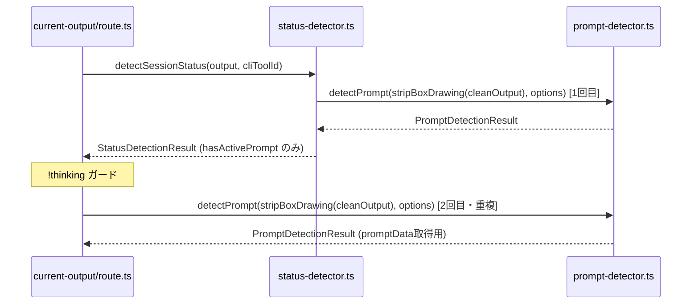
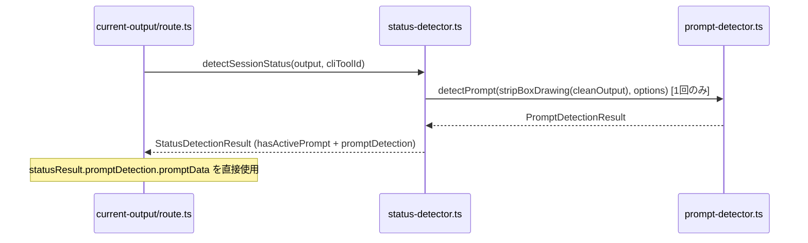
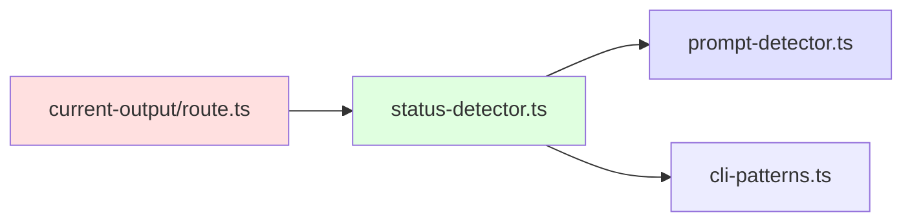

# Issue #408: detectPrompt二重呼び出し解消 設計方針書

## 0. レビュー履歴

| Stage | レビュー名 | 日付 | ステータス | スコア |
|-------|-----------|------|-----------|--------|
| Stage 1 | 通常レビュー（設計原則） | 2026-03-03 | conditionally_approved | 4/5 |

### レビュー指摘事項サマリー

| ID | 重要度 | カテゴリ | 概要 | 対応状況 |
|----|--------|---------|------|---------|
| DR1-001 | should_fix | 型安全性 | `promptDetection`をoptional→requiredに変更 | 反映済み |
| DR1-002 | nice_to_have | SOLID | SF-001 resolvedコメントに将来ガイドライン追記 | 反映済み |
| DR1-003 | should_fix | DRY | 「全9箇所」→「全8箇所」の数値不整合修正 | 反映済み |
| DR1-004 | nice_to_have | KISS | Section 4.3に削除対象コード（L98-L102）を明記 | 反映済み |
| DR1-005 | nice_to_have | YAGNI | YAGNI原則適合（指摘なし、良い設計判断として記録） | 対応不要 |
| DR1-006 | should_fix | 型安全性 | DR1-001採用によりoptional chaining→通常アクセスに修正 | 反映済み |
| DR1-007 | nice_to_have | その他 | stripAnsi削除前のgrep確認手順を追記 | 反映済み |
| DR1-008 | nice_to_have | DRY | auto-yes-manager.tsスコープ外の理由を補足 | 反映済み |

## 1. 概要

### 1.1 目的

`GET /api/worktrees/:id/current-output` API内で `detectPrompt()` が `detectSessionStatus()` の内部と外部で二重に呼び出されている問題を解消する。SF-001として意図的に設計されたDRY違反を再評価し、コードの明瞭性・DRY原則改善を優先する。

### 1.2 スコープ

| 含む | 含まない |
|------|---------|
| `StatusDetectionResult`型の拡張 | `auto-yes-manager.ts`の類似パターン（※独自のポーリングコンテキストで`detectPrompt()`を直接使用しており、`detectSessionStatus()`を経由しない独立パスのためスコープ外） |
| `detectSessionStatus()`の戻り値変更 | `response-poller.ts`の`detectPrompt()`呼び出し |
| `current-output/route.ts`の二重呼び出し削除 | `prompt-response/route.ts`の`detectPrompt()`呼び出し |
| SF-001コメント・JSDocの更新 | クライアント側の変更 |
| CLAUDE.mdのモジュール説明更新 | |

## 2. アーキテクチャ設計

### 2.1 変更前の構造



### 2.2 変更後の構造（案A）



### 2.3 依存関係



- 依存方向は一方向: `status-detector.ts` → `prompt-detector.ts`
- `PromptDetectionResult`型の追加インポートも同方向のため循環依存リスクなし

## 3. 型設計

### 3.1 StatusDetectionResult の拡張

```typescript
// src/lib/status-detector.ts

import type { PromptDetectionResult } from './prompt-detector';

export interface StatusDetectionResult {
  status: SessionStatus;
  confidence: StatusConfidence;
  reason: string;
  hasActivePrompt: boolean;

  /**
   * Issue #408: Prompt detection result from internal detectPrompt() call.
   * Required field (DR1-001) - callers that need promptData can access it
   * directly without a second detectPrompt() call.
   * Required にすることで、将来の return パス追加時にコンパイラが
   * 追加漏れを検出する（defense-in-depth）。
   *
   * Contains the full PromptDetectionResult including:
   * - isPrompt: boolean (always matches hasActivePrompt)
   * - promptData?: PromptData (question, options, type etc.)
   * - cleanContent: string
   * - rawContent?: string (truncated, Issue #235)
   *
   * Design guarantee: When status === 'running' && reason === 'thinking_indicator',
   * promptDetection.isPrompt is always false (prompt detection has higher priority
   * than thinking detection in the internal priority order).
   */
  promptDetection: PromptDetectionResult;
}
```

### 3.2 型の不変条件

| 条件 | 保証 |
|------|------|
| `hasActivePrompt === true` | `promptDetection.isPrompt === true` |
| `hasActivePrompt === false` | `promptDetection.isPrompt === false` |
| `reason === 'thinking_indicator'` | `promptDetection.isPrompt === false`（内部優先順序保証） |

**注（DR1-001）**: `promptDetection`はrequiredフィールドのため、全returnパスでの設定はTypeScriptコンパイラにより強制される。

## 4. 実装設計

### 4.1 detectSessionStatus() の変更

`detectSessionStatus()`内の全8箇所のreturn文に`promptDetection`フィールドを追加する。

```typescript
// Priority 1: Interactive prompt detected
const promptDetection = detectPrompt(stripBoxDrawing(cleanOutput), promptOptions);
if (promptDetection.isPrompt) {
  return {
    status: 'waiting',
    confidence: 'high',
    reason: 'prompt_detected',
    hasActivePrompt: true,
    promptDetection,  // ← 追加
  };
}

// Priority 2以降: prompt未検出時
// thinking, opencode, input_prompt, time-based, default の各returnパス
return {
  status: '...',
  confidence: '...',
  reason: '...',
  hasActivePrompt: false,
  promptDetection,  // ← 追加（isPrompt: false が保証されている）
};
```

**注意（DR1-001反映）**: `promptDetection`はrequiredフィールドとして定義するため、追加忘れはTypeScriptコンパイラの型エラーとして検出される。テストでの検証は補助的な位置づけとなる。

### 4.2 return パスの一覧

| パス | 行（概算） | reason | promptDetection.isPrompt |
|------|-----------|--------|--------------------------|
| 1 | L147 | `prompt_detected` | `true` |
| 2 | L158 | `thinking_indicator` | `false` |
| 3 | L177 | `opencode_processing_indicator` | `false` |
| 4 | L212 | `thinking_indicator` (opencode) | `false` |
| 5 | L225 | `opencode_response_complete` | `false` |
| 6 | L239 | `input_prompt` | `false` |
| 7 | L252 | `no_recent_output` | `false` |
| 8 | L263 | `default` | `false` |

**注**: OpenCode分岐（パス3-5）内で`promptDetection`変数が定義前に参照されないことを確認。`promptDetection`はL145で定義済みのため問題なし。

### 4.3 current-output/route.ts の変更

**削除対象コード（DR1-004）**: 以下のL98-L102のコードブロック全体を削除する。

```typescript
// 変更前（L87-102）
const statusResult = detectSessionStatus(output, cliToolId);
const thinking = statusResult.status === 'running' && statusResult.reason === 'thinking_indicator';

// SF-001 二重呼び出し（削除対象: L98-L102）
let promptDetection = { isPrompt: false, cleanContent: cleanOutput };  // L98: 変数宣言自体が削除対象
if (!thinking) {                                                        // L99
  const promptOptions = buildDetectPromptOptions(cliToolId);            // L100
  promptDetection = detectPrompt(stripBoxDrawing(cleanOutput), promptOptions);  // L101
}                                                                       // L102

// 変更後
const statusResult = detectSessionStatus(output, cliToolId);
const thinking = statusResult.status === 'running' && statusResult.reason === 'thinking_indicator';

// Issue #408: promptDetection は detectSessionStatus() の戻り値から直接取得
// detectSessionStatus() の内部優先順序（prompt -> thinking）により、
// thinking 到達時点で promptDetection.isPrompt === false が保証される。
// Issue #161 Layer 1 の防御は暗黙的に維持される。
```

APIレスポンス構築の変更:

```typescript
// 変更前
promptData: isPromptWaiting ? promptDetection.promptData : null,

// 変更後（DR1-006: promptDetection は required のため optional chaining 不要）
promptData: isPromptWaiting ? statusResult.promptDetection.promptData ?? null : null,
// IA3-009: isPromptWaiting === true の場合、Section 3.2の型不変条件により
// statusResult.promptDetection.isPrompt === true も保証される。
// promptData は PromptDetectionResult 上で optional (PromptData | undefined) のため
// ?? null が defense-in-depth として正当。
```

### 4.4 削除対象のimport

`current-output/route.ts`から以下を削除:

| import | 理由 |
|--------|------|
| `detectPrompt` from `@/lib/prompt-detector` | 直接呼び出し不要 |
| `buildDetectPromptOptions` from `@/lib/cli-patterns` | detectPrompt用のオプション構築不要 |
| `stripBoxDrawing` from `@/lib/cli-patterns` | detectPrompt前処理不要 |
| `stripAnsi` from `@/lib/cli-patterns` | L81の`cleanOutput`変数が不要になるため |

**確認**: `stripAnsi`は`current-output/route.ts`内で`cleanOutput`変数としてのみ使用。`cleanOutput`はL81定義→L98/L101でのみ参照。案A実装後、これらの参照が全て不要になるため`stripAnsi`インポートも削除可能。

**実装時の検証手順（DR1-007）**: `stripAnsi`および`cleanOutput`の削除前に、以下のgrepコマンドで当該ファイル内の全参照箇所を確認し、削除安全性を検証すること。

```bash
grep -n 'stripAnsi\|cleanOutput' src/app/api/worktrees/\[id\]/current-output/route.ts
```

## 5. セキュリティ設計

### 5.1 前処理パイプラインの同一性

変更前後で`detectPrompt()`に渡される入力が同一であることを保証する:

| 箇所 | 前処理パイプライン |
|------|-------------------|
| `detectSessionStatus()` 内部 (L120, L145) | `stripAnsi(output)` → `stripBoxDrawing(cleanOutput)` |
| `current-output/route.ts` 外部 (L81, L101) | `stripAnsi(output)` → `stripBoxDrawing(cleanOutput)` |

両者は同一の入力(`output`)に対して同一の処理を行うため、結果は等価。案A実装後は前者のみが残る。

### 5.2 影響なし項目

- APIレスポンスJSON形状に変更なし
- クライアント側への影響なし
- `promptData`の構造に変更なし

## 6. パフォーマンス設計

### 6.1 改善効果

| 指標 | 変更前 | 変更後 |
|------|--------|--------|
| `detectPrompt()` 呼び出し回数/リクエスト | 2回（`!thinking`時） | 1回 |
| regex評価回数 | 2倍 | 1倍 |
| I/O影響 | なし（regex-based） | なし |

**定量的効果**: `detectPrompt()`はregex-basedでI/Oなし（既存SF-001コメント記載通り）のため、実行時間への影響は軽微。主な改善はコードの明瞭性・DRY原則の改善。

## 7. テスト設計

### 7.1 テスト追加方針

テスト追加先: `tests/unit/lib/status-detector.test.ts`（Issue #188以降の新規テストパターンに統一）

### 7.2 テストケース

| テストケース | 検証内容 |
|-------------|---------|
| prompt検出時のpromptDetection | `promptDetection.isPrompt === true`、`promptData`が含まれること |
| prompt未検出時のpromptDetection | `promptDetection.isPrompt === false` |
| thinking時のpromptDetection | `promptDetection.isPrompt === false`（設計保証） |
| hasActivePromptとの一致性 | `hasActivePrompt === promptDetection.isPrompt`（全ケース） |
| 全returnパスのpromptDetection存在 | requiredフィールドのためコンパイラが保証（テストは補助的defense-in-depth） |
| 既存テストの後方互換性 | optionalフィールド追加により既存テストが壊れないこと |

### 7.3 既存テストへの影響（IA3-003反映）

影響分析レビュー（Stage 3）で全テストファイルを確認した結果、`StatusDetectionResult`オブジェクトを手動構築するテストは**存在しない**。全テストは`detectSessionStatus()`を直接呼び出しているため、requiredフィールド追加による既存テスト破壊は**発生しない**。

| テストファイル | 影響 | 対応 |
|--------------|------|------|
| `src/lib/__tests__/status-detector.test.ts` | `detectSessionStatus()`直接呼び出し、既存フィールドのみ検査 | **変更不要** |
| `tests/unit/lib/status-detector.test.ts` | 同上 | 新テスト追加先 |
| `tests/integration/current-output-thinking.test.ts` | SF-001コメント（L78, L98）の更新のみ | コメント更新（ロジック変更不要） |

## 8. 設計上の決定事項とトレードオフ

### 8.1 採用した設計（案A）

| 決定事項 | 理由 | トレードオフ |
|---------|------|-------------|
| `StatusDetectionResult`にrequired`promptDetection`追加（DR1-001） | 型安全性向上、将来のreturnパス追加時にコンパイラが検出 | SRP緩和（status-detectorがprompt形状に結合）。※既存テストへの影響なし（IA3-003: 全テストはdirectly呼び出しのため） |
| SF-001の再評価 | DRY原則改善が主目的 | 設計ドキュメント（SF-001）の更新が必要 |
| 全returnパスに`promptDetection`追加 | `hasActivePrompt`との一致性保証 | requiredフィールドのためコンパイラが追加漏れを検出（defense-in-depth） |

### 8.2 不採用の代替案

| 案 | 理由 |
|----|------|
| 案B: `detectSessionStatusWithPromptData()` 新設 | 関数増加、呼び出し元で使い分けが必要、DRY改善が不十分 |
| 案C: アウトパラメータ | TypeScriptでは非慣用的、可読性低下 |

### 8.3 SF-001 再評価の根拠

SF-001の原設計根拠と再評価:

| SF-001の根拠 | 再評価 |
|-------------|--------|
| SRP維持 | optionalフィールドによる結合は最小限。`PromptDetectionResult`型は安定しており変更頻度が低い |
| detectPrompt()はlightweight | 正しいが、DRYの原則違反を正当化するほどの理由にはならない |
| コスト negligible | 正しいが、コードの読者にとって二重呼び出しは理解コスト増 |

## 9. SF-001コメント更新方針

### 9.1 status-detector.ts JSDoc更新

```typescript
/**
 * Architecture note (Issue #408: SF-001 resolved):
 * Previously, this module returned StatusDetectionResult without
 * PromptDetectionResult (SF-001 tradeoff). Callers needing promptData
 * had to call detectPrompt() separately, resulting in a controlled DRY violation.
 *
 * Issue #408 resolved this by adding a required promptDetection field to
 * StatusDetectionResult. The SRP concern was mitigated by:
 *   - Callers not needing promptData can simply ignore the field
 *   - PromptDetectionResult being a stable type with low change frequency
 *
 * Future guideline (DR1-002): If PromptDetectionResult gains high-frequency
 * changes or large structural modifications, consider re-evaluating this
 * coupling via a minimal DTO/projection type (案B への移行を検討).
 */
```

### 9.2 current-output/route.ts コメント更新

```typescript
// Issue #408: promptDetection is obtained from detectSessionStatus() return value.
// Previously, detectPrompt() was called separately here (SF-001 tradeoff).
// detectSessionStatus() internal priority order (prompt -> thinking) guarantees
// that promptDetection.isPrompt === false when thinking is detected.
// This implicitly maintains Issue #161 Layer 1 defense.
```

## 10. CLAUDE.md更新方針

`status-detector.ts`モジュール説明に以下を反映:

- SF-001解消の記載
- `StatusDetectionResult`に`promptDetection: PromptDetectionResult`追加（requiredフィールド）
- `current-output/route.ts`の二重呼び出し削除

## 11. 制約条件

### 11.1 CLAUDE.md準拠

| 原則 | 対応 |
|------|------|
| DRY | `detectPrompt()`の二重呼び出しを解消（本Issueの主目的） |
| KISS | requiredフィールド1つの追加のみ（DR1-001） |
| YAGNI | 必要な変更のみ。案Bの関数増加を回避 |
| SOLID (SRP) | SRP緩和を受容。requiredフィールドにより型安全性を確保しつつ影響を最小化 |

### 11.2 後方互換性

- `StatusDetectionResult`の`promptDetection`はrequiredフィールドだが、他の呼び出し元（`worktrees/route.ts`等）は`promptDetection`を参照しないため破壊的変更なし（DR1-001）
- APIレスポンスJSON形状に変更なし
- 既存テストは`StatusDetectionResult`のモックオブジェクトに`promptDetection`追加が必要になる可能性がある

## 12. 実装チェックリスト

### 12.1 型定義の変更

- [ ] `StatusDetectionResult`の`promptDetection`をrequiredフィールドに変更（DR1-001）
- [ ] JSDocコメントを更新（required、DR1-001反映）

### 12.2 detectSessionStatus() の変更

- [ ] 全8箇所のreturnパスに`promptDetection`フィールドを追加（DR1-003: 8箇所）
- [ ] TypeScriptコンパイラで追加漏れがないことを確認（`npx tsc --noEmit`）

### 12.3 current-output/route.ts の変更

- [ ] L98-L102の二重呼び出しコードブロックを削除（DR1-004）
- [ ] `statusResult.promptDetection.promptData ?? null`に変更（DR1-006: optional chaining不要）
- [ ] 不要なimportを削除（`detectPrompt`, `buildDetectPromptOptions`, `stripBoxDrawing`）
- [ ] `stripAnsi`/`cleanOutput`の削除前にgrepで全参照箇所を確認（DR1-007）
- [ ] `stripAnsi`インポートと`cleanOutput`変数を削除（grepで安全性確認後）

### 12.4 コメント・JSDoc更新

- [ ] `status-detector.ts`にSF-001 resolvedアーキテクチャノートを追加（DR1-002: 将来ガイドライン含む）
- [ ] `current-output/route.ts`にIssue #408コメントを追加
- [ ] `tests/integration/current-output-thinking.test.ts` L78, L98のSF-001コメントを更新（IA3-006）

### 12.5 テスト

- [ ] `tests/unit/lib/status-detector.test.ts`に新テストケースを追加
- [ ] 既存テストへの変更は**不要**（IA3-003: 全テストはdirectly呼び出しのためrequiredフィールド追加の影響なし）
- [ ] `npm run test:unit`で全テスト通過を確認

### 12.6 ドキュメント更新

- [ ] CLAUDE.mdの`status-detector.ts`モジュール説明を更新

---

*Generated by design-policy command for Issue #408*
*Date: 2026-03-03*
*Stage 1 review applied: 2026-03-03*
