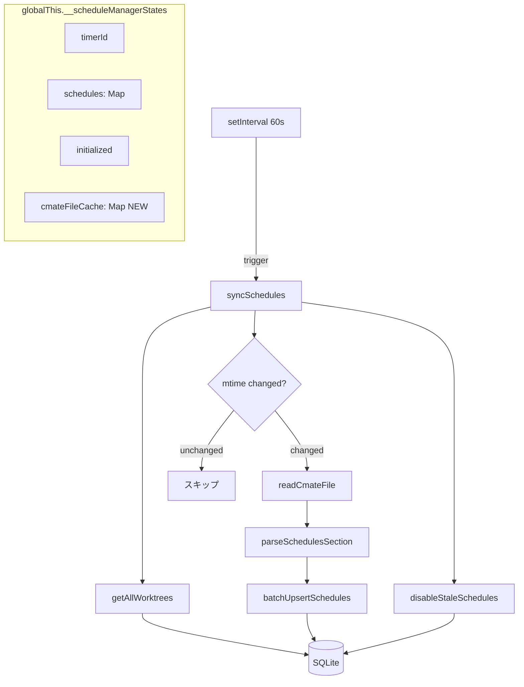

# 設計方針書: Issue #409 - DBインデックス追加とスケジュールマネージャのクエリ効率化

## 1. 概要

### 対象Issue
- **Issue #409**: perf: DBインデックス追加とスケジュールマネージャのクエリ効率化

### 目的
スケジュールマネージャの60秒ポーリングにmtimeキャッシュとトランザクションバッチ化を導入し、不足しているDBインデックスを追加する。

### スコープ
| 区分 | 内容 |
|------|------|
| In Scope | `scheduled_executions(worktree_id, enabled)`複合インデックス追加、mtimeキャッシュ導入、upsertバッチ化 |
| Out of Scope | `session-cleanup.ts`の`stopAllSchedules()`修正（Issue #407）、`cmate-parser.ts`の非同期化（Issue #406） |

---

## 2. アーキテクチャ設計

### 変更対象のコンポーネント構成



### レイヤー構成（変更箇所）

| レイヤー | ファイル | 変更内容 |
|---------|---------|---------|
| データアクセス層 | `src/lib/db-migrations.ts` | マイグレーション version 21 追加 |
| ビジネスロジック層 | `src/lib/schedule-manager.ts` | ManagerState拡張、mtimeキャッシュ、バッチ化 |
| テスト層 | `tests/unit/lib/schedule-manager.test.ts` | mtimeキャッシュテスト追加 |
| テスト層 | `tests/unit/lib/db-migrations.test.ts` | CURRENT_SCHEMA_VERSION更新 |

---

## 3. 技術選定

### 変更検出方式: fs.statSync().mtimeMs

| 選択肢 | メリット | デメリット | 判定 |
|--------|---------|-----------|------|
| **fs.statSync().mtimeMs（採用）** | 軽量（1回のsyscall）、readFileSync不要 | git操作でmtimeリセットの可能性 | ✅ 採用 |
| ファイルハッシュ（SHA256） | 正確な変更検出 | ファイル全体の読み取りが必要 | ❌ 過剰 |
| fs.watch / chokidar | イベント駆動で効率的 | 追加依存、ファイルシステム互換性 | ❌ 過剰 |

**採用理由**: CMATE.mdは小さなファイル（数KB以下）であり、mtime変更時のみ全文読み取り+パースを行う方式で十分。60秒ポーリングのためmtimeリセットが起きても次サイクルで補正される。

### バッチ化方式: db.transaction()

| 選択肢 | メリット | デメリット | 判定 |
|--------|---------|-----------|------|
| **db.transaction()（採用）** | SQLiteネイティブ、追加依存なし | worktree単位のアトミック操作 | ✅ 採用 |
| INSERT OR REPLACE一括 | シンプル | UNIQUE制約の暗黙deleteトリガー | ❌ 副作用リスク |
| 個別upsert維持（現状） | 変更なし | 1000+クエリ/60秒が継続 | ❌ 改善なし |

**採用理由**: better-sqlite3の`db.transaction()`は同期的でオーバーヘッドが極小。worktree単位のアトミック操作は実用上問題なし（upsertが失敗するケースは極めて稀）。

---

## 4. データモデル設計

### インデックス変更

#### 新規: `idx_scheduled_executions_worktree_enabled`

```sql
CREATE INDEX IF NOT EXISTS idx_scheduled_executions_worktree_enabled
  ON scheduled_executions(worktree_id, enabled);
```

**対象クエリ**:
1. `disableStaleSchedules()`: `SELECT id FROM scheduled_executions WHERE worktree_id IN (...) AND enabled = 1`
2. API `GET /schedules`: `SELECT * FROM scheduled_executions WHERE worktree_id = ? AND enabled = 1`

#### 既存インデックスの状態

| インデックス | カラム | 状態 | 備考 |
|-------------|--------|------|------|
| UNIQUE制約 | `(worktree_id, name)` | 維持 | 暗黙インデックスとして機能、upsertのSELECTで使用 |
| `idx_scheduled_executions_worktree` | `(worktree_id)` | 維持 | 新規複合インデックスでカバー可能だが明示的に残す |
| `idx_scheduled_executions_enabled` | `(enabled)` | 実装時判断 | 新規複合インデックスで冗長になる可能性あり |

### マイグレーション設計

```typescript
// db-migrations.ts - version 21
{
  version: 21,
  name: 'add-scheduled-executions-worktree-enabled-index',
  up: (db) => {
    db.exec(`
      CREATE INDEX IF NOT EXISTS idx_scheduled_executions_worktree_enabled
        ON scheduled_executions(worktree_id, enabled);
    `);
  },
  down: (db) => {
    db.exec('DROP INDEX IF EXISTS idx_scheduled_executions_worktree_enabled');
  }
}
```

---

## 5. ManagerState拡張設計

### 変更前

```typescript
interface ManagerState {
  timerId: ReturnType<typeof setTimeout> | null;
  schedules: Map<string, ScheduleState>;
  initialized: boolean;
}
```

### 変更後

```typescript
interface ManagerState {
  timerId: ReturnType<typeof setTimeout> | null;
  schedules: Map<string, ScheduleState>;
  initialized: boolean;
  /**
   * CMATE.md file mtime cache: worktree path -> mtimeMs
   *
   * サイズ上限について（SEC4-001）:
   * このMapのエントリ数はgetAllWorktrees()の結果と1:1対応する。
   * syncSchedules()ではgetAllWorktrees()で取得したworktreeリストを
   * 順次処理してcache.set()するため、エントリ数は常にworktrees
   * テーブルの行数以下となる。worktreeの登録数自体は
   * MAX_CONCURRENT_SCHEDULES=100（schedule-config.ts）と実運用上
   * 同程度の規模であり、Mapエントリ1件あたり約100-200バイト
   * （パス文字列+number）のため、メモリ枯渇のリスクはない。
   * worktreeが削除されDB上から消えた場合、次回syncSchedules()で
   * そのworktreeは巡回されず、CMATE.md削除と同様にキャッシュエントリ
   * が除去される（Section 6 Step 3b参照）。
   */
  cmateFileCache: Map<string, number>;
}
```

### 初期化

```typescript
function getManagerState(): ManagerState {
  if (!globalThis.__scheduleManagerStates) {
    globalThis.__scheduleManagerStates = {
      timerId: null,
      schedules: new Map(),
      initialized: false,
      cmateFileCache: new Map(),  // NEW
    };
  }
  return globalThis.__scheduleManagerStates;
}
```

**設計根拠**:
- globalThisに保持するため、サーバー再起動時は自動クリア
- Hot Reload時は既存パターンと同一の動作（globalThis経由で永続化）
- テスト時は `globalThis.__scheduleManagerStates = undefined` で全フィールドがリセット

**将来対応（Issue #407スコープ）（DR1-005: SOLID/ISP）**: cmateFileCacheの操作を拡張する際に、以下のヘルパー関数を追加することを推奨する。現時点ではManagerStateへの直接追加で問題ないが、worktree単位のキャッシュクリーンアップが必要になった場合に備える。

```typescript
/** worktree単位のキャッシュ削除 */
function clearCmateCache(worktreePath: string): void {
  const manager = getManagerState();
  manager.cmateFileCache.delete(worktreePath);
}

/** 全キャッシュクリア */
function clearAllCmateCache(): void {
  const manager = getManagerState();
  manager.cmateFileCache.clear();
}
```

---

## 6. syncSchedules()改修設計

### 処理フロー（変更後）

```
syncSchedules():
  1. getAllWorktrees() → worktrees[]
  2. activeScheduleIds = new Set<string>()
  3. FOR EACH worktree:
     a. getCmateMtime(worktree.path) → mtimeMs | null
     b. IF mtimeMs === null (ENOENT):
        - キャッシュにエントリあり → CMATE.md削除とみなす
          - キャッシュエントリ除去
          - continue
          【CMATE.md削除時の動作（DR1-009）】:
            activeScheduleIdsにそのworktreeのscheduleIdを追加しないことで、
            Step 4のClean Upフェーズで当該worktreeのcronJobが停止・
            manager.schedulesから削除される。さらにdisableStaleSchedules()で
            DBのscheduled_executionsレコードがenabled=0に更新される。
            このようにCMATE.md削除は、クリーンアップステップへの委譲
            という設計で処理される。
        - キャッシュにエントリなし → スキップ（CMATE.mdなし）
     c. IF mtimeMs === cache.get(path):
        - 変更なし → 既存のscheduleIdをactiveScheduleIdsに追加してスキップ
     d. ELSE (変更あり or 初回):
        - readCmateFile(worktree.path) → config
        - parseSchedulesSection(config.get('Schedules')) → entries[]
        - batchUpsertSchedules(worktree.id, entries) → scheduleIds[]
        - activeScheduleIds.addAll(scheduleIds)
        - Cronジョブ作成/更新
        - cache.set(path, mtimeMs)
  4. CleanUp: stale cron jobs, disableStaleSchedules()

stopAllSchedules()のライフサイクル:
  - schedules.clear()（既存処理）
  - cmateFileCache.clear()（新規追加: DR1-008）
  - initialized = false
```

**stopAllSchedules()でのcmateFileCacheクリア（DR1-008）**: stopAllSchedules()実行時には、既存の`schedules.clear()`に加えて`cmateFileCache.clear()`も呼び出す。これにより、スケジュール全停止時にキャッシュが残存してstaleなmtime値で次回起動時に誤ったスキップが発生することを防止する。本Issue #409のスコープ内で必要な最小限のキャッシュライフサイクル管理である。

### getCmateMtime()関数（新規）

```typescript
/**
 * Get CMATE.md mtime for a worktree path.
 * Returns null if file does not exist (ENOENT).
 *
 * @param worktreePath - The worktree directory path
 * @returns mtimeMs value or null if file not found
 */
function getCmateMtime(worktreePath: string): number | null {
  // @/config/cmate-constants からCMATE_FILENAME定数を直接import（DRY原則、循環依存防止: CR2-001）
  // トラスト境界（SEC4-003）: worktreePathはgetAllWorktrees()によるDB由来の値であり、
  // worktree登録時にvalidateWorktreePath()で検証済みのため、この関数内での
  // パストラバーサル再検証は不要。readCmateFile()にvalidateCmatePath()が存在するのは
  // 外部から直接呼び出される可能性があるためであり、getCmateMtime()は
  // syncSchedules()内部からのみ呼ばれる内部関数として設計されている。
  const filePath = path.join(worktreePath, CMATE_FILENAME);
  try {
    return statSync(filePath).mtimeMs;
  } catch (error) {
    if (error instanceof Error && 'code' in error &&
        (error as NodeJS.ErrnoException).code === 'ENOENT') {
      return null;
    }
    // Permission errors etc. - log and treat as no file
    console.warn(`[schedule-manager] Failed to stat ${filePath}:`, error);
    return null;
  }
}
```

### mtime未変更時の既存scheduleId復元

mtime未変更でスキップする場合、そのworktreeの既存scheduleIdをactiveScheduleIdsに追加する必要がある。そうしないと`disableStaleSchedules()`で誤って無効化される。

**方式**: `manager.schedules` Map内のscheduleIdのうち、当該worktreeIdに属するものをactiveScheduleIdsに追加。

```typescript
// mtime unchanged - add existing schedule IDs to active set
for (const [scheduleId, state] of manager.schedules) {
  if (state.worktreeId === worktree.id) {
    activeScheduleIds.add(scheduleId);
  }
}
```

---

## 7. バッチupsert設計

### batchUpsertSchedules()関数（新規）

```typescript
/**
 * Batch upsert schedule entries for a worktree.
 * Uses a single SELECT to build existing schedules map,
 * then UPDATE/INSERT within a transaction.
 *
 * @param worktreeId - Target worktree ID
 * @param entries - Schedule entries from CMATE.md
 * @returns Array of schedule IDs (existing or newly created)
 */
function batchUpsertSchedules(
  worktreeId: string,
  entries: ScheduleEntry[]
): string[] {
  const db = getLazyDbInstance();
  const now = Date.now();

  // Step 1: Bulk SELECT existing schedules for this worktree
  // better-sqlite3のprepare()はDBインスタンスレベルでキャッシュされるため、
  // 毎回呼び出しても実行効率は変わらない（DR1-007: SRP）
  const existingRows = db.prepare(
    'SELECT id, name FROM scheduled_executions WHERE worktree_id = ?'
  ).all(worktreeId) as Array<{ id: string; name: string }>;

  const existingMap = new Map(existingRows.map(r => [r.name, r.id]));

  // Step 2: Batch UPDATE/INSERT within transaction
  const scheduleIds: string[] = [];

  const updateStmt = db.prepare(`
    UPDATE scheduled_executions
    SET message = ?, cron_expression = ?, cli_tool_id = ?, enabled = ?, updated_at = ?
    WHERE id = ?
  `);

  const insertStmt = db.prepare(`
    INSERT INTO scheduled_executions
    (id, worktree_id, name, message, cron_expression, cli_tool_id, enabled, created_at, updated_at)
    VALUES (?, ?, ?, ?, ?, ?, ?, ?, ?)
  `);

  db.transaction(() => {
    for (const entry of entries) {
      const existingId = existingMap.get(entry.name);
      if (existingId) {
        updateStmt.run(
          entry.message, entry.cronExpression, entry.cliToolId,
          entry.enabled ? 1 : 0, now, existingId
        );
        scheduleIds.push(existingId);
      } else {
        const newId = randomUUID();
        insertStmt.run(
          newId, worktreeId, entry.name, entry.message,
          entry.cronExpression, entry.cliToolId,
          entry.enabled ? 1 : 0, now, now
        );
        scheduleIds.push(newId);
      }
    }
  })();

  return scheduleIds;
}
```

**upsertSchedule()の廃止**: upsertSchedule()はbatchUpsertSchedules()に完全に置き換えられ、schedule-manager.tsから削除する。syncSchedules()内のupsertSchedule()呼び出しもすべてbatchUpsertSchedules()に変更する。2つの関数が同じscheduled_executionsテーブルのupsert責務を持つことによるメンテナンス上の混乱を防止する（DR1-002: SRP）。

**next_execute_atカラムの扱い（CR2-002）**: scheduled_executionsテーブルにはnext_execute_atカラム（INTEGER, nullable）が存在するが（db-migrations.ts L828）、batchUpsertSchedules()のINSERT/UPDATE文ではnext_execute_atを操作しない。これは既存のupsertSchedule()と同一の動作であり、整合性を維持している。next_execute_atカラムは将来の拡張用であり、本Issueのスコープでは意図的に未使用とする。将来的にnext_execute_atを利用する場合は、別Issueで対応する。

**クエリ削減効果**:
- 変更前: entries.length × 2 クエリ（SELECT + UPDATE/INSERT）
- 変更後: 1 SELECT + entries.length × 1 UPDATE/INSERT（トランザクション内）
- 5エントリの場合: 10クエリ → 6クエリ（40%削減）
- mtime未変更: 0クエリ（100%削減）

### disableStaleSchedules()の動的IN句とSQLインジェクション安全性（SEC4-002）

`disableStaleSchedules()`内の動的プレースホルダー生成 `worktreeIds.map(() => '?').join(',')` は、以下の理由によりSQLインジェクション安全である。

1. **プレースホルダーのみ動的生成**: 生成されるSQL文は `WHERE worktree_id IN (?, ?, ?)` のように `?` プレースホルダーのみを動的に組み立てる。worktreeIdの値自体は文字列結合でSQL文に含めず、better-sqlite3のprepared statementパラメータバインディングを通じて安全に渡される。
2. **パラメータ数の自然上限**: worktreeIds配列はgetAllWorktrees()の結果に由来し、実運用上は100件以下（MAX_CONCURRENT_SCHEDULES=100相当）である。SQLiteのSQLITE_MAX_VARIABLE_NUMBER（デフォルト999）に対して十分な余裕がある。
3. **防御的対処（実装時推奨）**: 万が一worktree数がSQLiteパラメータ上限を超過するケースに備え、worktreeIds.length > 900の場合にチャンク分割（500件ずつ）するガード条件の追加を推奨する。現実的なworktree数（10-100程度）では到達しないが、defense-in-depthとして有効である。

---

## 8. エラーハンドリング設計

### CMATE.mdファイル操作のエラーケース

| エラー | 処理 | 影響 |
|-------|------|------|
| ENOENT（ファイルなし） | `getCmateMtime()` → null返却 | キャッシュエントリ有: CMATE.md削除として扱い、キャッシュ除去。キャッシュエントリ無: スキップ |
| EACCES（権限なし） | console.warn → null返却 | ファイルなしと同様に扱い、エラー伝播しない |
| db.transaction失敗 | 既存のtry-catch（syncSchedules L425-427）で捕捉 | worktree全体のupsertがロールバック |

### getCmateMtime()とreadCmateFile()のエラーハンドリング差異（CR2-004）

| 関数 | ENOENT | EACCES等の権限エラー | 設計意図 |
|------|--------|---------------------|---------|
| `getCmateMtime()` | null返却 | console.warn + null返却 | stat操作のみの軽量チェックであり、ポーリングの継続性を優先。権限エラーでもnullを返すことでworktreeのスキップにとどめ、他のworktreeの処理を妨げない |
| `readCmateFile()` | null返却（Map空） | throw（エラー伝播） | ファイル内容を読み取る操作であり、権限エラーは重大な問題を示すためthrowする |

**実用上のリスク**: getCmateMtime()がnull（権限エラー含む）を返した場合、syncSchedules()のフロー上readCmateFile()は呼ばれない（Step 3b/3cのスキップ処理）。そのため、getCmateMtime()がnullでreadCmateFile()がthrowする矛盾した動作が同一ポーリングサイクル内で発生することはない。ただし、stat権限とread権限が異なるケース（stat成功・read失敗）では、mtime変更検出後のreadCmateFile()がthrowする可能性がある。この場合は既存のsyncSchedules() try-catch（L425-427）で捕捉される。

### Cronジョブの状態整合性とリカバリ（DR1-004: SOLID/OCP）

mtime未変更でスキップする場合でもCronジョブが停止・消失しない理由:

1. **cronJobはglobalThisに保存されている**: `globalThis.__scheduleManagerStates`の`manager.schedules`にcronJobが保持されるため、通常の操作（Hot Reload、worktreeの追加/削除）では失われない。
2. **Node.jsプロセスがOOMキルされた場合**: globalThisが消失するが、その場合は`initScheduleManager()`で全て再初期化される（`initialized=false`になるため）。プロセス再起動時は全worktreeのCMATE.mdが再読み込み・再パースされ、Cronジョブも再作成される。
3. **したがって、mtime変更なし = CronジョブとDB状態が一致していると仮定できる**。この仮定が崩れる唯一のケースはプロセス再起動であり、その場合は自動的に全worktreeの再処理が行われる（cmateFileCacheも空になるため全worktreeがキャッシュミスとなる）。

### sanitizeMessageContent()によるサニタイズチェーン（SEC4-004）

batchUpsertSchedules()に渡されるScheduleEntryのmessageフィールドは、以下のサニタイズチェーンを経由してUnicode制御文字が除去済みである。

```
parseCmateFile(worktreePath)
  -> parseSchedulesSection(config.get('Schedules'))
    -> sanitizeMessageContent(rawMessage)  // Unicode制御文字除去（S4-002）
      -> ScheduleEntry.message（サニタイズ済み）
        -> batchUpsertSchedules(worktreeId, entries)
          -> DB INSERT/UPDATE（安全な値のみ）
```

**設計上の制約**: batchUpsertSchedules()自体にはサニタイズ処理を含めない。これはbatchUpsertSchedules()の責務がDB操作のみであり、入力バリデーション/サニタイズは呼び出し元のパイプライン（parseCmateFile -> parseSchedulesSection）が担当する責務分離の設計である。syncSchedules()がbatchUpsertSchedules()の唯一の呼び出し元であり、常にparseSchedulesSection()の結果を渡すため、サニタイズ漏れのリスクはない。将来batchUpsertSchedules()を別の経路から呼び出す場合は、入力バリデーション層の追加が必要となる。

### トランザクション動作変更

db.transaction()化により、個別エントリ単位の独立操作からworktree単位のアトミック操作に変わる。1エントリの失敗でworktree全体がロールバックされるが、upsertは定数値のINSERT/UPDATEであり失敗する可能性は極めて低い（DBコネクションエラー程度）。

---

## 9. テスト設計

### 追加テストケース

| テストケース | 検証内容 |
|-------------|---------|
| mtimeキャッシュヒット | mtime未変更時に`upsertSchedule()`のDBクエリが呼ばれないこと |
| mtimeキャッシュミス | mtime変更時に正常にCMATE.md解析・DB更新されること |
| CMATE.md削除時 | キャッシュエントリが除去され、スケジュールが無効化されること |
| 初回実行 | キャッシュ未構築時に全worktreeが正常処理されること |
| バッチupsert | トランザクション内でUPDATE/INSERTが正しく実行されること |
| インデックス存在確認 | マイグレーション version 21 適用後にインデックスが存在すること |

### テストパターン

```typescript
// mtimeキャッシュヒットのテスト例
it('should skip CMATE.md parsing when mtime is unchanged', () => {
  // 1. 初回syncSchedules() → CMATE.md読み取り・パース・upsert実行
  // 2. 2回目syncSchedules() → mtime同一 → readCmateFile呼ばれないことを確認

  const readCmateSpy = vi.spyOn(cmateParser, 'readCmateFile');

  // First sync - should read
  syncSchedules();
  expect(readCmateSpy).toHaveBeenCalledTimes(1);

  // Second sync - should skip (mtime unchanged)
  readCmateSpy.mockClear();
  syncSchedules();
  expect(readCmateSpy).not.toHaveBeenCalled();
});
```

### 既存テストへの影響

- `db-migrations.test.ts`: `expect(CURRENT_SCHEMA_VERSION).toBe(20)` → `toBe(21)` に更新（L37）
- `db-migrations.test.ts`: rollbackMigrationsテスト内の `expect(getCurrentVersion(db)).toBe(20)` → `toBe(21)` に更新（L430, L443の2箇所）（CR2-005 / IR3-001: version 21追加に伴い、runMigrations後にCURRENT_SCHEMA_VERSIONと一致することを期待する全てのハードコード値を確認・更新する。実装時には`toBe(20)`を全文検索して漏れなく更新すること）
- `schedule-manager.test.ts`: `globalThis.__scheduleManagerStates = undefined` でcmateFileCacheも自動リセット（追加処理不要）

---

## 10. セキュリティ設計

### 変更なし項目
- パストラバーサル防御: `readCmateFile()`内の`validateCmatePath()`は変更なし
- 入力サニタイズ: `sanitizeMessageContent()`は変更なし
- 入力バリデーション: `NAME_PATTERN`、`isValidCronExpression()`は変更なし

### 追加の考慮事項
- `getCmateMtime()`: `path.join(worktreePath, CMATE_FILENAME)`は`readCmateFile()`と同一のパス構築。CMATE_FILENAME定数は`@/config/cmate-constants`から直接importする（DR1-001、CR2-001: 循環依存防止のため`cmate-parser.ts`経由のre-exportは使用しない）。パストラバーサルは`worktreePath`がDB由来（`getAllWorktrees()`）のため信頼できる（SEC4-003: トラスト境界判断をSection 6のコード内コメントに明記済み）

### Stage 4 セキュリティレビュー追加事項

#### cmateFileCacheのサイズ上限（SEC4-001）

cmateFileCacheのMapエントリ数は、getAllWorktrees()で取得されるworktree数と1:1対応するため、自然上限が存在する。明示的なMAX_CACHE_ENTRIES定数は追加しないが、以下の根拠をSection 5のinterfaceコメントに文書化済み。

- cmateFileCacheのエントリ数 <= worktreesテーブルの行数（syncSchedules()の処理フローによる構造的保証）
- worktree数の実運用上限はMAX_CONCURRENT_SCHEDULES=100（schedule-config.ts）と同程度
- Mapエントリ1件あたり約100-200バイト（パス文字列+number型）であり、100件でも約10-20KBでメモリ枯渇リスクなし
- worktreeがDB上から削除された場合、次回syncSchedules()でキャッシュエントリも除去される

#### 動的IN句のSQLインジェクション安全性（SEC4-002）

disableStaleSchedules()の動的プレースホルダー生成は、値を文字列結合せずprepared statementバインディングのみを使用するため安全。詳細はSection 7「disableStaleSchedules()の動的IN句とSQLインジェクション安全性」を参照。

#### パストラバーサル防御のトラスト境界（SEC4-003）

getCmateMtime()にvalidateCmatePath()を追加しない設計判断について、worktreePathがDB由来で登録時にvalidateWorktreePath()検証済みであるトラスト境界をSection 6のコード内コメントに明記済み。readCmateFile()のvalidateCmatePath()は外部呼び出し対応のためであり、内部関数であるgetCmateMtime()との防御レベル差は意図的な設計である。

#### sanitizeMessageContent()サニタイズチェーン（SEC4-004）

parseCmateFile() -> parseSchedulesSection() -> sanitizeMessageContent() -> batchUpsertSchedules()のサニタイズチェーンをSection 8に文書化済み。batchUpsertSchedules()は常にサニタイズ済みデータのみを受け取る設計。

#### console.warnへのパス出力（SEC4-004-note）

getCmateMtime()のcatchブロックでconsole.warnにfilePathを出力する動作について、以下の判断により現状維持とする。
- サーバーサイドのconsole.warnは運用ログとして許容範囲内
- 既存のreadCmateFile()のvalidateCmatePath()でも同様にパスがエラーメッセージに含まれる
- ログエクスポート時にはlog-export-sanitizer.tsのsanitizeForExport()でHOMEパス等がマスキングされる

---

## 11. パフォーマンス設計

### 改善効果の見積もり

| シナリオ | 変更前 | 変更後 |
|---------|--------|--------|
| 100 worktree × 5 schedule（変更なし） | 1000+ クエリ/60秒 + 100 ファイル読み取り | 100 × fs.statSync() + 0 クエリ |
| 100 worktree × 5 schedule（1つ変更） | 1000+ クエリ/60秒 + 100 ファイル読み取り | 100 × fs.statSync() + 1 ファイル読み取り + 6 クエリ |
| disableStaleSchedules() | `WHERE worktree_id IN (...) AND enabled = 1` フルスキャン | 複合インデックスで効率的にフィルタ |

### fs.statSync()のコスト
- ローカルFS: 0.01-0.1ms/回（100回でも1-10ms、60秒間隔では無視可能）
- NFS: 数ms-数十ms/回（最悪ケースでも100回=数百ms-数秒、60秒間隔で許容範囲）

### インデックス追加によるINSERT/UPDATEオーバーヘッド（IR3-003）

新規複合インデックス `idx_scheduled_executions_worktree_enabled` の追加により、`scheduled_executions` テーブルへのINSERT/UPDATE時にインデックス更新コストが増加する。

**既存インデックス構成**（新規追加後は計4つ）:
1. UNIQUE制約 `(worktree_id, name)` - 暗黙インデックス
2. `idx_scheduled_executions_worktree` `(worktree_id)`
3. `idx_scheduled_executions_enabled` `(enabled)`
4. `idx_scheduled_executions_worktree_enabled` `(worktree_id, enabled)` **NEW**

**判断根拠**: `scheduled_executions` テーブルのデータ量は最大でも100 worktree x 5 schedule = 500行程度である。SQLiteのB-treeインデックスにおいて、500行規模のテーブルへのINSERT/UPDATE時のインデックス更新コストはmicrosecond単位であり、60秒ポーリング間隔に対して完全に無視可能である。また、mtimeキャッシュ導入により変更のないworktreeではINSERT/UPDATE自体が発生しないため、実質的なオーバーヘッド増加はさらに限定的となる。

---

## 12. 依存関係・マージ順序

### 推奨マージ順序

```
Issue #409（本Issue）→ Issue #406 → Issue #407
```

| Issue | 変更対象 | 依存関係 |
|-------|---------|---------|
| #409 | ManagerState拡張、mtimeキャッシュ、バッチ化 | なし（自己完結） |
| #406 | cmate-parser.ts非同期化、syncSchedules() await化 | #409のmtimeチェック後のreadCmateFile呼び出し箇所をawait化 |
| #407 | session-cleanup.tsのstopAllSchedules()修正 | #409のcmateFileCacheクリーンアップをworktree単位に対応 |

---

## 13. 設計上の決定事項とトレードオフ

| 決定事項 | 理由 | トレードオフ |
|---------|------|-------------|
| mtimeキャッシュ（ハッシュではなく） | 軽量でCMATE.mdサイズに依存しない | git操作によるmtimeリセット時に不要な再パースが発生（次サイクルで補正） |
| globalThisへのキャッシュ保持 | 既存パターンに準拠、Hot Reload対応 | プロセス間共有不可（単一プロセス前提） |
| worktree単位のトランザクション | 部分成功より一貫性を優先 | 1エントリの失敗でworktree全体がロールバック（実用上問題なし） |
| getAllWorktrees()は毎回呼び出し維持 | worktree追加/削除の検出に必要 | SELECT id, path FROM worktreesは毎回実行される（軽量なため許容） |
| 既存upsertSchedule()はbatchUpsertSchedules()に置換 | 責務の変更が明確 | 関数シグネチャが変わる（内部関数のため外部影響なし） |
| next_execute_atカラムは未使用のまま維持（CR2-002） | 既存upsertSchedule()と同一のカラム操作を維持し整合性確保 | 将来拡張時に別Issue対応が必要 |

---

## 14. ファイル変更一覧

| ファイル | 変更種別 | 変更内容 |
|---------|---------|---------|
| `src/lib/db-migrations.ts` | 修正 | CURRENT_SCHEMA_VERSION=21、マイグレーション version 21 追加 |
| `src/lib/schedule-manager.ts` | 修正 | ManagerState拡張、getCmateMtime()追加、batchUpsertSchedules()追加、syncSchedules()改修 |
| `tests/unit/lib/schedule-manager.test.ts` | 修正 | mtimeキャッシュ・バッチupsertのテスト追加 |
| `tests/unit/lib/db-migrations.test.ts` | 修正 | CURRENT_SCHEMA_VERSION アサーション値更新 |

### 間接影響ファイル（コード変更不要）（IR3-002）

以下のファイルはコード変更を必要としないが、新規インデックス `idx_scheduled_executions_worktree_enabled` の追加によるパフォーマンス恩恵を受ける。

| ファイル | 影響内容 |
|---------|---------|
| `src/app/api/worktrees/[id]/schedules/route.ts` | GET クエリ `WHERE worktree_id = ? AND enabled = 1`（L42）が新規複合インデックスによりフルスキャンからインデックススキャンに改善 |
| `src/app/api/worktrees/[id]/schedules/[scheduleId]/route.ts` | GET/PUT/DELETE クエリは `WHERE id = ? AND worktree_id = ?` パターンでUNIQUE制約のインデックスを使用。新規インデックスの直接的影響なし |

---

## 15. Stage 1 レビュー指摘事項反映サマリー

### レビュー概要

- **レビュー日**: 2026-03-03
- **ステージ**: Stage 1 通常レビュー（設計原則）
- **指摘件数**: Must Fix 2件 / Should Fix 4件 / Nice to Have 4件（合計10件）

### 反映済み指摘事項

| ID | 重要度 | カテゴリ | 指摘内容 | 反映箇所 |
|----|--------|---------|---------|---------|
| DR1-004 | must-fix | SOLID/OCP | Cronジョブの状態整合性リカバリがSection 8で未カバー | Section 8に「Cronジョブの状態整合性とリカバリ」サブセクション追加 |
| DR1-009 | must-fix | 設計の明確性 | CMATE.md削除時のcronJob停止フローが暗黙的 | Section 6 Step 3bにCMATE.md削除時の動作説明を明記 |
| DR1-001 | should-fix | DRY | getCmateMtime()でCMATE_FILENAME定数未使用 | Section 6のコード例をCMATE_FILENAME定数使用に修正、Section 10も更新 |
| DR1-002 | should-fix | SRP | upsertSchedule()の廃止が未明記 | Section 7にupsertSchedule()廃止の明記を追加 |
| DR1-005 | should-fix | SOLID/ISP | キャッシュ操作ヘルパーの将来対応が未記載 | Section 5にclearCmateCache/clearAllCmateCacheヘルパー案を追記 |
| DR1-007 | should-fix | SOLID/SRP | better-sqlite3のprepare()キャッシュに関する説明不足 | Section 7のコード例にprepare()キャッシュのコメント追加 |
| DR1-008 | nice-to-have | YAGNI | stopAllSchedules()でのcmateFileCache.clear()が未記載 | Section 6にstopAllSchedules()ライフサイクル説明を追加 |

### スキップした指摘事項

| ID | 重要度 | カテゴリ | 理由 |
|----|--------|---------|------|
| DR1-003 | nice-to-have | KISS | KISS優先でコメント追記にとどめる（実装時に判断） |
| DR1-006 | nice-to-have | DRY | 設計方針書への追記は実装時判断でよい |
| DR1-010 | nice-to-have | KISS | 既にSection 13に記載されているため追加不要 |

### 実装チェックリスト

実装者は以下のチェックリストに従って、レビュー指摘事項が正しく反映されていることを確認すること。

- [ ] **DR1-004**: `initScheduleManager()`でプロセス再起動時に全worktreeが再処理されることを確認（`initialized=false`かつ`cmateFileCache`空の状態）
- [ ] **DR1-009**: CMATE.md削除時にactiveScheduleIdsに追加されず、Step 4のClean UpでcronJobが停止・削除されることをテストで検証
- [ ] **DR1-001 / CR2-001**: `getCmateMtime()`で`CMATE_FILENAME`定数を`@/config/cmate-constants`から直接importして使用（`cmate-parser.ts`経由のre-exportは使用しない。循環依存防止）
- [ ] **DR1-002**: `upsertSchedule()`を`schedule-manager.ts`から削除し、`batchUpsertSchedules()`に完全置換
- [ ] **DR1-005**: Issue #407スコープとして`clearCmateCache()`/`clearAllCmateCache()`の追加を検討
- [ ] **DR1-007**: `batchUpsertSchedules()`内の`db.prepare()`呼び出しにキャッシュに関するコメントを記載
- [ ] **DR1-008**: `stopAllSchedules()`で`cmateFileCache.clear()`を`schedules.clear()`と同時に実行
- [ ] **CR2-003**: `ManagerState` interfaceに`cmateFileCache: Map<string, number>`フィールドを追加し、`getManagerState()`の初期化コードも更新（globalThis型宣言はManagerState型変更に自動追従するため明示的な変更不要）
- [ ] **CR2-005 / IR3-001**: `db-migrations.test.ts`のrollbackMigrationsテスト（L430 **および L443**）の`expect(getCurrentVersion(db)).toBe(20)`を`toBe(21)`に更新。version 21追加に伴い、ファイル内の`toBe(20)`を全文検索して漏れなく更新すること（L37, L430, L443の計3箇所）
- [ ] **IR3-004（認識事項）**: `schedule-manager.test.ts`（L27-63）のモックDBスキーマは`db-migrations.ts`のマイグレーションを経由せず直接CREATE TABLEしているため、新規インデックス`idx_scheduled_executions_worktree_enabled`はモックDBに作成されない。現在のテストはインデックス存在に依存しないため機能的な問題はないが、将来batchUpsertSchedules()のパフォーマンステストを追加する場合は`runMigrations()`を使用するかモックスキーマにインデックス定義を追加すること
- [ ] **SEC4-001**: `ManagerState` interfaceの`cmateFileCache`フィールドに、エントリ数がworktree数と1:1対応しサイズ上限が構造的に保証される旨のJSDocコメントを記載すること
- [ ] **SEC4-002**: `disableStaleSchedules()`の動的IN句プレースホルダー生成が値を文字列結合せずprepared statementバインディングのみ使用することを確認。必要に応じてworktreeIds.length > 900時のチャンク分割ガードを検討すること
- [ ] **SEC4-003**: `getCmateMtime()`のコード内コメントに、worktreePathがDB由来（getAllWorktrees()）で登録時にvalidateWorktreePath()検証済みであるトラスト境界判断を明記すること
- [ ] **SEC4-004**: `batchUpsertSchedules()`がsyncSchedules()からのみ呼ばれ、parseSchedulesSection()経由でsanitizeMessageContent()済みのデータのみを受け取ることを関数のJSDocまたはコード内コメントに明記すること

---

## 16. Stage 2 レビュー指摘事項反映サマリー

### レビュー概要

- **レビュー日**: 2026-03-03
- **ステージ**: Stage 2 整合性レビュー
- **ステータス**: conditionally_approved (スコア: 4/5)
- **指摘件数**: Must Fix 1件 / Should Fix 4件 / Consider 2件（合計7件）
- **リスク評価**: 技術リスク: low / セキュリティリスク: low / 運用リスク: low

### 反映済み指摘事項

| ID | 重要度 | カテゴリ | 指摘内容 | 反映箇所 |
|----|--------|---------|---------|---------|
| CR2-001 | must-fix | 整合性/import | CMATE_FILENAMEのimportパスが不明確（cmate-constants.ts直接 vs cmate-parser.ts経由） | Section 6のコード例コメント修正、Section 10のセキュリティ記載更新、Section 15チェックリストDR1-001をCR2-001と統合 |
| CR2-002 | should-fix | 整合性/DB | batchUpsertSchedules()でnext_execute_atカラムが未処理 | Section 7にnext_execute_atカラムの扱いを追記、Section 13に設計決定として追記 |
| CR2-003 | should-fix | 整合性/ManagerState | ManagerState interfaceへのcmateFileCache追加が実装チェックリストに未記載 | Section 15チェックリストにCR2-003項目追加 |
| CR2-004 | should-fix | 整合性/エラーハンドリング | getCmateMtime()とreadCmateFile()のエラーハンドリング差異が未説明 | Section 8に「getCmateMtime()とreadCmateFile()のエラーハンドリング差異」サブセクション追加 |
| CR2-005 | should-fix | 整合性/テスト | rollbackMigrationsテストのハードコード値更新が設計書に未記載 | Section 9の既存テスト影響にrollbackテスト行(L430)を追記、Section 15チェックリストにCR2-005項目追加 |

### スキップした指摘事項（Consider）

| ID | 重要度 | カテゴリ | 理由 |
|----|--------|---------|------|
| CR2-006 | consider | 整合性/session-cleanup | Issue #407のスコープで対応予定。Section 6のDR1-008で既にstopAllSchedules()のキャッシュクリアは設計済み |
| CR2-007 | consider | 整合性/既存インデックス | idx_scheduled_executions_enabledの冗長性判断は「実装時判断」を維持。SQLiteインデックスのオーバーヘッドは微小であり、設計段階での確定は不要 |

### 整合性マトリクス（レビュー確認済み）

| 設計項目 | 設計書記載 | 実装状態 | ギャップ |
|---------|-----------|---------|---------|
| ManagerState interface拡張 | Section 5: cmateFileCache追加 | 未実装（正常） | なし |
| マイグレーション version 21 | Section 4: インデックス追加 | version 20が最新（正常） | なし |
| CMATE_FILENAME定数import | Section 6,10: @/config/cmate-constants直接import | cmate-parser.tsからre-export有り | CR2-001で解決（直接import指定） |
| batchUpsertSchedules() SQL | Section 7: next_execute_at未使用を明記 | upsertSchedule()でも未使用 | CR2-002で解決（設計書に明記） |
| getCmateMtime()エラー処理 | Section 8: 差異を明記 | readCmateFile()は権限エラーthrow | CR2-004で解決（意図的差異を明記） |
| disableStaleSchedules()クエリ | Section 4: WHERE条件 | 実装と完全一致 | なし |
| upsertSchedule()廃止 | Section 7: 完全置換 | 現在存在（未実装のため正常） | なし |
| stopAllSchedules()キャッシュクリア | Section 6: cmateFileCache.clear()追加 | 未実装（正常） | なし |

---

## 17. Stage 3 レビュー指摘事項反映サマリー

### レビュー概要

- **レビュー日**: 2026-03-03
- **ステージ**: Stage 3 影響分析レビュー
- **ステータス**: conditionally_approved (スコア: 4/5)
- **指摘件数**: Must Fix 1件 / Should Fix 3件 / Consider 2件（合計6件）
- **リスク評価**: 技術リスク: low / セキュリティリスク: low / 運用リスク: low

### 反映済み指摘事項

| ID | 重要度 | カテゴリ | 指摘内容 | 反映箇所 |
|----|--------|---------|---------|---------|
| IR3-001 | must-fix | 影響範囲/テスト | db-migrations.test.ts L443のexpect(getCurrentVersion(db)).toBe(20)もtoBe(21)への更新対象 | Section 9の既存テスト影響にL443追加、Section 15チェックリストCR2-005をIR3-001と統合（L37, L430, L443の3箇所明記） |
| IR3-002 | should-fix | 影響範囲/API | src/app/api/worktrees/[id]/schedules/route.tsが新規インデックスの恩恵を受けることが未記載 | Section 14に「間接影響ファイル（コード変更不要）」サブセクション追加 |
| IR3-003 | should-fix | 影響範囲/INSERT性能 | 新規インデックス追加によるINSERT/UPDATEオーバーヘッドの判断根拠が不足 | Section 11に「インデックス追加によるINSERT/UPDATEオーバーヘッド」サブセクション追加（テーブルサイズ500行程度でmicrosecond単位のため無視可能） |
| IR3-004 | should-fix | 影響範囲/テスト | schedule-manager.test.tsのモックDBスキーマに新規インデックスが反映されない | Section 15チェックリストに認識事項として追記（現時点では変更不要、将来パフォーマンステスト追加時に注意） |

### スキップした指摘事項（Consider）

| ID | 重要度 | カテゴリ | 理由 |
|----|--------|---------|------|
| IR3-005 | consider | 影響範囲/session-cleanup | Section 6のDR1-008およびSection 12で既にIssue #407との依存関係が文書化済み。追加対応不要 |
| IR3-006 | consider | 影響範囲/CLAUDE.md | CLAUDE.mdの更新は実装完了後に行う運用であり、設計方針書への事前記載は不要 |

### 影響分析サマリー（レビュー確認済み）

| 影響区分 | ファイル | コード変更 | リスク |
|---------|---------|-----------|-------|
| 直接変更 | `src/lib/schedule-manager.ts` | 必要 | low |
| 直接変更 | `src/lib/db-migrations.ts` | 必要 | low |
| 直接変更 | `tests/unit/lib/schedule-manager.test.ts` | 必要 | low |
| 直接変更 | `tests/unit/lib/db-migrations.test.ts` | 必要（3箇所: L37, L430, L443） | low |
| 間接影響 | `src/app/api/worktrees/[id]/schedules/route.ts` | 不要（インデックス恩恵） | none |
| 間接影響 | `src/app/api/worktrees/[id]/schedules/[scheduleId]/route.ts` | 不要 | none |
| 間接影響 | `src/lib/session-cleanup.ts` | 不要（Issue #407で対応） | low |
| 間接影響 | `server.ts` | 不要 | none |
| 間接影響 | `src/config/cmate-constants.ts` | 不要（import元） | none |
| 間接影響 | `src/lib/cmate-parser.ts` | 不要（呼び出しパターン変更のみ） | none |

---

## 18. Stage 4 レビュー指摘事項反映サマリー

### レビュー概要

- **レビュー日**: 2026-03-03
- **ステージ**: Stage 4 セキュリティレビュー
- **ステータス**: conditionally_approved (スコア: 4/5)
- **指摘件数**: Must Fix 1件 / Should Fix 3件 / Consider 3件（合計7件）
- **リスク評価**: 技術リスク: low / セキュリティリスク: low / 運用リスク: low

### 反映済み指摘事項

| ID | 重要度 | カテゴリ | 指摘内容 | 反映箇所 |
|----|--------|---------|---------|---------|
| SEC4-001 | must-fix | メモリ枯渇 (DoS) | cmateFileCacheのMap sizeに上限がない。エントリ数がworktree数と1:1対応する構造的保証を文書化すべき | Section 5のinterfaceコメントにサイズ上限の根拠を明記、Section 10に「cmateFileCacheのサイズ上限」サブセクション追加、Section 15チェックリストにSEC4-001追加 |
| SEC4-002 | should-fix | SQLインジェクション (動的プレースホルダー) | disableStaleSchedules()の動的IN句がplaceholderのみ生成で値を文字列結合しないSQLインジェクション安全性を明記すべき | Section 7に「disableStaleSchedules()の動的IN句とSQLインジェクション安全性」サブセクション追加、Section 10に参照追加、Section 15チェックリストにSEC4-002追加 |
| SEC4-003 | should-fix | パストラバーサル防御の一貫性 | getCmateMtime()にvalidateCmatePath()がない理由（DB由来パスのトラスト境界判断）をコード内コメントに明記すべき | Section 6のgetCmateMtime()コード例にトラスト境界コメント追加、Section 10に「パストラバーサル防御のトラスト境界」サブセクション追加、Section 15チェックリストにSEC4-003追加 |
| SEC4-004 | should-fix | ログへの機密情報漏洩 / サニタイズチェーン | sanitizeMessageContent()によるサニタイズチェーンの文書化、console.warnへのパス出力の判断 | Section 8に「sanitizeMessageContent()によるサニタイズチェーン」サブセクション追加、Section 10に「sanitizeMessageContent()サニタイズチェーン」「console.warnへのパス出力」サブセクション追加、Section 15チェックリストにSEC4-004追加 |

### スキップした指摘事項（Consider）

| ID | 重要度 | カテゴリ | 理由 |
|----|--------|---------|------|
| SEC4-005 | consider | 暗号学的UUID安全性 | レビュー結果で「問題なし」と判定済み。crypto.randomUUID()はCSPRNGベースでID生成として適切。対応不要 |
| SEC4-006 | consider | DoS: mtimeキャッシュ無効化連発 | レビュー結果で「問題なし」と判定済み。最悪ケース（全キャッシュミス）でも変更前と同等コスト。60秒ポーリングがレートリミッターとして機能。対応不要 |
| SEC4-007 | consider | sanitizeMessageContent()カバレッジ | SEC4-004で反映済み。batchUpsertSchedules()の唯一の呼び出し元がsyncSchedules()であり、parseSchedulesSection()経由のサニタイズ済みデータのみが渡される設計をSection 8に文書化済み |

### OWASPチェックリスト（レビュー確認済み）

| OWASP カテゴリ | ステータス | 詳細 |
|---------------|-----------|------|
| A01: Broken Access Control | pass_with_note | getCmateMtime()にvalidateCmatePath()なし（DB由来パスのため低リスク、SEC4-003で文書化） |
| A02: Cryptographic Failures | pass | crypto.randomUUID()はCSPRNGベース、適切（SEC4-005） |
| A03: Injection | pass | 全SQLクエリがprepared statement使用。動的IN句はプレースホルダーのみ動的生成（SEC4-002で文書化） |
| A04: Insecure Design | pass | mtimeキャッシュは最適化目的、セキュリティ境界に影響なし |
| A05: Security Misconfiguration | pass_with_note | cmateFileCacheサイズ上限をSection 5で文書化（SEC4-001） |
| A06: Vulnerable Components | pass | 新規外部依存の追加なし |
| A07: Auth Failures | N/A | 認証/認可の変更なし |
| A08: Data Integrity | pass | db.transaction()によるアトミック操作でデータ整合性向上 |
| A09: Logging/Monitoring | pass_with_note | console.warnにフルパス出力あり（SEC4-004-note: 許容範囲、log-export-sanitizerで対応） |
| A10: SSRF | N/A | 外部HTTPリクエストの変更なし |
