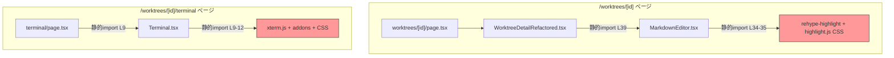
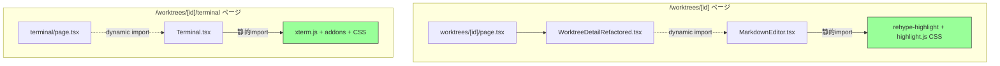
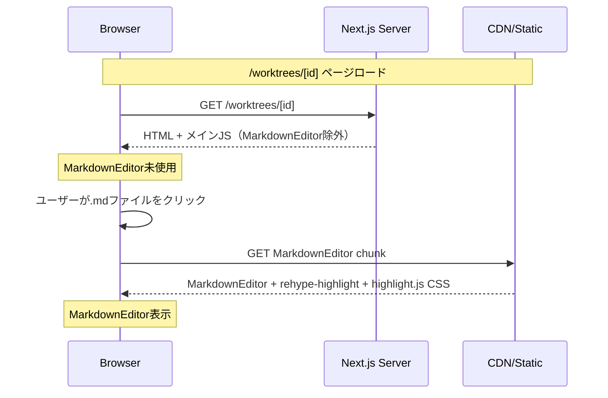

# Issue #410: xterm.js・highlight.jsのdynamic import化 設計方針書

## 1. 概要

xterm.js（~500KB）とhighlight.js/rehype-highlight（~100KB+）をdynamic importに変更し、初期バンドルサイズの削減とSSR互換性を確保する。

### 目的
- **F1**: `/worktrees/[id]/terminal` ページのSSR互換性確保（xterm.jsのブラウザ専用API対策）
- **F2**: `/worktrees/[id]` メインページのFirst Load JS削減（rehype-highlight/highlight.js CSSの遅延ロード）

### スコープ
| 対象 | ファイル | 変更内容 |
|------|---------|---------|
| TerminalComponent | `src/app/worktrees/[id]/terminal/page.tsx` | dynamic import化 |
| MarkdownEditor | `src/components/worktree/WorktreeDetailRefactored.tsx` | dynamic import化 |

### スコープ外
- `src/components/worktree/MessageList.tsx`: barrel export(index.ts)に定義はあるが、現時点でどのコンポーネントからも使用されていない。ツリーシェイキングでバンドルから除外される見込み [S2-001]
- `src/app/worktrees/[id]/files/[...path]/page.tsx`: 別ルート

---

## 2. アーキテクチャ設計

### コンポーネント依存グラフ（変更前）



### コンポーネント依存グラフ（変更後）



### レイヤー構成への影響

変更はプレゼンテーション層（`src/app/`, `src/components/`）のみ。ビジネスロジック層、データアクセス層への影響なし。

---

## 3. 技術選定

### 採用技術: `next/dynamic`

| 項目 | 内容 |
|------|------|
| **ライブラリ** | `next/dynamic`（Next.js組み込み） |
| **選定理由** | プロジェクト内に既存パターンあり（MermaidCodeBlock, QrCodeGenerator）、追加依存なし |
| **SSR制御** | `ssr: false` でクライアントサイド限定ロード |
| **型安全性** | `.then()` パターンでprops型を維持 |

### 代替案との比較

| 方式 | メリット | デメリット | 判定 |
|------|---------|-----------|------|
| `next/dynamic` + `ssr: false` | 既存パターンあり、設定シンプル | なし | **採用** |
| `React.lazy` + `Suspense` | React標準 | SSR制御不可、Next.jsとの互換性課題 | 不採用 |
| rehype-highlight内部遅延ロード | MarkdownEditor.tsx変更不要 | CSS遅延ロードが困難、複雑 | 不採用 |

---

## 4. 設計パターン

### D1: named export対応パターン

MarkdownEditor・TerminalComponentはいずれもnamed exportのため、`next/dynamic`使用時に`.then()`ラッパーが必要。

```typescript
// パターン: named export → dynamic import
const MarkdownEditor = dynamic(
  () =>
    import('@/components/worktree/MarkdownEditor').then((mod) => ({
      default: mod.MarkdownEditor,
    })),
  {
    ssr: false,
    loading: () => <LoadingIndicator />,
  }
);
```

**既存先例**:
- `src/components/worktree/MermaidCodeBlock.tsx` L20-34
- `src/app/login/page.tsx` L23-26

### D2: ローディングインジケーター

既存パターン（MermaidCodeBlock.tsx）に倣い、`Loader2` スピナーを使用。

**[S1-001] DRY原則への対応方針**:

MarkdownEditor用とTerminalComponent用のローディングUIは、背景色・テキスト色・メッセージ文字列のみが異なる同一構造のJSXである。既存のMermaidCodeBlock.tsxにも類似パターンがある。以下の方針で対応する。

- **推奨**: 共通ローディングコンポーネント `src/components/common/DynamicLoadingIndicator.tsx` を作成し、`bgColor`, `textColor`, `message` をpropsで受け取る設計にする
- **許容**: 現時点では2箇所のみであるため、YAGNI原則に基づきインライン定義を維持し、3箇所目が発生した時点でリファクタリングする判断も妥当
- **技術的注意**: `next/dynamic` の `loading` オプションはステートレスな関数コンポーネントを受け付けるため、外部モジュールからimportしたコンポーネントの使用は可能だが、実装時に動作確認すること

共通コンポーネント案（実装は実装者に委ねる）:

```typescript
// src/components/common/DynamicLoadingIndicator.tsx
import { Loader2 } from 'lucide-react';

interface DynamicLoadingIndicatorProps {
  bgColor?: string;     // default: 'bg-white'
  spinnerColor?: string; // default: 'text-blue-600'
  textColor?: string;    // default: 'text-gray-600'
  message?: string;      // default: 'Loading...'
}

export function DynamicLoadingIndicator({
  bgColor = 'bg-white',
  spinnerColor = 'text-blue-600',
  textColor = 'text-gray-600',
  message = 'Loading...',
}: DynamicLoadingIndicatorProps) {
  return (
    <div className={`flex items-center justify-center h-full ${bgColor}`}>
      <div className="text-center">
        <Loader2 className={`animate-spin h-8 w-8 ${spinnerColor} mx-auto`} />
        <p className={`mt-4 ${textColor}`}>{message}</p>
      </div>
    </div>
  );
}
```

インライン定義パターン（共通コンポーネントを使用しない場合）:

```typescript
// MarkdownEditor用ローディング
loading: () => (
  <div className="flex items-center justify-center h-full bg-white">
    <div className="text-center">
      <Loader2 className="animate-spin h-8 w-8 text-blue-600 mx-auto" />
      <p className="mt-4 text-gray-600">Loading editor...</p>
    </div>
  </div>
)

// TerminalComponent用ローディング
loading: () => (
  <div className="flex items-center justify-center h-full bg-gray-900">
    <div className="text-center">
      <Loader2 className="animate-spin h-8 w-8 text-gray-400 mx-auto" />
      <p className="mt-4 text-gray-500">Loading terminal...</p>
    </div>
  </div>
)
```

### D3: テストモックパターン

既存テストは変更不要（MarkdownEditor.test.tsxは直接import、WorktreeDetailRefactored.test.tsxはMarkdownEditorを参照していない）。

将来的にdynamic importのモックが必要な場合の参考パターン:

```typescript
// tests/unit/components/MermaidCodeBlock.test.tsx L24-35
vi.mock('next/dynamic', () => ({
  default: (loader, _options) => {
    const DynamicComponent = (props) => {
      return <div data-testid="mock">{props.code}</div>;
    };
    return DynamicComponent;
  },
}));
```

---

## 5. 変更詳細設計

### 5-1. TerminalComponent dynamic import化

**変更ファイル**: `src/app/worktrees/[id]/terminal/page.tsx`

**変更前** (L9):
```typescript
import { TerminalComponent } from '@/components/Terminal';
```

**変更後**:
```typescript
import dynamic from 'next/dynamic';
import { Loader2 } from 'lucide-react';

const TerminalComponent = dynamic(
  () =>
    import('@/components/Terminal').then((mod) => ({
      default: mod.TerminalComponent,
    })),
  {
    ssr: false,
    loading: () => (
      <div className="flex items-center justify-center h-full bg-gray-900">
        <div className="text-center">
          <Loader2 className="animate-spin h-8 w-8 text-gray-400 mx-auto" />
          <p className="mt-4 text-gray-500">Loading terminal...</p>
        </div>
      </div>
    ),
  }
);
```

**設計根拠**:
- xterm.jsはブラウザ専用API（DOM操作）に依存
- `'use client'`があってもNext.jsはSSR時にClient Componentを実行する
- `ssr: false`でサーバーサイドでのモジュール実行を完全に回避
- Terminal.tsx自体は変更不要（importは維持）

### 5-2. MarkdownEditor dynamic import化

**変更ファイル**: `src/components/worktree/WorktreeDetailRefactored.tsx`

**[S1-002] import追加に関する注記**: WorktreeDetailRefactored.tsxは既に約60個のimport文（L19-L60）を持つ。`Loader2` は lucide-react からの新規importとなる（既存のlucide-react importは無い）。import文の追加位置は他のUI系importの近くに配置すること。なお、S1-001の共通コンポーネント案を採用した場合は `Loader2` のimportは共通コンポーネント側に移動するため、WorktreeDetailRefactored.tsxへの追加は不要となる。

**変更前** (L39):
```typescript
import { MarkdownEditor } from '@/components/worktree/MarkdownEditor';
```

**変更後**:
```typescript
import dynamic from 'next/dynamic';
import { Loader2 } from 'lucide-react'; // [S1-002] 新規追加 - UI系importの近くに配置

const MarkdownEditor = dynamic(
  () =>
    import('@/components/worktree/MarkdownEditor').then((mod) => ({
      default: mod.MarkdownEditor,
    })),
  {
    ssr: false,
    loading: () => (
      <div className="flex items-center justify-center h-full bg-white">
        <div className="text-center">
          <Loader2 className="animate-spin h-8 w-8 text-blue-600 mx-auto" />
          <p className="mt-4 text-gray-600">Loading editor...</p>
        </div>
      </div>
    ),
  }
);
```

**設計根拠**:
- MarkdownEditorはマークダウンファイル選択時のみ表示（条件付きレンダリング）
- コンポーネント全体のdynamic importで内部のrehype-highlight + highlight.js CSSも自動チャンク分離
- `next/dynamic`の`.then()`パターンでEditorProps型が維持される
- WorktreeDetailRefactored.tsxのMarkdownEditor使用箇所（L2070-2076, L2309-2314）のpropsは変更不要

**[S3-001] Modal内ローディング高さ確保に関する実装確認ポイント**:

WorktreeDetailRefactored.tsx L2069/L2308のModal内で `<div className="h-[80vh]">` がMarkdownEditorの親コンテナとなっている。ローディングコンポーネントのルート要素は `h-full` でflex中央配置されるため、親の `h-[80vh]` を継承して高さが確保される設計になっている。MarkdownEditorが `null` -> ローディング -> 実コンポーネントと遷移する間にレイアウトシフトが発生しないことを、実装時に以下の観点で確認すること:

- Modal (`size="full"`) 表示時にローディングスピナーが `h-[80vh]` 領域の中央に表示されること
- ローディングから実コンポーネントへの切り替わり時にModalの高さが変動しないこと
- ローディングコンポーネントに `min-h-[200px]` 等の最小高さ指定が必要かどうかを実装時に判断すること（通常は親の `h-[80vh]` で十分だが、CSS計算の順序によっては必要になる場合がある）

---

## 6. セキュリティ設計

### リスク評価

| リスク | 評価 | 対策 |
|-------|------|------|
| XSS | 影響なし | rehype-sanitize（SEC-MF-001）は維持、動的ロードタイミングの変更のみ |
| CSSインジェクション | 影響なし | highlight.js CSSの適用タイミングが変わるが、コンテンツは同一 |
| SSRエラー | **解決** | `ssr: false`でxterm.jsのサーバーサイド実行を防止 |

### セキュリティ制約
- MarkdownEditor内のrehype-sanitize（XSS防止）は引き続き動作
- Terminal.tsxのWebSocket接続は変更なし

---

## 7. パフォーマンス設計

### バンドルサイズ影響

| ルート | 変更前 | 変更後（推定） | 効果 |
|-------|-------|-------------|------|
| `/worktrees/[id]` | rehype-highlight + highlight.js CSS含む | 遅延ロード化（別チャンク分離） | First Load JSから ~100KB+ 削減 |
| `/worktrees/[id]/terminal` | xterm.js含む（Client ComponentだがSSR時にサーバー実行） | 別チャンクに分離（初期ロード時にはダウンロードされず、必要時にロード） | 初期チャンクから ~500KB 分離。**主目的はSSRエラー防止**（xterm.jsのブラウザ専用DOM API参照エラーの回避）。Client Componentのコードは最終的にクライアントバンドルに含まれるため、ダウンロードされるJS総量自体は変わらず、初期レンダリング時のチャンク分割による遅延ロードとなる |

### ロード戦略



### パフォーマンスリスク

| リスク | 影響度 | 対策 |
|-------|-------|------|
| 初回マークダウン表示の遅延 | 低 | ローディングインジケーター表示、チャンクはキャッシュされる |
| 初回ターミナル表示の遅延 | 低 | ローディングインジケーター表示 |
| highlight.js CSS適用タイミング | 極低 | MarkdownEditorはモーダル内表示、ロード完了後にレンダリング |
| 2回目以降のMarkdownEditor表示遅延 [S3-006] | なし | 初回ロード時にブラウザがチャンクをキャッシュするため、2回目以降の.mdファイル表示（editorFilePath切り替え時）ではネットワークフェッチが発生せず即時レンダリングとなる。ローディングインジケーターは初回のみ表示される |

---

## 8. 設計上の決定事項とトレードオフ

### 採用した設計

| 決定事項 | 理由 | トレードオフ |
|---------|------|-------------|
| コンポーネント全体のdynamic import | 内部依存（rehype-highlight, highlight.js CSS）も自動チャンク分離 | 初回表示時にローディング表示 |
| `ssr: false` | xterm.jsのSSRエラー防止、MarkdownEditorもクライアント限定で安全 | SSR時のSEO影響なし（管理ツールのため） |
| named export `.then()` パターン | 既存コードの変更不要、プロジェクト内先例あり | 若干冗長なimport記述 |
| import先変更のみ（元コンポーネント変更なし） | Terminal.tsx, MarkdownEditor.tsxの変更不要、テスト影響最小 | import元ファイルごとの対応が必要 |

### 不採用の代替案

1. **MarkdownEditor内部でのrehype-highlight遅延ロード**: MarkdownEditor.tsx自体の変更が必要、CSS遅延ロードが技術的に困難
2. **React.lazy + Suspense**: Next.jsとのSSR統合に課題、`ssr: false`相当の機能がない
3. **webpack SplitChunksPlugin手動設定**: next.config.jsの変更が必要、`next/dynamic`で十分

---

## 9. 影響範囲

### 変更ファイル一覧

| ファイル | 変更内容 | リスク |
|---------|---------|-------|
| `src/app/worktrees/[id]/terminal/page.tsx` | 静的import → dynamic import | 低 |
| `src/components/worktree/WorktreeDetailRefactored.tsx` | 静的import → dynamic import | 低 |

### 変更不要ファイル

| ファイル | 理由 |
|---------|------|
| `src/components/Terminal.tsx` | 参照のみ、export変更なし |
| `src/components/worktree/MarkdownEditor.tsx` | 参照のみ、export変更なし |
| `tests/unit/components/MarkdownEditor.test.tsx` | 直接importのため影響なし |
| `tests/unit/components/WorktreeDetailRefactored.test.tsx` | MarkdownEditorを参照していない |

---

## 10. 受入条件と検証方法

### 定量基準 [S1-005]

| 指標 | 定量基準 | 測定方法 |
|------|---------|---------|
| `/worktrees/[id]` First Load JS | 変更前より **50KB以上** 削減 | `npm run build` 出力のRoute一覧 First Load JS列 |
| `/worktrees/[id]/terminal` First Load JS | 変更前と同等以下（悪化しないこと） | `npm run build` 出力のRoute一覧 First Load JS列 |

### ベースライン記録手順 [S1-005]

実装前に以下の手順でベースライン値を記録すること:

1. `npm run build` を実行
2. ビルド出力のRoute一覧から以下の値を記録:
   - `/worktrees/[id]` の First Load JS (KB)
   - `/worktrees/[id]/terminal` の First Load JS (KB)
3. 実装後に同手順で測定し、定量基準を満たすことを確認

### 受入条件一覧

| 受入条件 | 検証方法 |
|---------|---------|
| `/worktrees/[id]` のFirst Load JSが変更前より50KB以上削減 | `npm run build` → Route一覧のFirst Load JS列でベースラインと比較 |
| `/worktrees/[id]/terminal` SSRエラーなし | `npm run build` 成功 + ページ表示確認 |
| ターミナル表示が正常動作 | `/worktrees/[id]/terminal` ページでターミナルが表示されること |
| マークダウンプレビューが正常動作 | .mdファイル編集時にシンタックスハイライトが適用されること |
| 全ユニットテストパス | `npm run test:unit` |

---

## 11. レビュー履歴

| Stage | レビュー日 | レビュー種別 | Must Fix | Should Fix | Nice to Have | 対応状況 |
|-------|----------|------------|----------|-----------|-------------|---------|
| Stage 1 | 2026-03-03 | 通常レビュー | 1件 | 3件 | 4件 | Must Fix 1件 + Should Fix 3件 反映済み |
| Stage 2 | 2026-03-03 | 整合性レビュー | 0件 | 1件 | 3件 | Should Fix 1件 反映済み、Nice to Have 3件 スキップ |
| Stage 3 | 2026-03-04 | 影響分析レビュー | 0件 | 2件 | 4件 | Should Fix 2件 反映済み、Nice to Have 4件 スキップ |
| Stage 4 | 2026-03-04 | セキュリティレビュー | 0件 | 0件 | 3件 | セキュリティ上の問題なし。Nice to Have 3件 スキップ |

---

## 12. レビュー指摘事項サマリー

### Stage 1: 通常レビュー (2026-03-03)

| ID | 重要度 | タイトル | 対応状況 | 反映箇所 |
|----|-------|---------|---------|---------|
| S1-007 | Must Fix | バンドルサイズ削減効果の記述の不正確さ | 反映済み | Section 7 バンドルサイズ影響テーブル |
| S1-001 | Should Fix | ローディングインジケーターのDRY原則違反 | 反映済み | Section 4 D2 ローディングインジケーター |
| S1-002 | Should Fix | Loader2 importの追加位置の明示 | 反映済み | Section 5-2 変更後コード例 |
| S1-005 | Should Fix | 受入条件の定量基準未設定 | 反映済み | Section 10 受入条件と検証方法 |
| S1-003 | Nice to Have | スコープ外ファイルの除外根拠の記述改善 | スキップ | - |
| S1-004 | Nice to Have | files/[...path]/page.tsxの将来的最適化候補記載 | スキップ | - |
| S1-006 | Nice to Have | ローディング表示のi18n対応未考慮 | スキップ | - |
| S1-008 | Nice to Have | エラーハンドリング設計が未記載 | スキップ | - |

### Stage 2: 整合性レビュー (2026-03-03)

| ID | 重要度 | タイトル | 対応状況 | 反映箇所 |
|----|-------|---------|---------|---------|
| S2-001 | Should Fix | スコープ外ファイル MessageList.tsx の除外根拠の不正確な記述 | 反映済み | Section 1 スコープ外 |
| S2-002 | Nice to Have | S1-002注記のimport数の概算値が実態とやや乖離 | スキップ | - |
| S2-003 | Nice to Have | D3テストモックパターンのコード例が実際と細部異なる | スキップ | - |
| S2-004 | Nice to Have | 変更後グラフの行番号記載が変更前と非一貫 | スキップ | - |

### Stage 3: 影響分析レビュー (2026-03-04)

| ID | 重要度 | タイトル | 対応状況 | 反映箇所 |
|----|-------|---------|---------|---------|
| S3-001 | Should Fix | MarkdownEditorローディング中のModal高さ崩れリスク | 反映済み | Section 5-2 設計根拠、Section 13 実装チェックリスト |
| S3-006 | Should Fix | チャンクキャッシュ後の動作特性が設計方針書に未記載 | 反映済み | Section 7 パフォーマンスリスクテーブル |
| S3-002 | Nice to Have | next/dynamic の .then() パターンにおける型推論の暗黙的依存 | スキップ | - |
| S3-003 | Nice to Have | WorktreeDetailRefactored.test.tsxがMarkdownEditorを参照しない確認の補強 | スキップ | - |
| S3-004 | Nice to Have | SSR/SSG互換性およびTurbopack互換性の確認結果 | スキップ | - |
| S3-005 | Nice to Have | MarkdownEditorの内部依存チェーンのdynamic import化による自動チャンク分離の確認 | スキップ | - |

### Stage 4: セキュリティレビュー (2026-03-04)

| ID | 重要度 | タイトル | 対応状況 | 反映箇所 |
|----|-------|---------|---------|---------|
| S4-001 | Nice to Have | CSP script-src に unsafe-eval が含まれている（既存設定、本Issue起因ではない） | スキップ | - |
| S4-002 | Nice to Have | dynamic import 失敗時のエラーバウンダリ未設計（S1-008 でスキップ済み） | スキップ | - |
| S4-003 | Nice to Have | ローディングインジケーターの message props に対する入力サニタイズ（共通コンポーネント案採用時のみ） | スキップ | - |

**Stage 4 総合評価**: セキュリティスコア 5/5（approved）。OWASP チェックリスト（A01/A03/A05/A06）全項目 pass。XSS評価: rehype-sanitize はチャンク内に含まれ省略されない、ローディングUIは静的JSXのみでリスクゼロ。認証評価: middleware カバレッジに影響なし、チャンクファイルは JavaScript コードのみで機密データ不含。Must Fix/Should Fix ともに 0件。

---

## 13. 実装チェックリスト

### 事前準備
- [ ] `npm run build` でベースライン値を記録（/worktrees/[id] と /worktrees/[id]/terminal の First Load JS）[S1-005]

### TerminalComponent dynamic import化 (Section 5-1)
- [ ] `src/app/worktrees/[id]/terminal/page.tsx` の静的importを `next/dynamic` に変更
- [ ] `ssr: false` を設定
- [ ] ローディングインジケーター（bg-gray-900テーマ）を追加
- [ ] `Loader2` のimportを追加

### MarkdownEditor dynamic import化 (Section 5-2)
- [ ] `src/components/worktree/WorktreeDetailRefactored.tsx` の静的importを `next/dynamic` に変更
- [ ] `ssr: false` を設定
- [ ] ローディングインジケーター（bg-whiteテーマ）を追加
- [ ] `Loader2` のimportを追加（UI系importの近くに配置）[S1-002]

### ローディングコンポーネント (Section 4 D2) [S1-001]
- [ ] 共通コンポーネント `DynamicLoadingIndicator` を作成する場合: `src/components/common/DynamicLoadingIndicator.tsx` を実装
- [ ] 共通コンポーネントを作成しない場合: インライン定義パターンで実装（将来3箇所目が発生した時点でリファクタリング）

### 検証 [S1-005]
- [ ] `npm run build` が成功すること
- [ ] `/worktrees/[id]` の First Load JS がベースラインより **50KB以上** 削減されていること
- [ ] `/worktrees/[id]/terminal` の First Load JS がベースラインと同等以下であること
- [ ] `/worktrees/[id]/terminal` ページでターミナルが正常表示されること
- [ ] .mdファイル編集時にシンタックスハイライトが適用されること
- [ ] `npm run test:unit` が全パスすること

### Modal内ローディング高さ確認 [S3-001]
- [ ] .mdファイルクリック時にModal内のローディングスピナーが `h-[80vh]` 領域の中央に表示されること
- [ ] ローディングから実コンポーネントへの切り替わり時にModalの高さが変動しないこと（レイアウトシフトなし）

---

*Generated by design-policy command for Issue #410*
*Stage 1 review findings applied on 2026-03-03*
*Stage 2 review findings applied on 2026-03-03*
*Stage 3 review findings applied on 2026-03-04*
*Stage 4 security review applied on 2026-03-04*
