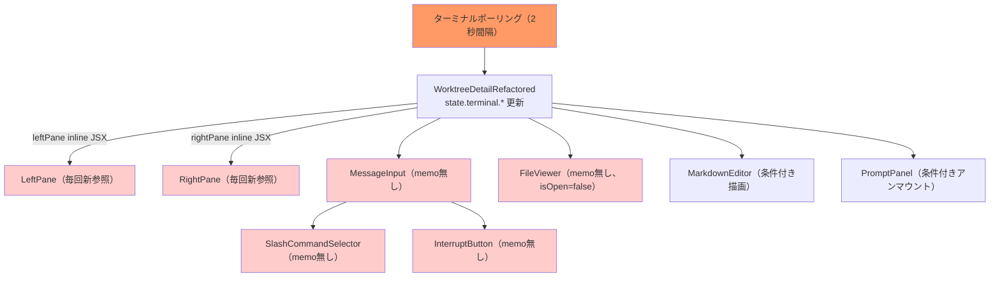
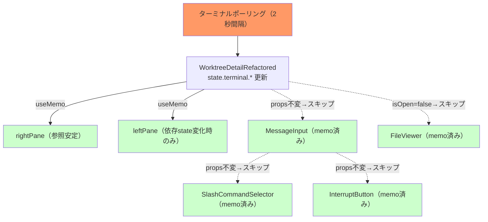

# 設計方針書: Issue #411 - Reactコンポーネントのmemo化・useCallback最適化

## 1. 概要

### 目的
未memo化の主要コンポーネントにReact.memo/useCallbackを適用し、ターミナルポーリング（2秒間隔）による不要な再レンダーを防止する。

### スコープ
- 対象: 8ファイル（コンポーネントmemo化 + inline JSX抽出）
- 非対象: ビジネスロジック変更、API変更、DB変更

### 設計原則
- **KISS**: 最小限のmemo化で最大の効果を得る。カスタム比較関数は不要
- **DRY**: named export形式（`export const X = memo(function X(...))`）を全コンポーネントで統一
- **既存パターン踏襲**: プロジェクト内の既存memo化パターン（HistoryPane, TerminalDisplay等）に準拠

## 2. アーキテクチャ設計

### 再レンダーの発生経路



### memo化後の再レンダー経路



## 3. 設計パターン

### D1: コンポーネントmemo化パターン

全コンポーネントで統一するnamed export形式:

```typescript
// Before
export function ComponentName({ prop1, prop2 }: Props) {
  // ...
}

// After
export const ComponentName = memo(function ComponentName({ prop1, prop2 }: Props) {
  // ...
});
```

**選定理由**:
- export名が維持されるため、既存のimport/vi.mockとの互換性が保たれる
- React DevToolsでコンポーネント名が表示される（function nameが保持される）
- displayNameの明示設定が不要

### D2: useCallback適用パターン

```typescript
// ref経由のアクセスは依存配列不要（安定参照）
const handleCompositionStart = useCallback(() => {
  setIsComposing(true); // useStateセッターは安定参照
  justFinishedComposingRef.current = false; // ref経由
  if (compositionTimeoutRef.current) {
    clearTimeout(compositionTimeoutRef.current); // ref経由
  }
}, []); // 空配列で十分

// state値を読み取るハンドラは依存配列に含める
const handleKeyDown = useCallback((e: React.KeyboardEvent<HTMLTextAreaElement>) => {
  if (e.key === 'Escape' && showCommandSelector) {
    // showCommandSelectorを読み取るため依存配列に必要
  }
}, [showCommandSelector, isComposing, isFreeInputMode, isMobile, submitMessage]);
```

### D3: inline JSX抽出パターン（useMemo方式）

```typescript
// rightPane: props数が少ない（6個）のでuseMemo方式
const rightPaneMemo = useMemo(
  () => (
    <TerminalDisplay
      output={state.terminal.output}
      isActive={state.terminal.isActive}
      isThinking={state.terminal.isThinking}
      autoScroll={state.terminal.autoScroll}
      onScrollChange={handleAutoScrollChange}
      disableAutoFollow={disableAutoFollow}
    />
  ),
  [
    state.terminal.output,
    state.terminal.isActive,
    state.terminal.isThinking,
    state.terminal.autoScroll,
    handleAutoScrollChange,
    disableAutoFollow,
  ]
);
```

### D4: inline JSX抽出パターン（leftPane - useMemo方式採用）

**設計判断**: leftPaneもuseMemo方式を採用する。

**根拠**:
- コンポーネント抽出方式ではprops数が20個超になり、shallow comparison負荷とprops drilling複雑性が増大
- MobileContent（L824）が29個のpropsで同様の問題を抱えている前例がある
- fileSearchオブジェクトの参照安定性問題（useFileSearchの戻り値が毎レンダーで新オブジェクト）がmemoを無効化するリスク
- useMemo方式なら依存配列で明示的に制御でき、不要な再計算を防げる

```typescript
const leftPaneMemo = useMemo(
  () => (
    <div className="h-full flex flex-col">
      <LeftPaneTabSwitcher activeTab={leftPaneTab} onTabChange={handleLeftPaneTabChange} />
      <div className="flex-1 min-h-0 overflow-hidden">
        {leftPaneTab === 'history' && (
          <HistoryPane messages={state.messages} worktreeId={worktreeId} onFilePathClick={handleFilePathClick} className="h-full" showToast={showToast} />
        )}
        {leftPaneTab === 'files' && (
          <ErrorBoundary componentName="FileTreeView">
            {/* ... SearchBar + FileTreeView ... */}
          </ErrorBoundary>
        )}
        {leftPaneTab === 'memo' && (
          <ErrorBoundary componentName="NotesAndLogsPane">
            {/* ... NotesAndLogsPane ... */}
          </ErrorBoundary>
        )}
      </div>
    </div>
  ),
  [
    leftPaneTab, handleLeftPaneTabChange,
    state.messages, worktreeId, handleFilePathClick, showToast,
    fileSearch.query, fileSearch.mode, fileSearch.isSearching, fileSearch.error,
    fileSearch.setQuery, fileSearch.setMode, fileSearch.clearSearch,
    fileSearch.results?.results,
    handleFileSelect, handleNewFile, handleNewDirectory, handleRename,
    handleDelete, handleUpload, handleMove, handleCmateSetup, fileTreeRefresh,
    selectedAgents, handleSelectedAgentsChange,
    vibeLocalModel, handleVibeLocalModelChange,
    vibeLocalContextWindow, handleVibeLocalContextWindowChange,
  ]
);
```

**注意**: 依存配列が大きいが、大半のハンドラはuseCallback済みで安定参照。fileSearch.setQuery/setMode/clearSearchもuseCallback済み。主な再計算トリガーはstate.messages、fileSearch.results、leftPaneTabの変化。

**[R1-002] 依存配列（27項目）の安定性根拠一覧**:

eslint-plugin-react-hooksの`exhaustive-deps`ルールで依存配列の網羅性を検証すること。

| 依存項目 | 安定性種別 | 根拠 |
|---------|-----------|------|
| `leftPaneTab` | state値 | タブ切替時のみ変化（ポーリングでは不変） |
| `handleLeftPaneTabChange` | useCallback | **[R2-003]** 依存配列: `[actions]`。actionsはuseReducerのdispatchでありReact保証により安定参照。実質的に空依存配列と同等の安定性 |
| `state.messages` | state値 | メッセージ取得時に変化（主要再計算トリガー） |
| `worktreeId` | props/URLパラメータ | 同一画面表示中は不変 |
| `handleFilePathClick` | useCallback | 安定参照の依存のみ |
| `showToast` | useCallback | 安定参照 |
| `fileSearch.query` | state値 | 検索入力時のみ変化 |
| `fileSearch.mode` | state値 | モード切替時のみ変化 |
| `fileSearch.isSearching` | state値 | 検索実行中のみ変化 |
| `fileSearch.error` | state値 | エラー発生時のみ変化 |
| `fileSearch.setQuery` | useCallback | useFileSearch内で定義済み（安定） |
| `fileSearch.setMode` | useCallback | useFileSearch内で定義済み（安定） |
| `fileSearch.clearSearch` | useCallback | useFileSearch内で定義済み（安定） |
| `fileSearch.results?.results` | state値/undefined | 検索結果変化時に再計算。**nullからオブジェクトへの遷移で参照変化するが、これは意図した再計算トリガーである** |
| `handleFileSelect` | useCallback | 安定参照の依存のみ |
| `handleNewFile` | useCallback | 安定参照の依存のみ |
| `handleNewDirectory` | useCallback | 安定参照の依存のみ |
| `handleRename` | useCallback | 安定参照の依存のみ |
| `handleDelete` | useCallback (editorFilePath依存) | **[R2-002]** 依存配列: `[worktreeId, editorFilePath, tCommon, tError]`。editorFilePathはMarkdownEditor開閉時に変化するstate値のため、エディタ開閉時にhandleDelete参照が変化しleftPaneMemoが再計算される。worktreeId/tCommon/tErrorは安定参照。ポーリングサイクルでは不変 |
| `handleUpload` | useCallback | 安定参照の依存のみ |
| `handleMove` | useCallback | 安定参照の依存のみ |
| `handleCmateSetup` | useCallback | 安定参照の依存のみ |
| `fileTreeRefresh` | state値/counter | ツリーリフレッシュ時のみ変化 |
| `selectedAgents` | state値 | エージェント設定変更時のみ変化 |
| `handleSelectedAgentsChange` | useCallback | 安定参照の依存のみ |
| `vibeLocalModel` | state値 | モデル変更時のみ変化 |
| `handleVibeLocalModelChange` | useCallback | 安定参照の依存のみ |
| `vibeLocalContextWindow` | state値 | コンテキストウィンドウ変更時のみ変化 |
| `handleVibeLocalContextWindowChange` | useCallback | 安定参照の依存のみ |

**ポーリングサイクル（2秒間隔）での安定性**: 上記27項目のうち、ポーリングによるstate.terminal.*更新で参照が変化する項目は**0件**。state.messagesはfetchMessagesの呼び出しで変化し得るが、ポーリング（capturePane）とは独立したタイミングで更新される。したがって、leftPaneMemoはポーリングサイクルでは再計算されず、useMemoの最適化効果が有効に機能する。

**実装時の検証**: `eslint-plugin-react-hooks`の`exhaustive-deps`ルールを有効にし、依存配列の不足・過剰を静的に検出すること。CIでのlintチェックで自動検証される。

## 4. コンポーネント別設計

### 4.1 MessageInput（優先度: 高）

| 項目 | 内容 |
|------|------|
| **変更内容** | memo() ラップ + 9個のハンドラuseCallback化 |
| **Props** | worktreeId, onMessageSent?, cliToolId?, isSessionRunning? |
| **カスタム比較関数** | 不要（全propsがプリミティブまたはuseCallback済み関数） |

**ハンドラ別useCallback設計**:

| ハンドラ | 依存配列 | 効果 | 備考 |
|---------|---------|------|------|
| handleCompositionStart | `[]` | 高 | ref経由のみ、setIsComposingは安定 |
| handleCompositionEnd | `[]` | 高 | ref経由のみ、setIsComposingは安定 |
| handleCommandSelect | `[]` | 高 | setMessage/setShowCommandSelectorは安定 |
| handleCommandCancel | `[]` | 高 | setShowCommandSelector/setIsFreeInputModeは安定 |
| handleFreeInput | `[]` | 高 | setterのみ使用。[R1-001] setTimeout内のtextareaRef.current?.focus()はRefオブジェクト（安定参照）のため空依存配列で安全。詳細は下記補足参照 |
| handleMessageChange | `[isFreeInputMode]` | 中 | isFreeInputMode読み取り |
| submitMessage | `[isComposing, message, sending, worktreeId, cliToolId, onMessageSent]` | 低 | 多数のstate/props依存。[R1-008] onMessageSentの安定性チェーンは下記補足参照 |
| handleSubmit | `[submitMessage]` | 低 | submitMessage依存 |
| handleKeyDown | `[showCommandSelector, isFreeInputMode, isComposing, isMobile, submitMessage]` | 中 | 複数state読み取り |

**[R1-001] handleFreeInputのuseCallback空依存配列の安全性根拠**:

handleFreeInputの実装では、setTimeout内で`textareaRef.current?.focus()`を呼び出している。useCallback化で依存配列を`[]`とした場合の安全性について以下の通り:

- `textareaRef`はuseRef()の戻り値であり、コンポーネントのライフサイクルを通じて**同一のRefオブジェクト参照**が維持される（React公式仕様）
- Refオブジェクト自体は安定参照であるため、`.current`プロパティへのアクセスは常に最新のDOM要素を指す
- `setShowCommandSelector`、`setIsFreeInputMode`、`setMessage`はuseStateのセッター関数であり、Reactが安定参照を保証する
- したがって、空依存配列`[]`でuseCallbackを適用しても動作上の問題は発生しない

**[R1-008] submitMessageの依存配列 - props参照安定性チェーン**:

submitMessageの依存配列に含まれる`onMessageSent`の参照安定性チェーン:

| 参照チェーン | 定義元 | useCallback依存配列 | 安定性 |
|------------|--------|-------------------|--------|
| `onMessageSent` (MessageInput props) | WorktreeDetailRefactored: `handleMessageSent` | `[fetchMessages, fetchCurrentOutput]` | fetchMessages/fetchCurrentOutputに依存 |
| `fetchMessages` | WorktreeDetailRefactored内 useCallback | `[worktreeId, actions]` | worktreeIdが変化しない限り安定 |
| `fetchCurrentOutput` | WorktreeDetailRefactored内 useCallback | `[worktreeId, actions, state.prompt.visible]` | worktreeIdが変化しない限り安定。**[R2-001]** state.prompt.visible変化時（プロンプト表示/非表示遷移）にfetchCurrentOutputが再生成される |
| `actions` | useReducer dispatch | (安定参照) | React保証により常に安定 |

結論: `worktreeId`はURLパラメータに基づく値であり、同一Worktree詳細画面の表示中は不変。したがって`onMessageSent`はポーリングサイクルで参照が変化しないため、submitMessageのuseCallback依存配列に含めても不要な再生成は発生しない。

**[R2-001] state.prompt.visible変化時のカスケード影響**:

fetchCurrentOutputの依存配列には`state.prompt.visible`が含まれるため、プロンプト表示/非表示の遷移時に以下のカスケード再生成が発生する:

1. `state.prompt.visible`変化 -> `fetchCurrentOutput`再生成
2. `fetchCurrentOutput`再生成 -> `handleMessageSent`再生成
3. `handleMessageSent`再生成 -> MessageInputの`onMessageSent` props変化 -> memo化無効化（再レンダー発生）

この再生成はプロンプト遷移時（ユーザー操作起点、低頻度）に限定されるため、2秒間隔のポーリングサイクルでの最適化効果には影響しない。ポーリングでは`state.prompt.visible`は変化しないため、ポーリング起点でのmemo化スキップは正常に機能する。

### 4.2 SlashCommandSelector（優先度: 中）

| 項目 | 内容 |
|------|------|
| **変更内容** | memo() ラップ |
| **Props** | isOpen, groups, onSelect, onClose, isMobile?, position?, onFreeInput? |
| **カスタム比較関数** | 不要 |
| **備考** | 既にuseCallback 2個、useMemo 2個使用済み |

### 4.3 InterruptButton（優先度: 高）

| 項目 | 内容 |
|------|------|
| **変更内容** | memo() ラップ |
| **Props** | worktreeId, cliToolId, disabled?, onInterrupt? |
| **カスタム比較関数** | 不要 |
| **備考** | 既にuseCallback 1個使用済み。propsが単純で効果が高い |

### 4.4 PromptPanel（優先度: 中）

| 項目 | 内容 |
|------|------|
| **変更内容** | memo() ラップ |
| **Props** | promptData, messageId, visible, answering, onRespond, onDismiss?, cliToolName? |
| **カスタム比較関数** | 不要（handlePromptRespond/handlePromptDismissはuseCallback済み） |
| **備考** | デスクトップではvisible=false時にアンマウントされるため、効果はプロンプト表示中のポーリング再レンダースキップに限定 |

**[R3-003] handlePromptRespondのカスケード影響チェーン**:

handlePromptRespond（L1233-1258）の依存配列は`[worktreeId, actions, fetchCurrentOutput, activeCliTab, state.prompt.data]`である。`state.prompt.data`はプロンプト検出時にactionsから更新されるオブジェクトであり、プロンプト遷移時に参照が変化する。以下のカスケードが発生する:

1. `state.prompt.data`変化 -> `handlePromptRespond`再生成
2. `handlePromptRespond`再生成 -> PromptPanelの`onRespond` props変化 -> memo無効化（再レンダー発生）
3. `handlePromptRespond`再生成 -> MobilePromptSheetの`onRespond` props変化 -> memo無効化（再レンダー発生）

**ポーリングサイクルでの影響**: なし。`state.prompt.data`はポーリング（capturePane）ではなくプロンプト遷移時（ユーザー操作起点、低頻度）にのみ変化するため、2秒間隔のポーリングサイクルでのmemo化スキップは正常に機能する。プロンプト遷移時の再レンダーは意図した動作であり、新しいプロンプトデータを表示するために必要なレンダーである。

### 4.5 MobilePromptSheet（優先度: 中）

| 項目 | 内容 |
|------|------|
| **変更内容** | memo() ラップ |
| **Props** | promptData, visible, answering, onRespond, onDismiss?, cliToolName? |
| **カスタム比較関数** | 不要（handlePromptRespond/handlePromptDismissはuseCallback済み） |
| **備考** | **[R2-007]** `autoYesEnabled=false`時にマウントされ、`visible=false`時のprops不変スキップ効果がある。`autoYesEnabled=true`時は完全にアンマウントされるためmemo化効果はない。**[R3-003]** handlePromptRespondのカスケード影響はSection 4.4の分析を参照 |

### 4.6 MarkdownEditor（優先度: 低）

| 項目 | 内容 |
|------|------|
| **変更内容** | memo() ラップ |
| **Props** | worktreeId, filePath, onClose?, onSave?, initialViewMode?, onMaximizedChange? |
| **カスタム比較関数** | 不要 |
| **備考** | 条件付き描画のため効果限定的。既に内部でuseCallback 21個使用済み |

### 4.7 FileViewer（優先度: 高）

| 項目 | 内容 |
|------|------|
| **変更内容** | memo() ラップ |
| **Props** | isOpen, onClose, worktreeId, filePath |
| **カスタム比較関数** | 不要（onCloseはhandleFileViewerCloseでuseCallback済み） |
| **備考** | isOpen=false時の再レンダースキップが主要効果。2箇所（L2054, L2293）から描画。[R1-004] memo化有効性根拠は下記参照 |

**[R1-004] FileViewerのmemo化有効性の分析根拠**:

FileViewerに渡される各propsのshallow comparison安定性:

| props | 渡される値 | shallow comparison | 安定性根拠 |
|-------|-----------|-------------------|-----------|
| `isOpen` | `!!fileViewerPath` | プリミティブ(boolean) | 同一値なら`===`でtrue |
| `filePath` | `fileViewerPath ?? ''` | プリミティブ(string) | `''`は毎回新リテラルだがプリミティブ値のため`===`で同一判定される。`fileViewerPath`がnullの間は常に`'' === ''`でtrue |
| `worktreeId` | `worktreeId` | プリミティブ(string) | URLパラメータ由来、同一画面では不変 |
| `onClose` | `handleFileViewerClose` | 関数参照 | useCallback(`[]`)で定義済み。空依存配列のため初回レンダー以降参照不変 |

結論: 4つのprops全てがポーリングサイクルで参照安定であるため、`React.memo()`のshallow comparisonにより`isOpen=false`の状態でFileViewerの再レンダーは確実にスキップされる。

### 4.8 WorktreeDetailRefactored（inline JSX抽出）

| 項目 | 内容 |
|------|------|
| **変更内容** | leftPane/rightPaneをuseMemoで包む |
| **方式** | useMemo方式（D3/D4パターン） |
| **備考** | fileSearchの個別プロパティを依存配列に展開し、オブジェクト参照問題を回避 |

**[R3-002] スコープ外の既知問題: MobileContentのfileSearch props参照不安定性**:

MobileContent（L824、既にmemo済み）はuseFileSearch()の戻り値オブジェクトを`fileSearch={fileSearch}`として直接受け取っている（L2245）。useFileSearch()はreturn文で毎レンダー新しいオブジェクトリテラルを返す（useFileSearch.ts L243-254）ため、MobileContentのmemoは毎回無効化される。

本Issue(#411)のleftPaneMemoではfileSearchの個別プロパティ（query, mode, isSearching, error, setQuery, setMode, clearSearch, results?.results）を依存配列に展開することで参照問題を回避しているが、MobileContentに渡されるfileSearchオブジェクト全体の参照不安定性については対応していない。

**修正案**（本Issueスコープ外、将来対応候補）:
- **(A)** useFileSearchの戻り値をuseMemoで安定化する（戻り値オブジェクトをメモ化し、内部のstate値が変化しない限り同一参照を返す）
- **(B)** MobileContentのprops型からfileSearchオブジェクトを除去し、個別プロパティ（query, mode, isSearching, error, setQuery, setMode, clearSearch, results）として渡す

**スコープ判断**: MobileContentは既にmemo済みであり本Issue(#411)の対象外コンポーネントである。モバイル表示時のポーリング最適化に影響するが、MobileContent自体のprops型変更は影響範囲が広いため、別Issueでの対応が適切である

## 5. テスト戦略

### 設計方針
- **既存テストの動作保証**: memo化はexport名を維持するため、既存テストは修正なしで動作する想定
- **新規テスト不要**: memo化はReactの内部最適化であり、機能的な変更はないため新規テスト不要
- **動作確認**: 全6テストファイルでmemo化後のrender/mock整合性を確認

### 確認対象テストファイル

| テストファイル | 確認内容 |
|--------------|---------|
| `tests/unit/components/WorktreeDetailRefactored.test.tsx` | vi.mockがmemo化コンポーネントを正しくモック化できること |
| `tests/unit/components/worktree/MessageInput.test.tsx` | memo化後のrender確認。IME compositionテスト5ケースの動作確認 |
| `tests/unit/components/worktree/SlashCommandSelector.test.tsx` | memo化後のrender確認 |
| `tests/unit/components/worktree/MarkdownEditor.test.tsx` | memo化後のrender確認 |
| `tests/unit/components/PromptPanel.test.tsx` | memo化後のrender確認 |
| `tests/unit/components/mobile/MobilePromptSheet.test.tsx` | memo化後のrender確認 |
| `tests/integration/issue-266-acceptance.test.tsx` | **[R3-001]** MessageInput/FileViewer/PromptPanel/MobilePromptSheetをvi.mockでモック。vi.mockはモジュール全体を置換するためmemo化の影響なし。mount/unmount回数カウント（messageInputMountCount変数）はモック対象のため動作に影響なし |
| `tests/unit/components/app-version-display.test.tsx` | **[R3-001]** FileViewer/PromptPanel/MobilePromptSheetをvi.mockでモック。vi.mockはモジュール全体を置換するためmemo化の影響なし |

## 6. セキュリティ設計

本Issueはパフォーマンス最適化のみであり、セキュリティに関する変更はない。

- 入力バリデーション: 変更なし
- XSS対策: 変更なし（memo化はReact内部最適化）
- 認証/認可: 影響なし

## 7. パフォーマンス設計

### 期待される効果

| シナリオ | Before | After |
|---------|--------|-------|
| ポーリング更新時のFileViewer（isOpen=false） | 毎回再レンダー | スキップ |
| ポーリング更新時のMessageInput（props不変） | 毎回再レンダー | スキップ |
| ポーリング更新時のSlashCommandSelector | 毎回再レンダー | スキップ |
| ポーリング更新時のInterruptButton | 毎回再レンダー | スキップ |
| leftPane/rightPaneのインラインJSX | 毎回新オブジェクト生成 | useMemoで参照安定 |

### memo化のオーバーヘッド
- shallow comparison: 各コンポーネントのprops数に比例（最大8項目程度）
- 2秒間隔のポーリングに対して、shallow comparisonのコスト（数マイクロ秒）は無視できる

## 8. 実装順序

依存関係に基づく推奨実装順序:

1. **FileViewer** → 最も単純で効果が高い。動作確認の基準になる
2. **InterruptButton** → props単純、MessageInputの前提
3. **SlashCommandSelector** → MessageInputの前提
4. **MessageInput** → useCallback化 + memo化。子コンポーネントのmemo化が前提
5. **PromptPanel** → 独立して実装可能
6. **MobilePromptSheet** → PromptPanelと類似パターン
7. **MarkdownEditor** → 優先度低、最後に実装
8. **WorktreeDetailRefactored** → leftPane/rightPaneのuseMemo化。全コンポーネントのmemo化後に実施

## 9. 設計上の決定事項とトレードオフ

| 決定事項 | 選択 | 代替案 | トレードオフ |
|---------|------|--------|------------|
| export形式 | `export const X = memo(function X(...))` | `export default memo(X)` | named export互換性のため |
| leftPane抽出方式 | useMemo方式 | コンポーネント抽出方式 | props drilling回避 vs 依存配列の大きさ |
| rightPane抽出方式 | useMemo方式 | コンポーネント抽出方式 | props少（6個）のためuseMemoが最適 |
| カスタム比較関数 | 全て不要 | FileViewerにareEqual追加 | 呼び出し元のuseCallbackで十分 |
| 新規テスト | 不要 | memo化テスト追加 | 機能変更なし、既存テストで十分 |

## 10. 制約条件

- **CLAUDE.md準拠**: SOLID/KISS/YAGNI/DRY原則
- **既存テスト互換**: memo化後も全既存テストがパスすること
- **Server Components非影響**: 全対象は`'use client'`コンポーネント
- **forwardRef非使用**: 全対象コンポーネントでforwardRef未使用のため考慮不要

## 11. レビュー履歴

| Stage | レビュー種別 | 日付 | ステータス | スコア |
|-------|------------|------|-----------|--------|
| Stage 1 | 通常レビュー（設計原則） | 2026-03-03 | conditionally_approved | 4/5 |
| Stage 2 | 整合性レビュー | 2026-03-03 | conditionally_approved | 4/5 |
| Stage 3 | 影響分析レビュー | 2026-03-03 | conditionally_approved | 4/5 |
| Stage 4 | セキュリティレビュー | 2026-03-03 | approved | 5/5 |

## 12. レビュー指摘事項サマリー

### Stage 1: 通常レビュー（2026-03-03）

| ID | 重要度 | カテゴリ | タイトル | 対応状況 |
|----|--------|---------|---------|---------|
| R1-001 | should_fix | react_best_practice | handleFreeInputのuseCallback化でsetTimeoutのRefキャプチャ安全性 | 反映済み（Section 4.1） |
| R1-002 | should_fix | kiss | leftPaneのuseMemo依存配列（27項目）の安定性根拠 | 反映済み（Section D4） |
| R1-003 | nice_to_have | dry | PromptPanel/MobilePromptSheetの内部コンテンツ共通化 | 記録のみ（スコープ外） |
| R1-004 | should_fix | react_best_practice | FileViewerのmemo化効果分析の補完 | 反映済み（Section 4.7） |
| R1-005 | nice_to_have | architecture | MobilePromptSheetのマウント条件の記載精度 | 記録のみ |
| R1-006 | nice_to_have | solid | MessageInput内部フックのmemo化効果への影響 | 記録のみ |
| R1-007 | nice_to_have | yagni | MarkdownEditorのmemo化の費用対効果 | 記録のみ |
| R1-008 | should_fix | react_best_practice | submitMessageのonMessageSent参照安定性チェーン | 反映済み（Section 4.1） |

### Stage 2: 整合性レビュー（2026-03-03）

| ID | 重要度 | カテゴリ | タイトル | 対応状況 |
|----|--------|---------|---------|---------|
| R2-001 | should_fix | consistency | fetchCurrentOutputの依存配列にstate.prompt.visibleが未記載 | 反映済み（Section 4.1 [R1-008]） |
| R2-002 | should_fix | consistency | D4テーブルのhandleDeleteが安定参照と記載されているがeditorFilePathに依存 | 反映済み（Section D4） |
| R2-003 | should_fix | consistency | D4テーブルのhandleLeftPaneTabChangeが空依存配列と記載されているが実際は[actions] | 反映済み（Section D4） |
| R2-004 | nice_to_have | correctness | FileViewerのisOpen propsの表記が実装と微妙に異なる | 記録のみ |
| R2-005 | nice_to_have | consistency | D4テーブルの複数ハンドラの依存配列が実際より簡略化されている | 記録のみ |
| R2-006 | nice_to_have | completeness | disableAutoFollowのuseMemo依存配列における安定性注記の不足 | 記録のみ |
| R2-007 | should_fix | consistency | MobilePromptSheetのmount条件が設計書と実装で不一致 | 反映済み（Section 4.5） |
| R2-008 | nice_to_have | completeness | 実装チェックリストにD4テーブル修正反映の検証項目がない | 記録のみ |

### Stage 3: 影響分析レビュー（2026-03-03）

| ID | 重要度 | カテゴリ | タイトル | 対応状況 |
|----|--------|---------|---------|---------|
| R3-001 | should_fix | test | integration test (issue-266-acceptance.test.tsx) が影響範囲として未記載 | 反映済み（Section 5） |
| R3-002 | should_fix | performance | MobileContentコンポーネントのfileSearch props参照不安定性の設計書での未対応 | 反映済み（Section 4.8） |
| R3-003 | should_fix | maintenance | handlePromptRespondのカスケード影響分析が不足 | 反映済み（Section 4.4, 4.5） |
| R3-004 | nice_to_have | performance | handleAutoYesToggleの依存配列にactiveCliTabが含まれ、タブ切替時に再生成される | 記録のみ |
| R3-005 | nice_to_have | type | MemoExoticComponentへの型変換による外部参照への影響 | 記録のみ |
| R3-006 | nice_to_have | test | React Strict Modeでのdouble renderとmemo化のテスト確認が未記載 | 記録のみ |
| R3-007 | nice_to_have | maintenance | leftPaneMemoの依存配列27項目の将来的なメンテナンスリスク | 記録のみ |
| R3-008 | nice_to_have | performance | SSR/RSC環境への影響が明記されているが確認根拠の補強余地あり | 記録のみ |

### Stage 4: セキュリティレビュー（2026-03-03）

| ID | 重要度 | カテゴリ | タイトル | 対応状況 |
|----|--------|---------|---------|---------|
| R4-001 | nice_to_have | xss | dangerouslySetInnerHTML使用コンポーネントはmemo化対象外であることの確認 | 記録のみ（対応不要） |
| R4-002 | nice_to_have | closure | useCallbackクロージャにおける機密データキャプチャの不在確認 | 記録のみ（対応不要） |
| R4-003 | nice_to_have | csrf | MessageInput handleSubmitのCSRF保護状況（既存設計の確認） | 記録のみ（対応不要） |

**セキュリティレビュー総評**: must_fix 0件、should_fix 0件。OWASP Top 10全項目を検証し、本Issueによるセキュリティリスクの導入は確認されなかった。スコア5/5で承認。

### nice_to_have項目の記録

以下はnice_to_have（将来検討）として記録する項目:

- **R1-003**: PromptPanelとMobilePromptSheetの内部コンテンツコンポーネント（PromptPanelContent/PromptContent）の共通化は本Issue(#411)のスコープ外。将来のリファクタリング候補として記録する。memo化自体は現設計のまま進めて問題ない
- **R1-005**: MobilePromptSheetの「visibleに関係なくマウントされる」記載は簡略化であり、厳密にはautoYesEnabled=false時にマウントされるがpromptData=null時は内部でnullを返す。memo化の効果はpromptDataが存在しvisible=falseの場合に限定される。**R2-007で本文記述を修正済み**
- **R1-006**: MessageInput内部のuseSlashCommands/useIsMobileフックはポーリングサイクルでは状態変化しないため、memo化は有効に機能する。内部フックの状態変化はmemo()では制御できない点に留意
- **R1-007**: MarkdownEditorはeditorFilePath条件で完全にアンマウントされるため、エディタ非表示中のmemo化効果はゼロ。YAGNI原則に基づきスコープから除外する選択肢も検討に値する
- **R2-004**: FileViewerのisOpenに渡される値は設計書で`!!fileViewerPath`と記載しているが、実装では`fileViewerPath !== null`を使用。fileViewerPathはstring | nullのため動作は同等だが、正確性のために実装と一致させることが望ましい
- **R2-005**: D4テーブルのhandleNewFile/handleNewDirectory/handleRename/handleCmateSetupの安定性種別は「安定参照の依存のみ」と記載しているが、実際の依存配列（例: handleNewFile: [worktreeId, tError]）を明記する方が正確。結論（安定参照）は正しいが詳細度を向上できる
- **R2-006**: rightPaneMemoの依存配列6項目について、ポーリング起点で変化する項目（state.terminal.*の4項目）とユーザー操作起点で変化する項目（handleAutoScrollChange, disableAutoFollow）を区別して注記すると安定性分析がより明確になる
- **R2-008**: 実装チェックリストに「D4テーブルの全依存配列エントリが実装コードのuseCallback依存配列と一致していることを確認」の検証項目を追加することが望ましい
- **R3-004**: handleAutoYesToggle（L1293-1314）の依存配列`[worktreeId, activeCliTab]`にactiveCliTabが含まれ、CLIタブ切替のたびに再生成される。AutoYesToggleは既にmemo済みのため、handleAutoYesToggleの参照変化でAutoYesToggleのmemo化が無効化される。activeCliTabRefパターン（fetchMessages/fetchCurrentOutputで使用実績あり）の適用を将来の最適化候補として記録する。ポーリング最適化というIssue #411の主目的には影響しないため対応不要
- **R3-005**: memo()でラップされたコンポーネントの型はReact.MemoExoticComponentに変化する。named export形式を使用するため、import { X } from '...'の型推論がReact.FunctionComponentからReact.MemoExoticComponentに変わるが、MemoExoticComponentはExoticComponentを拡張しておりJSXでの使用に支障はない。ComponentType<Props>等の型制約とも互換性がある。現在のコードベースでは該当する使用箇所は確認されない
- **R3-006**: React Strict Mode（開発環境）では関数コンポーネントが2回呼び出される。memo化コンポーネントでは1回目のレンダーでpropsを保存し、2回目のレンダーでshallow comparisonを行うため正常動作する。Vitestのjsdom環境ではStrictModeは自動有効化されないため、開発サーバーでの手動確認を推奨する
- **R3-007**: leftPaneMemoの依存配列27項目は将来の変更で追加漏れが発生しやすい。useMemo方式では依存配列の過不足がコンパイル時エラーにならない（ESLint警告のみ）。leftPaneのJSXに新しいprops/stateを追加する場合は必ずleftPaneMemoの依存配列も更新するコメントをコードに残すことを推奨する
- **R3-008**: WorktreeDetailRefactoredProps（worktreeId: string）はServer Component境界を越えるpropsとしてシリアライズ可能であり問題ない。memo化はClient Component内の最適化でありSC/CC境界のシリアライゼーションには影響しない
- **R4-001**: dangerouslySetInnerHTMLを使用するコンポーネント（TerminalDisplay、MermaidDiagram、LogViewer、MessageList）はいずれもmemo化対象8コンポーネントに含まれない。MarkdownEditorは対象に含まれるが、rehype-sanitize [SEC-MF-001]を使用しており、memo()ラップはサニタイズパイプラインに影響しない。将来のレビュアーへの参考情報として記録
- **R4-002**: MessageInputで新規useCallback化される9個のハンドラのクロージャがキャプチャする値を検査済み。認証トークン、パスワード、APIキー等の機密データはクロージャに含まれていない。将来のuseCallback追加時に、クロージャキャプチャ対象に機密データが含まれないことを確認するコーディング慣行を維持すること
- **R4-003**: MessageInputのhandleSubmitはe.preventDefault()でデフォルト送信を抑止し、fetch APIでPOSTリクエストを送信する。CSRFトークン機構は未実装だが、Same-Originポリシーに依拠。memo化はCSRF保護状況に影響しない。CSRFトークン導入はプロジェクト全体のセキュリティ方針として別途検討すべき事項であり、本Issueスコープ外

## 13. 実装チェックリスト

### レビュー指摘反映チェック

- [ ] [R1-001] handleFreeInputのuseCallback化時、setTimeout内のtextareaRef.current?.focus()がRefの安定参照により空依存配列で安全に動作することを実装コメントで明記
- [ ] [R1-002] leftPaneMemoの依存配列が27項目全て正しく網羅されていることをeslint-plugin-react-hooksのexhaustive-depsルールで検証
- [ ] [R1-002] fileSearch.results?.resultsのオプショナルチェーン参照がnullからオブジェクトへ遷移する際の再計算が意図した動作であることを確認
- [ ] [R1-004] FileViewerのmemo化後、isOpen=false時にshallow comparisonで再レンダーがスキップされることをReact DevToolsで確認
- [ ] [R1-008] submitMessageのuseCallback依存配列にonMessageSentを含め、WorktreeDetailRefactored側のhandleMessageSent -> fetchMessages/fetchCurrentOutput -> useCallback([worktreeId, actions, state.prompt.visible])の安定性チェーンが維持されていることを確認
- [ ] [R2-001] fetchCurrentOutputのuseCallback依存配列が`[worktreeId, actions, state.prompt.visible]`であり、プロンプト遷移時のカスケード再生成（fetchCurrentOutput -> handleMessageSent -> MessageInput onMessageSent）が意図した動作であることを確認
- [ ] [R2-002] handleDeleteのuseCallback依存配列が`[worktreeId, editorFilePath, tCommon, tError]`であり、editorFilePath変化時にleftPaneMemoが再計算されることを確認（ポーリングサイクルでは不変）
- [ ] [R2-003] handleLeftPaneTabChangeのuseCallback依存配列が`[actions]`であり、actionsがuseReducer dispatchの安定参照であることを確認
- [ ] [R2-007] MobilePromptSheetが`{!autoYesEnabled && ...}`の条件ガード内で描画されていることを確認し、autoYesEnabled=true時にアンマウントされることを検証
- [ ] [R3-001] memo化後に`tests/integration/issue-266-acceptance.test.tsx`が正常にパスすることを確認（vi.mockによるモジュール全体置換のため影響なしの想定）
- [ ] [R3-001] memo化後に`tests/unit/components/app-version-display.test.tsx`が正常にパスすることを確認（vi.mockによるモジュール全体置換のため影響なしの想定）
- [ ] [R3-003] handlePromptRespondの依存配列`[worktreeId, actions, fetchCurrentOutput, activeCliTab, state.prompt.data]`により、state.prompt.data変化時にPromptPanel/MobilePromptSheetのonRespond propsが変化しmemo化が無効化されることを確認（プロンプト遷移時の意図した動作）
- [ ] [R3-003] ポーリングサイクル（2秒間隔）ではstate.prompt.dataが変化しないため、PromptPanel/MobilePromptSheetのmemo化スキップが正常に機能することを確認
