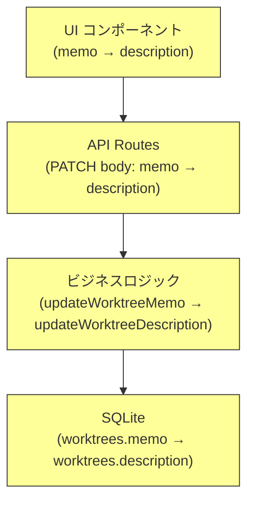
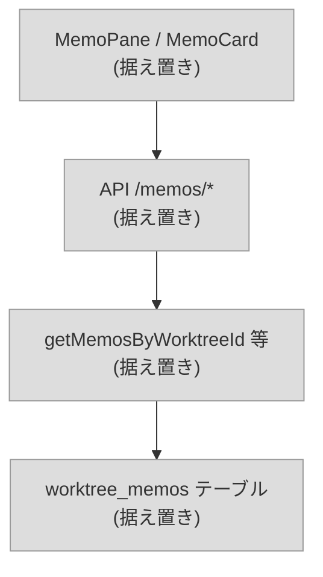
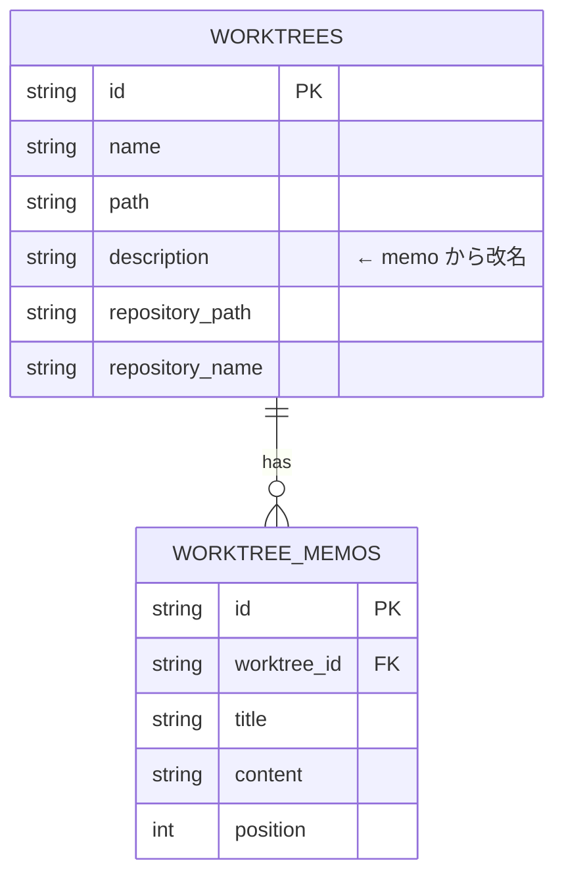

# Issue #44: メモ機能の命名変更 — 設計方針書

## 1. 概要

ブランチ管理用メモ(`worktrees.memo`)と作業支援用メモ(`worktree_memos`)が同じ「Memo」という名前を使用しており、ユーザーが区別できない問題を解決する。

**方針**: ブランチ管理用メモを `memo` → `description` に改名。作業支援用メモは据え置き。

---

## 2. アーキテクチャ設計

### 変更対象レイヤー



### 変更しないレイヤー



---

## 3. 技術選定

| カテゴリ | 選定技術 | 選定理由 |
|---------|---------|---------|
| DBマイグレーション | `ALTER TABLE RENAME COLUMN` | SQLite 3.25.0+ で対応。テーブル再作成不要 |
| マイグレーションバージョン | **v13** | 現在 v12（`add-external-apps-table`） |
| 変更方式 | 全レイヤー一括リネーム | 中途半端な対応は混乱を招く |

---

## 4. データモデル設計

### 変更前後の比較



### DBマイグレーション（v13）

```sql
ALTER TABLE worktrees RENAME COLUMN memo TO description;
```

**注意**: `db-migrations.ts` のv2/v10マイグレーション内で `memo` カラムを参照するSQL文は**変更しない**。マイグレーションは履歴として固定であり、v13適用後のDBでは既にカラム名が変わっているため、v2/v10は新規DBでのみ実行される。ただしv2で `memo` として作成してv13で `description` にリネームする流れになるため整合性は保たれる。

---

## 5. API設計

### 変更対象

| メソッド | エンドポイント | 変更内容 |
|---------|-------------|---------|
| PATCH | `/api/worktrees/:id` | リクエストボディ `{ memo: string }` → `{ description: string }` |

### レスポンス

`Worktree` オブジェクトの `memo` フィールドが `description` に変わる。

```typescript
// 変更前
interface Worktree {
  memo?: string;
  // ...
}

// 変更後
interface Worktree {
  description?: string;
  // ...
}
```

### 変更しないAPI

| メソッド | エンドポイント | 理由 |
|---------|-------------|------|
| GET/POST | `/api/worktrees/:id/memos` | 作業支援用メモ（据え置き） |
| PUT/DELETE | `/api/worktrees/:id/memos/:memoId` | 作業支援用メモ（据え置き） |

---

## 6. 変更ファイル一覧

### 6.1 DB層

| ファイル | 行 | 変更内容 |
|---------|-----|---------|
| `src/lib/db-migrations.ts:14` | `CURRENT_SCHEMA_VERSION = 12` → `13` |
| `src/lib/db-migrations.ts` | v13マイグレーション追加 |
| `src/lib/db.ts:186` | `w.memo` → `w.description` |
| `src/lib/db.ts:210` | 行型 `memo: string \| null` → `description: string \| null` |
| `src/lib/db.ts:236` | マッピング `memo: row.memo` → `description: row.description` |
| `src/lib/db.ts:294` | `w.memo` → `w.description` |
| `src/lib/db.ts:309` | 行型 `memo: string \| null` → `description: string \| null` |
| `src/lib/db.ts:332` | マッピング `memo: row.memo` → `description: row.description` |
| `src/lib/db.ts:359` | INSERT文 `memo` → `description` |
| `src/lib/db.ts:368` | UPSERT `memo = COALESCE(...)` → `description = COALESCE(...)` |
| `src/lib/db.ts:382` | パラメータ `worktree.memo` → `worktree.description` |
| `src/lib/db.ts:394-406` | 関数名 `updateWorktreeMemo` → `updateWorktreeDescription`、SQL内 `memo` → `description` |

### 6.2 型定義

| ファイル | 行 | 変更内容 |
|---------|-----|---------|
| `src/types/models.ts:21-22` | `memo?: string` → `description?: string`、JSDoc更新 |
| `src/types/sidebar.ts:36-37` | `memo?: string` → `description?: string`、JSDoc更新 |
| `src/types/sidebar.ts:125` | `memo: worktree.memo` → `description: worktree.description` |

### 6.3 API層

| ファイル | 行 | 変更内容 |
|---------|-----|---------|
| `src/app/api/worktrees/[id]/route.ts:9` | import `updateWorktreeMemo` → `updateWorktreeDescription` |
| `src/app/api/worktrees/[id]/route.ts:148-150` | `'memo' in body` → `'description' in body`、関数呼び出し変更 |
| `src/lib/api-client.ts:103-111` | `updateMemo` → `updateDescription`、body `{ memo }` → `{ description }` |

**確認済み**: `updateWorktreeMemo` を import しているファイルは `route.ts` のみ。

### 6.4 UIコンポーネント

#### `WorktreeCard.tsx`

| 行 | 変更内容 |
|----|---------|
| 31 | 分割代入 `memo` → `description` |
| 187-193 | ラベル "Memo" → "Description"、`{memo &&` → `{description &&`、`{memo}` → `{description}` |

#### `WorktreeDetail.tsx`

| 行 | 変更内容 |
|----|---------|
| 28 | タブ型 `'memo'` → `'description'` (`type TabView = 'claude' \| 'logs' \| 'info' \| 'description'`) |
| 48-49 | state `isEditingMemo` → `isEditingDescription`、`memoText` → `descriptionText` |
| 157 | `setMemoText(worktree.memo \|\| '')` → `setDescriptionText(worktree.description \|\| '')` |
| 239-249 | `handleSaveMemo` → `handleSaveDescription`、`worktreeApi.updateMemo` → `worktreeApi.updateDescription` |
| 253-257 | `handleCancelMemo` → `handleCancelDescription` |
| 681-688 | タブ `setActiveTab('memo')` → `setActiveTab('description')`、条件分岐変更 |
| 688 | タブラベル "Memo" → "Description" |
| 761 | `activeTab === 'memo'` → `activeTab === 'description'` |
| 767 | `<CardTitle>Memo</CardTitle>` → `<CardTitle>Description</CardTitle>` |
| 768-769 | `isEditingMemo` → `isEditingDescription` |
| 777-792 | `memoText` → `descriptionText`、handler名変更 |
| 796-799 | `worktree?.memo` → `worktree?.description`、"No memo added yet" → "No description added yet" |

#### `WorktreeDetailRefactored.tsx` — DesktopHeader

| 行 | 変更内容 |
|----|---------|
| 141 | props型 `memo?: string` → `description?: string` |
| 154 | 引数 `memo: worktreeMemo` → `description: worktreeDescription` |
| 161-165 | 変数名 `truncatedMemo`/`worktreeMemo` → `truncatedDescription`/`worktreeDescription` |
| 240-245 | `truncatedMemo` → `truncatedDescription`、title属性変更 |
| 1125 | `memo={worktree?.memo}` → `description={worktree?.description}` |

#### `WorktreeDetailRefactored.tsx` — InfoModal

| 行 | 変更内容 |
|----|---------|
| 297 | state `isEditingMemo` → `isEditingDescription` |
| 298 | state `memoText` → `descriptionText` |
| 311-312 | `setMemoText(worktree.memo \|\| '')` → `setDescriptionText(worktree.description \|\| '')` |
| 316-328 | `handleSaveMemo` → `handleSaveDescription`、`worktreeApi.updateMemo` → `worktreeApi.updateDescription` |
| 330-332 | `handleCancelMemo` → `handleCancelDescription`、`worktree?.memo` → `worktree?.description` |
| 376 | `<h2>Memo</h2>` → `<h2>Description</h2>` |
| 377-407 | `isEditingMemo` → `isEditingDescription`、`memoText` → `descriptionText`、handler名変更 |
| 417-420 | `worktree.memo` → `worktree.description`、"No memo added yet" → "No description added yet" |

#### `WorktreeDetailRefactored.tsx` — MobileInfoContent

| 行 | 変更内容 |
|----|---------|
| 537 | state `isEditingMemo` → `isEditingDescription` |
| 538 | state `memoText` → `descriptionText` |
| 550-551 | `worktree.memo` → `worktree.description`、`setMemoText` → `setDescriptionText` |
| 555-567 | `handleSaveMemo` → `handleSaveDescription`、`worktreeApi.updateMemo` → `worktreeApi.updateDescription` |
| 569-571 | `handleCancelMemo` → `handleCancelDescription`、`worktree?.memo` → `worktree?.description` |
| 620 | `<h2>Memo</h2>` → `<h2>Description</h2>` |
| 621-651 | `isEditingMemo` → `isEditingDescription`、`memoText` → `descriptionText`、handler名変更 |
| 661-664 | `worktree.memo` → `worktree.description`、"No memo added yet" → "No description added yet" |

#### `BranchListItem.tsx`

| 行 | 変更内容 |
|----|---------|
| 86-96 | `branch.memo` → `branch.description` |

### 6.5 テスト

| ファイル | 変更内容 |
|---------|---------|
| `src/lib/__tests__/db-memo.test.ts` | ブランチ管理用メモ関連のテスト修正（関数名・フィールド名） |
| `tests/integration/api/memos.test.ts` | PATCH APIテスト修正（リクエストボディ・アサーション） |

**確認済み**: `tests/unit/components/sidebar/BranchListItem.test.tsx` にはmemo参照なし。`WorktreeCard.test.tsx` は存在しない。追加のテスト修正は不要。

---

## 7. 設計上の決定事項とトレードオフ

### 採用した設計

| 決定事項 | 理由 | トレードオフ |
|---------|------|-------------|
| ブランチ管理用のみ改名 | 変更箇所が少なくリスク低 | 将来的に作業支援用も改名したくなる可能性 |
| `description` を採用 | ブランチの説明文として意味的に正確 | `summary` や `note` 等の候補を棄却 |
| `ALTER TABLE RENAME COLUMN` | テーブル再作成不要で安全 | SQLite 3.25.0未満では非対応（実用上問題なし） |
| 既存マイグレーション(v2/v10)は変更しない | マイグレーション履歴の不変性を維持 | 新規DB作成時にv2で`memo`作成→v13で`description`にリネームの2段階になる |
| タブID `'memo'` → `'description'` に変更 | 内部名とUI表示名を一致させる | `WorktreeDetail.tsx` のタブ型定義も変更が必要 |

### 棄却した代替案

| 代替案 | 棄却理由 |
|--------|---------|
| 案B: 両方改名 | 作業支援用メモの変更箇所が大きく（コンポーネント名・APIパス・テスト6ファイル）、リスクが高い |
| 作業支援用メモのみ改名 | 「メモ」は作業支援用の方が意味的に近いため、据え置きが自然 |
| UI表示のみ変更（コード内部は据え置き） | 内部名称とUI表示名の乖離が長期的に混乱を招く |

---

## 8. 要注意ポイント

### 8.1 React `memo` 関数との名前衝突

`WorktreeDetailRefactored.tsx:19` で `import { ..., memo, ... } from 'react'` しており、React の `memo` 高階コンポーネントが多数使用されている（`DesktopHeader`, `InfoModal`, `MobileInfoContent`, `LoadingIndicator`, `ErrorDisplay`, `MobileContent`, `WorktreeDetailRefactored` 自身）。

**絶対に機械的な一括置換（`memo` → `description`）を行ってはならない。** 以下を厳守すること:

- `worktree.memo` / `worktreeMemo` / `memoText` / `isEditingMemo` 等のブランチ管理用メモ関連のみ変更
- React の `memo()` 関数呼び出し、`import { memo }` は一切変更しない
- `MemoPane` / `MemoCard` / `MemoAddButton` の import・使用箇所は一切変更しない（作業支援用メモ）

### 8.2 両機能が混在するファイル

以下のファイルでは `description`（ブランチ管理用）と `memo/Memo`（作業支援用）が共存するため、誤って作業支援用まで改名しないよう注意が必要。

| ファイル | 注意点 |
|---------|--------|
| `src/types/models.ts` | `Worktree.description`(22行) と `WorktreeMemo`(183行) が同居。`WorktreeMemo` は変更しない |
| `src/components/worktree/WorktreeDetailRefactored.tsx` | `description` プロパティ、React `memo()`、`MemoPane` importが混在。8.1の規則を厳守 |
| `src/lib/db-migrations.ts` | v10の移行処理(443-458行)で旧 `memo` カラムを参照。既存マイグレーションは変更しない |
| `src/components/worktree/WorktreeDetail.tsx` | タブID `'memo'` → `'description'` に変更。`React.useMemo` は変更しない(284行) |

### 8.3 DBマイグレーションの順序

```
v2: ALTER TABLE worktrees ADD COLUMN memo TEXT;
v10: SELECT id, memo FROM worktrees ... → worktree_memos へ移行
v13: ALTER TABLE worktrees RENAME COLUMN memo TO description;
```

新規DB構築時、v2で `memo` が作成され、v10で既存データが `worktree_memos` に移行され、v13で `memo` → `description` にリネームされる。この順序で整合性は保たれる。

---

## 9. 受け入れ条件

- [ ] ブランチ管理用のUI表示が "Description" になっている
- [ ] 作業支援用のUI表示が "Memo" のままである
- [ ] DBマイグレーション(v13)で既存データが正常に移行される
- [ ] React の `memo()` 関数が正常に動作している
- [ ] `npm run lint` パス
- [ ] `npx tsc --noEmit` パス
- [ ] `npm run test:unit` パス
- [ ] `npm run build` パス
