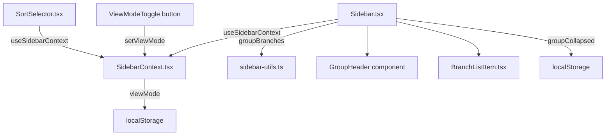

# Issue #449 設計方針書: サイドバー リポジトリ単位グループ化

## 概要

サイドバーのワークツリー一覧をリポジトリ単位でグループ化し、折りたたみ可能な表示を実現する。

---

## 1. アーキテクチャ設計

### システム構成（変更対象）



### 変更レイヤー

| レイヤー | 変更内容 |
|---------|---------|
| プレゼンテーション層 | `Sidebar.tsx` にグループ化レンダリング追加、ViewModeToggleボタン追加 |
| ビジネスロジック層 | `sidebar-utils.ts` に `groupBranches()` / `BranchGroup` / `ViewMode` 追加 |
| 状態管理 | `SidebarContext.tsx` に `viewMode` 状態を追加（useReducerパターン） |
| ローカルストレージ | viewMode / groupCollapsed の永続化 |

---

## 2. 技術選定

| カテゴリ | 選定技術 | 選定理由 |
|---------|---------|---------|
| 状態管理 | useReducer（既存） | SidebarContextの既存パターンに準拠 |
| 永続化（viewMode） | localStorage + useEffect | sortKey と同一パターン |
| 永続化（groupCollapsed） | localStorage + useState初期化関数 | 同期読み込みによるちらつき防止 |
| スタイル | Tailwind CSS | 既存技術スタック |

---

## 3. 型定義設計

### `src/lib/sidebar-utils.ts` への追加

```typescript
/**
 * View mode for sidebar branch list
 * - 'grouped': Group by repository (default)
 * - 'flat': Flat list (legacy behavior)
 */
export type ViewMode = 'grouped' | 'flat';

/**
 * A group of branches belonging to the same repository
 */
export interface BranchGroup {
  repositoryName: string;
  branches: SidebarBranchItem[];
}
```

---

## 4. 関数設計

### `groupBranches()` in `src/lib/sidebar-utils.ts`

```typescript
/**
 * Group and sort branch items by repository
 *
 * - Groups: sorted alphabetically by repositoryName (case-insensitive)
 * - Within group: sorted by the specified sortKey/direction using existing sortBranches()
 *
 * @param branches - Array of branch items to group
 * @param sortKey - Sort key to apply within each group
 * @param direction - Sort direction to apply within each group
 * @returns Array of BranchGroup, sorted alphabetically by repositoryName
 */
export function groupBranches(
  branches: SidebarBranchItem[],
  sortKey: SortKey,
  direction: SortDirection
): BranchGroup[] {
  // 1. Group by repositoryName
  const groupMap = new Map<string, SidebarBranchItem[]>();
  for (const branch of branches) {
    const key = branch.repositoryName;
    if (!groupMap.has(key)) {
      groupMap.set(key, []);
    }
    groupMap.get(key)!.push(branch);
  }

  // 2. Sort groups alphabetically by repositoryName (case-insensitive)
  const sortedKeys = [...groupMap.keys()].sort((a, b) =>
    a.toLowerCase().localeCompare(b.toLowerCase())
  );

  // 3. Sort within each group using existing sortBranches()
  return sortedKeys.map((repositoryName) => ({
    repositoryName,
    branches: sortBranches(groupMap.get(repositoryName)!, sortKey, direction),
  }));
}
```

---

## 5. 状態管理設計

### SidebarContext 拡張（`src/contexts/SidebarContext.tsx`）

**追加する定数**:
```typescript
export const SIDEBAR_VIEW_MODE_STORAGE_KEY = 'mcbd-sidebar-view-mode';
export const DEFAULT_VIEW_MODE: ViewMode = 'grouped';
```

**SidebarState 拡張**:
```typescript
interface SidebarState {
  // 既存フィールド...
  viewMode: ViewMode; // 追加
}
```

**SidebarAction 拡張**:
```typescript
type SidebarAction =
  // 既存アクション...
  | { type: 'SET_VIEW_MODE'; viewMode: ViewMode };     // 追加
  // NOTE: LOAD_VIEW_MODE不要（単一フィールドのためSET_VIEW_MODEに統合）[DR1-002]
```

**reducer 拡張**:
```typescript
case 'SET_VIEW_MODE':
  return { ...state, viewMode: action.viewMode };
// LOAD_VIEW_MODEは廃止 - localStorage読み込み時もSET_VIEW_MODEを使用 [DR1-002]
```

**SidebarContextValue 拡張**:
```typescript
interface SidebarContextValue {
  // 既存フィールド...
  viewMode: ViewMode;    // 追加
  setViewMode: (mode: ViewMode) => void; // 追加
}
```

**localStorage永続化（sortKeyと同一パターン）**:
```typescript
// Load viewMode from localStorage on mount
useEffect(() => {
  if (typeof window === 'undefined') return;
  try {
    const stored = localStorage.getItem(SIDEBAR_VIEW_MODE_STORAGE_KEY);
    if (stored === 'grouped' || stored === 'flat') {
      dispatch({ type: 'SET_VIEW_MODE', viewMode: stored }); // LOAD_VIEW_MODE廃止 [DR1-002]
    }
  } catch { /* ignore */ }
}, []);

// Persist viewMode to localStorage
useEffect(() => {
  if (typeof window === 'undefined') return;
  try {
    localStorage.setItem(SIDEBAR_VIEW_MODE_STORAGE_KEY, state.viewMode);
  } catch { /* ignore */ }
}, [state.viewMode]);
```

**useCallbackラッパー**:
```typescript
const setViewMode = useCallback((viewMode: ViewMode) => {
  dispatch({ type: 'SET_VIEW_MODE', viewMode });
}, []);
```

**value オブジェクトの useMemo ラップ**（既存技術的負債の解消）:
```typescript
const value = useMemo<SidebarContextValue>(() => ({
  isOpen: state.isOpen,
  width: state.width,
  isMobileDrawerOpen: state.isMobileDrawerOpen,
  sortKey: state.sortKey,
  sortDirection: state.sortDirection,
  viewMode: state.viewMode,
  toggle,
  setWidth,
  openMobileDrawer,
  closeMobileDrawer,
  setSortKey,
  setSortDirection,
  setViewMode,
}), [
  state.isOpen, state.width, state.isMobileDrawerOpen,
  state.sortKey, state.sortDirection, state.viewMode,
  toggle, setWidth, openMobileDrawer, closeMobileDrawer,
  setSortKey, setSortDirection, setViewMode,
]);
```

---

## 6. コンポーネント設計

### Sidebar.tsx の変更

**import追加** [DR2-010]:
```typescript
// Sidebar.tsx に以下のimport追加が必要
import { groupBranches } from '@/lib/sidebar-utils';
import type { ViewMode } from '@/lib/sidebar-utils';
```

**groupCollapsed の localStorage 同期読み込み**:
```typescript
const SIDEBAR_GROUP_COLLAPSED_STORAGE_KEY = 'mcbd-sidebar-group-collapsed';

// Synchronous initial load from localStorage (prevents flicker)
// [DR3-009] 初期値{}は全グループがデフォルト展開状態であることを示す。
// 既存のブランチ選択テストはこの前提で動作保証される。
const [groupCollapsed, setGroupCollapsed] = useState<Record<string, boolean>>(() => {
  if (typeof window === 'undefined') return {};
  try {
    const stored = localStorage.getItem(SIDEBAR_GROUP_COLLAPSED_STORAGE_KEY);
    return stored ? parseGroupCollapsed(stored) : {}; // [DR4-001] バリデーション関数を使用
  } catch {
    return {};
  }
});

// Persist groupCollapsed to localStorage on change
useEffect(() => {
  if (typeof window === 'undefined') return;
  try {
    localStorage.setItem(
      SIDEBAR_GROUP_COLLAPSED_STORAGE_KEY,
      JSON.stringify(groupCollapsed)
    );
  } catch { /* ignore */ }
}, [groupCollapsed]);
```

**グループ開閉トグル**:
```typescript
const toggleGroup = useCallback((repositoryName: string) => {
  setGroupCollapsed(prev => ({
    ...prev,
    [repositoryName]: !prev[repositoryName],
  }));
}, []);
```

**useMemo 3段チェーン設計** [DR1-006, DR1-001, DR2-004]:

検索フィルタリングロジックの重複を排除するため、3段構成のuseMemoチェーンを採用する。
searchFilteredItemsで検索フィルタを単一箇所に集約し、flatBranches/groupedBranchesはviewModeに応じた必要な計算のみを実行する。

> **[DR2-004] 移行手順**: 既存の`filteredBranches`変数を廃止し、以下の3変数に置き換える。
> - `filteredBranches` -> `searchFilteredItems`（検索フィルタ済み、未ソート）
> - 新規: `flatBranches`（フラット表示用、ソート済み）
> - 新規: `groupedBranches`（グループ化表示用、ソート済み）
>
> 既存コードで`filteredBranches`を参照している箇所（`.map()`によるレンダリング等）は、`viewMode`に応じて`flatBranches`または`groupedBranches`に置き換えること。

```typescript
const { closeMobileDrawer, sortKey, sortDirection, viewMode } = useSidebarContext();

// Step 1: toBranchItem + 検索フィルタ（ソートなし、viewMode共通）[DR1-006]
const searchFilteredItems = useMemo(() => {
  const items = worktrees.map(toBranchItem);
  if (!searchQuery.trim()) return items;
  const query = searchQuery.toLowerCase();
  return items.filter(
    (branch) =>
      branch.name.toLowerCase().includes(query) ||
      branch.repositoryName.toLowerCase().includes(query)
  );
}, [worktrees, searchQuery]);

// Step 2: フラット表示用（ソート済み）
const flatBranches = useMemo(
  () => (viewMode === 'flat' ? sortBranches(searchFilteredItems, sortKey, sortDirection) : []),
  [viewMode, searchFilteredItems, sortKey, sortDirection]
);

// Step 3: グループ化表示用
const groupedBranches = useMemo(
  () => (viewMode === 'grouped' ? groupBranches(searchFilteredItems, sortKey, sortDirection) : null),
  [viewMode, searchFilteredItems, sortKey, sortDirection]
);
```

**ヘッダーの ViewModeToggle ボタン** [DR2-001]:

> **注意**: SortSelectorとViewModeToggleをflexコンテナ(`div.flex.items-center.gap-1`)でラップするため、既存のヘッダーDOM構造が変更される。`Sidebar.test.tsx`で`data-testid="sidebar-header"`を参照するテストへの影響を確認し、必要に応じてテストセレクタを更新すること。

```tsx
{/* Header */}
<div className="flex-shrink-0 px-4 py-4 border-b border-gray-700">
  <div className="flex items-center justify-between">
    <h2 className="text-lg font-semibold text-white">Branches</h2>
    {/* DR2-001: divラッパー追加によりDOM構造が変更される */}
    <div className="flex items-center gap-1">
      <ViewModeToggle viewMode={viewMode} setViewMode={setViewMode} />
      <SortSelector />
    </div>
  </div>
</div>
```

### SVGアイコン実装方針 [DR2-003]

> ChevronIcon（折りたたみ矢印）、GroupIcon（グループ化表示アイコン）、FlatListIcon（フラット表示アイコン）は、SortSelector.tsxと同じインラインSVGパターンで実装する。それぞれSidebar.tsx末尾にヘルパーコンポーネントとして定義する。外部アイコンライブラリは使用しない。

### GroupHeader コンポーネント（Sidebar.tsx 内インライン定義）

```tsx
interface GroupHeaderProps {
  repositoryName: string;
  count: number;
  isCollapsed: boolean;
  onToggle: () => void;
}

function GroupHeader({ repositoryName, count, isCollapsed, onToggle }: GroupHeaderProps) {
  return (
    <button
      type="button"
      onClick={onToggle}
      aria-expanded={!isCollapsed}
      className="
        w-full flex items-center justify-between
        px-3 py-2 text-left
        text-xs font-semibold text-gray-400 uppercase tracking-wider
        hover:bg-gray-800 transition-colors
        focus:outline-none focus:ring-2 focus:ring-inset focus:ring-cyan-500
      "
    >
      <div className="flex items-center gap-1.5">
        <ChevronIcon isCollapsed={isCollapsed} className="w-3 h-3" />
        <span className="truncate">{repositoryName}</span>
      </div>
      <span className="text-gray-500 font-normal">{count}</span>
    </button>
  );
}
```

### ViewModeToggle コンポーネント（Sidebar.tsx 内インライン定義）

```tsx
interface ViewModeToggleProps {
  viewMode: ViewMode;
  setViewMode: (mode: ViewMode) => void;
}

function ViewModeToggle({ viewMode, setViewMode }: ViewModeToggleProps) {
  const handleToggle = useCallback(() => {
    setViewMode(viewMode === 'grouped' ? 'flat' : 'grouped');
  }, [viewMode, setViewMode]);

  return (
    <button
      type="button"
      onClick={handleToggle}
      aria-label={viewMode === 'grouped' ? 'Switch to flat view' : 'Switch to grouped view'}
      className="
        p-1 rounded text-gray-300 hover:text-white hover:bg-gray-700
        focus:outline-none focus:ring-2 focus:ring-blue-500
        transition-colors
      "
    >
      {viewMode === 'grouped' ? (
        <GroupIcon className="w-3 h-3" />
      ) : (
        <FlatListIcon className="w-3 h-3" />
      )}
    </button>
  );
}
```

---

## 7. レンダリングロジック設計

### Sidebar.tsx のブランチリスト部分

> **[DR2-002]**: `EmptyState`は独立コンポーネントとして存在しない。既存のSidebar.tsxのパターンに合わせ、インラインdiv要素として実装する。以下のコードでは既存パターンに準拠した記述に修正済み。

```tsx
{/* Branch list */}
<div data-testid="branch-list" className="flex-1 overflow-y-auto">
  {viewMode === 'grouped' ? (
    // グループ化表示
    groupedBranches === null || groupedBranches.length === 0 ? (
      // DR2-002: EmptyStateコンポーネントではなく既存のインラインdivパターンを使用
      {/* [DR3-007] text-gray-400に統一（GroupHeaderのtext-gray-400と合わせる） */}
      <div className="px-4 py-8 text-center text-sm text-gray-400">
        {searchQuery ? 'No branches found' : 'No branches available'}
      </div>
    ) : (
      groupedBranches.map((group) => (
        <div key={group.repositoryName}>
          <GroupHeader
            repositoryName={group.repositoryName}
            count={group.branches.length}
            isCollapsed={!!groupCollapsed[group.repositoryName]}
            onToggle={() => toggleGroup(group.repositoryName)}
          />
          {/* [DR3-010] 検索クエリがある場合はgroupCollapsedを無視して全グループ展開 */}
          {(!groupCollapsed[group.repositoryName] || !!searchQuery.trim()) && (
            group.branches.map((branch) => (
              <BranchListItem
                key={branch.id}
                branch={branch}
                isSelected={branch.id === selectedWorktreeId}
                onClick={() => handleBranchClick(branch.id)}
              />
            ))
          )}
        </div>
      ))
    )
  ) : (
    // フラット表示（既存）
    flatBranches.length === 0 ? (
      {/* DR2-002: 同上、インラインdivパターン [DR3-007] text-gray-400に統一 */}
      <div className="px-4 py-8 text-center text-sm text-gray-400">
        {searchQuery ? 'No branches found' : 'No branches available'}
      </div>
    ) : (
      flatBranches.map((branch) => (
        <BranchListItem
          key={branch.id}
          branch={branch}
          isSelected={branch.id === selectedWorktreeId}
          onClick={() => handleBranchClick(branch.id)}
        />
      ))
    )
  )}
</div>
```

---

## 8. localStorage設計

| キー | 値 | 管理場所 | 読み込み方式 |
|-----|-----|---------|------------|
| `mcbd-sidebar-sort` | `{sortKey, sortDirection}` | SidebarContext useEffect | 非同期（useEffect） |
| `mcbd-sidebar-view-mode` | `'grouped' \| 'flat'` | SidebarContext useEffect | 非同期（useEffect） | **[DR2-009]** デフォルト値`'grouped'`により、既存ユーザー（localStorageが空）のUI表示がフラットからグループ化に変化する。後方互換性を考慮する場合はデフォルトを`'flat'`にする選択肢も検討可能だが、本Issueではグループ化表示を新規デフォルトとする要件に基づき、意図的に`'grouped'`をデフォルトとする。**[DR3-006]** viewModeのuseEffect非同期読み込みはgroupedからflatへの切替時に一瞬ちらつく可能性がある。許容できない場合はgroupCollapsedと同様にuseReducer初期値で同期読み込みに変更する。 |
| `mcbd-sidebar-group-collapsed` | `{[repositoryName]: boolean}` | Sidebar useState初期化関数 | 同期（ちらつき防止） |

---

## 9. セキュリティ設計

- localStorage の読み込みは try/catch で囲み例外を無視
- viewMode の復元時は許可値（'grouped' | 'flat'）のみ受け付ける（型ガード）
- groupCollapsed の復元時は JSON.parse を try/catch で保護
- XSS: リポジトリ名はテキストコンテンツとして表示（dangerouslySetInnerHTMLは使用しない）

### [DR4-001] groupCollapsed の localStorage 復元バリデーション

groupCollapsedのlocalStorage復元時に `JSON.parse` の結果をそのまま使用すると、型安全性が保証されない。プロトタイプ汚染攻撃やキー数爆発によるDoSのリスクを防止するため、以下のバリデーション関数を適用する。

**Sidebar.tsx内のuseState初期化関数で `JSON.parse(stored)` の代わりに `parseGroupCollapsed(stored)` を使用すること。**

```typescript
// groupCollapsed のlocalStorage復元バリデーション
function parseGroupCollapsed(raw: string): Record<string, boolean> {
  const parsed = JSON.parse(raw);
  if (typeof parsed !== 'object' || parsed === null || Array.isArray(parsed)) return {};
  // プロトタイプ汚染対策
  const safe: Record<string, boolean> = {};
  const DANGEROUS_KEYS = new Set(['__proto__', 'constructor', 'prototype']);
  const MAX_KEYS = 100; // リポジトリ数の合理的な上限
  let count = 0;
  for (const [key, value] of Object.entries(parsed)) {
    if (DANGEROUS_KEYS.has(key)) continue;
    if (typeof value !== 'boolean') continue;
    if (++count > MAX_KEYS) break;
    safe[key] = value;
  }
  return safe;
}
```

### セキュリティ確認済み事項（Stage 4レビュー）

| 観点 | 状態 | 備考 |
|-----|------|------|
| XSS | 確認済み | Reactテキストコンテンツとして安全（dangerouslySetInnerHTML不使用） |
| viewMode バリデーション | 確認済み | 許可リスト（`'grouped'` \| `'flat'`）でバリデーション済み |
| localStorage 例外保護 | 確認済み | 全てのlocalStorage読み込みがtry/catchで保護済み |
| CSRF | 該当なし | フロントエンドのみの変更のため該当なし |
| 情報漏洩 | 確認済み | 既存Sidebarと同等のリスクレベル |

---

## 10. パフォーマンス設計

| 対策 | 実装 |
|-----|------|
| Context再レンダリング最小化 | SidebarContextのvalueをuseMemoでラップ |
| groupCollapsed のContext非依存 | Sidebar内部useStateで管理（Context変更を発生させない） |
| groupBranches の計算コスト | useMemoで依存値変化時のみ再計算 |
| Sidebar全体のメモ化 | 既存のReact.memoを維持 |
| useMemo化による副次的効果 [DR3-004] | AppShell, SidebarToggle, SortSelector, WorktreeDetailRefactoredの再レンダリング頻度が減少する（ポジティブ影響）。既存テストに再レンダリング回数依存がないことを確認すること |

---

## 11. ダークモード設計

既存のTailwindダークモード対応（`dark:` プレフィックス）に準拠。

GroupHeaderのスタイル:
```
dark:text-gray-400 dark:hover:bg-gray-800
```

---

## 12. 変更ファイル一覧

### 変更ファイル

| ファイル | 変更内容 |
|---------|---------|
| `src/lib/sidebar-utils.ts` | `ViewMode`型、`BranchGroup`インターフェース、`groupBranches()`関数を追加 |
| `src/contexts/SidebarContext.tsx` | `viewMode`状態・アクション・useEffect・useCallback追加、valueをuseMemoでラップ |
| `src/components/layout/Sidebar.tsx` | グループ化レンダリング、groupCollapsed useState、ViewModeToggle、GroupHeaderを追加 |

> **[DR3-001]** `src/hooks/useSidebar.ts`: 現在未使用のため変更不要。ただし将来的に使用する場合はviewMode/setViewModeを返り値に追加すること。

### テスト変更ファイル

| ファイル | 変更内容 |
|---------|---------|
| `tests/unit/lib/sidebar-utils.test.ts` | `groupBranches()`のテストケース追加 |
| `tests/unit/contexts/SidebarContext.test.tsx` | viewMode状態・localStorage永続化テスト追加。既存TestConsumerにviewMode/setViewModeの表示を追加 [DR3-003] |
| `tests/unit/components/layout/Sidebar.test.tsx` | グループ化表示テスト追加、既存セレクタを更新。グループヘッダーにもrepositoryNameが表示されるため、getAllByText('MyRepo')のカウントが変化する。テスト修正が必要 [DR3-002] |

---

## 13. 設計上の決定事項とトレードオフ

| 決定事項 | 採用理由 | トレードオフ |
|---------|---------|------------|
| groupCollapsedをSidebar内部useStateで管理 | Context再レンダリング最小化 | 他コンポーネントからgroupCollapsedを参照不可 |
| viewModeをSidebarContextで管理 | 他コンポーネントからviewModeを参照できる | Context変更がコンシューマー全体に波及（useMemoで軽減） |
| groupBranchesをsidebar-utils.tsに配置 | sortBranches()と同一ファイルで凝集度向上 | ユーティリティファイルの責務が増える |
| GroupHeaderをSidebar.tsx内インライン定義 | 再利用性が低いためファイル分割不要 | Sidebar.tsxのファイルサイズが増える |
| groupCollapsedをuseState初期化関数で同期読み込み | viewMode（useEffect）と異なりflickerが致命的 | SSRではlocalStorageアクセス不可（window未定義ガード必須） |
| valueをuseMemoでラップ | 既存技術的負債の解消、全コンシューマーの再レンダリング削減 | useMemoの依存配列管理が必要 |
| useMemoの3段チェーン設計 [DR1-006] | searchFilteredItems->flatBranches/groupedBranchesの3段構成で検索ロジックを単一箇所に集約、viewModeに応じた必要な計算のみを実行（DRY + パフォーマンス最適化） | useMemoチェーンが3段になり依存関係の把握が必要 |
| LOAD_VIEW_MODEの廃止 [DR1-002] | SET_VIEW_MODEと実質同一処理のため統合し、アクション型を簡素化 | なし（単純な改善） |

---

## 14. 実装順序

1. **sidebar-utils.ts**: `ViewMode`型、`BranchGroup`型、`groupBranches()`関数を追加
2. **SidebarContext.tsx**: `viewMode`状態追加、valueのuseMemoラップ
3. **Sidebar.tsx**: `groupCollapsed` useState、GroupHeader、ViewModeToggle、グループ化レンダリング
4. **テスト**: sidebar-utils.test.ts → SidebarContext.test.tsx → Sidebar.test.tsx

---

## 15. Stage 2 整合性レビュー反映サマリー

| ID | 種別 | 内容 | 反映箇所 |
|----|------|------|---------|
| DR2-001 | Must Fix | ViewModeToggle追加に伴うヘッダーDOM構造変更の明示・テスト影響注記 | セクション6 ヘッダー部分 |
| DR2-010 | Must Fix | Sidebar.tsxへのimport文（groupBranches, ViewMode）の記載追加 | セクション6 冒頭 |
| DR2-002 | Should Fix | EmptyStateコンポーネント参照を既存のインラインdivパターンに修正 | セクション7 |
| DR2-003 | Should Fix | ChevronIcon/GroupIcon/FlatListIconのインラインSVG実装方針を明記 | セクション6 アイコン方針 |
| DR2-004 | Should Fix | 3段useMemoチェーンへの移行手順（変数名変更）を明記 | セクション6 useMemo部分 |
| DR2-009 | Should Fix | デフォルト値'grouped'による後方互換性の影響と意図的採用理由を注記 | セクション8 |

---

## 16. Stage 3 影響分析レビュー反映サマリー

| ID | 種別 | 内容 | 反映箇所 |
|----|------|------|---------|
| DR3-003 | Must Fix | SidebarContext.test.tsxのTestConsumer拡張（viewMode/setViewMode表示追加）を明示 | セクション12 テスト変更ファイル |
| DR3-009 | Must Fix | groupCollapsed初期値{}による全グループ展開保証を明示、既存テストの前提を注記 | セクション6 groupCollapsed初期化 |
| DR3-002 | Should Fix | getAllByText('MyRepo')カウント変化によるテスト修正必要性を注記 | セクション12 テスト変更ファイル |
| DR3-010 | Should Fix | 検索時のグループ折りたたみ状態での非表示バグ対策（searchQuery時にgroupCollapsedを無視） | セクション7 レンダリングロジック |
| DR3-006 | Should Fix | viewModeのuseEffect非同期読み込みによるちらつきリスクと代替策を注記 | セクション8 localStorage設計 |
| DR3-004 | Should Fix | useMemo化による既存コンシューマーへのポジティブ影響（再レンダリング頻度減少）を注記 | セクション10 パフォーマンス設計 |
| DR3-001 | Should Fix | useSidebar.tsが変更ファイル一覧から漏れている旨と将来対応を注記 | セクション12 変更ファイル一覧 |
| DR3-007 | Should Fix | 空状態メッセージのCSSクラスをtext-gray-400に統一 | セクション7 レンダリングロジック |

---

## 17. Stage 4 セキュリティレビュー反映サマリー

| ID | 種別 | 内容 | 反映箇所 |
|----|------|------|---------|
| DR4-001 | Should Fix | groupCollapsedのlocalStorage復元時に型バリデーション・プロトタイプ汚染対策・キー数制限を適用するparseGroupCollapsed関数を追加 | セクション6 groupCollapsed初期化、セクション9 セキュリティ設計 |
| DR4-002 | 確認済み | XSSリスクなし（Reactテキストコンテンツ） | セクション9 確認済み事項 |
| DR4-003 | 確認済み | viewModeの許可リストバリデーション | セクション9 確認済み事項 |
| DR4-004 | 確認済み | localStorage例外保護 | セクション9 確認済み事項 |
| DR4-005 | 該当なし | CSRF（フロントエンドのみ） | セクション9 確認済み事項 |
| DR4-006 | 確認済み | 情報漏洩リスク（既存同等） | セクション9 確認済み事項 |
| DR4-007 | 確認済み | dangerouslySetInnerHTML不使用 | セクション9 確認済み事項 |

---

*Generated by /design-policy for Issue #449*
*Updated: 2026-03-08 (Stage 4 セキュリティレビュー反映)*
