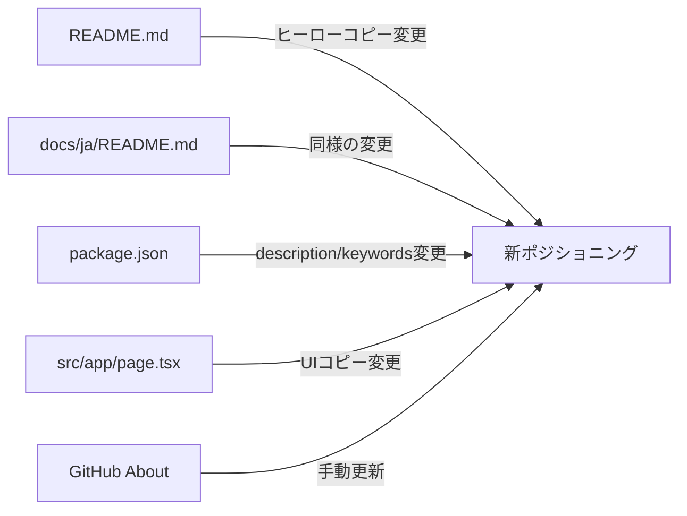

# Issue #457 設計方針書: CommandMate READMEポジショニング変更

## 基本情報

| 項目 | 内容 |
|------|------|
| Issue | #457 |
| タイトル | docs: reposition CommandMate as an agent CLI control plane, not an opinionated AI IDE |
| 種別 | ドキュメント変更（ポジショニング・コピーライティング） |
| 作成日 | 2026-03-09 |

---

## 1. 変更の目的と方針

### 目的

CommandMateを「Issue-driven AI開発IDE」という限定的な印象から、「エージェントCLIのローカルコントロールプレーン」という広くユーザビリティの高いポジショニングへ転換する。

### コアポジショニング変更

```
Before: "IDE for issue-driven AI development"
After:  "A local control plane for agent CLIs"
```

### 設計原則

1. **既存機能は削除しない**: ポジショニング変更のみ。issue-drivenワークフロー機能自体は維持
2. **セクション構成を変更する**: Issue-Driven開発セクションをKey Featuresの後へ移動
3. **オプショナル性を明示**: 高度なワークフロー機能はOptionalとしてフレーム
4. **互換性を強調**: tmux/CLIとの共存・フォールバック可能性を前面に出す

---

## 2. 変更対象ファイルと変更内容

### 2-1. README.md（英語版）

**変更箇所**:

| 箇所 | 現在の内容 | 変更後の内容 |
|------|-----------|------------|
| L16 ブロック引用 `> **Move issues forward...**` | `Move issues forward, not terminal tabs.` | `Orchestrate your agent CLIs, not your terminal tabs.` |
| L18 ヒーローコピー `CommandMate is an IDE...` | `CommandMate is an IDE for issue-driven AI development.` | `CommandMate is a local control plane for agent CLIs.` |
| L28-30 サブコピー `Instead of jumping straight...` | `Instead of jumping straight into implementation, you define an issue, refine it with AI...` + `CommandMate can become the center of your development workflow.` | 新サブコピー（下記参照）。**注意**: L30の `the center of your development workflow` はセクション6ガードレール違反のため必ず変更すること |
| Issue-Driven Development セクション (L42) | Key Featuresの前に配置（現在L42） | Optional Workflow Layerセクションとして、Documentationセクション（L317）の直前に配置。Optional Workflow Layer導入文の後にIssue-Driven Developmentの表を配置する構成とする。**Note (Stage 3 F1)**: セクション名変更により `#issue-driven-development` アンカーが `#optional-workflow-layer` に変わる。外部サイトからの旧アンカーリンク互換性のため、`<a id="issue-driven-development"></a>` をOptional Workflow Layerセクション冒頭に設置することを推奨する（プロジェクト内部には旧アンカーへのリンクは存在しないことを確認済み） |
| Auto Yes Modeの説明 | `No babysitting — the agent keeps working while you're away` | `Optional unattended mode for trusted workflows` |

**新サブコピー（推奨）**:
```
CommandMate adds orchestration and visibility on top of your existing agent CLIs.
It does not replace tmux, Git worktrees, or your terminal. It makes them easier to manage at scale.
```

**互換性コピーの追加**（既存の説明文に組み込む）:
- `works with your existing terminal workflow`
- `does not replace tmux or Git worktrees`
- `drop down to tmux anytime`
- `fully local`

**バリュープロポジション順序**:

上部（広いマーケット向け）:
1. Parallel worktree sessions
2. Multi-agent CLI support
3. Prompt handling and session monitoring
4. Diff review and file inspection
5. Browser and mobile access

下部（パワーユーザー向け - Optional Workflow Layer）:
6. Scheduled execution
7. Advanced workflow automation
8. Issue-driven workflow
9. Slash-command workflow system
10. Auto-yes

**Feature Copyの推奨フレーミング**:

| Feature | 推奨フレーミング |
|---------|----------------|
| Git Worktree Sessions | Run one agent session per worktree without collisions |
| Multi-Agent Support | Use Claude Code, Codex, Gemini CLI, OpenCode, or local models in the same control surface |
| Prompt Review | Detect prompts, answer approvals, and resume sessions without attaching to tmux |
| Diff Review | Inspect commit history and diffs before accepting agent output |
| Browser and Mobile Access | Check progress and intervene from anywhere on your local network |
| Auto Yes | Optional unattended mode for trusted flows -- **review the Security Guide before enabling; see the Security section for risks and limitations** |
| Scheduled Execution | Run recurring tasks or queued agent jobs automatically |

**Optional Workflow Layerセクション**（追加）:
```markdown
<a id="issue-driven-development"></a>

## Optional Workflow Layer

If your team wants more structure, CommandMate can also help you standardize
issue refinement, design review, planning, implementation, and acceptance checks.
These workflows build on top of the same CLI sessions and worktrees. They are optional, not required.
```

> **Note (Stage 3 F6)**: セクション末尾のworkflow-examplesへのリンクは、Optional Workflow Layer内に残すことが適切（オプショナル機能の詳細案内として機能する）。ただし、リンクテキストを移動後のコンテキストに合わせて調整することを推奨する。例: `"For details, see the ..."` を `"These optional workflows are documented in ..."` のような表現に変更する。

### 2-2. docs/ja/README.md（日本語版）

**変更箇所**:

| 箇所 | 現在の内容 | 変更後の内容 |
|------|-----------|------------|
| ブロック引用 | `ターミナルをさばくな。Issue を前に進めよう。` | `ターミナルをさばくな。エージェント CLI をオーケストレーションしよう。` |
| ヒーローコピー | `CommandMate は、Issue ドリブン AI 開発のための IDE です。` | `CommandMate は、エージェント CLI のローカルコントロールプレーンです。` |
| L28 サブコピー | `いきなり実装に入るのではなく、Issue を定義し、AI に補強させ、人間が方向性をレビューし、計画を作ってから実装を任せる。CommandMate は、その流れを Git worktree で安全に並列化し、Issue ごとに適切なエージェントを選び、席を離れている間も開発を止めずに進められるようにします。` | `CommandMate は、既存のエージェント CLI の上にオーケストレーションと可視性を追加します。tmux、Git worktree、ターミナルを置き換えません。大規模な管理を容易にします。` |
| L30 サブコピー | `「自分でコードを書く」より「Issue を定義し、方向を確認し、受け入れる」時間の方が長くなってきたなら、CommandMate は開発の中心になれます。` | 削除または新サブコピーに統合。**注意**: `開発の中心になれます` はセクション6ガードレール違反（`the center of your development workflow` に相当）のため必ず変更すること |
| Key Features | 1番目が「Issue ドリブンコマンド」 | 英語版と同様の管理機能優先の並びに変更 |
| イシュードリブン開発セクション (L42) | Key Featuresの前に配置（現在L42） | オプショナルワークフローレイヤーセクションとして、ドキュメントセクション（L318）の直前に配置 |
| Auto Yesの説明 | `放置しても止まらない` | `信頼できるワークフロー向けのオプショナル自動実行モード` |

> **注意**: 日本語版はKey Featuresテーブルの1番目が「Issue ドリブンコマンド」と英語版と構成が異なる。英語版に合わせてGit Worktree Sessions, Multi-Agent Supportを上位に変更する。

**Optional Workflow Layerセクション（日本語版）**（追加）:
```markdown
## オプショナルワークフローレイヤー

チームでより構造的な開発を行いたい場合、CommandMate は Issue の精査、設計レビュー、
計画立案、実装、受け入れチェックの標準化もサポートします。
これらのワークフローは同じ CLI セッションと worktree の上に構築されます。利用は任意です。
```

### 2-3. package.json

**変更箇所**:

| フィールド | 現在の値 | 変更後の値 |
|-----------|---------|----------|
| `description` | `"IDE for issue-driven AI development — define, plan, and let coding agents execute across Git worktrees"` | `"A local control plane for agent CLIs — orchestration and visibility for Claude Code, Codex, Gemini CLI, and more across Git worktrees"` |
| `keywords` | `['claude-code', 'codex-cli', 'issue-driven-development', 'ai-coding', 'git-worktree', 'coding-agent', 'session-manager', 'tmux', 'cli', 'developer-tools']` | `['claude-code', 'codex-cli', 'gemini-cli', 'agent-cli', 'ai-coding', 'coding-agent', 'git-worktree', 'cli-orchestration', 'session-manager', 'tmux', 'cli', 'developer-tools']`（`issue-driven-development`のみ削除、`gemini-cli`, `agent-cli`, `cli-orchestration`追加、`ai-coding`と`coding-agent`は継続保持） |

> **Note (Stage 3 F2)**: `ai-coding` と `coding-agent` は新ポジショニングでも「agent CLIを管理するツール」として依然有効なキーワードであるため、意図的に保持する。削除対象は `issue-driven-development` のみとする。

### 2-4. src/app/page.tsx

**変更箇所**: L23-25のヒーローコピー

```typescript
// Before
<p className="text-base text-gray-600 dark:text-gray-400">
  Stop managing terminal tabs. Start running issue-driven development.
  <br />
  CommandMate helps you refine issues, run them in parallel, switch agents when needed, and keep work moving wherever you are.
</p>

// After
<p className="text-base text-gray-600 dark:text-gray-400">
  A local control plane for agent CLIs — orchestration and visibility on top of Claude Code, Codex, Gemini CLI, and more.
  <br />
  CommandMate does not replace tmux, Git worktrees, or your terminal. It makes them easier to manage across sessions and worktrees.
</p>
```

### 2-6. CHANGELOG.md

**記録内容テンプレート**:

```markdown
### Changed
- docs: reposition CommandMate as "a local control plane for agent CLIs" instead of "IDE for issue-driven AI development" (#457)
  - Updated README.md hero copy, sub copy, and section ordering
  - Updated docs/ja/README.md with corresponding Japanese translations
  - Updated package.json description and keywords
  - Updated src/app/page.tsx hero copy
  - Updated GitHub About description
```

### 2-7. GitHub About Description（手動更新）

- 現在: `"Issue-driven AI development IDE for Claude Code and Codex CLI..."`
- 変更後: `"A local control plane for agent CLIs — orchestration and visibility for Claude Code, Codex, Gemini CLI, and more across Git worktrees"`
- **更新方法**: GitHubリポジトリのSettings > General > Descriptionで手動変更

---

## 3. 変更しないもの

| 項目 | 理由 |
|------|------|
| CLAUDE.md | プロジェクト概要は「Git worktree管理とClaude CLI/tmuxセッション統合ツール」と既にcontrol plane的。変更不要 |
| 機能実装コード | ポジショニング変更のみ。機能削除なし |
| コマンド体系 | /pm-auto-dev等のコマンドはそのまま維持（Optional Workflow Layerとして案内） |
| docs/user-guide/ | 将来タスクとして対応。本Issueのスコープ外 |
| docs/architecture.md | 技術アーキテクチャ記述のため変更不要 |
| Use Casesセクション（README.md L82-91） | issue-driven寄りの表現を含むが、本Issueではヒーローコピーとセクション構成の変更に集中する。Use Casesの表現更新は将来タスクとして対応 |
| docs/en/concept.md (Stage 3 F7) | プロダクトビジョンと課題を記述するドキュメント。新ポジショニングとトーンが将来的に乖離する可能性があるが、本Issueのスコープ外。将来タスクとして認識 |

---

## 4. アーキテクチャ上の考慮事項

本Issueはコピーライティング/ドキュメント変更のみであり、コードアーキテクチャへの影響はない。



---

## 5. リスクと対策

| リスク | 影響度 | 対策 |
|--------|--------|------|
| 英語/日本語READMEの不整合 | 中 | 英語版を先に確定し、日本語版は英語版に準拠 |
| package.jsonの変更がnpmパッケージに影響 | 低 | descriptionはnpm searchに影響するが、機能には無影響 |
| page.tsxの変更がUIに影響 | 低 | テキストのみの変更、レイアウト変更なし |
| GitHub About更新の忘れ | 中 | Acceptance Criteriaに明記、手動確認必須 |
| ワークフロー機能が「隠れる」印象 | 低 | Optional Workflow Layerセクションで明示的に案内 |
| 外部からの `#issue-driven-development` アンカーリンク破損 (Stage 3 F1) | 低 | Optional Workflow Layerセクション冒頭に `<a id="issue-driven-development"></a>` を設置して互換性を維持 |
| セクション移動後のリンクテキストがコンテキストと不整合 (Stage 3 F6) | 低 | workflow-examplesリンクのテキストをOptional Workflow Layerの文脈に合わせて調整 |

---

## 6. ポジショニングガードレール

### 一貫して伝えるべきこと
- 既存CLIと連携する
- ターミナルを置き換えない
- 新しい開発哲学を要求しない
- 上級ワークフロー機能はオプショナル
- いつでもtmuxとネイティブCLIにフォールバック可能

### リードで避けるべき表現
- `IDE`
- `the center of your development workflow`
- `issue-driven AI development` をプライマリラベルとして
- `no babysitting`（信頼確立前）

---

## 7. 受入条件（Acceptance Criteria）

- [ ] README.mdのヒーローが `IDE for issue-driven AI development` でリードしなくなっている
- [ ] README.mdトップセクションが既存エージェントCLIとの連携を明示している
- [ ] ワークフロー重視のメッセージングがコアセッション管理価値の下に移動している
- [ ] Auto Yesがヒーローレベルのポジショニングから降格している
- [ ] READMEにtmux/CLIとの互換性・フォールバック言語が含まれている
- [ ] 日本語README（docs/ja/README.md）も同様に更新されている
- [ ] package.jsonのdescriptionが新しいポジショニングを反映している
- [ ] package.jsonのkeywordsが `issue-driven-development` を除去し `gemini-cli`, `agent-cli`, `cli-orchestration` を追加。`ai-coding` と `coding-agent` は継続保持されている
- [ ] src/app/page.tsx L23のヒーローコピーが更新されている
- [ ] src/app/page.tsx L25のサブコピーが更新され、新しいポジショニングと一貫している
- [ ] GitHubリポジトリのAbout descriptionが更新されている
- [ ] CHANGELOG.mdに変更が記録されている

---

## 8. 実装順序

1. `README.md` の変更（ヒーローコピー、セクション順序、Auto Yes表現、Optional Workflow Layer追加）
2. `docs/ja/README.md` の変更（英語版に準拠した日本語訳）
3. `package.json` の変更（description, keywords）
4. `src/app/page.tsx` の変更（UIコピー）
5. `CHANGELOG.md` への記録
6. GitHub About descriptionの手動更新（ステップ5完了後）

---

## 9. Stage 1 レビュー指摘事項サマリー

> 反映日: 2026-03-09 | レビューステージ: Stage 1（通常レビュー）

| ID | 重要度 | カテゴリ | 概要 | 対応状況 |
|----|--------|----------|------|----------|
| F1 | must_fix | 明確性 | README.md行番号が実ファイルと不一致（L20→L18、L23-26→L28-30） | 反映済み: セクション2-1テーブルの行番号を修正し、内容ベースの特定も併記 |
| F2 | should_fix | 完全性 | L30の `the center of your development workflow` がガードレール違反だが変更対象に未記載 | 反映済み: セクション2-1テーブルにL28-30サブコピー全体を変更対象として追加、ガードレール違反を注記 |
| F3 | should_fix | 完全性 | CHANGELOG.mdがセクション2の変更対象ファイル一覧に未記載 | 反映済み: セクション2-6としてCHANGELOG.mdを追加、記録テンプレートを記載 |
| F4 | should_fix | 明確性 | Issue-Driven Developmentセクションの移動先が曖昧 | 反映済み: 「Documentationセクション（L317）の直前に配置」と具体的に指定 |
| F5 | should_fix | DRY | 日本語版の推奨コピーが不足（ブロック引用・サブコピーが実装者任せ） | 反映済み: ブロック引用・サブコピーの推奨日本語訳を具体的に記載、Optional Workflow Layer日本語テンプレートも追加 |
| F6 | nice_to_have | 完全性 | Feature CopyテーブルがKey Featuresテーブルのどの列を置き換えるか不明確 | 未反映（nice_to_have、実装時に判断可能） |
| F7 | nice_to_have | KISS | Use CasesセクションがIssueスコープ内か不明 | 反映済み: セクション3にスコープ外として明記 |
| F8 | nice_to_have | YAGNI | バリュープロポジション順序の反映先が不明確 | 未反映（nice_to_have、実装時に判断可能） |

### 実装チェックリスト（Stage 1 反映分）

- [ ] **F1**: README.md変更時にL16（ブロック引用）、L18（ヒーローコピー）、L28-30（サブコピー）を正確に特定して変更
- [ ] **F2**: README.md L30の `CommandMate can become the center of your development workflow` を新サブコピーに置換（ガードレール違反解消）
- [ ] **F3**: CHANGELOG.mdにセクション2-6のテンプレートに基づいて変更を記録
- [ ] **F4**: Issue-Driven DevelopmentセクションをOptional Workflow Layerとして、Documentationセクションの直前に配置
- [ ] **F5**: 日本語版README（docs/ja/README.md）のブロック引用・サブコピーに推奨訳を使用、Optional Workflow Layer日本語版を追加

---

## 10. Stage 2 レビュー指摘事項サマリー

> 反映日: 2026-03-09 | レビューステージ: Stage 2（整合性レビュー）

| ID | 重要度 | カテゴリ | 概要 | 対応状況 |
|----|--------|----------|------|----------|
| F1 | nice_to_have | その他 | セクション番号の欠番（2-4の次が2-6、2-5が存在しない） | 未反映（nice_to_have、実装に影響なし） |
| F2 | nice_to_have | チェックリスト不備 | 日本語版READMEのKey Features順序変更がImplementation Checklistに含まれていない | 反映済み: 実装チェックリストに追加 |
| F3 | nice_to_have | チェックリスト不備 | page.tsxのヒーローコピー変更がImplementation Checklistに含まれていない | 未反映（nice_to_have、Acceptance Criteriaでカバー済み） |
| F4 | should_fix | 内容不一致 | 日本語版READMEのイシュードリブン開発セクション移動先の行番号が未記載 | 反映済み: セクション2-2テーブルに「ドキュメントセクション（L318）の直前に配置」と具体的な行番号を追記 |
| F5 | should_fix | 内容不一致 | 日本語版READMEのサブコピー（L28-30）の変更前テキストが曖昧記述。L30はガードレール違反箇所 | 反映済み: セクション2-2テーブルにL28・L30の現行テキストを具体的に記載、L30のガードレール違反を明記 |
| F6 | nice_to_have | 矛盾 | page.tsxの行番号参照がセクション2-4とAcceptance Criteriaで微妙に異なる | 未反映（nice_to_have、実装に影響なし） |

### 実装チェックリスト（Stage 2 反映分）

- [ ] **F4**: 日本語版README（docs/ja/README.md）のイシュードリブン開発セクション（L42）をオプショナルワークフローレイヤーとして、ドキュメントセクション（L318）の直前に配置
- [ ] **F5**: 日本語版README（docs/ja/README.md）L30の `CommandMate は開発の中心になれます` を新サブコピーに置換（ガードレール違反解消）
- [ ] **F2(nice_to_have)**: 日本語版READMEのKey Featuresテーブルの順序を英語版に合わせて変更（Issue ドリブンコマンドを下位へ移動）

---

## 11. Stage 3 レビュー指摘事項サマリー

> 反映日: 2026-03-09 | レビューステージ: Stage 3（影響分析レビュー）

| ID | 重要度 | カテゴリ | 概要 | 対応状況 |
|----|--------|----------|------|----------|
| F1 | should_fix | 互換性 | Issue-Driven Developmentセクションのリネームによりアンカーリンク `#issue-driven-development` が壊れる可能性 | 反映済み: セクション2-1にアンカー互換性のNoteを追記、Optional Workflow Layerテンプレートに `<a id="issue-driven-development"></a>` を追加、リスクテーブルにも追記 |
| F2 | should_fix | SEO影響 | package.json keywordsで `ai-coding` と `coding-agent` が意図せず削除される可能性 | 反映済み: セクション2-3の変更後キーワードリストに `ai-coding` と `coding-agent` を継続保持する形に修正、Noteで方針を明記、受入条件も更新 |
| F3 | nice_to_have | ドキュメント波及 | CLAUDE.mdの判断は妥当、追加変更不要 | 対応不要（レビューで妥当性確認済み） |
| F4 | nice_to_have | ユーザー影響 | npm上でdescriptionとREADMEの中間状態を避ける必要性 | 対応不要（実装順序で同一リリース内の変更を担保済み） |
| F5 | nice_to_have | CI/CD影響 | 変更対象ファイルはビルドプロセスに影響しない | 対応不要（CI/CD影響なし確認済み） |
| F6 | should_fix | 互換性 | セクション移動後のworkflow-examplesリンクテキストのコンテキスト変化 | 反映済み: セクション2-1のOptional Workflow Layerテンプレート下にリンクテキスト調整のNoteを追加、リスクテーブルにも追記 |
| F7 | nice_to_have | ドキュメント波及 | docs/en/concept.mdが将来的に新ポジショニングと乖離する可能性 | 反映済み: セクション3の「変更しないもの」テーブルにdocs/en/concept.mdを追加、将来タスクとして認識 |
| F8 | nice_to_have | その他 | CHANGELOG.mdの経緯追跡は現テンプレートで十分 | 対応不要（現在のテンプレートで対応済み） |

### 実装チェックリスト（Stage 3 反映分）

- [ ] **F1**: Optional Workflow Layerセクション冒頭に `<a id="issue-driven-development"></a>` を設置して旧アンカーリンクとの互換性を維持
- [ ] **F2**: package.json keywordsから `issue-driven-development` のみを削除し、`ai-coding` と `coding-agent` は継続保持。`gemini-cli`, `agent-cli`, `cli-orchestration` を追加
- [ ] **F6**: Optional Workflow Layerセクション内のworkflow-examplesリンクテキストを移動後のコンテキストに合わせて調整（例: `"These optional workflows are documented in ..."`）

---

## 12. Stage 4 レビュー指摘事項サマリー

> 反映日: 2026-03-09 | レビューステージ: Stage 4（セキュリティレビュー）

| ID | 重要度 | カテゴリ | 概要 | 対応状況 |
|----|--------|----------|------|----------|
| F1 | should_fix | Auto Yes誤解 | Auto Yes Modeの新表現「Optional unattended mode for trusted workflows」が「trusted」の定義を曖昧にし、ユーザーがリスクを過小評価する可能性がある。Security GuideやTrust & Safety文書への誘導を設計方針書内で明示すべき | 反映済み: セクション2-1 Feature CopyテーブルのAuto Yes行にSecurity Guideへの参照とリスク・制限事項の確認を促す注記を追記 |
| F2 | nice_to_have | ソーシャルエンジニアリング | 「fully local」強調と既存Security セクションの「remote access」記述が一見矛盾するが、既存のSecurity セクションに適切な注意事項があるため実質的リスクは低い | 対応不要（既存Security セクションで対応済み） |
| F3 | nice_to_have | 依存関係 | keywords追加によるtyposquattingリスクは、パッケージ名変更を伴わないため実質的にない | 対応不要（リスクなし） |
| F4 | nice_to_have | 情報漏洩 | 変更対象はすべて公開ドキュメントであり、内部実装の詳細を新たに露出する変更はない | 対応不要（リスクなし） |
| F5 | nice_to_have | 信頼性 | 「control plane」用語がエンタープライズ水準のセキュリティを暗示する可能性があるが、「for agent CLIs」の修飾により誤解リスクは低い | 対応不要（リスク低） |

### 実装チェックリスト（Stage 4 反映分）

- [ ] **F1**: README.md Feature CopyテーブルまたはAuto Yesの説明において、Security GuideまたはSecurityセクションへの参照リンクを設置し、リスクと制限事項を確認するよう案内する

---

*Generated by design-policy command for Issue #457*
