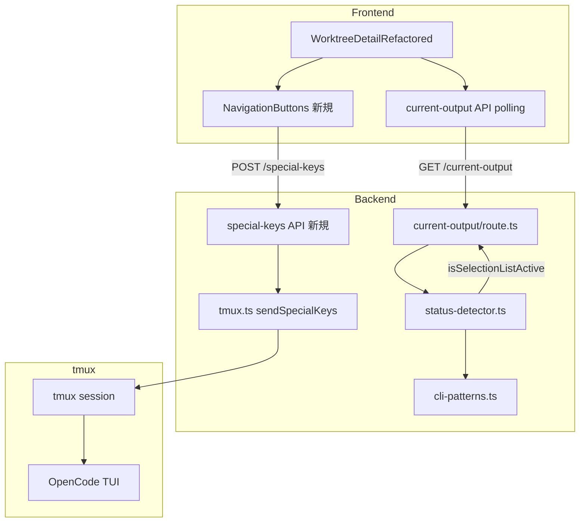

# Issue #473 設計方針書: OpenCode TUI選択リストのキーボードナビゲーション対応

## 1. 概要

OpenCodeのTUI内で表示されるファジー検索付き選択リスト（`/models`、`/providers`等）に対して、矢印キー（Up/Down）でのナビゲーションとEnter/Escapeでの選択・キャンセルをCommandMateのUI上から実行可能にする。

### 変更の目的
- OpenCode TUI の選択リスト操作をCommandMate UIから可能にする
- PC: ボタンクリック + キーボードショートカット
- スマートフォン: タッチ操作可能なボタン

---

## 2. アーキテクチャ設計

### システム構成図



### レイヤー構成

| レイヤー | 変更対象 | 変更内容 |
|---------|---------|---------|
| プレゼンテーション | `WorktreeDetailRefactored.tsx` | `isSelectionListActive` 状態管理・NavigationButtons表示制御 |
| プレゼンテーション | `NavigationButtons.tsx`（新規） | Up/Down/Enter/Escapeボタン表示 |
| API | `special-keys/route.ts`（新規） | 特殊キー送信エンドポイント |
| API | `current-output/route.ts` | `isSelectionListActive` フラグ追加 |
| ビジネスロジック | `status-detector.ts` | 選択リスト検出分岐追加 |
| ビジネスロジック | `cli-patterns.ts` | OpenCode選択リストパターン定義 |
| インフラ | `tmux.ts` | `NAVIGATION_KEY_VALUES` as const配列 export + `isAllowedSpecialKey()` 関数 export [DR2-004][DR3-001] |

---

## 3. 技術選定

| カテゴリ | 選定技術 | 選定理由 |
|---------|---------|---------|
| パターン検出 | 正規表現 (RegExp) | 既存のcli-patterns.tsパターンと統一 |
| キー送信 | `sendSpecialKeys()` | 既存インフラ（tmux.ts）を流用 |
| 状態伝達 | current-output APIレスポンス拡張 | 既存ポーリングの仕組みを流用、追加ポーリング不要 |
| UIコンポーネント | 独立NavigationButtonsコンポーネント | SRP、MessageInputの変更不要 |

---

## 4. 設計パターン

### 4.1 検出パターン（Strategy パターンの拡張）

既存の `cli-patterns.ts` + `status-detector.ts` のパターンを拡張する。新規パターンはOpenCode固有ブロック（priority 2.5）内に配置する。

```typescript
// src/lib/cli-patterns.ts に追加
export const OPENCODE_SELECTION_LIST_PATTERN: RegExp;
// パターンは前提作業（tmux capture-pane出力サンプル取得）後に確定
```

### 4.2 APIパターン（既存terminal API踏襲）

```typescript
// src/app/api/worktrees/[id]/special-keys/route.ts
// terminal/route.ts の構造を踏襲した多層防御
export async function POST(req, { params }) {
  // 0. JSONパース防御 [DR4-002]
  //    try { body = await req.json(); }
  //    catch { return NextResponse.json({ error: 'Invalid request body' }, { status: 400 }); }
  // 1. cliToolId バリデーション (isCliToolType)
  // 2. keys 型バリデーション [DR4-004]
  //    - Array.isArray(keys) チェック → 400
  //    - keys.every(k => typeof k === 'string') チェック → 400
  //    - keys.length === 0 チェック → 400（空配列は拒否）
  // 3. keys 内容バリデーション (isAllowedSpecialKey(), 最大長10) [DR2-004]
  // 4. DB存在確認 (getWorktreeById)
  // 5. セッション確認 (hasSession)
  // → sendSpecialKeysAndInvalidate() (セクション4.4参照)
  // ※ エラーレスポンスは全て固定文字列（params.id等の内部情報を含めない）[DR4-003]
}
```

**バリデーションロジック共通化方針 [DR1-001]:**

special-keys API と terminal API は、(1) isCliToolType()チェック、(2) getWorktreeById()確認、(3) hasSession()確認、(4) invalidateCache()呼び出しという同一のバリデーションパイプラインを持つ。現時点ではエンドポイント数が2つであり、共通ユーティリティの抽出は過剰設計となるため、terminal/route.ts の構造をコピーして実装する。

ただし、**3つ目以降のセッション操作系エンドポイントが追加される時点で**、以下の共通ユーティリティ関数を抽出するリファクタリングを実施する:

```typescript
// 抽出対象（リファクタリング閾値: セッション操作系エンドポイント >= 3）
async function resolveSessionOrError(
  req: Request, params: { id: string }
): Promise<{ worktree, sessionName, cliToolId } | NextResponse>
```

この閾値は設計判断として記録し、将来のエンドポイント追加時に参照する。

### 4.4 キー送信+キャッシュ無効化パターン [DR1-003]

sendSpecialKeys後のinvalidateCache呼び出しを一元化するラッパー関数を本Issue実装時に追加する（詳細はセクション9.2参照）。

### 4.3 UIパターン（条件付きコンポーネント表示）

```typescript
// WorktreeDetailRefactored.tsx
{isSelectionListActive && (
  <NavigationButtons
    worktreeId={worktreeId}
    cliToolId={activeCliTab}
  />
)}
```

---

## 5. API設計

### 5.1 新規: POST /api/worktrees/[id]/special-keys

**リクエスト:**
```typescript
interface SpecialKeysRequest {
  cliToolId: string;   // CLIToolType
  keys: string[];      // ['Up'] | ['Down'] | ['Enter'] | ['Escape']
}
```

**レスポンス:**

全てのエラーレスポンスは固定文字列を使用し、params.idやcliToolIdの値をメッセージに含めない（D1-007踏襲）[DR4-003]。

| ケース | HTTPステータス | ボディ |
|--------|---------------|--------|
| 成功 | 200 | `{ success: true }` |
| JSONパースエラー | 400 | `{ error: 'Invalid request body' }` [DR4-002] |
| keys型不正（非配列、非string要素、空配列） | 400 | `{ error: 'Invalid keys parameter' }` [DR4-004] |
| 不正パラメータ | 400 | `{ error: 'Invalid special key' }` |
| worktree不存在 | 404 | `{ error: 'Worktree not found' }` |
| セッション不存在 | 404 | `{ error: 'Session not found' }` |
| 内部エラー | 500 | `{ error: 'Failed to send special keys to terminal' }` |

**レスポンス時間特性:** keys配列長 × 100ms（SPECIAL_KEY_DELAY_MS）。通常1-2キーで200ms以下。

### 5.2 既存変更: GET /api/worktrees/[id]/current-output

レスポンスに `isSelectionListActive: boolean` フィールドを追加。

```typescript
// 追加判定ロジック
const isSelectionListActive = statusResult.status === 'waiting'
  && statusResult.reason === 'opencode_selection_list';
```

**reason文字列の型安全性方針 [DR2-003]:**

`statusResult.reason` は現在 `string` 型（`StatusDetectionResult.reason: string`）であり、ハードコード文字列の比較が `status-detector.ts` と `current-output/route.ts` の両方で行われる。typoリスクを低減するため、以下のいずれかの方針で実装する:

- **推奨（本Issue実装時）:** reason文字列を定数として定義し、`status-detector.ts` と `current-output/route.ts` の両方で同じ定数を参照する
  ```typescript
  // src/lib/status-detector.ts または別ファイル
  export const STATUS_REASON = {
    OPENCODE_SELECTION_LIST: 'opencode_selection_list',
    THINKING_INDICATOR: 'thinking_indicator',
    // ... 他のreason値
  } as const;
  ```
- **将来検討:** `StatusDetectionResult.reason` の型を `string` からunion literal型に厳格化する
  ```typescript
  type StatusReason = 'prompt_detected' | 'thinking_indicator' | 'opencode_processing_indicator'
    | 'opencode_response_complete' | 'opencode_selection_list' | 'input_prompt'
    | 'no_recent_output' | 'default';
  ```
  この変更は既存コードへの影響範囲が広いため、本Issueスコープ外とし、少なくとも定数参照パターンで安全性を確保する。

---

## 6. 検出ロジック設計

### 6.1 status-detector.ts の優先順位

```
priority 2.5 OpenCode固有ブロック:
  (A) processing_indicator → status: 'running'    [既存] ← lastLines（footer 15行）で検出
  (B) thinking             → status: 'running'    [既存] ← contentCandidatesウィンドウで検出
  (C) selection_list       → status: 'waiting'    [新規] ← 検出ウィンドウは前提作業後に決定 [DR3-004]
  (D) response_complete    → status: 'ready'      [既存] ← contentCandidatesウィンドウで検出
```

**selection_list 検出ウィンドウの方針 [DR3-004]:**

既存のpriority 2.5ブロックでは、(A)は `lastLines`（footer 15行）、(B)(D)は `contentCandidates`（footer境界より上のコンテンツ領域）で検出している。選択リスト(C)がOpenCode TUIのどの領域に表示されるか（footer領域かコンテンツ領域か）は前提作業（セクション6.3のcapture-paneサンプル取得）後に確認し、適切な検出ウィンドウを選定する。誤ったウィンドウで検出するとパターンマッチが失敗するか、不要な範囲のスキャンによるパフォーマンス劣化が生じる。

### 6.2 検出時の返却値

```typescript
{
  status: 'waiting',
  confidence: 'high',
  reason: 'opencode_selection_list',
  hasActivePrompt: false,  // prompt cleanup発動防止
  promptDetection,
}
```

### 6.3 前提作業

実装前に必須：
1. OpenCode `/models`, `/providers` 実行時の tmux capture-pane 出力サンプルを取得
2. サンプルから正規表現パターンを設計
3. 他CLIツール出力で誤検知しないことを確認

### 6.4 パターン確定後のレビューチェックポイント [DR1-005]

OPENCODE_SELECTION_LIST_PATTERN が前提作業により確定した後、実装に進む前に以下の検証プロセスを実施する。

**既存パターンとの重複・競合確認:**
1. 確定したパターンが `OPENCODE_PROCESSING_INDICATOR` にマッチしないことを確認
2. 確定したパターンが `OPENCODE_PROMPT_PATTERN` にマッチしないことを確認
3. 確定したパターンが `OPENCODE_THINKING_PATTERN` にマッチしないことを確認
4. status-detector.ts の priority 2.5 内の (A)(B)(C)(D) の評価順で、先行パターンに食われないことを確認

**他CLIツール出力との誤検知テスト:**
- Claude CLI の通常出力・thinking出力・プロンプト出力でマッチしないこと
- Codex CLI の通常出力・approval prompt出力でマッチしないこと
- Gemini CLI の通常出力でマッチしないこと
- vibe-local の通常出力でマッチしないこと
- 各テストケースは `cli-patterns.test.ts` にテスト項目として追加する

**OPENCODE_SKIP_PATTERNS 追加判断基準（F305対応）:**
- 選択リスト表示中の出力が prompt-detector.ts のフォールバック検出に誤マッチする場合 → OPENCODE_SKIP_PATTERNS に追加する
- 誤マッチしない場合 → 追加不要（YAGNI原則）
- 判断はテスト結果に基づいて行い、推測で追加しない

---

## 7. フロントエンド設計

### 7.1 NavigationButtons コンポーネント（新規）

```typescript
// src/components/worktree/NavigationButtons.tsx
interface NavigationButtonsProps {
  worktreeId: string;
  cliToolId: CLIToolType;
}
```

**ボタン:**
- Up (▲) / Down (▼) / Enter (↵) / Escape (Esc)
- タッチターゲット: 最小44x44px
- フォーカス可能: 矢印キーのキーボードハンドリング対応

**配置:** ターミナルビュー下部、MessageInputの上に条件付き表示

### 7.2 キーボードショートカット

NavigationButtonsコンポーネント自体にフォーカスがある時のみ矢印キーをインターセプト。MessageInput内のtextareaカーソル移動とは衝突しない。

### 7.3 状態伝達パス

```
status-detector → current-output API → WorktreeDetailRefactored → NavigationButtons
```

**フロントエンド型定義の同期 [DR3-003]:**

`WorktreeDetailRefactored.tsx` 内にインライン定義されている `CliStatus` インターフェース（`isRunning`, `isGenerating`, `isPromptWaiting`, `thinking` 等）に `isSelectionListActive: boolean` フィールドを追加する。現在このインターフェースはコンポーネント内にインラインで定義されているため、APIレスポンスの変更がコンパイル時に自動検出されない。実装時に必ず更新すること。

```typescript
// WorktreeDetailRefactored.tsx 内の CliStatus インターフェースに追加
interface CliStatus {
  // ... 既存フィールド
  isSelectionListActive: boolean;  // [DR3-003] 追加
}
```

**中期的改善（本Issueスコープ外）:** current-output APIのレスポンス型を `src/types/` に共通型として抽出し、API側とフロントエンド側の両方で同一型定義を参照する構成への移行を推奨する。

---

## 8. セキュリティ設計

### 8.1 special-keys API の防御

| 層 | 防御 | 既存/新規 |
|----|------|----------|
| 認証 | middleware.ts（自動適用、matcherパターンによる自動保護を確認済み [DR4-005]） | 既存 |
| IP制限 | ip-restriction.ts（自動適用） | 既存 |
| JSONパース防御 | req.json()をtry-catchで囲み、SyntaxError時は400 Bad Requestを返却 [DR4-002] | 新規 |
| 入力バリデーション（型） | `Array.isArray(keys)` チェック + `keys.every(k => typeof k === 'string')` チェック + 空配列時は400で拒否 [DR4-004] | 新規 |
| 入力バリデーション | isCliToolType() | 既存踏襲 |
| キーホワイトリスト | `NAVIGATION_KEY_VALUES` as const配列 + `isAllowedSpecialKey()` 関数 [DR2-004][DR3-001] | 新規（既存SPECIAL_KEY_VALUESとは別名） |
| 配列長制限 | MAX_KEYS_LENGTH = 10 | 新規 |
| DB存在確認 | getWorktreeById() | 既存踏襲 |
| セッション確認 | hasSession() | 既存踏襲 |
| エラーレスポンス | 固定文字列パターン（D1-007踏襲）。エラーメッセージにparams.idやcliToolIdの値を含めない [DR4-003] | 既存踏襲 |
| レート制限 | 本Issueでは導入しない（意図的判断）。理由: (1) middleware.tsによる認証+IP制限で未認証アクセスは遮断済み、(2) terminal/route.tsにも同等のレート制限は未実装で一貫性を維持、(3) MAX_KEYS_LENGTH=10による1リクエストあたりの処理量上限が存在。将来的にDoS攻撃への耐性強化が必要と判断された場合は、worktreeId単位のセマフォ（同時実行数1制限、clone-manager.tsの排他制御パターン参考）の導入を検討する [DR4-001] | 意図的不採用（設計判断記録） |

### 8.2 ALLOWED_SPECIAL_KEYS のエクスポート [DR2-004][DR3-001]

`tmux.ts` から `as const` 配列として export し、route.ts 側で再利用（DRY原則）。`Set` を直接 export すると外部から `add/delete/clear` によるmutable操作が可能となりセキュリティ防御定数の改ざんリスクがあるため、`as const` 配列 + バリデーション関数パターンを採用する。

**名前衝突回避 [DR3-001]:**

tmux.tsには既存の `SPECIAL_KEY_VALUES`（sendSpecialKey用: `['Escape', 'C-c', 'C-d', 'C-m', 'Enter']`）が存在する。本Issueで追加するas const配列は `sendSpecialKeys()` 用の異なるキーセット（Up, Down, Enter, Escape, Tab, BTab）であるため、既存の `SPECIAL_KEY_VALUES` を上書きしてはならない。別名 `NAVIGATION_KEY_VALUES` を使用する。

```typescript
// tmux.ts

// 既存（変更しない）: sendSpecialKey() 用のキー定義
// const SPECIAL_KEY_VALUES = ['Escape', 'C-c', 'C-d', 'C-m', 'Enter'];

// 新規 [DR3-001]: special-keys API バリデーション用のキー定義
export const NAVIGATION_KEY_VALUES = ['Up', 'Down', 'Enter', 'Escape', 'Tab', 'BTab'] as const;
export type NavigationKey = typeof NAVIGATION_KEY_VALUES[number];

export function isAllowedSpecialKey(key: string): key is NavigationKey {
  return (NAVIGATION_KEY_VALUES as readonly string[]).includes(key);
}

// 内部ではSet<string>を引き続き使用（sendSpecialKeys内のバリデーション）
const ALLOWED_SPECIAL_KEYS = new Set<string>(NAVIGATION_KEY_VALUES);

// special-keys/route.ts
import { isAllowedSpecialKey, sendSpecialKeys } from '@/lib/tmux';
// route側で isAllowedSpecialKey() による事前バリデーション → 400レスポンス
```

**設計判断の根拠:** Setの直接export（mutable）よりも、`as const`配列 + 型ガード関数のパターンが、(1) immutability保証、(2) TypeScript型推論との親和性、(3) Setの内部実装詳細の隠蔽の3点で優れている。

---

## 9. パフォーマンス設計

### 9.1 検出コスト

- 追加の正規表現マッチ1回がポーリングサイクルに含まれるのみ
- OpenCode固有ブロック内でガードされるため、他CLIツールには影響なし
- capture-paneの追加呼び出しは不要（既存ポーリングで取得済みの出力を利用）

### 9.2 キャッシュ無効化 [DR1-003]

`sendSpecialKeys()` + `invalidateCache()` の呼び出しパターンについて、以下の2種類のパターンが存在する [DR2-002]:

**パターンA: sendKeys + invalidateCache**
1. `terminal/route.ts` - `sendKeys()` + `invalidateCache()`（通常テキストコマンド送信）

**パターンB: sendSpecialKeys + invalidateCache**
1. `prompt-answer-sender.ts` - `sendSpecialKeys()` + `invalidateCache()`（既存）
2. `special-keys/route.ts`（本Issue新規）- `sendSpecialKeys()` + `invalidateCache()`

パターンAとパターンBは送信するキーの種類・バリデーション・責務が異なるため、同一ラッパーでの統一は不適切である。本Issueでは**パターンBのみ**を対象としたラッパー関数を追加する:

```typescript
// src/lib/tmux.ts に追加
export async function sendSpecialKeysAndInvalidate(
  sessionName: string,
  keys: string[]
): Promise<void> {
  await sendSpecialKeys(sessionName, keys);
  invalidateCache(sessionName);
}
```

**適用方針:**
- 本Issueの `special-keys/route.ts` は初めからこのラッパーを使用する
- 既存の `prompt-answer-sender.ts` への適用は本Issueスコープ外とし、別途リファクタリングで対応する
  - **注意 [DR3-005]:** `prompt-answer-sender.ts` では `sendSpecialKeys()` が複数箇所（L90, L97）で呼ばれ、`invalidateCache()` は関数末尾（L111）で一度だけ呼ばれるパターンである。これはmulti-select checkbox操作の都合であり、単純にラッパーに置き換えると `invalidateCache()` が二重呼び出しされるリスクがある。将来のリファクタリング時にはこの特殊性を考慮すること。
- `terminal/route.ts` の `sendKeys()` + `invalidateCache()` はパターンAであり、`sendSpecialKeysAndInvalidate()` の適用対象外とする [DR2-002]

---

## 10. 影響範囲

### 10.1 変更ファイル一覧

| ファイル | 変更種別 | 内容 |
|---------|---------|------|
| `src/lib/cli-patterns.ts` | 追加 | `OPENCODE_SELECTION_LIST_PATTERN` 定義 |
| `src/lib/tmux.ts` | 修正 | `NAVIGATION_KEY_VALUES` as const配列 + `isAllowedSpecialKey()` 関数 + `sendSpecialKeysAndInvalidate()` ラッパー追加 [DR2-004][DR1-003][DR3-001] |
| `src/lib/status-detector.ts` | 修正 | priority 2.5 に selection_list 検出追加 |
| `src/app/api/worktrees/[id]/special-keys/route.ts` | 新規 | 特殊キー送信API |
| `src/app/api/worktrees/[id]/current-output/route.ts` | 修正 | `isSelectionListActive` フラグ追加 |
| `src/components/worktree/NavigationButtons.tsx` | 新規 | ナビゲーションボタンUI |
| `src/components/worktree/WorktreeDetailRefactored.tsx` | 修正 | NavigationButtons表示制御 |

### 10.2 影響を受けないファイル

- `MessageInput.tsx` - 変更不要
- `prompt-answer-sender.ts` - Claude専用ロジック変更なし
- 他CLIツール（Claude/Codex/Gemini/VibeLocal）- OpenCode固有ブロック内のため影響なし

---

## 11. テスト設計

### 11.1 ユニットテスト

| テスト対象 | テスト内容 |
|-----------|-----------|
| `cli-patterns.test.ts` | OPENCODE_SELECTION_LIST_PATTERN の正常検出・非検出・エッジケース |
| `status-detector.test.ts` | `opencode_selection_list` reason の検出、優先順位テスト |
| `special-keys/route.test.ts` | 正常系・バリデーションエラー・404・500 |

### 11.2 回帰テスト

| テスト対象 | テスト内容 |
|-----------|-----------|
| `status-detector.test.ts` | 既存テスト全パス |
| `cli-patterns.test.ts` | 他CLIツール出力で誤検知しないこと |
| `status-detector.test.ts` | [DR3-002] OpenCode通常応答出力（選択リストなし）で `selection_list` が誤検知されないことの回帰テスト |
| `status-detector.test.ts` | [DR3-002] OpenCode `response_complete` 出力が(C)をスキップして(D)に到達することの確認テスト |
| `status-detector.test.ts` | [DR3-002] priority 2.5ブロックの全4分岐(A)(B)(C)(D)の排他性テスト |

---

## 12. 設計上の決定事項とトレードオフ

### 採用した設計

| 決定事項 | 理由 | トレードオフ |
|---------|------|-------------|
| 新規 special-keys API | terminal API は sendKeys のみで特殊キー未対応 | エンドポイント数増加（+1） |
| NavigationButtons 独立コンポーネント | SRP、MessageInput変更不要 | コンポーネント数増加（+1） |
| current-output API 拡張で状態伝達 | 追加ポーリング不要 | レスポンスサイズ微増 |
| status: 'waiting' で返却 | サイドバーの「応答待ち」表示が意味的に適切 | - |
| hasActivePrompt: false | prompt cleanup 発動防止 | - |

### current-output APIレスポンス肥大化への対応方針 [DR1-007] [DR2-001]

本Issueで `isSelectionListActive` フラグを追加することで、current-output APIレスポンスのboolean型ステータスフラグは6個となる。ISP（インターフェース分離原則）の観点から、以下の閾値と対応方針を定める。

**カウント対象の定義 [DR2-001]:**

current-output APIレスポンスには多数のフィールドが含まれるが、閾値管理の対象は**boolean型のステータスフラグのみ**とする。

| 分類 | フィールド | カウント対象 |
|------|-----------|-------------|
| boolean型ステータスフラグ | `isRunning`, `isComplete`, `isGenerating`, `thinking`, `isPromptWaiting` | 対象（既存5個） |
| boolean型ステータスフラグ | `isSelectionListActive`（本Issue追加） | 対象（+1 = 計6個） |
| オブジェクト型 | `autoYes`（`{ enabled, ...}` オブジェクト） | **対象外** |
| オブジェクト/文字列型 | `promptData`, `thinkingMessage`, `content`, `fullOutput`, `realtimeSnippet`, `lastCapturedLine`, `cliToolId` | **対象外** |
| 数値/タイムスタンプ型 | `lastServerResponseTimestamp`, `lineCount` | **対象外** |

**閾値テーブル:**

| boolean型ステータスフラグ数 | 対応 |
|---------|------|
| 6以下（現状） | 許容範囲。単一レスポンスで返却 |
| 7-10 | 追加時にレビューで必要性を精査。不要フラグの廃止を優先検討 |
| 10超過 | レスポンス分割（例: `/current-output?fields=status,navigation`）またはGraphQL的な選択的取得の導入を検討 |

現時点では6フラグで許容範囲だが、次回以降のフラグ追加時にこの閾値を参照し、設計判断の根拠とする。

### 代替案

| 代替案 | 不採用理由 |
|--------|-----------|
| terminal API を拡張して特殊キー対応 | 既存のcommandパラメータの意味が変わり後方互換性リスク |
| prompt-response API を流用 | Claude multiple_choice 専用ロジックで OpenCode TUI に不適用 |
| WebSocket で状態伝達 | 既存のポーリングアーキテクチャとの整合性、導入コスト大 |
| MessageInput 内で矢印キーハンドリング | textarea カーソル移動との衝突リスク |

---

## 13. 制約条件

- CLAUDE.md 準拠: SOLID / KISS / YAGNI / DRY
- 既存 terminal/route.ts のセキュリティハードニング（Issue #393）と同等の防御
- OpenCode 固有実装を他CLIツールに影響させない
- 前提作業（capture-pane出力サンプル取得）が完了するまで正規表現パターンは未確定

---

---

## 14. レビュー指摘事項の反映記録

### Stage 1: 通常レビュー（設計原則）- 2026-03-12

| ID | 重要度 | カテゴリ | タイトル | 反映箇所 |
|----|--------|---------|---------|---------|
| DR1-005 | must_fix | KISS | パターン未確定時の検証プロセス定義 | セクション6.4 新設 |
| DR1-001 | should_fix | DRY | バリデーションロジック共通化方針 | セクション4.2 追記 |
| DR1-003 | should_fix | DRY | sendSpecialKeys+invalidateCacheパターン統一 | セクション4.4 新設、セクション9.2 改訂 |
| DR1-007 | should_fix | ISP | current-output APIレスポンスフラグ数の閾値 | セクション12 追記 |
| DR1-002 | nice_to_have | SRP | NavigationButtonsのAPI呼び出し責務 | 対応保留（既存パターンと一貫性優先） |
| DR1-004 | nice_to_have | OCP | 選択リスト検出の将来拡張性 | 対応保留（現時点ではOpenCode専用で十分） |
| DR1-006 | nice_to_have | YAGNI | MAX_KEYS_LENGTH根拠 | 対応保留（実装時に検討） |

### Stage 2: 整合性レビュー - 2026-03-12

| ID | 重要度 | カテゴリ | タイトル | 反映箇所 |
|----|--------|---------|---------|---------|
| DR2-001 | must_fix | current-output APIフラグ数整合性 | ステータスフラグ数の定義基準を明確化（boolean型のみカウント、autoYesはオブジェクト型で対象外、isComplete列挙追加） | セクション12 DR1-007対応表を改訂 |
| DR2-002 | should_fix | sendSpecialKeys分散箇所整合性 | sendKeys+invalidateCache（パターンA）とsendSpecialKeys+invalidateCache（パターンB）を区別し、ラッパー適用範囲を正確化 | セクション9.2 改訂 |
| DR2-003 | should_fix | reason文字列のtypoリスク | reason文字列の定数化方針を追記（union literal型化は将来検討） | セクション5.2 追記 |
| DR2-004 | should_fix | ALLOWED_SPECIAL_KEYS export方式 | Set直接exportからas const配列+型ガード関数パターンに変更（immutability保証） | セクション2 レイヤー構成表改訂、セクション8.2 改訂 |
| DR2-005 | nice_to_have | 選択リスト検出ウィンドウの明示 | 対応保留（パターン確定後にセクション6.4チェックポイント内で決定） |

### Stage 3: 影響分析レビュー - 2026-03-12

| ID | 重要度 | カテゴリ | タイトル | 反映箇所 |
|----|--------|---------|---------|---------|
| DR3-001 | must_fix | 既存機能への回帰リスク | SPECIAL_KEY_VALUESのセマンティクス変更による既存importへの影響 | セクション2 レイヤー構成表改訂、セクション8.1/8.2 改訂（NAVIGATION_KEY_VALUESに名称変更）、セクション10.1 改訂 |
| DR3-002 | should_fix | テストカバレッジへの影響 | priority 2.5内の(C) selection_list挿入位置の回帰テスト不足 | セクション11.2 回帰テスト3件追加 |
| DR3-003 | should_fix | 既存機能への回帰リスク | current-output APIレスポンス型定義のフロントエンド同期 | セクション7.3 CliStatusインターフェース更新方針追記 |
| DR3-004 | should_fix | パフォーマンスへの影響 | selection_list検出がcontentCandidatesウィンドウ外で実行される設計の欠落 | セクション6.1 検出ウィンドウ方針追記 |
| DR3-005 | should_fix | 既存機能への回帰リスク | sendSpecialKeysAndInvalidate()ラッパー追加時のprompt-answer-sender.ts動作への影響 | セクション9.2 適用方針に注意事項追記 |
| DR3-006 | nice_to_have | 運用への影響 | special-keys APIのエラーレスポンスにおけるログ出力方針 | 対応保留（terminal/route.tsパターン踏襲は暗黙の方針として十分） |
| DR3-007 | nice_to_have | テストカバレッジへの影響 | worktree-status-helper.tsへの波及テスト | 対応保留（統合テストは本Issueスコープ外） |

### Stage 4: セキュリティレビュー - 2026-03-12

| ID | 重要度 | カテゴリ | タイトル | 反映箇所 |
|----|--------|---------|---------|---------|
| DR4-001 | must_fix | DoS防止 / レート制限 | special-keys APIにレート制限の設計が欠如 | セクション8.1 防御層テーブルにレート制限の意図的不採用理由を明記 |
| DR4-002 | should_fix | 入力バリデーション / 例外処理 | req.json()のJSONパースエラー時に500が返る設計 | セクション4.2 バリデーションパイプラインにJSONパース防御追加、セクション5.1 エラーレスポンステーブルに400ケース追加、セクション8.1 防御層テーブルに追加 |
| DR4-003 | should_fix | 情報漏洩 / エラーレスポンス | 404エラーレスポンスのメッセージパターンがterminal/route.tsと異なる可能性 | セクション5.1 エラーレスポンス全体にD1-007固定文字列パターン準拠を明記、セクション4.2/8.1に注記追加 |
| DR4-004 | should_fix | 入力バリデーション / 型安全性 | keys配列の各要素に対する型検証が不十分な設計 | セクション4.2 バリデーションパイプラインにArray.isArray/typeof/空配列チェック追加、セクション5.1 エラーレスポンステーブルに400ケース追加、セクション8.1 防御層テーブルに追加 |
| DR4-005 | nice_to_have | 認証/認可 | middleware.tsによる自動保護の確認記録 | セクション8.1 認証行に確認済み注記を追加 |
| DR4-006 | nice_to_have | XSS / フロントエンド | NavigationButtonsコンポーネントのXSSリスク評価 | 対応保留（ReactのJSX自動エスケープにより低リスク。実装時にdangerouslySetInnerHTML不使用を確認） |

### 実装チェックリスト

Stage 1 + Stage 2 + Stage 3 + Stage 4 レビュー指摘に基づく実装時の確認事項:

- [ ] [DR1-005] パターン確定後にセクション6.4のチェックポイントを全て実施する
- [ ] [DR1-005] 既存パターン（PROCESSING_INDICATOR, PROMPT, THINKING）との非重複を確認する
- [ ] [DR1-005] 他CLIツール出力（Claude/Codex/Gemini/vibe-local）での誤検知テストを実施する
- [ ] [DR1-005] OPENCODE_SKIP_PATTERNS追加判断をテスト結果に基づいて行う
- [ ] [DR1-001] special-keys/route.ts のバリデーションはterminal/route.tsの構造を踏襲する
- [ ] [DR1-001] 将来3つ目のセッション操作APIが追加される場合はresolveSessionOrError()を抽出する
- [ ] [DR1-003] tmux.tsにsendSpecialKeysAndInvalidate()ラッパーを追加する
- [ ] [DR1-003] special-keys/route.tsはラッパー関数を使用する
- [ ] [DR1-007] current-output APIのboolean型ステータスフラグ数が10を超えないことを確認する
- [ ] [DR2-001] current-output APIレスポンスのフラグカウントはboolean型ステータスフラグのみを対象とする（autoYesはオブジェクト型で対象外）
- [ ] [DR2-002] sendSpecialKeysAndInvalidate()ラッパーはsendSpecialKeys+invalidateCacheパターンのみに適用する（sendKeys+invalidateCacheは対象外）
- [ ] [DR2-003] isSelectionListActive判定で使用するreason文字列 'opencode_selection_list' を定数として定義し、status-detector.tsとcurrent-output/route.tsの両方で同じ定数を参照する
- [ ] [DR2-004][DR3-001] tmux.tsのALLOWED_SPECIAL_KEYSはas const配列（NAVIGATION_KEY_VALUES）+ isAllowedSpecialKey()関数としてexportする（Setは直接exportしない。既存のSPECIAL_KEY_VALUESは変更しない）
- [ ] [DR3-001] 新規as const配列の名前は `NAVIGATION_KEY_VALUES` とし、既存の `SPECIAL_KEY_VALUES`（sendSpecialKey用）を上書きしない
- [ ] [DR3-002] OpenCode通常応答出力で selection_list が誤検知されないことの回帰テストを追加する
- [ ] [DR3-002] OpenCode response_complete 出力が(C)をスキップして(D)に到達することの確認テストを追加する
- [ ] [DR3-002] priority 2.5ブロックの全4分岐(A)(B)(C)(D)の排他性テストを追加する
- [ ] [DR3-003] WorktreeDetailRefactored.tsx内のCliStatusインターフェースに isSelectionListActive: boolean を追加する
- [ ] [DR3-004] selection_listの検出ウィンドウ（lastLines / contentCandidates）を前提作業のcapture-paneサンプルに基づいて決定する
- [ ] [DR3-005] prompt-answer-sender.tsへのラッパー適用時は invalidateCache 二重呼び出しリスクに注意する（本Issueではスコープ外）
- [ ] [DR4-001] special-keys/route.tsにレート制限を導入しないことを意図的判断として認識する（認証+IP制限+MAX_KEYS_LENGTH=10で十分と判断。将来必要時はworktreeId単位セマフォを検討）
- [ ] [DR4-002] special-keys/route.tsでreq.json()をtry-catchで囲み、JSONパースエラー時は400 Bad Requestを返す
- [ ] [DR4-003] special-keys/route.tsの全エラーレスポンスで固定文字列を使用し、params.idやcliToolIdの値をメッセージに含めない（D1-007踏襲）
- [ ] [DR4-004] special-keys/route.tsでkeys引数に対してArray.isArray()チェック、keys.every(k => typeof k === 'string')チェック、空配列チェックを実施する
- [ ] [DR4-005] middleware.ts matcherパターンが /api/worktrees/[id]/special-keys を保護対象に含むことを実装時に再確認する
- [ ] [DR4-006] NavigationButtonsコンポーネント内でdangerouslySetInnerHTMLを使用しない

---

*Generated by design-policy command for Issue #473*
