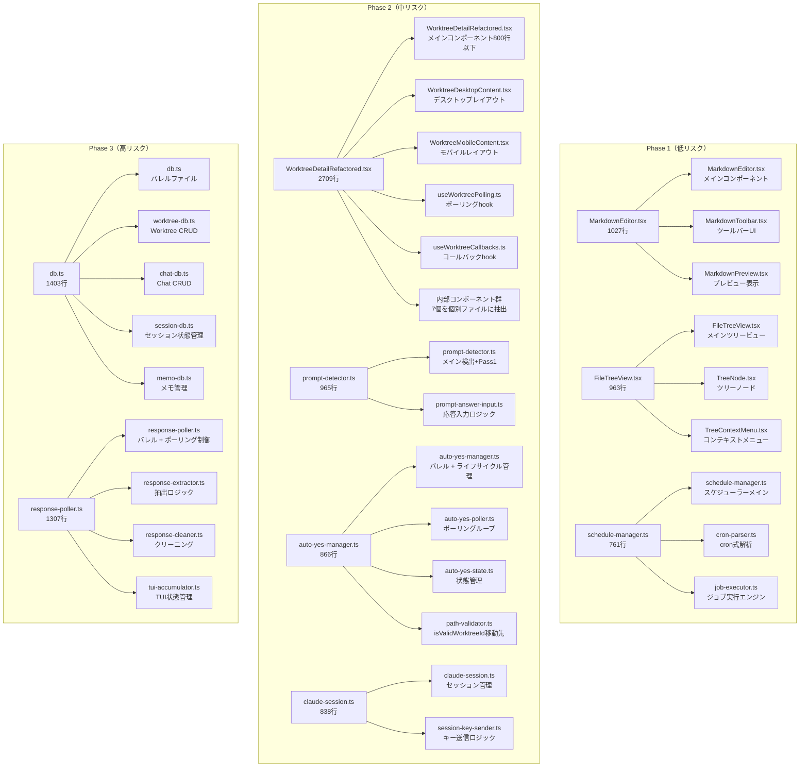

# Issue #479 設計方針書：巨大ファイル分割（R-1）

**作成日**: 2026-03-13
**Issue**: #479 refactor: 巨大ファイル分割（R-1）
**親Issue**: #475

---

## 1. 概要

300行超のファイル44個のうち、特に大きいファイル（上位10件）を責務ごとに分割し、保守性を向上させる内部リファクタリング。

### 設計原則

- **KISS**: 最小限の変更で責務分離を実現
- **YAGNI**: 将来の機能追加を見越した過剰設計はしない
- **DRY**: 重複ロジックは共通モジュールに集約
- **SOLID単一責任原則**: 各ファイルは1つの責務のみを持つ

---

## 2. アーキテクチャ設計

### 分割アーキテクチャ概要



### バレルファイル戦略

**対象**: `db.ts`、`response-poller.ts`、`auto-yes-manager.ts`

高消費者数のモジュールはバレルファイルとして残し、分割後のモジュールをre-exportすることで、既存コードのimportパスを変更せずに責務分離を実現する。

**re-exportの方針（D4-001対応）**: バレルファイルでは `export *` を使用せず、明示的な名前付きre-exportを使用する。これにより、`@internal`アノテーション付きの関数（テスト用にのみexportされる関数）が意図せず公開APIとなるリスクを防止する。各バレルファイルではpublic APIのみを列挙してre-exportし、内部関数はバレルファイルからは再公開しない。

```typescript
// db.ts（バレルファイル）- 明示的な名前付きre-export
export { getWorktrees, getWorktreeById, upsertWorktree, updateWorktreeDescription, /* ...他のpublic関数 */ } from './db/worktree-db';
export { createMessage, updateMessageContent, getMessages, /* ...他のpublic関数 */ } from './db/chat-db';
export { getSessionState, updateSessionState, /* ...他のpublic関数 */ } from './db/session-db';
export { getMemosByWorktreeId, getMemoById, createMemo, updateMemo, deleteMemo, reorderMemos } from './db/memo-db';
```

---

## 3. 技術選定

| カテゴリ | 選定技術 | 理由 |
|---------|---------|------|
| 言語/フレームワーク | TypeScript/Next.js 14 | 既存技術スタック維持 |
| モジュール分割 | ESモジュール + バレルパターン | importパス互換性を維持しつつ責務分離 |
| 状態管理 | globalThis パターン維持 | 既存の実装パターンを踏襲 |
| 循環依存チェック | madge（推奨） | 分割後の依存関係検証 |

---

## 4. 詳細設計

### 4-1. db.ts（1,403行）分割設計

#### ドメイン別責務分類

| 分割ファイル | 主要関数 | 行数目標 |
|------------|---------|---------|
| `worktree-db.ts` | getWorktrees, getWorktreeById, upsertWorktree, updateWorktreeDescription, updateLastViewedAt, getRepositories, updateFavorite, updateStatus, updateCliToolId, updateSelectedAgents, updateVibeLocalModel, updateVibeLocalContextWindow, saveInitialBranch, getInitialBranch, getWorktreeIdsByRepository, deleteRepositoryWorktrees, deleteWorktreesByIds, updateWorktreeLink | ~470行 |
| `chat-db.ts` | createMessage, updateMessageContent, getMessages, getLastUserMessage, getLastMessage, deleteAllMessages, deleteMessageById, deleteMessagesByCliTool, getMessageById, updatePromptData, markPendingPromptsAsAnswered, updateLastUserMessage, getLastAssistantMessageAt | ~350行 |
| `session-db.ts` | getSessionState, updateSessionState, setInProgressMessageId, clearInProgressMessageId, deleteSessionState | ~180行 |
| `memo-db.ts` | getMemosByWorktreeId, getMemoById, createMemo, updateMemo, deleteMemo, reorderMemos | ~150行 |
| `db.ts`（バレル） | re-export + initDatabase | ~50行 |

#### バレルファイルの段階的廃止方針

1. **Phase 3（本Issue）**: バレルファイルとして機能、全関数をre-export
2. **将来（本Issue範囲外）**: 消費者を直接importに移行し、バレルファイルを廃止
   - 直接import移行により、ツリーシェイキングの恩恵を受けられる

### 4-2. response-poller.ts（1,307行）分割設計

#### 責務別モジュール構成

```
src/lib/
├── response-poller.ts       ← バレル + ポーリング制御（startPolling, stopPolling, stopAllPolling, getActivePollers）
├── response-extractor.ts    ← 抽出ロジック（extractResponse, resolveExtractionStartIndex, isOpenCodeComplete）
├── response-cleaner.ts      ← クリーニング（cleanClaudeResponse, cleanGeminiResponse, cleanOpenCodeResponse）
└── tui-accumulator.ts       ← TUI状態（extractTuiContentLines, findOverlapIndex, initTuiAccumulator, accumulateTuiContent, getAccumulatedContent, clearTuiAccumulator）
```

#### モジュールレベル状態の配置

```typescript
// response-poller.ts
const activePollers = new Map<...>();  // ポーリング制御の責務に対応
const pollingStartTimes = new Map<...>();  // ポーリング開始時刻

// tui-accumulator.ts
const tuiAccumulators = new Map<...>();  // TUI状態管理の責務に対応
```

**状態整合性**: `stopPolling()` 実行時に `tui-accumulator.ts` の `clearTuiAccumulator()` を呼び出し、ポーリングライフサイクルとTUI状態の整合性を維持。

**モジュールスコープ変数の分割後挙動（D3-004対応）**: response-poller.tsの`activePollers`、`pollingStartTimes`、`tuiResponseAccumulator`はglobalThisパターンではなく、通常のモジュールスコープ変数として定義されている。分割後は各サブモジュール（response-poller.ts、tui-accumulator.ts）でそれぞれ独立したモジュールスコープ変数として宣言する。Node.js/Next.jsのモジュールキャッシュにより、同一モジュールは一度だけ評価されシングルトン性が保たれるため、分割後もMap状態の一意性は維持される。ただし、Next.jsのホットリロード時にはモジュールキャッシュがリセットされMap状態も初期化されるが、これは分割前後で同一の挙動であり問題ない。auto-yes-manager.tsのglobalThisパターン（ホットリロード時も状態永続）とは異なる設計判断であるが、response-poller.tsは既存実装がモジュールスコープ変数であるため、分割時にglobalThisパターンへの移行は行わず、既存の挙動を維持する。

### 4-3. auto-yes-manager.ts（866行）分割設計

```
src/lib/
├── auto-yes-manager.ts   ← バレル + ライフサイクル管理（startAutoYesPolling, stopAutoYesPolling）
├── auto-yes-poller.ts    ← ポーリングループ本体（pollAutoYes、__autoYesPollerStates Map）
└── auto-yes-state.ts     ← 状態管理（AutoYesState型、状態更新、__autoYesStates Map）
```

**バレルファイルのre-export方針（D4-001対応）**: auto-yes-manager.ts（バレル）では `export *` を使用せず、public APIのみを明示的に名前付きre-exportする。`@internal`アノテーション付きの関数（`pollAutoYes`、`captureAndStrip`、`detectAndResolve`、`scheduleNextPoll`等のテスト用export関数）はバレルファイルからはre-exportしない。テストコードから内部関数にアクセスする必要がある場合は、サブモジュール（`auto-yes-poller.ts`、`auto-yes-state.ts`）から直接importする。

```typescript
// auto-yes-manager.ts（バレル）- 明示的な名前付きre-export
export { startAutoYesPolling, stopAutoYesPolling } from './auto-yes-poller';
export { getAutoYesState, getAutoYesStatesForCleanup, /* ...他のpublic関数 */ } from './auto-yes-state';
// @internal関数（pollAutoYes, captureAndStrip等）はre-exportしない
```

**モジュール間依存の方向性**:
- `auto-yes-manager.ts` → `auto-yes-poller.ts` → `auto-yes-state.ts`
- 一方向依存のみ（循環依存なし）

**globalThis状態の実装方針（D3-003対応）**:
- **キー名の不変性**: 分割後も`globalThis.__autoYesStates`（auto-yes-state.ts内）および`globalThis.__autoYesPollerStates`（auto-yes-poller.ts内）のキー名は分割前と同一のものを使用すること。キー名を変更するとホットリロード時に既存の状態が参照できなくなり、状態リークが発生する。
- **lazy初期化パターンの維持**: 各分割モジュールでは既存の`??=`演算子によるlazy初期化パターンを維持する。具体的には、`globalThis.__autoYesStates ??= new Map()`のように、未初期化の場合のみMap生成を行う。これにより、モジュール初期化順序に依存しない安全なアクセスが保証される。
- **モジュール初期化順序**: `startAutoYesPolling()`（auto-yes-manager.ts）が`auto-yes-state.ts`の状態を参照する際、`auto-yes-state.ts`のモジュールトップレベルで`??=`による初期化が実行されるため、import順序による未初期化アクセスは発生しない。ただし、実装時に各モジュールのトップレベルで必ず`??=`初期化を行うことを確認すること。

**isValidWorktreeIdの移動**:
- 現在11のAPIルートからimportされているが、Auto-Yes機能とは無関係の汎用バリデーション関数
- `src/lib/path-validator.ts` に移動する
- **WORKTREE_ID_PATTERNの同時移動（D4-002対応）**: `isValidWorktreeId`が依存する`WORKTREE_ID_PATTERN`定数（`/^[a-zA-Z0-9_-]+$/`）も`path-validator.ts`に移動する。これにより、パスバリデーション関連のロジックと定数が`path-validator.ts`に集約され、(1) auto-yes-manager.tsからpath-validator.tsへの逆方向依存（循環依存リスク）を回避し、(2) セキュリティ監査時にパスバリデーション定数を一箇所で確認できるようになる
- **importパス変更方針（D1-006対応）**: 11のAPIルートおよびテストファイルのimportパスを本Issue内で `path-validator.ts` への直接importに一括変更する。re-exportによる後方互換性維持は行わない。理由: (1) 変更対象が11ファイルと限定的で機械的な作業でありリスクが低い、(2) re-exportの技術的負債を残さない、(3) auto-yes-manager.tsの責務を純粋に保てる

### 4-4. WorktreeDetailRefactored.tsx（2,709行）分割設計

**目標**: メインファイル800行以下、分割後各ファイル500行以下

```
src/components/worktree/
├── WorktreeDetailRefactored.tsx    ← メインコンポーネント（~800行）
├── WorktreeDesktopContent.tsx      ← デスクトップレイアウト
├── WorktreeMobileContent.tsx       ← モバイルレイアウト
├── WorktreeInfoFields.tsx          ← 内部コンポーネント
├── DesktopHeader.tsx
├── InfoModal.tsx
├── LoadingIndicator.tsx
├── ErrorDisplay.tsx
├── MobileInfoContent.tsx
└── MobileContent.tsx
```

```
src/hooks/
├── useWorktreePolling.ts     ← ポーリング・WebSocketロジック
└── useWorktreeCallbacks.ts   ← コールバック群
```

### 4-5. prompt-detector.ts（965行）分割設計

**分割方針**: prompt-detector.tsは3つのexport関数（detectPrompt, getAnswerInput, resetDetectPromptCache）を持つ。内部ロジックの大半はPass1/Pass2検出と応答入力処理で構成されるため、以下のように分割する。

```
src/lib/
├── prompt-detector.ts        ← メイン検出ロジック（detectPrompt, resetDetectPromptCache, Pass1/Pass2内部関数）
└── prompt-answer-input.ts    ← 応答入力ロジック（getAnswerInput および関連内部ヘルパー）
```

**行数目標の例外規定**: prompt-detector.tsは内部関数の結合度が高く、Pass1/Pass2ロジックの機械的分離は凝集度を損なう。そのため、分割後のprompt-detector.tsは800行以下を目標とする（500行以下の標準基準の例外）。prompt-answer-input.tsは200行以下を目標とする。

**判断根拠**: getAnswerInputは検出結果に基づく応答生成という独立した責務を持ち、分離が自然である。一方、Pass1/Pass2は相互に依存する検出パイプラインであり、これを分離すると引数の受け渡しが複雑化するため、同一ファイルに維持する。

### 4-6. claude-session.ts（838行）分割設計

**分割方針**: claude-session.tsはセッションのライフサイクル管理（起動・停止・ヘルスチェック）とキー送信制御を担っている。キー送信関連のロジックを`session-key-sender.ts`に抽出する。

**注意点**: `sendKeys`および`sendSpecialKey`はclaude-session.ts内部の関数ではなく、`tmux.ts`からimportされている外部関数である。`session-key-sender.ts`に抽出する対象は、これらtmux関数を呼び出す際のラッパーロジック（セッションID解決、入力バリデーション、エラーハンドリング等）である。

```
src/lib/
├── claude-session.ts        ← セッションライフサイクル管理（startSession, stopSession, getSessionHealth, isSessionAlive 等）
└── session-key-sender.ts    ← キー送信制御（sendKeysToSession, sendSpecialKeyToSession 等のtmux.sendKeys/sendSpecialKeyラッパー）
```

#### モジュール構成

| 分割ファイル | 責務 | 行数目標 |
|------------|------|---------|
| `claude-session.ts` | セッション起動・停止・ヘルスチェック・状態管理 | ~600行 |
| `session-key-sender.ts` | tmux.sendKeys/sendSpecialKeyのラッパー、セッションIDバリデーション、キー送信エラーハンドリング | ~250行 |

**モジュール間依存の方向性**:
- `session-key-sender.ts` → `tmux.ts`（sendKeys, sendSpecialKey のimport）
- `claude-session.ts` → `session-key-sender.ts`（キー送信処理の委譲）
- 一方向依存のみ（循環依存なし）

---

## 5. セキュリティ設計

本Issueは内部リファクタリングであり、セキュリティに関する新たなリスクは発生しない。ただし以下に注意する：

- **APIルート側の変更は最小限**: バレルファイル戦略により大半のimportパスは変更しない。例外として `isValidWorktreeId` のimportパスを11のAPIルートで `path-validator.ts` に変更する（セクション4-3参照）
- **入力バリデーション維持**: `isValidWorktreeId` を `path-validator.ts` に移動する際、バリデーションロジックを変更しない
- **バリデーション定数の集約（D4-002対応）**: `isValidWorktreeId`が依存する`WORKTREE_ID_PATTERN`定数も`path-validator.ts`に同時移動する。パスバリデーションに関連する関数と定数を一箇所に集約することで、セキュリティ監査の容易さが向上する
- **パスバリデーション**: `path-validator.ts` への移動により、パスバリデーション関数と定数の集約化が実現し、将来的なセキュリティ監査がしやすくなる

---

## 6. パフォーマンス設計

- **バレルファイルのオーバーヘッド**: 最小限（re-exportのみ）
- **将来のツリーシェイキング**: バレルファイル廃止後にバンドルサイズ削減が期待できる
- **モジュール初期化**: globalThisパターンによる状態管理は分割後も同じ挙動を維持

---

## 7. テスト戦略

### 影響を受けるテストファイル（推定56ファイル以上）

| フェーズ | バレルファイル対象 | importパス変更不要 |
|---------|--------------|--------------|
| Phase 3 | db.ts, response-poller.ts | ✅ |

### response-poller.tsテストファイル対応表

| 既存テストファイル | 分割後の対応先 |
|---|---|
| `response-poller.test.ts` | `response-cleaner.test.ts` へリネーム |
| `response-poller-opencode.test.ts` | `response-cleaner-opencode.test.ts` + `response-extractor-opencode.test.ts` に分割 |
| `response-poller-tui-accumulator.test.ts` | `tui-accumulator.test.ts` へリネーム |
| `resolve-extraction-start-index.test.ts` | `response-extractor.test.ts` へリネーム |

### auto-yes-manager.tsテストファイル対応表

| 既存テストファイル | 分割後の対応先 |
|---|---|
| `auto-yes-manager.test.ts` | `auto-yes-poller.test.ts` + `auto-yes-state.test.ts` に分割 |
| `auto-yes-manager-cleanup.test.ts` | `auto-yes-poller.test.ts` に統合 |
| `session-cleanup-issue404.test.ts` | importモック先を `auto-yes-poller.ts` に更新 |
| `resource-cleanup.test.ts` | import先を更新 |
| `api/git-log.test.ts` | `isValidWorktreeId` importを `path-validator.ts` に更新 |
| `api/git-diff.test.ts` | `isValidWorktreeId` importを `path-validator.ts` に更新 |
| `api/git-show.test.ts` | `isValidWorktreeId` importを `path-validator.ts` に更新 |
| `auto-yes-persistence.test.ts` | import先を `auto-yes-state.ts` に更新 |

### vi.mockバレル互換性検証計画（D3-001対応）

バレルファイル戦略により、`vi.mock('@/lib/db', ...)`や`vi.mock('@/lib/response-poller', ...)`等のモックパスは分割前後で変更不要となる。しかし、vi.mockの内部で返却するモック関数が分割後のモジュール構造と不整合を起こす可能性がある。以下の手順で各Phase完了時に互換性を検証する。

**検証手順**:
1. `vi.mock('@/lib/db')` を使用するテストファイル（20件以上：terminal-route.test.ts、special-keys-route.test.ts、capture-route.test.ts、git-show.test.ts、git-log.test.ts、git-diff.test.ts、tmux-capture-invalidation.test.ts、ws-server-terminal.test.ts、api-search.test.ts、api-worktree-slash-commands.test.ts、files-304.test.ts等）が全てパスすることを確認
2. `vi.mock('@/lib/response-poller')` を使用するテストファイルが全てパスすることを確認
3. `vi.mock('@/lib/auto-yes-manager')` を使用するテストファイル（session-cleanup-issue404.test.ts、resource-cleanup.test.ts等）が全てパスすることを確認
4. モック内でreturnされる関数名がバレルファイル経由でre-exportされていることを確認（例: `vi.mock('@/lib/db', () => ({ getWorktrees: vi.fn() }))` がバレルファイル経由で正しく解決されること）

**検証タイミング**:
- Phase 2完了時: auto-yes-manager.tsのバレル互換性を検証
- Phase 3完了時: db.ts、response-poller.tsのバレル互換性を検証
- 各Phase完了時に `npm run test:unit` を実行し、vi.mock関連の失敗がないことを確認

### 検証コマンド（各Phase完了時）

```bash
npm run test:unit
npm run lint
npx tsc --noEmit
# 循環依存チェック（推奨）
npx madge --circular src/
```

---

## 8. 実施フェーズ

| フェーズ | 対象ファイル | リスク | 消費者数 |
|---------|------------|-------|--------|
| Phase 1 | MarkdownEditor.tsx, FileTreeView.tsx, schedule-manager.ts | 低 | 0〜2 |
| Phase 2 | WorktreeDetailRefactored.tsx, prompt-detector.ts, auto-yes-manager.ts, claude-session.ts | 中 | 〜20 |
| Phase 3 | db.ts（先行）→ response-poller.ts（後続） | 高 | 87、11 |

**Phase 3内の実施順序**: response-poller.tsはdb.tsから6関数をimportしているため、db.tsのバレルファイル化を先行して完了させること。

### ファサードモジュールへの波及影響（D3-002対応）

以下のファサードモジュールは複数の分割対象モジュールに依存しており、各フェーズでの影響を把握しておく必要がある。

**session-cleanup.ts**:
- `response-poller.ts`（Phase 3）、`auto-yes-manager.ts`（Phase 2）、`schedule-manager.ts`（Phase 1）からimport
- バレルファイル戦略によりimportパスの変更は不要だが、Phase 1/2/3の各完了時にsession-cleanup.tsのテストが引き続きパスすることを確認する

**resource-cleanup.ts**:
- `auto-yes-manager.ts`（Phase 2）、`schedule-manager.ts`（Phase 1）からimport
- 特に`resource-cleanup.ts`は`auto-yes-manager.ts`の内部状態（`autoYesStates`、`autoYesPollerStates`）に`getAutoYesStatesForCleanup`等の関数経由でアクセスしている
- Phase 2（auto-yes-manager.ts分割）実施時に、`getAutoYesStatesForCleanup`が`auto-yes-state.ts`に配置される場合、バレルファイル（auto-yes-manager.ts）経由でre-exportされることを確認する
- resource-cleanup.test.tsのvi.mock対象がバレルファイル経由で正しく動作することをPhase 2完了時に検証する

| フェーズ | 影響を受けるファサードモジュール | 確認事項 |
|---------|--------------------------|---------|
| Phase 1 | session-cleanup.ts, resource-cleanup.ts | schedule-manager.ts分割後のimport解決確認 |
| Phase 2 | session-cleanup.ts, resource-cleanup.ts | auto-yes-manager.ts分割後のバレル経由import確認、resource-cleanup.tsの内部状態アクセス確認 |
| Phase 3 | session-cleanup.ts | response-poller.ts分割後のバレル経由import確認 |

---

## 9. 設計上のトレードオフ

| 決定事項 | 理由 | トレードオフ |
|---------|------|-------------|
| バレルファイル戦略採用 | importパス互換性維持（消費者87件への影響回避） | バレル維持コスト、将来的な廃止作業が必要 |
| 段階的フェーズ実施 | リスク分散、各Phaseで動作確認可能 | 全体完了までの期間が長くなる |
| メインファイル800行目標 | WorktreeDetailRefactored.tsxの500行は非現実的 | 目標行数が他ファイルと異なり一貫性が低い |
| globalThisパターン維持 | 既存の実装パターンを踏襲し、動作変更リスクを排除 | テストでのモックが複雑になる可能性 |

---

## 10. CLAUDE.md更新方針

各Phase完了時にCLAUDE.mdの主要モジュール一覧を更新する：
- 分割前のモジュールエントリを削除
- 分割後の新モジュールをIssue番号（#479）付きで追加

---

## 11. R-3（Issue #481）との関係

本Issue（R-1）とR-3（src/lib再整理）は並行実施可能だが、以下の注意が必要：

- **db.ts分割とsrc/lib再整理の競合リスク**: R-3でdb.tsを`src/lib/db/index.ts`に移動する場合、TypeScriptの`moduleResolution: "bundler"`設定により`@/lib/db`はディレクトリインデックスとして解決されるため、消費者側のimportパス変更は不要。ただしR-3実施時にtsconfig.jsonとの整合性を検証すること。
- **推奨**: R-1のdb.ts分割（Phase 3）とR-3のディレクトリ再整理を統合して一度に実施することを検討する。

---

## 12. 受け入れ基準

- [ ] 分割後の各ファイルが500行以下（メインファイルは800行以下も許容、prompt-detector.tsは800行以下を許容：セクション4-5参照）
- [ ] 既存テストが全パス（`npm run test:unit`）
- [ ] 公開APIの変更なし（バレルファイルによるre-exportでimportパス維持）
- [ ] `npm run lint && npx tsc --noEmit` がパス
- [ ] 循環依存が発生していないこと（`npx madge --circular src/` で確認）
- [ ] テストカバレッジが分割前と同等以上
- [ ] CLAUDE.mdの主要モジュール一覧が更新されていること
- [ ] `isValidWorktreeId`が`path-validator.ts`に移動されていること

---

---

## 13. レビュー指摘反映サマリー

### Stage 1 レビュー（2026-03-13）

| ID | 重要度 | タイトル | 対応内容 |
|----|--------|---------|---------|
| D1-001 | should_fix | session-db.tsの責務混在 | セクション4-1のテーブルからメモ管理関数をmemo-db.tsとして分離。Mermaidダイアグラム（セクション2）との整合性を確保。 |
| D1-002 | should_fix | prompt-detector.ts（965行）の分割方針不明 | セクション4-5を新設。prompt-answer-input.tsへのgetAnswerInput分離方針と、800行以下の例外目標を明記。受け入れ基準（セクション12）にも例外を反映。 |
| D1-006 | should_fix | isValidWorktreeIdの移行範囲不明確 | セクション4-3を更新。re-exportではなく、11のAPIルートのimportパスを本Issue内で直接変更する方針を明記。セクション5のセキュリティ設計にも反映。 |

### 実装チェックリスト（D1指摘対応分）

- [ ] **D1-001**: session-db.tsからメモ管理関数を分離し、memo-db.tsを作成する
- [ ] **D1-001**: db.ts（バレル）にmemo-db.tsのre-exportを追加する
- [ ] **D1-002**: prompt-detector.tsからgetAnswerInputをprompt-answer-input.tsに抽出する
- [ ] **D1-002**: 分割後のprompt-detector.tsが800行以下であることを確認する
- [ ] **D1-006**: isValidWorktreeIdをpath-validator.tsに移動する
- [ ] **D1-006**: 11のAPIルートのimportパスをauto-yes-managerからpath-validatorに変更する
- [ ] **D1-006**: auto-yes-manager.tsからisValidWorktreeIdのre-exportを削除する（re-export不要）

### Stage 2 レビュー（2026-03-13）- 整合性レビュー

| ID | 重要度 | タイトル | 対応内容 |
|----|--------|---------|---------|
| D2-001 | should_fix | updateWorktreeLinkがsession-db.tsに誤配置 | セクション4-1のテーブルでupdateWorktreeLinkをsession-db.tsからworktree-db.tsに移動。行数目標をworktree-db.ts ~470行、session-db.ts ~180行に調整。 |
| D2-002 | should_fix | claude-session.ts分割の詳細設計セクションが欠落 | セクション4-6を新設。session-key-sender.tsに抽出する具体的な責務（tmux.sendKeys/sendSpecialKeyのラッパーロジック）と行数目標を明記。sendKeys/sendSpecialKeyがtmux.tsの外部関数である点を注記。 |

### 実装チェックリスト（D2指摘対応分）

- [ ] **D2-001**: updateWorktreeLinkをworktree-db.tsに配置する（session-db.tsではなく）
- [ ] **D2-001**: worktree-db.tsの行数が~470行以内であることを確認する
- [ ] **D2-002**: claude-session.tsからキー送信ラッパーロジックをsession-key-sender.tsに抽出する
- [ ] **D2-002**: session-key-sender.tsがtmux.tsのsendKeys/sendSpecialKeyをimportする構成であることを確認する
- [ ] **D2-002**: claude-session.tsが~600行以下、session-key-sender.tsが~250行以下であることを確認する

### Stage 3 レビュー（2026-03-13）- 影響分析レビュー

| ID | 重要度 | タイトル | 対応内容 |
|----|--------|---------|---------|
| D3-001 | should_fix | vi.mockパス更新が必要なテストファイルの網羅的特定が不完全 | セクション7に「vi.mockバレル互換性検証計画」を新設。vi.mock使用テストファイルの一覧と、各Phase完了時の検証手順を明記。 |
| D3-002 | should_fix | session-cleanup.tsとresource-cleanup.tsへの波及影響が未分析 | セクション8に「ファサードモジュールへの波及影響」を新設。各フェーズで影響を受けるファサードモジュールと確認事項を表形式で整理。resource-cleanup.tsの内部状態アクセスについても記載。 |
| D3-003 | should_fix | auto-yes-manager.tsのglobalThisパターン分割時の状態整合性設計が不十分 | セクション4-3に「globalThis状態の実装方針」を追記。キー名の不変性（`__autoYesStates`、`__autoYesPollerStates`）、`??=`によるlazy初期化パターンの維持、モジュール初期化順序の安全性を明記。 |
| D3-004 | should_fix | response-poller.tsのモジュールレベルMap分割時のライフサイクル整合性が曖昧 | セクション4-2のモジュールレベル状態の配置に追記。モジュールスコープ変数（非globalThis）の分割後挙動、モジュールキャッシュによるシングルトン性維持、ホットリロード時の挙動について明記。 |

### 実装チェックリスト（D3指摘対応分）

- [ ] **D3-001**: 各Phase完了時にvi.mockバレル互換性検証手順を実施する
- [ ] **D3-001**: Phase 3完了時にdb.tsのvi.mock使用テスト（20件以上）が全てパスすることを確認する
- [ ] **D3-002**: Phase 1完了時にsession-cleanup.ts、resource-cleanup.tsのテストがパスすることを確認する
- [ ] **D3-002**: Phase 2完了時にresource-cleanup.tsの内部状態アクセス（getAutoYesStatesForCleanup等）がバレル経由で正しく動作することを確認する
- [ ] **D3-003**: auto-yes-state.tsでglobalThis.__autoYesStatesのキー名を分割前と同一にする
- [ ] **D3-003**: auto-yes-poller.tsでglobalThis.__autoYesPollerStatesのキー名を分割前と同一にする
- [ ] **D3-003**: 各分割モジュールのトップレベルで`??=`によるlazy初期化を行う
- [ ] **D3-004**: response-poller.tsとtui-accumulator.tsの状態をモジュールスコープ変数として宣言する（globalThisパターンへの移行は行わない）

### Stage 4 レビュー（2026-03-13）- セキュリティレビュー

| ID | 重要度 | タイトル | 対応内容 |
|----|--------|---------|---------|
| D4-001 | should_fix | バレルファイルのexport *によるinternal関数の意図しない公開範囲拡大 | セクション2のバレルファイル戦略に「明示的な名前付きre-exportを使用し、export *を避ける」方針を追記。セクション4-3のauto-yes-manager.tsバレル設計にも具体的なre-export例と@internal関数の除外方針を追記。 |
| D4-002 | should_fix | isValidWorktreeId移動時にWORKTREE_ID_PATTERNも同時移動する設計が未明記 | セクション4-3のisValidWorktreeId移動方針に「WORKTREE_ID_PATTERN定数もpath-validator.tsに移動する」を追記。セクション5のセキュリティ設計にもバリデーション定数の集約を反映。 |

### 実装チェックリスト（D4指摘対応分）

- [ ] **D4-001**: db.ts（バレル）で`export *`ではなく明示的な名前付きre-exportを使用する
- [ ] **D4-001**: auto-yes-manager.ts（バレル）で`export *`ではなく明示的な名前付きre-exportを使用する
- [ ] **D4-001**: response-poller.ts（バレル）で`export *`ではなく明示的な名前付きre-exportを使用する
- [ ] **D4-001**: @internal関数がバレルファイルからre-exportされていないことを確認する
- [ ] **D4-002**: WORKTREE_ID_PATTERN定数をisValidWorktreeIdと共にpath-validator.tsに移動する
- [ ] **D4-002**: auto-yes-manager.tsにWORKTREE_ID_PATTERNが残っていないことを確認する

---

*設計方針書 generated for Issue #479*
