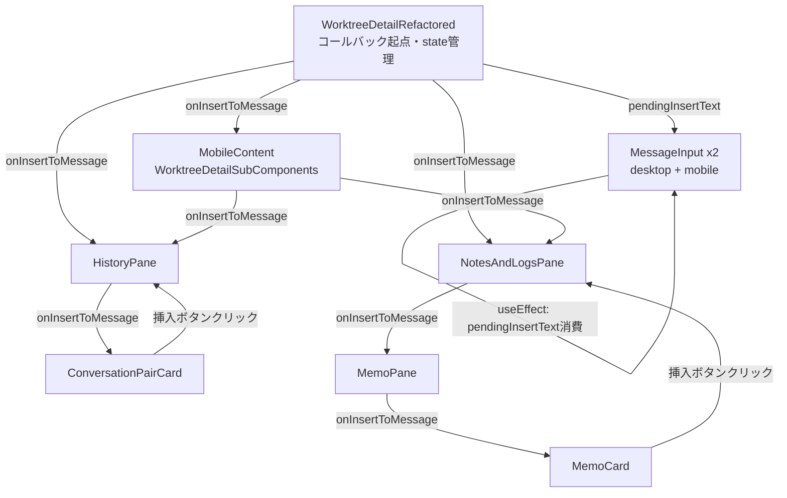
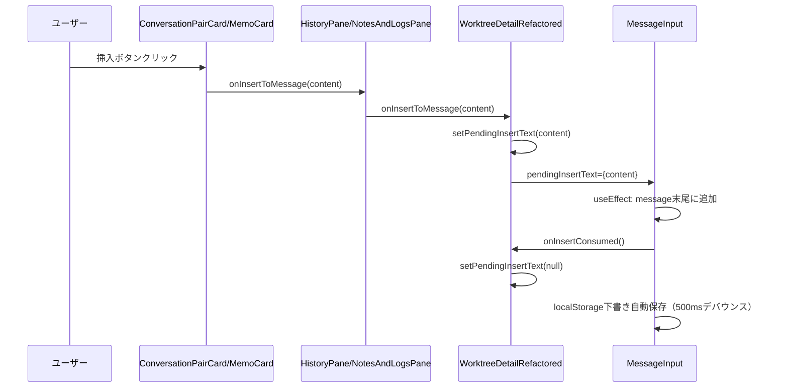

# 設計方針書: Issue #485 履歴・メモからメッセージ入力欄への挿入機能

**作成日**: 2026-03-13
**Issue**: [#485 履歴、cmate_noteから選択してメッセージに初期表示したい](https://github.com/Kewton/CommandMate/issues/485)

---

## 1. 概要

履歴（過去のユーザーメッセージ）やWorktreeMemo（Notes）に「入力欄に挿入」ボタンを追加し、クリックするとメッセージ入力欄（MessageInput）のテキスト末尾に選択内容が挿入される機能を実装する。

---

## 2. アーキテクチャ設計

### システム構成図



### コンポーネント配置

- **プレゼンテーション層**: ConversationPairCard, MemoCard（挿入ボタンUI）
- **コールバック伝播層**: HistoryPane, MemoPane, NotesAndLogsPane（コールバック中継）
- **状態管理層**: WorktreeDetailRefactored（`pendingInsertText` state保持）
- **テキスト消費層**: MessageInput（useEffectでpendingInsertTextを消費）

---

## 3. 技術選定

### MessageInputへの外部テキスト挿入方式

**採用: `pendingInsertText` props パターン（推奨）**

| 比較項目 | pendingInsertText props | useImperativeHandle + forwardRef |
|---------|------------------------|----------------------------------|
| 既存コードへの影響 | 低（propsを追加するのみ） | 高（memo + forwardRefのネスト） |
| デスクトップ/モバイル2箇所対応 | 容易（同じpropsを渡す） | 複雑（2つのrefを管理） |
| TypeScript型安全性 | 高 | 高 |
| テスト容易性 | 高（propsのテストが容易） | 中（refのテストはやや複雑） |
| 実装複雑度 | 低 | 高 |

**理由**: MessageInputはデスクトップ/モバイルで2箇所レンダリングされており、forwardRefパターンでは2つのrefを管理する必要がある。また現在memo()でラップされているため、memo(forwardRef(...))と変更が大きい。pendingInsertTextパターンは既存のprops-drivenな設計と一貫性が高い。

### 挿入ボタンUIデザイン

**採用: 既存のCopyボタンパターンを踏襲**

```typescript
// アイコン: lucide-react の ArrowDownToLine（または CornerDownLeft）
import { ArrowDownToLine } from 'lucide-react';

// スタイルクラス（MemoCardのCopyボタンパターン）
const insertButtonClass = "p-1 text-gray-400 dark:text-gray-500 hover:text-cyan-600 dark:hover:text-cyan-400 transition-colors rounded";
```

---

## 4. 詳細設計

### 4-1. WorktreeDetailRefactored.tsx の変更

```typescript
// state追加
const [pendingInsertText, setPendingInsertText] = useState<string | null>(null);

// コールバック定義（useCallbackでメモ化）
const handleInsertToMessage = useCallback((content: string) => {
  setPendingInsertText(content);
}, []);

// leftPaneMemoの依存配列に handleInsertToMessage を追加
// **D2-009**: 実際の実装では LeftPaneTabSwitcher によるタブ切り替えで排他的に表示される。
// HistoryPane への追加は `historySubTab === 'message'` ブロック内、
// NotesAndLogsPane への追加は `leftPaneTab === 'memo'` ブロック内で行うこと。
const leftPaneMemo = useMemo(() => (
  <>
    {/* historySubTab === 'message' ブロック内 */}
    <HistoryPane
      ...
      onInsertToMessage={handleInsertToMessage}  // 追加
    />
    {/* leftPaneTab === 'memo' ブロック内 */}
    <NotesAndLogsPane
      ...
      onInsertToMessage={handleInsertToMessage}  // 追加
    />
  </>
), [
  ...,
  handleInsertToMessage,  // 依存配列に追加（必須）
]);

// onInsertConsumed コールバックも useCallback でメモ化（D2-002: インライン関数ではなく安定参照を渡す）
const handleInsertConsumed = useCallback(() => setPendingInsertText(null), []);

// MessageInputにpendingInsertTextを渡す（デスクトップ/モバイル両方）
<MessageInput
  ...
  pendingInsertText={pendingInsertText}
  onInsertConsumed={handleInsertConsumed}
/>
```

### 4-2. MessageInput.tsx の変更

```typescript
// Props型の拡張
export interface MessageInputProps {
  worktreeId: string;
  onMessageSent?: (cliToolId: CLIToolType) => void;
  cliToolId?: CLIToolType;
  isSessionRunning?: boolean;
  pendingInsertText?: string | null;      // 追加
  onInsertConsumed?: () => void;           // 追加
}

// pendingInsertText消費のuseEffect
//
// 【前提条件 (D3-003)】:
// - pendingInsertText は初回レンダリング時に null であることを前提とする。
//   コンポーネントマウント時に pendingInsertText が非 null の場合、
//   localStorage 復元後のテキストに追加される動作となる。
// - if (!pendingInsertText) return により、初回マウント時（pendingInsertText = null）は
//   安全にスキップされる。既存の localStorage 下書き復元 useEffect（行72-84）との
//   競合は発生しない。
useEffect(() => {
  if (!pendingInsertText) return;

  setMessage(prev => {
    if (prev.trim() === '') {
      return pendingInsertText;
    }
    return prev + '\n\n' + pendingInsertText;
  });

  onInsertConsumed?.();
}, [pendingInsertText, onInsertConsumed]);
```

**注意**: `onInsertConsumed`を依存配列に含めるため、WorktreeDetailRefactored側でuseCallbackでラップすること。

### 4-3. ConversationPairCard.tsx の変更

```typescript
// Props型の拡張
export interface ConversationPairCardProps {
  pair: ConversationPair;
  onFilePathClick: (path: string) => void;
  isExpanded?: boolean;
  onToggleExpand?: () => void;
  onCopy?: (content: string) => void;
  onInsertToMessage?: (content: string) => void;  // 追加
}

// **D2-003**: ConversationPairCard 内部では UserMessageSection サブコンポーネントに
// onInsertToMessage を props として明示的に渡す必要がある。
// UserMessageSection は onCopy と同様に onInsertToMessage を個別の props として受け取る形式である。
// UserMessageSection の Props 型にも onInsertToMessage?: (content: string) => void を追加すること。

// UserMessageSection内に挿入ボタンを追加
// 既存のCopyボタンの隣に配置
{onInsertToMessage && (
  <button
    onClick={() => onInsertToMessage(userMessage.content)}
    className="absolute top-2 right-10 p-1 text-gray-400 hover:text-cyan-400 bg-gray-800/80 rounded transition-colors"
    title="Insert to message input"
    data-testid="insert-user-message"
  >
    <ArrowDownToLine size={14} />
  </button>
)}
```

### 4-4. MemoCard.tsx の変更

```typescript
// Props型の拡張
export interface MemoCardProps {
  memo: WorktreeMemo;
  onUpdate: (memoId: string, data: { title?: string; content?: string }) => Promise<void>;
  onDelete: (memoId: string) => void;
  isSaving?: boolean;
  error?: string | null;
  className?: string;
  onInsertToMessage?: (content: string) => void;  // 追加
}

// 既存Copyボタンの隣に挿入ボタンを追加
{onInsertToMessage && (
  <button
    onClick={() => onInsertToMessage(content)}
    className="p-1 text-gray-400 dark:text-gray-500 hover:text-cyan-600 dark:hover:text-cyan-400 transition-colors rounded"
    title="Insert to message input"
    data-testid="insert-memo-content"
  >
    <ArrowDownToLine size={14} />
  </button>
)}
```

### 4-5. HistoryPane.tsx の変更

```typescript
// Props型の拡張
export interface HistoryPaneProps {
  messages: ChatMessage[];
  worktreeId: string;
  onFilePathClick: (path: string) => void;
  isLoading?: boolean;
  className?: string;
  showToast?: (message: string, type?: 'success' | 'error' | 'info') => void;
  onInsertToMessage?: (content: string) => void;  // 追加
}

// ConversationPairCardにonInsertToMessageを伝播
<ConversationPairCard
  key={pair.id}
  pair={pair}
  onFilePathClick={onFilePathClick}
  isExpanded={isExpanded}
  onToggleExpand={toggleHandler}
  onCopy={handleCopy}
  onInsertToMessage={onInsertToMessage}  // 追加（そのまま伝播）
/>
```

### 4-6. MemoPane.tsx の変更

```typescript
// Props型の拡張
export interface MemoPaneProps {
  worktreeId: string;
  className?: string;
  onInsertToMessage?: (content: string) => void;  // 追加
}

// MemoCardにonInsertToMessageを伝播
<MemoCard
  key={memo.id}
  memo={memo}
  onUpdate={handleUpdateMemo}
  onDelete={handleDeleteMemo}
  onInsertToMessage={onInsertToMessage}  // 追加
/>
```

### 4-7. NotesAndLogsPane.tsx の変更

```typescript
// Props型の拡張
export interface NotesAndLogsPaneProps {
  worktreeId: string;
  className?: string;
  selectedAgents: CLIToolType[];
  onSelectedAgentsChange: (agents: CLIToolType[]) => void;
  maxAgents?: number;
  vibeLocalModel: string | null;
  onVibeLocalModelChange: (model: string | null) => void;
  vibeLocalContextWindow?: number | null;
  onVibeLocalContextWindowChange?: (value: number | null) => void;
  onInsertToMessage?: (content: string) => void;  // 追加
}

// notes サブタブの MemoPane 呼び出し箇所にコールバック伝播（114行目付近）
{activeSubTab === 'notes' && (
  <MemoPane
    worktreeId={worktreeId}
    className="h-full"
    onInsertToMessage={onInsertToMessage}  // 追加
  />
)}
```

### 4-8. WorktreeDetailSubComponents.tsx の変更（MobileContent）

```typescript
// (D3-007) MobileContent への onInsertToMessage 伝播: 4つの変更ポイント

// (1) MobileContentProps に onInsertToMessage を追加
export interface MobileContentProps {
  // ...既存props
  onInsertToMessage?: (content: string) => void;  // 追加
}

// (2) MobileContent 内部の HistoryPane（行829付近）に伝播
<HistoryPane
  ...
  onInsertToMessage={onInsertToMessage}  // 追加
/>

// (3) MobileContent 内部の NotesAndLogsPane（行885付近）に伝播
<NotesAndLogsPane
  ...
  onInsertToMessage={onInsertToMessage}  // 追加
/>

// (4) WorktreeDetailRefactored.tsx 内の MobileContent 呼び出し箇所で指定
<MobileContent
  ...
  onInsertToMessage={handleInsertToMessage}  // 追加
/>
```

---

## 5. データフロー設計

### 挿入操作のシーケンス



### 挿入ロジック

```typescript
// MessageInput内のuseEffect
setMessage(prev => {
  if (prev.trim() === '') {
    return pendingInsertText;           // 入力欄が空 → そのまま挿入
  }
  return prev + '\n\n' + pendingInsertText;  // 既存テキストあり → 改行2つを挟んで末尾に追加
});
```

---

## 6. セキュリティ設計

- **XSS対策**: メッセージ内容はReactの標準レンダリングで表示済み（自動エスケープ）。挿入処理はテキスト操作のみで、HTMLを直接操作しない
- **入力サニタイズ**: 挿入するコンテンツはDBから取得済みの値。追加のサニタイズは不要
- **パス検証**: 変更なし（既存のセキュリティ層に影響なし）

---

## 7. パフォーマンス設計

- **再レンダリング最小化**: `handleInsertToMessage`を`useCallback`でメモ化し、`leftPaneMemo`の不要な再計算を防ぐ
- **memo()との整合**: 全コンポーネントがmemo()でラップされているため、propsが変わらない限り再レンダリングされない
- **pendingInsertTextのリセット**: onInsertConsumedコールバックで即座にnullにリセット → MessageInputへの不要な再レンダリングを防ぐ
- **レンダリングサイクル (D3-001)**: 挿入操作1回あたり2回のレンダリングサイクルが発生する。(1) `setPendingInsertText(content)` によるレンダリング、(2) `onInsertConsumed` 経由の `setPendingInsertText(null)` によるレンダリング。React 18 の automatic batching は useEffect 内の setState には適用されないため、この2回のレンダリングは避けられない。ただし `memo()` / `useMemo()` により実 DOM 更新は最小限に抑えられ、実用上のパフォーマンス影響は軽微である
- **デスクトップ/モバイル排他レンダリングの安全性 (D3-010)**: デスクトップとモバイルは `isMobile` 条件分岐で排他的にレンダリングされるため、`pendingInsertText` を両方の MessageInput に渡しても一方のみが実際にマウントされ、useEffect も一方のみで実行される。両方に props を渡す設計は安全である

---

## 8. テスト設計

### ユニットテスト対象

| テストファイル | テスト内容 | 新規/更新 |
|-------------|-----------|--------|
| `tests/unit/components/worktree/MessageInput.test.tsx` | pendingInsertText受け取り時の末尾追加、空入力時の直接挿入、onInsertConsumedの呼び出し | 更新 |
| `tests/unit/components/worktree/ConversationPairCard.test.tsx` | 挿入ボタン表示確認、クリック時のonInsertToMessage呼び出し | 新規作成 |
| `tests/unit/components/worktree/MemoCard.test.tsx` | 挿入ボタン表示確認、クリック時のonInsertToMessage呼び出し | 更新 |
| `tests/unit/components/HistoryPane.test.tsx` | onInsertToMessageのConversationPairCardへの伝播 | 更新 |

> **注記 (D2-007)**: HistoryPane のテストファイルは `tests/unit/components/HistoryPane.test.tsx` に存在する（`worktree/` サブディレクトリではない）。他のコンポーネントテスト（MemoCard, MemoPane, NotesAndLogsPane 等）は `tests/unit/components/worktree/` 配下にあるが、HistoryPane は歴史的経緯によりディレクトリ構成が異なる。新規テスト追加のタイミングで `tests/unit/components/worktree/HistoryPane.test.tsx` への移動を検討すること。
| `tests/unit/components/worktree/MemoPane.test.tsx` | onInsertToMessageのMemoCardへの伝播 | 更新 |
| `tests/unit/components/worktree/NotesAndLogsPane.test.tsx` | onInsertToMessageのMemoPane（notesタブ）への伝播 | 更新 |

> **注記 (D3-005)**: NotesAndLogsPane.test.tsx では MemoPane がモック化されている（行13-16付近）。`onInsertToMessage` の伝播テストを追加する場合、MemoPane のモックが `onInsertToMessage` props を受け取れるよう更新が必要である。
| `tests/unit/components/worktree/WorktreeDetailSubComponents.test.tsx` | MobileContentのonInsertToMessage伝播（任意・新規作成） | 任意新規 |

### 主要テストケース

```typescript
// MessageInput
it('should append text to end with double newline when input has existing text', () => {
  const { getByTestId } = render(<MessageInput ... pendingInsertText="new text" />);
  expect(getByTestId('message-input')).toHaveValue('existing\n\nnew text');
});

it('should insert directly when input is empty', () => {
  const { getByTestId } = render(<MessageInput ... pendingInsertText="new text" />);
  expect(getByTestId('message-input')).toHaveValue('new text');
});

it('should call onInsertConsumed after insertion', () => {
  const onInsertConsumed = vi.fn();
  render(<MessageInput ... pendingInsertText="text" onInsertConsumed={onInsertConsumed} />);
  expect(onInsertConsumed).toHaveBeenCalled();
});
```

---

## 9. 設計上の決定事項とトレードオフ

| 決定事項 | 採用案 | 理由 | トレードオフ |
|---------|------|------|-------------|
| MessageInput挿入方式 | pendingInsertText props | デスクトップ/モバイル2箇所対応が容易、memo()との親和性 | 親コンポーネントでstateを持つ必要がある |
| コールバック伝播方式 | props経由のバケツリレー | 既存パターンと一貫性、依存関係が明確 | 中間コンポーネントのpropsが増える |
| 挿入ボタンのアイコン | lucide-react ArrowDownToLine | 既存のCopyボタンと統一感 | lucide-reactに依存 |
| 挿入区切り文字 | `\n\n`（改行2つ） | 明確な視覚的区切り | 空行が挿入されるため短いメモには過剰な可能性 |
| 新規APIの追加 | なし | UIのみの変更、既存データ取得フロー活用 | - |

### 9-1. WorktreeDetailRefactored の責務過多に関する注記 (D1-001)

`pendingInsertText` state と `handleInsertToMessage` コールバックの追加により、WorktreeDetailRefactored.tsx の責務が更に増大する（既に 21 個の useState と 44 個の useCallback を持つ）。本Issue単独では既存パターンとの一貫性を優先し、WorktreeDetailRefactored に状態を持たせる方式を採用する。

**将来的な改善方針**:
- `useTextInsertion` カスタムフックへの抽出を推奨する
- 実装時に以下の TODO コメントを WorktreeDetailRefactored.tsx に明記すること:

```typescript
// TODO: [D1-001] pendingInsertText の状態管理を useTextInsertion カスタムフックに抽出する（技術的負債）
const [pendingInsertText, setPendingInsertText] = useState<string | null>(null);
```

### 9-2. コールバック伝播の将来的な拡張性に関する注記 (D1-002)

現時点では `onInsertToMessage` コールバックを props 経由のバケツリレーで伝播する方式を採用する。これは既存の `onCopy` パターンとの一貫性を優先した判断である。

**将来的な拡張時の方針**:
- 挿入ソースが増える場合（例: ファイル内容、Git diff からの挿入）は、`InsertToMessageContext` による React Context 化を検討すること
- Context 化により、中間コンポーネント（HistoryPane, MemoPane, NotesAndLogsPane, WorktreeDetailSubComponents）への Props 変更が不要となり、開放閉鎖原則への適合性が向上する

### 9-3. 連続同一テキスト挿入のエッジケースに関する注記 (D1-006)

同じテキストを連続で挿入した場合、`pendingInsertText` が同じ値のままとなり React の state 同値比較により `useEffect` が再発火しない可能性がある。

**現時点の方針**: YAGNI の観点から対応しない。

**将来的な対応方法**: 要望があれば `pendingInsertText` をオブジェクト型 `{ text: string; id: number }` に変更することで、毎回一意の値を生成し確実に useEffect を発火させることが可能。

---

## 10. 実装順序

1. `MessageInput.tsx` - pendingInsertTextインターフェース追加（基盤）
2. `WorktreeDetailRefactored.tsx` - state管理とコールバック接続
3. `ConversationPairCard.tsx` - 挿入ボタンUI追加
4. `MemoCard.tsx` - 挿入ボタンUI追加
5. `HistoryPane.tsx` - コールバック伝播
6. `MemoPane.tsx` - コールバック伝播
7. `NotesAndLogsPane.tsx` - コールバック伝播
8. `WorktreeDetailSubComponents.tsx` - モバイル対応
9. テスト追加・更新

---

## 11. レビュー指摘事項サマリー

### Stage 1: 設計原則レビュー

**ステータス**: conditionally_approved (スコア: 4/5)

| ID | 重要度 | 原則 | タイトル | 対応 |
|----|--------|------|---------|------|
| D1-001 | should_fix | SRP | WorktreeDetailRefactored の責務過多 | セクション 9-1 に方針追記。TODO コメント明記を義務化 |
| D1-002 | should_fix | OCP | コールバック伝播の拡張性 | セクション 9-2 に将来方針追記。現時点は既存パターン踏襲 |
| D1-003 | nice_to_have | DRY | 挿入ボタン UI の重複 | スキップ（既存 Copy ボタンもインライン実装のため一貫性優先） |
| D1-004 | nice_to_have | KISS | useEffect 依存配列の注意点 | スキップ（セクション 4-2 に既に注意書きあり） |
| D1-005 | nice_to_have | YAGNI | デスクトップ/モバイル同時配信 | スキップ（isMobile による排他レンダリングで問題なし） |
| D1-006 | nice_to_have | KISS | 連続同一テキスト挿入のエッジケース | セクション 9-3 に注記追記。YAGNI で現時点は対応しない |

### Stage 2: 整合性レビュー

**ステータス**: conditionally_approved (スコア: 4/5)

| ID | 重要度 | カテゴリ | タイトル | 対応 |
|----|--------|----------|---------|------|
| D2-001 | must_fix | 型定義 | MessageInputProps の既存プロパティが設計書と不一致 | スキップ（確認結果: 問題なし） |
| D2-002 | must_fix | コード例 | onInsertConsumed がインライン関数で useCallback 未使用 | セクション 4-1 のコード例を修正。handleInsertConsumed として useCallback で定義 |
| D2-003 | should_fix | 型定義 | ConversationPairCard の UserMessageSection への伝播が未記載 | セクション 4-3 に UserMessageSection への伝播を追記 |
| D2-004 | should_fix | コード例 | 挿入ボタン配置位置 right-10 の根拠不明 | スキップ（実装時にレイアウト確認で調整） |
| D2-005 | nice_to_have | ファイルパス | 影響ファイルパスは全て正しい | スキップ（確認結果: 問題なし） |
| D2-006 | nice_to_have | インポート | ArrowDownToLine は利用可能 | スキップ（確認結果: 問題なし） |
| D2-007 | should_fix | テスト | HistoryPane テストファイルパスのディレクトリ構造不一致 | セクション 8 テスト設計に注記追加 |
| D2-008 | should_fix | 型定義 | MemoPane から MemoCard への伝播漏れ注意 | 実装チェックリストに項目追加 |
| D2-009 | should_fix | コード例 | leftPaneMemo 内の構造が実装と異なる | セクション 4-1 のコード例にタブ構造の注記を追加 |
| D2-010 | nice_to_have | コード例 | MobileContent への伝播詳細が不足 | スキップ（セクション 4-8 の記載で実装可能） |
| D2-011 | nice_to_have | 型定義 | NotesAndLogsPaneProps の maxAgents 記載漏れ | スキップ（既存コード参照で対応可能） |

### Stage 3: 影響分析レビュー

**ステータス**: conditionally_approved (スコア: 4/5)

| ID | 重要度 | カテゴリ | タイトル | 対応 |
|----|--------|----------|---------|------|
| D3-001 | should_fix | パフォーマンス | pendingInsertText state変更による2回のレンダリングサイクル | セクション 7 に詳細追記 |
| D3-002 | should_fix | パフォーマンス | leftPaneMemo依存配列へのhandleInsertToMessage追加の安全性 | スキップ（設計書セクション 4-1 の記述で十分。useCallback 空依存で安定参照であることは自明） |
| D3-003 | must_fix | 既存機能 | MessageInputのuseEffect競合: localStorage下書き復元との順序 | セクション 4-2 に前提条件を追記 |
| D3-004 | nice_to_have | 既存機能 | pendingInsertText=null時の既存動作への影響なし確認 | スキップ（useEffect 内の早期リターンで自明） |
| D3-005 | should_fix | テスト | NotesAndLogsPane.test.tsxのMemoPaneモック更新が必要 | セクション 8 に注記追加 |
| D3-006 | nice_to_have | テスト | ConversationPairCard.test.tsx新規作成のコスト | スキップ（セクション 8 で「新規作成」と記載済み） |
| D3-007 | nice_to_have | 後方互換性 | MobileContent(WorktreeDetailSubComponents.tsx)のprops追加漏れリスク | セクション 4-8 を詳細化（4つの変更ポイントを明記） |
| D3-008 | should_fix | パフォーマンス | handleInsertConsumedのuseCallback空依存配列の妥当性 | スキップ（セクション 4-1 で useCallback 定義済み。安定参照の理由は自明） |
| D3-009 | nice_to_have | 既存機能 | HistoryPaneのshowToast propとの一貫性確認 | スキップ（対応不要。一貫性確認済み） |
| D3-010 | should_fix | 既存機能 | pendingInsertTextのデスクトップ/モバイル同時配信の安全性 | セクション 7 に安全性の説明を追記 |

### 実装時チェックリスト（レビュー指摘対応）

- [ ] D1-001: WorktreeDetailRefactored.tsx に `pendingInsertText` 追加時、TODO コメントで `useTextInsertion` フック抽出の技術的負債を明記する
- [ ] D1-001: `handleInsertToMessage` を `useCallback` でメモ化する
- [ ] D1-002: 将来の挿入ソース追加時は `InsertToMessageContext` を検討する旨をコード内コメントに残す
- [ ] D1-006: 連続同一テキスト挿入の制約を認識した上で実装を進める（現時点は対応不要）
- [ ] D2-002: WorktreeDetailRefactored.tsx の `onInsertConsumed` をインライン関数ではなく `useCallback` でメモ化した `handleInsertConsumed` として定義し、MessageInput に渡す
- [ ] D2-003: ConversationPairCard 内部で UserMessageSection サブコンポーネントに `onInsertToMessage` を props として伝播する
- [ ] D2-008: MemoPane から MemoCard への `onInsertToMessage` 伝播を確認する
- [ ] D2-009: HistoryPane への `onInsertToMessage` 追加は `historySubTab === 'message'` ブロック内、NotesAndLogsPane への追加は `leftPaneTab === 'memo'` ブロック内で行う
- [ ] D2-007: HistoryPane テストファイルのパスが `tests/unit/components/HistoryPane.test.tsx` であることを確認する（worktree/ サブディレクトリではない）
- [ ] D3-003: MessageInput の pendingInsertText 消費 useEffect が、初回マウント時に `pendingInsertText = null` で安全にスキップされることを確認する（localStorage 復元 useEffect との競合回避）
- [ ] D3-001: 挿入操作時に2回のレンダリングサイクルが発生することを認識した上で実装する（memo()/useMemo() で実 DOM 更新は最小限）
- [ ] D3-005: NotesAndLogsPane.test.tsx の MemoPane モックが `onInsertToMessage` を受け取れるよう更新する
- [ ] D3-010: デスクトップ/モバイル両方の MessageInput に `pendingInsertText` を渡す実装が、isMobile 排他レンダリングで安全であることを確認する
- [ ] D3-007: WorktreeDetailSubComponents.tsx の MobileContent に対して4箇所の変更（Props型追加、HistoryPane伝播、NotesAndLogsPane伝播、呼び出し元での指定）を漏れなく実施する

---

## 関連ドキュメント

- [Issue #485](https://github.com/Kewton/CommandMate/issues/485)
- [Issueレビューサマリー](../issue/485/issue-review/summary-report.md)
- [Stage 1 レビュー結果](../issue/485/multi-stage-design-review/stage1-review-result.json)
- [Stage 2 レビュー結果](../issue/485/multi-stage-design-review/stage2-review-result.json)
- [Stage 3 レビュー結果](../issue/485/multi-stage-design-review/stage3-review-result.json)
