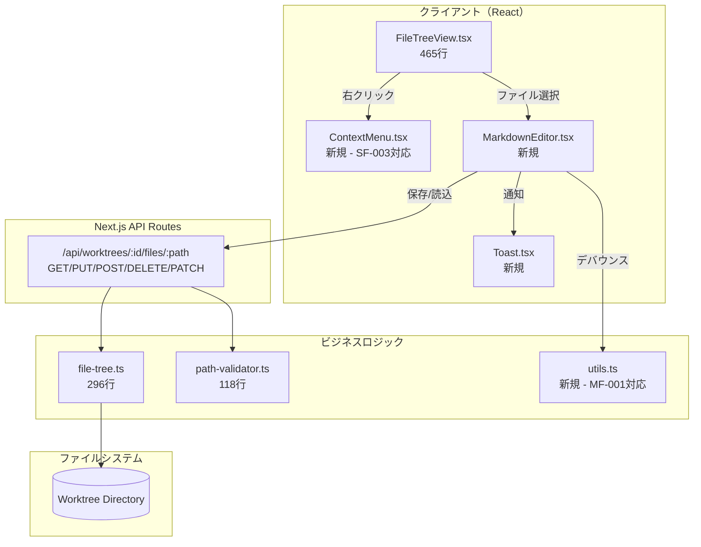
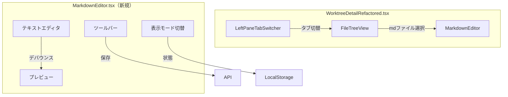
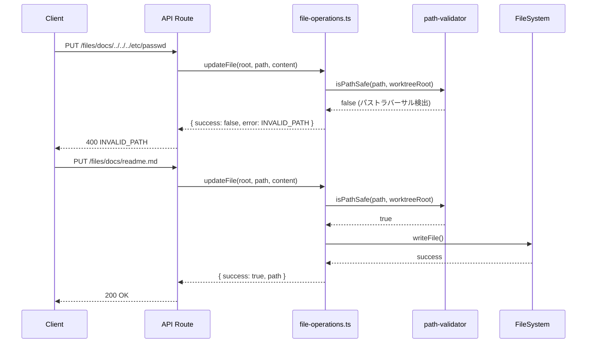

# Issue #49 マークダウンエディタとビューワー 設計方針書

## 1. 概要

### 1.1 目的
GUIからマークダウンファイルの作成・編集・管理を可能にし、ドキュメント作業の効率を向上させる。

### 1.2 スコープ
- Filesタブの拡張（ディレクトリ/ファイル操作）
- マークダウンエディタ + プレビュー機能
- 表示モード切り替え（分割/エディタのみ/プレビューのみ）

### 1.3 対象外
- 画像アップロード機能
- リッチテキストエディタ（WYSIWYG）
- ファイルの移動・コピー機能
- md以外のファイル編集
- 自動保存機能

---

## 2. アーキテクチャ設計

### 2.1 システム構成図



### 2.2 レイヤー構成

| レイヤー | ディレクトリ | 責務 |
|---------|------------|------|
| プレゼンテーション | `src/components/worktree/` | UI表示、ユーザー操作 |
| 共通UI | `src/components/common/` | 再利用可能なUIコンポーネント |
| API | `src/app/api/worktrees/` | HTTPリクエスト処理 |
| ビジネスロジック | `src/lib/` | ファイル操作、バリデーション |
| ユーティリティ | `src/lib/` | 汎用関数（debounce等） |

> **[Stage 3 SF-002対応]** `src/components/common/`ディレクトリは本Issueで初めて作成される。今後の共通コンポーネント配置の前例となるため、CLAUDE.mdのファイル構成セクションにも説明を追加すること。

### 2.3 コンポーネント構成図



---

## 3. 技術選定

### 3.1 使用技術

| カテゴリ | 技術 | 選定理由 |
|---------|------|---------|
| マークダウンレンダリング | `react-markdown` + `remark-gfm` + `rehype-sanitize` | 既存依存、MessageList.tsxで実績あり、**[SEC-MF-001対応]** XSS対策強化 |
| エディタ | `<textarea>` | シンプル、YAGNI原則、軽量 |
| 状態永続化 | localStorage | ブラウザ標準API、シンプル |
| トースト通知 | 自作`Toast.tsx` | 依存追加不要、要件が単純 |
| アイコン | `lucide-react` | 既存依存 |
| デバウンス | 自作`debounce`関数 | **[MF-001対応]** 軽量、依存追加不要 |
| HTMLサニタイズ | `rehype-sanitize` または `isomorphic-dompurify` | **[SEC-MF-001対応]** 明示的なXSS対策層 |

### 3.2 代替案との比較

#### エディタ選定

| 選択肢 | メリット | デメリット | 判定 |
|--------|---------|-----------|------|
| `<textarea>` | 軽量、依存なし | シンタックスハイライトなし | **採用** |
| Monaco Editor | フル機能 | バンドルサイズ大（+2MB）| 不採用 |
| CodeMirror | 柔軟、軽量 | 設定複雑 | 将来検討 |

**判定理由**: マークダウン編集は主にテキスト入力であり、シンタックスハイライトは必須ではない。YAGNI原則に従い、最小限の実装から開始。

#### トースト通知

| 選択肢 | メリット | デメリット | 判定 |
|--------|---------|-----------|------|
| 自作`Toast.tsx` | 軽量、要件に最適化 | 機能限定 | **採用** |
| react-hot-toast | 豊富な機能 | 依存追加 | 不採用 |
| sonner | モダン設計 | 依存追加 | 不採用 |

---

## 4. 設計パターン

### 4.1 適用パターン

| パターン | 適用箇所 | 目的 |
|---------|---------|------|
| Facade | API Route | 複数操作を統一インターフェースで提供 |
| Strategy | 表示モード | 分割/エディタのみ/プレビューのみの切り替え |
| Observer | プレビュー更新 | エディタ入力をデバウンスしてプレビューに反映 |
| Factory | エラーレスポンス | HTTPステータスに応じたエラー生成 |

### 4.2 Strategyパターン（表示モード）

```typescript
// src/components/worktree/MarkdownEditor.tsx

type ViewMode = 'split' | 'editor' | 'preview';

interface ViewModeStrategy {
  showEditor: boolean;
  showPreview: boolean;
  editorWidth: string;
  previewWidth: string;
}

const VIEW_MODE_STRATEGIES: Record<ViewMode, ViewModeStrategy> = {
  split: {
    showEditor: true,
    showPreview: true,
    editorWidth: 'w-1/2',
    previewWidth: 'w-1/2',
  },
  editor: {
    showEditor: true,
    showPreview: false,
    editorWidth: 'w-full',
    previewWidth: 'w-0',
  },
  preview: {
    showEditor: false,
    showPreview: true,
    editorWidth: 'w-0',
    previewWidth: 'w-full',
  },
};
```

### 4.3 Facadeパターン（API）

> **[SF-001対応]** APIルートファイルの肥大化を防ぐため、ビジネスロジックを`src/lib/file-operations.ts`に分離し、APIルートは薄いControllerとして機能させる。

```typescript
// src/lib/file-operations.ts（新規作成）

import { isPathSafe } from './path-validator';

export interface FileOperationResult {
  success: boolean;
  path?: string;
  error?: { code: string; message: string };
}

export async function readFile(worktreeRoot: string, relativePath: string): Promise<FileOperationResult> { /* ... */ }
export async function updateFile(worktreeRoot: string, relativePath: string, content: string): Promise<FileOperationResult> { /* ... */ }
export async function createFileOrDirectory(worktreeRoot: string, relativePath: string, type: 'file' | 'directory', content?: string): Promise<FileOperationResult> { /* ... */ }
export async function deleteFileOrDirectory(worktreeRoot: string, relativePath: string, recursive?: boolean): Promise<FileOperationResult> { /* ... */ }
export async function renameFileOrDirectory(worktreeRoot: string, relativePath: string, newName: string): Promise<FileOperationResult> { /* ... */ }
```

```typescript
// src/app/api/worktrees/[id]/files/[...path]/route.ts

// APIルートは薄いController層として機能
// ビジネスロジックはfile-operations.tsに委譲
import { readFile, updateFile, createFileOrDirectory, deleteFileOrDirectory, renameFileOrDirectory } from '@/lib/file-operations';

export async function GET(req, { params }) {
  const result = await readFile(worktreeRoot, path);
  return NextResponse.json(result, { status: result.success ? 200 : 404 });
}
export async function PUT(req, { params }) { /* updateFileに委譲 */ }
export async function POST(req, { params }) { /* createFileOrDirectoryに委譲 */ }
export async function DELETE(req, { params }) { /* deleteFileOrDirectoryに委譲 */ }
export async function PATCH(req, { params }) { /* renameFileOrDirectoryに委譲 */ }
```

---

## 5. データモデル設計

### 5.1 型定義

```typescript
// src/types/markdown-editor.ts

/** 表示モード */
export type ViewMode = 'split' | 'editor' | 'preview';

/** エディタ状態 */
export interface EditorState {
  content: string;
  originalContent: string;
  isDirty: boolean;
  filePath: string;
  isLoading: boolean;
  error: string | null;
}

/** ファイル操作リクエスト */
export interface FileOperationRequest {
  type: 'file' | 'directory';
  content?: string;
  action?: 'rename';
  newName?: string;
}

/** ファイル操作レスポンス */
export interface FileOperationResponse {
  success: boolean;
  path?: string;
  error?: {
    code: string;
    message: string;
  };
}
```

### 5.2 ローカルストレージスキーマ

| キー | 型 | 説明 |
|-----|-----|------|
| `commandmate:md-editor-view-mode` | `ViewMode` | 表示モード設定 |

---

## 6. API設計

### 6.1 エンドポイント一覧

> **[Stage 2 SF-001対応]** 全てのHTTPメソッドは同一パス `/api/worktrees/:id/files/:path`（catch-all route `[...path]/route.ts`）で処理される。リネーム操作はPATCHメソッドで `action: rename` フィールドにより識別する。

| メソッド | パス | 説明 | ステータス |
|---------|------|------|----------|
| GET | `/api/worktrees/:id/files/:path` | ファイル内容取得 | 既存 |
| PUT | `/api/worktrees/:id/files/:path` | ファイル内容更新 | **新規** |
| POST | `/api/worktrees/:id/files/:path` | ファイル/ディレクトリ作成 | **新規** |
| DELETE | `/api/worktrees/:id/files/:path` | ファイル/ディレクトリ削除 | **新規** |
| PATCH | `/api/worktrees/:id/files/:path` | リネーム（`action: rename`で識別） | **新規** |

**エンドポイント設計の明確化:**
- 別途 `/rename` エンドポイントは作成しない
- PATCH リクエストボディの `action: rename` フィールドでリネーム操作を判別
- 将来的に他のPATCH操作（例: メタデータ更新）が追加される場合も `action` フィールドで識別

### 6.2 リクエスト/レスポンス仕様

#### PUT（ファイル更新）

```typescript
// Request
PUT /api/worktrees/123/files/docs/readme.md
Content-Type: application/json
{
  "content": "# Updated Content\n..."
}

// Response 200
{
  "success": true,
  "path": "docs/readme.md"
}

// Response 404 [SEC-SF-002対応: 相対パスのみ返却]
{
  "success": false,
  "error": {
    "code": "FILE_NOT_FOUND",
    "message": "ファイルが見つかりません"
  }
}
```

#### POST（作成）

```typescript
// Request
POST /api/worktrees/123/files/docs/new-file.md
Content-Type: application/json
{
  "type": "file",
  "content": "# New File\n"
}

// Request (ディレクトリ)
POST /api/worktrees/123/files/docs/new-folder
Content-Type: application/json
{
  "type": "directory"
}

// Response 201
{
  "success": true,
  "path": "docs/new-file.md"
}
```

#### DELETE（削除）

> **[SEC-SF-004対応]** 再帰削除には安全ガードを設ける。

```typescript
// Request (ファイル)
DELETE /api/worktrees/123/files/docs/old-file.md

// Request (ディレクトリ - 再帰削除)
DELETE /api/worktrees/123/files/docs/old-folder?recursive=true

// Response 200
{
  "success": true
}

// Response 400 (空でないディレクトリ、recursive未指定)
{
  "success": false,
  "error": {
    "code": "DIRECTORY_NOT_EMPTY",
    "message": "ディレクトリが空ではありません"
  }
}

// Response 403 (.git保護 - SEC-SF-004対応)
{
  "success": false,
  "error": {
    "code": "PROTECTED_DIRECTORY",
    "message": ".gitディレクトリは削除できません"
  }
}
```

#### PATCH（リネーム）

> **[Stage 2 SF-001対応]** 同一パス `[...path]/route.ts` 内で処理。`action: rename` フィールドでリネーム操作を識別する。
> **[SEC-SF-003対応]** newNameパラメータにはパス検証を適用する。

```typescript
// Request
PATCH /api/worktrees/123/files/docs/old-name.md
Content-Type: application/json
{
  "action": "rename",
  "newName": "new-name.md"
}

// Response 200
{
  "success": true,
  "path": "docs/new-name.md"
}

// Response 400 (SEC-SF-003対応: ディレクトリセパレータ検出)
{
  "success": false,
  "error": {
    "code": "INVALID_NAME",
    "message": "ファイル名にパス区切り文字は使用できません"
  }
}
```

### 6.3 エラーコード一覧

> **[SEC-SF-002対応]** エラーレスポンスには絶対パスを含めず、相対パスのみを返却する。本番環境ではスタックトレースを抑制する。

| コード | HTTPステータス | 説明 |
|--------|---------------|------|
| `FILE_NOT_FOUND` | 404 | ファイルが存在しない |
| `PERMISSION_DENIED` | 403 | 権限がない |
| `INVALID_PATH` | 400 | パストラバーサル検出 |
| `INVALID_NAME` | 400 | **[SEC-SF-003]** 不正なファイル名（パス区切り文字含む） |
| `DIRECTORY_NOT_EMPTY` | 400 | 空でないディレクトリ |
| `FILE_EXISTS` | 409 | ファイルが既に存在 |
| `PROTECTED_DIRECTORY` | 403 | **[SEC-SF-004]** 保護されたディレクトリ（.git等） |
| `DELETE_LIMIT_EXCEEDED` | 400 | **[SEC-SF-004]** 再帰削除の上限超過 |
| `DISK_FULL` | 507 | ディスク容量不足 |
| `INTERNAL_ERROR` | 500 | 内部エラー |

---

## 7. セキュリティ設計

### 7.0 セキュリティ前提条件 [SEC-MF-002対応]

> **[SEC-MF-002対応]** 本アプリケーションはシングルユーザー環境での使用を前提として設計されている。

**シングルユーザーアプリケーションとしての前提:**

| 項目 | 説明 |
|------|------|
| 使用環境 | ローカル開発環境（localhost）または単一ユーザーがアクセスするプライベート環境 |
| 認証モデル | Bearer トークン認証（CM_AUTH_TOKEN）による単一ユーザー認証 |
| 認可モデル | 認証済みユーザーは全worktreeへのアクセス権限を持つ（ユーザー単位の認可は実装しない） |
| worktreeスコープ | worktree ID によるスコープ制限で、worktree間のアクセスを分離 |

**マルチユーザー環境での使用について:**
- 本設計はマルチユーザー環境を想定していない
- マルチユーザー環境での使用が必要な場合、以下の設計変更が必要:
  - ユーザー管理機能の追加（ユーザーテーブル、セッション管理）
  - worktree単位のアクセス権限管理（所有者、共有設定）
  - RBAC（Role-Based Access Control）の導入

### 7.1 脅威と対策

| 脅威 | 対策 | 実装箇所 | セキュリティレビューID |
|------|------|---------|---------------------|
| パストラバーサル | `isPathSafe()` による検証 | `path-validator.ts` | - |
| 任意ファイル編集 | `.md` 拡張子のみ許可 | API Route | - |
| worktree外アクセス | worktree IDによるスコープ制限 | API Route | - |
| XSS | `react-markdown` + `rehype-sanitize` によるサニタイズ | MarkdownEditor | **[SEC-MF-001]** |
| 除外ファイルアクセス | `.env`, `.git` 等への書き込み禁止 | `file-tree.ts` | - |
| リネーム攻撃 | newNameパラメータのパス検証 | `file-operations.ts` | **[SEC-SF-003]** |
| 情報漏洩 | エラーレスポンスに絶対パスを含めない | API Route | **[SEC-SF-002]** |
| 再帰削除攻撃 | .git保護、削除上限設定 | `file-operations.ts` | **[SEC-SF-004]** |

### 7.2 パス検証フロー

> **[SF-002対応 / Stage 2 SF-002対応 / Stage 3 MF-001対応]** 既存の`path-validator.ts`の`isPathSafe()`関数を一貫して使用する。既存route.ts（34-39行目）の`normalizedPath.includes('..')`による独自検証ロジックは、`isPathSafe()`に統一するためリファクタリングを実施する。

**実装方針:**
1. `src/lib/file-operations.ts`内で`isPathSafe()`を一元的に呼び出す
2. 既存route.tsの独自パス検証ロジックを`isPathSafe()`呼び出しに置換
3. 全てのファイル操作で同一の検証関数を使用することで、検証漏れを防止

**既存コードとの互換性確認 [Stage 2 SF-002対応 / Stage 3 MF-001対応]:**
- 既存route.ts（L34-39）: `normalizedPath.includes('..') || normalizedPath.startsWith('/')`
- isPathSafe(): URLデコード、null byte検出、相対パス検証を含む堅牢な実装
- isPathSafe() は既存検証のスーパーセットであり、既存の正当なリクエストが拒否されることはない
- **テストケースで互換性を確認すること**（テスト戦略 12.2 参照）

> **[Stage 3 MF-001 Breaking Change Risk対応]** isPathSafe()への統一により、URLエンコードされたパス（例: `docs%2Freadme.md`）の挙動が変わる可能性があるため、互換性テストを**Phase 1の優先事項**として実装すること。



### 7.3 編集可能ファイル制限

> **[SF-003対応 / Stage 3 NTH-001対応]** 編集可能な拡張子リストを設定ファイルに外部化し、拡張性を向上させる。将来的に対応拡張子を追加する際のコード変更を最小限に抑える。

```typescript
// src/config/editable-extensions.ts（新規作成）

/**
 * 編集可能なファイル拡張子の設定
 * 将来の拡張: 環境変数からの読み込みも検討可能
 */
export const EDITABLE_EXTENSIONS: readonly string[] = ['.md'] as const;

/**
 * 拡張子ごとのバリデーションルール（将来の拡張用）
 * Strategy Patternで拡張子ごとの検証ロジックを定義可能
 * [Stage 3 NTH-001対応] 将来txt, json, yaml等追加時のバリデーション拡張用
 */
export interface ExtensionValidator {
  extension: string;
  maxFileSize?: number;
  additionalValidation?: (content: string) => boolean;
}

export const EXTENSION_VALIDATORS: ExtensionValidator[] = [
  { extension: '.md', maxFileSize: 1024 * 1024 }, // 1MB
];

/**
 * [Stage 3 NTH-001対応] 将来の拡張用: コンテンツバリデーション関数
 * [SEC-SF-001対応] バイナリデータ検出、UTF-8以外のエンコーディング検出を追加
 * 拡張子ごとに異なるバリデーションルールを適用可能
 * @param extension 拡張子（例: '.md', '.json'）
 * @param content ファイル内容
 * @returns バリデーション結果
 */
export function validateContent(extension: string, content: string): { valid: boolean; error?: string } {
  const validator = EXTENSION_VALIDATORS.find(v => v.extension === extension);
  if (!validator) {
    return { valid: false, error: 'Unsupported extension' };
  }
  if (validator.maxFileSize && content.length > validator.maxFileSize) {
    return { valid: false, error: 'File size exceeds limit' };
  }

  // [SEC-SF-001対応] バイナリデータ検出（NULL文字チェック）
  if (content.includes('\0')) {
    return { valid: false, error: 'Binary content detected' };
  }

  // [SEC-SF-001対応] 制御文字の警告（NULL以外の制御文字0x01-0x08, 0x0B-0x0C, 0x0E-0x1F）
  const controlCharPattern = /[\x01-\x08\x0B\x0C\x0E-\x1F]/;
  if (controlCharPattern.test(content)) {
    // 警告ログを出力するが、処理は続行
    console.warn('Content contains control characters');
  }

  if (validator.additionalValidation && !validator.additionalValidation(content)) {
    return { valid: false, error: 'Content validation failed' };
  }
  return { valid: true };
}
```

```typescript
// src/lib/file-operations.ts

import { EDITABLE_EXTENSIONS } from '@/config/editable-extensions';

export function isEditableFile(filePath: string): boolean {
  const ext = path.extname(filePath).toLowerCase();
  return EDITABLE_EXTENSIONS.includes(ext);
}
```

### 7.4 XSS対策 [SEC-MF-001対応]

> **[SEC-MF-001対応]** MarkdownEditorコンポーネントでは`dangerouslySetInnerHTML`の使用を避け、react-markdownのデフォルトサニタイズに加えて明示的なサニタイズ層を導入する。

**XSS対策の多層防御:**

| 層 | 対策 | 実装 |
|----|------|------|
| 第1層 | react-markdownのデフォルトサニタイズ | react-markdown内蔵 |
| 第2層 | rehype-sanitizeによるHTML sanitize | `rehype-sanitize`プラグイン |
| 第3層 | dangerouslySetInnerHTML禁止 | コードレビュー/ESLintルール |

**実装方針:**

```typescript
// src/components/worktree/MarkdownEditor.tsx

import ReactMarkdown from 'react-markdown';
import remarkGfm from 'remark-gfm';
import rehypeSanitize from 'rehype-sanitize';
import rehypeHighlight from 'rehype-highlight';

function MarkdownPreview({ content }: { content: string }) {
  return (
    <ReactMarkdown
      remarkPlugins={[remarkGfm]}
      rehypePlugins={[
        rehypeSanitize,  // [SEC-MF-001] 明示的なサニタイズ層
        rehypeHighlight,
      ]}
    >
      {content}
    </ReactMarkdown>
  );
}
```

**代替案（既存依存の活用）:**
- `isomorphic-dompurify`（package.jsonで既に依存あり）を使用することも可能
- ただし、react-markdownとrehype-sanitizeの組み合わせがより統合的

**禁止事項:**
- MarkdownEditorコンポーネント内での`dangerouslySetInnerHTML`使用禁止
- 既存のMessageList.tsxでのAnsiToHtml使用パターンを踏襲しないこと

### 7.5 リネーム操作のパス検証 [SEC-SF-003対応]

> **[SEC-SF-003対応]** PATCH APIのnewNameパラメータに対するパス検証を実装し、ディレクトリトラバーサル攻撃を防止する。

**検証ルール:**
1. newNameにディレクトリセパレータ（`/`, `\`）を含むことを禁止
2. リネーム後のパスがworktree内に収まることを検証
3. `..`を含む名前を禁止

```typescript
// src/lib/file-operations.ts

/**
 * [SEC-SF-003対応] リネーム先の名前を検証
 * @param newName 新しいファイル/ディレクトリ名
 * @returns 検証結果
 */
export function isValidNewName(newName: string): { valid: boolean; error?: string } {
  // ディレクトリセパレータを含む場合は拒否
  if (newName.includes('/') || newName.includes('\\')) {
    return { valid: false, error: 'ファイル名にパス区切り文字は使用できません' };
  }

  // ディレクトリトラバーサルを含む場合は拒否
  if (newName.includes('..')) {
    return { valid: false, error: 'ファイル名に".."は使用できません' };
  }

  // 空の名前は拒否
  if (newName.trim() === '') {
    return { valid: false, error: 'ファイル名は空にできません' };
  }

  return { valid: true };
}

export async function renameFileOrDirectory(
  worktreeRoot: string,
  relativePath: string,
  newName: string
): Promise<FileOperationResult> {
  // [SEC-SF-003] newNameの検証
  const nameValidation = isValidNewName(newName);
  if (!nameValidation.valid) {
    return {
      success: false,
      error: { code: 'INVALID_NAME', message: nameValidation.error! }
    };
  }

  // リネーム後のパスを計算
  const parentDir = path.dirname(relativePath);
  const newPath = path.join(parentDir, newName);

  // リネーム後のパスがworktree内に収まることを検証
  if (!isPathSafe(newPath, worktreeRoot)) {
    return {
      success: false,
      error: { code: 'INVALID_PATH', message: 'パスが無効です' }
    };
  }

  // ... リネーム処理
}
```

### 7.6 再帰削除の安全ガード [SEC-SF-004対応]

> **[SEC-SF-004対応]** DELETE APIのrecursive=trueオプションに対する安全ガードを実装する。

**安全ガード:**
1. `.git`ディレクトリ配下の削除を明示的に禁止
2. 再帰削除の上限（最大ファイル数/深さ）を設定
3. 削除対象のプレビュー機能（dry-run）を将来検討

```typescript
// src/config/file-operations.ts（新規作成）

/**
 * [SEC-SF-004対応] 再帰削除の安全設定
 */
export const DELETE_SAFETY_CONFIG = {
  /** 再帰削除で削除可能な最大ファイル数 */
  MAX_RECURSIVE_DELETE_FILES: 100,

  /** 再帰削除で削除可能な最大深さ */
  MAX_RECURSIVE_DELETE_DEPTH: 10,

  /** 削除を禁止するディレクトリパターン */
  PROTECTED_DIRECTORIES: ['.git', '.github', 'node_modules'],
} as const;
```

```typescript
// src/lib/file-operations.ts

import { DELETE_SAFETY_CONFIG } from '@/config/file-operations';

/**
 * [SEC-SF-004対応] 再帰削除の安全性を検証
 */
async function validateRecursiveDelete(
  targetPath: string
): Promise<{ safe: boolean; error?: string; fileCount?: number }> {
  // 保護されたディレクトリかチェック
  const relativePath = path.relative(worktreeRoot, targetPath);
  for (const protected of DELETE_SAFETY_CONFIG.PROTECTED_DIRECTORIES) {
    if (relativePath === protected || relativePath.startsWith(`${protected}/`)) {
      return { safe: false, error: `${protected}ディレクトリは削除できません` };
    }
  }

  // ファイル数をカウント
  const fileCount = await countFilesRecursive(targetPath);
  if (fileCount > DELETE_SAFETY_CONFIG.MAX_RECURSIVE_DELETE_FILES) {
    return {
      safe: false,
      error: `削除対象が${DELETE_SAFETY_CONFIG.MAX_RECURSIVE_DELETE_FILES}件を超えています（${fileCount}件）`,
      fileCount
    };
  }

  return { safe: true, fileCount };
}

export async function deleteFileOrDirectory(
  worktreeRoot: string,
  relativePath: string,
  recursive?: boolean
): Promise<FileOperationResult> {
  // ... パス検証

  if (recursive) {
    // [SEC-SF-004] 再帰削除の安全性検証
    const safetyCheck = await validateRecursiveDelete(fullPath);
    if (!safetyCheck.safe) {
      return {
        success: false,
        error: {
          code: safetyCheck.error?.includes('.git') ? 'PROTECTED_DIRECTORY' : 'DELETE_LIMIT_EXCEEDED',
          message: safetyCheck.error!
        }
      };
    }
  }

  // ... 削除処理
}
```

### 7.7 エラーレスポンスの情報漏洩対策 [SEC-SF-002対応]

> **[SEC-SF-002対応]** エラーレスポンスにサーバーのディレクトリ構造が露出しないよう対策する。

**実装方針:**
1. エラーメッセージには相対パスのみを含める
2. 本番環境ではスタックトレースを抑制する
3. ログには詳細情報を記録し、クライアントには最小限の情報を返す

```typescript
// src/lib/file-operations.ts

/**
 * [SEC-SF-002対応] エラーレスポンスを生成（絶対パスを含めない）
 */
function createErrorResponse(
  code: string,
  relativePath: string,
  internalError?: Error
): { success: false; error: { code: string; message: string } } {
  // ログには詳細情報を記録
  if (internalError) {
    logger.error(`File operation error: ${code}`, {
      relativePath,
      error: internalError.message,
      // 絶対パスやスタックトレースはログにのみ記録
    });
  }

  // クライアントには相対パスのみ返却
  const messages: Record<string, string> = {
    'FILE_NOT_FOUND': 'ファイルが見つかりません',
    'PERMISSION_DENIED': 'アクセス権限がありません',
    'INVALID_PATH': 'パスが無効です',
    // ... 他のエラーコード
  };

  return {
    success: false,
    error: {
      code,
      message: messages[code] || '操作に失敗しました',
    },
  };
}
```

---

## 8. パフォーマンス設計

### 8.1 制限値

| 項目 | 値 | 根拠 |
|------|-----|------|
| ファイルサイズ上限 | 1MB | 既存`LIMITS.MAX_FILE_SIZE_PREVIEW` |
| 警告表示閾値 | 500KB | UX考慮 |
| プレビューデバウンス | 300ms | 入力遅延軽減 |

### 8.2 デバウンス実装

> **[MF-001対応]** debounce関数は `src/lib/utils.ts` に新規作成する。lodash-esなどの外部依存は追加せず、シンプルな自作実装とする。

```typescript
// src/lib/utils.ts（新規作成）

/**
 * デバウンス関数
 * 連続した呼び出しを指定時間だけ遅延させ、最後の呼び出しのみ実行する
 * @param fn 実行する関数
 * @param delay 遅延時間（ミリ秒）
 * @returns デバウンスされた関数
 */
export function debounce<T extends (...args: Parameters<T>) => void>(
  fn: T,
  delay: number
): (...args: Parameters<T>) => void {
  let timeoutId: ReturnType<typeof setTimeout> | null = null;

  return (...args: Parameters<T>) => {
    if (timeoutId) {
      clearTimeout(timeoutId);
    }
    timeoutId = setTimeout(() => {
      fn(...args);
      timeoutId = null;
    }, delay);
  };
}
```

```typescript
// src/components/worktree/MarkdownEditor.tsx

import { useMemo } from 'react';
import { debounce } from '@/lib/utils';

function MarkdownEditor({ ... }) {
  const [content, setContent] = useState('');
  const [previewContent, setPreviewContent] = useState('');

  const updatePreview = useMemo(
    () => debounce((value: string) => setPreviewContent(value), 300),
    []
  );

  const handleChange = (e: React.ChangeEvent<HTMLTextAreaElement>) => {
    const value = e.target.value;
    setContent(value);
    updatePreview(value);
  };

  // ...
}
```

### 8.3 大容量ファイル対応

```typescript
// src/components/worktree/MarkdownEditor.tsx

const SIZE_WARNING_THRESHOLD = 500 * 1024; // 500KB
const SIZE_LIMIT = 1024 * 1024; // 1MB

function MarkdownEditor({ filePath, worktreeId }) {
  const [sizeWarning, setSizeWarning] = useState<string | null>(null);

  useEffect(() => {
    async function loadFile() {
      const res = await fetch(`/api/worktrees/${worktreeId}/files/${filePath}`);
      const data = await res.json();

      const size = new Blob([data.content]).size;
      if (size > SIZE_LIMIT) {
        setError('ファイルサイズが上限を超えています');
        return;
      }
      if (size > SIZE_WARNING_THRESHOLD) {
        setSizeWarning('大きなファイルのため、パフォーマンスが低下する可能性があります');
      }

      setContent(data.content);
    }
    loadFile();
  }, [filePath, worktreeId]);
}
```

### 8.4 コンポーネントレンダリング最適化 [Stage 3 SF-001対応]

> **[Stage 3 SF-001対応]** FileTreeView.tsxへのContextMenu統合時、ツリーノードの再レンダリングがコンテキストメニュー状態に影響されないよう最適化する。

```typescript
// src/hooks/useContextMenu.ts（新規作成推奨）

/**
 * コンテキストメニュー状態を管理するカスタムフック
 * FileTreeViewのメモ化（React.memo）との整合性を保つため、
 * メニュー状態を独立して管理する
 */
export function useContextMenu() {
  const [menuState, setMenuState] = useState<{
    isOpen: boolean;
    position: { x: number; y: number };
    targetPath: string | null;
    targetType: 'file' | 'directory' | null;
  }>({
    isOpen: false,
    position: { x: 0, y: 0 },
    targetPath: null,
    targetType: null,
  });

  const openMenu = useCallback((e: React.MouseEvent, path: string, type: 'file' | 'directory') => {
    e.preventDefault();
    setMenuState({
      isOpen: true,
      position: { x: e.clientX, y: e.clientY },
      targetPath: path,
      targetType: type,
    });
  }, []);

  const closeMenu = useCallback(() => {
    setMenuState(prev => ({ ...prev, isOpen: false }));
  }, []);

  return { menuState, openMenu, closeMenu };
}
```

**実装時の注意点:**
- FileTreeViewの各TreeItemノードはReact.memoでメモ化済み
- ContextMenuのpropsはuseContextMenuフックの戻り値のみに限定
- メニュー表示/非表示の状態変更がTreeItemの再レンダリングをトリガーしないこと

---

## 9. UI/UX設計

### 9.1 レイアウト

```
+-------------------------------------------------------------+
| [Files] [History] [Memo]                    <- タブ切替      |
+-------------------------------------------------------------+
| +---------------+ +---------------------------------------+ |
| | FileTreeView  | | MarkdownEditor                        | |
| |               | | +-----------------------------------+ | |
| | [dir] docs    | | | [分割] [Editor] [Preview] [Save]  | | |
| |   [file] readme.md | +-----------------------------------+ | |
| |   [file] guide.md | | +-------------+ +-----------------+ | |
| | [dir] src     | | | | Editor      | | Preview         | | |
| |               | | | |             | |                 | | |
| |               | | | | # Title     | | Title           | | |
| |               | | | | content...  | | content...      | | |
| |               | | | |             | |                 | | |
| +---------------+ | | +-------------+ +-----------------+ | |
|                   | +-----------------------------------+ | |
+-------------------------------------------------------------+
```

### 9.2 右クリックメニュー

> **[Stage 2 SF-003対応]** 右クリックメニュー機能は `ContextMenu.tsx` として分離し、FileTreeView.tsx の肥大化を防止する。

```
+------------------+
| [folder] 新規フォルダ   |
| [file] 新規ファイル   |
+------------------+
| [edit] 名前を変更     |
| [trash] 削除          |
+------------------+
```

### 9.3 トースト通知

> **[Stage 2 NTH-001対応]** Toastコンポーネントは `src/components/common/Toast.tsx` に配置する。`common/` ディレクトリは本Issue で新規作成となる。将来的に汎用UIコンポーネントを追加する際の配置場所として活用する。

```
+------------------------------------+
| [check] ファイルを保存しました    [x]  |
+------------------------------------+
```

### 9.4 モバイルレイアウト [Stage 3 NTH-003対応]

> **[Stage 3 NTH-003対応]** モバイル環境でのMarkdownEditor表示方法を明確化する。

**モバイルレイアウト方針:**
- モバイル環境（MobileContent内）ではMarkdownEditorをフルスクリーンモーダルとして表示
- FileViewerと同様のモーダル表示パターンを踏襲
- 戻るボタンでファイルツリーに戻る操作を提供

```
+-------------------------------+
| [<] readme.md           [Save] |  <- ヘッダー（戻る + 保存）
+-------------------------------+
| [分割] [Editor] [Preview]      |  <- 表示モード切替
+-------------------------------+
|                               |
| # Title                       |
|                               |
| content...                    |
|                               |
+-------------------------------+
```

**WorktreeDetailRefactored.tsx MobileContent変更方針:**
- MobileContentコンポーネント内にMarkdownEditor表示用の状態を追加
- mdファイル選択時にFileViewerの代わりにMarkdownEditorを表示
- 表示モード切替は縦方向にスクロール可能なUIを提供

---

## 10. 設計上の決定事項とトレードオフ

### 10.1 採用した設計

| 決定事項 | 理由 | トレードオフ |
|---------|------|-------------|
| `<textarea>`エディタ | 軽量、依存なし | シンタックスハイライトなし |
| 手動保存のみ | シンプル実装 | 自動保存なし |
| localStorage状態永続化 | ブラウザ標準 | デバイス間同期なし |
| 単一APIルートファイル | 保守性向上 | ファイル肥大化リスク |
| `.md`のみ編集可 | セキュリティ優先 | 拡張性制限 |
| 右クリックメニュー分離 [Stage 2 SF-003] | コンポーネント責務分離 | ファイル数増加 |
| 自作debounce関数 [MF-001] | 依存追加不要 | 機能限定 |
| useContextMenuフック分離 [Stage 3 SF-001] | レンダリング最適化 | フック数増加 |
| editorFilePath状態追加 [Stage 3 SF-004] | FileViewerとの競合回避 | 状態管理複雑化 |
| シングルユーザー前提 [SEC-MF-002] | 設計シンプル化 | マルチユーザー非対応 |
| rehype-sanitize導入 [SEC-MF-001] | XSS対策強化 | 依存追加 |

### 10.2 将来の拡張ポイント

| 機能 | 優先度 | 実装難易度 |
|------|--------|----------|
| 自動保存 | 中 | 低 |
| シンタックスハイライト | 低 | 中 |
| 画像アップロード | 低 | 高 |
| ファイル移動/コピー | 低 | 中 |
| 他拡張子の編集 | 低 | 低 |
| OpenAPI/Swagger導入 [Stage 3 NTH-002] | 低 | 中 |
| マルチユーザー対応 [SEC-MF-002] | 低 | 高 |
| レート制限 [SEC-NTH-003] | 低 | 中 |

---

## 11. 実装計画

### 11.1 フェーズ分け

| フェーズ | 内容 | 成果物 |
|---------|------|--------|
| Phase 1 | API拡張（PUT/POST/DELETE/PATCH）+ **パス検証互換性テスト** [Stage 3 MF-001] | route.ts拡張, path-validation-compatibility.test.ts |
| Phase 2 | Toast共通コンポーネント | Toast.tsx |
| Phase 3 | MarkdownEditorコンポーネント（**rehype-sanitize統合** [SEC-MF-001]） | MarkdownEditor.tsx |
| Phase 4 | FileTreeView右クリックメニュー | FileTreeView.tsx変更 + ContextMenu.tsx + useContextMenu.ts |
| Phase 5 | 統合・E2Eテスト | テストコード |

> **[Stage 3 MF-001対応]** Phase 1でパス検証互換性テストを優先的に実装し、既存機能への影響がないことを確認してから後続フェーズに進むこと。

### 11.2 変更ファイル一覧

#### 新規作成

| ファイル | 行数目安 | 内容 |
|----------|---------|------|
| `src/components/worktree/MarkdownEditor.tsx` | 300行 | エディタ本体（**rehype-sanitize統合** [SEC-MF-001]） |
| `src/components/worktree/ContextMenu.tsx` | 100行 | 右クリックメニュー [Stage 2 SF-003対応] |
| `src/components/common/Toast.tsx` | 80行 | トースト通知 [Stage 2 NTH-001] |
| `src/types/markdown-editor.ts` | 50行 | 型定義 |
| `src/lib/file-operations.ts` | 200行 | ファイル操作ビジネスロジック [SF-001]（**リネーム検証強化** [SEC-SF-003]、**再帰削除安全ガード** [SEC-SF-004]） |
| `src/lib/utils.ts` | 30行 | debounce関数等ユーティリティ [MF-001対応] |
| `src/config/editable-extensions.ts` | 50行 | 編集可能拡張子設定 [SF-003]（**バリデーション強化** [SEC-SF-001]） |
| `src/config/file-operations.ts` | 20行 | **[SEC-SF-004]** 再帰削除安全設定 |
| `src/hooks/useContextMenu.ts` | 50行 | コンテキストメニュー状態管理フック [Stage 3 SF-001対応] |

#### 大幅変更

| ファイル | 現行行数 | 変更内容 |
|----------|---------|---------|
| `src/app/api/worktrees/[id]/files/[...path]/route.ts` | 95行 | PUT/POST/DELETE/PATCH追加、ビジネスロジックをfile-operations.tsに委譲 [SF-001]、パス検証をisPathSafe()に統一 [SF-002 / Stage 2 SF-002 / Stage 3 MF-001]、**エラーレスポンスの情報漏洩対策** [SEC-SF-002] |
| `src/components/worktree/FileTreeView.tsx` | 465行 | 右クリックメニュー追加（ContextMenu.tsxに分離）[Stage 2 SF-003対応]、useContextMenuフック使用 [Stage 3 SF-001] |

#### 軽微変更

| ファイル | 変更内容 |
|----------|---------|
| `src/components/worktree/WorktreeDetailRefactored.tsx` | md選択時のエディタ表示（L895-897 handleFileSelect に拡張子判定分岐追加、editorFilePath状態追加）[Stage 2 NTH-003 / Stage 3 SF-004] |
| `src/lib/file-tree.ts` | 書き込み/削除関数追加 |
| `CLAUDE.md` | `src/components/common/`ディレクトリの説明追加 [Stage 3 SF-002] |

---

## 12. テスト戦略

### 12.1 テストカバレッジ目標

| カテゴリ | 目標 | 重点項目 |
|---------|------|---------|
| API | 90% | パス検証、エラーハンドリング、**セキュリティ検証** [SEC-*] |
| コンポーネント | 80% | 表示モード切替、保存処理、**XSS対策** [SEC-MF-001] |
| E2E | 主要フロー | ファイル作成→編集→保存 |

### 12.2 テストケース

#### API テスト

```typescript
// tests/integration/api-file-operations.test.ts

describe('PUT /api/worktrees/:id/files/:path', () => {
  it('should update file content', async () => { ... });
  it('should reject path traversal', async () => { ... });
  it('should return 404 for non-existent file', async () => { ... });
  // [SEC-SF-001] コンテンツバリデーション
  it('should reject binary content (null bytes)', async () => { ... });
});

describe('POST /api/worktrees/:id/files/:path', () => {
  it('should create new file', async () => { ... });
  it('should create new directory', async () => { ... });
  it('should return 409 if file exists', async () => { ... });
});

describe('DELETE /api/worktrees/:id/files/:path', () => {
  it('should delete file', async () => { ... });
  it('should require recursive=true for non-empty directory', async () => { ... });
  // [SEC-SF-004] 再帰削除の安全ガード
  it('should reject deletion of .git directory', async () => { ... });
  it('should reject deletion exceeding file limit', async () => { ... });
});

describe('PATCH /api/worktrees/:id/files/:path', () => {
  it('should rename file when action is rename', async () => { ... });
  it('should reject invalid action', async () => { ... });
  // [SEC-SF-003] リネーム操作のパス検証
  it('should reject newName with directory separator', async () => { ... });
  it('should reject newName with path traversal', async () => { ... });
});

// [SEC-SF-002] エラーレスポンスの情報漏洩対策
describe('Error response security', () => {
  it('should not include absolute paths in error messages', async () => { ... });
  it('should not include stack traces in production', async () => { ... });
});
```

#### パス検証互換性テスト [Stage 2 SF-002対応 / Stage 3 MF-001対応]

> **[Stage 3 MF-001 Breaking Change Risk対応]** このテストはPhase 1の優先事項として実装すること。既存の正当なリクエストが拒否されないことを確認する。

```typescript
// tests/integration/path-validation-compatibility.test.ts

describe('isPathSafe compatibility with existing validation', () => {
  // 既存route.tsの検証ロジックとの互換性確認
  it('should accept paths that were valid with old validation', async () => {
    // 正常なパス: docs/readme.md, src/index.ts
  });
  it('should reject paths with ".." (path traversal)', async () => {
    // 既存検証でも拒否: ../etc/passwd, docs/../../../etc/passwd
  });
  it('should reject paths starting with "/" (absolute path)', async () => {
    // 既存検証でも拒否: /etc/passwd
  });
  it('should additionally reject URL-encoded traversal', async () => {
    // isPathSafe追加機能: %2e%2e/etc/passwd
  });
  it('should additionally reject null byte injection', async () => {
    // isPathSafe追加機能: docs/readme.md%00.txt
  });
  // [Stage 3 MF-001対応] URLエンコードされたパスの挙動確認
  it('should handle URL-encoded normal paths correctly', async () => {
    // URLエンコードされた正常パス: docs%2Freadme.md
    // 既存動作と同様に正常に処理されることを確認
  });
});
```

#### コンポーネントテスト

```typescript
// tests/unit/components/MarkdownEditor.test.tsx

describe('MarkdownEditor', () => {
  it('should render in split mode by default', () => { ... });
  it('should switch to editor-only mode', () => { ... });
  it('should show unsaved changes warning', () => { ... });
  it('should debounce preview updates', () => { ... });
  // [SEC-MF-001] XSS対策テスト
  it('should sanitize HTML in markdown preview', () => { ... });
  it('should not use dangerouslySetInnerHTML', () => { ... });
});
```

#### ユーティリティテスト [MF-001対応]

```typescript
// tests/unit/lib/utils.test.ts

describe('debounce', () => {
  it('should delay function execution', async () => { ... });
  it('should cancel previous timeout on rapid calls', async () => { ... });
  it('should execute only the last call', async () => { ... });
});
```

#### セキュリティテスト [SEC-*対応]

```typescript
// tests/integration/security.test.ts

describe('Security tests', () => {
  // [SEC-SF-003] リネーム操作のパス検証
  describe('Rename path validation', () => {
    it('should reject newName containing /', async () => { ... });
    it('should reject newName containing \\', async () => { ... });
    it('should reject newName containing ..', async () => { ... });
    it('should reject empty newName', async () => { ... });
  });

  // [SEC-SF-004] 再帰削除の安全ガード
  describe('Recursive delete safety', () => {
    it('should protect .git directory', async () => { ... });
    it('should protect .github directory', async () => { ... });
    it('should enforce max file count limit', async () => { ... });
  });

  // [SEC-SF-001] コンテンツバリデーション
  describe('Content validation', () => {
    it('should detect binary content', async () => { ... });
    it('should warn on control characters', async () => { ... });
  });
});
```

### 12.3 CI/CD影響考慮 [Stage 3 SF-003対応]

> **[Stage 3 SF-003対応]** 複数のテストファイル追加によりCI/CDパイプラインの実行時間が増加する可能性がある。

**対策:**
- テスト実行時間を計測し、必要に応じてテストの並列化を検討
- E2Eテスト（Phase 5）はPlaywrightで実行されるため、独立したジョブとして分離
- 単体テストと統合テストは並列実行可能なジョブ構成を維持

**追加テストファイル一覧:**
| ファイル | カテゴリ | 推定実行時間 |
|---------|--------|-------------|
| `tests/integration/api-file-operations.test.ts` | 統合 | 5-10秒 |
| `tests/integration/path-validation-compatibility.test.ts` | 統合 | 3-5秒 |
| `tests/integration/security.test.ts` | 統合 | 5-8秒 |
| `tests/unit/components/MarkdownEditor.test.tsx` | 単体 | 2-3秒 |
| `tests/unit/lib/utils.test.ts` | 単体 | 1秒未満 |

---

## 13. 設計原則準拠確認

### 13.1 SOLID原則

| 原則 | 準拠状況 | 実装例 |
|------|---------|--------|
| 単一責任 | ✅ | Toast, MarkdownEditor, ContextMenu, file-operations.ts分離, useContextMenu.ts [SF-001 / Stage 2 SF-003対応 / Stage 3 SF-001対応] |
| 開放閉鎖 | ✅ | ViewMode Strategyパターン、編集可能拡張子の設定外部化 [SF-003対応] |
| リスコフ置換 | ✅ | TreeItemインターフェース準拠 |
| インターフェース分離 | ✅ | FileOperationRequest/Response分離 |
| 依存性逆転 | ✅ | path-validator抽象化、パス検証ロジック統一 [SF-002 / Stage 2 SF-002対応] |

### 13.2 その他原則

| 原則 | 準拠状況 | 説明 |
|------|---------|------|
| KISS | ✅ | `<textarea>`採用、最小限の実装、自作debounce [MF-001対応] |
| YAGNI | ✅ | 自動保存、シンタックスハイライトは将来対応 |
| DRY | ✅ | 既存react-markdown設定を再利用、isPathSafe()の一貫使用 [SF-002 / Stage 2 SF-002対応] |

---

## 14. レビュー指摘事項サマリー

> このセクションはStage 1レビュー（2026-01-30）、Stage 2整合性レビュー（2026-01-30）、Stage 3影響分析レビュー（2026-01-30）、およびStage 4セキュリティレビュー（2026-01-30）の指摘事項を反映したものです。

### 14.1 Must Fix対応状況 [Stage 2]

| ID | カテゴリ | 指摘内容 | 対応状況 | 反映セクション |
|----|---------|---------|---------|---------------|
| MF-001 | 設計 vs コード | debounce関数の参照先（src/lib/utils.ts）が存在しない | ✅ 対応済 | 2.1, 3.1, 8.2, 11.2, 12.2 |

### 14.2 Must Fix対応状況 [Stage 3]

| ID | カテゴリ | 指摘内容 | 対応状況 | 反映セクション |
|----|---------|---------|---------|---------------|
| MF-001 | Breaking Change Risk | 既存route.tsのパス検証ロジック変更による互換性リスク。isPathSafe()への統一でURLエンコードされたパスの挙動が変わる可能性がある。 | ✅ 対応済 | 7.2, 11.1, 12.2 |

### 14.3 Must Fix対応状況 [Stage 4 セキュリティレビュー]

| ID | カテゴリ | 指摘内容 | 対応状況 | 反映セクション |
|----|---------|---------|---------|---------------|
| SEC-MF-001 | A03_injection | XSS対策: dangerouslySetInnerHTMLの使用リスク。react-markdownのサニタイズに依存するだけでなく、rehype-sanitizeまたはDOMPurifyの導入が必要。 | ✅ 対応済 | 3.1, 7.1, 7.4, 11.1, 11.2, 12.2 |
| SEC-MF-002 | A01_broken_access_control | ファイル書き込みAPIの認可制御不足。シングルユーザーアプリケーションとしての前提を明確に文書化する必要がある。 | ✅ 対応済 | 7.0, 10.1, 10.2 |

### 14.4 Should Fix対応状況 [Stage 1]

| ID | 原則 | 指摘内容 | 対応状況 | 反映セクション |
|----|------|---------|---------|---------------|
| SF-001 | SRP | APIルートファイル肥大化リスク（推定200-300行） | ✅ 対応済 | 4.3, 11.2 |
| SF-002 | DRY | パス検証ロジックの混在リスク | ✅ 対応済 | 7.2, 11.2, 13.1 |
| SF-003 | OCP | EDITABLE_EXTENSIONS配列のハードコード | ✅ 対応済 | 7.3, 11.2, 13.1 |

### 14.5 Should Fix対応状況 [Stage 2]

| ID | カテゴリ | 指摘内容 | 対応状況 | 反映セクション |
|----|---------|---------|---------|---------------|
| SF-001 | 設計内部整合性 | PATCHリクエストのエンドポイント設計の曖昧さ | ✅ 対応済 | 6.1, 6.2, 12.2 |
| SF-002 | 設計 vs コード | 既存route.tsのパス検証との統合方針の具体化 | ✅ 対応済 | 7.2, 12.2 |
| SF-003 | 設計 vs コード | FileTreeView.tsx の変更規模と分割検討 | ✅ 対応済 | 2.1, 9.2, 10.1, 11.1, 11.2, 13.1 |

### 14.6 Should Fix対応状況 [Stage 3]

| ID | カテゴリ | 指摘内容 | 対応状況 | 反映セクション |
|----|---------|---------|---------|---------------|
| SF-001 | Performance Impact | FileTreeView.tsxへのContextMenu追加によるレンダリング影響。useContextMenuフック分離を推奨。 | ✅ 対応済 | 8.4, 10.1, 11.2 |
| SF-002 | Dependencies Impact | src/components/common/ディレクトリ新規作成の影響。CLAUDE.mdへの説明追加を推奨。 | ✅ 対応済 | 2.2, 11.2 |
| SF-003 | Test Coverage Impact | テストファイル追加によるCI/CD実行時間への影響。テスト並列化・分離を推奨。 | ✅ 対応済 | 12.3 |
| SF-004 | Module Coupling | WorktreeDetailRefactored.tsxの変更によるFileViewerとの競合リスク。editorFilePath状態追加を推奨。 | ✅ 対応済 | 10.1, 11.2 |

### 14.7 Should Fix対応状況 [Stage 4 セキュリティレビュー]

| ID | カテゴリ | 指摘内容 | 対応状況 | 反映セクション |
|----|---------|---------|---------|---------------|
| SEC-SF-001 | A03_injection | ファイル内容書き込み時のバリデーション強化。バイナリデータ混入検出、制御文字フィルタリングが不足。 | ✅ 対応済 | 7.3, 12.2 |
| SEC-SF-002 | A05_security_misconfiguration | エラーメッセージの情報漏洩リスク。エラーレスポンスに絶対パスを含めない設計を明記。 | ✅ 対応済 | 6.2, 6.3, 7.7, 11.2, 12.2 |
| SEC-SF-003 | A01_broken_access_control | リネーム操作の宛先パス検証。newNameパラメータへのディレクトリトラバーサル攻撃を防ぐ必要。 | ✅ 対応済 | 6.2, 6.3, 7.5, 11.2, 12.2 |
| SEC-SF-004 | A04_insecure_design | 再帰削除の安全性確認。.gitディレクトリ保護、削除上限設定が必要。 | ✅ 対応済 | 6.2, 6.3, 7.6, 11.2, 12.2 |

### 14.8 Nice to Have対応状況 [Stage 2]

| ID | カテゴリ | 指摘内容 | 対応状況 | 反映セクション |
|----|---------|---------|---------|---------------|
| NTH-001 | 設計内部整合性 | Toastコンポーネントの配置ディレクトリ（common/新規作成） | ✅ 対応済 | 9.3, 11.2 |
| NTH-002 | 設計 vs コード | 大容量ファイル警告の閾値（既に整合） | - 対応不要 | - |
| NTH-003 | 設計 vs コード | WorktreeDetailRefactored.tsx の変更箇所（既に整合） | ✅ 対応済 | 11.2 |

### 14.9 Nice to Have対応状況 [Stage 3]

| ID | カテゴリ | 指摘内容 | 対応状況 | 反映セクション |
|----|---------|---------|---------|---------------|
| NTH-001 | Future Extensibility | ExtensionValidator interfaceが定義されているが使用されていない。validateContent関数の準備を推奨。 | ✅ 対応済 | 7.3 |
| NTH-002 | Documentation | APIドキュメント（OpenAPI/Swagger）の将来的な導入を検討。 | ✅ 将来検討 | 10.2 |
| NTH-003 | User Experience | モバイルレイアウトでのMarkdownEditor表示方法が未定義。 | ✅ 対応済 | 9.4 |

### 14.10 Nice to Have対応状況 [Stage 4 セキュリティレビュー]

| ID | カテゴリ | 指摘内容 | 対応状況 | 反映セクション |
|----|---------|---------|---------|---------------|
| SEC-NTH-001 | A09_security_logging_failures | ファイル操作の監査ログ。全ファイル操作（PUT/POST/DELETE/PATCH）の監査ログを出力。 | ✅ 将来検討 | 16.2 |
| SEC-NTH-002 | A06_vulnerable_components | 依存パッケージのセキュリティ監視。npm auditをCI/CDパイプラインに組み込む。 | ✅ 将来検討 | 16.2 |
| SEC-NTH-003 | A04_insecure_design | Rate Limitingの検討。新規APIエンドポイントに対するレート制限。localhost使用前提なら優先度は低い。 | ✅ 将来検討 | 10.2, 16.2 |

### 14.11 Nice to Have（将来検討）[Stage 1]

| ID | 原則 | 指摘内容 | 対応方針 |
|----|------|---------|---------|
| NTH-001 | ISP | FileOperationRequestが汎用的すぎる | 将来のリファクタリングで操作別型分離を検討 |
| NTH-002 | DIP | debounce関数のutilsへの直接依存 | テスト時のモック化が必要になった時点でuseDebounce hookに抽象化 |
| NTH-003 | KISS | 4つのデザインパターン適用が多い可能性 | 初期実装ではStrategy（表示モード）のみ明示的に適用 |
| NTH-004 | DRY | Toast通知のアプリケーション全体での再利用設計が未定義 | 他機能でToast必要時にToastコンテキストを検討 |

### 14.12 実装チェックリスト

実装時に以下の項目を確認すること：

**Stage 1指摘対応:**
- [ ] **[SF-001]** `src/lib/file-operations.ts`を新規作成し、ファイル操作ロジックを集約
- [ ] **[SF-001]** APIルート（route.ts）はController層として薄く保ち、file-operations.tsに委譲
- [ ] **[SF-002]** 既存route.ts（34-39行目）の`normalizedPath.includes('..')`を`isPathSafe()`呼び出しに置換
- [ ] **[SF-002]** 全てのファイル操作で`path-validator.ts`の`isPathSafe()`を使用
- [ ] **[SF-003]** `src/config/editable-extensions.ts`を新規作成
- [ ] **[SF-003]** `file-operations.ts`から設定ファイルをimportして使用

**Stage 2指摘対応:**
- [ ] **[MF-001]** `src/lib/utils.ts`を新規作成し、debounce関数を実装
- [ ] **[MF-001]** MarkdownEditor.tsxで`@/lib/utils`からdebounceをimport
- [ ] **[Stage 2 SF-001]** PATCHエンドポイントは`[...path]/route.ts`内で`action: rename`により処理
- [ ] **[Stage 2 SF-002]** パス検証互換性テストを作成し、既存動作との互換性を確認
- [ ] **[Stage 2 SF-003]** 右クリックメニューを`ContextMenu.tsx`として分離
- [ ] **[Stage 2 NTH-001]** `src/components/common/`ディレクトリを新規作成
- [ ] **[Stage 2 NTH-003]** WorktreeDetailRefactored.tsx L895-897にmd拡張子判定を追加

**Stage 3指摘対応:**
- [ ] **[Stage 3 MF-001]** Phase 1でパス検証互換性テストを優先的に実装（path-validation-compatibility.test.ts）
- [ ] **[Stage 3 MF-001]** URLエンコードされたパス（docs%2Freadme.md）の挙動テストを追加
- [ ] **[Stage 3 SF-001]** `src/hooks/useContextMenu.ts`を新規作成し、コンテキストメニュー状態を分離
- [ ] **[Stage 3 SF-001]** FileTreeViewのReact.memoとの整合性を確認
- [ ] **[Stage 3 SF-002]** CLAUDE.mdのファイル構成セクションに`src/components/common/`の説明を追加
- [ ] **[Stage 3 SF-003]** テスト実行時間を計測し、必要に応じてCI/CDジョブの並列化を検討
- [ ] **[Stage 3 SF-004]** WorktreeDetailRefactored.tsxにeditorFilePath状態を追加（fileViewerPathとは別管理）
- [ ] **[Stage 3 NTH-001]** editable-extensions.tsにvalidateContent関数を実装
- [ ] **[Stage 3 NTH-003]** モバイルレイアウト（MobileContent）でのMarkdownEditor表示を実装

**Stage 4セキュリティレビュー指摘対応:**
- [ ] **[SEC-MF-001]** MarkdownEditor.tsxでrehype-sanitizeを統合し、XSS対策を強化
- [ ] **[SEC-MF-001]** dangerouslySetInnerHTMLを使用しないこと
- [ ] **[SEC-MF-002]** シングルユーザーアプリケーションとしての前提をドキュメント化（セクション7.0参照）
- [ ] **[SEC-SF-001]** validateContent関数にバイナリデータ検出を追加
- [ ] **[SEC-SF-002]** エラーレスポンスに絶対パスを含めない実装
- [ ] **[SEC-SF-003]** isValidNewName関数を実装し、リネーム操作の宛先パス検証を強化
- [ ] **[SEC-SF-004]** 再帰削除の安全ガード（.git保護、削除上限）を実装

---

## 15. 影響分析サマリー [Stage 3]

> このセクションはStage 3影響分析レビュー（2026-01-30）の分析結果をまとめたものです。

### 15.1 影響ファイル一覧

| パス | 変更タイプ | リスクレベル | 変更内容 |
|-----|----------|-------------|---------|
| `src/app/api/worktrees/[id]/files/[...path]/route.ts` | 大幅変更 | **高** | PUT/POST/DELETE/PATCHメソッド追加、パス検証統一 |
| `src/components/worktree/FileTreeView.tsx` | 大幅変更 | 中 | 右クリックメニュー統合、ContextMenu.tsx分離 |
| `src/components/worktree/WorktreeDetailRefactored.tsx` | 軽微変更 | 低 | handleFileSelectにmd拡張子判定追加、editorFilePath状態追加 |
| `src/lib/file-tree.ts` | 軽微変更 | 低 | 書き込み/削除関数追加 |
| `src/lib/path-validator.ts` | 変更なし | なし | 既存関数を再利用 |

### 15.2 新規ファイル/ディレクトリ

| パス | 説明 |
|-----|------|
| `src/components/worktree/MarkdownEditor.tsx` | マークダウンエディタ本体（300行） |
| `src/components/worktree/ContextMenu.tsx` | 右クリックメニュー（100行） |
| `src/components/common/Toast.tsx` | トースト通知（80行） |
| `src/components/common/` | **新規ディレクトリ**: 再利用可能な共通UIコンポーネント配置場所 |
| `src/types/markdown-editor.ts` | マークダウンエディタ型定義（50行） |
| `src/lib/file-operations.ts` | ファイル操作ビジネスロジック（200行） |
| `src/lib/utils.ts` | debounce等ユーティリティ（30行） |
| `src/config/editable-extensions.ts` | 編集可能拡張子設定（50行） |
| `src/config/file-operations.ts` | **[SEC-SF-004]** 再帰削除安全設定（20行） |
| `src/hooks/useContextMenu.ts` | コンテキストメニュー状態管理フック（50行） |

### 15.3 Breaking Changes

| ID | 種別 | 説明 | 軽減策 | 重大度 |
|----|-----|------|-------|--------|
| BC-001 | API | route.tsのパス検証ロジックがisPathSafe()に統一されることで、URLエンコードされたパスの処理が変更される可能性がある | 互換性テストで既存動作を確認 | 低 |

### 15.4 パフォーマンス影響

| 項目 | 影響 | 軽減策 |
|-----|------|-------|
| バンドルサイズ | **軽微な増加** | react-markdown, remark-gfm, rehype-highlightは既存依存。rehype-sanitize追加で約10KB増 [SEC-MF-001]。 |
| ランタイム | 低リスク | プレビューのデバウンス処理（300ms）で入力遅延を最小化 |
| API遅延 | 低リスク | ファイル操作（PUT/POST/DELETE/PATCH）は非同期処理とエラーハンドリングで対応 |

### 15.5 リスク評価

| 要因 | リスク | 軽減策 |
|-----|--------|-------|
| route.tsの大幅変更 | **高** | file-operations.tsへのビジネスロジック分離により、route.tsは薄いController層として維持 |
| FileTreeView.tsxの拡張 | 中 | ContextMenu.tsxへの分離、useContextMenuフックによりレンダリング影響を最小化 |
| 新規ディレクトリ構造 | 低 | common/ディレクトリは将来の拡張性を考慮した設計。CLAUDE.mdに説明追加。 |
| セキュリティ（パストラバーサル） | 中 | 既存のisPathSafe()を一貫して使用、互換性テストで確認 |

**総合リスク評価**: 中
**信頼度**: 高（設計書は詳細で、Stage 1・Stage 2・Stage 3のレビュー指摘が反映されている）

---

## 16. セキュリティ評価サマリー [Stage 4]

> このセクションはStage 4セキュリティレビュー（2026-01-30）のOWASP Top 10評価をまとめたものです。

### 16.1 OWASP Top 10 評価

| カテゴリ | 評価 | 状態 | 主な対策 |
|---------|------|------|---------|
| A01 Broken Access Control | C → B | 要改善 | [SEC-MF-002] シングルユーザー前提の明文化、[SEC-SF-003] リネームパス検証 |
| A02 Cryptographic Failures | N/A | 該当なし | 本設計では暗号化は扱わない |
| A03 Injection | B → A- | 良好 | [SEC-MF-001] rehype-sanitize導入、[SEC-SF-001] コンテンツバリデーション |
| A04 Insecure Design | B+ | 良好 | [SEC-SF-004] 再帰削除安全ガード |
| A05 Security Misconfiguration | A- | 良好 | [SEC-SF-002] エラーレスポンス情報漏洩対策 |
| A06 Vulnerable Components | B+ | 良好 | 既存依存を再利用、新規依存最小化 |
| A07 Authentication Failures | A | 良好 | Bearer トークン認証、環境別認証制御 |
| A08 Software Integrity Failures | A- | 良好 | 手動保存のみ、コンフリクト防止 |
| A09 Security Logging Failures | C+ | 要改善 | [SEC-NTH-001] 監査ログは将来検討 |
| A10 SSRF | N/A | 該当なし | 外部URLリクエストなし |

### 16.2 セキュリティ改善ロードマップ

**Phase 1（本Issue）:**
- [x] XSS対策強化（rehype-sanitize導入）[SEC-MF-001]
- [x] シングルユーザー前提の明文化 [SEC-MF-002]
- [x] リネーム操作のパス検証 [SEC-SF-003]
- [x] 再帰削除の安全ガード [SEC-SF-004]
- [x] エラーレスポンスの情報漏洩対策 [SEC-SF-002]
- [x] コンテンツバリデーション強化 [SEC-SF-001]

**将来の改善（Nice to Have）:**
- [ ] ファイル操作の監査ログ [SEC-NTH-001]
- [ ] npm audit の CI/CD 統合 [SEC-NTH-002]
- [ ] Rate Limiting（マルチユーザー対応時） [SEC-NTH-003]

**総合セキュリティスコア**: B → B+（Stage 4対応後）

---

## 17. 関連ドキュメント

- Issue #49: https://github.com/Kewton/CommandMate/issues/49
- 既存API: `src/app/api/worktrees/[id]/files/[...path]/route.ts`
- 既存コンポーネント: `src/components/worktree/FileTreeView.tsx`
- パス検証: `src/lib/path-validator.ts`

---

## 更新履歴

| 日付 | バージョン | 内容 |
|------|----------|------|
| 2026-01-30 | 1.0 | 初版作成 |
| 2026-01-30 | 1.1 | Stage 1レビュー指摘事項反映（SF-001, SF-002, SF-003） |
| 2026-01-30 | 1.2 | Stage 2整合性レビュー指摘事項反映（MF-001, Stage 2 SF-001/SF-002/SF-003, NTH-001/NTH-003） |
| 2026-01-30 | 1.3 | Stage 3影響分析レビュー指摘事項反映（Stage 3 MF-001, SF-001/SF-002/SF-003/SF-004, NTH-001/NTH-002/NTH-003）、影響分析サマリー追加（Section 15）、モバイルレイアウト設計追加（Section 9.4）、useContextMenuフック追加（Section 8.4） |
| 2026-01-30 | 1.4 | Stage 4セキュリティレビュー指摘事項反映（SEC-MF-001/SEC-MF-002, SEC-SF-001/SF-002/SF-003/SF-004, SEC-NTH-001/NTH-002/NTH-003）、セキュリティ設計強化（Section 7.0, 7.4, 7.5, 7.6, 7.7）、セキュリティ評価サマリー追加（Section 16）、実装チェックリスト更新（Section 14.12） |
