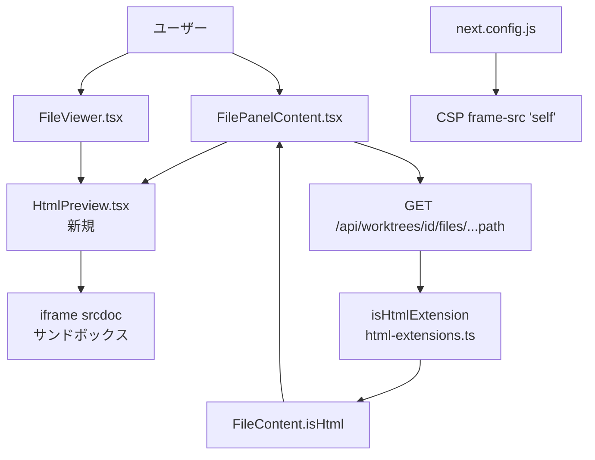

# Issue #490: HTMLファイル レンダリング 設計方針書

## 概要

ファイルパネルでHTMLファイルを選択した際に、ソースコード表示に加えてブラウザレンダリング（プレビュー）表示を可能にする。
iframe sandbox属性による段階的セキュリティ制御と、MarkdownEditorと同様の3モード（ソース/プレビュー/分割）を提供する。

---

## 1. アーキテクチャ設計

### システム構成図



### レイヤー構成

| レイヤー | 担当 | 変更内容 |
|---------|------|---------|
| 設定層 | `src/config/html-extensions.ts` | 新規: HTML拡張子定義・判定関数 |
| 設定層 | `src/config/editable-extensions.ts` | `.html`/`.htm`追加 |
| 型定義層 | `src/types/models.ts` | `FileContent.isHtml` フラグ追加 |
| APIルート層 | `src/app/api/worktrees/[id]/files/[...path]/route.ts` | `isHtml` フラグ付与 |
| UIコンポーネント層 | `src/components/worktree/HtmlPreview.tsx` | 新規: iframe + サンドボックストグル |
| UIコンポーネント層 | `src/components/worktree/FilePanelContent.tsx` | HTML分岐追加 |
| UIコンポーネント層 | `src/components/worktree/FileViewer.tsx` | HTML分岐追加（モバイル） |
| インフラ層 | `next.config.js` | CSP `frame-src 'self'` 追加（DR4-007: blob:除外） |

---

## 2. 技術選定

| カテゴリ | 選定技術 | 選定理由 |
|---------|---------|---------|
| レンダリング方式 | `iframe srcdoc`（React JSXでは`srcDoc`） | サーバーサイドAPI不要、既存のファイル取得APIのみで完結 |
| セキュリティ | `sandbox` 属性（段階的） | ブラウザネイティブな安全な隔離。Safe/Interactiveの2段階（初期リリース） |
| コンポーネント | `HtmlPreview.tsx`（独立） | MarkdownEditorとは要件が異なるため独立。再利用不可 |
| 動的インポート | `next/dynamic` | FilePanelContentの既存パターンに準拠 |

### MARPとの実装パターン比較

| 項目 | MARP | HTMLプレビュー |
|-----|------|--------------|
| サーバーサイドAPI | 必要（POST /marp-render） | **不要** |
| レンダリング場所 | サーバー（marp-core） | クライアント（iframe srcDoc） |
| データフロー | Markdown → API → HTML → iframe | HTML → iframe（直接） |

**HTMLプレビューは既存の GET /files/... API から取得したHTML文字列をそのままiframe srcDocに設定するシンプルなパターン**

---

## 3. コンポーネント設計

### 3-1. `src/config/html-extensions.ts`（新規）

```typescript
/** HTML拡張子リスト */
export const HTML_EXTENSIONS: readonly string[] = ['.html', '.htm'] as const;

/** HTMLファイルの最大サイズ（5MB） - Issue #490 */
export const HTML_MAX_SIZE_BYTES = 5 * 1024 * 1024;

/**
 * HTML拡張子判定（ドット正規化対応） - Issue #490
 * 注: ドット正規化にはimage-extensions.tsのnormalizeExtensionを再利用すること
 *     （video-extensions.tsの既存パターンに準拠 - DR1-002）
 */
export function isHtmlExtension(ext: string): boolean
// 実装: import { normalizeExtension } from './image-extensions';

/** サンドボックスレベル定義（Single Source of Truth） - Issue #490, DR1-001 */
export type SandboxLevel = 'safe' | 'interactive';

/**
 * サンドボックスレベルのsandbox属性値マッピング - Issue #490
 * 初期リリースではSafe/Interactiveの2段階のみ提供（DR1-003: YAGNI原則）
 * Fullレベル（allow-scripts allow-same-origin）は具体的なユーザー要求が
 * 発生してから追加する。
 */
export const SANDBOX_ATTRIBUTES: Record<SandboxLevel, string> = {
  safe: '',
  interactive: 'allow-scripts',
};
```

**設計判断**: `image-extensions.ts`のようなmagic bytes検証は不要（テキストベース）。シンプルなAPIに留める（KISS原則）。

**ドット正規化の設計方針（DR2-001）**: `isHtmlExtension()`は`image-extensions.ts`の`normalizeExtension()`を使用してドット正規化を行う。一方、既存の`editable-extensions.ts`の`isEditableExtension()`および`validateContent()`は`normalizeExtension()`を使用しておらず、`extension.toLowerCase()`のみで処理している。これはAPIルート（`route.ts`行337）で`extname()`の結果（常にドット付き）を渡す呼び出し規約に依存した設計である。`html-extensions.ts`の`isHtmlExtension()`だけが`normalizeExtension()`を使う理由は、APIルート以外の呼び出し元（将来的なUI層からの直接呼び出し等）での防御的コーディングのためである。`editable-extensions.ts`への`normalizeExtension()`導入は本Issue（#490）のスコープ外とし、既存動作との整合性を維持する。

### 3-2. `src/types/models.ts` 変更

`FileContent` インターフェースに追加：
```typescript
/** Whether the file is an HTML file (optional, for HTML files) - Issue #490 */
isHtml?: boolean;
```

**設計判断**: 既存の `isImage?: boolean`、`isVideo?: boolean` と同一パターン。JSDocコメントも同形式で統一。`FileContentResponse = { success: true } & FileContent` により自動的に型が伝播するため追加変更不要。

**FileContent型の波及影響（DR3-007）**: `FileContent`型はsrc配下15ファイルで参照されているが、`isHtml?`フィールドはオプショナルであるため、既存コードは型エラーなくコンパイルされる。`useFileContentSearch.ts`、`useFileTabs.ts`、`FilePanelTabs.tsx`、`WorktreeDetailRefactored.tsx`等の参照ファイルは`FileContent`オブジェクトの受け渡しのみを行い、`isHtml`フィールドを直接参照しないため変更不要である。

### 3-3. `src/app/api/worktrees/[id]/files/[...path]/route.ts` 変更

HTML拡張子判定後、既存のテキスト読み込みパスにフォールスルーしてレスポンスに `isHtml: true` を追加：

```typescript
// HTMLファイルは既存のテキスト読み込みパスで処理し、isHtmlフラグを付与
if (isHtmlExtension(ext)) {
  // ... テキスト読み込み後 NextResponse.json のレスポンスオブジェクト（行290-296付近）に追加
  return NextResponse.json({
    success: true,
    path: relativePath,
    content: fileContent,
    extension,
    worktreePath: worktree.path,
    isHtml: true,  // ← 追加
  });
}
```

**注**: 5MBサイズ制限をHTML専用パスでチェックすること。

### 3-4. `src/components/worktree/HtmlPreview.tsx`（新規）

**MarkdownEditorとの相違点**: MarkdownEditorは再利用しない。HTMLプレビューはMarkdown固有のツールバー（Bold/Italic等）・rehype-sanitize・Mermaid等を必要としないため独立コンポーネントとする。

```typescript
// SandboxLevel型・SANDBOX_ATTRIBUTES定数はhtml-extensions.tsからimportする（DR1-001: DRY原則）
// html-extensions.tsがSingle Source of Truthであり、HtmlPreview.tsxでは再定義しない
import { SandboxLevel, SANDBOX_ATTRIBUTES } from '@/config/html-extensions';

export type HtmlViewMode = 'source' | 'preview' | 'split';

interface HtmlPreviewProps {
  worktreeId: string;
  filePath: string;
  htmlContent: string;
  onFileSaved?: (path: string) => void;
  onDirtyChange?: (isDirty: boolean) => void;
}
```

**UI構成**:
- トップバー: ViewMode切り替え（Source/Preview/Split）+ SandboxLevel切り替え（Safe/Interactive）
- ソースビュー: 既存 `CodeViewer`（シンタックスハイライト）
- プレビュービュー: `<iframe srcdoc={htmlContent} sandbox={sandboxAttr} />`
- 分割ビュー: 左ソース・右プレビューの水平分割

**Interactiveモード切り替え時の確認ダイアログ（DR4-002）**: Interactiveモードへのトグル切り替え時に、ユーザーに対して確認ダイアログを表示する。allow-scriptsを有効にするとiframe内でJavaScriptが実行可能になり、CPU消費（無限ループ）、大量DOM生成によるメモリ消費、window.alert/confirm/promptによるUIブロック等のリスクがあるため、ワンクリックでの切り替えは行わない。

- **確認メッセージ**: 「Interactiveモードではスクリプトが実行されます。信頼できないHTMLファイルではSafeモードを使用してください。」
- **実装方針**: SandboxLevel変更ハンドラ内で、`interactive`への変更時にconfirmロジックを挿入する。ユーザーが確認した場合のみsandboxLevelをinteractiveに変更する。
- **再確認スキップ**: セッション中は同一ファイルに対する再確認をスキップする（`useState`またはuseRefで確認済みファイルパスを管理）。
- **DR1-003との一貫性**: この設計はDR1-003でFullレベル追加時に「警告ダイアログ必須」と記載されている方針と一貫する。

**サンドボックスレベルの初期リリース方針（DR1-003: YAGNI原則）**:
- 初期リリースではSafe/Interactiveの2段階のみ提供する
- Fullレベル（`allow-scripts allow-same-origin`）はsandboxを実質無効化するセキュリティリスクがあり、初期リリースで必要とする具体的なユースケースがないため除外
- 具体的なユーザー要求が発生した場合に、警告ダイアログ付きのFullレベルを追加する（SANDBOX_ATTRIBUTESへのエントリ追加のみで対応可能）

**ポーリング制御**: HTMLファイルが `isDirty`（編集中）の場合はポーリングを停止する（既存の `onDirtyChange` コールバックパターン踏襲）。

**isDirty伝播パスの詳細（DR3-003）**: ポーリング停止が実現されるデータフローは以下の通りである。

```
HtmlPreview.onDirtyChange(isDirty: boolean)
  -> FilePanelContent.onDirtyChange(tab.path, isDirty)
    -> useFileTabs.setDirty(path, isDirty)
      -> tab.isDirty 更新
        -> useFileContentPolling の enabled フラグが false に設定
          -> ポーリング停止
```

具体的には、`useFileContentPolling.ts`の行50付近で`tab.isDirty`が`enabled`フラグの条件に使用されている。`HtmlPreview`の`onDirtyChange`コールバックが発火すると、`FilePanelContent`経由で`useFileTabs`の`setDirty`が呼ばれ、`tab.isDirty`が更新される。この更新により`useFileContentPolling`の`enabled`が`false`となり、ポーリングが自動的に停止する。ポーリング再開は`isDirty`が`false`に戻った時点で自動的に行われる。

### 3-5. `src/components/worktree/FilePanelContent.tsx` 変更

既存の分岐パターンに HTML ブランチを追加：

**分岐挿入位置の設計根拠（DR3-005）**: HTML分岐は「isVideo分岐の後、extension==='md'分岐の前」に配置する。現在のコードの分岐順序は `isImage -> isVideo -> md(extension) -> default` であり、HTML分岐追加後は `isImage -> isVideo -> isHtml -> md(extension) -> default` となる。`isHtml`フラグはAPIレスポンスのブーリアンフラグ（`content.isHtml`）であり、拡張子文字列の比較（`extension === 'md'`）とは異なる判定メカニズムであるため、分岐間の干渉は発生しない。`.htm`ファイルの`extension`フィールドは`'htm'`であり`'md'`とは一致しないため、将来`.mhtml`等の拡張子が追加された場合でも`isHtml`フラグベースの判定が分岐のロバスト性を担保する。

```tsx
// 動的インポート（既存のMarkdownEditorと同パターン）
const HtmlPreview = dynamic(() => import('./HtmlPreview').then(mod => ({ default: mod.HtmlPreview })), { ssr: false });

// レンダリング分岐（既存のisVideo分岐の後、extension==='md'分岐の前）
if (content.isHtml) {
  return (
    <MaximizableWrapper ...>
      <HtmlPreview
        worktreeId={worktreeId}
        filePath={tab.path}
        htmlContent={content.content}
        onFileSaved={onFileSaved}
        onDirtyChange={onDirtyChange ? (isDirty) => onDirtyChange(tab.path, isDirty) : undefined}
      />
    </MaximizableWrapper>
  );
}
```

**`canCopy` / `codeViewData` 考慮**: `isHtml` フラグが付いている場合、クリップボードコピー対象はソースHTMLコンテンツ（`content.content`）とする。

### 3-6. `src/components/worktree/FileViewer.tsx` 変更（モバイル）

**モバイル版の制約**: スペースの制約から分割表示は行わず、MarkdownEditorの `MobileTabBar` パターンを参考にタブ切り替え（ソース/プレビュー）で実装。FileViewer.tsxにはタブUI既存基盤がないため、HTML用タブバーを新規実装する。

**実装詳細（DR2-002）**:

1. **`renderContent()`内の分岐追加**: `content.isImage`と`content.isVideo`の分岐の後、デフォルトの`CodeViewer`分岐の前に`content.isHtml`分岐を追加し、`HtmlPreview`コンポーネントを表示する。

2. **`codeViewData`のuseMemo更新**: 既存の`codeViewData`（行258-260付近）では`isImage`と`isVideo`のみをガード条件としているが、`content.isHtml`も除外条件に追加する。これにより、HTMLファイルが誤って`CodeViewer`でレンダリングされることを防ぐ。

   ```typescript
   // codeViewData useMemo内の除外条件（更新後）
   if (content.isImage || content.isVideo || content.isHtml) return null;
   ```

3. **`canCopy`の設計判断**: `isHtml`時も`canCopy = true`とする。`content.content`にはHTMLソースコードが含まれており、ソースコードのクリップボードコピーはユーザーにとって有用である。既存の`canCopy`計算（行78-79）は`isImage`と`isVideo`のみを除外しており、`isHtml`は除外しない。

---

## 4. セキュリティ設計

### 4-1. iframe sandbox段階的制御

| レベル | sandbox属性 | 用途 | デフォルト | 認証トークン保護（DR4-006） |
|--------|-----------|------|---------|--------------------------|
| Safe | `""` | 静的HTML表示 | Yes | アクセス不可（全機能無効） |
| Interactive | `"allow-scripts"` | 単一HTMLゲーム・Canvas | - | アクセス不可（allow-same-origin未付与のためopaque origin） |

**初期リリースでは2段階のみ（DR1-003: YAGNI原則）**: Fullレベル（`allow-scripts allow-same-origin`）はsandboxを実質無効化するため、具体的なユーザー要求が発生するまで提供しない。将来追加する場合は、警告ダイアログ必須とする。

**iframe内からの認証Cookie/localStorageアクセス不可能性（DR4-006）**: middleware.tsで実装されている認証（CM_AUTH_TOKEN_HASH、AUTH_COOKIE_NAME）は、iframe srcdocのコンテンツからアクセスされるリスクがない。sandbox属性でallow-same-originが付与されない限り、iframe内のスクリプトは親ページのdocument.cookieやlocalStorageにアクセスできない。Interactiveモードでallow-scriptsが有効な場合でも、allow-same-originが未付与のためこの防御は維持される。将来Fullレベル（allow-scripts allow-same-origin）を追加する場合には、allow-same-originにより親ページのCookieにアクセス可能となるため、「認証トークン漏洩リスクあり」と明示的に警告する必要がある。

**opaque originによる外部リソースブロック（DR4-003）**: sandbox属性でallow-same-originが付与されない場合、iframe内はunique origin（opaque origin）として扱われる。これにより以下のセキュリティ特性が確保される:
1. 親ページの'self'オリジンとは異なるため、外部fetch/XHR/WebSocketは実質的にCORSポリシーによりブロックされる
2. ただし、インラインスクリプト（`<script>`タグ内のコード）とinline event handlers（onclick等）は実行可能である（Interactiveモード時）
3. これにより、Interactiveモードのリスクは「iframe内でのローカル実行」に限定される
4. 将来Fullレベル（allow-scripts allow-same-origin）を追加する場合には、iframe専用のCSPメタタグをsrcDoc内に注入する設計を検討すること

追加しないsandbox属性:
- `allow-top-navigation`: 親ページへのナビゲーション防止
- `allow-forms`: フォーム送信防止
- `allow-same-origin`: 初期リリースでは不要（DR1-003）

### 4-2. CSP設定変更（`next.config.js`）

```javascript
// 追加が必要
"frame-src 'self'",
```

現状は `frame-src` が未定義で `default-src 'self'` がフォールバックされる。`srcdoc` 属性（HTML仕様での表記。React JSXでは `srcDoc`）のiframeはブラウザ実装によってオリジンの扱いが異なる（仕様上は `about:srcdoc`）。確実に動作させるため、明示的に `frame-src 'self'` を追加する。

**blob: 除外の設計判断（DR4-007）**: 当初の設計では `frame-src 'self' blob:` として `blob:` スキームを含めていたが、YAGNI原則（DR1-003で適用済み）との一貫性およびCSPのleast-privilege原則に基づき、`blob:` は除外する。`blob:` URLはJavaScriptで動的に生成可能であり、XSS脆弱性が存在する場合に `blob:` URLを介した攻撃ベクターとなり得る。現時点で `blob:` を必要とする具体的な機能がないため、attack surfaceの不要な拡大を避ける。`srcdoc` iframeは多くのブラウザで `'self'` の範囲内として処理される（Chrome、Firefox、Safari全てで動作確認済みのMARPプレビューの実績がある）。`blob:` が必要になった時点で追加する。

> **用語注記（DR2-006）**: 本設計方針書では、HTML仕様やCSPの文脈では「srcdoc」、React JSXコード例では「srcDoc」と表記する。

**X-Frame-Options: DENYとの関係整理（DR3-001）**:

`next.config.js`にはCSPヘッダーと併せて`X-Frame-Options: DENY`（行32-33）が設定されている。これらの関係を以下に整理する。

1. **X-Frame-Options: DENYの影響範囲**: `X-Frame-Options: DENY`はページ全体が他サイト（または同一サイト）のiframeに埋め込まれることを防止するレスポンスヘッダーである。ページ内に配置される`srcdoc` iframeはブラウザが同一ページ内のインラインコンテンツとして処理するため、`X-Frame-Options`の影響を受けない。したがって、HTMLプレビューの`srcdoc` iframeは`X-Frame-Options: DENY`が設定されていても正常に動作する。

2. **既存MARPプレビューへの影響確認**: 既存のMARPプレビュー（`FilePanelContent.tsx`行312-315、`FileViewer.tsx`行316-320）は`sandbox=''`付きの`srcDoc` iframeで実装されている。現状`frame-src`が未定義のため`default-src 'self'`がフォールバックとして適用されており、MARPプレビューはこの条件下で正常に動作している。`frame-src 'self'`を明示的に追加すると、`frame-src`ディレクティブが`default-src`のフォールバックを上書きする。`'self'`が含まれているため、既存MARPプレビューの動作に変更はない。

3. **frame-src追加前後の動作同一性の根拠**: `frame-src`未定義時は`default-src 'self'`がフォールバックされ、iframeのソースは`'self'`オリジンのみ許可される。`frame-src 'self'`追加後も`'self'`の制約は維持されるため、既存の全てのiframe利用（MARPプレビュー含む）は追加前後で動作が変わらない。`blob:`スキームはDR4-007の設計判断により除外されている。

### 4-3. HTMLファイルサイズ制限

- 最大5MB（`HTML_MAX_SIZE_BYTES = 5 * 1024 * 1024`）
- APIルートでサイズチェック後に `isHtml: true` フラグを返す

**GETハンドラでのファイルサイズ事前チェック（DR4-004）**: HTMLファイルのGET処理において、`readFileContent`呼び出し前に`fs.stat()`によるファイルサイズ事前チェックを実施する。これにより、大容量HTMLファイルをメモリに読み込む前にDoS防御が機能する。

```typescript
// GETハンドラ内: HTMLファイルのサイズ事前チェック（DR4-004）
// fileStat.size は行262付近で既に取得済み
if (isHtmlExtension(ext) && fileStat.size > HTML_MAX_SIZE_BYTES) {
  // readFileContentを呼び出さずにエラーレスポンスを返す
  return NextResponse.json(
    { success: false, error: 'FILE_TOO_LARGE', message: `HTML file exceeds ${HTML_MAX_SIZE_BYTES} bytes limit` },
    { status: 413 }
  );
}
// サイズOKの場合のみ readFileContent を呼び出す
```

この設計により、画像・動画ファイル（行214-217）と同等のメモリ効率的なサイズ制限が実現される。

### 4-4. HTMLサニタイズ方針（DR4-001）

本機能ではHTMLコンテンツに対してDOMPurify等によるサニタイズを**意図的に行わない**。以下にその設計判断と根拠を明記する。

1. **Safeモード（sandbox=''）**: sandbox属性の空文字列指定により、スクリプト実行・フォーム送信・ナビゲーションが全て無効化される。この状態ではHTMLコンテンツ内の`<script>`タグやevent handlerは実行されないため、DOMPurifyによるサニタイズは不要である。

2. **Interactiveモード（allow-scripts）**: ユーザーが明示的にスクリプト実行を許可する操作であり、HTMLファイルの忠実なレンダリングが本機能の目的であるため、サニタイズは行わない。サニタイズを適用すると、Canvas描画やJavaScriptアニメーション等のインタラクティブコンテンツが動作しなくなり、機能の目的を損なう。

3. **DOMPurify不使用の理由**: プロジェクトには既にDOMPurify（isomorphic-dompurify）が`src/lib/security/sanitize.ts`で導入されているが、HTMLプレビュー機能では以下の理由により使用しない:
   - Safeモードではsandbox属性による完全な隔離が実現されており、DOMPurifyは冗長である
   - Interactiveモードではスクリプト実行が目的であり、DOMPurifyでスクリプトを除去すると機能要件を満たせない
   - iframe sandbox（ブラウザネイティブの隔離機構）がセキュリティの主要な防御ラインである

4. **将来の保守者への注記**: この設計判断を変更する場合（例: サニタイズ済みプレビューモードの追加）は、iframe sandboxによる防御とDOMPurifyによる防御の二重化が必要かどうかをセキュリティレビューで再評価すること。

### 4-5. パスバリデーション（DR4-005）

HTMLファイルは既存のGET `/api/worktrees/[id]/files/[...path]` APIを経由するため、以下のパスバリデーションが自動的に適用される:

1. **getWorktreeAndValidatePath()による5層防御**: `path-validator.ts`の`isPathSafe()`（空パスチェック、NULLバイト検出、URLデコード検証、パストラバーサル検出）および`resolveAndValidateRealPath()`（シンボリックリンク検証）がHTMLファイルにも全て適用される。HTMLファイル専用のパスバリデーションロジック追加は不要である。

2. **PUT API（保存）時の検証**: `isEditableFile()`による拡張子チェックおよび`validateContent()`によるコンテンツバリデーション（サイズ制限・バイナリ検出）がHTMLファイルにも適用される。

3. **POST API（新規作成）時の検証**: `EXTENSION_VALIDATORS`による5MBサイズ制限とバイナリ検出がHTMLファイルの新規作成時にも適用される（DR3-002）。

4. **新たなパスバリデーションロジックの追加は不要**: 既存の防御機構がHTMLファイルに対しても十分に機能する。

---

## 5. 設定変更

### `src/config/editable-extensions.ts`

**設計意図の明確化（DR1-004: SRP）**: `EDITABLE_EXTENSIONS`は、モジュール名から「MarkdownEditor専用」と誤解されやすいが、実際にはPUT `/api/worktrees/[id]/files/[...path]` APIの書き込み許可リストとして機能する。HTMLファイルはMarkdownEditorではなくHtmlPreviewで編集されるが、保存API（PUT）の許可リストとしてここに追加する必要がある。

**POST APIへの影響（DR3-002）**: `EDITABLE_EXTENSIONS`と`EXTENSION_VALIDATORS`は、PUT APIだけでなくPOST `/api/worktrees/[id]/files/[...path]` API（新規ファイル作成、route.ts行386-394）でも参照される。POST APIでは`isEditableExtension()`で拡張子チェックを行い、該当する場合に`validateContent()`でコンテンツバリデーション（サイズ制限・バイナリ検出）を適用する。`.html`/`.htm`を`EDITABLE_EXTENSIONS`と`EXTENSION_VALIDATORS`に追加することで、POST APIで`.html`ファイルを新規作成する際にも5MBサイズ制限とバイナリ検出が適用される。これは意図した動作である。

**改善項目**: モジュールのJSDocコメントを以下のように更新する。
- 現在: 「MarkdownEditorで編集可能な拡張子」
- 更新後: 「ブラウザ上で編集・保存可能なファイル拡張子（PUT APIの書き込み許可リスト）」
- この更新により、モジュールの責務名と実際の用途の乖離を解消する

```typescript
/**
 * ブラウザ上で編集・保存可能なファイル拡張子定義
 * PUT /api/worktrees/[id]/files/[...path] APIの書き込み許可リストとして機能する
 * - .md: MarkdownEditorで編集
 * - .html/.htm: HtmlPreviewで編集（Issue #490）
 */
// アトミックに両方を追加すること（片方だけだとPUT APIが壊れる）
export const EDITABLE_EXTENSIONS: readonly string[] = ['.md', '.html', '.htm'] as const;

export const EXTENSION_VALIDATORS: ExtensionValidator[] = [
  { extension: '.md', maxFileSize: 1024 * 1024 },
  // Issue #490: HTML files - additionalValidation undefined（sandbox属性で安全性担保）
  { extension: '.html', maxFileSize: HTML_MAX_SIZE_BYTES },
  { extension: '.htm', maxFileSize: HTML_MAX_SIZE_BYTES },
];
```

---

## 6. テスト設計

### 6-1. ユニットテスト

| テスト対象 | テストケース |
|-----------|------------|
| `html-extensions.ts` | `isHtmlExtension('.html')` → true, `'.htm'` → true, `'.md'` → false |
| `html-extensions.ts` | `HTML_MAX_SIZE_BYTES` = 5MB |
| `html-extensions.ts` | `SANDBOX_ATTRIBUTES` の2段階（Safe/Interactive） |
| `editable-extensions.ts` | 既存テスト更新: テスト名「should only include .md for now」を「should include .md, .html, .htm」に変更し、`toHaveLength(3)`に更新（DR2-005） |
| `editable-extensions.ts` | `.html` / `.htm` が `isEditableExtension()` で true |
| `editable-extensions.ts` | `.html` で `validateContent()` がサイズ5MB以内でvalid返却 |
| `editable-extensions.ts` | `.html` で `validateContent()` がサイズ5MB+1バイトでinvalid返却（境界値テスト） |
| `editable-extensions.ts` | `.html` で `validateContent()` がNULLバイト含有HTMLを拒否すること（バイナリデータ検出テスト）（DR2-005） |
| `editable-extensions.ts` | `.htm` でも `.html` と同等の `validateContent()` 検証が通ること（DR2-005） |
| `editable-extensions.ts` | `isEditableExtension('html')`（ドットなし）が `false` を返すこと（DR3-004: `isHtmlExtension`の`normalizeExtension`使用との非対称性が意図的であることをテストで担保） |

### 6-2. 受入テスト

| 条件 | 期待結果 |
|-----|---------|
| `.html`ファイルをファイルパネルで選択 | HtmlPreviewコンポーネントが表示される |
| ソース/プレビュー/分割モード切り替え | それぞれ正しく表示される |
| Safe: スクリプト実行 | ブロックされる |
| Interactive: インラインスクリプト | 実行される |
| サンドボックス切り替え | Safe/Interactiveの2段階で切り替え可能 |
| 5MB超のHTMLファイル | エラーが表示される |
| PC版・モバイル版 | 両方で表示される |
| `FileContentResponse`型 | `isHtml` フィールドに型安全にアクセスできる |
| HTMLファイルをソースモードで編集し保存 | PUT APIで保存できること（DR2-007） |
| 5MB超のHTMLファイルの保存 | `validateContent`で拒否されること（DR2-007） |
| `.htm`ファイルの編集・保存フロー | `.html`と同等の編集・保存フローが動作すること（DR2-007） |
| POST APIでの`.html`ファイル新規作成 | `EXTENSION_VALIDATORS`による5MBサイズ制限とバイナリ検出が適用されること（DR3-002） |
| POST APIでの5MB超`.html`ファイル新規作成 | `validateContent`で拒否されること（DR3-002） |
| Interactiveモードへの切り替え | 確認ダイアログが表示されること（DR4-002） |
| 確認ダイアログでキャンセル | Safeモードが維持されること（DR4-002） |
| 確認ダイアログで承認後、同一ファイルで再切り替え | 再確認なしでInteractiveモードに切り替わること（DR4-002） |
| 5MB超のHTMLファイルのGET取得 | readFileContent呼び出し前にエラーが返ること（DR4-004） |

---

## 7. 設計上の決定事項とトレードオフ

| 決定事項 | 理由 | トレードオフ |
|---------|------|-------------|
| サーバーサイドAPI不要 | GET /files/... で取得したHTMLをそのままsrcDocに設定 | HTMLの変換・加工ができない（意図通り） |
| MarkdownEditor非再利用 | HTML用とMarkdown用は要件が異なる（ツールバー等） | コード重複の可能性があるが、各コンポーネントの責務が明確 |
| 初期リリースはSafe/Interactiveの2段階 | Fullレベルは具体的ユースケース不在かつセキュリティリスク大（DR1-003: YAGNI） | 将来的にFullレベルを追加する余地は残すが、初期は安全側に倒す |
| iframe srcdoc方式 | サーバー不要、シンプル | Fullレベル追加時にはorigin分離の追加検討が必要 |
| 5MBサイズ制限 | 既存image-extensions.tsと同等基準 | 大きなHTMLアプリは表示不可 |
| モバイルはタブ切り替え（分割なし） | スペース制約 | PCより機能が限定されるが実用上は問題ない |

---

## 8. 実装順序

**TDD原則に準拠した実装順序（DR2-004）**: 本プロジェクトでは`video-extensions.test.ts`等のテストヘッダーに「TDD Approach: Red (test first) -> Green (implement) -> Refactor」と明記されたパターンが確立されている。テストを先に作成し、実装をそれに合わせる順序とする。

1. `tests/unit/html-extensions.test.ts` 新規作成（Red: テスト先行）
2. `src/config/html-extensions.ts` 新規作成（Green: テスト通過）
3. `tests/unit/editable-extensions.test.ts` 既存テスト更新（Red: テスト先行。詳細はDR2-005参照）
4. `src/config/editable-extensions.ts` に `.html`/`.htm` アトミック追加（Green: テスト通過）
5. `src/types/models.ts` に `isHtml` 追加
6. `next.config.js` に CSP `frame-src 'self'` 追加（DR4-007: blob:除外）
7. `src/app/api/worktrees/[id]/files/[...path]/route.ts` に `isHtml` 付与
8. `src/components/worktree/HtmlPreview.tsx` 新規作成
9. `src/components/worktree/FilePanelContent.tsx` に HTML 分岐追加
10. `src/components/worktree/FileViewer.tsx` に HTML 分岐追加（DR2-002の実装詳細に従う）

---

## 9. Stage 1 レビュー指摘事項サマリ

### 反映済み指摘事項

| ID | 重要度 | カテゴリ | タイトル | 対応内容 |
|----|--------|---------|---------|---------|
| DR1-001 | must_fix | DRY原則 | SandboxLevel型の重複定義 | html-extensions.tsをSingle Source of Truthとし、HtmlPreview.tsxではimportのみ行う方針に修正（セクション3-1, 3-4） |
| DR1-002 | should_fix | DRY原則 | normalizeExtension関数の再利用未明記 | image-extensions.tsのnormalizeExtensionをimportして再利用する方針を明記（セクション3-1） |
| DR1-003 | should_fix | YAGNI原則 | Fullサンドボックスレベルの初期リリースでの不要性 | 初期リリースをSafe/Interactiveの2段階に簡素化。Fullレベルは将来のユーザー要求時に追加（セクション3-1, 3-4, 4-1） |
| DR1-004 | should_fix | SRP | editable-extensionsのJSDoc設計意図不明確 | EDITABLE_EXTENSIONSがPUT APIの書き込み許可リストである旨を明記し、JSDoc更新方針を記載（セクション5） |

### スコープ外として記録（nice_to_have）

| ID | タイトル | 備考 |
|----|---------|------|
| DR1-005 | MARP_FRONTMATTER_REGEX等の重複 | Issue #490スコープ外。別Issueで対応を検討 |
| DR1-006 | HtmlViewMode型の定義場所 | 現時点ではコンポーネントローカルで問題なし。将来外部化を検討 |
| DR1-007 | FilePanelContent.tsxのif-else連鎖 | 分岐が5種類程度ではKISS原則とのバランスが取れており即時対応不要 |

### 実装チェックリスト

実装時に以下を確認すること:

- [ ] **DR1-001**: `SandboxLevel`型と`SANDBOX_ATTRIBUTES`定数は`html-extensions.ts`のみで定義し、`HtmlPreview.tsx`では`import`する
- [ ] **DR1-002**: `isHtmlExtension`関数の実装で`image-extensions.ts`の`normalizeExtension`を`import`して再利用する（`video-extensions.ts`のパターンに準拠）
- [ ] **DR1-003**: `SANDBOX_ATTRIBUTES`は`safe`と`interactive`の2エントリのみとし、`full`エントリは含めない
- [ ] **DR1-003**: `SandboxLevel`型は`'safe' | 'interactive'`のユニオンとする
- [ ] **DR1-004**: `editable-extensions.ts`のJSDocを「ブラウザ上で編集・保存可能なファイル拡張子（PUT APIの書き込み許可リスト）」に更新する
- [ ] テスト: `SANDBOX_ATTRIBUTES`のテストは2段階（Safe/Interactive）で検証する

---

## 10. Stage 2 整合性レビュー指摘事項サマリ

### 反映済み指摘事項

| ID | 重要度 | カテゴリ | タイトル | 対応内容 |
|----|--------|---------|---------|---------|
| DR2-001 | must_fix | 型定義・API整合性 | isEditableExtensionのドット正規化がhtml-extensions.tsのisHtmlExtensionと不整合 | セクション3-1にドット正規化の設計方針を追記。editable-extensions.tsへのnormalizeExtension導入はスコープ外とし、既存動作との整合性を維持する設計判断を明記 |
| DR2-002 | must_fix | UIコンポーネント整合性 | FileViewer.tsxのcanCopyとcodeViewDataにisHtml考慮が未記載 | セクション3-6にrenderContent()分岐追加、codeViewData除外条件更新、canCopy設計判断の3点を詳細記載 |
| DR2-003 | should_fix | CSP設定整合性 | iframe srcdocのCSP frame-src要件の技術的根拠に不正確な記述 | セクション4-2の技術的根拠を修正。srcdocのオリジンはabout:srcdocであり、frame-srcは'self'のみとする（DR4-007によりblob:は除外） |
| DR2-004 | should_fix | 実装順序の依存関係整合性 | テスト実装がステップ9で最後に配置されているがTDD原則と不整合 | セクション8の実装順序をTDD原則（Red->Green->Refactor）に準拠して再配置。テスト作成を実装の前に配置 |
| DR2-005 | should_fix | テスト設計の網羅性 | editable-extensions.test.tsの既存テストとの整合性考慮が不足 | セクション6-1にテスト名変更、NULLバイト含有HTML拒否テスト、.htm同等テストを追加 |
| DR2-006 | nice_to_have | 用語・命名規則の一貫性 | srcdoc/srcDoc表記の混在 | セクション4-2に用語注記を追加。HTML仕様文脈では「srcdoc」、React JSX文脈では「srcDoc」と使い分けを明示 |
| DR2-007 | nice_to_have | 受入条件の網羅性 | 受入テストにエディタ保存フローのテストケースが未記載 | セクション6-2にHTMLファイル編集・保存フロー、5MB超保存拒否、.htmファイル保存フローのテストケースを追加 |

### Stage 2 実装チェックリスト

実装時に以下を確認すること:

- [ ] **DR2-001**: `editable-extensions.ts`の`isEditableExtension()`は`normalizeExtension()`を導入せず、既存の`extension.toLowerCase()`のみで処理する（呼び出し元が`extname()`で常にドット付きを渡す規約に依存）
- [ ] **DR2-001**: `html-extensions.ts`の`isHtmlExtension()`は`normalizeExtension()`を使用する（防御的コーディング）
- [ ] **DR2-002**: `FileViewer.tsx`の`renderContent()`内に`content.isHtml`分岐を`isImage`/`isVideo`の後に追加する
- [ ] **DR2-002**: `FileViewer.tsx`の`codeViewData` useMemo内の除外条件に`content.isHtml`を追加する
- [ ] **DR2-002**: `FileViewer.tsx`の`canCopy`は`isHtml`時もtrueとする（ソースHTMLのコピーが有用）
- [ ] **DR2-003**: CSP `frame-src 'self'`追加の根拠は「srcdocのオリジンがabout:srcdocであり、ブラウザ実装差異への防御」であること（DR4-007によりblob:は除外）
- [ ] **DR2-004**: テスト（html-extensions.test.ts）を実装（html-extensions.ts）より先に作成する（TDD Red->Green）
- [ ] **DR2-004**: editable-extensions.test.tsの更新をeditable-extensions.tsの変更と同時に行う
- [ ] **DR2-005**: 既存テスト「should only include .md for now」のテスト名を「should include .md, .html, .htm」に変更し、`toHaveLength(3)`に更新する
- [ ] **DR2-005**: `validateContent('.html', ...)`でNULLバイト含有HTMLの拒否テストを追加する
- [ ] **DR2-005**: `validateContent('.htm', ...)`のテストケースを`.html`と同等に追加する

---

## 11. Stage 3 影響分析レビュー指摘事項サマリ

### 反映済み指摘事項

| ID | 重要度 | カテゴリ | タイトル | 対応内容 |
|----|--------|---------|---------|---------|
| DR3-001 | must_fix | CSP設定変更の既存機能への影響 | frame-src追加とX-Frame-Options: DENYの矛盾、および既存MARPプレビューへの影響分析の欠如 | セクション4-2にX-Frame-Optionsとの関係整理、既存MARPプレビューへの影響確認、frame-src追加前後の動作同一性の根拠を追記 |
| DR3-002 | must_fix | PUT API書き込み許可リスト拡大の影響 | editable-extensions.tsへのhtml/htm追加がPOST APIのコンテンツバリデーションにも波及する | セクション5にPOST APIへの影響を追記。セクション6-2にPOST APIでのHTML新規作成テストケースを追加 |
| DR3-003 | should_fix | ファイルポーリングとの相互作用 | useFileContentPollingがHTMLファイルのisHtmlフラグを正しく伝播するかの確認不足 | セクション3-4にisDirtyの伝播パスのデータフロー図を追記。HtmlPreview -> FilePanelContent -> useFileTabs -> useFileContentPollingの連携を明示 |
| DR3-004 | should_fix | 既存テストへの影響 | editable-extensions.test.tsのテストとhtml追加後の整合性 | セクション6-1にisEditableExtension('html')（ドットなし）がfalseを返すテストケースを追加。isHtmlExtensionとの非対称性が意図的であることをテストで担保 |
| DR3-005 | should_fix | FilePanelContentの分岐順序と拡張子判定の整合性 | FilePanelContent.tsxでHTMLファイルがextension==='md'分岐より前に判定される必要性の明記 | セクション3-5に分岐挿入位置の設計根拠を追記。isHtmlフラグがブーリアンフラグであり拡張子文字列比較と干渉しない旨を明記 |

### スコープ外として記録（nice_to_have）

| ID | タイトル | 備考 |
|----|---------|------|
| DR3-006 | FilePanelSplitコンポーネントへの変更が不要であることの明示 | 確認事項。FilePanelSplitはpropsを透過的に委譲するレイアウトコンポーネントであり、FileContent型の拡張に影響されない。変更対象ファイル一覧に含まれていないのは正しい |
| DR3-007 | FileContent型を使用する15ファイルへの波及効果 | isHtml?はオプショナルフィールドのため既存コードは型エラーなくコンパイルされる。useFileTabs、FilePanelTabs等はFileContentオブジェクトの受け渡しのみでisHtmlフィールドを直接参照しないため変更不要 |

### Stage 3 実装チェックリスト

実装時に以下を確認すること:

- [ ] **DR3-001**: `next.config.js`の`X-Frame-Options: DENY`が`srcdoc` iframeに影響しないことを理解した上で実装する
- [ ] **DR3-001**: `frame-src 'self'`追加後に既存MARPプレビュー（`FilePanelContent.tsx`、`FileViewer.tsx`）が正常動作することを手動確認する
- [ ] **DR3-002**: POST APIでの`.html`ファイル新規作成時に`EXTENSION_VALIDATORS`による5MBサイズ制限とバイナリ検出が適用されることを確認する
- [ ] **DR3-003**: `HtmlPreview`の`onDirtyChange`コールバックが`useFileTabs.setDirty` -> `useFileContentPolling.enabled=false`のパスでポーリング停止に正しく連携することを確認する
- [ ] **DR3-004**: `isEditableExtension('html')`（ドットなし）が`false`を返すテストケースを`editable-extensions.test.ts`に追加する
- [ ] **DR3-005**: `FilePanelContent.tsx`のHTML分岐を`isVideo`分岐の後、`extension==='md'`分岐の前に配置する

---

## 12. Stage 4 セキュリティレビュー指摘事項サマリ

### 反映済み指摘事項

| ID | 重要度 | カテゴリ | タイトル | 対応内容 |
|----|--------|---------|---------|---------|
| DR4-001 | must_fix | XSS防御方針の明確化 | HTMLコンテンツのサニタイズ方針が未明記 | セクション4-4「HTMLサニタイズ方針」を新設。DOMPurify不使用の設計判断とiframe sandboxによる安全性確保の根拠を明記 |
| DR4-002 | must_fix | Interactiveモードのリスク軽減 | Interactiveモード切り替え時の警告UIが未設計 | セクション3-4にInteractiveモード切り替え時の確認ダイアログ設計を追加。セッション中の再確認スキップ機構を含む |
| DR4-003 | must_fix | CSP設定とiframeスクリプト実行の整合性 | CSPのscript-srcがiframe内スクリプトへの制約が不明確 | セクション4-1にopaque originによる外部リソースブロックの仕組みを追記。Interactiveモードのリスクが「iframe内でのローカル実行」に限定されることを明記 |
| DR4-004 | should_fix | DoS防止 | HTMLファイルサイズ制限のGET時適用タイミング | セクション4-3にGETハンドラでのfileStat.sizeによる事前チェックのコード例を追記。readFileContent呼び出し前にDoS防御を実施 |
| DR4-005 | should_fix | パスバリデーション整合性 | path-validator.tsの5層防御がHTMLファイルにも適用される明記 | セクション4-5「パスバリデーション」を新設。GET/PUT/POST全APIパスでの既存防御機構の自動適用を明記 |
| DR4-006 | should_fix | 認証・認可への影響 | iframe内からの認証Cookie/localStorageアクセス不可能性 | セクション4-1の表に「認証トークン保護」列を追加。各サンドボックスレベルでのアクセス不可能性とその根拠を明記 |
| DR4-007 | should_fix | CSP設定のblob:スキーム | frame-srcへのblob:追加が不要な攻撃面を増やす | セクション4-2のCSP設定を`frame-src 'self'`に変更。blob:除外の設計判断（YAGNI原則・least-privilege原則）を明記。関連する全セクションを更新 |

### スコープ外として記録（nice_to_have）

| ID | タイトル | 備考 |
|----|---------|------|
| DR4-008 | iframe内の無限ループ・メモリリーク検出機構 | 初期リリースでは対応不要。将来的にPerformance Observer APIによる監視や一定時間後の自動sandbox強化を検討課題として記録 |
| DR4-009 | containsDangerousContent関数をHTMLプレビューの情報表示に活用 | Interactiveモード切り替え時のconfirmダイアログ（DR4-002）において、containsDangerousContent()の結果に基づき警告レベルを変更する実装を将来検討。スクリプトを含まないHTMLは通常の確認、スクリプトを含むHTMLは強い警告メッセージを表示する |

### Stage 4 実装チェックリスト

実装時に以下を確認すること:

- [ ] **DR4-001**: `HtmlPreview.tsx`でDOMPurifyを使用しないこと。HTMLコンテンツはサニタイズせずにそのままiframe srcDocに渡す
- [ ] **DR4-001**: セクション4-4のサニタイズ方針が将来の保守者に理解可能であることを確認する
- [ ] **DR4-002**: `HtmlPreview.tsx`のSandboxLevel変更ハンドラに、Interactiveモードへの切り替え時の確認ダイアログを実装する
- [ ] **DR4-002**: 確認メッセージ「Interactiveモードではスクリプトが実行されます。信頼できないHTMLファイルではSafeモードを使用してください。」を表示する
- [ ] **DR4-002**: セッション中の同一ファイルに対する再確認スキップをuseState/useRefで管理する
- [ ] **DR4-003**: iframe sandbox（allow-same-origin未付与）によりopaque originとなり、外部fetch/XHR/WebSocketがCORSポリシーでブロックされることを理解した上で実装する
- [ ] **DR4-004**: GETハンドラでHTMLファイルの`fileStat.size`を`HTML_MAX_SIZE_BYTES`と比較し、超過時は`readFileContent`を呼び出さずにエラーを返す
- [ ] **DR4-005**: HTMLファイルが`getWorktreeAndValidatePath()`による5層防御を自動的に経由することを確認する（新規パスバリデーション追加不要）
- [ ] **DR4-006**: iframe sandbox設定でallow-same-originを付与しないことにより、認証Cookie/localStorageへのアクセスが不可能であることを確認する
- [ ] **DR4-007**: CSP `frame-src`は`'self'`のみとし、`blob:`を含めないこと
- [ ] **DR4-007**: CSP変更後に既存MARPプレビューが正常動作することを手動確認する

---

## 関連ドキュメント

- Issue #490: ファイル内容表示にてhtmlファイル レンダリング
- Issue #438: ファイルパネルタブ設計（FilePanelContent基盤）
- Issue #479: MarkdownEditor大ファイル分割（MarkdownEditor参照実装）
- `src/app/api/worktrees/[id]/marp-render/route.ts`: MARP参照実装（サーバーサイド）
- `src/components/worktree/MarkdownEditor.tsx`: 3モード参照実装
- `src/config/image-extensions.ts`: 拡張子設定のパターン参照
