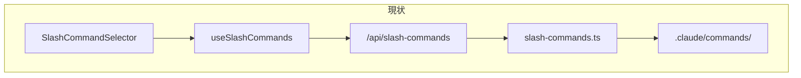
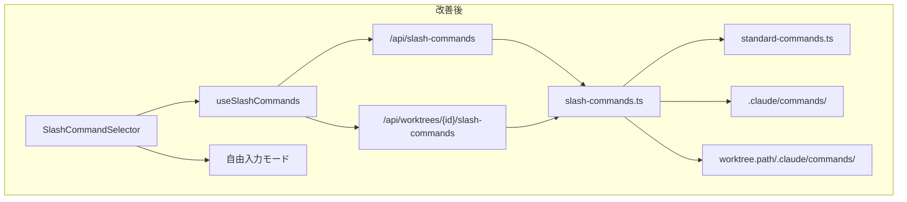

# 設計方針書: Claude Code標準スラッシュコマンド対応

## Issue情報
- **Issue番号**: #56
- **タイトル**: claude code標準搭載のスラッシュコマンドを利用出来るようにする
- **作成日**: 2026-01-25

---

## 1. 要件分析

### 要求事項
1. Claude Code標準搭載のスラッシュコマンド（`/clear`, `/compact`等）を利用可能にする
2. 最新のClaude Code機能をフル活用したい

### 制約条件
- Claude Codeの標準機能が追加された際、**自動で対応**してほしい

### 追加要件（調査で判明）
- モバイルUIでは登録コマンドしか選択できない
- MySwiftAgent等の対象リポジトリのコマンドがUIに表示されない

---

## 2. 調査結果サマリー

### 2.1 Claude Code標準コマンド

| カテゴリ | コマンド数 | 例 |
|---------|-----------|-----|
| セッション管理 | 5個 | `/clear`, `/compact`, `/resume` |
| 設定 | 7個 | `/config`, `/model`, `/permissions` |
| モニタリング | 4個 | `/status`, `/context`, `/cost` |
| Git/レビュー | 3個 | `/review`, `/pr-comments` |
| ユーティリティ | 7個 | `/help`, `/doctor`, `/export` |
| **合計** | **39個** | - |

**重要**: 標準コマンドは**Claude Code CLIに組み込み済み**であり、特別な設定なしで利用可能。

### 2.2 現在のUI問題

```
┌─────────────────────────────────────────────────────────┐
│ 問題1: UIのコマンドソース                                │
├─────────────────────────────────────────────────────────┤
│ slash-commands.ts                                        │
│   └── process.cwd() → MyCodeBranchDesk固定              │
│       └── .claude/commands/ → 12コマンドのみ            │
└─────────────────────────────────────────────────────────┘

┌─────────────────────────────────────────────────────────┐
│ 問題2: 対象リポジトリのコマンドが非表示                  │
├─────────────────────────────────────────────────────────┤
│ MySwiftAgent (15コマンド) → UIに表示されない             │
│ 他のworktree → UIに表示されない                          │
└─────────────────────────────────────────────────────────┘

┌─────────────────────────────────────────────────────────┐
│ 問題3: モバイルでの自由入力が困難                        │
├─────────────────────────────────────────────────────────┤
│ ボトムシートからの選択のみ                               │
│ 標準コマンドを直接入力できない                           │
└─────────────────────────────────────────────────────────┘
```

---

## 3. アーキテクチャ設計

### 3.1 システム構成図（現状）



### 3.2 システム構成図（改善後）



### 3.3 レイヤー構成

```
src/
├── app/api/
│   ├── slash-commands/route.ts          # 既存API（MyCodeBranchDesk用）
│   └── worktrees/[id]/
│       └── slash-commands/route.ts      # 新規API（Worktree固有）
├── components/worktree/
│   ├── SlashCommandSelector.tsx         # 改修：自由入力追加
│   └── SlashCommandList.tsx             # 改修：カテゴリ追加
├── hooks/
│   └── useSlashCommands.ts              # 改修：worktreeId対応
├── lib/
│   ├── slash-commands.ts                # 改修：basePath対応
│   └── standard-commands.ts             # 新規：標準コマンド定義
└── types/
    └── slash-commands.ts                # 改修：カテゴリ追加
```

---

## 4. データモデル設計

### 4.1 型定義（拡張）

```typescript
// src/types/slash-commands.ts

export type SlashCommandCategory =
  // 既存カテゴリ
  | 'planning'
  | 'development'
  | 'review'
  | 'documentation'
  | 'workflow'
  // 新規カテゴリ（標準コマンド用）
  | 'standard-session'
  | 'standard-config'
  | 'standard-monitor'
  | 'standard-git'
  | 'standard-util';

export interface SlashCommand {
  name: string;
  description: string;
  category: SlashCommandCategory;
  model?: string;
  filePath?: string;
  isStandard?: boolean;      // 標準コマンドフラグ
  source?: 'standard' | 'mcbd' | 'worktree';  // コマンドソース
}

export const CATEGORY_LABELS: Record<SlashCommandCategory, string> = {
  // 既存
  planning: '計画',
  development: '開発',
  review: 'レビュー',
  documentation: 'ドキュメント',
  workflow: 'ワークフロー',
  // 新規
  'standard-session': '標準（セッション）',
  'standard-config': '標準（設定）',
  'standard-monitor': '標準（モニタリング）',
  'standard-git': '標準（Git）',
  'standard-util': '標準（ユーティリティ）',
};
```

### 4.2 標準コマンド定義

```typescript
// src/lib/standard-commands.ts

export const STANDARD_COMMANDS: SlashCommand[] = [
  // セッション管理（よく使う）
  { name: 'clear', description: '会話履歴をクリア', category: 'standard-session', isStandard: true },
  { name: 'compact', description: 'コンテキストを圧縮', category: 'standard-session', isStandard: true },
  { name: 'resume', description: '前の会話を続行', category: 'standard-session', isStandard: true },
  { name: 'rewind', description: '会話を前の状態に戻す', category: 'standard-session', isStandard: true },

  // 設定
  { name: 'config', description: '設定を開く', category: 'standard-config', isStandard: true },
  { name: 'model', description: 'AIモデルを切り替え', category: 'standard-config', isStandard: true },
  { name: 'permissions', description: '権限を表示・更新', category: 'standard-config', isStandard: true },

  // モニタリング
  { name: 'status', description: 'ステータス確認', category: 'standard-monitor', isStandard: true },
  { name: 'context', description: 'コンテキスト使用量', category: 'standard-monitor', isStandard: true },
  { name: 'cost', description: 'トークン使用量', category: 'standard-monitor', isStandard: true },

  // Git/レビュー
  { name: 'review', description: 'コードレビュー', category: 'standard-git', isStandard: true },
  { name: 'pr-comments', description: 'PRコメント表示', category: 'standard-git', isStandard: true },

  // ユーティリティ
  { name: 'help', description: '全コマンド一覧', category: 'standard-util', isStandard: true },
  { name: 'doctor', description: 'インストール確認', category: 'standard-util', isStandard: true },
  { name: 'export', description: '会話をエクスポート', category: 'standard-util', isStandard: true },
  { name: 'todos', description: 'TODO一覧', category: 'standard-util', isStandard: true },
];

export const FREQUENTLY_USED = ['clear', 'compact', 'status', 'help', 'review'];
```

---

## 5. API設計

### 5.1 新規API

```
GET /api/worktrees/{id}/slash-commands
```

**レスポンス**:
```typescript
interface SlashCommandsResponse {
  groups: SlashCommandGroup[];
  sources: {
    standard: number;    // 標準コマンド数
    worktree: number;    // worktree固有コマンド数
    mcbd: number;        // MyCodeBranchDeskコマンド数
  };
}
```

### 5.2 パスバリデーション（MF-1: 必須改善項目）

```typescript
// src/lib/path-validator.ts

/**
 * worktreeパスの検証
 * パストラバーサル攻撃を防止
 */
export function isValidWorktreePath(path: string): boolean {
  // 空文字チェック
  if (!path || path.trim() === '') {
    return false;
  }

  // パストラバーサル防止
  if (path.includes('..')) {
    return false;
  }

  // 絶対パスであることを確認
  if (!path.startsWith('/')) {
    return false;
  }

  // 許可されたベースパス配下か確認（環境変数で設定可能）
  const allowedBasePaths = process.env.ALLOWED_WORKTREE_PATHS?.split(',') || [
    '/Users',
    '/home',
  ];

  return allowedBasePaths.some(base => path.startsWith(base));
}
```

### 5.3 コマンド優先順位（SF-1: 推奨改善項目）

同名コマンドが存在する場合の優先順位：

| 優先度 | ソース | 説明 |
|--------|--------|------|
| 1（最高） | Worktree固有 | プロジェクト固有のカスタマイズ |
| 2 | 標準コマンド | Claude Code組み込み |

```typescript
// src/lib/command-merger.ts

/**
 * コマンドグループをマージ
 * worktreeコマンドが標準コマンドより優先
 */
export function mergeCommandGroups(
  standardGroups: SlashCommandGroup[],
  worktreeGroups: SlashCommandGroup[]
): SlashCommandGroup[] {
  const commandMap = new Map<string, SlashCommand>();

  // 1. 標準コマンドを先に登録
  standardGroups.flatMap(g => g.commands).forEach(cmd => {
    commandMap.set(cmd.name, { ...cmd, source: 'standard' });
  });

  // 2. worktreeコマンドで上書き（優先）
  worktreeGroups.flatMap(g => g.commands).forEach(cmd => {
    commandMap.set(cmd.name, { ...cmd, source: 'worktree' });
  });

  // 3. カテゴリ別にグループ化して返す
  return groupByCategory(Array.from(commandMap.values()));
}
```

### 5.4 API実装

```typescript
// src/app/api/worktrees/[id]/slash-commands/route.ts

import { NextResponse } from 'next/server';
import type { NextRequest } from 'next/server';
import { getWorktreeById } from '@/lib/db';
import { getSlashCommandGroups } from '@/lib/slash-commands';
import { STANDARD_COMMANDS } from '@/lib/standard-commands';
import { isValidWorktreePath } from '@/lib/path-validator';
import { mergeCommandGroups } from '@/lib/command-merger';

export async function GET(
  request: NextRequest,
  { params }: { params: { id: string } }
) {
  try {
    const worktree = await getWorktreeById(params.id);

    if (!worktree) {
      return NextResponse.json(
        { error: 'Worktree not found' },
        { status: 404 }
      );
    }

    // MF-1: パスバリデーション
    if (!isValidWorktreePath(worktree.path)) {
      console.error(`Invalid worktree path detected: ${params.id}`);
      return NextResponse.json(
        { error: 'Invalid worktree configuration' },
        { status: 400 }
      );
    }

    // worktree固有のコマンドを読み込み
    const worktreeGroups = await getSlashCommandGroups(worktree.path);

    // SF-1: 標準コマンドをマージ（worktree優先）
    const allGroups = mergeCommandGroups(
      getStandardCommandGroups(),
      worktreeGroups
    );

    return NextResponse.json({
      groups: allGroups,
      sources: {
        standard: STANDARD_COMMANDS.length,
        worktree: countWorktreeCommands(worktreeGroups),
        mcbd: 0,
      },
    });
  } catch (error) {
    console.error('Error loading slash commands:', error);
    return NextResponse.json(
      { error: 'Failed to load slash commands' },
      { status: 500 }
    );
  }
}
```

---

## 6. UI設計

### 6.1 モバイルUI（ボトムシート）

```
┌─────────────────────────────────────┐
│ ╳  スラッシュコマンド               │
├─────────────────────────────────────┤
│ 🔍 コマンド検索...                  │
├─────────────────────────────────────┤
│ 🔤 その他のコマンドを入力...        │ ← 自由入力
├─────────────────────────────────────┤
│ ⭐ よく使う                         │
│   /clear     会話履歴クリア         │
│   /compact   コンテキスト圧縮       │
│   /status    ステータス確認         │
├─────────────────────────────────────┤
│ 📂 Worktreeコマンド                 │ ← 対象リポジトリ
│   /acceptance-plan  受入テスト計画  │
│   /pm-auto-dev      自動開発        │
├─────────────────────────────────────┤
│ 📂 標準（その他） ▼                 │ ← 折りたたみ
└─────────────────────────────────────┘
```

### 6.2 自由入力フロー

```
1. 「その他のコマンドを入力...」をタップ
           │
           ▼
2. ボトムシートを閉じ、テキストエリアにフォーカス
           │
           ▼
3. `/` がプリセットされた状態でキーボード表示
           │
           ▼
4. ユーザーがコマンド名を入力
           │
           ▼
5. 送信ボタンで実行
```

### 6.3 コンポーネント変更

```typescript
// SlashCommandSelector.tsx

interface SlashCommandSelectorProps {
  groups: SlashCommandGroup[];
  onSelect: (command: SlashCommand) => void;
  onFreeInput: () => void;  // 新規：自由入力コールバック
  onClose: () => void;
  // ...
}

export function SlashCommandSelector({
  groups,
  onSelect,
  onFreeInput,
  onClose,
  // ...
}: SlashCommandSelectorProps) {
  return (
    <div className="...">
      {/* 検索入力 */}
      <SearchInput />

      {/* 自由入力ボタン */}
      <button
        onClick={onFreeInput}
        className="w-full px-4 py-3 text-left border-b"
      >
        <span className="text-blue-600">🔤</span>
        <span className="ml-2 text-gray-600">その他のコマンドを入力...</span>
      </button>

      {/* コマンドリスト */}
      <SlashCommandList groups={groups} onSelect={onSelect} />
    </div>
  );
}
```

---

## 7. 実装計画

### Phase 1: 自由入力モード（優先度: 高）

| タスク | ファイル | 工数 |
|--------|---------|------|
| 自由入力ボタン追加 | `SlashCommandSelector.tsx` | 小 |
| 自由入力コールバック | `MessageInput.tsx` | 小 |
| テスト追加 | `*.test.tsx` | 小 |

**効果**: 任意のコマンドを入力可能に → 自動対応要件を満たす

### Phase 2: 標準コマンド表示（優先度: 高）

| タスク | ファイル | 工数 |
|--------|---------|------|
| 標準コマンド定義 | `standard-commands.ts` | 小 |
| カテゴリ追加 | `slash-commands.ts` | 小 |
| UIでの表示 | `SlashCommandList.tsx` | 中 |
| テスト追加 | `*.test.ts` | 小 |

**効果**: よく使う標準コマンドを発見しやすく

### Phase 3: Worktree固有コマンド（優先度: 中）

| タスク | ファイル | 工数 | 備考 |
|--------|---------|------|------|
| パスバリデーション | `lib/path-validator.ts` | 小 | **MF-1: 必須** |
| コマンドマージャー | `lib/command-merger.ts` | 小 | **SF-1: 推奨** |
| 新規API作成 | `api/worktrees/[id]/slash-commands/route.ts` | 中 | |
| basePath対応 | `slash-commands.ts` | 小 | |
| Hook改修 | `useSlashCommands.ts` | 小 | |
| テスト追加 | `*.test.ts` | 中 | |

**効果**: 対象リポジトリのコマンドをUIに表示

**承認条件対応**:
- MF-1: `path-validator.ts` でパストラバーサル防止
- SF-1: `command-merger.ts` でworktreeコマンド優先のマージ

---

## 8. 設計上の決定事項とトレードオフ

### 採用した設計

| 決定事項 | 理由 | トレードオフ |
|---------|------|-------------|
| 標準コマンド静的定義 | API不要、高速表示 | 新コマンド追加時は手動更新 |
| 自由入力モード追加 | 柔軟性、自動対応 | 入力の手間 |
| Worktree固有API | 正確なコマンド表示 | API呼び出し増加 |
| Frontmatter category | リポジトリ毎に設定可能 | 統一性低下の可能性 |

### 代替案との比較

| 案 | メリット | デメリット | 採否 |
|----|---------|-----------|------|
| Claude Code APIから取得 | 完全自動 | API未提供 | ❌ |
| 静的定義のみ | シンプル | 柔軟性なし | △ |
| ハイブリッド | バランス良い | 複雑性増 | ✅ |

---

## 9. 制約条件への対応

### 「自動対応」要件

| アプローチ | 自動対応度 | 備考 |
|-----------|-----------|------|
| 標準コマンド静的定義 | △ | 主要コマンドは網羅、更新は手動 |
| 自由入力モード | ◎ | 任意のコマンドを入力可能 |
| Worktree固有読み込み | ○ | リポジトリ更新で自動反映 |

**結論**: 自由入力モードにより、新しい標準コマンドにも対応可能。

---

## 10. セキュリティ設計

### 考慮事項

| 項目 | 対応 | 実装 |
|------|------|------|
| パストラバーサル | worktree.pathのバリデーション | **MF-1: path-validator.ts** |
| 入力サニタイズ | コマンド名の検証 | 既存実装を活用 |
| エラーメッセージ | 詳細な内部情報を露出しない | APIで汎用メッセージ返却 |

### MF-1: パスバリデーション詳細

```typescript
// 検証項目
1. 空文字チェック
2. パストラバーサル（..）の検出
3. 絶対パスの確認
4. 許可されたベースパス配下の確認

// 環境変数で許可パスを設定可能
ALLOWED_WORKTREE_PATHS=/Users,/home
```

---

## 11. パフォーマンス設計

### 最適化

| 項目 | 方法 |
|------|------|
| コマンドキャッシュ | メモリキャッシュ（既存） |
| 標準コマンド | 静的定義（API不要） |
| 遅延ロード | worktreeコマンドは必要時のみ |

---

## 12. テスト計画

### 単体テスト

| 対象 | テスト内容 |
|------|-----------|
| `standard-commands.ts` | コマンド定義の整合性 |
| `slash-commands.ts` | basePath対応、マージロジック |
| `useSlashCommands.ts` | worktreeId対応 |

### 結合テスト

| 対象 | テスト内容 |
|------|-----------|
| 新規API | worktreeコマンド取得 |
| UI | 自由入力フロー |

### E2Eテスト

| 対象 | テスト内容 |
|------|-----------|
| モバイルUI | ボトムシートでの操作 |
| コマンド実行 | 標準コマンドの動作 |

---

## 13. 検証チェックリスト

- [ ] モバイルで標準コマンド（`/clear`等）が表示される
- [ ] 自由入力で任意のコマンドを送信できる
- [ ] 対象worktreeのコマンドが表示される
- [ ] 検索でコマンドを絞り込める
- [ ] カスタムコマンドが引き続き動作する
- [ ] デスクトップUIに悪影響がない

---

## 14. 参考資料

- [Claude Code Commands Reference](https://www.gradually.ai/en/claude-code-commands/)
- [Shipyard Claude Code Cheatsheet](https://shipyard.build/blog/claude-code-cheat-sheet/)
- 調査詳細: `dev-reports/design/issue-56/`

---

## 15. 結論

Issue #56の要件を満たすために、以下の実装を推奨します：

1. **自由入力モード追加**（最優先）
   - 任意のコマンドを入力可能に
   - 「自動対応」要件を完全に満たす

2. **標準コマンド表示**
   - よく使うコマンドを発見しやすく
   - 静的定義で高速表示

3. **Worktree固有コマンド対応**
   - 対象リポジトリのコマンドをUIに表示
   - 新規APIで正確に取得

これにより、モバイルでも標準コマンドとカスタムコマンドの両方を快適に利用できるようになります。

---

## 16. アーキテクチャレビュー承認条件対応

### レビュー結果
- **判定**: 条件付き承認（2026-01-25）
- **レビュー詳細**: `dev-reports/review/20260125-132343-architecture-review.md`

### 承認条件対応状況

| ID | 条件 | 対応セクション | 状態 |
|----|------|---------------|------|
| MF-1 | worktreeパスのバリデーション強化 | 5.2, 10 | ✅ 設計書に反映済み |
| SF-1 | コマンド重複時の優先順位明確化 | 5.3 | ✅ 設計書に反映済み |

### MF-1: パスバリデーション（必須）

**実装ファイル**: `src/lib/path-validator.ts`

```
検証項目:
1. 空文字チェック
2. パストラバーサル（..）検出
3. 絶対パス確認
4. 許可ベースパス確認
```

### SF-1: コマンド優先順位（推奨）

**実装ファイル**: `src/lib/command-merger.ts`

```
優先順位:
1. Worktree固有コマンド（最優先）
2. 標準コマンド
```

### 承認ステータス

✅ **全承認条件を設計書に反映完了** → 実装着手可能
