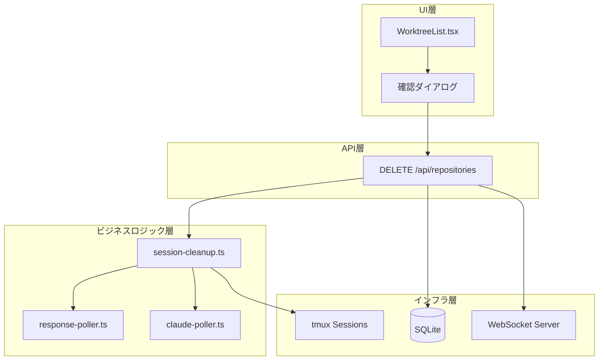
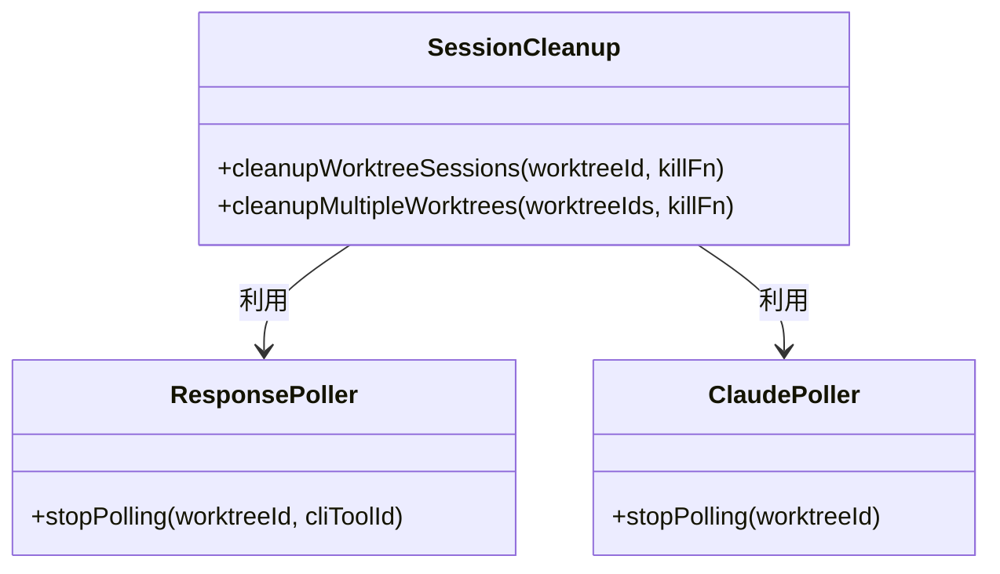
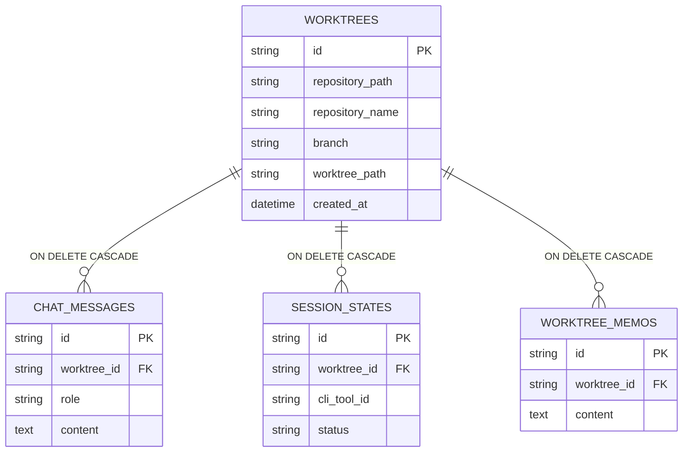
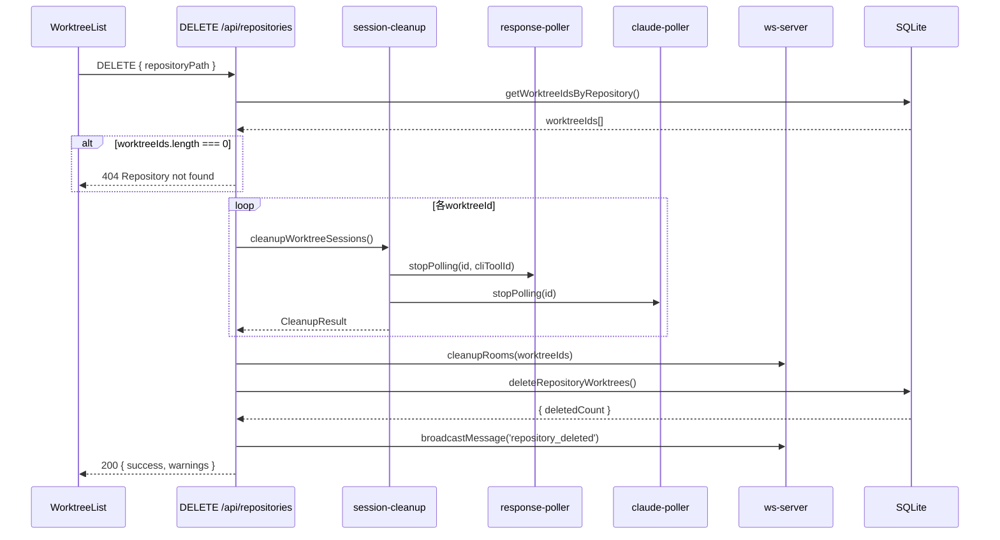

# Issue #69: 登録済みリポジトリの削除機能 - 設計方針書

## 1. 概要

### 対象機能
アプリに登録したリポジトリをUIから削除する機能

### 背景
現在、リポジトリの削除手段がなく、SQLite直接操作か`npm run db:reset`でDB全体をリセットするしかない。

### 設計目標
- 安全で段階的な削除フロー
- 既存実装パターンとの一貫性
- 拡張性を考慮したユーティリティ設計

---

## 2. アーキテクチャ設計

### システム構成図



### レイヤー構成

| レイヤー | 責務 | 対象ファイル |
|---------|------|------------|
| プレゼンテーション | UI表示・ユーザー操作 | `WorktreeList.tsx` |
| APIルート | HTTPリクエスト処理 | `api/repositories/route.ts` |
| ビジネスロジック | クリーンアップ処理 | `session-cleanup.ts` |
| データアクセス | DB操作 | `db.ts` |
| インフラ | 外部リソース管理 | `ws-server.ts`, `tmux.ts` |

---

## 3. 設計パターン

### 3.1 Facade パターン（session-cleanup.ts）

**目的**: 複数ポーラーの停止処理を一元化し、呼び出し側の複雑性を隠蔽

**理由**:
- `response-poller.ts`と`claude-poller.ts`で関数シグネチャが異なる
- 将来のポーラー追加時の変更を局所化



```typescript
// src/lib/session-cleanup.ts
export interface WorktreeCleanupResult {
  worktreeId: string;
  sessionsKilled: string[];
  sessionErrors: string[];
  pollersStopped: string[];
  pollerErrors: string[];
}

export async function cleanupWorktreeSessions(
  worktreeId: string,
  killSessionFn: (worktreeId: string, cliToolId: CLIToolType) => Promise<boolean>
): Promise<WorktreeCleanupResult>
```

### 3.2 Result パターン（エラー収集）

**目的**: 部分的な失敗を許容しつつ、全体の処理を継続

**理由**:
- セッションkill失敗でもDB削除は実行すべき
- 全エラーを収集してwarningsとして返却

```typescript
interface CleanupResult {
  results: WorktreeCleanupResult[];
  warnings: string[];
}
```

### 3.3 既存パターンの踏襲

| パターン | 参照元 | 適用箇所 |
|---------|--------|---------|
| 複数CLIツールループ | `kill-session/route.ts:40-60` | セッション終了処理 |
| WebSocket通知 | `kill-session/route.ts:72-78` | 削除完了通知 |
| DELETE APIレスポンス | `memos/[memoId]/route.ts:87-126` | APIレスポンス形式 |
| 確認ダイアログ | `WorktreeCard.tsx` | 削除確認UI |

---

## 4. データモデル設計

### ER図（削除対象の関連）



### カスケード削除の活用

```sql
-- 既存の外部キー制約を活用
-- worktree削除時に関連データが自動削除される
DELETE FROM worktrees WHERE repository_path = ?;

-- 以下は自動削除（変更不要）
-- chat_messages, session_states, worktree_memos
```

### 新規DB関数

```typescript
// src/lib/db.ts に追加

export function getWorktreeIdsByRepository(
  db: Database.Database,
  repositoryPath: string
): string[] {
  const rows = db.prepare(
    'SELECT id FROM worktrees WHERE repository_path = ?'
  ).all(repositoryPath) as Array<{ id: string }>;
  return rows.map(r => r.id);
}

export function deleteRepositoryWorktrees(
  db: Database.Database,
  repositoryPath: string
): { deletedCount: number } {
  const result = db.prepare(
    'DELETE FROM worktrees WHERE repository_path = ?'
  ).run(repositoryPath);
  return { deletedCount: result.changes };
}
```

---

## 5. API設計

### エンドポイント

```
DELETE /api/repositories
Content-Type: application/json
```

### リクエスト/レスポンス

```typescript
// Request
interface DeleteRepositoryRequest {
  repositoryPath: string;
}

// Response（成功）
interface DeleteRepositoryResponse {
  success: true;
  deletedWorktreeCount: number;
  deletedWorktreeIds: string[];
  warnings?: string[];
}

// Response（エラー）
interface DeleteRepositoryErrorResponse {
  success: false;
  error: string;
}
```

### ステータスコード

| コード | 条件 | レスポンス例 |
|--------|------|------------|
| 200 | 削除成功（部分成功含む） | `{ success: true, ... }` |
| 400 | repositoryPath未指定 | `{ success: false, error: "repositoryPath is required" }` |
| 404 | リポジトリ不在 | `{ success: false, error: "Repository not found" }` |
| 500 | DB操作失敗 | `{ success: false, error: "Database deletion failed" }` |

### Body形式採用の理由

URLパラメータではなくJSON Bodyを採用：
- パスに含まれるスラッシュのエンコード問題を回避
- 日本語パス名のサポート
- 将来的なパラメータ拡張の容易さ

---

## 6. 処理フロー設計

### シーケンス図



### 段階的エラーハンドリング

| 処理段階 | 失敗時の対応 | 理由 |
|----------|-------------|------|
| セッションkill | warningsに追加して続行 | セッションが存在しない場合もある |
| ポーラー停止 | warningsに追加して続行 | ポーラーが動いていない場合もある |
| WebSocket cleanup | warningsに追加して続行 | 接続がない場合もある |
| **DB削除** | **即座にエラー返却** | 本質的な処理のため |

---

## 7. UI設計

### 削除ボタン配置

```
リポジトリフィルター:
[All (10)] [MyProject (5) ×] [OtherRepo (3) ×]
                         ↑
                         ホバー時に表示
```

### 確認ダイアログ仕様

```typescript
// ネイティブconfirm()パターン（既存踏襲）
const confirmMessage = `リポジトリ「${repositoryName}」を削除しますか？

この操作により以下が削除されます:
- ${worktreeCount}件のworktree
- 関連するチャット履歴
- 関連するメモ

※ログファイルは保持されます

削除を確認するには「delete」と入力してください:`;

// 安全のため入力確認を追加
const input = prompt(confirmMessage);
if (input !== 'delete') {
  return; // キャンセル
}
```

### 入力確認方式の理由

- 日本語リポジトリ名のIME入力を回避
- 国際化対応（固定文字列`delete`）
- 誤操作防止の強化

### 環境変数再登録の警告UI

`WORKTREE_REPOS`環境変数に設定されたリポジトリは、削除後も「Sync All」実行時に再登録される。この動作をユーザーに明示するため、該当リポジトリの削除時に警告を表示する。

#### 環境変数チェックの実装

```typescript
// 環境変数からリポジトリパスリストを取得
function getEnvRepositoryPaths(): string[] {
  const envRepos = process.env.WORKTREE_REPOS;
  if (!envRepos) return [];
  return envRepos.split(',').map(p => p.trim());
}

// 環境変数に含まれるか判定
function isInEnvVar(repositoryPath: string): boolean {
  const envPaths = getEnvRepositoryPaths();
  return envPaths.includes(repositoryPath);
}
```

#### 警告付き確認ダイアログ

```typescript
const handleDeleteRepository = async (repositoryPath: string, repositoryName: string) => {
  const worktreeCount = getWorktreeCount(repositoryPath);
  const isEnvConfigured = isInEnvVar(repositoryPath);

  let confirmMessage = `リポジトリ「${repositoryName}」を削除しますか？

この操作により以下が削除されます:
- ${worktreeCount}件のworktree
- 関連するチャット履歴
- 関連するメモ

※ログファイルは保持されます`;

  // 環境変数設定リポジトリの場合、警告を追加
  if (isEnvConfigured) {
    confirmMessage += `

⚠️ 注意: このリポジトリは環境変数(WORKTREE_REPOS)で設定されています。
「Sync All」実行時に再登録されます。
完全に削除するには環境変数の設定も変更してください。`;
  }

  confirmMessage += `

削除を確認するには「delete」と入力してください:`;

  const input = prompt(confirmMessage);
  if (input !== 'delete') {
    return; // キャンセル
  }

  // 削除処理実行
  await repositoryApi.delete(repositoryPath);
};
```

#### UIでの警告アイコン表示

環境変数設定リポジトリには、削除ボタンの横に警告アイコンを表示する。

```
[MyProject (5) ⚠️×]
              ↑
              環境変数設定リポジトリを示す警告アイコン
```

```tsx
// WorktreeList.tsx
{repositories.map((repo) => (
  <div key={repo.path} className="relative group">
    <Button
      variant={selectedRepository === repo.path ? 'primary' : 'ghost'}
      size="sm"
      onClick={() => setSelectedRepository(repo.path)}
    >
      {repo.name} ({repo.worktreeCount})
      {isInEnvVar(repo.path) && (
        <span title="環境変数で設定されています" className="ml-1">⚠️</span>
      )}
    </Button>
    <button
      className="opacity-0 group-hover:opacity-100 ml-1"
      onClick={(e) => {
        e.stopPropagation();
        handleDeleteRepository(repo.path, repo.name);
      }}
    >
      ×
    </button>
  </div>
))}
```

---

## 8. セキュリティ設計

### 入力バリデーション

```typescript
// パスのバリデーション
if (!repositoryPath || typeof repositoryPath !== 'string') {
  return NextResponse.json(
    { success: false, error: 'repositoryPath is required' },
    { status: 400 }
  );
}

// パストラバーサル対策は不要
// → DB内のrepository_pathとの完全一致のみ許可
// → ファイルシステム操作は行わない
```

### 削除の不可逆性対策

1. 確認ダイアログで`delete`入力を要求
2. ログファイルは保持（監査証跡）
3. WebSocket通知で即時フィードバック

---

## 9. ログ設計

### ログ出力方針

運用時のトラブルシューティングのため、各処理段階でログを出力する。

### ログレベルと出力内容

| 処理段階 | レベル | 出力内容 |
|----------|--------|---------|
| 削除開始 | `info` | リポジトリパス、対象worktree数 |
| セッションkill成功 | `info` | worktreeId、CLIツール名 |
| セッションkill失敗 | `warn` | worktreeId、CLIツール名、エラー内容 |
| ポーラー停止失敗 | `warn` | worktreeId、ポーラー名、エラー内容 |
| DB削除成功 | `info` | リポジトリパス、削除件数 |
| DB削除失敗 | `error` | リポジトリパス、エラー内容 |
| 削除完了 | `info` | リポジトリパス、warnings有無 |

### 実装イメージ

```typescript
// src/app/api/repositories/route.ts

export async function DELETE(request: NextRequest) {
  const LOG_PREFIX = '[Repository Delete]';

  // 削除開始ログ
  console.info(`${LOG_PREFIX} Starting deletion: ${repositoryPath}, worktrees: ${worktreeIds.length}`);

  // セッションkill結果のログ
  for (const result of cleanupResult.results) {
    if (result.sessionsKilled.length > 0) {
      console.info(`${LOG_PREFIX} Sessions killed for ${result.worktreeId}: ${result.sessionsKilled.join(', ')}`);
    }
    if (result.sessionErrors.length > 0) {
      console.warn(`${LOG_PREFIX} Session kill errors for ${result.worktreeId}: ${result.sessionErrors.join(', ')}`);
    }
  }

  // DB削除結果のログ
  try {
    const { deletedCount } = deleteRepositoryWorktrees(db, repositoryPath);
    console.info(`${LOG_PREFIX} Successfully deleted ${deletedCount} worktrees from: ${repositoryPath}`);
  } catch (error) {
    console.error(`${LOG_PREFIX} Database deletion failed for ${repositoryPath}:`, error);
    throw error;
  }

  // 完了ログ
  if (warnings.length > 0) {
    console.info(`${LOG_PREFIX} Completed with ${warnings.length} warnings: ${repositoryPath}`);
  } else {
    console.info(`${LOG_PREFIX} Completed successfully: ${repositoryPath}`);
  }
}
```

### session-cleanup.tsでのログ出力

```typescript
// src/lib/session-cleanup.ts

export async function cleanupWorktreeSessions(
  worktreeId: string,
  killSessionFn: (worktreeId: string, cliToolId: CLIToolType) => Promise<boolean>
): Promise<WorktreeCleanupResult> {
  const LOG_PREFIX = '[Session Cleanup]';

  for (const cliToolId of CLI_TOOL_IDS) {
    try {
      const killed = await killSessionFn(worktreeId, cliToolId);
      if (killed) {
        console.info(`${LOG_PREFIX} Killed session: ${worktreeId}/${cliToolId}`);
      }
    } catch (error) {
      console.warn(`${LOG_PREFIX} Failed to kill session ${worktreeId}/${cliToolId}:`, error);
    }

    try {
      stopResponsePolling(worktreeId, cliToolId);
    } catch (error) {
      console.warn(`${LOG_PREFIX} Failed to stop response-poller ${worktreeId}/${cliToolId}:`, error);
    }
  }

  try {
    stopClaudePolling(worktreeId);
  } catch (error) {
    console.warn(`${LOG_PREFIX} Failed to stop claude-poller ${worktreeId}:`, error);
  }
}
```

---

## 10. パフォーマンス設計

### 最適化ポイント

| 処理 | 最適化 |
|------|--------|
| DB削除 | 単一DELETEクエリ + CASCADE |
| ポーラー停止 | Map操作（O(1)） |
| WebSocket通知 | 一括通知（1回） |

### 処理時間の見積もり

| 処理 | 想定時間 |
|------|---------|
| worktreeIds取得 | < 10ms |
| セッションkill（各） | < 100ms |
| ポーラー停止（全） | < 10ms |
| DB削除 | < 50ms |
| 合計（10 worktree） | < 1.5秒 |

---

## 11. 設計判断とトレードオフ

### 採用した設計

| 決定事項 | 理由 | トレードオフ |
|---------|------|-------------|
| session-cleanup.ts新規作成 | ポーラー統一管理 | ファイル追加 |
| 段階的エラーハンドリング | 部分成功を許容 | 複雑性増加 |
| Body形式のDELETE | パスエンコード問題回避 | REST純粋主義から逸脱 |
| ネイティブconfirm() | 既存パターン踏襲 | カスタマイズ制限 |

### 代替案との比較

#### 代替案1: 各ポーラーを直接呼び出し

```typescript
// 代替案（不採用）
stopResponsePolling(worktreeId, 'claude');
stopResponsePolling(worktreeId, 'codex');
stopResponsePolling(worktreeId, 'gemini');
stopClaudePolling(worktreeId);
```

- **不採用理由**: 呼び出し箇所が複雑化、将来のポーラー追加時に複数箇所の修正が必要

#### 代替案2: トランザクションで全削除を囲む

```typescript
// 代替案（不採用）
db.transaction(() => {
  killSessions();
  stopPollers();
  deleteFromDB();
})();
```

- **不採用理由**: セッションkillやポーラー停止は非同期・外部リソースのため、DBトランザクションでロールバックできない

#### 代替案3: カスタム確認モーダル

- **不採用理由**: 既存の`confirm()`パターンを踏襲、シンプルさ優先

---

## 12. 制約条件

### CLAUDE.md準拠

| 原則 | 適用 |
|------|------|
| SOLID - 単一責任 | session-cleanup.tsはクリーンアップのみ担当 |
| KISS | ネイティブconfirm()使用、シンプルなAPI設計 |
| YAGNI | 必要最小限の機能のみ実装 |
| DRY | 既存パターンの再利用 |

### 既存実装との整合性

- `response-poller.ts`、`claude-poller.ts`は変更しない
- 既存のWebSocket通知パターンを踏襲
- 既存のエラーハンドリングパターンを踏襲

---

## 13. 実装優先順序

```mermaid
gantt
    title 実装順序
    dateFormat  X
    axisFormat %s

    section Phase 1: インフラ
    db.ts関数追加           :a1, 0, 1
    session-cleanup.ts新規  :a2, 1, 2
    ws-server.ts関数追加    :a3, 2, 3

    section Phase 2: API
    repositories/route.ts   :b1, 3, 5
    api-client.ts追加       :b2, 5, 6

    section Phase 3: UI
    WorktreeList.tsx変更    :c1, 6, 8
```



| Phase | ファイル | 作業内容 |
|-------|---------|---------|
| 1-1 | `src/lib/db.ts` | 2関数追加 |
| 1-2 | `src/lib/session-cleanup.ts` | 新規作成 |
| 1-3 | `src/lib/ws-server.ts` | cleanupRooms()追加 |
| 2-1 | `src/app/api/repositories/route.ts` | DELETEハンドラ追加 |
| 2-2 | `src/lib/api-client.ts` | delete()メソッド追加 |
| 3-1 | `src/components/worktree/WorktreeList.tsx` | 削除ボタン・ダイアログ追加 |

---

## 14. テスト方針

### ユニットテスト

| 対象 | テスト内容 |
|------|-----------|
| `session-cleanup.ts` | 各ポーラー停止の呼び出し確認 |
| `db.ts` | 削除件数の正確性 |

### 統合テスト

| シナリオ | 検証内容 |
|---------|---------|
| 正常削除 | 200レスポンス、DB削除確認 |
| 部分成功 | warningsの内容確認 |
| 404エラー | 存在しないリポジトリ |
| 400エラー | 不正なリクエスト |

### E2Eテスト

| シナリオ | 検証内容 |
|---------|---------|
| UI削除フロー | ボタンクリック→確認→削除→一覧更新 |
| キャンセルフロー | 確認でキャンセル→削除されない |

---

## 15. 関連ドキュメント

- [Issue #69](https://github.com/Kewton/MyCodeBranchDesk/issues/69)
- [CLAUDE.md](../../CLAUDE.md)
- [アーキテクチャ](../../docs/architecture.md)

---

## 変更履歴

| 日付 | 変更内容 |
|------|---------|
| 2026-01-28 | 初版作成 |
| 2026-01-28 | アーキテクチャレビュー反映: ログ設計追加、環境変数警告UI追加 |
