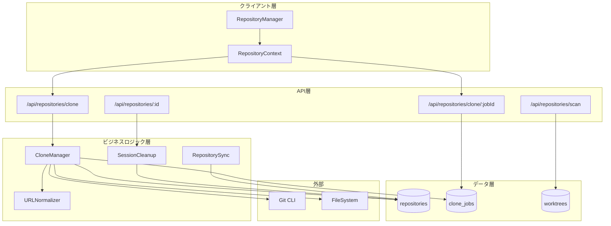
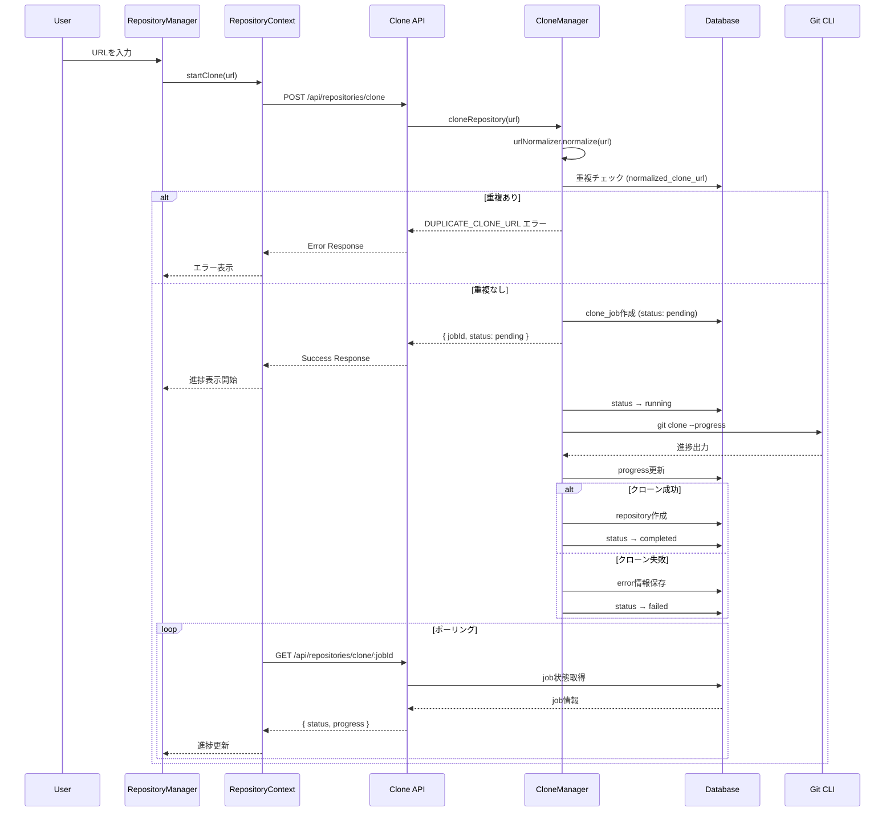
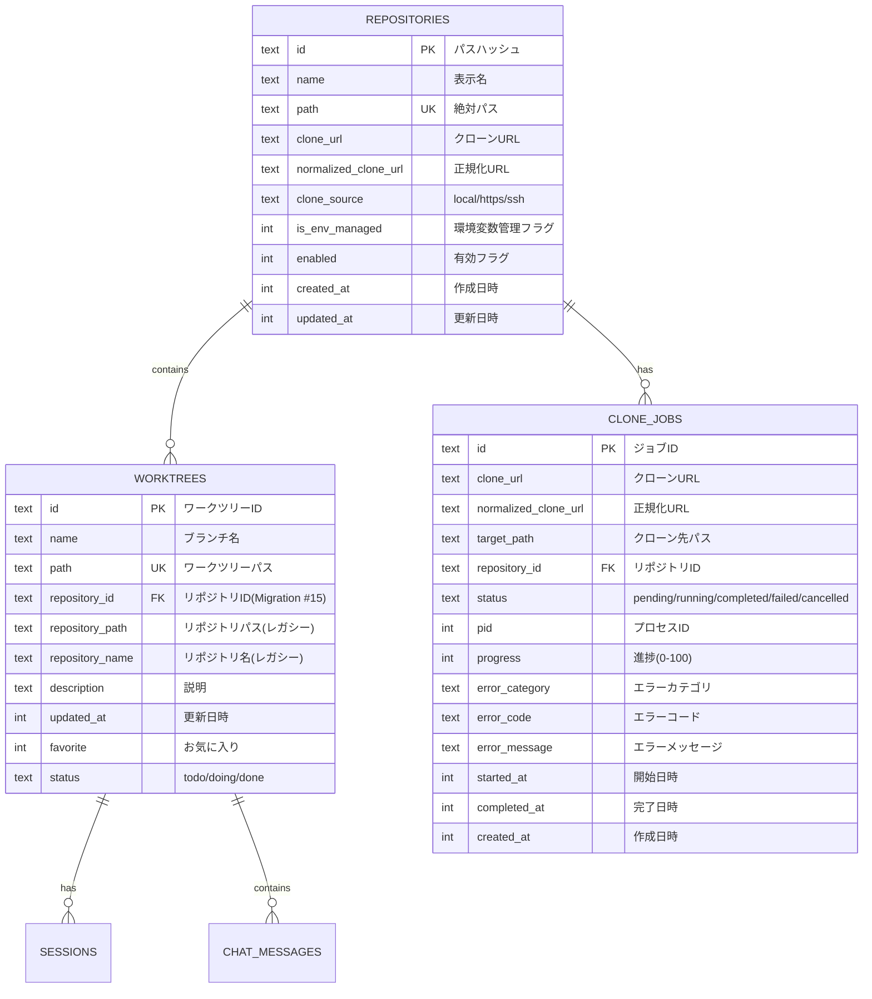
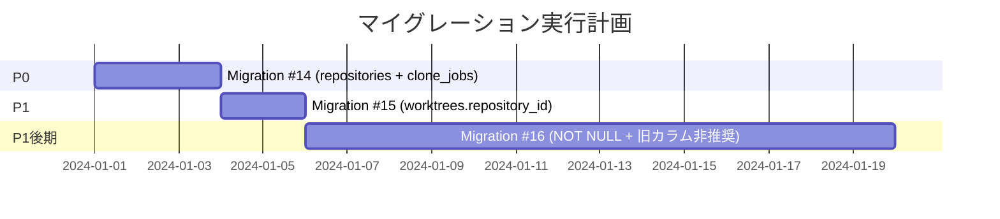
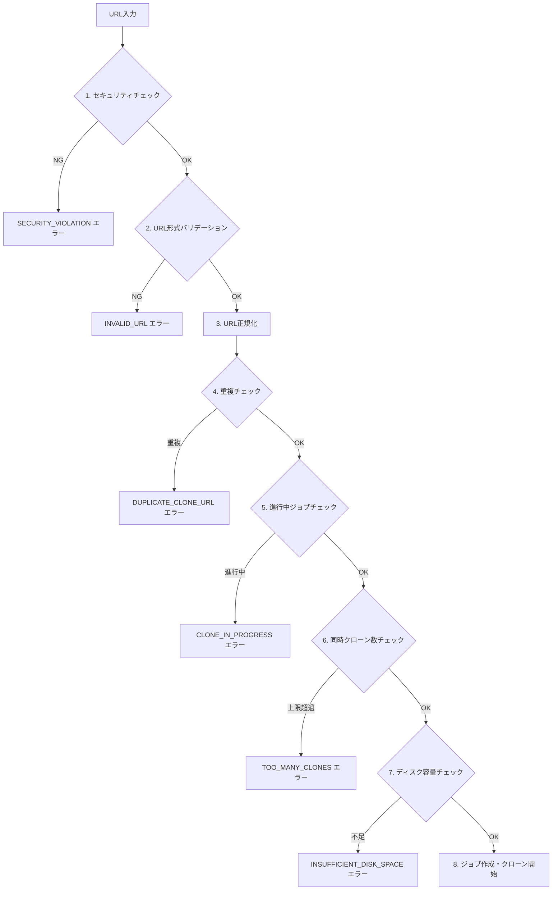
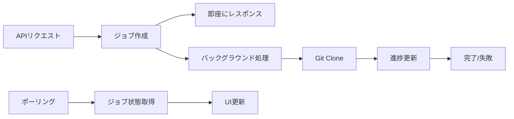

# Issue #71: クローンURL登録機能 設計方針書

## 1. 概要

### 1.1 目的
リポジトリ登録時にクローンURL（HTTPS/SSH）を指定して、クローンとリポジトリ登録を一括で行える機能を実装する。

### 1.2 スコープ
- P0: HTTPS URLでのクローン・登録、repositoriesテーブル新設、重複防止、URL正規化
- P1: SSH URL対応、環境変数管理リポジトリ同期、外部キー移行
- P2: 進捗表示、ディスク容量チェック、物理削除オプション
- P3: カスタムディレクトリ指定、キャンセル機能、ホストホワイトリスト

**注記**: SSH URL対応（P1）は、P0のHTTPS実装完了後にSprint 4で実装する。

### 1.3 関連Issue
- Issue #69: リポジトリ削除機能（削除パラメータ統一）

---

## 2. アーキテクチャ設計

### 2.1 システム構成図



### 2.2 レイヤー構成

| レイヤー | 責務 | 主要ファイル |
|---------|------|-------------|
| プレゼンテーション層 | UI表示、ユーザー入力 | `src/components/repository/` |
| 状態管理層 | クローンジョブ状態管理 | `src/contexts/RepositoryContext.tsx` |
| API層 | HTTPエンドポイント | `src/app/api/repositories/` |
| ビジネスロジック層 | クローン処理、URL正規化 | `src/lib/clone-manager.ts`, `src/lib/url-normalizer.ts` |
| データアクセス層 | DB操作 | `src/lib/db.ts`, `src/lib/db-migrations.ts` |
| 型定義層 | 型・インターフェース定義 | `src/types/clone.ts`, `src/types/repository.ts` |

### 2.3 型定義ファイル構成

**方針**: 既存の`types/models.ts`にあるRepository型を直接拡張する。新規フィールドはオプショナルにして後方互換性を維持。クローン固有の型は専用ファイルに分離する。

**配置ルール**:
| 型の種類 | 配置先 | 理由 |
|---------|--------|------|
| Repository | `types/models.ts` | 既存型の拡張（後方互換性維持） |
| CloneJob, CloneError等 | `types/clone.ts` | クローン機能専用（責務分離） |
| ErrorCodes | `types/errors.ts` | 共通エラーコード（再利用性） |

```
src/types/
├── models.ts          # 既存ファイルを編集（Repository型に4フィールド追加）
│   ├── Repository     # 拡張: cloneUrl等をオプショナル追加
│   ├── Worktree       # 既存（変更なし）
│   ├── ChatMessage    # 既存（変更なし）
│   └── ...            # 既存型
├── clone.ts           # クローン機能専用型（新規作成）
│   ├── CloneJob
│   ├── CloneJobStatus
│   ├── CloneError
│   ├── CloneRequest
│   ├── CloneResponse
│   └── ValidationResult
└── errors.ts          # 共通エラー型（新規作成）
    └── ErrorCodes
```

**Repository型拡張（types/models.ts）**:

既存の`types/models.ts`にあるRepository型（66-79行目）を以下のように拡張する。
**重要**: 新規フィールドは全てオプショナル（`?`付き）にすることで、既存コードへの影響を最小化する。

```typescript
// src/types/models.ts - 既存のRepository型を拡張
// 既存フィールド（66-79行目）はそのまま維持

/**
 * Repository representation (for Phase 2 multi-repo management)
 *
 * 既存フィールドはPhase 2用として定義済み。
 * Issue #71で追加するフィールドは全てオプショナルにして後方互換性を維持。
 */
export interface Repository {
  // === 既存フィールド（変更なし） ===
  /** Repository ID (hash of path) */
  id: string;
  /** Repository display name */
  name: string;
  /** Absolute path to repository root */
  path: string;
  /** Whether this repository is enabled for scanning */
  enabled: boolean;
  /** Creation timestamp */
  createdAt: Date;
  /** Last updated timestamp */
  updatedAt: Date;

  // === 新規フィールド（Issue #71） - 全てオプショナル ===
  /** Clone URL (HTTPS or SSH) - クローン元URL */
  cloneUrl?: string;
  /** Normalized clone URL for duplicate detection - 重複検出用正規化URL */
  normalizedCloneUrl?: string;
  /** Clone source: 'local' (scanned), 'https', 'ssh' - 登録方法 */
  cloneSource?: 'local' | 'https' | 'ssh';
  /** Whether this repository is managed by WORKTREE_REPOS env var - 環境変数管理フラグ */
  isEnvManaged?: boolean;
}
```

**後方互換性の考慮事項**:
- 既存の`getRepositories()`関数（`db.ts:255-282`）はworktreesテーブルからリポジトリ情報を集約している
- 新規の`getAllRepositories()`関数（セクション4.5）はrepositoriesテーブルから直接取得
- 両関数の戻り値は同じRepository型を使用するが、新規フィールドの有無で区別可能

**CloneJob型（types/clone.ts）**:

```typescript
// src/types/clone.ts
export type CloneJobStatus = 'pending' | 'running' | 'completed' | 'failed' | 'cancelled';

export interface CloneJob {
  id: string;
  cloneUrl: string;
  normalizedCloneUrl: string;
  targetPath: string;
  repositoryId?: string;
  status: CloneJobStatus;
  pid?: number;
  progress: number;
  errorCategory?: string;
  errorCode?: string;
  errorMessage?: string;
  startedAt?: number;
  completedAt?: number;
  createdAt: number;
}

export interface CloneError {
  category: 'validation' | 'network' | 'auth' | 'filesystem' | 'git' | 'system';
  code: string;
  message: string;
  recoverable: boolean;
  suggestedAction: string;
}

export interface ValidationResult {
  valid: boolean;
  error?: string;
}

export interface CloneRequest {
  cloneUrl: string;
  targetDir?: string;  // P3
}

export interface CloneResponse {
  success: true;
  jobId: string;
  status: 'pending';
  message: string;
}

export interface CloneErrorResponse {
  success: false;
  error: CloneError;
}
```

### 2.4 データフロー



---

## 3. 技術選定

### 3.1 技術スタック

| カテゴリ | 選定技術 | 選定理由 |
|---------|---------|---------|
| フレームワーク | Next.js 14 (App Router) | 既存技術スタック |
| 言語 | TypeScript (strict mode) | 型安全性、既存スタック |
| データベース | SQLite (better-sqlite3) | 軽量、既存スタック |
| スタイル | Tailwind CSS | 既存スタック |
| 状態管理 | React Context + useReducer | 中規模状態管理に適切 |
| プロセス実行 | Node.js child_process | Git CLIとの連携 |
| テスト | Vitest (unit), Playwright (e2e) | 既存スタック |

### 3.2 代替案との比較

#### 状態管理

| 選択肢 | メリット | デメリット | 採用 |
|--------|---------|----------|------|
| Context + useReducer | シンプル、追加依存なし | 大規模には不向き | **採用** |
| Zustand | 軽量、DevTools対応 | 新規依存追加 | 不採用 |
| Redux Toolkit | 堅牢、大規模向け | オーバーヘッド大 | 不採用 |

**理由**: クローンジョブ管理は中規模の状態管理であり、新規依存なしで実現可能。

#### ジョブ管理

| 選択肢 | メリット | デメリット | 採用 |
|--------|---------|----------|------|
| DBベース (clone_jobs) | 永続化、再起動耐性 | 実装コスト | **採用** |
| インメモリMap | シンプル | 再起動で消失 | 不採用 |
| Redis/外部キュー | スケーラブル | インフラ複雑化 | 不採用 |

**理由**: サーバー再起動時のリカバリが必要。SQLiteで十分対応可能。

---

## 4. 設計パターン

### 4.1 適用パターン一覧

| パターン | 適用箇所 | 目的 |
|---------|---------|------|
| Strategy | URL検証 | HTTPS/SSH形式の差異吸収 |
| Factory | エラー生成 | 階層化エラーの統一生成 |
| Facade | CloneManager | クローン処理の複雑性隠蔽 |
| Singleton | URLNormalizer | 正規化ルールの一元管理 |
| 関数ベース | DB操作 | 既存パターン踏襲、シンプルなデータアクセス |

### 4.2 Strategy パターン: URL検証

**責務分離**:
- `IUrlValidator`: URL形式の検証とリポジトリ名抽出のみ（**正規化は含まない**）
- `UrlNormalizer`: URL正規化の一元管理（Singletonパターン、後述）

```typescript
// src/lib/url-validators/index.ts
export interface IUrlValidator {
  readonly type: 'https' | 'ssh';
  validate(url: string): ValidationResult;
  extractRepoName(url: string): string;
  // NOTE: normalize()はUrlNormalizerに委譲するため、ここには含めない
}

// src/lib/url-validators/https-validator.ts
export class HttpsUrlValidator implements IUrlValidator {
  readonly type = 'https';

  validate(url: string): ValidationResult {
    const pattern = /^https:\/\/([^\/]+)\/([^\/]+)\/([^\/]+?)(\.git)?$/;
    if (!pattern.test(url)) {
      return { valid: false, error: 'INVALID_URL' };
    }
    return { valid: true };
  }

  extractRepoName(url: string): string {
    const match = url.match(/\/([^\/]+?)(\.git)?$/);
    return match ? match[1] : '';
  }
}

// src/lib/url-validators/ssh-validator.ts (P1: Sprint 4で実装)
export class SshUrlValidator implements IUrlValidator {
  readonly type = 'ssh';

  validate(url: string): ValidationResult {
    // 標準SSH形式: git@host:path/repo.git
    const standardPattern = /^git@([^:]+):(.+?)(\.git)?$/;
    // SSH URL形式: ssh://git@host[:port]/path/repo.git
    const sshUrlPattern = /^ssh:\/\/git@([^:\/]+)(:\d+)?\/(.+?)(\.git)?$/;

    if (!standardPattern.test(url) && !sshUrlPattern.test(url)) {
      return { valid: false, error: 'INVALID_URL' };
    }
    return { valid: true };
  }

  extractRepoName(url: string): string {
    // SSH URL形式: ssh://git@host[:port]/path/repo.git
    const sshUrlMatch = url.match(/^ssh:\/\/git@[^\/]+\/(.+?)(\.git)?$/);
    if (sshUrlMatch) {
      const pathParts = sshUrlMatch[1].split('/');
      return pathParts[pathParts.length - 1];
    }

    // 標準SSH形式: git@host:path/repo.git（サブグループ対応）
    const match = url.match(/:(.+?)(\.git)?$/);
    if (match) {
      const pathParts = match[1].split('/');
      return pathParts[pathParts.length - 1];
    }
    return '';
  }
}

// src/lib/url-validators/validator-factory.ts
export class UrlValidatorFactory {
  private static readonly httpsValidator = new HttpsUrlValidator();
  private static readonly sshValidator = new SshUrlValidator();

  static getValidator(url: string): IUrlValidator | null {
    if (url.startsWith('https://')) return this.httpsValidator;
    if (url.startsWith('git@') || url.startsWith('ssh://')) return this.sshValidator;
    return null;
  }

  static validate(url: string): ValidationResult {
    const validator = this.getValidator(url);
    if (!validator) {
      return { valid: false, error: 'INVALID_URL' };
    }
    return validator.validate(url);
  }
}
```

### 4.2.1 Singleton パターン: URLNormalizer

**責務**: 全てのURL正規化ロジックを一元管理し、重複検出のための標準化形式を提供する。

```typescript
// src/lib/url-normalizer.ts
export class UrlNormalizer {
  private static instance: UrlNormalizer;

  private constructor() {}

  static getInstance(): UrlNormalizer {
    if (!UrlNormalizer.instance) {
      UrlNormalizer.instance = new UrlNormalizer();
    }
    return UrlNormalizer.instance;
  }

  /**
   * URLを正規化形式に変換
   * - HTTPS/SSH両形式を同一の正規化形式に統一
   * - 大文字小文字を統一
   * - .git接尾辞を除去
   * - 末尾スラッシュを除去
   *
   * @example
   * normalize('https://github.com/user/repo.git') -> 'https://github.com/user/repo'
   * normalize('git@github.com:user/repo.git') -> 'https://github.com/user/repo'
   * normalize('ssh://git@github.com:22/user/repo.git') -> 'https://github.com/user/repo'
   */
  normalize(url: string): string {
    // 1. SSH URL形式: ssh://git@host[:port]/path/repo.git
    const sshUrlMatch = url.match(/^ssh:\/\/git@([^:\/]+)(:\d+)?\/(.+?)(\.git)?$/);
    if (sshUrlMatch) {
      return `https://${sshUrlMatch[1]}/${sshUrlMatch[3]}`
        .toLowerCase()
        .replace(/\/$/, '');
    }

    // 2. 標準SSH形式: git@host:path/repo.git
    const standardSshMatch = url.match(/^git@([^:]+):(.+?)(\.git)?$/);
    if (standardSshMatch) {
      return `https://${standardSshMatch[1]}/${standardSshMatch[2]}`
        .toLowerCase()
        .replace(/\/$/, '');
    }

    // 3. HTTPS形式: https://host/path/repo.git
    return url
      .replace(/\.git$/, '')
      .replace(/\/$/, '')
      .toLowerCase();
  }

  /**
   * 2つのURLが同一リポジトリを指すか判定
   */
  isSameRepository(url1: string, url2: string): boolean {
    return this.normalize(url1) === this.normalize(url2);
  }
}
```

### 4.3 Factory パターン: エラー生成

```typescript
// src/lib/errors/clone-error-factory.ts
export class CloneErrorFactory {
  static validation(code: string, message: string): CloneError {
    return {
      category: 'validation',
      code,
      message,
      recoverable: true,
      suggestedAction: this.getSuggestedAction('validation', code),
    };
  }

  static network(code: string, message: string): CloneError {
    return {
      category: 'network',
      code,
      message,
      recoverable: true,
      suggestedAction: this.getSuggestedAction('network', code),
    };
  }

  static auth(code: string, message: string): CloneError {
    return {
      category: 'auth',
      code,
      message,
      recoverable: true,
      suggestedAction: this.getSuggestedAction('auth', code),
    };
  }

  static filesystem(code: string, message: string, recoverable = true): CloneError {
    return {
      category: 'filesystem',
      code,
      message,
      recoverable,
      suggestedAction: this.getSuggestedAction('filesystem', code),
    };
  }

  static git(code: string, message: string): CloneError {
    return {
      category: 'git',
      code,
      message,
      recoverable: true,
      suggestedAction: this.getSuggestedAction('git', code),
    };
  }

  static system(code: string, message: string, recoverable = false): CloneError {
    return {
      category: 'system',
      code,
      message,
      recoverable,
      suggestedAction: this.getSuggestedAction('system', code),
    };
  }

  private static getSuggestedAction(category: string, code: string): string {
    const actions: Record<string, string> = {
      'validation:INVALID_URL': 'https://またはgit@で始まるURLを入力してください',
      'validation:DUPLICATE_CLONE_URL': '既存のリポジトリを使用するか、先に削除してください',
      'validation:SECURITY_VIOLATION': 'URLを確認して、安全な形式で入力してください',
      'network:TIMEOUT': 'ネットワーク状況を確認するか、後で再試行してください',
      'network:NETWORK_ERROR': 'ネットワーク接続を確認してください',
      'auth:AUTH_FAILED': '認証情報を確認してください',
      'auth:SSH_KEY_NOT_FOUND': '~/.ssh/に秘密鍵を配置してください',
      'filesystem:DIRECTORY_EXISTS': '既存ディレクトリを削除するか、別のリポジトリ名を使用してください',
      'filesystem:INSUFFICIENT_DISK_SPACE': '不要なファイルを削除してディスク容量を確保してください',
      'git:REPO_NOT_FOUND': 'URLを確認してください',
      'git:CLONE_IN_PROGRESS': '既存の処理が完了するまでお待ちください',
      'system:TOO_MANY_CLONES': 'しばらく待ってから再試行してください',
      'system:INTERNAL_ERROR': 'しばらく待ってから再試行してください',
    };
    return actions[`${category}:${code}`] || 'しばらく待ってから再試行してください';
  }
}
```

### 4.4 Facade パターン: CloneManager

**方針**: 既存の`db.ts`の関数ベースパターンを踏襲し、DB操作は直接関数を呼び出す。

```typescript
// src/lib/clone-manager.ts
import * as db from './db';
import { UrlNormalizer } from './url-normalizer';
import { UrlValidatorFactory } from './url-validators/validator-factory';
import { UrlSecurityValidator } from './validators/url-security';
import { CloneErrorFactory } from './errors/clone-error-factory';
import { GitExecutor } from './git-executor';
import { getCloneConfig } from './env';
import type { CloneJob, CloneError, CloneJobResult } from '@/types/clone';
import type Database from 'better-sqlite3';

export class CloneManager {
  private config = getCloneConfig();

  constructor(
    private database: Database.Database,
    private urlNormalizer: UrlNormalizer,
    private gitExecutor: GitExecutor,
  ) {}

  /**
   * クローン処理のメインエントリポイント
   * セキュリティチェック → バリデーション → 排他制御 → Git実行
   */
  async cloneRepository(url: string): Promise<CloneJobResult> {
    // 1. セキュリティチェック（最初に実行）
    const securityResult = UrlSecurityValidator.validate(url);
    if (!securityResult.safe) {
      throw CloneErrorFactory.validation(
        'SECURITY_VIOLATION',
        `セキュリティチェックに失敗しました: ${securityResult.reason}`
      );
    }

    // 2. URL形式バリデーション
    const validation = UrlValidatorFactory.validate(url);
    if (!validation.valid) {
      throw CloneErrorFactory.validation('INVALID_URL', validation.error);
    }

    // 3. URL正規化
    const normalizedUrl = this.urlNormalizer.normalize(url);

    // 4. 重複チェック（関数ベースDB操作）
    const existing = db.getRepositoryByNormalizedCloneUrl(this.database, normalizedUrl);
    if (existing) {
      throw CloneErrorFactory.validation(
        'DUPLICATE_CLONE_URL',
        'このURLからクローンされたリポジトリは既に登録されています'
      );
    }

    // 5. 進行中ジョブチェック（関数ベースDB操作）
    const runningJob = db.getCloneJobByNormalizedUrl(this.database, normalizedUrl, 'running');
    if (runningJob) {
      throw CloneErrorFactory.git(
        'CLONE_IN_PROGRESS',
        'このURLのクローン処理が既に実行中です'
      );
    }

    // 6. 同時クローン数チェック（関数ベースDB操作）
    const runningJobs = db.getCloneJobsByStatus(this.database, 'running');
    if (runningJobs.length >= this.config.maxConcurrent) {
      throw CloneErrorFactory.system(
        'TOO_MANY_CLONES',
        `同時クローン数の上限（${this.config.maxConcurrent}）に達しています。しばらく待ってから再試行してください。`
      );
    }

    // 7. ディスク容量チェック（簡易版）
    const targetPath = this.determineTargetPath(url);
    const hasSpace = await this.checkDiskSpace(targetPath);
    if (!hasSpace) {
      throw CloneErrorFactory.filesystem(
        'INSUFFICIENT_DISK_SPACE',
        `ディスクの空き容量が不足しています（最低${this.config.minFreeSpaceMB}MB必要）`
      );
    }

    // 8. ジョブ作成（関数ベースDB操作）
    const job = db.createCloneJob(this.database, {
      cloneUrl: url,
      normalizedCloneUrl: normalizedUrl,
      targetPath,
    });

    // 9. 非同期でクローン実行（エラーハンドリング付き）
    this.executeCloneAsync(job).catch((error) => {
      // 予期せぬエラーのログ出力（ジョブ内エラーは既にupdateJobErrorで処理済み）
      console.error(`[CloneManager] Unexpected error for job ${job.id}:`, error);
    });

    return {
      jobId: job.id,
      status: 'pending',
      message: 'クローンジョブを開始しました',
    };
  }

  /**
   * 非同期クローン処理
   * エラーは全てジョブ状態として記録される
   */
  private async executeCloneAsync(job: CloneJob): Promise<void> {
    try {
      // ステータス更新（関数ベースDB操作）
      db.updateCloneJobStatus(this.database, job.id, 'running', {
        startedAt: Date.now(),
      });

      await this.gitExecutor.clone(job.cloneUrl, job.targetPath, (progress) => {
        // 進捗更新（関数ベースDB操作）
        db.updateCloneJobProgress(this.database, job.id, progress);
      });

      // リポジトリ登録（関数ベースDB操作）
      const repository = db.createRepository(this.database, {
        name: this.extractRepoName(job.cloneUrl),
        path: job.targetPath,
        cloneUrl: job.cloneUrl,
        normalizedCloneUrl: job.normalizedCloneUrl,
        cloneSource: this.determineCloneSource(job.cloneUrl),
        isEnvManaged: false,
      });

      // 完了ステータス更新（関数ベースDB操作）
      db.updateCloneJobStatus(this.database, job.id, 'completed', {
        repositoryId: repository.id,
        completedAt: Date.now(),
      });
    } catch (error) {
      const cloneError = this.parseGitError(error);
      // エラー記録（関数ベースDB操作）
      db.updateCloneJobError(this.database, job.id, cloneError);
    }
  }

  /**
   * ディスク容量の簡易チェック
   */
  private async checkDiskSpace(targetPath: string): Promise<boolean> {
    try {
      const fs = await import('fs');
      const path = await import('path');
      const targetDir = path.dirname(targetPath);
      // ディレクトリが存在しない場合は親ディレクトリをチェック
      const checkDir = fs.existsSync(targetDir) ? targetDir : path.dirname(targetDir);
      const stats = await fs.promises.statfs(checkDir);
      const freeSpaceMB = (stats.bfree * stats.bsize) / (1024 * 1024);
      return freeSpaceMB >= this.config.minFreeSpaceMB;
    } catch {
      // statfsが使えない環境ではチェックをスキップ
      console.warn('[CloneManager] Disk space check skipped: statfs not available');
      return true;
    }
  }

  private determineCloneSource(url: string): 'local' | 'https' | 'ssh' {
    if (url.startsWith('https://')) return 'https';
    if (url.startsWith('git@') || url.startsWith('ssh://')) return 'ssh';
    return 'local';
  }

  private extractRepoName(url: string): string {
    const validator = UrlValidatorFactory.getValidator(url);
    return validator?.extractRepoName(url) || 'unknown';
  }

  private determineTargetPath(url: string): string {
    const path = require('path');
    const os = require('os');
    const repoName = this.extractRepoName(url);
    const baseDir = process.env.MCBD_ROOT_DIR || path.join(os.homedir(), 'mcbd-repos');
    return path.join(baseDir, 'cloned', repoName);
  }

  private parseGitError(error: unknown): CloneError {
    const message = error instanceof Error ? error.message : String(error);

    // Git エラーメッセージのパターンマッチング
    if (message.includes('Authentication failed') || message.includes('Permission denied')) {
      return CloneErrorFactory.auth('AUTH_FAILED', '認証に失敗しました');
    }
    if (message.includes('Repository not found') || message.includes('not found')) {
      return CloneErrorFactory.git('REPO_NOT_FOUND', 'リポジトリが見つかりません');
    }
    if (message.includes('Connection refused') || message.includes('Could not resolve')) {
      return CloneErrorFactory.network('NETWORK_ERROR', 'リポジトリに接続できません');
    }
    if (message.includes('already exists')) {
      return CloneErrorFactory.filesystem('DIRECTORY_EXISTS', '同名のディレクトリが既に存在します');
    }
    if (message.includes('timeout') || message.includes('timed out')) {
      return CloneErrorFactory.network('TIMEOUT', 'クローン処理がタイムアウトしました');
    }

    // 不明なエラー
    return CloneErrorFactory.system('INTERNAL_ERROR', `クローン処理中にエラーが発生しました: ${message}`);
  }
}
```

### 4.4.1 GitExecutor インターフェース設計

**目的**: Git CLI操作を抽象化し、テスト時のモック化を容易にする。

```typescript
// src/lib/git/types.ts

/**
 * 進捗コールバック関数の型
 * @param progress 0-100の進捗値
 */
export type ProgressCallback = (progress: number) => void;

/**
 * Git操作の結果
 */
export interface GitResult {
  success: boolean;
  exitCode: number;
  stdout: string;
  stderr: string;
}

/**
 * Git Executor インターフェース
 *
 * テスト時はモック実装に差し替え可能。
 * 本番時はNodeGitExecutorを使用。
 */
export interface IGitExecutor {
  /**
   * リポジトリをクローン
   * @param url クローン元URL
   * @param targetPath クローン先パス
   * @param onProgress 進捗コールバック（オプション）
   * @throws CloneError クローン失敗時
   */
  clone(url: string, targetPath: string, onProgress?: ProgressCallback): Promise<void>;

  /**
   * Git操作が利用可能か確認
   * @returns true if git is available
   */
  isAvailable(): Promise<boolean>;
}
```

```typescript
// src/lib/git/node-git-executor.ts

import { spawn } from 'child_process';
import type { IGitExecutor, ProgressCallback, GitResult } from './types';

/**
 * Node.js child_process を使用した Git Executor 実装
 *
 * 本番環境で使用する実装。git CLI を直接呼び出す。
 */
export class NodeGitExecutor implements IGitExecutor {
  private readonly timeout: number;

  constructor(options?: { timeout?: number }) {
    this.timeout = options?.timeout ?? 15 * 60 * 1000;  // デフォルト15分
  }

  async clone(
    url: string,
    targetPath: string,
    onProgress?: ProgressCallback
  ): Promise<void> {
    return new Promise((resolve, reject) => {
      const args = ['clone', '--progress', url, targetPath];
      const proc = spawn('git', args, {
        stdio: ['ignore', 'pipe', 'pipe'],
      });

      let stderr = '';

      // git clone は進捗を stderr に出力
      proc.stderr?.on('data', (data: Buffer) => {
        const output = data.toString();
        stderr += output;

        if (onProgress) {
          const progress = this.parseProgress(output);
          if (progress !== null) {
            onProgress(progress);
          }
        }
      });

      const timeoutId = setTimeout(() => {
        proc.kill('SIGTERM');
        reject(new Error('Clone operation timed out'));
      }, this.timeout);

      proc.on('close', (code) => {
        clearTimeout(timeoutId);
        if (code === 0) {
          resolve();
        } else {
          reject(new Error(stderr || `git clone failed with code ${code}`));
        }
      });

      proc.on('error', (error) => {
        clearTimeout(timeoutId);
        reject(error);
      });
    });
  }

  async isAvailable(): Promise<boolean> {
    return new Promise((resolve) => {
      const proc = spawn('git', ['--version'], { stdio: 'ignore' });
      proc.on('close', (code) => resolve(code === 0));
      proc.on('error', () => resolve(false));
    });
  }

  /**
   * git clone --progress の出力から進捗を解析
   *
   * 出力例:
   * - "Receiving objects:  42% (100/238)"
   * - "Resolving deltas: 100% (50/50), done."
   */
  private parseProgress(output: string): number | null {
    // Receiving objects: XX%
    const receivingMatch = output.match(/Receiving objects:\s+(\d+)%/);
    if (receivingMatch) {
      // Receiving は全体の 0-80% とする
      return Math.floor(parseInt(receivingMatch[1], 10) * 0.8);
    }

    // Resolving deltas: XX%
    const resolvingMatch = output.match(/Resolving deltas:\s+(\d+)%/);
    if (resolvingMatch) {
      // Resolving は全体の 80-100% とする
      return 80 + Math.floor(parseInt(resolvingMatch[1], 10) * 0.2);
    }

    return null;
  }
}
```

```typescript
// src/lib/git/mock-git-executor.ts

import type { IGitExecutor, ProgressCallback } from './types';

/**
 * テスト用 Mock Git Executor
 *
 * 単体テスト・統合テストで使用。実際のgit操作は行わない。
 */
export class MockGitExecutor implements IGitExecutor {
  private shouldSucceed = true;
  private simulatedProgress: number[] = [10, 30, 50, 70, 90, 100];
  private simulatedDelay = 100;  // ms
  private errorMessage = 'Mock clone error';

  /**
   * 成功/失敗をシミュレート
   */
  setSucceed(succeed: boolean, errorMessage?: string): void {
    this.shouldSucceed = succeed;
    if (errorMessage) this.errorMessage = errorMessage;
  }

  /**
   * 進捗パターンを設定
   */
  setProgressPattern(progress: number[]): void {
    this.simulatedProgress = progress;
  }

  async clone(
    _url: string,
    _targetPath: string,
    onProgress?: ProgressCallback
  ): Promise<void> {
    // 進捗をシミュレート
    for (const progress of this.simulatedProgress) {
      await this.delay(this.simulatedDelay);
      onProgress?.(progress);
    }

    if (!this.shouldSucceed) {
      throw new Error(this.errorMessage);
    }
  }

  async isAvailable(): Promise<boolean> {
    return true;
  }

  private delay(ms: number): Promise<void> {
    return new Promise((resolve) => setTimeout(resolve, ms));
  }
}
```

**テストでの使用例**:

```typescript
// __tests__/lib/clone-manager.test.ts
import { MockGitExecutor } from '@/lib/git/mock-git-executor';
import { CloneManager } from '@/lib/clone-manager';

describe('CloneManager', () => {
  let mockGitExecutor: MockGitExecutor;
  let manager: CloneManager;

  beforeEach(() => {
    mockGitExecutor = new MockGitExecutor();
    manager = new CloneManager(
      testDatabase,
      UrlNormalizer.getInstance(),
      mockGitExecutor  // モックを注入
    );
  });

  it('should handle clone failure', async () => {
    mockGitExecutor.setSucceed(false, 'Repository not found');

    await expect(
      manager.cloneRepository('https://github.com/user/nonexistent')
    ).rejects.toMatchObject({ code: 'REPO_NOT_FOUND' });
  });
});
```

### 4.5 データアクセス: 関数ベースパターン

**方針**: 既存の`db.ts`の関数ベースパターンを踏襲し、Repositoryクラスパターンは採用しない。

**理由**:
- 既存コードベースとの整合性維持
- 追加の抽象化レイヤー不要
- シンプルさの維持

```typescript
// src/lib/db.ts に追加する関数群

// ============================================================
// Repository Operations (Issue #71)
// ============================================================

type RepositoryRow = {
  id: string;
  name: string;
  path: string;
  clone_url: string | null;
  normalized_clone_url: string | null;
  clone_source: string;
  is_env_managed: number;
  enabled: number;
  created_at: number;
  updated_at: number;
};

function mapRepositoryRow(row: RepositoryRow): Repository {
  return {
    id: row.id,
    name: row.name,
    path: row.path,
    cloneUrl: row.clone_url || undefined,
    normalizedCloneUrl: row.normalized_clone_url || undefined,
    cloneSource: row.clone_source as 'local' | 'https' | 'ssh',
    isEnvManaged: row.is_env_managed === 1,
    enabled: row.enabled === 1,
    createdAt: new Date(row.created_at),
    updatedAt: new Date(row.updated_at),
  };
}

/**
 * Get all enabled repositories
 */
export function getAllRepositories(db: Database.Database): Repository[] {
  const stmt = db.prepare(`
    SELECT * FROM repositories WHERE enabled = 1 ORDER BY updated_at DESC
  `);
  const rows = stmt.all() as RepositoryRow[];
  return rows.map(mapRepositoryRow);
}

/**
 * Get repository by ID
 */
export function getRepositoryById(
  db: Database.Database,
  id: string
): Repository | null {
  const stmt = db.prepare(`SELECT * FROM repositories WHERE id = ?`);
  const row = stmt.get(id) as RepositoryRow | undefined;
  return row ? mapRepositoryRow(row) : null;
}

/**
 * Get repository by normalized clone URL (for duplicate detection)
 */
export function getRepositoryByNormalizedCloneUrl(
  db: Database.Database,
  normalizedCloneUrl: string
): Repository | null {
  const stmt = db.prepare(`
    SELECT * FROM repositories WHERE normalized_clone_url = ?
  `);
  const row = stmt.get(normalizedCloneUrl) as RepositoryRow | undefined;
  return row ? mapRepositoryRow(row) : null;
}

/**
 * Create a new repository
 */
export function createRepository(
  db: Database.Database,
  data: {
    name: string;
    path: string;
    cloneUrl?: string;
    normalizedCloneUrl?: string;
    cloneSource?: 'local' | 'https' | 'ssh';
    isEnvManaged?: boolean;
  }
): Repository {
  const id = generateRepositoryId(data.path);
  const now = Date.now();

  const stmt = db.prepare(`
    INSERT INTO repositories (
      id, name, path, clone_url, normalized_clone_url,
      clone_source, is_env_managed, enabled, created_at, updated_at
    ) VALUES (?, ?, ?, ?, ?, ?, ?, 1, ?, ?)
  `);

  stmt.run(
    id,
    data.name,
    data.path,
    data.cloneUrl || null,
    data.normalizedCloneUrl || null,
    data.cloneSource || 'local',
    data.isEnvManaged ? 1 : 0,
    now,
    now
  );

  return getRepositoryById(db, id)!;
}

/**
 * Delete repository by ID
 */
export function deleteRepository(db: Database.Database, id: string): void {
  const stmt = db.prepare(`DELETE FROM repositories WHERE id = ?`);
  stmt.run(id);
}

function generateRepositoryId(path: string): string {
  // eslint-disable-next-line @typescript-eslint/no-require-imports
  const crypto = require('crypto') as typeof import('crypto');
  return crypto.createHash('sha256').update(path).digest('hex').slice(0, 16);
}

// ============================================================
// Clone Job Operations (Issue #71)
// ============================================================

type CloneJobRow = {
  id: string;
  clone_url: string;
  normalized_clone_url: string;
  target_path: string;
  repository_id: string | null;
  status: string;
  pid: number | null;
  progress: number;
  error_category: string | null;
  error_code: string | null;
  error_message: string | null;
  started_at: number | null;
  completed_at: number | null;
  created_at: number;
};

function mapCloneJobRow(row: CloneJobRow): CloneJob {
  return {
    id: row.id,
    cloneUrl: row.clone_url,
    normalizedCloneUrl: row.normalized_clone_url,
    targetPath: row.target_path,
    repositoryId: row.repository_id || undefined,
    status: row.status as CloneJobStatus,
    pid: row.pid || undefined,
    progress: row.progress,
    errorCategory: row.error_category || undefined,
    errorCode: row.error_code || undefined,
    errorMessage: row.error_message || undefined,
    startedAt: row.started_at || undefined,
    completedAt: row.completed_at || undefined,
    createdAt: row.created_at,
  };
}

/**
 * Get clone job by ID
 */
export function getCloneJobById(
  db: Database.Database,
  id: string
): CloneJob | null {
  const stmt = db.prepare(`SELECT * FROM clone_jobs WHERE id = ?`);
  const row = stmt.get(id) as CloneJobRow | undefined;
  return row ? mapCloneJobRow(row) : null;
}

/**
 * Get clone jobs by status
 */
export function getCloneJobsByStatus(
  db: Database.Database,
  status: CloneJobStatus
): CloneJob[] {
  const stmt = db.prepare(`SELECT * FROM clone_jobs WHERE status = ?`);
  const rows = stmt.all(status) as CloneJobRow[];
  return rows.map(mapCloneJobRow);
}

/**
 * Get running/pending clone job by normalized URL
 */
export function getCloneJobByNormalizedUrl(
  db: Database.Database,
  normalizedUrl: string,
  status?: CloneJobStatus
): CloneJob | null {
  let query = `SELECT * FROM clone_jobs WHERE normalized_clone_url = ?`;
  const params: (string)[] = [normalizedUrl];

  if (status) {
    query += ` AND status = ?`;
    params.push(status);
  }

  const stmt = db.prepare(query);
  const row = stmt.get(...params) as CloneJobRow | undefined;
  return row ? mapCloneJobRow(row) : null;
}

/**
 * Create a new clone job
 */
export function createCloneJob(
  db: Database.Database,
  data: {
    cloneUrl: string;
    normalizedCloneUrl: string;
    targetPath: string;
  }
): CloneJob {
  // eslint-disable-next-line @typescript-eslint/no-require-imports
  const { randomUUID } = require('crypto') as typeof import('crypto');
  const id = randomUUID();
  const now = Date.now();

  const stmt = db.prepare(`
    INSERT INTO clone_jobs (
      id, clone_url, normalized_clone_url, target_path,
      status, progress, created_at
    ) VALUES (?, ?, ?, ?, 'pending', 0, ?)
  `);

  stmt.run(id, data.cloneUrl, data.normalizedCloneUrl, data.targetPath, now);

  return getCloneJobById(db, id)!;
}

/**
 * Update clone job status
 */
export function updateCloneJobStatus(
  db: Database.Database,
  id: string,
  status: CloneJobStatus,
  options?: { repositoryId?: string; completedAt?: number; startedAt?: number; pid?: number }
): void {
  const updates: string[] = ['status = ?'];
  const params: (string | number)[] = [status];

  if (options?.repositoryId) {
    updates.push('repository_id = ?');
    params.push(options.repositoryId);
  }
  if (options?.completedAt) {
    updates.push('completed_at = ?');
    params.push(options.completedAt);
  }
  if (options?.startedAt) {
    updates.push('started_at = ?');
    params.push(options.startedAt);
  }
  if (options?.pid) {
    updates.push('pid = ?');
    params.push(options.pid);
  }

  params.push(id);

  const stmt = db.prepare(`
    UPDATE clone_jobs SET ${updates.join(', ')} WHERE id = ?
  `);
  stmt.run(...params);
}

/**
 * Update clone job progress
 */
export function updateCloneJobProgress(
  db: Database.Database,
  id: string,
  progress: number
): void {
  const stmt = db.prepare(`UPDATE clone_jobs SET progress = ? WHERE id = ?`);
  stmt.run(progress, id);
}

/**
 * Update clone job error
 */
export function updateCloneJobError(
  db: Database.Database,
  id: string,
  error: CloneError
): void {
  const stmt = db.prepare(`
    UPDATE clone_jobs SET
      status = 'failed',
      error_category = ?,
      error_code = ?,
      error_message = ?,
      completed_at = ?
    WHERE id = ?
  `);
  stmt.run(error.category, error.code, error.message, Date.now(), id);
}
```

---

## 5. データモデル設計

### 5.1 ER図



### 5.2 外部キー制約

| テーブル | カラム | 参照先 | ON DELETE | 備考 |
|---------|--------|--------|-----------|------|
| clone_jobs | repository_id | repositories.id | SET NULL | 完了時のみ設定 |
| worktrees | repository_id | repositories.id | CASCADE | Migration #15で追加 |

**SQLite FK制約の有効化**:
```sql
-- 各接続で実行が必要
PRAGMA foreign_keys = ON;
```

### 5.3 インデックス設計

| テーブル | インデックス | カラム | 目的 |
|---------|------------|--------|------|
| repositories | idx_repositories_path | path | パス検索の高速化 |
| repositories | idx_repositories_clone_url | clone_url | URL検索 |
| repositories | idx_repositories_normalized_clone_url | normalized_clone_url | 重複チェック |
| clone_jobs | idx_clone_jobs_status | status | ステータス別取得 |
| clone_jobs | idx_clone_jobs_normalized_url | normalized_clone_url | 進行中チェック |
| worktrees | idx_worktrees_repository_id | repository_id | リポジトリ別取得 |

### 5.4 マイグレーション計画



### 5.5 マイグレーションとロールバック

各マイグレーションにはup/down処理を定義し、問題発生時のロールバックを可能にする。

```typescript
// src/lib/db-migrations.ts
interface Migration {
  version: number;
  name: string;
  up: (db: Database.Database) => void;
  down: (db: Database.Database) => void;
}

const migration14: Migration = {
  version: 14,
  name: 'add_repositories_and_clone_jobs',
  up: (db) => {
    db.exec(`
      CREATE TABLE IF NOT EXISTS repositories (
        id TEXT PRIMARY KEY,
        name TEXT NOT NULL,
        path TEXT UNIQUE NOT NULL,
        clone_url TEXT,
        normalized_clone_url TEXT,
        clone_source TEXT DEFAULT 'local',
        is_env_managed INTEGER DEFAULT 0,
        enabled INTEGER DEFAULT 1,
        created_at INTEGER NOT NULL,
        updated_at INTEGER NOT NULL
      );

      CREATE INDEX IF NOT EXISTS idx_repositories_path ON repositories(path);
      CREATE INDEX IF NOT EXISTS idx_repositories_normalized_clone_url ON repositories(normalized_clone_url);

      CREATE TABLE IF NOT EXISTS clone_jobs (
        id TEXT PRIMARY KEY,
        clone_url TEXT NOT NULL,
        normalized_clone_url TEXT NOT NULL,
        target_path TEXT NOT NULL,
        repository_id TEXT,
        status TEXT NOT NULL DEFAULT 'pending',
        pid INTEGER,
        progress INTEGER DEFAULT 0,
        error_category TEXT,
        error_code TEXT,
        error_message TEXT,
        started_at INTEGER,
        completed_at INTEGER,
        created_at INTEGER NOT NULL,
        FOREIGN KEY (repository_id) REFERENCES repositories(id) ON DELETE SET NULL
      );

      CREATE INDEX IF NOT EXISTS idx_clone_jobs_status ON clone_jobs(status);
      CREATE INDEX IF NOT EXISTS idx_clone_jobs_normalized_url ON clone_jobs(normalized_clone_url);
    `);
  },
  down: (db) => {
    db.exec(`
      DROP INDEX IF EXISTS idx_clone_jobs_normalized_url;
      DROP INDEX IF EXISTS idx_clone_jobs_status;
      DROP TABLE IF EXISTS clone_jobs;

      DROP INDEX IF EXISTS idx_repositories_normalized_clone_url;
      DROP INDEX IF EXISTS idx_repositories_path;
      DROP TABLE IF EXISTS repositories;
    `);
  },
};

const migration15: Migration = {
  version: 15,
  name: 'add_worktrees_repository_id',
  up: (db) => {
    db.exec(`
      ALTER TABLE worktrees ADD COLUMN repository_id TEXT
        REFERENCES repositories(id) ON DELETE CASCADE;
      CREATE INDEX IF NOT EXISTS idx_worktrees_repository_id ON worktrees(repository_id);
    `);
  },
  down: (db) => {
    // SQLiteではALTER TABLE DROP COLUMNは3.35.0以降のみ対応
    // 古いバージョンでは再作成が必要
    db.exec(`
      DROP INDEX IF EXISTS idx_worktrees_repository_id;
      -- Note: SQLite 3.35.0+ required for DROP COLUMN
      -- ALTER TABLE worktrees DROP COLUMN repository_id;
    `);
  },
};
```

### 5.6 validateSchema関数の更新

Migration #14適用後、`validateSchema()`関数を更新して新規テーブルをチェック対象に追加する。

```typescript
// src/lib/db-migrations.ts

export function validateSchema(db: Database.Database): boolean {
  try {
    const tables = db.prepare(`
      SELECT name FROM sqlite_master
      WHERE type='table' AND name NOT LIKE 'sqlite_%'
      ORDER BY name
    `).all() as Array<{ name: string }>;

    const tableNames = tables.map(t => t.name);

    // Migration #14後の必須テーブル
    const requiredTables = [
      // 既存テーブル
      'worktrees',
      'chat_messages',
      'session_states',
      'schema_version',
      'worktree_memos',
      'external_apps',  // Issue #42
      // Issue #71で追加
      'repositories',
      'clone_jobs',
    ];

    const missingTables = requiredTables.filter(t => !tableNames.includes(t));

    if (missingTables.length > 0) {
      console.error('Missing required tables:', missingTables.join(', '));
      return false;
    }

    return true;
  } catch (schemaError) {
    console.error('Schema validation failed:', schemaError);
    return false;
  }
}
```

---

## 6. API設計

### 6.1 エンドポイント一覧

| メソッド | パス | 説明 | 優先度 |
|---------|------|------|-------|
| POST | /api/repositories/clone | クローン開始 | P0 |
| GET | /api/repositories/clone/:jobId | ジョブ状態取得 | P0 |
| GET | /api/repositories | リポジトリ一覧 | P0 |
| DELETE | /api/repositories | リポジトリ削除（互換API） | P0 |
| POST | /api/repositories/scan | ローカルスキャン | 既存 |
| POST | /api/repositories/sync | 全同期 | 既存 |

### 6.1.1 DELETE API互換性設計（Issue #69との整合性）

Issue #69で実装済みの削除APIとの互換性を維持するため、以下の設計とする。

**現行API（Issue #69実装済み）**:
```typescript
// DELETE /api/repositories
// Body: { repositoryPath: string }
```

**拡張API（本Issue）**:
```typescript
// DELETE /api/repositories
// Body: { repositoryPath?: string, repositoryId?: string }
// いずれか一方を指定（両方指定時はrepositoryIdを優先）
```

**実装方針**:
```typescript
// src/app/api/repositories/route.ts (既存ファイルを拡張)
export async function DELETE(request: NextRequest) {
  const body = await request.json();
  const { repositoryPath, repositoryId } = body;

  // 入力検証: いずれか一方が必須
  if (!repositoryPath && !repositoryId) {
    return NextResponse.json(
      { success: false, error: 'repositoryPath or repositoryId is required' },
      { status: 400 }
    );
  }

  let targetPath: string;

  if (repositoryId) {
    // IDからパスを解決（新規: getRepositoryById関数をdb.tsに追加）
    const repository = getRepositoryById(db, repositoryId);
    if (!repository) {
      return NextResponse.json(
        { success: false, error: 'Repository not found' },
        { status: 404 }
      );
    }
    targetPath = repository.path;
  } else {
    // パス直接指定（Issue #69互換）
    targetPath = repositoryPath!;
  }

  // 以降は既存の削除処理と同一（Issue #69実装済み）
  // ...
}
```

**レスポンス（成功）**:
```typescript
interface DeleteRepositoryResponse {
  success: true;
  deletedWorktreeCount: number;
  deletedWorktreeIds: string[];
  warnings?: string[];
}
```

**レスポンス（エラー）**:
```typescript
interface DeleteRepositoryErrorResponse {
  success: false;
  error: string;
}
```

**拡張オプション（P2）**:
```typescript
// P2で追加予定のオプション
interface DeleteOptions {
  deletePhysical?: boolean;  // 物理削除
}
```

**移行パス**:
| フェーズ | API | 備考 |
|---------|-----|------|
| 現行 | `repositoryPath`のみ | Issue #69実装 |
| P0完了後 | `repositoryPath` or `repositoryId` | 両方サポート |
| 将来（P2以降） | `repositoryId`推奨 | `repositoryPath`は非推奨化を検討 |

### 6.2 POST /api/repositories/clone

**リクエスト**:
```typescript
interface CloneRequest {
  cloneUrl: string;        // 必須: クローンURL
  targetDir?: string;      // オプション: カスタムパス (P3)
}
```

**レスポンス（成功）**:
```typescript
interface CloneResponse {
  success: true;
  jobId: string;
  status: 'pending';
  message: string;
  // NOTE: repositoryIdはジョブ完了後にGET /clone/:jobIdで取得
}
```

**レスポンス（エラー）**:
```typescript
interface CloneErrorResponse {
  success: false;
  error: {
    category: 'validation' | 'network' | 'auth' | 'filesystem' | 'git' | 'system';
    code: string;
    message: string;
    recoverable: boolean;
    suggestedAction: string;
  };
}
```

### 6.3 GET /api/repositories/clone/:jobId

**レスポンス**:
```typescript
interface CloneJobStatusResponse {
  jobId: string;
  status: 'pending' | 'running' | 'completed' | 'failed' | 'cancelled';
  progress: number;           // 0-100
  repositoryId?: string;      // completed時
  repositoryPath?: string;    // completed時
  error?: CloneError;         // failed時
  startedAt?: number;
  completedAt?: number;
}
```

### 6.4 エラーコード体系

```typescript
// src/types/errors.ts
export const ErrorCodes = {
  // Validation
  INVALID_URL: 'INVALID_URL',
  DUPLICATE_CLONE_URL: 'DUPLICATE_CLONE_URL',
  INVALID_REPO_NAME: 'INVALID_REPO_NAME',
  SECURITY_VIOLATION: 'SECURITY_VIOLATION',  // セキュリティチェック違反

  // Network
  NETWORK_ERROR: 'NETWORK_ERROR',
  TIMEOUT: 'TIMEOUT',

  // Auth
  AUTH_FAILED: 'AUTH_FAILED',
  SSH_KEY_NOT_FOUND: 'SSH_KEY_NOT_FOUND',

  // Filesystem
  DIRECTORY_EXISTS: 'DIRECTORY_EXISTS',
  INSUFFICIENT_DISK_SPACE: 'INSUFFICIENT_DISK_SPACE',
  PERMISSION_DENIED: 'PERMISSION_DENIED',

  // Git
  REPO_NOT_FOUND: 'REPO_NOT_FOUND',
  CLONE_IN_PROGRESS: 'CLONE_IN_PROGRESS',

  // System
  INTERNAL_ERROR: 'INTERNAL_ERROR',
  TOO_MANY_CLONES: 'TOO_MANY_CLONES',  // 同時クローン数上限
} as const;
```

### 6.5 環境変数定義の拡張

既存の`src/lib/env.ts`に新規環境変数を追加する。

```typescript
// src/lib/env.ts に追加

export interface Env {
  // === 既存 ===
  /** Root directory for worktree scanning */
  MCBD_ROOT_DIR: string;
  /** Server port */
  MCBD_PORT: number;
  /** Bind address (127.0.0.1 or 0.0.0.0) */
  MCBD_BIND: string;
  /** Authentication token (optional for localhost) */
  MCBD_AUTH_TOKEN?: string;
  /** Database file path */
  DATABASE_PATH: string;

  // === 新規 (Issue #71) ===
  /** Clone timeout in milliseconds (default: 900000 = 15min) */
  MCBD_CLONE_TIMEOUT?: number;
  /** Maximum concurrent clone operations (default: 3) */
  MCBD_MAX_CONCURRENT_CLONES?: number;
  /** Minimum free disk space in MB required for clone (default: 500) */
  MCBD_MIN_FREE_SPACE_MB?: number;
  /** Comma-separated list of allowed Git hosts (optional, all hosts allowed if not set) */
  MCBD_ALLOWED_GIT_HOSTS?: string;
}

/**
 * Get clone-related configuration
 */
export function getCloneConfig(): {
  timeout: number;
  maxConcurrent: number;
  minFreeSpaceMB: number;
  allowedHosts: string[] | null;
} {
  return {
    timeout: parseInt(process.env.MCBD_CLONE_TIMEOUT || '900000', 10),
    maxConcurrent: parseInt(process.env.MCBD_MAX_CONCURRENT_CLONES || '3', 10),
    minFreeSpaceMB: parseInt(process.env.MCBD_MIN_FREE_SPACE_MB || '500', 10),
    allowedHosts: process.env.MCBD_ALLOWED_GIT_HOSTS
      ? process.env.MCBD_ALLOWED_GIT_HOSTS.split(',').map(h => h.trim().toLowerCase())
      : null,
  };
}
```

**環境変数一覧**:

| 環境変数 | デフォルト値 | 説明 |
|---------|------------|------|
| `MCBD_CLONE_TIMEOUT` | 900000 (15分) | クローンタイムアウト（ミリ秒） |
| `MCBD_MAX_CONCURRENT_CLONES` | 3 | 同時クローン数上限 |
| `MCBD_MIN_FREE_SPACE_MB` | 500 | クローン前の最低必要ディスク容量（MB） |
| `MCBD_ALLOWED_GIT_HOSTS` | (未設定=全許可) | 許可するGitホスト（カンマ区切り、P3） |

---

## 7. セキュリティ設計

### 7.0 セキュリティチェックの実行順序

クローン処理におけるバリデーションは以下の順序で実行される。セキュリティチェックを最初に実行することで、悪意のある入力を早期に拒否する。



| 順序 | チェック項目 | 目的 |
|------|------------|------|
| 1 | セキュリティチェック | コマンドインジェクション、パストラバーサル防止 |
| 2 | URL形式バリデーション | 有効なGit URL形式の確認 |
| 3 | URL正規化 | 重複検出のための標準化 |
| 4 | 重複チェック | 同一リポジトリの二重登録防止 |
| 5 | 進行中ジョブチェック | 同一URLの同時クローン防止 |
| 6 | 同時クローン数チェック | リソース枯渇防止 |
| 7 | ディスク容量チェック | ディスクフル防止 |
| 8 | ジョブ作成 | クローン処理の開始 |

### 7.1 入力バリデーション

```typescript
// src/lib/validators/url-security.ts
export class UrlSecurityValidator {
  private static readonly FORBIDDEN_PATTERNS = [
    /\.\./,                    // パストラバーサル
    /;/,                       // コマンドインジェクション
    /\|/,                      // パイプ
    /`/,                       // バッククォート
    /\$\(/,                    // コマンド置換
    /\x00/,                    // NULLバイト
  ];

  private static readonly MAX_URL_LENGTH = 2048;

  static validate(url: string): SecurityValidationResult {
    // 長さチェック
    if (url.length > this.MAX_URL_LENGTH) {
      return { safe: false, reason: 'URL_TOO_LONG' };
    }

    // 禁止パターンチェック
    for (const pattern of this.FORBIDDEN_PATTERNS) {
      if (pattern.test(url)) {
        return { safe: false, reason: 'FORBIDDEN_PATTERN' };
      }
    }

    return { safe: true };
  }
}
```

### 7.2 パス検証

```typescript
// src/lib/validators/path-security.ts
export class PathSecurityValidator {
  private static readonly DANGEROUS_PATHS = [
    '/etc', '/root', '/sys', '/proc', '/dev', '/boot',
    '/var/run', '/var/lock', '/tmp', '/usr/bin', '/usr/sbin',
  ];

  static validate(path: string): boolean {
    const normalizedPath = path.replace(/\/+$/, '');

    // 危険パスチェック
    for (const dangerous of this.DANGEROUS_PATHS) {
      if (normalizedPath.startsWith(dangerous)) {
        return false;
      }
    }

    // パストラバーサルチェック
    if (normalizedPath.includes('..') || normalizedPath.includes('\x00')) {
      return false;
    }

    return true;
  }
}
```

### 7.3 ホストホワイトリスト（P3）

```typescript
// src/lib/validators/host-whitelist.ts
export class HostWhitelist {
  private static allowedHosts: Set<string> | null = null;

  static initialize(): void {
    const envHosts = process.env.MCBD_ALLOWED_GIT_HOSTS;
    if (envHosts) {
      this.allowedHosts = new Set(envHosts.split(',').map(h => h.trim().toLowerCase()));
    }
  }

  static isAllowed(url: string): boolean {
    if (!this.allowedHosts) return true;  // ホワイトリスト未設定時は全許可

    try {
      const hostname = new URL(url).hostname.toLowerCase();
      return this.allowedHosts.has(hostname);
    } catch {
      // SSH形式の場合
      const match = url.match(/^git@([^:]+):/);
      if (match) {
        return this.allowedHosts.has(match[1].toLowerCase());
      }
      return false;
    }
  }
}
```

---

## 8. パフォーマンス設計

### 8.1 キャッシング戦略

**設計方針**: db.ts の関数は better-sqlite3 の同期APIを使用しているため、キャッシュも同期的に統一する。これにより、呼び出し側で async/await を意識する必要がなくなり、既存コードとの一貫性が保たれる。

```typescript
// src/lib/cache/repository-cache.ts

interface CacheEntry<T> {
  data: T;
  timestamp: number;
}

/**
 * リポジトリキャッシュ（同期版）
 *
 * NOTE: better-sqlite3は同期APIのため、キャッシュも同期的に実装。
 * 非同期が必要な場合（外部API等）は別のキャッシュ機構を検討すること。
 */
export class RepositoryCache {
  private static cache: Map<string, CacheEntry<Repository[]>> = new Map();
  private static readonly TTL = 60 * 1000;  // 1分

  /**
   * キャッシュからリポジトリ一覧を取得
   * キャッシュミス時はfetcherを実行してキャッシュを更新
   *
   * @param fetcher 同期的なデータ取得関数（db.getAllRepositories等）
   * @returns Repository[]
   */
  static getRepositories(
    fetcher: () => Repository[]
  ): Repository[] {
    const key = 'all_repositories';
    const entry = this.cache.get(key);

    if (entry && Date.now() - entry.timestamp < this.TTL) {
      return entry.data;
    }

    const data = fetcher();
    this.cache.set(key, { data, timestamp: Date.now() });
    return data;
  }

  /**
   * キャッシュを無効化
   * リポジトリの作成/削除/更新時に呼び出す
   */
  static invalidate(): void {
    this.cache.clear();
  }
}

// 使用例:
// const repositories = RepositoryCache.getRepositories(
//   () => db.getAllRepositories(database)
// );
```
```

**キャッシュ無効化のタイミング**:

| 操作 | 無効化呼び出し箇所 |
|------|-------------------|
| リポジトリ作成 | `createRepository()` 関数完了後 |
| リポジトリ削除 | `deleteRepository()` 関数完了後 |
| クローン完了 | `CloneManager.executeCloneAsync()` 成功時 |
| 環境変数同期 | `syncRepositoriesFromEnv()` 関数完了後 |

```typescript
// src/lib/db.ts に追加（関数ベースパターン）

/**
 * Create a new repository with cache invalidation
 */
export function createRepository(
  db: Database.Database,
  data: CreateRepositoryInput
): Repository {
  // ... DB INSERT処理 ...

  // キャッシュ無効化
  RepositoryCache.invalidate();

  return getRepositoryById(db, id)!;
}

/**
 * Delete repository by ID with cache invalidation
 */
export function deleteRepository(db: Database.Database, id: string): void {
  const stmt = db.prepare('DELETE FROM repositories WHERE id = ?');
  stmt.run(id);

  // キャッシュ無効化
  RepositoryCache.invalidate();
}
```

### 8.2 非同期処理



### 8.3 タイムアウト・制限設計

| 項目 | デフォルト値 | 環境変数 | 説明 |
|------|------------|---------|------|
| Git Clone タイムアウト | 15分 (900,000ms) | MCBD_CLONE_TIMEOUT | 大規模リポジトリ対応 |
| API リクエストタイムアウト | 30秒 | - | 通常のAPI呼び出し |
| ポーリング間隔 | 可変（下記参照） | - | ジョブ状態確認 |
| 同時クローン数上限 | 3 | MCBD_MAX_CONCURRENT_CLONES | リソース枯渇防止 |
| 最低必要ディスク容量 | 500MB | MCBD_MIN_FREE_SPACE_MB | クローン前チェック |

**適応型ポーリング間隔**:

| ジョブ状態 | 進捗 | 間隔 | 理由 |
|-----------|------|------|------|
| `pending` | - | 1秒 | すぐに開始するはず |
| `running` | < 50% | 2秒 | 標準間隔 |
| `running` | >= 50% | 1秒 | 完了間近、UX向上 |
| `completed` / `failed` | - | ポーリング停止 | 最終状態 |

```typescript
// src/hooks/useCloneJobPolling.ts
function getPollingInterval(job: CloneJobState | undefined): number {
  if (!job) return 2000;

  switch (job.status) {
    case 'pending':
      return 1000;
    case 'running':
      return job.progress >= 50 ? 1000 : 2000;
    case 'completed':
    case 'failed':
      return 0;  // ポーリング停止
    default:
      return 2000;
  }
}
```

```typescript
// 環境変数による設定のオーバーライド
const MAX_CONCURRENT_CLONES = parseInt(
  process.env.MCBD_MAX_CONCURRENT_CLONES || '3',
  10
);
const MIN_FREE_SPACE_MB = parseInt(
  process.env.MCBD_MIN_FREE_SPACE_MB || '500',
  10
);
```

---

## 9. UI状態管理設計

### 9.1 Context設計

```typescript
// src/contexts/RepositoryContext.tsx

// クローンジョブの状態（UI用）
interface CloneJobState {
  id: string;
  url: string;
  status: 'pending' | 'running' | 'completed' | 'failed';
  progress: number;
  repositoryId?: string;  // completed時に設定
  error?: CloneError;     // failed時に設定
}

// NOTE: Map ではなく Record を使用
// Reactの状態管理ではMapの参照が変わらないと再レンダリングされないため、
// spread演算子で新しい参照を作成しやすいRecordを採用
interface RepositoryState {
  repositories: Repository[];
  cloneJobs: Record<string, CloneJobState>;  // jobId -> CloneJobState
  isLoading: boolean;
  error: CloneError | null;
  inputMode: 'local' | 'url';
}

type RepositoryAction =
  | { type: 'SET_REPOSITORIES'; payload: Repository[] }
  | { type: 'SET_LOADING'; payload: boolean }
  | { type: 'SET_ERROR'; payload: CloneError | null }
  | { type: 'SET_INPUT_MODE'; payload: 'local' | 'url' }
  | { type: 'START_CLONE'; payload: { jobId: string; url: string } }
  | { type: 'UPDATE_CLONE_PROGRESS'; payload: { jobId: string; progress: number; status?: 'running' } }
  | { type: 'CLONE_COMPLETED'; payload: { jobId: string; repositoryId: string; repository: Repository } }
  | { type: 'CLONE_FAILED'; payload: { jobId: string; error: CloneError } }
  | { type: 'REMOVE_CLONE_JOB'; payload: string };

const initialState: RepositoryState = {
  repositories: [],
  cloneJobs: {},
  isLoading: false,
  error: null,
  inputMode: 'local',
};

function repositoryReducer(state: RepositoryState, action: RepositoryAction): RepositoryState {
  switch (action.type) {
    case 'SET_REPOSITORIES':
      return { ...state, repositories: action.payload };

    case 'SET_LOADING':
      return { ...state, isLoading: action.payload };

    case 'SET_ERROR':
      return { ...state, error: action.payload };

    case 'SET_INPUT_MODE':
      return { ...state, inputMode: action.payload };

    case 'START_CLONE':
      return {
        ...state,
        cloneJobs: {
          ...state.cloneJobs,
          [action.payload.jobId]: {
            id: action.payload.jobId,
            url: action.payload.url,
            status: 'pending',
            progress: 0,
          },
        },
      };

    case 'UPDATE_CLONE_PROGRESS':
      if (!state.cloneJobs[action.payload.jobId]) return state;
      return {
        ...state,
        cloneJobs: {
          ...state.cloneJobs,
          [action.payload.jobId]: {
            ...state.cloneJobs[action.payload.jobId],
            progress: action.payload.progress,
            status: action.payload.status || state.cloneJobs[action.payload.jobId].status,
          },
        },
      };

    case 'CLONE_COMPLETED':
      if (!state.cloneJobs[action.payload.jobId]) return state;
      return {
        ...state,
        repositories: [...state.repositories, action.payload.repository],
        cloneJobs: {
          ...state.cloneJobs,
          [action.payload.jobId]: {
            ...state.cloneJobs[action.payload.jobId],
            status: 'completed',
            progress: 100,
            repositoryId: action.payload.repositoryId,
          },
        },
      };

    case 'CLONE_FAILED':
      if (!state.cloneJobs[action.payload.jobId]) return state;
      return {
        ...state,
        cloneJobs: {
          ...state.cloneJobs,
          [action.payload.jobId]: {
            ...state.cloneJobs[action.payload.jobId],
            status: 'failed',
            error: action.payload.error,
          },
        },
      };

    case 'REMOVE_CLONE_JOB':
      // eslint-disable-next-line @typescript-eslint/no-unused-vars
      const { [action.payload]: _removed, ...remainingJobs } = state.cloneJobs;
      return { ...state, cloneJobs: remainingJobs };

    default:
      return state;
  }
}
```

### 9.2 コンポーネント構成

```
src/components/repository/
├── RepositoryManager.tsx       # メインコンテナ（既存拡張）
├── RepositoryForm.tsx          # 入力フォーム（新規）
│   ├── LocalPathInput.tsx      # ローカルパス入力
│   └── CloneUrlInput.tsx       # URL入力（新規）
├── CloneProgressIndicator.tsx  # 進捗表示（新規）
├── RepositoryList.tsx          # リポジトリ一覧（新規）
├── RepositoryCard.tsx          # リポジトリカード（新規）
└── index.ts                    # エクスポート
```

---

## 10. 設計上の決定事項とトレードオフ

### 10.1 採用した設計

| 決定事項 | 理由 | トレードオフ |
|---------|------|-------------|
| DBベースのジョブ管理 | 再起動耐性、状態永続化 | 実装コスト増 |
| URL正規化による重複検出 | 同一リポジトリの確実な検出 | 正規化ロジックの複雑化 |
| 段階的マイグレーション（up/down対応） | ロールバック容易性 | マイグレーション数増加 |
| Context + useReducer (Record) | 追加依存なし、React再レンダリング対応 | 大規模状態には不向き |
| 階層化エラー構造 | UIでの適切なハンドリング | エラー生成の複雑化 |
| セキュリティチェック先行 | 悪意ある入力の早期拒否 | チェック処理の増加 |
| 同時クローン数制限（3） | リソース枯渇防止 | 大量登録時の待ち時間 |
| 簡易ディスク容量チェック | ディスクフル防止 | 完全な保証ではない |
| 適応型ポーリング間隔 | UX向上、サーバー負荷軽減 | 実装の若干の複雑化 |
| 型定義の専用ファイル分離 | 保守性向上、責務明確化 | ファイル数増加 |
| SSH URL形式の幅広いサポート | GitLab/Bitbucket対応 | 正規表現の複雑化 |

### 10.2 不採用とした代替案

| 代替案 | 不採用理由 |
|--------|----------|
| WebSocket進捗通知 | 実装コスト大、ポーリングで十分 |
| 外部ジョブキュー（Redis） | インフラ複雑化、SQLiteで十分 |
| インメモリ排他制御 | 再起動時にジョブ状態消失 |
| Prisma ORM | オーバーヘッド、既存better-sqlite3で十分 |

---

## 11. 実装優先度とスプリント計画

### 11.1 Sprint 1（P0: 基盤）

| タスク | ファイル | 工数目安 |
|--------|---------|---------|
| Migration #14実装 | db-migrations.ts | 中 |
| Repository型拡張 | types/models.ts | 小 |
| CloneError型・ErrorCodes定義 | types/clone.ts, types/errors.ts | 小 |
| URLNormalizer実装 | lib/url-normalizer.ts | 中 |
| HttpsUrlValidator実装 | lib/url-validators/https-validator.ts | 小 |
| UrlSecurityValidator実装 | lib/validators/url-security.ts | 小 |
| 環境変数定義追加 | lib/env.ts | 小 |

### 11.2 Sprint 2（P0: API）

| タスク | ファイル | 工数目安 |
|--------|---------|---------|
| CloneManager実装（排他制御、ディスクチェック含む） | lib/clone-manager.ts | 大 |
| CloneErrorFactory実装 | lib/errors/clone-error-factory.ts | 小 |
| POST /clone API | api/repositories/clone/route.ts | 中 |
| GET /clone/:jobId API | api/repositories/clone/[jobId]/route.ts | 小 |
| Repository関連DB関数追加 | lib/db.ts | 中 |
| CloneJob関連DB関数追加 | lib/db.ts | 中 |

### 11.3 Sprint 3（P0: UI）

| タスク | ファイル | 工数目安 |
|--------|---------|---------|
| RepositoryContext実装 | contexts/RepositoryContext.tsx | 中 |
| CloneUrlInput実装 | components/repository/CloneUrlInput.tsx | 中 |
| CloneProgressIndicator実装 | components/repository/CloneProgressIndicator.tsx | 小 |
| RepositoryManager拡張 | components/repository/RepositoryManager.tsx | 中 |

### 11.4 Sprint 4（P1: 拡張）

| タスク | ファイル | 工数目安 |
|--------|---------|---------|
| SshUrlValidator実装 | lib/url-validators/ssh-validator.ts | 中 |
| URLNormalizer SSH対応追加 | lib/url-normalizer.ts | 小 |
| UrlValidatorFactory SSH対応追加 | lib/url-validators/validator-factory.ts | 小 |
| Migration #15実装 | db-migrations.ts | 中 |
| 環境変数同期実装 | lib/repository-sync.ts | 中 |
| 削除API互換性拡張（repositoryId対応） | api/repositories/route.ts | 中 |

**SSH URL対応の実装ポイント**:
- `SshUrlValidator`: git@形式とssh://形式の両方をサポート
- `UrlNormalizer`: SSH→HTTPS正規化ロジック（既にコード記載済み）
- `UrlValidatorFactory.getValidator()`: ssh://プレフィックス対応
- `CloneManager.determineCloneSource()`: ssh://形式を'ssh'として判定

---

## 12. テスト戦略

### 12.1 単体テスト

```typescript
// __tests__/lib/url-normalizer.test.ts
describe('UrlNormalizer', () => {
  describe('normalize', () => {
    it('should remove .git suffix', () => {
      expect(normalize('https://github.com/user/repo.git'))
        .toBe('https://github.com/user/repo');
    });

    it('should convert SSH to HTTPS for comparison', () => {
      expect(normalize('git@github.com:user/repo.git'))
        .toBe('https://github.com/user/repo');
    });

    it('should handle trailing slash', () => {
      expect(normalize('https://github.com/user/repo/'))
        .toBe('https://github.com/user/repo');
    });

    it('should handle GitLab subgroups', () => {
      expect(normalize('git@gitlab.com:group/subgroup/repo.git'))
        .toBe('https://gitlab.com/group/subgroup/repo');
    });

    it('should handle SSH URL format with port', () => {
      expect(normalize('ssh://git@github.com:22/user/repo.git'))
        .toBe('https://github.com/user/repo');
    });

    it('should handle SSH URL format without port', () => {
      expect(normalize('ssh://git@github.com/user/repo.git'))
        .toBe('https://github.com/user/repo');
    });
  });
});

// __tests__/lib/url-validators/ssh-validator.test.ts
describe('SshUrlValidator', () => {
  const validator = new SshUrlValidator();

  describe('validate', () => {
    it('should accept standard SSH format', () => {
      expect(validator.validate('git@github.com:user/repo.git').valid).toBe(true);
    });

    it('should accept SSH URL format', () => {
      expect(validator.validate('ssh://git@github.com/user/repo.git').valid).toBe(true);
    });

    it('should accept SSH URL format with port', () => {
      expect(validator.validate('ssh://git@github.com:22/user/repo.git').valid).toBe(true);
    });

    it('should accept GitLab subgroup paths', () => {
      expect(validator.validate('git@gitlab.com:group/subgroup/repo.git').valid).toBe(true);
    });
  });

  describe('extractRepoName', () => {
    it('should extract repo name from subgroup path', () => {
      expect(validator.extractRepoName('git@gitlab.com:group/subgroup/repo.git'))
        .toBe('repo');
    });

    it('should extract repo name from SSH URL format', () => {
      expect(validator.extractRepoName('ssh://git@github.com:22/user/repo.git'))
        .toBe('repo');
    });
  });
});

// __tests__/lib/clone-manager.test.ts
describe('CloneManager', () => {
  describe('cloneRepository', () => {
    it('should reject duplicate URLs', async () => {
      // モックDB with existing repository
      await expect(manager.cloneRepository('https://github.com/user/repo'))
        .rejects.toMatchObject({ code: 'DUPLICATE_CLONE_URL' });
    });

    it('should reject concurrent clones of same URL', async () => {
      // First clone starts
      const promise1 = manager.cloneRepository('https://github.com/user/repo');
      // Second clone should fail
      await expect(manager.cloneRepository('https://github.com/user/repo'))
        .rejects.toMatchObject({ code: 'CLONE_IN_PROGRESS' });
    });
  });
});
```

### 12.2 統合テスト

```typescript
// __tests__/api/repositories/clone.test.ts
describe('POST /api/repositories/clone', () => {
  it('should start clone job for valid URL', async () => {
    const response = await fetch('/api/repositories/clone', {
      method: 'POST',
      body: JSON.stringify({ cloneUrl: 'https://github.com/user/repo' }),
    });

    expect(response.status).toBe(200);
    const data = await response.json();
    expect(data.success).toBe(true);
    expect(data.jobId).toBeDefined();
    expect(data.status).toBe('pending');
  });

  it('should reject invalid URL', async () => {
    const response = await fetch('/api/repositories/clone', {
      method: 'POST',
      body: JSON.stringify({ cloneUrl: 'invalid-url' }),
    });

    expect(response.status).toBe(400);
    const data = await response.json();
    expect(data.error.code).toBe('INVALID_URL');
  });
});
```

---

## 13. 運用考慮事項

### 13.1 監視項目

| 項目 | 閾値 | アクション |
|------|------|----------|
| clone_jobs (status=running) 数 | = MAX_CONCURRENT_CLONES (3) | 情報ログ |
| clone_jobs (status=running) 時間 | > 15分 | 自動タイムアウト |
| ディスク使用率 | > 90% | クローン拒否 |
| TOO_MANY_CLONES エラー発生回数 | > 10/時 | 警告ログ、上限値の見直し検討 |
| clone_jobs (status=failed) 増加率 | 急増 | アラート、原因調査 |

### 13.2 staleジョブのリカバリとタイムアウト処理

```typescript
// src/lib/clone-job-recovery.ts

import * as db from './db';
import { CloneErrorFactory } from './errors/clone-error-factory';
import { getDatabase } from './db-connection';
import type { CloneJob } from '@/types/clone';

// タイムアウト設定（環境変数でオーバーライド可能）
const CLONE_TIMEOUT_MS = parseInt(
  process.env.MCBD_CLONE_TIMEOUT || String(15 * 60 * 1000),  // デフォルト15分
  10
);
const RECOVERY_INTERVAL_MS = 5 * 60 * 1000;  // 5分間隔

/**
 * staleジョブのリカバリ処理
 * - プロセスが存在しないrunningジョブをfailedに変更
 * - タイムアウトしたジョブをfailedに変更
 *
 * NOTE: 関数ベースDB操作パターンを使用（db.tsと統一）
 */
function recoverStaleJobs(): void {
  const database = getDatabase();
  const runningJobs = db.getCloneJobsByStatus(database, 'running');
  const now = Date.now();

  for (const job of runningJobs) {
    // タイムアウトチェック（優先）
    if (job.startedAt && now - job.startedAt > CLONE_TIMEOUT_MS) {
      db.updateCloneJobError(
        database,
        job.id,
        CloneErrorFactory.network('TIMEOUT', 'クローン処理がタイムアウトしました')
      );

      // プロセスが残っていれば強制終了
      if (job.pid && isProcessRunning(job.pid)) {
        try {
          process.kill(job.pid, 'SIGTERM');
        } catch {
          // プロセス終了済みの場合は無視
        }
      }
      continue;
    }

    // プロセス存在確認
    if (job.pid && !isProcessRunning(job.pid)) {
      db.updateCloneJobError(database, job.id, {
        category: 'system',
        code: 'PROCESS_TERMINATED',
        message: 'クローン処理が予期せず終了しました',
        recoverable: true,
        suggestedAction: '再度クローンを実行してください',
      });
    }
  }
}

function isProcessRunning(pid: number): boolean {
  try {
    process.kill(pid, 0);  // シグナル0で存在確認のみ
    return true;
  } catch {
    return false;
  }
}

// アプリ起動時に実行 + 定期実行
export function initializeJobRecovery(): void {
  // 起動時に即座に実行
  recoverStaleJobs();

  // 定期的にチェック（5分間隔）
  setInterval(recoverStaleJobs, RECOVERY_INTERVAL_MS);
}
```

### 13.3 ログレベルガイドライン

本機能で使用するログレベルを統一し、運用時の問題分析を容易にする。

#### ログレベル定義

| レベル | 用途 | 出力先 |
|--------|------|--------|
| `console.error()` | 回復不能なエラー、システム障害 | stderr |
| `console.warn()` | 回復可能なエラー、非推奨操作、注意が必要な状況 | stderr |
| `console.log()` | 正常な処理フロー、重要なイベント | stdout |
| `console.debug()` | 詳細なデバッグ情報（開発時のみ） | stdout |

#### クローン機能でのログレベル使い分け

**console.error() を使用するケース**:
```typescript
// 予期せぬシステムエラー
console.error(`[CloneManager] Unexpected error for job ${job.id}:`, error);

// DB操作の失敗
console.error('[db] Failed to create clone job:', error);

// Git操作の致命的エラー
console.error(`[GitExecutor] Clone process terminated unexpectedly:`, error);
```

**console.warn() を使用するケース**:
```typescript
// 回復可能なエラー（ユーザーの再試行で解決可能）
console.warn(`[CloneManager] Clone failed for ${url}:`, error.message);

// 機能が利用できない（処理は続行可能）
console.warn('[CloneManager] Disk space check skipped: statfs not available');

// staleジョブの検出（自動リカバリ対象）
console.warn(`[JobRecovery] Stale job detected: ${job.id}, marking as failed`);

// 非推奨操作の警告
console.warn('[API] repositoryPath is deprecated, use repositoryId instead');
```

**console.log() を使用するケース**:
```typescript
// 処理開始/完了
console.log(`[CloneManager] Starting clone: ${url}`);
console.log(`[CloneManager] Clone completed: ${repositoryId}`);

// マイグレーション実行
console.log(`✓ Migration ${version} applied successfully`);

// 初期化完了
console.log('[JobRecovery] Initialized with 5 minute interval');
```

#### ログフォーマット規約

```typescript
// プレフィックス形式: [モジュール名] メッセージ
console.log('[CloneManager] Starting clone:', url);
console.error('[db] Query failed:', error);

// ジョブIDを含める場合
console.log(`[CloneManager] Job ${jobId}: status changed to ${status}`);

// 成功時のチェックマーク（マイグレーション等）
console.log('✓ Migration completed');

// 失敗時のバツマーク（マイグレーション等）
console.error('✗ Migration failed:', error);
```

#### 本番環境での注意事項

1. **機密情報のログ出力禁止**:
   - SSH秘密鍵パス
   - 認証トークン
   - 内部パス構造（必要最小限に）

2. **ログ量の制御**:
   - 進捗更新（`updateCloneJobProgress`）はログ出力しない
   - ポーリング応答はログ出力しない
   - 状態遷移（pending → running → completed）のみログ出力

3. **エラーオブジェクトの取り扱い**:
```typescript
// 良い例: エラーメッセージのみ
console.error('[CloneManager] Clone failed:', error.message);

// 悪い例: スタックトレース全体（本番では冗長）
console.error('[CloneManager] Clone failed:', error);  // 開発時のみ
```

---

## 14. 制約条件の確認

### CLAUDE.md準拠チェック

| 原則 | 準拠状況 | 備考 |
|------|---------|------|
| SOLID - 単一責任 | ✅ | CloneManager, UrlNormalizer, Validatorを分離 |
| SOLID - 開放閉鎖 | ✅ | Strategyパターンで拡張可能 |
| SOLID - リスコフ置換 | ✅ | IUrlValidator準拠 |
| SOLID - インターフェース分離 | ✅ | 小さなインターフェース設計 |
| SOLID - 依存性逆転 | ✅ | 抽象に依存（Repository, Validator） |
| KISS | ✅ | 必要最小限の複雑さ |
| YAGNI | ✅ | P3機能は後回し |
| DRY | ✅ | 共通ロジックを抽出 |

---

## 15. 参考資料

- [Issue #71 詳細仕様](https://github.com/Kewton/MyCodeBranchDesk/issues/71)
- [Issue #69 リポジトリ削除設計](./issue-69-repository-delete-design-policy.md)
- [CLAUDE.md プロジェクトガイドライン](../../CLAUDE.md)

---

## 変更履歴

| 日付 | 変更内容 |
|------|---------|
| 2026-01-29 | 初版作成 |
| 2026-01-29 | 整合性レビュー反映: CloneManagerを関数ベースに統一、削除APIをセクション6.1.1に統一（6.4削除）、validateSchemaテーブルリスト修正、RepositoryCacheを関数ベースに修正 |
| 2026-01-29 | 整合性レビュー反映②: セクション13.2のcloneJobRepositoryを関数ベースDB操作に統一、セクション2.3のRepository型拡張場所を明確化（既存models.tsを直接編集、後方互換性考慮事項を追記） |
| 2026-01-29 | アーキテクチャレビュー反映: セクション8.1 RepositoryCacheを同期版に統一、セクション4.4.1 GitExecutorインターフェース定義とモック化設計を追加、セクション13.3 ログレベルガイドラインを追加 |
