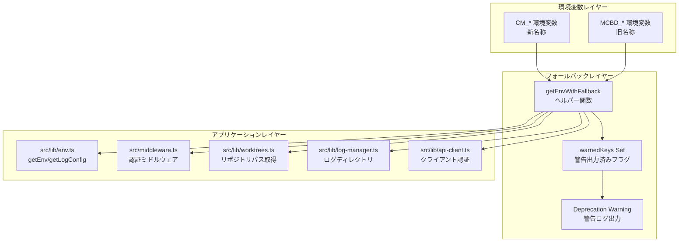
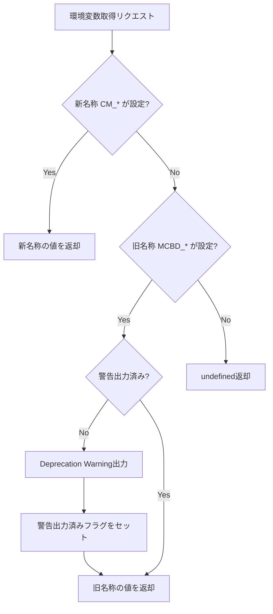

# 設計方針書: Issue #76 環境変数フォールバック実装 + CHANGELOG作成

## 1. 概要

### 1.1 目的
環境変数の新名称（`CM_*`）への移行準備として、フォールバック機能を実装する。
旧名称（`MCBD_*`）でも動作を維持し、後方互換性を確保する。

### 1.2 親Issue
- #74 Rename/Brand update: MyCodeBranchDesk → CommandMate

### 1.3 破壊的変更
**なし** - 後方互換性を維持

### 1.4 レビュー履歴

| 日付 | レビュー結果 | 対応 |
|------|-------------|------|
| 2026-01-29 | 条件付き承認 | 必須改善項目・推奨改善項目を反映 |
| 2026-01-29 | 整合性レビュー | ENV_MAPPINGを13種類→8種類に修正（存在しない環境変数5種を削除） |
| 2026-01-29 | 承認 | 推奨改善項目をスコープに追加（logger.ts, sync/route.ts） |

---

## 2. アーキテクチャ設計

### 2.1 システム構成図



### 2.2 フォールバック処理フロー



---

## 3. 技術選定

| カテゴリ | 選定技術 | 選定理由 |
|---------|---------|---------|
| フォールバック実装 | 純粋なTypeScript関数 | 依存関係なし、テストしやすい |
| 警告ログ | console.warn | 標準出力で簡易、本番環境でも確認可能 |
| 警告重複防止 | Set（モジュールスコープ） | シンプルで効果的 |
| テストフレームワーク | Vitest | 既存技術スタック |

---

## 4. 設計パターン

### 4.1 Strategy-like パターン（環境変数取得）

環境変数取得ロジックを一元化し、新旧名称の優先順位を管理する。

```typescript
// src/lib/env.ts

/**
 * 環境変数マッピング定義
 * 新名称 → 旧名称のマッピング
 */
export const ENV_MAPPING = {
  CM_ROOT_DIR: 'MCBD_ROOT_DIR',
  CM_PORT: 'MCBD_PORT',
  CM_BIND: 'MCBD_BIND',
  CM_AUTH_TOKEN: 'MCBD_AUTH_TOKEN',
  CM_LOG_LEVEL: 'MCBD_LOG_LEVEL',
  CM_LOG_FORMAT: 'MCBD_LOG_FORMAT',
  CM_LOG_DIR: 'MCBD_LOG_DIR',
  CM_DB_PATH: 'MCBD_DB_PATH',
} as const;

export type EnvKey = keyof typeof ENV_MAPPING;

/**
 * 警告出力済みキーを管理するSet
 * モジュールスコープで管理し、同一キーに対する重複警告を防止
 */
const warnedKeys = new Set<string>();

/**
 * 警告出力済みフラグをリセット（テスト用）
 */
export function resetWarnedKeys(): void {
  warnedKeys.clear();
}

/**
 * フォールバック付き環境変数取得
 *
 * @param newKey - 新名称（CM_*）
 * @param oldKey - 旧名称（MCBD_*）
 * @returns 環境変数の値（undefined if not set）
 */
export function getEnvWithFallback(newKey: string, oldKey: string): string | undefined {
  const newValue = process.env[newKey];
  if (newValue !== undefined) {
    return newValue;
  }

  const oldValue = process.env[oldKey];
  if (oldValue !== undefined) {
    if (!warnedKeys.has(oldKey)) {
      console.warn(`[DEPRECATED] ${oldKey} is deprecated, use ${newKey} instead`);
      warnedKeys.add(oldKey);
    }
    return oldValue;
  }

  return undefined;
}

/**
 * ENV_MAPPINGを使用した環境変数取得（型安全版）
 *
 * @param key - 新名称のキー（ENV_MAPPINGのキー）
 * @returns 環境変数の値（undefined if not set）
 */
export function getEnvByKey(key: EnvKey): string | undefined {
  return getEnvWithFallback(key, ENV_MAPPING[key]);
}
```

### 4.2 インターフェース設計（変更なし）

既存の`Env`インターフェースは内部実装として維持し、プロパティ名は変更しない。

```typescript
// src/lib/env.ts - インターフェースは変更なし
export interface Env {
  MCBD_ROOT_DIR: string;      // 内部プロパティ名は維持
  MCBD_PORT: number;
  MCBD_BIND: string;
  MCBD_AUTH_TOKEN?: string;
  DATABASE_PATH: string;
}
```

---

## 5. データモデル設計

本Issueではデータモデルの変更なし。

---

## 6. API設計

本IssueではAPI変更なし。

---

## 7. 実装詳細

### 7.1 対象ファイルと変更内容

> ⚠️ **2026-01-29整合性レビュー**: コードベース実測値に基づき修正。`clone-manager.ts`と`db.ts`は`MCBD_*`プレフィックス付き環境変数を使用していないため対象外。

| ファイル | 変更内容 |
|---------|---------|
| `src/lib/env.ts` | `getEnvWithFallback`ヘルパー追加、`getEnv()`・`getLogConfig()`をフォールバック対応 |
| `src/middleware.ts` | `MCBD_BIND`・`MCBD_AUTH_TOKEN`参照をフォールバック対応 |
| `src/lib/worktrees.ts` | `MCBD_ROOT_DIR`参照をフォールバック対応 |
| `src/lib/log-manager.ts` | `MCBD_LOG_DIR`参照をフォールバック対応 |
| `src/lib/api-client.ts` | `NEXT_PUBLIC_MCBD_AUTH_TOKEN`参照をフォールバック対応 |
| `src/lib/logger.ts` | `CM_AUTH_TOKEN`マスキングパターン追加 |
| `src/app/api/repositories/sync/route.ts` | エラーメッセージに新名称を追加 |
| `src/app/api/worktrees/[id]/logs/[filename]/route.ts` | `MCBD_LOG_DIR`参照をフォールバック対応 |
| `tests/unit/env.test.ts` | フォールバック機能のユニットテスト追加（新規） |
| `CHANGELOG.md` | 新規作成 |

### 7.2 環境変数マッピング（全8種類）

> ⚠️ **2026-01-29整合性レビュー**: コードベース実測値に基づき修正

| 新名称 | 旧名称（フォールバック） | 用途 | 使用箇所 |
|--------|------------------------|------|---------|
| `CM_ROOT_DIR` | `MCBD_ROOT_DIR` | ワークツリールートディレクトリ | env.ts:92, worktrees.ts:134 |
| `CM_PORT` | `MCBD_PORT` | サーバーポート | env.ts:93 |
| `CM_BIND` | `MCBD_BIND` | バインドアドレス | env.ts:94, middleware.ts:25 |
| `CM_AUTH_TOKEN` | `MCBD_AUTH_TOKEN` | 認証トークン | env.ts:95, middleware.ts:34 |
| `CM_LOG_LEVEL` | `MCBD_LOG_LEVEL` | ログレベル | env.ts:45 |
| `CM_LOG_FORMAT` | `MCBD_LOG_FORMAT` | ログフォーマット | env.ts:46 |
| `CM_LOG_DIR` | `MCBD_LOG_DIR` | ログディレクトリ | log-manager.ts:13, worktrees/[id]/logs/[filename]/route.ts:12 |
| `CM_DB_PATH` | `MCBD_DB_PATH` | DBファイルパス | scripts/*（マイグレーション用） |

### 7.3 フォールバック対象外の環境変数

以下の環境変数はCM_*プレフィックスへの移行対象外とする。

| 環境変数 | 理由 | 使用箇所 |
|---------|------|---------|
| `WORKTREE_REPOS` | 独自命名（MCBDプレフィックスなし） | `worktrees.ts` |
| `WORKTREE_BASE_PATH` | 独自命名（MCBDプレフィックスなし） | `clone-manager.ts` |
| `DATABASE_PATH` | 一般的な命名（MCBDプレフィックスなし） | `env.ts`, `db-instance.ts` |
| `NODE_ENV` | 標準環境変数 | 各所 |

> **Note**: `WORKTREE_BASE_PATH`と`WORKTREE_REPOS`は元々MCBDプレフィックスを持たないため、本Issueでのフォールバック対象外。
> `DATABASE_PATH`は`CM_DB_PATH`へのフォールバックで対応済み（`CM_DB_PATH` → `MCBD_DB_PATH` → `DATABASE_PATH`の優先順位）。

### 7.4 クライアント側環境変数

| 新名称 | 旧名称（フォールバック） | 備考 |
|--------|------------------------|------|
| `NEXT_PUBLIC_CM_AUTH_TOKEN` | `NEXT_PUBLIC_MCBD_AUTH_TOKEN` | クライアント側認証トークン |

**調査結果**: `src/lib/api-client.ts:46` で使用されていることを確認。フォールバック対応が必要。

### 7.5 各ファイルの実装詳細

#### 7.5.1 src/lib/env.ts

```typescript
import path from 'path';

// ============================================================
// Environment Variable Mapping (for fallback support)
// ============================================================

/**
 * 環境変数マッピング定義
 * 新名称 → 旧名称のマッピング
 */
export const ENV_MAPPING = {
  CM_ROOT_DIR: 'MCBD_ROOT_DIR',
  CM_PORT: 'MCBD_PORT',
  CM_BIND: 'MCBD_BIND',
  CM_AUTH_TOKEN: 'MCBD_AUTH_TOKEN',
  CM_LOG_LEVEL: 'MCBD_LOG_LEVEL',
  CM_LOG_FORMAT: 'MCBD_LOG_FORMAT',
  CM_LOG_DIR: 'MCBD_LOG_DIR',
  CM_DB_PATH: 'MCBD_DB_PATH',
} as const;

export type EnvKey = keyof typeof ENV_MAPPING;

/**
 * 警告出力済みキーを管理するSet
 * モジュールスコープで管理し、同一キーに対する重複警告を防止
 */
const warnedKeys = new Set<string>();

/**
 * 警告出力済みフラグをリセット（テスト用）
 */
export function resetWarnedKeys(): void {
  warnedKeys.clear();
}

/**
 * フォールバック付き環境変数取得
 *
 * @param newKey - 新名称（CM_*）
 * @param oldKey - 旧名称（MCBD_*）
 * @returns 環境変数の値（undefined if not set）
 */
export function getEnvWithFallback(newKey: string, oldKey: string): string | undefined {
  const newValue = process.env[newKey];
  if (newValue !== undefined) {
    return newValue;
  }

  const oldValue = process.env[oldKey];
  if (oldValue !== undefined) {
    if (!warnedKeys.has(oldKey)) {
      console.warn(`[DEPRECATED] ${oldKey} is deprecated, use ${newKey} instead`);
      warnedKeys.add(oldKey);
    }
    return oldValue;
  }

  return undefined;
}

/**
 * ENV_MAPPINGを使用した環境変数取得（型安全版）
 *
 * @param key - 新名称のキー（ENV_MAPPINGのキー）
 * @returns 環境変数の値（undefined if not set）
 */
export function getEnvByKey(key: EnvKey): string | undefined {
  return getEnvWithFallback(key, ENV_MAPPING[key]);
}

// ============================================================
// Log Configuration (with fallback)
// ============================================================

export function getLogConfig(): LogConfig {
  const levelEnv = getEnvByKey('CM_LOG_LEVEL')?.toLowerCase();
  const formatEnv = getEnvByKey('CM_LOG_FORMAT')?.toLowerCase();

  const defaultLevel: LogLevel = process.env.NODE_ENV === 'production' ? 'info' : 'debug';

  return {
    level: isValidLogLevel(levelEnv) ? levelEnv : defaultLevel,
    format: formatEnv === 'json' ? 'json' : 'text',
  };
}

// ============================================================
// Environment Configuration (with fallback)
// ============================================================

export function getEnv(): Env {
  const rootDir = getEnvByKey('CM_ROOT_DIR') || process.cwd();
  const port = parseInt(getEnvByKey('CM_PORT') || '3000', 10);
  const bind = getEnvByKey('CM_BIND') || '127.0.0.1';
  const authToken = getEnvByKey('CM_AUTH_TOKEN');
  const databasePath = getEnvByKey('CM_DB_PATH')
    || process.env.DATABASE_PATH
    || path.join(process.cwd(), 'data', 'db.sqlite');

  // Validate values
  if (!rootDir) {
    throw new Error('CM_ROOT_DIR (or MCBD_ROOT_DIR) is required');
  }

  if (isNaN(port) || port < 1 || port > 65535) {
    throw new Error(`Invalid CM_PORT: ${getEnvByKey('CM_PORT')}. Must be between 1 and 65535.`);
  }

  if (bind !== '127.0.0.1' && bind !== '0.0.0.0' && bind !== 'localhost') {
    throw new Error(`Invalid CM_BIND: ${bind}. Must be '127.0.0.1', '0.0.0.0', or 'localhost'.`);
  }

  // Require auth token for public binding
  if (bind === '0.0.0.0' && !authToken) {
    throw new Error('CM_AUTH_TOKEN (or MCBD_AUTH_TOKEN) is required when CM_BIND=0.0.0.0');
  }

  return {
    MCBD_ROOT_DIR: path.resolve(rootDir),
    MCBD_PORT: port,
    MCBD_BIND: bind,
    MCBD_AUTH_TOKEN: authToken,
    DATABASE_PATH: path.resolve(databasePath),
  };
}
```

#### 7.5.2 src/middleware.ts

> **重要**: Next.js middlewareでは `@/` エイリアスが使用できないため、相対パスでインポートする。

```typescript
/**
 * Next.js Middleware for API Authentication
 * Protects API routes with Bearer token authentication when running on public interfaces
 */

import { NextRequest, NextResponse } from 'next/server';
import { getEnvWithFallback } from './lib/env';

/**
 * Authentication middleware
 *
 * Behavior:
 * - CM_BIND=127.0.0.1 or localhost: No authentication required (development)
 * - CM_BIND=0.0.0.0: Bearer token authentication required (production)
 *
 * @param request - The incoming request
 * @returns NextResponse for rejected requests, undefined to continue
 */
export function middleware(request: NextRequest) {
  // Only check authentication for API routes
  if (!request.nextUrl.pathname.startsWith('/api/')) {
    return;
  }

  // Get bind address from environment (with fallback)
  const bind = getEnvWithFallback('CM_BIND', 'MCBD_BIND') || '127.0.0.1';

  // Localhost binding: authentication is optional
  if (bind === '127.0.0.1' || bind === 'localhost') {
    return;
  }

  // Public binding (0.0.0.0): authentication is required
  if (bind === '0.0.0.0') {
    const authToken = getEnvWithFallback('CM_AUTH_TOKEN', 'MCBD_AUTH_TOKEN');

    // Server misconfiguration: public binding without token
    if (!authToken) {
      return NextResponse.json(
        { error: 'Server authentication not configured' },
        { status: 500 }
      );
    }

    // Extract Authorization header
    const authHeader = request.headers.get('Authorization');

    if (!authHeader) {
      return NextResponse.json(
        { error: 'Authorization header required' },
        { status: 401 }
      );
    }

    // Parse Bearer token (case-insensitive)
    const match = authHeader.match(/^bearer\s+(.+)$/i);

    if (!match) {
      return NextResponse.json(
        { error: 'Invalid Authorization format. Expected: Bearer <token>' },
        { status: 401 }
      );
    }

    const token = match[1];

    // Validate token
    if (token !== authToken) {
      return NextResponse.json(
        { error: 'Invalid authentication token' },
        { status: 401 }
      );
    }

    // Token is valid, continue
    return;
  }

  // Unknown bind address, continue (let env validation handle it)
  return;
}

// Configure which routes to run middleware on
export const config = {
  matcher: '/api/:path*',
};
```

#### 7.5.3 src/lib/worktrees.ts

```typescript
import { getEnvByKey } from './env';

export function getRepositoryPaths(): string[] {
  // WORKTREE_REPOS は変更なし（CM_*プレフィックス対象外）
  const worktreeRepos = process.env.WORKTREE_REPOS;
  if (worktreeRepos && worktreeRepos.trim()) {
    return worktreeRepos.split(',').map(p => p.trim()).filter(p => p.length > 0);
  }

  // CM_ROOT_DIR → MCBD_ROOT_DIR へフォールバック対応
  const rootDir = getEnvByKey('CM_ROOT_DIR');
  if (rootDir && rootDir.trim()) {
    return [rootDir.trim()];
  }

  return [];
}
```

#### 7.5.4 src/lib/log-manager.ts

```typescript
import path from 'path';
import { getEnvByKey } from './env';

/**
 * Log directory configuration (with fallback)
 */
const LOG_DIR = getEnvByKey('CM_LOG_DIR')
  || path.join(process.cwd(), 'data', 'logs');
```

#### 7.5.5 src/lib/api-client.ts

> **重要**: クライアント側では`getEnvWithFallback`を直接使用できないため、インライン実装で対応。
> 警告重複防止のため、モジュールスコープのフラグを使用する。

```typescript
/**
 * クライアント側の警告出力済みフラグ
 * ブラウザコンソールへの大量警告を防止
 */
let clientAuthTokenWarned = false;

/**
 * Base fetch wrapper with error handling
 */
async function fetchApi<T>(url: string, options?: RequestInit): Promise<T> {
  try {
    // Get auth token from environment variable (with fallback)
    // NEXT_PUBLIC_* 環境変数はビルド時に埋め込まれるため、クライアント側でも使用可能
    const authToken = process.env.NEXT_PUBLIC_CM_AUTH_TOKEN
      || process.env.NEXT_PUBLIC_MCBD_AUTH_TOKEN;

    // 旧名称使用時の警告（初回のみ）
    if (
      process.env.NEXT_PUBLIC_MCBD_AUTH_TOKEN &&
      !process.env.NEXT_PUBLIC_CM_AUTH_TOKEN &&
      !clientAuthTokenWarned
    ) {
      console.warn('[DEPRECATED] NEXT_PUBLIC_MCBD_AUTH_TOKEN is deprecated, use NEXT_PUBLIC_CM_AUTH_TOKEN instead');
      clientAuthTokenWarned = true;
    }

    const headers = new Headers(options?.headers);
    headers.set('Content-Type', 'application/json');

    // Add Bearer token if available
    if (authToken) {
      headers.set('Authorization', `Bearer ${authToken}`);
    }

    const response = await fetch(url, {
      ...options,
      headers,
    });

    if (!response.ok) {
      const errorBody = await response
        .json()
        .catch(() => ({})) as { error?: string };
      throw new ApiError(
        errorBody.error || `HTTP error ${response.status}`,
        response.status,
        errorBody
      );
    }

    return response.json();
  } catch (error) {
    if (error instanceof ApiError) {
      throw error;
    }
    throw new ApiError(
      error instanceof Error ? error.message : 'Unknown error',
      0,
      error
    );
  }
}
```

#### 7.5.6 src/lib/logger.ts

> **2026-01-29追加**: 推奨改善項目として本Issueのスコープに追加

`SENSITIVE_PATTERNS`配列に`CM_AUTH_TOKEN`のマスキングパターンを追加する。

**変更箇所**: `src/lib/logger.ts:82-83`付近

```typescript
const SENSITIVE_PATTERNS: Array<{ pattern: RegExp; replacement: string }> = [
  // Bearer token
  { pattern: /Bearer\s+[A-Za-z0-9\-._~+/]+=*/gi, replacement: 'Bearer [REDACTED]' },
  // Password related
  { pattern: /(password|passwd|pwd)[=:]\s*\S+/gi, replacement: '$1=[REDACTED]' },
  // Token/secret related
  { pattern: /(token|secret|api_key|apikey|auth)[=:]\s*\S+/gi, replacement: '$1=[REDACTED]' },
  // CM_AUTH_TOKEN（新名称）
  { pattern: /CM_AUTH_TOKEN=\S+/gi, replacement: 'CM_AUTH_TOKEN=[REDACTED]' },
  // MCBD_AUTH_TOKEN（旧名称、既存）
  { pattern: /MCBD_AUTH_TOKEN=\S+/gi, replacement: 'MCBD_AUTH_TOKEN=[REDACTED]' },
  // Authorization header
  { pattern: /Authorization:\s*\S+/gi, replacement: 'Authorization: [REDACTED]' },
  // SSH key
  { pattern: /-----BEGIN\s+\w+\s+PRIVATE\s+KEY-----[\s\S]*?-----END\s+\w+\s+PRIVATE\s+KEY-----/g, replacement: '[SSH_KEY_REDACTED]' },
];
```

#### 7.5.7 src/app/api/repositories/sync/route.ts

> **2026-01-29追加**: 推奨改善項目として本Issueのスコープに追加

エラーメッセージに新名称（`CM_ROOT_DIR`）を追加し、ユーザーが新名称を認識できるようにする。

**変更箇所**: `src/app/api/repositories/sync/route.ts:17`

```typescript
// 変更前
{ error: 'No repositories configured. Please set WORKTREE_REPOS or MCBD_ROOT_DIR environment variable.' }

// 変更後
{ error: 'No repositories configured. Please set WORKTREE_REPOS or CM_ROOT_DIR (MCBD_ROOT_DIR) environment variable.' }
```

> **Note**: 旧名称も括弧内に残すことで、既存ユーザーの混乱を防止する。

---

## 8. テスト戦略

### 8.1 ユニットテスト（tests/unit/env.test.ts）

```typescript
import { describe, it, expect, vi, beforeEach, afterEach } from 'vitest';
import {
  getEnvWithFallback,
  getEnvByKey,
  getEnv,
  getLogConfig,
  resetWarnedKeys,
  ENV_MAPPING,
} from '@/lib/env';

describe('getEnvWithFallback', () => {
  const originalEnv = process.env;

  beforeEach(() => {
    process.env = { ...originalEnv };
    resetWarnedKeys();
    vi.spyOn(console, 'warn').mockImplementation(() => {});
  });

  afterEach(() => {
    process.env = originalEnv;
    vi.restoreAllMocks();
  });

  it('新名称のみ設定時、新名称の値を返す', () => {
    process.env.CM_ROOT_DIR = '/new/path';

    const result = getEnvWithFallback('CM_ROOT_DIR', 'MCBD_ROOT_DIR');

    expect(result).toBe('/new/path');
    expect(console.warn).not.toHaveBeenCalled();
  });

  it('旧名称のみ設定時、フォールバックで旧名称の値を返し警告を出力', () => {
    process.env.MCBD_ROOT_DIR = '/old/path';

    const result = getEnvWithFallback('CM_ROOT_DIR', 'MCBD_ROOT_DIR');

    expect(result).toBe('/old/path');
    expect(console.warn).toHaveBeenCalledWith(
      '[DEPRECATED] MCBD_ROOT_DIR is deprecated, use CM_ROOT_DIR instead'
    );
  });

  it('両方設定時、新名称が優先される', () => {
    process.env.CM_ROOT_DIR = '/new/path';
    process.env.MCBD_ROOT_DIR = '/old/path';

    const result = getEnvWithFallback('CM_ROOT_DIR', 'MCBD_ROOT_DIR');

    expect(result).toBe('/new/path');
    expect(console.warn).not.toHaveBeenCalled();
  });

  it('両方未設定時、undefinedを返す', () => {
    const result = getEnvWithFallback('CM_ROOT_DIR', 'MCBD_ROOT_DIR');

    expect(result).toBeUndefined();
    expect(console.warn).not.toHaveBeenCalled();
  });

  it('空文字列は有効な値として扱う', () => {
    process.env.CM_ROOT_DIR = '';

    const result = getEnvWithFallback('CM_ROOT_DIR', 'MCBD_ROOT_DIR');

    expect(result).toBe('');
  });

  it('同一キーへの複数回呼び出しで警告は1回のみ出力', () => {
    process.env.MCBD_ROOT_DIR = '/old/path';

    getEnvWithFallback('CM_ROOT_DIR', 'MCBD_ROOT_DIR');
    getEnvWithFallback('CM_ROOT_DIR', 'MCBD_ROOT_DIR');
    getEnvWithFallback('CM_ROOT_DIR', 'MCBD_ROOT_DIR');

    expect(console.warn).toHaveBeenCalledTimes(1);
  });

  it('異なるキーへの呼び出しでそれぞれ警告が出力', () => {
    process.env.MCBD_ROOT_DIR = '/old/path';
    process.env.MCBD_PORT = '3000';

    getEnvWithFallback('CM_ROOT_DIR', 'MCBD_ROOT_DIR');
    getEnvWithFallback('CM_PORT', 'MCBD_PORT');

    expect(console.warn).toHaveBeenCalledTimes(2);
  });
});

describe('getEnvByKey', () => {
  const originalEnv = process.env;

  beforeEach(() => {
    process.env = { ...originalEnv };
    resetWarnedKeys();
    vi.spyOn(console, 'warn').mockImplementation(() => {});
  });

  afterEach(() => {
    process.env = originalEnv;
    vi.restoreAllMocks();
  });

  it('ENV_MAPPINGを使用して正しくフォールバック', () => {
    process.env.MCBD_LOG_LEVEL = 'debug';

    const result = getEnvByKey('CM_LOG_LEVEL');

    expect(result).toBe('debug');
    expect(console.warn).toHaveBeenCalledWith(
      '[DEPRECATED] MCBD_LOG_LEVEL is deprecated, use CM_LOG_LEVEL instead'
    );
  });
});

describe('resetWarnedKeys', () => {
  const originalEnv = process.env;

  beforeEach(() => {
    process.env = { ...originalEnv };
    vi.spyOn(console, 'warn').mockImplementation(() => {});
  });

  afterEach(() => {
    process.env = originalEnv;
    vi.restoreAllMocks();
  });

  it('リセット後は再度警告が出力される', () => {
    process.env.MCBD_ROOT_DIR = '/old/path';

    getEnvWithFallback('CM_ROOT_DIR', 'MCBD_ROOT_DIR');
    expect(console.warn).toHaveBeenCalledTimes(1);

    resetWarnedKeys();

    getEnvWithFallback('CM_ROOT_DIR', 'MCBD_ROOT_DIR');
    expect(console.warn).toHaveBeenCalledTimes(2);
  });
});

describe('getEnv with fallback', () => {
  const originalEnv = process.env;

  beforeEach(() => {
    process.env = { ...originalEnv };
    resetWarnedKeys();
    vi.spyOn(console, 'warn').mockImplementation(() => {});
  });

  afterEach(() => {
    process.env = originalEnv;
    vi.restoreAllMocks();
  });

  it('新名称で設定した場合、警告なしで動作する', () => {
    process.env.CM_ROOT_DIR = '/test/path';
    process.env.CM_PORT = '4000';
    process.env.CM_BIND = '127.0.0.1';

    const env = getEnv();

    expect(env.MCBD_ROOT_DIR).toBe('/test/path');
    expect(env.MCBD_PORT).toBe(4000);
    expect(console.warn).not.toHaveBeenCalled();
  });

  it('旧名称で設定した場合、警告付きで動作する', () => {
    process.env.MCBD_ROOT_DIR = '/test/path';
    process.env.MCBD_PORT = '4000';
    process.env.MCBD_BIND = '127.0.0.1';

    const env = getEnv();

    expect(env.MCBD_ROOT_DIR).toBe('/test/path');
    expect(env.MCBD_PORT).toBe(4000);
    expect(console.warn).toHaveBeenCalled();
  });
});

describe('getLogConfig with fallback', () => {
  const originalEnv = process.env;

  beforeEach(() => {
    process.env = { ...originalEnv };
    resetWarnedKeys();
    vi.spyOn(console, 'warn').mockImplementation(() => {});
  });

  afterEach(() => {
    process.env = originalEnv;
    vi.restoreAllMocks();
  });

  it('新名称で設定した場合、警告なしで動作する', () => {
    process.env.CM_LOG_LEVEL = 'debug';
    process.env.CM_LOG_FORMAT = 'json';

    const config = getLogConfig();

    expect(config.level).toBe('debug');
    expect(config.format).toBe('json');
    expect(console.warn).not.toHaveBeenCalled();
  });

  it('旧名称で設定した場合、警告付きで動作する', () => {
    process.env.MCBD_LOG_LEVEL = 'error';
    process.env.MCBD_LOG_FORMAT = 'text';

    const config = getLogConfig();

    expect(config.level).toBe('error');
    expect(config.format).toBe('text');
    expect(console.warn).toHaveBeenCalled();
  });
});

describe('ENV_MAPPING', () => {
  it('全8種類の環境変数がマッピングされている', () => {
    expect(Object.keys(ENV_MAPPING)).toHaveLength(8);
  });

  it('各マッピングが正しい形式', () => {
    for (const [newKey, oldKey] of Object.entries(ENV_MAPPING)) {
      expect(newKey).toMatch(/^CM_/);
      expect(oldKey).toMatch(/^MCBD_/);
    }
  });
});
```

### 8.2 テストケース一覧

| テストケース | 対象 | 説明 | 期待結果 |
|------------|------|------|---------|
| 新名称のみ設定 | `CM_*` | 新環境変数名で正常動作 | 値を返却、警告なし |
| 旧名称のみ設定 | `MCBD_*` | フォールバックで正常動作 | 値を返却、警告出力 |
| 両方設定 | `CM_*` + `MCBD_*` | 新名称が優先される | 新名称の値を返却、警告なし |
| 両方未設定 | なし | undefined返却 | undefined |
| 空文字列 | `CM_*=''` | 空文字列は有効値 | 空文字列を返却 |
| 警告重複防止 | 同一キー複数回 | 警告は1回のみ | console.warn 1回 |
| 警告リセット | resetWarnedKeys後 | リセット後は再度警告 | console.warn呼び出し |
| ENV_MAPPINGの網羅性 | 全キー | 8種類がマッピング | 全キー存在 |

---

## 9. セキュリティ設計

### 9.1 センシティブデータのマスキング

`logger.ts`のリダクション機能で、新旧両方の認証トークンキー名をマスキング対象とする。

**変更箇所**: `src/lib/logger.ts:82-83`付近

```typescript
// src/lib/logger.ts - SENSITIVE_PATTERNS配列に追加
const SENSITIVE_PATTERNS: Array<{ pattern: RegExp; replacement: string }> = [
  // ... 既存のパターン ...
  // CM_AUTH_TOKEN（新名称）
  { pattern: /CM_AUTH_TOKEN=\S+/gi, replacement: 'CM_AUTH_TOKEN=[REDACTED]' },
  // MCBD_AUTH_TOKEN（旧名称、既存）
  { pattern: /MCBD_AUTH_TOKEN=\S+/gi, replacement: 'MCBD_AUTH_TOKEN=[REDACTED]' },
  // ...
];
```

> **2026-01-29更新**: 本Issue (#76) のスコープに含め、フォールバック機能と同時に実装する。

### 9.2 環境変数の検証

既存のバリデーションロジックは維持し、フォールバック後の値に対して適用される。

---

## 10. パフォーマンス設計

### 10.1 警告ログの重複出力防止

`warnedKeys` Setを使用して、同一環境変数に対する警告を1回のみ出力する。

```typescript
const warnedKeys = new Set<string>();

export function getEnvWithFallback(newKey: string, oldKey: string): string | undefined {
  // ...
  if (oldValue !== undefined) {
    if (!warnedKeys.has(oldKey)) {
      console.warn(`[DEPRECATED] ${oldKey} is deprecated, use ${newKey} instead`);
      warnedKeys.add(oldKey);
    }
    return oldValue;
  }
  // ...
}
```

### 10.2 クライアント側の警告重複防止

`api-client.ts`では、モジュールスコープのフラグ変数で警告重複を防止する。

```typescript
let clientAuthTokenWarned = false;

// fetchApi内で使用
if (!clientAuthTokenWarned) {
  console.warn('[DEPRECATED] ...');
  clientAuthTokenWarned = true;
}
```

---

## 11. 設計上の決定事項とトレードオフ

### 11.1 採用した設計

| 決定事項 | 理由 | トレードオフ |
|---------|------|-------------|
| warnedKeys Set | 警告重複防止、シンプル | テスト時にリセット必要 |
| ENV_MAPPING定数 | 一貫性、型安全 | 若干のボイラープレート |
| resetWarnedKeys関数 | テスト容易性 | テスト専用APIの露出 |
| 相対パスインポート（middleware） | Next.js制約への対応 | パスエイリアス非使用 |

### 11.2 代替案との比較

#### 代替案1: 環境変数の一括変換（起動時）

```typescript
// アプリ起動時に旧名称を新名称にコピー
function migrateEnvVars() {
  for (const [newKey, oldKey] of Object.entries(ENV_MAPPING)) {
    if (!process.env[newKey] && process.env[oldKey]) {
      console.warn(`[DEPRECATED] ${oldKey} is deprecated, use ${newKey} instead`);
      process.env[newKey] = process.env[oldKey];
    }
  }
}
```

- **メリット**: 一度だけ警告出力、以降は新名称で統一
- **デメリット**: process.envの変更は副作用、テスト困難
- **結論**: 副作用が大きいため不採用

---

## 12. CHANGELOG.md 新規作成

### 12.1 ファイル内容

```markdown
# Changelog

All notable changes to this project will be documented in this file.

The format is based on [Keep a Changelog](https://keepachangelog.com/en/1.1.0/),
and this project adheres to [Semantic Versioning](https://semver.org/spec/v2.0.0.html).

## [Unreleased]

### Added
- Environment variable fallback support for backwards compatibility
  - New `CM_*` prefix supported alongside legacy `MCBD_*` prefix
  - Deprecation warnings logged when legacy names are used (once per key)
  - All 8 environment variables support fallback

### Deprecated
- `MCBD_*` environment variables - use `CM_*` instead (will be removed in next major version)
  - `MCBD_ROOT_DIR` → `CM_ROOT_DIR`
  - `MCBD_PORT` → `CM_PORT`
  - `MCBD_BIND` → `CM_BIND`
  - `MCBD_AUTH_TOKEN` → `CM_AUTH_TOKEN`
  - `MCBD_LOG_LEVEL` → `CM_LOG_LEVEL`
  - `MCBD_LOG_FORMAT` → `CM_LOG_FORMAT`
  - `MCBD_LOG_DIR` → `CM_LOG_DIR`
  - `MCBD_DB_PATH` → `CM_DB_PATH`
```

---

## 13. 実装チェックリスト

### Step 1: 環境変数フォールバック実装
- [ ] `src/lib/env.ts` に `ENV_MAPPING` 定数を追加
- [ ] `src/lib/env.ts` に `warnedKeys` Set と `resetWarnedKeys` 関数を追加
- [ ] `src/lib/env.ts` に `getEnvWithFallback` ヘルパー関数を実装
- [ ] `src/lib/env.ts` に `getEnvByKey` 型安全版関数を実装
- [ ] `getEnv()` 関数をフォールバック対応に更新
- [ ] `getLogConfig()` 関数をフォールバック対応に更新

### Step 2: 関連ファイルの更新
- [ ] `src/middleware.ts` - 相対パスで `getEnvWithFallback` をインポート
- [ ] `src/middleware.ts` - 環境変数参照をフォールバック対応
- [ ] `src/lib/worktrees.ts` - `getEnvByKey` を使用して `CM_ROOT_DIR` 参照
- [ ] `src/lib/log-manager.ts` - `getEnvByKey` を使用して `CM_LOG_DIR` 参照
- [ ] `src/lib/api-client.ts` - クライアント側フォールバック（警告重複防止付き）
- [ ] `src/lib/logger.ts` - `CM_AUTH_TOKEN`マスキングパターン追加
- [ ] `src/app/api/repositories/sync/route.ts` - エラーメッセージに新名称追加
- [ ] `src/app/api/worktrees/[id]/logs/[filename]/route.ts` - `getEnvByKey`を使用して`CM_LOG_DIR`参照

### Step 3: テスト追加
- [ ] `tests/unit/env.test.ts` にフォールバック機能のテストを追加
- [ ] 新名称のみ設定時の動作テスト
- [ ] 旧名称のみ設定時のフォールバック動作テスト
- [ ] 両方設定時に新名称が優先されるテスト
- [ ] 警告重複防止のテスト
- [ ] resetWarnedKeysのテスト
- [ ] ENV_MAPPINGの網羅性テスト

### Step 4: NEXT_PUBLIC_MCBD_AUTH_TOKEN の確認
- [x] 使用箇所の確認（確認済み: `src/lib/api-client.ts:46`）
- [ ] フォールバック対応を実装
- [ ] 調査結果を #77 のIssue本文に追記

### Step 5: CHANGELOG.md の新規作成
- [ ] `CHANGELOG.md` をルートディレクトリに新規作成
- [ ] Keep a Changelog フォーマットに準拠
- [ ] 本Issue完了時点の変更を記載

### Step 6: 品質確認
- [ ] TypeScriptコンパイルエラーなし (`npx tsc --noEmit`)
- [ ] ESLintエラーなし (`npm run lint`)
- [ ] 既存テストがすべてパス (`npm run test:unit`)
- [ ] ビルド成功 (`npm run build`)

---

## 14. 受け入れ条件

- [ ] 新環境変数名（`CM_*`）で正常に動作する
- [ ] 旧環境変数名（`MCBD_*`）でも正常に動作する（フォールバック）
- [ ] 旧名称使用時にdeprecation warningがログ出力される
- [ ] **同一キーへの警告は1回のみ出力される**
- [ ] **全8種類**の環境変数がフォールバック対応されている
- [ ] `NEXT_PUBLIC_MCBD_AUTH_TOKEN` のフォールバック対応が実装されている
- [ ] **調査結果が #77 のIssue本文に共有されている**
- [ ] フォールバック機能のユニットテストが追加されている
- [ ] **CHANGELOG.md が新規作成されている**
- [ ] **`CM_AUTH_TOKEN`がlogger.tsでマスキング対象に追加されている**
- [ ] **sync/route.tsのエラーメッセージに新名称が追加されている**
- [ ] TypeScriptコンパイルエラーなし
- [ ] 既存テストがすべてパスする

---

## 15. ロールバック計画

本Issueは後方互換性を維持するため、ロールバックリスクは低い。

### 問題発生時の対応

1. **コード変更のロールバック**
   ```bash
   git revert <commit-hash>
   ```

2. **動作確認**
   - 旧名称（`MCBD_*`）で正常に起動することを確認
   - 既存テストがすべてパスすることを確認

3. **原因調査**
   - フォールバック実装のロジックエラーを特定
   - 修正後、再度PRを作成

---

## 16. 関連ドキュメント

- [親Issue #74](https://github.com/Kewton/MyCodeBranchDesk/issues/74) - リネーム計画全体
- [Issue #75](https://github.com/Kewton/MyCodeBranchDesk/issues/75) - ドキュメント・UI表示の変更（Phase 2）
- [Issue #77](https://github.com/Kewton/MyCodeBranchDesk/issues/77) - 設定・コード内の名称置換（Phase 3）
- [Keep a Changelog](https://keepachangelog.com/en/1.1.0/) - CHANGELOG形式
- [アーキテクチャレビュー](../review/2026-01-29-issue76-architecture-review.md) - 本設計のレビュー結果
