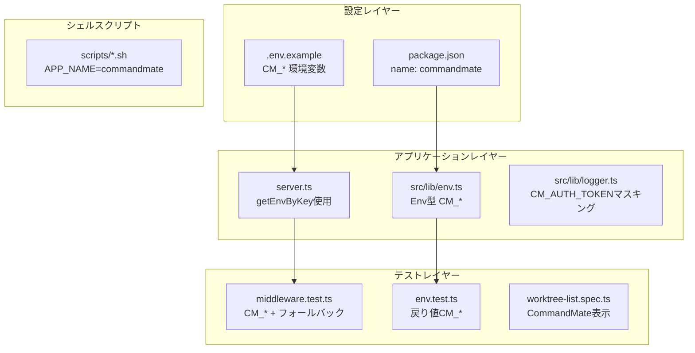
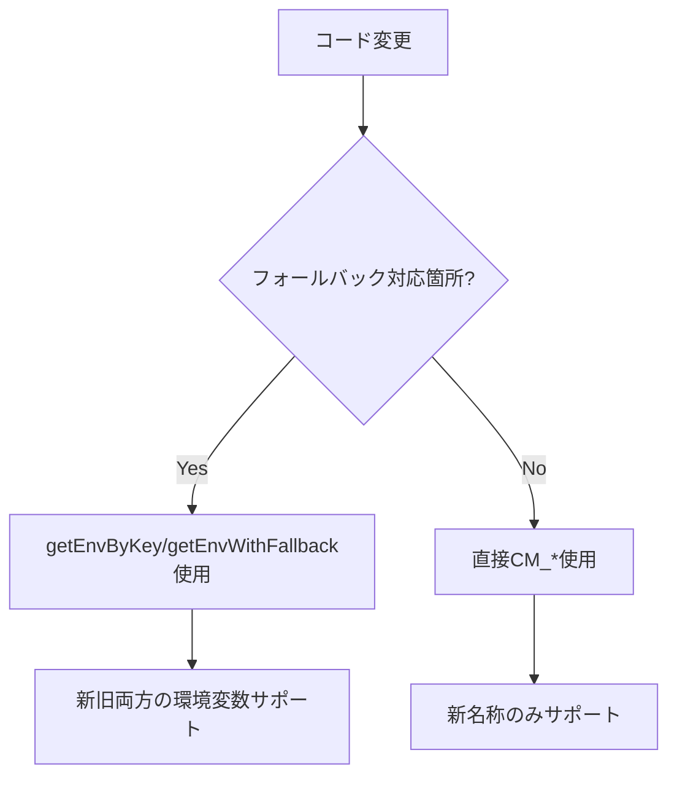

# 設計方針書: Issue #77 Phase 3 - 設定・コード内の名称置換

## 1. 概要

### 1.1 目的
CommandMateリネームの第3フェーズとして、環境変数名・package.json名・コード内名称の置換を実施する。

### 1.2 親Issue
- #74 Rename/Brand update: MyCodeBranchDesk → CommandMate

### 1.3 依存関係
- **前提**: Issue #76（環境変数フォールバック実装）完了済み
- **前提**: Issue #75（ドキュメント・UI表示変更）完了済み

### 1.4 破壊的変更
**あり** - ただしフォールバック機能により後方互換性を維持

### 1.5 レビュー履歴

| 日付 | レビュー結果 | 対応 |
|------|-------------|------|
| 2026-01-29 | Stage 1: 通常レビュー | MF-3件、SF-4件を特定 |
| 2026-01-29 | Stage 2: 整合性レビュー | MF-3件、SF-1件を特定 |
| 2026-01-29 | Stage 3: 影響分析レビュー | SF-1件を特定 |
| 2026-01-29 | Stage 4: セキュリティレビュー | OWASP 5/5準拠確認 |

---

## 2. アーキテクチャ設計

### 2.1 変更対象レイヤー



### 2.2 フォールバック活用設計

Issue #76で実装済みのフォールバック機構を活かし、後方互換性を維持する：



---

## 3. 実装詳細

### 3.1 対象ファイルと変更内容

> **レビュー指摘事項を反映**

| ファイル | 変更内容 | レビューID |
|---------|---------|----------|
| `package.json` | name を `commandmate` に変更 | - |
| `.env.example` | 全環境変数を `CM_*` に更新、コメント更新 | SF-2 |
| `src/lib/env.ts` | Envインターフェースのプロパティ名を `CM_*` に変更 | MF-1 |
| `server.ts` | `getEnvByKey()` を使用してフォールバック対応 | MF-2 |
| `tests/unit/middleware.test.ts` | `CM_*` テスト + フォールバックテスト追加 | MF-3 |
| `tests/unit/env.test.ts` | 戻り値のアサーションを `CM_*` に更新 | MF-1 |
| `src/lib/worktrees.ts` | コメント内の `MCBD_ROOT_DIR` → `CM_ROOT_DIR` | SF-3 |
| `src/lib/logger.ts` | モジュールコメントを `CommandMate` に更新 | SF-4 |
| `scripts/start.sh` | APP_NAME、コメント、systemdサービス名を更新 | Stage2 MF-1 |
| `scripts/logs.sh` | APP_NAME、コメント更新 | Stage2 MF-1 |
| `scripts/restart.sh` | APP_NAME、コメント更新 | Stage2 MF-1 |
| `tests/e2e/worktree-list.spec.ts` | `MyCodeBranchDesk` → `CommandMate` 更新 | Stage2 MF-2 |
| `src/components/layout/Header.tsx` | JSDocコメント更新 | Stage2 MF-3 |
| `tests/unit/logger.test.ts` | `CM_AUTH_TOKEN` リダクションテスト追加 | Stage3 SF-1 |

### 3.2 Envインターフェース変更

**変更前** (Issue #76設計書 Section 4.2):
```typescript
export interface Env {
  MCBD_ROOT_DIR: string;
  MCBD_PORT: number;
  MCBD_BIND: string;
  MCBD_AUTH_TOKEN?: string;
  DATABASE_PATH: string;
}
```

**変更後**:
```typescript
export interface Env {
  CM_ROOT_DIR: string;
  CM_PORT: number;
  CM_BIND: string;
  CM_AUTH_TOKEN?: string;
  DATABASE_PATH: string;
}
```

> **Note**: Issue #76設計書では「変更なし」と記載されていたが、Issue #77のスコープでインターフェース名を更新する。これは意図的な設計変更である。

### 3.3 server.ts フォールバック対応

**変更前**:
```typescript
const hostname = process.env.MCBD_BIND || '127.0.0.1';
const port = parseInt(process.env.MCBD_PORT || process.env.PORT || '3000', 10);
```

**変更後**:
```typescript
import { getEnvByKey } from './src/lib/env';

const hostname = getEnvByKey('CM_BIND') || '127.0.0.1';
const port = parseInt(getEnvByKey('CM_PORT') || process.env.PORT || '3000', 10);
```

### 3.4 シェルスクリプト更新

#### scripts/start.sh
```bash
#!/bin/bash
# CommandMate Start Script
APP_NAME="commandmate"
# ... 既存ロジック
```

#### scripts/logs.sh
```bash
#!/bin/bash
# CommandMate Log Viewer
APP_NAME="commandmate"
# ... 既存ロジック
```

#### scripts/restart.sh
```bash
#!/bin/bash
# CommandMate Restart Script
APP_NAME="commandmate"
# ... 既存ロジック
```

### 3.5 .env.example 更新

```bash
# CommandMate Environment Configuration

# Root directory for worktrees
CM_ROOT_DIR=/path/to/your/repos

# Server configuration
CM_PORT=3000
CM_BIND=127.0.0.1

# Authentication (required when CM_BIND=0.0.0.0)
CM_AUTH_TOKEN=your-secret-token

# Logging configuration
CM_LOG_LEVEL=info
CM_LOG_FORMAT=text
CM_LOG_DIR=./data/logs

# Database configuration
CM_DB_PATH=./data/db.sqlite

# ---
# DEPRECATED: MCBD_* environment variables are deprecated.
# They are still supported for backwards compatibility but will be removed in the next major version.
# Please migrate to CM_* variables.
# ---
```

---

## 4. テスト戦略

### 4.1 middleware.test.ts 更新方針

既存テストを新名称に更新し、フォールバックテストを追加：

```typescript
describe('Authentication Middleware', () => {
  describe('new naming (CM_*)', () => {
    beforeEach(() => {
      process.env.CM_BIND = '127.0.0.1';
      process.env.CM_AUTH_TOKEN = 'test-token';
    });

    it('should allow requests without authentication', () => {
      // ... 既存テストロジック
    });
  });

  describe('legacy naming fallback (MCBD_*)', () => {
    beforeEach(() => {
      process.env.MCBD_BIND = '0.0.0.0';
      process.env.MCBD_AUTH_TOKEN = 'test-token';
    });

    it('should work with legacy environment variables', () => {
      // フォールバック動作確認
    });
  });
});
```

### 4.2 env.test.ts アサーション更新

```typescript
describe('getEnv with new naming', () => {
  it('should return Env object with CM_* property names', () => {
    process.env.CM_ROOT_DIR = '/test/path';
    process.env.CM_PORT = '4000';
    process.env.CM_BIND = '127.0.0.1';

    const env = getEnv();

    expect(env.CM_ROOT_DIR).toBe('/test/path');
    expect(env.CM_PORT).toBe(4000);
    expect(env.CM_BIND).toBe('127.0.0.1');
  });
});
```

### 4.3 logger.test.ts CM_AUTH_TOKEN リダクションテスト

```typescript
describe('[MF-1] Sanitization - sensitive data filtering', () => {
  it('should redact CM_AUTH_TOKEN in log data', () => {
    const consoleSpy = vi.spyOn(console, 'log');

    const logger = createLogger('test');
    logger.info('env', {
      output: 'CM_AUTH_TOKEN=super-secret-token-123',
    });

    const output = consoleSpy.mock.calls[0][0] as string;
    expect(output).toContain('CM_AUTH_TOKEN=[REDACTED]');
    expect(output).not.toContain('super-secret-token-123');
  });
});
```

### 4.4 E2Eテスト更新

```typescript
// tests/e2e/worktree-list.spec.ts
test('should display page header and title', async ({ page }) => {
  await expect(page.getByRole('heading', { name: /CommandMate/i, level: 1 })).toBeVisible();
});

test('should be responsive', async ({ page }) => {
  await page.setViewportSize({ width: 375, height: 667 });
  await expect(page.getByRole('heading', { name: /CommandMate/i, level: 1 })).toBeVisible();
});
```

---

## 5. 影響分析

### 5.1 破壊的変更

| 変更 | 影響範囲 | 移行パス | 後方互換性 |
|-----|---------|---------|----------|
| Envインターフェース | `getEnv()` 使用箇所 | `.CM_*` に更新 | フォールバック関数は継続サポート |
| package.json name | npm/PM2 | `pm2 delete old-name && pm2 start` | なし |

### 5.2 非破壊的変更

| 変更 | 影響範囲 | 移行パス |
|-----|---------|---------|
| シェルスクリプト | APP_NAME、コメント | 既存PM2設定の更新 |
| .env.example | 新規セットアップ | 既存.envは継続動作 |
| テストファイル | CI/CD | 自動適用 |

### 5.3 外部依存への影響

| 依存 | 影響 | 移行手順 |
|-----|------|---------|
| PM2 | APP_NAME変更 | `pm2 delete mycodebranch-desk && pm2 start` |
| systemd | サービス名変更 | ユニットファイル更新 |

---

## 6. セキュリティ設計

### 6.1 OWASP Top 10 準拠確認

| カテゴリ | ステータス | 備考 |
|---------|----------|------|
| A01: Broken Access Control | ✅ Pass | 認証ミドルウェアがフォールバック機構を正しく使用 |
| A02: Cryptographic Failures | ✅ Pass | ローカル用途として許容範囲 |
| A03: Injection | ✅ Pass | 環境変数は直接シェル展開されない |
| A05: Security Misconfiguration | ✅ Pass | .env.exampleにdeprecation情報記載 |
| A09: Security Logging | ✅ Pass | 新旧両方のトークンキーをマスキング |

### 6.2 認証トークンのマスキング

`logger.ts` の `SENSITIVE_PATTERNS` で新旧両方をサポート：

```typescript
const SENSITIVE_PATTERNS = [
  { pattern: /CM_AUTH_TOKEN=\S+/gi, replacement: 'CM_AUTH_TOKEN=[REDACTED]' },
  { pattern: /MCBD_AUTH_TOKEN=\S+/gi, replacement: 'MCBD_AUTH_TOKEN=[REDACTED]' },
  // ... その他のパターン
];
```

---

## 7. 実装チェックリスト

### 7.1 設定ファイル
- [ ] `package.json` - name を `commandmate` に変更
- [ ] `.env.example` - 全環境変数を `CM_*` に更新、コメント更新

### 7.2 コアモジュール
- [ ] `src/lib/env.ts` - Envインターフェースを `CM_*` に変更
- [ ] `src/lib/env.ts` - `getEnv()` の戻り値を更新
- [ ] `server.ts` - `getEnvByKey()` を使用

### 7.3 コメント・ドキュメント
- [ ] `src/lib/worktrees.ts` - コメント更新
- [ ] `src/lib/logger.ts` - モジュールコメント更新
- [ ] `src/components/layout/Header.tsx` - JSDocコメント更新

### 7.4 シェルスクリプト
- [ ] `scripts/start.sh` - APP_NAME、コメント更新
- [ ] `scripts/logs.sh` - APP_NAME、コメント更新
- [ ] `scripts/restart.sh` - APP_NAME、コメント更新
- [ ] その他スクリプトの確認

### 7.5 テスト
- [ ] `tests/unit/middleware.test.ts` - `CM_*` テスト + フォールバックテスト
- [ ] `tests/unit/env.test.ts` - アサーション更新
- [ ] `tests/unit/logger.test.ts` - `CM_AUTH_TOKEN` リダクションテスト追加
- [ ] `tests/e2e/worktree-list.spec.ts` - `CommandMate` に更新、skip解除

### 7.6 品質確認
- [ ] TypeScriptコンパイルエラーなし (`npx tsc --noEmit`)
- [ ] ESLintエラーなし (`npm run lint`)
- [ ] 既存テストがすべてパス (`npm run test:unit`)
- [ ] ビルド成功 (`npm run build`)

---

## 8. 受け入れ条件

- [ ] package.json の name が `commandmate` である
- [ ] .env.example が `CM_*` 環境変数を使用している
- [ ] Envインターフェースが `CM_*` プロパティ名を使用している
- [ ] server.ts が `getEnvByKey()` を使用している
- [ ] シェルスクリプトのAPP_NAMEが `commandmate` である
- [ ] 全テストがパスする
- [ ] E2Eテストで `CommandMate` が表示される

---

## 9. ロールバック計画

### 9.1 git revertによるロールバック

```bash
git revert <commit-hash>
```

### 9.2 フォールバック機能による継続運用

破壊的変更があるが、フォールバック機能により既存の `MCBD_*` 環境変数は継続動作する。
ロールバック後も既存環境は影響を受けない。

---

## 10. 関連ドキュメント

- [親Issue #74](https://github.com/Kewton/MyCodeBranchDesk/issues/74) - リネーム計画全体
- [Issue #75](https://github.com/Kewton/MyCodeBranchDesk/issues/75) - ドキュメント・UI表示の変更（Phase 2）
- [Issue #76設計書](./issue-76-env-fallback-design-policy.md) - 環境変数フォールバック実装
- [マルチステージレビュー結果](../issue/77/multi-stage-review/) - 4段階レビュー結果

---

## 11. レビュー指摘事項サマリー

### 11.1 Stage 1: 通常レビュー（設計原則）

| ID | 重要度 | カテゴリ | 内容 |
|----|-------|---------|------|
| MF-1 | High | DRY/一貫性 | Env型インターフェースの旧名称残存 → 変更必須 |
| MF-2 | High | 一貫性 | server.ts の直接環境変数参照 → getEnvByKey使用 |
| MF-3 | High | テスト品質 | middleware.test.ts の旧名称使用 → 新名称+フォールバックテスト |
| SF-1 | Medium | KISS | scriptsの実際の参照箇所は限定的 |
| SF-2 | Medium | 一貫性 | .env.example の古いコメント |
| SF-3 | Medium | DRY | worktrees.ts内のコメント旧名称残存 |
| SF-4 | Low | 一貫性 | logger.ts のモジュールコメント |

### 11.2 Stage 2: 整合性レビュー

| ID | 重要度 | カテゴリ | 内容 |
|----|-------|---------|------|
| MF-1 | High | Issue要件 | scripts/start.sh, logs.sh, restart.sh の名称未更新 |
| MF-2 | High | Issue要件 | E2Eテストの旧名称残存 |
| MF-3 | Medium | Issue要件 | Header.tsxコメントの旧名称残存 |
| SF-1 | Medium | 設計書整合性 | Issue #76設計書との差異（Envインターフェース変更） |

### 11.3 Stage 3: 影響分析レビュー

| ID | 重要度 | カテゴリ | 内容 |
|----|-------|---------|------|
| SF-1 | Low | テストカバレッジ | logger.test.ts の CM_AUTH_TOKEN リダクションテスト追加 |

### 11.4 Stage 4: セキュリティレビュー

- OWASP Top 10: 5/5 準拠
- Must Fix: 0件
- Should Fix: 0件

### 11.5 Good Practices 確認済み

- env.tsのフォールバック機構が適切に実装
- CM_AUTH_TOKEN, MCBD_AUTH_TOKEN両方をマスキング対象
- クライアント側フォールバック実装済み
- ENV_MAPPINGがas constで型安全
