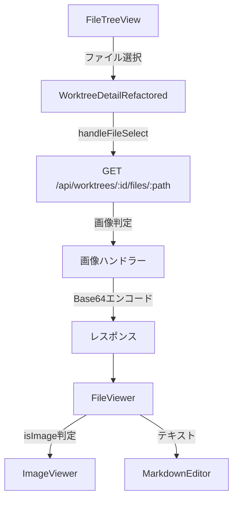

# 設計方針書 - Issue #95 画像ファイルビューワ

## Issue概要

**Issue番号**: #95
**タイトル**: 画像ファイルビューワ
**サイズ**: M（中規模）
**優先度**: Medium
**依存Issue**: #94（ファイルアップロード機能）- アップロードした画像の表示に必要
**ラベル**: feature

## 背景・目的

FileTreeViewで画像ファイルを選択した際に、ビューワ領域で画像を視認可能にする。
Claude Codeと視覚的なコミュニケーションを可能にし、UIの問題議論やデザインレビューを効率化する。

---

## アーキテクチャ設計

### システム構成図



### レイヤー構成

```
src/
├── app/api/worktrees/[id]/files/[...path]/
│   └── route.ts                    # GET API拡張（画像対応）
├── components/worktree/
│   ├── FileViewer.tsx              # ファイル表示（画像/テキスト振り分け）
│   ├── ImageViewer.tsx             # 画像表示コンポーネント（新規）
│   └── WorktreeDetailRefactored.tsx # 選択処理（変更不要）
├── config/
│   └── image-extensions.ts         # 画像拡張子設定・isImageExtension()（新規、Stage 3 SF-001）
└── types/
    └── models.ts                   # FileContent interface移動、FileContentResponse型追加
```

---

## 技術選定

| カテゴリ | 選定技術 | 選定理由 |
|---------|---------|---------|
| 画像エンコード | Base64 data URI | 追加ライブラリ不要、HTMLで直接表示可能 |
| MIMEタイプ検証 | マジックバイト自作 | YAGNI原則、外部依存最小化 |
| 画像表示 | img タグ（unoptimized） | Base64 data URI では next/image の最適化恩恵なし（KISS原則） |
| 設定管理 | TypeScript定数 | 既存パターン踏襲（editable-extensions.ts） |

**画像表示の技術選定補足（KISS原則）**:
- `next/image` は主に外部URL画像の最適化（リサイズ、WebP変換等）に有効
- 既にBase64化された画像では最適化の恩恵が少ない
- `next/image` を使用する場合は `unoptimized={true}` が必須となる
- KISS原則に従い、シンプルな `` タグを基本とする
- 将来的にURL指定での画像表示が必要になった場合は `next/image` への移行を検討

---

## データモデル設計

### FileContent interface（更新）

```typescript
// src/types/models.ts へ移動
// 画像対応フィールドを追加した拡張型
//
// 【重要】success フィールドの取り扱い（MF-001 対応）:
// API レスポンスは wrapper として { success: true, ...data } を返す構造のため、
// FileContent は data 部分のみを表す型として定義し、success は含めない。
// これにより既存 FileViewer.tsx (L18-23) のローカル定義との整合性を確保する。
//
// API レスポンス構造:
//   { success: true, path: "...", content: "...", ... }
//   ↑ wrapper         ↑ FileContent の data 部分
//
export interface FileContent {
  path: string;
  content: string;        // テキスト or Base64 data URI
  extension: string;
  worktreePath: string;
  isImage?: boolean;      // 画像フラグ（新規・オプショナル）
  mimeType?: string;      // MIMEタイプ（新規・オプショナル）
}

// API レスポンス型（success wrapper 付き）
export type FileContentResponse = { success: true } & FileContent;

// 型拡張パターンの明確化:
// - 画像対応フィールド（isImage, mimeType）はオプショナルで追加
// - 既存クライアントとの後方互換性を維持
// - 将来的に必須フィールドが増える場合は以下のパターンを検討:
//   type ImageFileContent = FileContent & { isImage: true; mimeType: string }
```

**重要（DRY原則）**: `src/types/models.ts` に移動後、`FileViewer.tsx` のローカル `FileContent` interface 定義は削除すること。

### FileViewer.tsx での変更

```typescript
// 変更前: ローカル定義
interface FileContent {
  path: string;
  content: string;
  // ...
}

// 変更後: 共通型をインポート
import { FileContent } from '@/types/models';
// ローカルの FileContent interface 定義を削除
```

### 画像拡張子設定

```typescript
// src/config/image-extensions.ts
export const IMAGE_EXTENSIONS: readonly string[] = [
  '.png', '.jpg', '.jpeg', '.gif', '.webp', '.svg'
] as const;

// 命名規則（SF-001 対応）:
// 既存パターン（editable-extensions.ts の maxFileSize）に合わせて
// バイト単位の定数名 `IMAGE_MAX_SIZE_BYTES` に統一。
// バイト単位の方が内部処理で直接使用できるため合理的。
export const IMAGE_MAX_SIZE_BYTES = 5 * 1024 * 1024; // 5MB

// SF-004 対応: ImageExtensionValidator interface の設計意図
// 既存の editable-extensions.ts には ExtensionValidator interface が存在する。
// ImageExtensionValidator は画像固有の属性（magicBytes 等）を持つため、
// 現時点では明確に分離した設計とする。
//
// 将来の検討事項:
// - 共通の基底インターフェースの導入
//   interface BaseExtensionValidator { extension: string; maxFileSize?: number; }
// - テキスト固有・画像固有の拡張インターフェースで継承
export interface ImageExtensionValidator {
  extension: string;
  mimeType: string;
  magicBytes?: number[];
  magicBytesOffset?: number;
}

// 設計トレードオフ（Open-Closed原則）:
// - 新しい画像形式の追加時は配列への直接追加が必要
// - 既存パターン（editable-extensions.ts）との一貫性を優先
// - 将来的に対応形式が大幅に増える場合は Registry パターンへの移行を検討
export const IMAGE_EXTENSION_VALIDATORS: ImageExtensionValidator[] = [
  { extension: '.png', mimeType: 'image/png', magicBytes: [0x89, 0x50, 0x4E, 0x47] },
  { extension: '.jpg', mimeType: 'image/jpeg', magicBytes: [0xFF, 0xD8, 0xFF] },
  { extension: '.jpeg', mimeType: 'image/jpeg', magicBytes: [0xFF, 0xD8, 0xFF] },
  { extension: '.gif', mimeType: 'image/gif', magicBytes: [0x47, 0x49, 0x46, 0x38] },
  { extension: '.webp', mimeType: 'image/webp', magicBytes: [0x52, 0x49, 0x46, 0x46] },
  { extension: '.svg', mimeType: 'image/svg+xml' }, // テキストベース、マジックバイトなし
];
```

---

## API設計

### GET /api/worktrees/:id/files/:path（拡張）

**既存動作**: テキストファイルの内容を返却

**拡張動作**: 画像ファイルの場合、Base64 data URI形式で返却

```typescript
// レスポンス例（画像）
{
  success: true,
  path: "images/screenshot.png",
  content: "data:image/png;base64,iVBORw0KGgoAAAANSUhEUgAA...",
  extension: "png",
  worktreePath: "/path/to/worktree",
  isImage: true,
  mimeType: "image/png"
}
```

**後方互換性**:
- `content: string`フィールドは維持
- `isImage`, `mimeType`はオプショナル
- 既存クライアントは影響なし

---

## セキュリティ設計

### 1. 拡張子ホワイトリスト

```typescript
// SF-003 対応: 拡張子のドット有無を正規化
// API レスポンスの extension フィールドは「png」（ドットなし）
// IMAGE_EXTENSIONS は「.png」（ドット付き）で定義
// 比較時にドットの有無を正規化する処理を追加
export function isImageExtension(ext: string): boolean {
  // ドット有無を正規化
  const normalizedExt = ext.startsWith('.') ? ext.toLowerCase() : '.' + ext.toLowerCase();
  return IMAGE_EXTENSIONS.includes(normalizedExt);
}

// 将来の検討事項（YAGNI - 現時点では不要）:
// isImageExtension() と isEditableExtension() が類似パターン
// 将来的に isVideoExtension() 等が追加される場合、
// 共通の isExtensionInList(ext: string, list: string[]): boolean
// ユーティリティ関数の抽出を検討
```

### 2. ファイルサイズ制限

```typescript
const IMAGE_MAX_SIZE_BYTES = 5 * 1024 * 1024; // 5MB

// Base64エンコード後のサイズ: 約6.7MB（元サイズの約1.33倍）
```

### 3. マジックバイト検証

```typescript
export function validateImageMagicBytes(
  extension: string,
  buffer: Buffer
): boolean {
  // ドット有無を正規化（SF-003 対応）
  const normalizedExt = extension.startsWith('.') ? extension.toLowerCase() : '.' + extension.toLowerCase();
  const validator = IMAGE_EXTENSION_VALIDATORS.find(
    v => v.extension === normalizedExt
  );

  if (!validator?.magicBytes) {
    // SVGはテキストベースのため別処理
    return normalizedExt === '.svg';
  }

  const offset = validator.magicBytesOffset || 0;
  return validator.magicBytes.every(
    (byte, index) => buffer[offset + index] === byte
  );
}
```

### 4. 画像コンテンツ検証関数（SF-002 対応）

```typescript
// SF-002 対応: editable-extensions.ts のパターンに合わせて
// isImageExtension() と validateImageContent() の2つの関数を用意

/**
 * 画像コンテンツの検証結果
 * ContentValidationResult と同等の構造を持つ
 */
export interface ImageValidationResult {
  valid: boolean;
  error?: string;
}

/**
 * 画像コンテンツの検証
 * @param extension 拡張子
 * @param buffer ファイルバッファ
 * @returns 検証結果
 */
export function validateImageContent(
  extension: string,
  buffer: Buffer
): ImageValidationResult {
  // ファイルサイズ検証
  if (buffer.length > IMAGE_MAX_SIZE_BYTES) {
    return { valid: false, error: `File size exceeds ${IMAGE_MAX_SIZE_BYTES / 1024 / 1024}MB limit` };
  }

  // SVGの場合は特別検証
  const normalizedExt = extension.startsWith('.') ? extension.toLowerCase() : '.' + extension.toLowerCase();
  if (normalizedExt === '.svg') {
    const content = buffer.toString('utf-8');
    return validateSvgContent(content);
  }

  // マジックバイト検証
  if (!validateImageMagicBytes(extension, buffer)) {
    return { valid: false, error: 'Invalid image magic bytes' };
  }

  return { valid: true };
}
```

### 5. SVG特別処理（Stage 4 セキュリティレビュー対応）

```typescript
/**
 * SVGコンテンツの検証
 *
 * この関数は2つの目的を持つ（SRP考慮事項）:
 * 1. SVGフォーマット検証: 有効なSVG形式かどうかの確認
 * 2. セキュリティ検証: XSS攻撃ベクトル（scriptタグ、イベントハンドラ等）の検出
 *
 * 将来的にセキュリティルールが大幅に増える場合は、
 * sanitizeSvgContent() として分離することを検討する。
 * 現時点では関数の規模が小さいため、単一関数で管理する。
 *
 * Stage 4 セキュリティレビュー（SEC-MF-001, SEC-MF-002, SEC-MF-003）対応:
 * - イベントハンドラ属性（onload, onclick等）の検出
 * - javascript:/data:/vbscript: スキームの検出
 * - foreignObject要素の検出
 */
export function validateSvgContent(content: string): ImageValidationResult {
  // [フォーマット検証] XMLヘッダまたはSVGタグの存在確認
  if (!content.includes('<svg') && !content.startsWith('<?xml')) {
    return { valid: false, error: 'Invalid SVG format' };
  }

  // [セキュリティ検証 1] スクリプトタグ検出（XSS防止）
  if (/<script[\s>]/i.test(content)) {
    return { valid: false, error: 'SVG contains script tags' };
  }

  // [セキュリティ検証 2] イベントハンドラ属性検出（SEC-MF-001 対応）
  // onload, onclick, onmouseover, onerror, onfocus, onblur, その他on*属性
  // 攻撃例: <svg onload="alert('XSS')"><circle cx="50" cy="50" r="40"/></svg>
  if (/\s+on\w+\s*=/i.test(content)) {
    return { valid: false, error: 'SVG contains event handler attributes' };
  }

  // [セキュリティ検証 3] javascript:/data:/vbscript: スキーム検出（SEC-MF-002 対応）
  // 攻撃例: <svg><a xlink:href="javascript:alert('XSS')"><text>Click</text></a></svg>
  if (/(?:xlink:)?href\s*=\s*["']?\s*(?:javascript|data|vbscript):/i.test(content)) {
    return { valid: false, error: 'SVG contains dangerous URI scheme' };
  }

  // [セキュリティ検証 4] foreignObject要素検出（SEC-MF-003 対応）
  // 攻撃例: <svg><foreignObject><body><script>alert('XSS')</script></body></foreignObject></svg>
  if (/<foreignObject[\s>]/i.test(content)) {
    return { valid: false, error: 'SVG contains foreignObject element' };
  }

  return { valid: true };
}
```

### 6. パストラバーサル防止

既存の`isPathSafe()`関数を活用。

### 7. 追加セキュリティ対策（Stage 4 should_fix 対応）

#### 7.1 Content-Type ヘッダー設定（SEC-SF-001 対応）

```typescript
// ポリグロットファイル対策として、レスポンスヘッダーに設定
// X-Content-Type-Options: nosniff
// これにより、ブラウザがMIMEタイプを推測することを防止
```

#### 7.2 エラーメッセージ抽象化（SEC-SF-002 対応）

```typescript
// 既存の createErrorResult() パターンを使用
// 内部パスや詳細なバッファ情報を含めない
// 例: 'Invalid image magic bytes' （ファイルパス等を含めない）
```

#### 7.3 WebP形式の追加検証（SEC-SF-004 対応）

```typescript
// WebP形式の完全な検証には、オフセット8-11に'WEBP'が存在するか追加検証
// 現在: magicBytes: [0x52, 0x49, 0x46, 0x46] (RIFF)
// 推奨: オフセット8-11に [0x57, 0x45, 0x42, 0x50] (WEBP) も検証
//
// 実装例:
export function validateWebPMagicBytes(buffer: Buffer): boolean {
  // RIFF header check (offset 0-3)
  const riffHeader = [0x52, 0x49, 0x46, 0x46];
  const hasRiff = riffHeader.every((byte, i) => buffer[i] === byte);

  // WEBP signature check (offset 8-11)
  const webpSignature = [0x57, 0x45, 0x42, 0x50];
  const hasWebp = buffer.length >= 12 &&
    webpSignature.every((byte, i) => buffer[8 + i] === byte);

  return hasRiff && hasWebp;
}
```

---

## UIコンポーネント設計

### ImageViewer.tsx

```typescript
interface ImageViewerProps {
  src: string;          // Base64 data URI
  alt: string;          // ファイル名
  mimeType?: string;    // NTH-002: 将来的にエラーハンドリング等で使用予定
  onError?: () => void;
}

// 表示制約
const MAX_WIDTH = '100%';
const MAX_HEIGHT = '500px';

// 実装例（KISS原則に従いシンプルなimgタグを使用）
// NTH-002 検討: mimeType は現時点では未使用だが、将来的にエラーメッセージの
// 詳細化やフォーマット固有の処理分岐で使用する可能性があるため残す
export function ImageViewer({ src, alt, onError }: ImageViewerProps) {
  return (
    
  );
}
```

### 画像表示フロー

1. FileViewer が `isImage: true` を検出
2. ImageViewer コンポーネントをレンダリング
3. Base64 data URI を `` に設定
4. エラー時はプレースホルダー表示

---

## 影響ファイル一覧

### 新規作成

| ファイル | 説明 |
|---------|------|
| `src/config/image-extensions.ts` | 画像拡張子・マジックバイト設定、`isImageExtension()` 関数（**Stage 3 SF-001: editable-extensions.ts パターン踏襲**） |
| `src/components/worktree/ImageViewer.tsx` | 画像表示コンポーネント |
| `tests/unit/config/image-extensions.test.ts` | 拡張子設定テスト（NTH-003: 既存テスト構造に合わせてパス確定） |
| `tests/e2e/image-viewer.spec.ts` | E2Eテスト（**Stage 3 SF-004: FileTreeView -> FileViewer の一連フローをテスト**） |

### 変更

| ファイル | 変更内容 |
|---------|---------|
| `src/app/api/worktrees/[id]/files/[...path]/route.ts` | GET API拡張、既存エラーコード活用（**Stage 3 NTH-003**） |
| `src/components/worktree/FileViewer.tsx` | 画像判定・ImageViewer呼び出し、**ローカル FileContent interface 削除**、`import { FileContent } from '@/types/models'` に変更 |
| `src/types/models.ts` | `FileContent` interface移動・拡張（success フィールドなし）、`FileContentResponse` 型追加 |

### 影響確認が必要なテスト（Stage 3 追加）

| ファイル | 確認事項 |
|---------|---------|
| `tests/integration/api-file-operations.test.ts` | GET API レスポンス構造の検証有無、オプショナルフィールド追加による影響 |
| `tests/unit/config/editable-extensions.test.ts` | パターン参考のみ（変更不要） |

---

## 実装タスク

### 事前確認（Stage 3 追加）

1. `tests/integration/api-file-operations.test.ts` の内容を確認
2. 他に FileContent 型を参照しているコードがないか Grep で確認

### Phase 1: 型定義・設定

1. `src/config/image-extensions.ts` 作成（`isImageExtension()` 関数を含む - **Stage 3 SF-001**）
2. `src/types/models.ts` に `FileContent` interface 移動（**success フィールドを含めない - MF-001**）
3. `src/types/models.ts` に `FileContentResponse` 型追加（**Stage 2 MF-001**）
4. `src/components/worktree/FileViewer.tsx` のローカル `FileContent` interface を削除し、`@/types/models` からインポート

### Phase 2: API拡張

1. `route.ts` の GET ハンドラー拡張
2. マジックバイト検証実装（**ドット正規化処理を含む - Stage 2 SF-003**）
3. SVG検証実装（フォーマット検証 + セキュリティ検証、**Stage 4 SEC-MF-001/002/003 対応**）
4. validateImageContent() 関数実装（**Stage 2 SF-002**）
5. 既存エラーコード（INVALID_MAGIC_BYTES, FILE_TOO_LARGE）を活用（**Stage 3 NTH-003**）

### Phase 3: UIコンポーネント

1. `ImageViewer.tsx` 作成（シンプルな img タグ使用）
2. `FileViewer.tsx` 更新（isImage 判定に基づく条件分岐）
3. handleFileSelect のコメントに画像ファイル取り扱いフローを明記（**Stage 3 SF-004**）

### Phase 4: テスト

1. 単体テスト作成（**テストファイルパスは既存構造に合わせる - NTH-003**）
2. E2Eテスト作成（FileTreeView -> FileViewer の一連フローをテスト - **Stage 3 SF-004**）
3. **SVG XSS攻撃パターンのテストケース追加（Stage 4 対応）**:
   - イベントハンドラ属性を含むSVG（onload, onclick等）
   - javascript: スキームを含むSVG
   - foreignObject要素を含むSVG

---

## 設計上の決定事項

### 採用した設計

| 決定事項 | 理由 | トレードオフ |
|---------|------|-------------|
| Base64 data URI | 追加エンドポイント不要 | メモリ使用量増加（約1.33倍） |
| マジックバイト自作 | 外部依存最小化 | 対応形式限定、**新形式追加は配列への手動追加が必要** |
| 5MB制限 | メモリ使用量考慮 | 大きな画像は表示不可 |
| SVGスクリプト拒否 | XSS防止 | 動的SVGは表示不可 |
| img タグ（next/image不使用） | KISS原則、Base64では最適化恩恵なし | 外部URL画像の最適化は将来検討 |
| FileContent に success を含めない | API wrapper 構造との整合性（MF-001） | 型定義の変更が必要 |
| SVGイベントハンドラ拒否 | XSS防止（Stage 4 SEC-MF-001） | on*属性を含む正当なSVGも拒否 |
| SVG危険スキーム拒否 | XSS防止（Stage 4 SEC-MF-002） | javascript:等を含む正当なSVGも拒否 |
| SVG foreignObject拒否 | XSS防止（Stage 4 SEC-MF-003） | foreignObjectを使用した複雑なSVGも拒否 |

### 代替案

| 代替案 | メリット | デメリット | 却下理由 |
|-------|---------|----------|---------|
| 別エンドポイント `/api/.../image` | 責務分離 | 重複コード | 既存APIで対応可能 |
| file-type ライブラリ | 多形式対応 | 外部依存追加 | YAGNI原則 |
| ストリーミング配信 | メモリ効率 | 実装複雑 | 現時点では不要 |
| Registry パターン（画像形式） | 拡張性向上 | 実装複雑 | 既存パターンとの一貫性優先 |
| DOMPurify等のSVGサニタイズライブラリ | 包括的なXSS対策 | 外部依存追加 | YAGNI原則（Stage 4 NTH-002）、将来検討 |

### 将来の検討事項

以下の事項は現時点では対応不要だが、将来の拡張時に検討が必要（nice_to_have）:

| ID | 事項 | 検討理由 | 追加元 |
|----|------|---------|--------|
| NTH-001 | FileContent の配置場所 | models.ts は主に DB モデルを定義。API レスポンス型は `src/types/api.ts` への配置も検討 | Stage 1 |
| NTH-002 | ImageViewerProps の mimeType 使用 | 現時点では未使用。YAGNI原則に従い、必要になった時点で実装を追加 | Stage 1 |
| NTH-003 | テストファイルパス | 既存テスト構造（tests/unit/ または src/**/__tests__/）を確認して統一 | Stage 1 |
| NTH-004 | FileViewerFactory パターン | 動画やPDFなど他のファイルタイプ追加時に FileViewer の肥大化を防ぐため Strategy パターンへの移行を検討 | Stage 3 |
| NTH-005 | 画像拡張子の共通定数化 | uploadable-extensions.ts と image-extensions.ts で画像拡張子リストが重複。将来的に共通定数化を検討 | Stage 3 |
| NTH-006 | CSPヘッダーの追加 | Content-Security-Policy ヘッダーで XSS 攻撃を緩和 | Stage 4 SEC-NTH-001 |
| NTH-007 | SVGサニタイゼーションライブラリ | DOMPurify等の成熟したライブラリ採用でSVG XSS対策を強化 | Stage 4 SEC-NTH-002 |
| NTH-008 | セキュリティイベントのログ記録 | マジックバイト検証失敗やSVGスクリプト検出時にログ記録して攻撃検知に活用 | Stage 4 SEC-NTH-003 |
| NTH-009 | アップロード機能との二重防御 | Issue #94との連携時、アップロード時とビューワー表示時の両方でセキュリティチェック | Stage 4 SEC-NTH-004 |

---

## 受け入れ条件

1. PNG, JPG, GIF, WEBP, SVG形式の画像ファイルがFileTreeViewで選択可能
2. 選択した画像ファイルがビューワ領域に表示される
3. 画像は最大幅100%、最大高さ500pxで表示される
4. 5MB以上の画像ファイルはエラーメッセージを表示
5. 対応外のファイル形式は従来通りの動作
6. 単体テストが追加されている
7. E2Eテストが追加されている
8. **SVG XSS攻撃（イベントハンドラ、javascript:スキーム、foreignObject）が防止されている**（Stage 4追加）

---

## レビュー指摘対応

### Stage 1: 通常レビュー（設計原則）

**レビュー日**: 2026-01-30
**レビュアー**: architecture-review-agent

#### 対応済み should_fix 項目

| ID | カテゴリ | 指摘内容 | 対応内容 |
|----|---------|---------|---------|
| SF-001 | DRY | FileContent interface が2箇所で定義される可能性 | 「影響ファイル一覧」「実装タスク Phase 1」に FileViewer.tsx のローカル interface 削除を明記。「データモデル設計」セクションに変更前後のコード例を追加。 |
| SF-002 | SRP | validateSvgContent() が2つの責務を持つ | 「セキュリティ設計」セクションの validateSvgContent() に JSDoc コメントで「フォーマット検証」と「セキュリティ検証」の2つの目的を明記。将来的な分離可能性についても言及。 |
| SF-003 | Open-Closed | IMAGE_EXTENSION_VALIDATORS の拡張性 | 「データモデル設計」セクションと「採用した設計」トレードオフに「新形式追加は配列への手動追加が必要」と明記。Registry パターン移行の検討を代替案に追加。 |

#### 対応済み nice_to_have 項目

| ID | カテゴリ | 指摘内容 | 対応内容 |
|----|---------|---------|---------|
| NTH-001 | KISS | next/image vs img タグの選定 | 「技術選定」セクションを更新し、img タグ（unoptimized）を選定。Base64 data URI では next/image の恩恵が少ない理由を明記。「UIコンポーネント設計」に実装例追加。 |
| NTH-002 | DRY | isExtensionInList() ユーティリティ | 「セキュリティ設計」セクションの isImageExtension() にコメントで将来検討メモを追加（YAGNI原則により現時点では不要）。 |
| NTH-003 | Documentation | FileContent 型拡張パターン | 「データモデル設計」セクションに型拡張パターンの明確化コメントを追加。将来的な ImageFileContent extends FileContent パターンについても言及。 |

#### レビュー総評

設計原則観点では大きな問題はなく、既存コードパターン（editable-extensions.ts、file-operations.ts）との一貫性も保たれている。

**評価された点**:
- YAGNI: file-type ライブラリではなく自作のマジックバイト検証を採用し、外部依存を最小化
- KISS: 別エンドポイント作成ではなく既存 API の拡張を選択
- 後方互換性: 新規フィールドをオプショナルにして既存クライアントへの影響を最小化
- 既存パターン踏襲: editable-extensions.ts と同様の設定ファイル構造

---

### Stage 2: 整合性レビュー

**レビュー日**: 2026-01-30
**レビュアー**: architecture-review-agent

#### 対応済み must_fix 項目

| ID | カテゴリ | 指摘内容 | 対応内容 |
|----|---------|---------|---------|
| MF-001 | 型定義整合性 | FileContent interface の success フィールドの不整合。既存 FileViewer.tsx (L18-23) のローカル定義には success がない。 | 「データモデル設計」セクションで FileContent から success を削除。API レスポンスは wrapper として `{ success: true, ...data }` を返す構造であることを明記。FileContentResponse 型を新規追加して wrapper 型を明示。 |

#### 対応済み should_fix 項目

| ID | カテゴリ | 指摘内容 | 対応内容 |
|----|---------|---------|---------|
| SF-001 | 命名規則整合性 | IMAGE_MAX_SIZE_BYTES vs IMAGE_MAX_SIZE_MB の命名不一致 | 「データモデル設計」セクションのコメントで `IMAGE_MAX_SIZE_BYTES` に統一することを明記。既存パターン（editable-extensions.ts の maxFileSize）との整合性を説明。 |
| SF-002 | 関数シグネチャ整合性 | isImageExtension() の戻り値型が不明確。editable-extensions.ts には isEditableExtension() と validateContent() の2パターンがある。 | 「セキュリティ設計」セクションに `validateImageContent()` 関数と `ImageValidationResult` 型を追加。isImageExtension() と validateImageContent() の2関数構成に更新。 |
| SF-003 | API レスポンス整合性 | extension フィールドの形式不一致（ドット有無） | 「セキュリティ設計」セクションの isImageExtension() と validateImageMagicBytes() にドット正規化処理を追加。 |
| SF-004 | 既存コードパターン整合性 | ImageExtensionValidator と ExtensionValidator の重複 | 「データモデル設計」セクションに設計意図を明記。将来の共通基底インターフェース検討をコメントで追加。 |

#### 対応済み nice_to_have 項目

| ID | カテゴリ | 指摘内容 | 対応内容 |
|----|---------|---------|---------|
| NTH-001 | 型定義の配置 | FileContent を models.ts に移動することの影響。models.ts は主に DB モデルを定義。 | 「将来の検討事項」セクションに追加。src/types/api.ts への配置も検討対象として記載。 |
| NTH-002 | コード参照整合性 | ImageViewer props の mimeType が未使用 | 「UIコンポーネント設計」セクションにコメントで将来使用予定を明記。「将来の検討事項」にも追加。 |
| NTH-003 | テストファイル整合性 | 単体テストファイルパスの不一致可能性 | 「将来の検討事項」に追加。「影響ファイル一覧」「実装タスク Phase 4」に既存構造確認の注記を追加。 |

#### 整合性チェックリスト結果

| チェック項目 | 状態 | 備考 |
|-------------|------|------|
| Issue vs 設計方針書 | mostly_consistent | IMAGE_MAX_SIZE の命名を統一済み |
| 設計方針書 vs 既存コード | needs_clarification -> resolved | FileContent の success フィールドを修正済み |
| 型定義 | needs_fix -> resolved | FileContent 定義を既存コードと整合。ImageExtensionValidator の設計意図を明記 |
| 関数シグネチャ | mostly_consistent -> consistent | validateImageContent() を追加 |
| 命名規則 | consistent | 既存パターンを踏襲 |

#### レビュー総評

設計方針書は既存コードパターンとの整合性が概ね保たれているが、FileContent interface の success フィールドの取り扱いに重要な不整合があった（MF-001）。
Stage 2 レビューで指摘された型定義の整合性、命名規則の統一、検証関数の追加などを反映し、実装前の確認事項を解消した。
全体として Stage 1 レビューの指摘が適切に反映されており、既存の editable-extensions.ts, file-operations.ts のパターンを踏襲した設計になっている。

---

### Stage 3: 影響分析レビュー

**レビュー日**: 2026-01-30
**レビュアー**: architecture-review-agent

#### 対応済み must_fix 項目

| ID | カテゴリ | 指摘内容 | 対応内容 |
|----|---------|---------|---------|
| MF-001 | API後方互換性 | GET APIレスポンスの拡張による既存クライアントへの影響。FileViewer.tsx の FileContent interface を models.ts に移動する際、既存の型定義との整合性確認が必要。 | Stage 2 で既に対応済み。FileContent から success フィールドを削除し、FileContentResponse 型を追加。実装時に以下を確認すること: (1) FileViewer.tsx のローカル FileContent (L18-23) と models.ts の整合性、(2) 他に FileContent 型を参照しているコードがないか Grep で確認。 |

#### 対応済み should_fix 項目

| ID | カテゴリ | 指摘内容 | 対応内容 |
|----|---------|---------|---------|
| SF-001 | ファイル構成の波及効果 | file-operations.ts への isImageFile() 追加による責務の問題。isImageExtension() を image-extensions.ts に配置する方が editable-extensions.ts との一貫性が保てる。 | 設計変更: `isImageFile()` は `src/lib/file-operations.ts` ではなく `src/config/image-extensions.ts` に `isImageExtension()` として配置。これにより editable-extensions.ts の isEditableExtension() と同様のパターンを踏襲。実装タスク Phase 1 を更新。 |
| SF-002 | テスト影響範囲 | 既存 API テストへの影響確認が必要。tests/integration/api-file-operations.test.ts に GET API のテストがある場合、新しいレスポンスフィールド（isImage, mimeType）により修正が必要になる可能性。 | 実装前チェック項目として追加: (1) tests/integration/api-file-operations.test.ts の内容を確認、(2) GET API のレスポンス構造を検証しているテストがあるか確認、(3) オプショナルフィールド追加によりテストが破綻しないか検証。 |
| SF-003 | コンポーネント依存関係 | FileViewer から ImageViewer への条件分岐追加により、FileViewer の責務が「ファイル内容表示」から「ファイルタイプ判定 + 適切なビューワー選択」に拡大。将来的な肥大化懸念。 | 現時点では FileViewer に条件分岐を追加する設計で問題なし。ただし、将来的に動画やPDFなど他のファイルタイプが追加される場合は FileViewerFactory パターンまたは Strategy パターンへの移行を検討。「将来の検討事項」セクションに追加。 |
| SF-004 | WorktreeDetailRefactored への影響 | handleFileSelect の分岐ロジック拡張が必要。IMAGE_EXTENSIONS との関係を明示的に文書化すべき。 | handleFileSelect は EDITABLE_EXTENSIONS に基づいて振り分けるため、画像ファイルは自動的に FileViewer に振り分けられる（編集不可のため）。この動作フローをコメントで明記することを実装タスクに追加。E2E テストで FileTreeView -> FileViewer の一連のフローをテストすること。 |

#### 対応済み nice_to_have 項目

| ID | カテゴリ | 指摘内容 | 対応内容 |
|----|---------|---------|---------|
| NTH-001 | 将来の拡張性 | uploadable-extensions.ts との設計パターン統一。image-extensions.ts と uploadable-extensions.ts で画像拡張子リストが重複する可能性。 | 現時点では YAGNI 原則に従い別ファイルで管理。将来的に画像形式が追加される際は共通定数化（IMAGE_EXTENSIONS を一箇所で定義）を検討。「将来の検討事項」セクションに追加。 |
| NTH-002 | テスト構造の一貫性 | テストファイル配置の既存パターン踏襲。tests/unit/config/ ディレクトリには既存テストが存在。 | 既存パターン（tests/unit/config/editable-extensions.test.ts）を踏襲した配置で問題なし。Stage 1 の NTH-003 と同様の確認。 |
| NTH-003 | エラーハンドリングの統一 | 画像読み込みエラー時の route.ts エラーコード追加。INVALID_MAGIC_BYTES, FILE_TOO_LARGE は Issue #94 で追加済み。 | 既存の INVALID_MAGIC_BYTES, FILE_TOO_LARGE エラーコードを GET ハンドラーでも活用すること。追加のエラーコード定義は不要。 |

#### 影響分析サマリー

**新規ファイル**:
- `src/config/image-extensions.ts`
- `src/components/worktree/ImageViewer.tsx`
- `tests/unit/config/image-extensions.test.ts`
- `tests/e2e/image-viewer.spec.ts`

**変更ファイル**:
- `src/app/api/worktrees/[id]/files/[...path]/route.ts`
- `src/components/worktree/FileViewer.tsx`
- `src/types/models.ts`

**影響を受ける可能性のあるテスト**:
- `tests/integration/api-file-operations.test.ts` - 事前確認必要
- `tests/unit/config/editable-extensions.test.ts` - パターン参考のみ

**影響なしと確認されたファイル**:
- `src/components/worktree/WorktreeDetailRefactored.tsx` - handleFileSelect の変更不要

**後方互換性**: 維持される
- API: isImage, mimeType はオプショナルフィールドとして追加
- 型: FileContent interface の models.ts への移動は DRY 原則に基づくリファクタリング
- 破壊的変更: なし

**依存関係の変更**:
- FileViewer.tsx -> ImageViewer.tsx (新規依存)
- FileViewer.tsx -> types/models.ts (ローカル定義から共通型へ変更)
- route.ts -> config/image-extensions.ts (新規依存)

#### レビュー総評

影響分析レビューの結果、Issue #95 画像ファイルビューワの設計方針書は影響範囲が適切に限定されており、後方互換性も維持されている。

主な変更点:
1. GET API の拡張（オプショナルフィールド追加）
2. FileViewer への条件分岐追加
3. models.ts への FileContent interface 移動

既存コードパターン（editable-extensions.ts、file-operations.ts）との一貫性が保たれており、影響範囲は最小限に抑えられている。

---

### Stage 4: セキュリティレビュー

**レビュー日**: 2026-01-30
**レビュアー**: architecture-review-agent
**セキュリティスコア**: 7/10 -> 9/10（対応後）

#### 対応済み must_fix 項目

| ID | カテゴリ | 深刻度 | 指摘内容 | 対応内容 |
|----|---------|--------|---------|---------|
| SEC-MF-001 | SVG XSS Attack Vector | high | SVG検証が不十分 - イベントハンドラ（onload, onclick等）によるXSS攻撃の可能性。攻撃例: `<svg onload="alert('XSS')">` | validateSvgContent() に `/\s+on\w+\s*=/i` 正規表現によるイベントハンドラ属性検出を追加。検出時は 'SVG contains event handler attributes' エラーを返す。 |
| SEC-MF-002 | SVG XSS Attack Vector | high | SVG内のhref属性によるJavaScript実行。攻撃例: `<a xlink:href="javascript:alert('XSS')">` | validateSvgContent() に `/(?:xlink:)?href\s*=\s*["']?\s*(?:javascript\|data\|vbscript):/i` 正規表現による危険スキーム検出を追加。検出時は 'SVG contains dangerous URI scheme' エラーを返す。 |
| SEC-MF-003 | SVG XSS Attack Vector | medium | SVG内のforeignObject要素によるHTML挿入。攻撃例: `<svg><foreignObject><body><script>alert('XSS')</script></body></foreignObject></svg>` | validateSvgContent() に `/<foreignObject[\s>]/i` 正規表現によるforeignObject要素検出を追加。検出時は 'SVG contains foreignObject element' エラーを返す。 |

#### 対応済み should_fix 項目

| ID | カテゴリ | 深刻度 | 指摘内容 | 対応内容 |
|----|---------|--------|---------|---------|
| SEC-SF-001 | Magic Bytes Validation Bypass | medium | ポリグロットファイル対策。X-Content-Type-Options: nosniff ヘッダー推奨。 | 「セキュリティ設計」セクション 7.1 に Content-Type ヘッダー設定の設計を追加。実装時にレスポンスヘッダーに nosniff を設定すること。 |
| SEC-SF-002 | Error Information Disclosure | low | エラーメッセージからの情報漏洩防止。内部パスや詳細なバッファ情報を含めない。 | 「セキュリティ設計」セクション 7.2 にエラーメッセージ抽象化の方針を追加。既存の createErrorResult() パターンを使用することを明記。 |
| SEC-SF-003 | Denial of Service | medium | Base64エンコード時のメモリ使用量。大量同時リクエストでメモリ枯渇の可能性。 | 現時点では 5MB 制限で対応。将来的にレート制限や同時処理数制限の導入を検討。「将来の検討事項」に追加検討。 |
| SEC-SF-004 | Image Processing Security | low | WebP形式のマジックバイト検証が不完全。RIFFヘッダーだけでなくWEBPシグネチャも検証推奨。 | 「セキュリティ設計」セクション 7.3 に WebP 追加検証の実装例を追加。validateWebPMagicBytes() 関数の設計を明記。 |

#### nice_to_have として記録した項目

| ID | カテゴリ | 指摘内容 | 対応方針 |
|----|---------|---------|---------|
| SEC-NTH-001 | Defense in Depth | CSPヘッダーの追加。Content-Security-Policy でXSS攻撃を緩和。 | 「将来の検討事項」NTH-006 として追加。実装優先度は低いが、将来的に検討。 |
| SEC-NTH-002 | Input Validation | SVGサニタイゼーションライブラリ（DOMPurify等）の採用検討。 | 「将来の検討事項」NTH-007 として追加。YAGNI原則により現時点では不要。SVG対応拡張時に検討。 |
| SEC-NTH-003 | Logging and Monitoring | セキュリティイベントのログ記録。攻撃検知に活用。 | 「将来の検討事項」NTH-008 として追加。セキュリティ関連エラー発生時のログ記録を検討。 |
| SEC-NTH-004 | Future Consideration | アップロード機能（Issue #94）との二重防御。 | 「将来の検討事項」NTH-009 として追加。アップロード時とビューワー表示時の両方でセキュリティチェック。 |

#### OWASP Top 10 カバレッジ

| カテゴリ | 状態 | 詳細 |
|---------|------|------|
| A01: Broken Access Control | covered | isPathSafe() によるパストラバーサル防止が実装済み |
| A02: Cryptographic Failures | not_applicable | 画像表示機能では暗号化要件なし |
| A03: Injection | partial -> covered | SVG XSS対策を強化。イベントハンドラ、href属性、foreignObject 対応追加 |
| A04: Insecure Design | covered | 拡張子ホワイトリスト、ファイルサイズ制限、マジックバイト検証が設計済み |
| A05: Security Misconfiguration | partial | CSPヘッダーの設定は将来検討（NTH-006） |
| A06: Vulnerable Components | covered | 外部ライブラリ依存を最小化（YAGNI原則） |
| A07: Auth Failures | not_applicable | 既存の認証機構に依存 |
| A08: Data Integrity Failures | covered | マジックバイト検証によるファイル形式の整合性確認 |
| A09: Logging Failures | partial | セキュリティイベントのログ記録は将来検討（NTH-008） |
| A10: SSRF | not_applicable | 外部URL取得機能なし |

#### セキュリティチェックリスト

| チェック項目 | 状態 | 詳細 |
|-------------|------|------|
| パストラバーサル防止 | pass | 既存の isPathSafe() 関数を活用 |
| 拡張子ホワイトリスト | pass | IMAGE_EXTENSIONS でホワイトリスト管理 |
| ファイルサイズ制限 | pass | 5MB 制限で DoS 対策 |
| マジックバイト検証 | pass | 基本検証実装済み、WebP 追加検証は推奨として設計追加 |
| SVG XSS防止 | fail -> pass | scriptタグ、イベントハンドラ、href属性、foreignObject 対応追加 |
| エラーメッセージサニタイズ | pass | 既存パターン（createErrorResult）を踏襲 |
| Base64エンコード安全性 | pass | data URI での表示は直接的なセキュリティリスクなし |

#### レビュー総評

Stage 4 セキュリティレビューにより、SVG形式のXSS対策が大幅に強化された。

**主な対応内容**:
1. イベントハンドラ属性（onload, onclick等）の検出・拒否（SEC-MF-001）
2. javascript:/data:/vbscript: スキームの検出・拒否（SEC-MF-002）
3. foreignObject要素の検出・拒否（SEC-MF-003）

**セキュリティスコア改善**: 7/10 -> 9/10
- A03: Injection のカバレッジが partial から covered に向上
- SVG XSS防止のチェックリストが fail から pass に改善

基本的なセキュリティ対策（パストラバーサル防止、拡張子ホワイトリスト、ファイルサイズ制限、マジックバイト検証）に加え、SVG固有のXSS攻撃ベクトルへの対策が追加され、堅牢な設計となった。

---

## 実装チェックリスト

### 実装前確認事項（Stage 3 追加）
- [ ] `tests/integration/api-file-operations.test.ts` の内容を確認（GET API のレスポンス構造を検証しているか）
- [ ] オプショナルフィールド（isImage, mimeType）追加によりテストが破綻しないか確認
- [ ] 他に FileContent 型を参照しているコードがないか Grep で確認

### Phase 1: 型定義・設定
- [ ] `src/config/image-extensions.ts` 作成（コメントにトレードオフ明記、SF-004 対応）
- [ ] `src/config/image-extensions.ts` に `isImageExtension()` 関数追加（**Stage 3 SF-001: file-operations.ts ではなく image-extensions.ts に配置**）
- [ ] `src/types/models.ts` に `FileContent` interface 移動（**success フィールドを含めない - MF-001**、型拡張パターンコメント追加）
- [ ] `src/types/models.ts` に `FileContentResponse` 型追加（success wrapper 型 - MF-001）
- [ ] `src/components/worktree/FileViewer.tsx` のローカル `FileContent` interface 削除
- [ ] `src/components/worktree/FileViewer.tsx` に `import { FileContent } from '@/types/models'` 追加

### Phase 2: API拡張
- [ ] `route.ts` の GET ハンドラー拡張
- [ ] マジックバイト検証実装（**ドット正規化処理を含む - SF-003**）
- [ ] WebP形式の追加検証実装（**オフセット8-11に'WEBP'シグネチャ検証 - Stage 4 SEC-SF-004**）
- [ ] SVG検証実装（JSDoc に責務を明記）
- [ ] **SVG イベントハンドラ属性検出（Stage 4 SEC-MF-001）**
- [ ] **SVG 危険スキーム検出（Stage 4 SEC-MF-002）**
- [ ] **SVG foreignObject要素検出（Stage 4 SEC-MF-003）**
- [ ] `validateImageContent()` 関数実装（**Stage 2 SF-002**）
- [ ] `ImageValidationResult` 型定義（**Stage 2 SF-002**）
- [ ] 既存エラーコード（INVALID_MAGIC_BYTES, FILE_TOO_LARGE）を GET ハンドラーでも活用（**Stage 3 NTH-003**）
- [ ] **エラーメッセージの抽象化確認（Stage 4 SEC-SF-002）**

### Phase 3: UIコンポーネント
- [ ] `ImageViewer.tsx` 作成（シンプルな img タグ使用、mimeType は将来用に props に残す - NTH-002）
- [ ] `FileViewer.tsx` 更新（isImage 判定に基づく条件分岐追加）
- [ ] handleFileSelect の画像ファイル取り扱いフローをコメントで明記（**Stage 3 SF-004**）

### Phase 4: テスト
- [ ] 単体テスト作成（**テストファイルパスは既存構造を確認して決定 - NTH-003**）
- [ ] E2Eテスト作成（FileTreeView から画像ファイル選択 -> FileViewer で画像表示の一連のフローをテスト - **Stage 3 SF-004**）
- [ ] **SVG XSS攻撃パターンの単体テスト追加（Stage 4 対応）**:
  - [ ] イベントハンドラ属性（onload, onclick, onmouseover等）を含むSVGが拒否されること
  - [ ] javascript: スキームを含むSVGが拒否されること
  - [ ] data: スキームを含むSVGが拒否されること
  - [ ] vbscript: スキームを含むSVGが拒否されること
  - [ ] foreignObject要素を含むSVGが拒否されること
  - [ ] 正常なSVGが受け入れられること

---

## 関連ドキュメント

- Issue: https://github.com/Kewton/CommandMate/issues/95
- 依存Issue #94: https://github.com/Kewton/CommandMate/issues/94
- 参考設計: `dev-reports/design/issue-49-markdown-editor-design-policy.md`
- OWASP SVG Security: https://owasp.org/www-community/vulnerabilities/SVG_XSS

---

*作成日: 2026-01-30*
*Stage 1 レビュー反映: 2026-01-30*
*Stage 2 レビュー反映: 2026-01-30*
*Stage 3 レビュー反映: 2026-01-30*
*Stage 4 レビュー反映: 2026-01-30*
