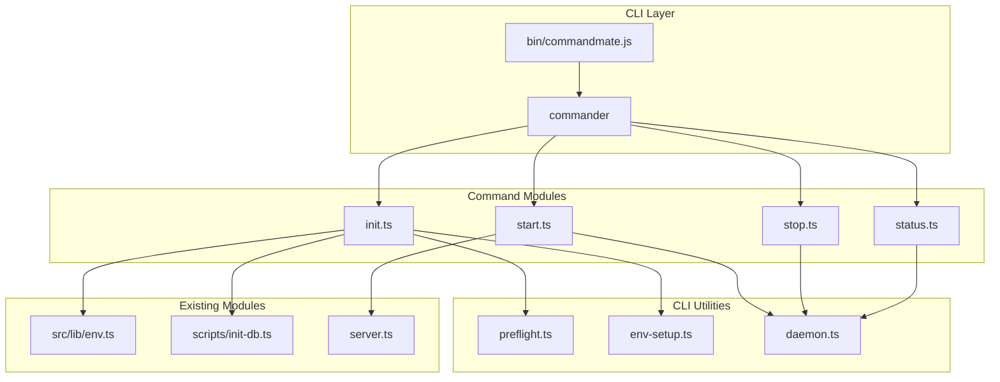
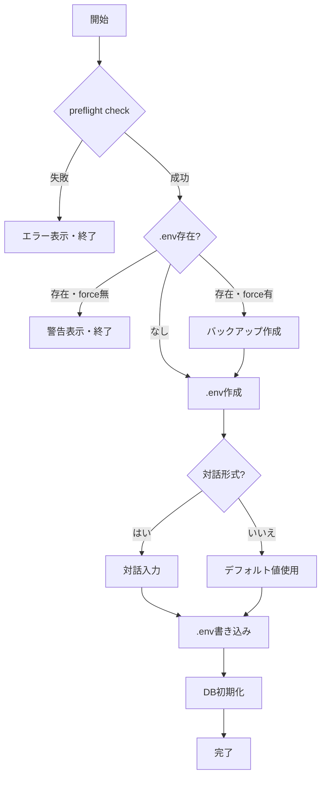
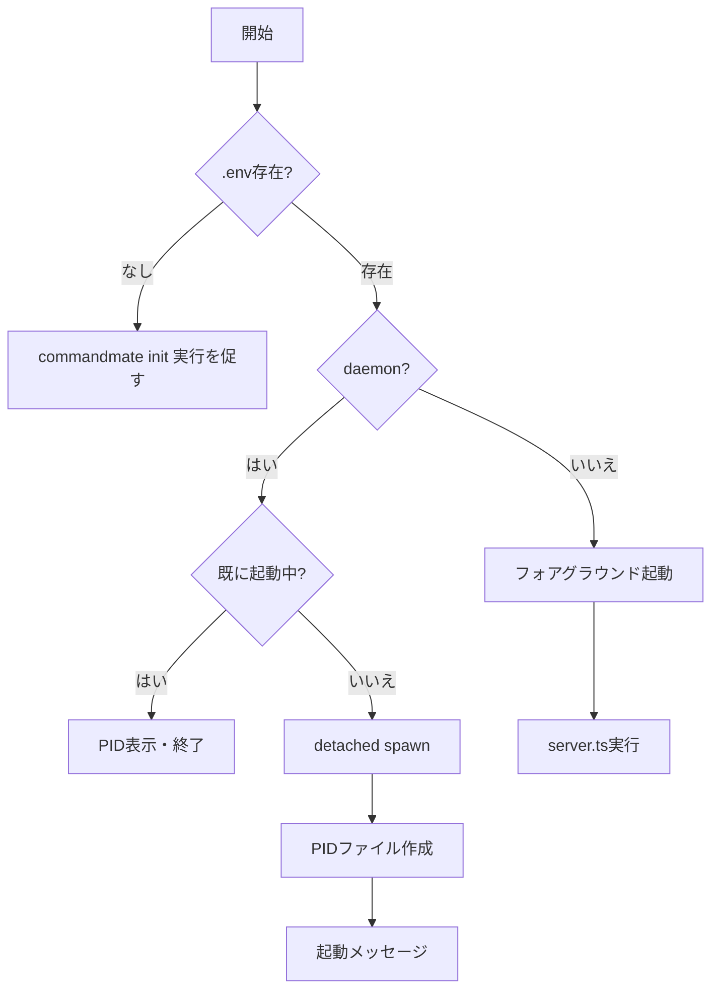
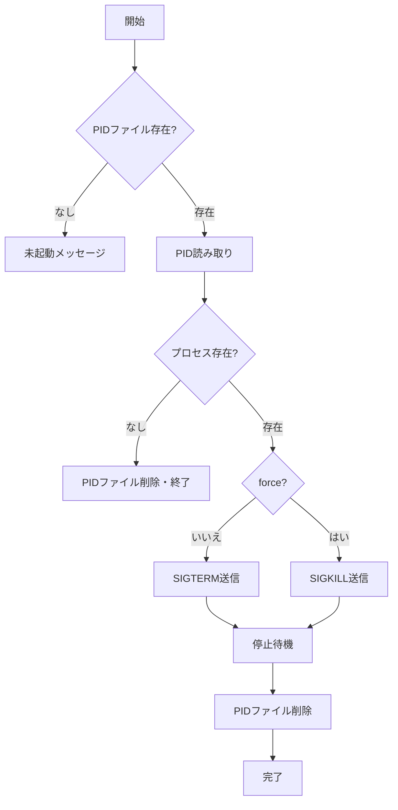

# Issue #96: npm installからセットアップ可能にする - 設計方針書

## 1. 概要

### 1.1 目的
CommandMateを`npm install -g commandmate`でグローバルインストールし、CLIコマンドでセットアップから起動までを完結できるようにする。

### 1.2 スコープ
- CLIエントリポイントの作成
- サブコマンド（init, start, stop, status）の実装
- 既存シェルスクリプトのTypeScript移植
- npm publishの準備

### 1.3 対象外
- Windows対応（別Issue #97）
- Docker対応（別Issue）
- PM2連携の自動化
- logsコマンド（将来拡張として検討）
- restartコマンド（将来拡張として検討）
- health-checkコマンド（将来拡張として検討）

> **Note**: 既存シェルスクリプト（logs.sh, restart.sh）に対応するCLIコマンドは本スコープ外とし、将来のIssueで対応する。（NTH-3対応）

---

## 2. アーキテクチャ設計

### 2.1 システム構成図



### 2.2 ディレクトリ構成

```
bin/
└── commandmate.js          # CLIエントリポイント（shebang付き）

src/cli/
├── index.ts                # CLIメインロジック（commander設定）
├── commands/
│   ├── init.ts             # initコマンド
│   ├── start.ts            # startコマンド
│   ├── stop.ts             # stopコマンド
│   └── status.ts           # statusコマンド
├── utils/
│   ├── preflight.ts        # 依存関係チェック
│   ├── env-setup.ts        # 環境設定
│   ├── daemon.ts           # デーモン管理（プロセス起動・停止）
│   ├── pid-manager.ts      # PIDファイル管理（SF-1対応: SRP）
│   └── logger.ts           # CLIロガー（色付き出力）
├── config/
│   └── cli-dependencies.ts # 依存関係定義（SF-2対応: OCP）
├── interfaces/             # 抽象化インターフェース（SF-3対応: DIP）
│   ├── preflight-checker.ts   # IPreflightChecker
│   ├── env-setup.ts           # IEnvSetup
│   └── daemon-manager.ts      # IDaemonManager
└── types/
    └── index.ts            # CLI共通型定義（ExitCode enum含む）
```

> **設計原則対応**:
> - SF-1: daemon.tsからPIDファイル管理をpid-manager.tsに分離（SRP）
> - SF-3: interfacesディレクトリでコマンド層が依存する抽象を定義（DIP）
> - NTH-4: types/index.tsに終了コードをenumとして定義

### 2.3 レイヤー構成

| レイヤー | 責務 | ファイル |
|---------|------|----------|
| エントリポイント | Node.js実行環境設定、CLI起動 | `bin/commandmate.js` |
| コマンド層 | ユーザーコマンド解析、バリデーション | `src/cli/commands/*.ts` |
| ユーティリティ層 | 共通機能（依存チェック、プロセス管理） | `src/cli/utils/*.ts` |
| ビジネスロジック層 | 既存機能の再利用 | `src/lib/*.ts` |

---

## 3. 技術選定

### 3.1 CLIフレームワーク

| 候補 | 特徴 | 評価 |
|------|------|------|
| **commander** | Node.js標準、軽量、TypeScript対応 | 採用 |
| yargs | 豊富な機能、対話モード | 過剰 |
| oclif | プラグインシステム | 学習コスト高 |
| meow | 最小限API | サブコマンド弱 |

**選定理由**:
- npm CLIの事実上の標準
- 依存関係が少なく軽量
- サブコマンド・ヘルプ自動生成
- TypeScript型定義完備

### 3.2 プロセス管理

| 方式 | 用途 | 実装 |
|------|------|------|
| フォアグラウンド | デフォルト起動 | `spawn` (inherit stdio) |
| バックグラウンド | `--daemon`オプション | `spawn` (detached: true) |
| PIDファイル | プロセス追跡 | `.commandmate.pid` |

### 3.3 依存関係

```json
{
  "dependencies": {
    "commander": "^12.0.0"
  },
  "devDependencies": {
    "@types/commander": "^2.12.0"
  }
}
```

---

## 4. 詳細設計

### 4.1 CLIエントリポイント

**ファイル**: `bin/commandmate.js`

```javascript
#!/usr/bin/env node
require('../dist/cli/index.js');
```

**設計ポイント**:
- shebang (`#!/usr/bin/env node`) でNode.js実行を指定
- ビルド済みファイル (`dist/`) を参照
- package.json の `bin` フィールドで登録

### 4.2 コマンド設計

#### 4.2.1 init コマンド

**責務**: 初期セットアップ

```typescript
interface InitOptions {
  defaults?: boolean;  // 対話形式をスキップ
  force?: boolean;     // 既存設定を上書き
}
```

**処理フロー**:


**移植元**: `scripts/setup.sh`, `scripts/preflight-check.sh`, `scripts/setup-env.sh`

#### 4.2.2 start コマンド

**責務**: サーバー起動

```typescript
interface StartOptions {
  dev?: boolean;      // 開発モード
  daemon?: boolean;   // バックグラウンド起動
  port?: number;      // ポート指定（環境変数より優先）
}
```

**処理フロー**:


**デフォルト動作**: フォアグラウンド起動（一般的なNode.js CLIの慣例に従う）

#### 4.2.3 stop コマンド

**責務**: サーバー停止

```typescript
interface StopOptions {
  force?: boolean;  // SIGKILL使用
}
```

**処理フロー**:


#### 4.2.4 status コマンド

**責務**: サーバー状態確認

**出力形式**:
```
CommandMate Status
==================
Status:  Running (PID: 12345)
Port:    3000
Uptime:  2h 30m
URL:     http://127.0.0.1:3000
```

### 4.3 ユーティリティ設計

#### 4.3.1 preflight.ts

**責務**: システム依存関係チェック

```typescript
interface DependencyCheck {
  name: string;
  command: string;
  versionArg: string;
  required: boolean;
  minVersion?: string;
}

// SF-2対応: 依存関係定義を外部設定ファイルから読み込み（OCP）
// cli-dependencies.json または config/cli-dependencies.ts から読み込む
import { loadDependencies } from '../config/cli-dependencies';

const DEPENDENCIES: DependencyCheck[] = loadDependencies();

// デフォルト依存関係（設定ファイルが存在しない場合のフォールバック）
const DEFAULT_DEPENDENCIES: DependencyCheck[] = [
  { name: 'Node.js', command: 'node', versionArg: '-v', required: true, minVersion: '20.0.0' },
  { name: 'npm', command: 'npm', versionArg: '-v', required: true },
  { name: 'tmux', command: 'tmux', versionArg: '-V', required: true },
  { name: 'git', command: 'git', versionArg: '--version', required: true },
  { name: 'openssl', command: 'openssl', versionArg: 'version', required: true },
  { name: 'Claude CLI', command: 'claude', versionArg: '--version', required: false },
];
```

> **設計原則対応（SF-2: OCP）**: 依存関係定義を外部設定ファイルに外出しし、新しい依存関係の追加時に既存コードの修正を不要にする。設定ファイル形式は `src/cli/config/cli-dependencies.ts` を推奨。

> **openssl依存について（NTH-1対応）**: CLI実装後はNode.js標準のcryptoモジュールでトークン生成を行うため、opensslは不要になる。ただし、シェルスクリプト並行運用期間（Phase 1-2、約4ヶ月）中はシェルスクリプトがopensslを使用するため、preflight-check.shでは必須としておく。Phase 3以降でシェルスクリプトが廃止された後は、opensslをoptionalに変更することを検討する。

**移植元**: `scripts/preflight-check.sh` (240行)

#### 4.3.2 env-setup.ts

**責務**: 環境設定ファイル生成

```typescript
interface EnvConfig {
  CM_ROOT_DIR: string;
  CM_PORT: number;
  CM_BIND: string;
  CM_AUTH_TOKEN?: string;
  CM_DB_PATH: string;
  CM_LOG_LEVEL: string;
  CM_LOG_FORMAT: string;
}

// SF-4対応: デフォルト値を共通定数モジュールから参照（DRY）
import { ENV_DEFAULTS } from '../../config/defaults';

const DEFAULT_CONFIG: Partial<EnvConfig> = {
  CM_PORT: ENV_DEFAULTS.CM_PORT,
  CM_BIND: ENV_DEFAULTS.CM_BIND,
  CM_DB_PATH: ENV_DEFAULTS.CM_DB_PATH,
  CM_LOG_LEVEL: ENV_DEFAULTS.CM_LOG_LEVEL,
  CM_LOG_FORMAT: ENV_DEFAULTS.CM_LOG_FORMAT,
};
```

> **設計原則対応（SF-4: DRY）**: デフォルト値を `src/config/defaults.ts` に集約し、`env-setup.ts` と `src/lib/env.ts` の両方から参照する。これにより環境変数のデフォルト値が一元管理される。

> **EnvConfig型と既存Env型の関係性（SF-2対応）**: EnvConfigはCLI用の環境設定インターフェースであり、既存の`src/lib/env.ts`で定義されているEnv型（134-149行目）およびLogConfig型（93-96行目）とは以下の関係にある:
> - **Env型**: アプリケーション実行時の環境設定を表現（dbPath, bind, port, worktreeReposなど）
> - **LogConfig型**: ログ設定専用（level, format）
> - **EnvConfig型**: CLI initコマンドで生成する.envファイルの設定項目を表現
>
> 実装時は、Env型を拡張するのではなく、EnvConfigを独立した型として定義し、ENV_DEFAULTSからデフォルト値を参照する形で整合性を確保する。

**移植元**: `scripts/setup-env.sh` (394行)

> **シェルスクリプト機能網羅性（SF-3対応）**: setup-env.shの以下の機能を全てenv-setup.tsで再現する必要がある:
> - 既存.envのバックアップ（backup_env関数相当）
> - 外部アクセス（0.0.0.0バインド）時の認証トークン自動生成（generate_token関数相当）
> - 非対話モード（--yes / --defaults）
> - 対話形式の入力（read_input, read_yesno関数相当）
>
> 実装チェックリスト:
> - [ ] backupExisting(): 既存.envを`.env.backup.{timestamp}`にバックアップ
> - [ ] generateAuthToken(): crypto.randomBytes(32)でトークン生成
> - [ ] promptForConfig(): readline/readlinePromisesで対話入力
> - [ ] --defaultsオプション: 全項目をENV_DEFAULTSから取得

#### 4.3.3 daemon.ts

**責務**: デーモンプロセス管理（起動・停止のみ）

> **設計原則対応（SF-1: SRP）**: PIDファイル管理はpid-manager.tsに分離し、daemon.tsはプロセス起動・停止に専念する。

```typescript
// SF-1対応: PIDファイル管理を別モジュールに委譲
import { PidManager } from './pid-manager';

export function startDaemon(command: string, args: string[]): number;
export function stopDaemon(force?: boolean): boolean;
export function getDaemonStatus(): DaemonStatus | null;
```

**実装方式**:
```typescript
import { spawn } from 'child_process';
import { PidManager } from './pid-manager';

const pidManager = new PidManager('.commandmate.pid');

export function startDaemon(command: string, args: string[]): number {
  const child = spawn(command, args, {
    detached: true,
    stdio: 'ignore',
    cwd: process.cwd(),
    env: process.env
  });

  child.unref();
  pidManager.writePid(child.pid!);

  return child.pid!;
}
```

#### 4.3.4 pid-manager.ts（新規）

**責務**: PIDファイルの読み書き・存在確認（SF-1対応）

```typescript
export class PidManager {
  constructor(private readonly pidFilePath: string) {}

  writePid(pid: number): void;
  readPid(): number | null;
  removePid(): void;
  exists(): boolean;
  isProcessRunning(): boolean;
}
```

> **設計原則対応（NTH-1: ISP）**: `isProcessRunning()` メソッドで軽量なプロセス存在確認を提供。stopコマンドはPIDのみ必要な場合、`readPid()` と `isProcessRunning()` のみを使用可能。

---

## 5. データモデル設計

### 5.1 PIDファイル形式

**ファイル**: `.commandmate.pid`

```
12345
```

シンプルなテキスト形式（PID番号のみ）

### 5.2 環境設定ファイル形式

**ファイル**: `.env`

既存の`scripts/setup-env.sh`が生成する形式を踏襲:

```env
# CommandMate Environment Configuration
CM_ROOT_DIR=/path/to/repos
CM_PORT=3000
CM_BIND=127.0.0.1
CM_DB_PATH=./data/cm.db
CM_LOG_LEVEL=info
CM_LOG_FORMAT=text
```

---

## 6. API設計

### 6.1 CLI インターフェース

```
commandmate <command> [options]

Commands:
  init      Initialize CommandMate configuration
  start     Start the CommandMate server
  stop      Stop the CommandMate server
  status    Show server status

Options:
  -V, --version  output the version number
  -h, --help     display help for command
```

### 6.2 コマンド別オプション

```
commandmate init [options]
  -d, --defaults   Use default values (non-interactive)
  -f, --force      Overwrite existing configuration

commandmate start [options]
  --dev            Start in development mode
  --daemon         Run in background
  -p, --port <n>   Override port number

commandmate stop [options]
  -f, --force      Force stop (SIGKILL)

commandmate status
  (no options)
```

### 6.3 終了コード

| コード | 意味 |
|--------|------|
| 0 | 正常終了 |
| 1 | 依存関係エラー |
| 2 | 設定エラー |
| 3 | 起動失敗 |
| 4 | 停止失敗 |
| 99 | 予期しないエラー |

> **設計原則対応（NTH-4: DRY）**: 終了コードを `src/cli/types/index.ts` に TypeScript enum として定義し、設計書と実装の一元管理を実現する。

```typescript
// src/cli/types/index.ts
export enum ExitCode {
  SUCCESS = 0,
  DEPENDENCY_ERROR = 1,
  CONFIG_ERROR = 2,
  START_FAILED = 3,
  STOP_FAILED = 4,
  UNEXPECTED_ERROR = 99,
}
```

---

## 7. セキュリティ設計

### 7.1 認証トークン生成

```typescript
import { randomBytes } from 'crypto';

export function generateAuthToken(): string {
  return randomBytes(32).toString('hex');
}
```

**openssl依存からの脱却**: Node.js標準の`crypto`モジュールを使用

> **セキュリティレビュー対応（SF-SEC-1）**: .envファイルのパーミッションを0600に設定する処理を追加する。トークン生成後に自動的にファイル権限を制限することで、認証トークンの安全な保管を保証する。

**実装例**:
```typescript
import { writeFileSync, chmodSync } from 'fs';

export function saveEnvFile(envPath: string, content: string): void {
  writeFileSync(envPath, content, { mode: 0o600 });
  // 既存ファイル更新時も権限を再設定
  chmodSync(envPath, 0o600);
}
```

### 7.2 PIDファイルのパーミッション

```typescript
writeFileSync(PID_FILE, String(pid), { mode: 0o600 });
```

所有者のみ読み書き可能

> **セキュリティレビュー対応（MF-SEC-2）**: PIDファイルのTOCTOU（Time of Check to Time of Use）問題を防ぐため、アトミック書き込みを実装する。O_EXCLフラグを使用した排他的ファイル作成を行う。

**アトミック書き込み実装**:
```typescript
import { openSync, writeSync, closeSync, constants } from 'fs';

export function writePidAtomic(pidPath: string, pid: number): boolean {
  try {
    // O_EXCL: ファイルが既に存在する場合はエラー（アトミック）
    const fd = openSync(pidPath, constants.O_WRONLY | constants.O_CREAT | constants.O_EXCL, 0o600);
    try {
      writeSync(fd, String(pid));
      return true;
    } finally {
      closeSync(fd);
    }
  } catch (err: unknown) {
    if ((err as NodeJS.ErrnoException).code === 'EEXIST') {
      // 既にPIDファイルが存在する（別プロセスが起動中）
      return false;
    }
    throw err;
  }
}
```

### 7.3 環境変数の検証

既存の`src/lib/env.ts`の`validateEnv()`を再利用:
- ポート範囲チェック (1-65535)
- バインドアドレス検証 (127.0.0.1, 0.0.0.0, localhost)
- 外部公開時の認証トークン必須チェック

### 7.4 コマンドインジェクション対策（MF-SEC-1対応）

> **セキュリティレビュー対応（MF-SEC-1）**: シェルコマンド実行時のコマンドインジェクション脆弱性を防ぐため、execSyncではなくspawnを使用し、引数を配列で渡す形式を採用する。

**禁止パターン**:
```typescript
// 危険: シェル展開によりコマンドインジェクションの可能性
execSync(`lsof -i :${port} -t`);
```

**推奨パターン**:
```typescript
import { spawnSync } from 'child_process';

function getProcessUsingPort(port: number): string | null {
  // ポート番号は必ず整数バリデーション
  const validPort = parseInt(String(port), 10);
  if (!Number.isInteger(validPort) || validPort < 1 || validPort > 65535) {
    throw new Error('Invalid port number');
  }

  // spawn配列引数形式（シェル展開なし）
  const result = spawnSync('lsof', ['-i', `:${validPort}`, '-t'], {
    encoding: 'utf-8',
  });

  if (result.status === 0 && result.stdout.trim()) {
    const pid = result.stdout.trim();
    const psResult = spawnSync('ps', ['-p', pid, '-o', 'comm='], {
      encoding: 'utf-8',
    });
    if (psResult.status === 0) {
      return `PID ${pid} (${psResult.stdout.trim()})`;
    }
  }
  return null;
}
```

**バリデーション要件**:
- ポート番号: `parseInt` + `Number.isInteger` + 範囲チェック (1-65535)
- パス入力: `path.normalize()` でサニタイズ
- 対話入力: 改行文字・制御文字を除去

### 7.5 環境変数値のサニタイズ（SF-SEC-3対応）

> **セキュリティレビュー対応（SF-SEC-3）**: 対話入力で受け付けた値のサニタイズを行い、インジェクション攻撃を防止する。

**実装要件**:
```typescript
// src/cli/utils/env-setup.ts

/**
 * 入力値から危険な文字を除去
 */
function sanitizeInput(input: string): string {
  // 制御文字を除去（改行、タブ、NULL文字等）
  return input.replace(/[\x00-\x1F\x7F]/g, '');
}

/**
 * パス入力のサニタイズ
 */
function sanitizePath(input: string): string {
  const sanitized = sanitizeInput(input);
  return path.normalize(sanitized);
}

/**
 * ポート番号のバリデーション
 */
function validatePort(input: string): number {
  const port = parseInt(input, 10);
  if (!Number.isInteger(port) || port < 1 || port > 65535) {
    throw new Error('Port must be an integer between 1 and 65535');
  }
  return port;
}

/**
 * .envファイル書き込み時のエスケープ
 */
function escapeEnvValue(value: string): string {
  // ダブルクォートとバックスラッシュをエスケープ
  const escaped = value.replace(/\\/g, '\\\\').replace(/"/g, '\\"');
  // 値にスペースや特殊文字が含まれる場合はクォート
  if (/[\s"'$`!]/.test(value)) {
    return `"${escaped}"`;
  }
  return value;
}
```

### 7.6 CLIセキュリティイベントログ（SF-SEC-2対応）

> **セキュリティレビュー対応（SF-SEC-2）**: CLIコマンドの実行ログ（特にstart/stop/init）のセキュリティイベントをファイルに記録する。

**実装要件**:
```typescript
// src/cli/utils/security-logger.ts

interface SecurityEvent {
  timestamp: string;
  command: string;
  action: 'success' | 'failure' | 'warning';
  details?: string;
}

export function logSecurityEvent(event: SecurityEvent): void {
  const logPath = process.env.CM_LOG_DIR
    ? path.join(process.env.CM_LOG_DIR, 'security.log')
    : path.join(homedir(), '.commandmate-security.log');

  const logLine = `${event.timestamp} [${event.action.toUpperCase()}] ${event.command}: ${event.details || ''}\n`;

  appendFileSync(logPath, logLine, { mode: 0o600 });
}

// 使用例
logSecurityEvent({
  timestamp: new Date().toISOString(),
  command: 'init',
  action: 'success',
  details: 'Configuration initialized',
});

logSecurityEvent({
  timestamp: new Date().toISOString(),
  command: 'stop',
  action: 'warning',
  details: '--force flag used (SIGKILL)',
});

logSecurityEvent({
  timestamp: new Date().toISOString(),
  command: 'init',
  action: 'success',
  details: 'Auth token generated (CM_AUTH_TOKEN=***masked***)',
});
```

---

## 8. エラーハンドリング設計

### 8.1 エラーメッセージ形式

```
[ERROR] <category>: <message>
```

例:
```
[ERROR] Missing dependency: tmux. Install with: brew install tmux (macOS) or apt install tmux (Linux)
[ERROR] Configuration error: CM_PORT must be between 1 and 65535
[ERROR] Failed to start server: Port 3000 is already in use
```

### 8.2 ユーザーフレンドリーなエラー

| エラー種別 | ユーザーへの案内 |
|-----------|----------------|
| 依存関係不足 | インストールコマンドを表示 |
| ポート競合 | 使用中のプロセス情報を表示 |
| 権限エラー | 必要な権限を案内 |
| 設定不正 | 正しい形式を例示 |

---

## 9. テスト設計

### 9.1 ユニットテスト

| テストファイル | テスト対象 |
|---------------|-----------|
| `tests/unit/cli/preflight.test.ts` | 依存関係チェック |
| `tests/unit/cli/env-setup.test.ts` | 環境設定生成 |
| `tests/unit/cli/daemon.test.ts` | デーモン管理 |
| `tests/unit/cli/commands/init.test.ts` | initコマンド |
| `tests/unit/cli/commands/start.test.ts` | startコマンド |
| `tests/unit/cli/commands/stop.test.ts` | stopコマンド |
| `tests/unit/cli/commands/status.test.ts` | statusコマンド |

### 9.2 統合テスト

```typescript
describe('CLI Integration', () => {
  it('should complete full workflow: init -> start -> status -> stop', async () => {
    // テスト用一時ディレクトリで実行
  });
});
```

### 9.3 モック戦略

| モック対象 | 理由 |
|-----------|------|
| `child_process.spawn` | プロセス起動をシミュレート |
| `fs` (部分的) | ファイルシステム操作を制御 |
| `process.exit` | テスト中の終了を防止 |

---

## 10. パフォーマンス設計

### 10.1 起動時間最適化

- 遅延インポート: 必要なモジュールのみロード
- ビルド最適化: Tree-shakingでバンドルサイズ削減

### 10.2 プロセス管理

- PIDファイルは軽量（数バイト）
- 状態チェックは`kill(pid, 0)`で高速判定

---

## 11. 実装前提条件

### 11.1 server.ts の修正（MF-1: 必須）

> **整合性レビュー指摘（MF-1）**: server.tsが旧環境変数を直接参照している問題。CLI実装前に修正が必須。

**現状の問題**:
```typescript
// server.ts:43-44
const hostname = process.env.MCBD_BIND || '127.0.0.1';
const port = parseInt(process.env.MCBD_PORT || process.env.PORT || '3000', 10);
```

**修正後**:
```typescript
import { getEnvByKey } from './src/lib/env';
const hostname = getEnvByKey('CM_BIND') || '127.0.0.1';
const port = parseInt(getEnvByKey('CM_PORT') || '3000', 10);
```

**実装チェックリスト（MF-1）**:
- [ ] server.ts: MCBD_BIND -> getEnvByKey('CM_BIND')に変更
- [ ] server.ts: MCBD_PORT -> getEnvByKey('CM_PORT')に変更
- [ ] server.ts: src/lib/envからgetEnvByKeyをインポート
- [ ] 変更後、既存のE2Eテストが通ることを確認

### 11.2 データベースファイル名の統一（MF-2: 必須）

> **整合性レビュー指摘（MF-2）**: データベースファイル名の不一致が検出された。設計書およびシェルスクリプト（cm.db）とenv.ts（db.sqlite）で値が異なる。

**現状の不一致**:
| ファイル | DB_PATHデフォルト値 |
|---------|-------------------|
| 設計書 17.1節 | `./data/cm.db` |
| scripts/setup-env.sh:26 | `./data/cm.db` |
| src/lib/env.ts:170-171 | `./data/db.sqlite` |

**修正方針**: 設計書とシェルスクリプトに合わせ、`./data/cm.db`に統一する。

**実装チェックリスト（MF-2）**:
- [ ] src/lib/env.ts: dbPathのデフォルト値を`./data/db.sqlite`から`./data/cm.db`に変更
- [ ] src/config/defaults.ts（新規作成時）: CM_DB_PATHを`./data/cm.db`に設定
- [ ] 既存ユーザー向けマイグレーション注意: db.sqliteを使用している既存環境では、.envでCM_DB_PATHを明示的に設定するか、ファイル名をリネームする必要がある旨をドキュメントに記載

### 11.3 package.json の変更

```json
{
  "private": false,
  "bin": {
    "commandmate": "./bin/commandmate.js"
  },
  "files": [
    "bin/",
    "dist/",
    ".env.example"
  ]
}
```

> **privateフラグ変更タイミング（NTH-2対応）**: `private: false`への変更は、npm publish準備が完了した段階（CI/CDワークフロー設定後、最初のnpm publish直前）に行う。誤ってpublishされることを防ぐため、開発中は`private: true`を維持する。

### 11.4 WORKTREE_REPOS互換性（NTH-3対応）

> **整合性レビュー指摘（NTH-3）**: server.ts（79行目）では`WORKTREE_REPOS`または`MCBD_ROOT_DIR`を参照しているが、設計書ではCM_ROOT_DIRのみ言及。

**対応方針**: WORKTREE_REPOSは旧来の環境変数であり、`getEnvByKey('CM_ROOT_DIR')`が内部でフォールバックチェーンを実行する。

**フォールバック優先順位**:
1. `CM_ROOT_DIR`（新名称）
2. `MCBD_ROOT_DIR`（Issue #76互換）
3. `WORKTREE_REPOS`（レガシー互換）

**実装チェックリスト（NTH-3）**:
- [ ] src/lib/env.ts: getEnvByKey('CM_ROOT_DIR')がWORKTREE_REPOSもフォールバックとしてチェックするよう修正（または既にされていることを確認）
- [ ] env-setup.ts: CM_ROOT_DIRのみを出力（WORKTREE_REPOSは出力しない）
- [ ] ドキュメント: WORKTREE_REPOSからCM_ROOT_DIRへの移行手順を記載

---

## 12. 設計上の決定事項とトレードオフ

### 12.1 採用した設計

| 決定事項 | 理由 | トレードオフ |
|---------|------|-------------|
| フォアグラウンドをデフォルト | Node.js CLIの慣例、シンプル | ターミナル占有 |
| PIDファイルによるプロセス管理 | 軽量、外部依存なし | クラッシュ時の孤立PID |
| commander採用 | 標準的、軽量 | 高度な対話UIには不向き |
| シェルスクリプトのTS移植 | クロスプラットフォーム | 初期開発コスト |

### 12.2 本格運用向け推奨事項

CLIの`--daemon`は簡易的なバックグラウンド起動であり、以下の機能は提供しない:
- プロセス監視・自動再起動
- 構造化ログ管理
- クラスタリング

本格運用には以下を推奨:
- **PM2**: `pm2 start "commandmate start" --name commandmate`
- **systemd**: Linuxサービス化
- **Docker**: コンテナ化

---

## 13. 既存コードとの整合性

### 13.1 再利用するモジュール

| モジュール | 用途 |
|-----------|------|
| `src/lib/env.ts` | 環境変数取得・バリデーション |
| `src/lib/db-instance.ts` | DB接続 |
| `src/lib/db-migrations.ts` | DBマイグレーション |
| `server.ts` | サーバー起動ロジック |

### 13.2 移植対象スクリプト

| スクリプト | 移植先 | 行数 |
|-----------|--------|------|
| `scripts/preflight-check.sh` | `src/cli/utils/preflight.ts` | 240行 |
| `scripts/setup-env.sh` | `src/cli/utils/env-setup.ts` | 394行 |
| `scripts/setup.sh` | `src/cli/commands/init.ts` | 135行 |
| `scripts/start.sh` | `src/cli/commands/start.ts` | 44行 |

---

## 14. npm publish準備

### 14.1 .npmignore

> **セキュリティレビュー対応（SF-SEC-5）**: セキュリティ関連ファイルのパターンを追加し、機密情報漏洩を防止する。

```
# テスト関連
tests/
__tests__/
*.test.ts
*.spec.ts
vitest.config.ts
playwright.config.ts

# 開発関連
dev-reports/
docs/
.github/
.vscode/
.claude/
workspace/

# ログ・データベース
*.log
npm-debug.log
*.db

# 環境設定・認証情報
.env
.env.*
!.env.example
.npmrc
secrets/
credentials/

# OS固有ファイル
.DS_Store
Thumbs.db

# Git
.git/
```

### 14.2 CI/CDワークフロー

**トリガー**: GitHub Release作成時

> **セキュリティレビュー対応（MF-SEC-3）**: npm provenanceを有効化し、SLSA準拠のサプライチェーンセキュリティを実現する。Environment保護も追加。

```yaml
# .github/workflows/publish.yml
name: Publish to npm
on:
  release:
    types: [published]

permissions:
  contents: read
  id-token: write  # npm provenance用

jobs:
  publish:
    runs-on: ubuntu-latest
    environment: npm-publish  # Environment保護
    steps:
      - uses: actions/checkout@v4
      - uses: actions/setup-node@v4
        with:
          node-version: '20'
          registry-url: 'https://registry.npmjs.org'
      - run: npm ci
      - run: npm audit --audit-level=high  # SF-SEC-4対応
      - run: npm test
      - run: npm run build
      - run: npm publish --provenance  # MF-SEC-3対応: SLSA準拠
        env:
          NODE_AUTH_TOKEN: ${{ secrets.NPM_TOKEN }}
```

**セキュリティ設定要件**:
| 設定項目 | 値 | 説明 |
|---------|-----|------|
| `permissions.id-token` | write | npm provenance用OIDC認証 |
| `environment` | npm-publish | GitHub Environment保護 |
| `--provenance` | 有効 | SLSA準拠のパッケージ署名 |
| `npm audit` | --audit-level=high | 脆弱性チェック自動化 |

> **NPM_TOKEN設定**: npm Automation token（publish専用、2FA不要）を使用すること。Repository secrets > NPM_TOKENに設定。

### 14.3 依存関係の脆弱性チェック自動化（SF-SEC-4対応）

> **セキュリティレビュー対応（SF-SEC-4）**: dependabotによる依存関係の自動更新を設定する。

**ファイル**: `.github/dependabot.yml`

```yaml
version: 2
updates:
  - package-ecosystem: "npm"
    directory: "/"
    schedule:
      interval: "weekly"
    open-pull-requests-limit: 5
    reviewers:
      - "Kewton"
    labels:
      - "dependencies"
      - "security"
```

---

## 15. 移行計画

### 15.1 既存スクリプトとの並行運用

| フェーズ | 期間 | 内容 |
|---------|------|------|
| Phase 1 | リリース直後 | CLI + シェルスクリプト並行サポート |
| Phase 2 | 1-2ヶ月後 | シェルスクリプトにDeprecation警告追加（NTH-2対応: 早期開始） |
| Phase 3 | 4ヶ月後 | シェルスクリプトをドキュメントから削除 |
| Phase 4 | v2.0.0 | シェルスクリプト完全削除 |

> **設計原則対応（NTH-2: KISS）**: Deprecation警告を早期（1-2ヶ月後）に開始し、移行を促進。新規ユーザーにはCLIのみを案内することでメンテナンスコストを削減する。

### 15.2 ドキュメント更新

- README.md: CLIコマンドを主要手順に
- CLAUDE.md: 開発コマンドセクションにCLI追加
- docs/DEPLOYMENT.md: 本格運用向け推奨事項

---

## 16. 抽象化インターフェース設計（SF-3対応）

> **設計原則対応（SF-3: DIP）**: コマンド層が具体的なユーティリティを直接インポートするのではなく、抽象化インターフェースに依存させる。これによりテスト時のモック注入が容易になる。

### 16.1 IPreflightChecker

```typescript
// src/cli/interfaces/preflight-checker.ts
export interface IPreflightChecker {
  checkAll(): Promise<PreflightResult>;
  checkDependency(name: string): Promise<DependencyStatus>;
}
```

### 16.2 IEnvSetup

```typescript
// src/cli/interfaces/env-setup.ts
export interface IEnvSetup {
  createEnvFile(config: EnvConfig, options?: EnvSetupOptions): Promise<void>;
  backupExisting(): Promise<string | null>;
  validateConfig(config: EnvConfig): ValidationResult;
}
```

### 16.3 IDaemonManager

```typescript
// src/cli/interfaces/daemon-manager.ts
export interface IDaemonManager {
  start(options: StartOptions): Promise<number>;
  stop(force?: boolean): Promise<boolean>;
  getStatus(): Promise<DaemonStatus | null>;
  isRunning(): Promise<boolean>;
}
```

### 16.4 コマンド層での使用例

```typescript
// src/cli/commands/start.ts
export function createStartCommand(daemonManager: IDaemonManager) {
  return async (options: StartOptions) => {
    if (await daemonManager.isRunning()) {
      // 既に起動中
    }
    // ...
  };
}
```

---

## 17. 共通デフォルト値モジュール（SF-4対応）

> **設計原則対応（SF-4: DRY）**: 環境変数のデフォルト値を一元管理し、env-setup.tsとsrc/lib/env.tsの両方から参照する。

### 17.1 src/config/defaults.ts

```typescript
// src/config/defaults.ts
export const ENV_DEFAULTS = {
  CM_PORT: 3000,
  CM_BIND: '127.0.0.1',
  CM_DB_PATH: './data/cm.db',
  CM_LOG_LEVEL: 'info',
  CM_LOG_FORMAT: 'text',
} as const;

export type EnvDefaultsType = typeof ENV_DEFAULTS;
```

### 17.2 既存src/lib/env.tsの修正

> **SF-1対応（defaults.ts作成タイミング）**: src/config/defaults.tsは本Issue実装の最初のステップとして作成する。その後、src/lib/env.tsをdefaults.tsを参照するよう修正する。

**修正手順**:
1. src/config/defaults.tsを新規作成（ENV_DEFAULTS定義）
2. src/lib/env.tsを修正:
   - defaults.tsからENV_DEFAULTSをインポート
   - 各デフォルト値をENV_DEFAULTSから参照するよう変更
3. CLI実装時にsrc/cli/utils/env-setup.tsもdefaults.tsを参照

```typescript
// src/lib/env.ts（修正後）
import { ENV_DEFAULTS } from '../config/defaults';

export function getEnvByKey(key: keyof EnvDefaultsType): string {
  const value = process.env[key] || process.env[`MCBD_${key.slice(3)}`];
  return value ?? String(ENV_DEFAULTS[key] ?? '');
}
```

**実装チェックリスト（SF-1）**:
- [ ] src/config/defaults.ts: ENV_DEFAULTSを定義
- [ ] src/lib/env.ts: defaults.tsからインポートしデフォルト値を参照
- [ ] src/cli/utils/env-setup.ts: defaults.tsからインポートしDEFAULT_CONFIGを定義
- [ ] テスト: デフォルト値が3箇所で一貫していることを確認

---

## 18. レビュー履歴

| 日付 | レビュー種別 | 対応内容 |
|------|------------|---------|
| 2026-01-31 | 初版作成 | Issue #96の要件に基づき設計方針書を作成 |
| 2026-01-31 | Stage 1 設計原則レビュー反映 | SF-1〜SF-4, NTH-1〜NTH-4の指摘事項を設計書に反映 |
| 2026-01-31 | Stage 2 整合性レビュー反映 | MF-1, MF-2, SF-1〜SF-3, NTH-1〜NTH-3の指摘事項を設計書に反映 |
| 2026-01-31 | Stage 3 影響分析レビュー反映 | MF-1〜MF-2, SF-1〜SF-3, BC-1〜BC-2, 実装順序推奨の指摘事項を設計書に反映 |
| 2026-01-31 | Stage 4 セキュリティレビュー反映 | MF-SEC-1〜MF-SEC-3, SF-SEC-1〜SF-SEC-5, NTH-SEC-1〜NTH-SEC-3の指摘事項を設計書に反映 |

---

## 19. レビュー指摘事項対応サマリー

### 19.1 Stage 1: 設計原則レビュー

#### 19.1.1 Should Fix（全4件対応済み）

| ID | 原則 | 対応内容 | 反映箇所 |
|----|------|---------|---------|
| SF-1 | SRP | daemon.tsからPIDファイル管理をpid-manager.tsに分離 | 2.2, 4.3.3, 4.3.4 |
| SF-2 | OCP | 依存関係定義を外部設定ファイル（cli-dependencies.ts）に外出し | 4.3.1 |
| SF-3 | DIP | 抽象化インターフェース（IPreflightChecker, IEnvSetup, IDaemonManager）を新設 | 2.2, 16章 |
| SF-4 | DRY | デフォルト値をsrc/config/defaults.tsに集約 | 4.3.2, 17章 |

#### 19.1.2 Nice to Have（全4件対応済み）

| ID | 原則 | 対応内容 | 反映箇所 |
|----|------|---------|---------|
| NTH-1 | ISP | pid-manager.tsにisProcessRunning()メソッドを追加し軽量API提供 | 4.3.4 |
| NTH-2 | KISS | 移行計画のDeprecation警告開始を早期化（3ヶ月→1-2ヶ月） | 15.1 |
| NTH-3 | YAGNI | 対象外セクションにlogs/restart/health-checkコマンドを明記 | 1.3 |
| NTH-4 | DRY | 終了コードをsrc/cli/types/index.tsにExitCode enumとして定義 | 6.3 |

### 19.2 Stage 2: 整合性レビュー

#### 19.2.1 Must Fix（2件）

| ID | カテゴリ | 指摘内容 | 対応方針 | 反映箇所 |
|----|---------|---------|---------|---------|
| MF-1 | server.ts整合性 | server.tsが旧環境変数（MCBD_BIND, MCBD_PORT）を直接参照しており、getEnvByKey()を使用していない | CLI実装前にserver.tsを修正する。実装チェックリストを設計書に追加 | 11.1 |
| MF-2 | デフォルト値整合性 | DBファイル名が不一致（設計書/シェルスクリプト: cm.db vs env.ts: db.sqlite） | 設計書とシェルスクリプトに合わせcm.dbに統一。env.ts修正を実装チェックリストに追加 | 11.2, 17.1 |

#### 19.2.2 Should Fix（3件）

| ID | カテゴリ | 指摘内容 | 対応方針 | 反映箇所 |
|----|---------|---------|---------|---------|
| SF-1 | 設計書明確化 | src/config/defaults.tsの作成タイミングと既存env.tsとの整合性が不明確 | 修正手順と実装チェックリストを17.2節に追加 | 17.2 |
| SF-2 | 型定義整合性 | EnvConfig型とEnv型・LogConfig型の関係性が不明確 | 型の関係性を4.3.2節に追記 | 4.3.2 |
| SF-3 | 移植対象整合性 | setup-env.shの全機能（バックアップ、トークン生成、対話入力）がenv-setup.tsで再現されるか不明 | 機能網羅性チェックリストを4.3.2節に追加 | 4.3.2 |

#### 19.2.3 Nice to Have（3件）

| ID | カテゴリ | 指摘内容 | 対応方針 | 反映箇所 |
|----|---------|---------|---------|---------|
| NTH-1 | ドキュメント整合性 | openssl依存の扱い（CLI実装後は不要だがシェルスクリプト並行運用中は必要） | opensslの並行運用期間中の扱いを4.3.1節に追記 | 4.3.1 |
| NTH-2 | package.json整合性 | private: falseへの変更タイミングが不明確 | 変更タイミング（npm publish直前）を11.3節に追記 | 11.3 |
| NTH-3 | 環境変数整合性 | WORKTREE_REPOS環境変数との互換性が設計書に記載されていない | フォールバック優先順位と実装チェックリストを11.4節に追加 | 11.4 |

### 19.3 Stage 3: 影響分析レビュー

#### 19.3.1 Must Fix（2件）

| ID | カテゴリ | 指摘内容 | 対応方針 | 反映箇所 |
|----|---------|---------|---------|---------|
| MF-1 | ビルド構成 | tsconfig.jsonがnoEmit: trueでCLIビルド出力が生成されない | tsconfig.cli.jsonを新規作成しCLI専用ビルド設定を定義。package.jsonにbuild:cliスクリプトを追加 | 21.1, 21.2 |
| MF-2 | 依存関係 | CLI startコマンドがserver.tsを起動する際の実行方式（tsx vs ビルド済み）の整合性 | CLI startコマンドはnpm startを内部的に実行する形式を採用 | 21.3 |

#### 19.3.2 Should Fix（3件）

| ID | カテゴリ | 指摘内容 | 対応方針 | 反映箇所 |
|----|---------|---------|---------|---------|
| SF-1 | テスト | src/lib/env.ts変更によりtests/unit/env.test.tsの既存テストが影響を受ける可能性 | env.ts変更前に既存テストを確認し、デフォルト値アサーションを更新 | 21.4 |
| SF-2 | ドキュメント | シェルスクリプトDeprecation警告の具体的実装方法が未定義 | 各シェルスクリプト冒頭にecho出力を追加する実装計画を明確化 | 21.5 |
| SF-3 | セキュリティ | PIDファイル(.commandmate.pid)の配置場所が不明確 | 環境変数またはXDG仕様（$XDG_RUNTIME_DIR）で設定可能にすることを検討 | 21.6 |

#### 19.3.3 Breaking Changes（2件）

| ID | カテゴリ | 指摘内容 | 影響 | 緩和策 | 反映箇所 |
|----|---------|---------|------|--------|---------|
| BC-1 | 環境変数 | CM_DB_PATHのデフォルト値変更（db.sqlite -> cm.db） | 既存ユーザーで.envにCM_DB_PATHを明示設定していない場合、DBファイルが見つからなくなる可能性 | 移行ガイドにDB_PATH明示設定またはファイルリネームの手順を記載 | 21.7 |
| BC-2 | npm | package.json private: falseへの変更 | 誤ってnpm publishが実行される可能性 | npm publish直前までprivate: trueを維持、CI/CDでの自動publishを推奨 | 11.3 |

#### 19.3.4 Nice to Have（3件）

| ID | カテゴリ | 指摘内容 | 対応方針 | 反映箇所 |
|----|---------|---------|---------|---------|
| NTH-1 | 開発体験 | CLI開発中に毎回ビルドが必要。watch機能があると便利 | package.jsonにbuild:cli:watchスクリプトを追加 | 21.2 |
| NTH-2 | エラーハンドリング | ポート競合時の詳細情報表示の具体的実装方法が未定義 | lsofまたはnetstatコマンド結果をエラーメッセージに含める | 21.8 |
| NTH-3 | 将来拡張 | logs/restart/health-checkコマンドの将来計画が不明確 | 将来Issueとして登録し、設計書にIssue番号を参照として追記 | 1.3 |

### 19.4 Stage 4: セキュリティレビュー

#### 19.4.1 Must Fix（3件）

| ID | カテゴリ | 指摘内容 | 対応方針 | 反映箇所 |
|----|---------|---------|---------|---------|
| MF-SEC-1 | A03: インジェクション | getProcessUsingPort()でexecSyncを使用しており、ポート番号が直接シェルコマンドに埋め込まれるコマンドインジェクションリスク | execSyncをspawnWithArgs形式に変更。ポート番号は整数バリデーション必須 | 7.4, 21.8 |
| MF-SEC-2 | A05: セキュリティ設定ミス | PidManagerにおけるPIDファイルのTOCTOU問題。exists()とwritePid()が独立しており、レースコンディションの可能性 | O_EXCLフラグを使用したアトミック書き込みを実装 | 7.2, 24.1 |
| MF-SEC-3 | npm サプライチェーン | npm publishワークフローにprovenance未設定。NPM_TOKENの権限範囲や有効期限が未定義 | npm publish --provenanceを追加。id-token権限設定とEnvironment保護を追加 | 14.2 |

#### 19.4.2 Should Fix（5件）

| ID | カテゴリ | 指摘内容 | 対応方針 | 反映箇所 |
|----|---------|---------|---------|---------|
| SF-SEC-1 | A02: 暗号化の失敗 | 認証トークン生成時の.envファイルパーミッション設定が明示されていない | .envファイル書き込み時に0600パーミッションを自動設定する処理を追加 | 7.1 |
| SF-SEC-2 | A09: ログ監視不備 | CLIセキュリティイベント（start/stop/init, --force使用）のログ設計がない | セキュリティイベントをファイルに記録。トークン値はマスク | 7.6 |
| SF-SEC-3 | A03: インジェクション | 対話入力のサニタイズ（改行文字、制御文字、シェルメタ文字）が設計されていない | 入力値サニタイズ関数を実装。.env書き込み時のエスケープも追加 | 7.5 |
| SF-SEC-4 | A06: 脆弱コンポーネント | CI/CDワークフローにnpm audit自動化やdependabotが未設定 | npm audit --audit-level=highをCIに追加。dependabot.yml設定を追加 | 14.2, 14.3 |
| SF-SEC-5 | npm パッケージ | .npmignoreにセキュリティ関連ファイル（.npmrc, npm-debug.log等）のパターンが不足 | .npmignoreに追加パターンを記載（secrets/, credentials/, OS固有ファイル等） | 14.1 |

#### 19.4.3 Nice to Have（3件）

| ID | カテゴリ | 指摘内容 | 対応方針 | 反映箇所 |
|----|---------|---------|---------|---------|
| NTH-SEC-1 | A04: 安全でない設計 | SIGTERMハンドリングのタイムアウト値やグレースフル停止詳細が未定義 | stopコマンドにタイムアウト設定（デフォルト10秒）を追加。タイムアウト後はSIGKILLにフォールバック | 24.2 |
| NTH-SEC-2 | A01: 認証不備 | 0.0.0.0バインド時のトークン認証でタイミング攻撃対策（crypto.timingSafeEqual）未検討 | ローカル開発ツールとしては現状で十分だが、外部アクセス許可時はtimingSafeEqual使用を推奨としてドキュメント化 | 24.3 |
| NTH-SEC-3 | postinstall | postinstallスクリプトはサプライチェーン攻撃ベクトルになりうる。使用禁止ポリシーがない | package.jsonにpostinstallを追加しないポリシーを明文化。初期化はcommandmate initで明示的に実行 | 24.4 |

#### 19.4.4 OWASPコンプライアンス評価

| カテゴリ | ステータス | 備考 |
|---------|-----------|------|
| A01: 認証不備 | conditional_pass | 0.0.0.0バインド時のCM_AUTH_TOKEN必須チェック実装済み。タイミング攻撃対策は将来検討 |
| A02: 暗号化失敗 | pass | crypto.randomBytes(32)で256ビットエントロピー。.envパーミッション設定追加で対応 |
| A03: インジェクション | needs_fix -> fixed | MF-SEC-1, SF-SEC-3で対応。spawn配列引数形式・入力サニタイズを設計に追加 |
| A04: 安全でない設計 | pass | 抽象化インターフェース（DIP）、設定外部化（OCP）により安全な設計 |
| A05: 設定ミス | needs_fix -> fixed | MF-SEC-2で対応。PIDファイルのアトミック書き込みを設計に追加 |
| A06: 脆弱コンポーネント | conditional_pass | commander v12使用明記。npm audit + dependabot設定を追加で対応 |
| A07: 認証失敗 | pass | 外部アクセス時の認証トークン必須化は適切 |
| A08: データ整合性 | needs_fix -> fixed | MF-SEC-3で対応。npm provenanceをワークフローに追加 |
| A09: ログ監視不備 | needs_improvement -> fixed | SF-SEC-2で対応。セキュリティイベントログ設計を追加 |
| A10: SSRF | not_applicable | CLIツールのためSSRFリスクは該当なし |

---

## 20. 実装チェックリスト（全体）

実装時に以下の項目を順番に確認すること。

### 20.1 事前準備（CLI実装前に完了必須）

- [ ] **MF-1(Stage2)**: server.tsの環境変数参照をgetEnvByKey()に修正
- [ ] **MF-2(Stage2)**: src/lib/env.tsのDB_PATHデフォルト値をcm.dbに変更
- [ ] **MF-1(Stage3)**: tsconfig.cli.jsonを作成（CLI専用ビルド設定）
- [ ] **SF-1(Stage3)**: tests/unit/env.test.tsの既存テストを確認・更新

### 20.2 基盤モジュール作成

- [ ] **SF-1(Stage1)**: src/config/defaults.tsを作成（ENV_DEFAULTS定義）
- [ ] **SF-1(Stage1)**: src/lib/env.tsをdefaults.ts参照に修正
- [ ] **NTH-3(Stage2)**: getEnvByKey('CM_ROOT_DIR')がWORKTREE_REPOSをフォールバックするか確認/修正
- [ ] package.jsonにbuild:cliおよびbuild:cli:watchスクリプトを追加

### 20.3 CLIモジュール実装

- [ ] src/cli/config/cli-dependencies.ts作成
- [ ] src/cli/interfaces/*.ts作成（IPreflightChecker, IEnvSetup, IDaemonManager）
- [ ] src/cli/types/index.ts作成（ExitCode enum）
- [ ] src/cli/utils/logger.ts作成
- [ ] src/cli/utils/security-logger.ts作成（**SF-SEC-2**: セキュリティイベントログ）
- [ ] src/cli/utils/pid-manager.ts作成（**SF-3(Stage3)**: XDG_RUNTIME_DIR対応、**MF-SEC-2**: アトミック書き込み含む）
- [ ] src/cli/utils/daemon.ts作成
- [ ] src/cli/utils/preflight.ts作成
- [ ] src/cli/utils/env-setup.ts作成（SF-3(Stage2)機能網羅性確認、**SF-SEC-1**: .envパーミッション設定、**SF-SEC-3**: 入力サニタイズ含む）
- [ ] src/cli/commands/init.ts作成
- [ ] src/cli/commands/start.ts作成（**MF-2(Stage3)**: npm start内部実行方式、**MF-SEC-1**: spawn配列引数形式）
- [ ] src/cli/commands/stop.ts作成（**NTH-SEC-1**: グレースフル停止タイムアウト設定）
- [ ] src/cli/commands/status.ts作成
- [ ] src/cli/index.ts作成（commander設定）

### 20.4 npm publish準備

- [ ] bin/commandmate.js作成
- [ ] package.json更新（bin, filesフィールド追加）
- [ ] .npmignore作成（**SF-SEC-5**: セキュリティ関連ファイルパターン含む）
- [ ] .github/workflows/publish.yml作成（**MF-SEC-3**: --provenance, id-token権限含む）
- [ ] .github/dependabot.yml作成（**SF-SEC-4**: 依存関係自動更新）
- [ ] **NTH-2(Stage2)**: npm publish直前にprivate: falseに変更

### 20.5 ドキュメント・移行ガイド

- [ ] README.md更新（CLIインストール手順追加）
- [ ] CLAUDE.md更新（開発コマンドセクション）
- [ ] docs/DEPLOYMENT.md更新（CLI推奨手順）
- [ ] **BC-1**: CHANGELOG.md更新（DB_PATH破壊的変更記載）
- [ ] **BC-1**: 移行ガイド更新（DB_PATH変更手順）

### 20.6 移行計画対応（Phase 2以降）

- [ ] **SF-2(Stage3)**: シェルスクリプトにDeprecation警告追加（リリース1-2ヶ月後）

---

## 21. Stage 3 影響分析レビュー対応詳細

### 21.1 CLIビルド構成（MF-1対応）

> **影響分析レビュー指摘（MF-1）**: 現在のtsconfig.jsonはnoEmit: trueとなっており、CLIのビルド出力（dist/cli/）が生成されない。bin/commandmate.jsはdist/cli/index.jsを参照するため、ビルド出力設定が必要。

**tsconfig.cli.json（新規作成）**:
```json
{
  "extends": "./tsconfig.json",
  "compilerOptions": {
    "noEmit": false,
    "outDir": "dist",
    "rootDir": "src",
    "declaration": true,
    "declarationMap": true
  },
  "include": ["src/cli/**/*", "src/config/defaults.ts", "src/lib/env.ts"],
  "exclude": ["**/*.test.ts", "**/*.spec.ts"]
}
```

**設計ポイント**:
- 基本設定はtsconfig.jsonを継承
- CLI関連ファイルとその依存（defaults.ts, env.ts）のみビルド対象
- テストファイルは除外
- 型定義ファイル（.d.ts）も生成

### 21.2 package.json ビルドスクリプト追加（MF-1対応）

```json
{
  "scripts": {
    "build:cli": "tsc --project tsconfig.cli.json",
    "build:cli:watch": "tsc --project tsconfig.cli.json --watch",
    "prebuild": "npm run build:cli"
  }
}
```

**スクリプト説明**:
| スクリプト | 用途 |
|-----------|------|
| `build:cli` | CLIモジュールのビルド（本番用） |
| `build:cli:watch` | CLI開発用のwatch機能（NTH-1対応） |
| `prebuild` | Next.jsビルド前にCLIビルドを実行 |

### 21.3 CLI startコマンドの実行方式（MF-2対応）

> **影響分析レビュー指摘（MF-2）**: 現在server.tsはtsxで直接実行されている（npm run dev, npm start）。CLI startコマンドがserver.tsを起動する際、同様にtsxを使用するか、ビルド済みファイルを使用するかの整合性が必要。

**採用方式**: CLI startコマンドはnpm startを内部的に実行

**理由**:
- 既存のserver.ts実行方式（tsx）との整合性を維持
- npm startはpackage.jsonで定義されており、一元管理可能
- tsxはdevDependenciesに含まれており、グローバルインストール時も動作

**実装例**:
```typescript
// src/cli/commands/start.ts
import { spawn } from 'child_process';

export async function startServer(options: StartOptions): Promise<void> {
  const npmCommand = process.platform === 'win32' ? 'npm.cmd' : 'npm';
  const args = options.dev ? ['run', 'dev'] : ['start'];

  if (options.daemon) {
    const child = spawn(npmCommand, args, {
      detached: true,
      stdio: 'ignore',
      cwd: process.cwd(),
      env: process.env,
    });
    child.unref();
    // PIDファイル作成
  } else {
    spawn(npmCommand, args, {
      stdio: 'inherit',
      cwd: process.cwd(),
      env: process.env,
    });
  }
}
```

### 21.4 既存テストへの影響（SF-1対応）

> **影響分析レビュー指摘（SF-1）**: src/lib/env.tsの変更（DB_PATHデフォルト値変更、defaults.ts参照）により、tests/unit/env.test.tsの既存テストが影響を受ける可能性。

**影響確認チェックリスト**:
- [ ] tests/unit/env.test.tsでDB_PATHデフォルト値をアサートしているテストを特定
- [ ] デフォルト値を`db.sqlite`から`cm.db`に変更した場合の影響を確認
- [ ] defaults.tsへの依存追加によるモック構成の変更が必要か確認

**テスト更新例**:
```typescript
// tests/unit/env.test.ts（修正前）
expect(env.dbPath).toBe('./data/db.sqlite');

// tests/unit/env.test.ts（修正後）
expect(env.dbPath).toBe('./data/cm.db');
```

**実装順序**:
1. 既存テストを実行し現状を把握
2. src/config/defaults.tsを作成
3. src/lib/env.tsを修正
4. 影響を受けるテストを更新
5. 全テストが通ることを確認

### 21.5 シェルスクリプトDeprecation警告実装（SF-2対応）

> **影響分析レビュー指摘（SF-2）**: Phase 2（1-2ヶ月後）でシェルスクリプトにDeprecation警告を追加する計画だが、具体的な実装方法が未定義。

**実装方法**: 各シェルスクリプトの冒頭（shebang直後）に警告出力を追加

**対象ファイルと実装**:

```bash
# scripts/setup.sh
#!/bin/bash
echo '[DEPRECATED] This script is deprecated and will be removed in v2.0.0.'
echo 'Please use "commandmate init" instead.'
echo 'See: https://github.com/Kewton/CommandMate#cli-commands'
echo ''

# scripts/start.sh
#!/bin/bash
echo '[DEPRECATED] This script is deprecated and will be removed in v2.0.0.'
echo 'Please use "commandmate start" instead.'
echo ''

# scripts/stop.sh
#!/bin/bash
echo '[DEPRECATED] This script is deprecated and will be removed in v2.0.0.'
echo 'Please use "commandmate stop" instead.'
echo ''

# scripts/status.sh
#!/bin/bash
echo '[DEPRECATED] This script is deprecated and will be removed in v2.0.0.'
echo 'Please use "commandmate status" instead.'
echo ''
```

**実装タイミング**: Phase 2（リリース後1-2ヶ月）

### 21.6 PIDファイルのパス設定（SF-3対応）

> **影響分析レビュー指摘（SF-3）**: PIDファイル(.commandmate.pid)の配置場所が設計書で明確でない。カレントディレクトリに配置すると、複数インスタンス実行時の競合や権限問題が発生する可能性。

**PIDファイルパスの決定ロジック**:

```typescript
// src/cli/utils/pid-manager.ts
import { join } from 'path';
import { homedir, tmpdir } from 'os';

export function getPidFilePath(): string {
  // 1. 環境変数で明示的に指定された場合
  const envPath = process.env.CM_PID_FILE;
  if (envPath) return envPath;

  // 2. XDG_RUNTIME_DIR（Linux標準）
  const xdgRuntime = process.env.XDG_RUNTIME_DIR;
  if (xdgRuntime) return join(xdgRuntime, 'commandmate.pid');

  // 3. フォールバック: ホームディレクトリ
  return join(homedir(), '.commandmate.pid');
}
```

**パス優先順位**:
| 優先度 | パス | 用途 |
|--------|------|------|
| 1 | `$CM_PID_FILE` | カスタム指定（複数インスタンス対応） |
| 2 | `$XDG_RUNTIME_DIR/commandmate.pid` | Linux標準（systemd環境） |
| 3 | `~/.commandmate.pid` | フォールバック（汎用） |

**複数インスタンス対応**:
ポート別にPIDファイルを分離する場合:
```bash
CM_PID_FILE=/tmp/commandmate-3001.pid commandmate start --port 3001
```

### 21.7 BC-1: CM_DB_PATHデフォルト値変更の影響緩和

> **破壊的変更（BC-1）**: CM_DB_PATHのデフォルト値がdb.sqliteからcm.dbに変更されることで、既存ユーザーのDBファイルが見つからなくなる可能性。

**移行ガイドへの追記内容**:

```markdown
## データベースファイル名の変更

v1.x.x以降、データベースファイルのデフォルト名が変更されました。

### 変更内容
- **旧**: `./data/db.sqlite`
- **新**: `./data/cm.db`

### 既存ユーザーの対応方法

**方法1: 環境変数で明示的に指定（推奨）**
```bash
# .env
CM_DB_PATH=./data/db.sqlite
```

**方法2: ファイル名をリネーム**
```bash
mv data/db.sqlite data/cm.db
```

**方法3: commandmate initで再セットアップ**
```bash
commandmate init --force
# ※既存データは失われます
```
```

**CHANGELOG.mdへの追記**:
```markdown
### Breaking Changes
- `CM_DB_PATH`のデフォルト値が`./data/db.sqlite`から`./data/cm.db`に変更されました。既存環境では.envでCM_DB_PATHを明示的に設定してください。
```

### 21.8 ポート競合時の詳細情報表示（NTH-2対応、MF-SEC-1対応）

> **影響分析レビュー指摘（NTH-2）**: ポート競合時に「使用中のプロセス情報を表示」とあるが、具体的な実装方法が未定義。

> **セキュリティレビュー対応（MF-SEC-1）**: execSyncをspawn配列引数形式に変更し、コマンドインジェクションを防止。

**実装方法**:

```typescript
// src/cli/commands/start.ts
import { spawnSync } from 'child_process';

function getProcessUsingPort(port: number): string | null {
  // ポート番号の整数バリデーション（MF-SEC-1対応）
  const validPort = parseInt(String(port), 10);
  if (!Number.isInteger(validPort) || validPort < 1 || validPort > 65535) {
    throw new Error('Invalid port number');
  }

  try {
    if (process.platform === 'darwin' || process.platform === 'linux') {
      // spawn配列引数形式（シェル展開なし、コマンドインジェクション防止）
      const result = spawnSync('lsof', ['-i', `:${validPort}`, '-t'], {
        encoding: 'utf-8',
      });
      const pid = result.stdout?.trim();
      if (result.status === 0 && pid) {
        const psResult = spawnSync('ps', ['-p', pid, '-o', 'comm='], {
          encoding: 'utf-8',
        });
        if (psResult.status === 0) {
          return `PID ${pid} (${psResult.stdout.trim()})`;
        }
        return `PID ${pid}`;
      }
    } else if (process.platform === 'win32') {
      // Windows: netstatは複雑なため、シンプルな情報のみ返す
      const result = spawnSync('netstat', ['-ano'], {
        encoding: 'utf-8',
      });
      if (result.status === 0) {
        const lines = result.stdout.split('\n');
        for (const line of lines) {
          if (line.includes(`:${validPort}`) && line.includes('LISTENING')) {
            const match = line.match(/LISTENING\s+(\d+)/);
            if (match) {
              return `PID ${match[1]}`;
            }
          }
        }
      }
    }
  } catch {
    // コマンド実行失敗時は null を返す
  }
  return null;
}

// エラーメッセージ例
const processInfo = getProcessUsingPort(port);
if (processInfo) {
  console.error(`[ERROR] Port ${port} is already in use by ${processInfo}`);
  console.error(`  Try: commandmate stop, or use --port to specify a different port`);
} else {
  console.error(`[ERROR] Port ${port} is already in use`);
}
```

---

## 22. 推奨実装順序（影響分析レビュー反映）

> **Stage 3レビュー推奨**: 実装を4フェーズに分けて段階的に進めることを推奨。

### 22.1 Phase 1: 基盤準備（1-2日）

**目標**: CLI実装の前提条件を整備

| 順序 | タスク | 関連指摘 | リスク |
|------|--------|---------|--------|
| 1-1 | src/config/defaults.ts作成 | SF-4(Stage1) | 低 |
| 1-2 | src/lib/env.ts修正（defaults.ts参照、DB_PATH変更） | MF-2, SF-1 | 高 |
| 1-3 | server.ts修正（getEnvByKey使用） | MF-1(Stage2) | 高 |
| 1-4 | 既存テスト更新（env.test.ts） | SF-1(Stage3) | 中 |
| 1-5 | tsconfig.cli.json作成 | MF-1(Stage3) | 中 |

**完了条件**:
- [ ] 全既存テストがパス
- [ ] npm run build が成功
- [ ] npm run dev でサーバー起動確認

### 22.2 Phase 2: CLIコア実装（3-5日）

**目標**: CLIユーティリティの基盤構築

| 順序 | タスク | 関連指摘 | リスク |
|------|--------|---------|--------|
| 2-1 | src/cli/types/index.ts作成（ExitCode enum） | NTH-4(Stage1) | 低 |
| 2-2 | src/cli/interfaces/*.ts作成 | SF-3(Stage1) | 低 |
| 2-3 | src/cli/config/cli-dependencies.ts作成 | SF-2(Stage1) | 低 |
| 2-4 | src/cli/utils/logger.ts作成 | - | 低 |
| 2-5 | src/cli/utils/pid-manager.ts作成 | SF-1(Stage1), SF-3(Stage3) | 中 |
| 2-6 | src/cli/utils/daemon.ts作成 | - | 中 |
| 2-7 | src/cli/utils/preflight.ts作成 | - | 中 |
| 2-8 | src/cli/utils/env-setup.ts作成 | SF-3(Stage2) | 高 |
| 2-9 | ユニットテスト作成 | - | 低 |

**完了条件**:
- [ ] 各ユーティリティのユニットテストがパス
- [ ] npm run build:cli が成功

### 22.3 Phase 3: コマンド実装（2-3日）

**目標**: ユーザー向け機能の実装

| 順序 | タスク | 関連指摘 | リスク |
|------|--------|---------|--------|
| 3-1 | src/cli/commands/init.ts作成 | - | 中 |
| 3-2 | src/cli/commands/start.ts作成 | MF-2(Stage3) | 高 |
| 3-3 | src/cli/commands/stop.ts作成 | - | 中 |
| 3-4 | src/cli/commands/status.ts作成 | - | 低 |
| 3-5 | src/cli/index.ts作成（commander設定） | - | 中 |
| 3-6 | bin/commandmate.js作成 | - | 低 |
| 3-7 | コマンドテスト作成 | - | 中 |
| 3-8 | 統合テスト作成（workflow.test.ts） | - | 中 |

**完了条件**:
- [ ] commandmate init/start/stop/status が動作
- [ ] 統合テスト（init -> start -> status -> stop）がパス

### 22.4 Phase 4: npm publish準備（1-2日）

**目標**: リリース準備

| 順序 | タスク | 関連指摘 | リスク |
|------|--------|---------|--------|
| 4-1 | package.json更新（bin, files） | - | 中 |
| 4-2 | .npmignore作成 | - | 低 |
| 4-3 | .github/workflows/publish.yml作成 | - | 低 |
| 4-4 | ドキュメント更新（README, CLAUDE.md, DEPLOYMENT.md） | - | 低 |
| 4-5 | CHANGELOG.md更新（BC-1記載） | BC-1 | 低 |
| 4-6 | 移行ガイド更新（DB_PATH変更手順） | BC-1 | 低 |
| 4-7 | private: false変更（npm publish直前） | BC-2 | 中 |

**完了条件**:
- [ ] npm pack でパッケージ生成確認
- [ ] ローカルでnpm install -g ./パッケージ名.tgz が動作
- [ ] GitHub Releaseでの自動publishワークフロー設定完了

---

## 23. 影響範囲サマリー（Stage 3レビュー反映）

### 23.1 高影響モジュール

| モジュール | 変更内容 | リスク緩和策 |
|-----------|---------|-------------|
| server.ts | 環境変数参照をgetEnvByKey()に変更 | E2Eテストで起動確認 |
| src/lib/env.ts | DB_PATHデフォルト値変更、defaults.ts参照 | 既存テスト更新、移行ガイド整備 |
| package.json | bin/files/scripts追加、private変更 | CI/CDでの自動publish推奨 |

### 23.2 中影響モジュール

| モジュール | 変更内容 | リスク緩和策 |
|-----------|---------|-------------|
| tsconfig.json | tsconfig.cli.json新規作成で影響なし | 分離ビルド構成採用 |
| tests/unit/env.test.ts | デフォルト値アサーション更新 | Phase 1で早期対応 |

### 23.3 低影響モジュール

| モジュール | 変更内容 |
|-----------|---------|
| README.md | CLIインストール手順追加 |
| CLAUDE.md | 開発コマンドセクション更新 |
| docs/*.md | ドキュメント更新 |
| scripts/*.sh | Phase 2でDeprecation警告追加（機能影響なし） |

---

## 24. Stage 4 セキュリティレビュー対応詳細

### 24.1 PIDファイルのアトミック書き込み（MF-SEC-2対応）

> **セキュリティレビュー指摘（MF-SEC-2）**: PidManagerにおいてexists()とwritePid()が独立しており、TOCTOU（Time of Check to Time of Use）問題が存在する可能性。

**問題の詳細**:
```typescript
// 危険なパターン: レースコンディションの可能性
if (!pidManager.exists()) {    // Time of Check
  pidManager.writePid(pid);    // Time of Use - 別プロセスが割り込む可能性
}
```

**修正後のPidManager実装**:

```typescript
// src/cli/utils/pid-manager.ts
import { openSync, writeSync, closeSync, readFileSync, unlinkSync, constants } from 'fs';
import { existsSync } from 'fs';

export class PidManager {
  constructor(private readonly pidFilePath: string) {}

  /**
   * アトミックにPIDファイルを作成・書き込み
   * O_EXCLフラグにより、ファイルが既に存在する場合はエラー
   */
  writePidAtomic(pid: number): { success: boolean; existingPid?: number } {
    try {
      const fd = openSync(
        this.pidFilePath,
        constants.O_WRONLY | constants.O_CREAT | constants.O_EXCL,
        0o600
      );
      try {
        writeSync(fd, String(pid));
        return { success: true };
      } finally {
        closeSync(fd);
      }
    } catch (err: unknown) {
      if ((err as NodeJS.ErrnoException).code === 'EEXIST') {
        // 既にPIDファイルが存在 - 既存PIDを読み取って返す
        const existingPid = this.readPid();
        return { success: false, existingPid: existingPid ?? undefined };
      }
      throw err;
    }
  }

  readPid(): number | null {
    try {
      const content = readFileSync(this.pidFilePath, 'utf-8');
      const pid = parseInt(content.trim(), 10);
      return Number.isInteger(pid) ? pid : null;
    } catch {
      return null;
    }
  }

  removePid(): void {
    try {
      unlinkSync(this.pidFilePath);
    } catch {
      // ファイルが存在しない場合は無視
    }
  }

  isProcessRunning(): boolean {
    const pid = this.readPid();
    if (pid === null) return false;

    try {
      // シグナル0でプロセス存在確認（実際にシグナルは送信されない）
      process.kill(pid, 0);
      return true;
    } catch {
      return false;
    }
  }
}
```

**使用例**:
```typescript
const result = pidManager.writePidAtomic(process.pid);
if (!result.success) {
  if (result.existingPid && pidManager.isProcessRunning()) {
    console.error(`CommandMate is already running (PID: ${result.existingPid})`);
    process.exit(ExitCode.START_FAILED);
  } else {
    // 古いPIDファイルが残っている場合は削除して再試行
    pidManager.removePid();
    const retryResult = pidManager.writePidAtomic(process.pid);
    if (!retryResult.success) {
      throw new Error('Failed to create PID file');
    }
  }
}
```

### 24.2 グレースフル停止のタイムアウト設定（NTH-SEC-1対応）

> **セキュリティレビュー指摘（NTH-SEC-1）**: SIGTERMハンドリングのタイムアウト値やグレースフル停止の詳細が未定義。

**stopコマンドの実装要件**:

```typescript
// src/cli/commands/stop.ts

interface StopOptions {
  force?: boolean;
  timeout?: number;  // ミリ秒（デフォルト: 10000）
}

const DEFAULT_STOP_TIMEOUT = 10000;  // 10秒

async function stopServer(options: StopOptions): Promise<void> {
  const pid = pidManager.readPid();
  if (!pid) {
    console.log('CommandMate is not running');
    return;
  }

  if (!pidManager.isProcessRunning()) {
    console.log('Process not found, cleaning up PID file');
    pidManager.removePid();
    return;
  }

  const timeout = options.timeout ?? DEFAULT_STOP_TIMEOUT;

  if (options.force) {
    // --force: 即座にSIGKILL
    logSecurityEvent({
      timestamp: new Date().toISOString(),
      command: 'stop',
      action: 'warning',
      details: `--force flag used, sending SIGKILL to PID ${pid}`,
    });
    process.kill(pid, 'SIGKILL');
  } else {
    // 通常: SIGTERM -> タイムアウト後SIGKILL
    console.log(`Stopping CommandMate (PID: ${pid})...`);
    process.kill(pid, 'SIGTERM');

    const stopped = await waitForProcessExit(pid, timeout);
    if (!stopped) {
      console.log(`Process did not stop within ${timeout / 1000}s, sending SIGKILL`);
      logSecurityEvent({
        timestamp: new Date().toISOString(),
        command: 'stop',
        action: 'warning',
        details: `SIGTERM timeout (${timeout}ms), falling back to SIGKILL`,
      });
      process.kill(pid, 'SIGKILL');
      await waitForProcessExit(pid, 5000);
    }
  }

  pidManager.removePid();
  console.log('CommandMate stopped');
}

async function waitForProcessExit(pid: number, timeout: number): Promise<boolean> {
  const startTime = Date.now();
  while (Date.now() - startTime < timeout) {
    try {
      process.kill(pid, 0);
      await new Promise((resolve) => setTimeout(resolve, 100));
    } catch {
      return true;  // プロセスが終了した
    }
  }
  return false;  // タイムアウト
}
```

### 24.3 タイミング攻撃対策の推奨（NTH-SEC-2対応）

> **セキュリティレビュー指摘（NTH-SEC-2）**: 0.0.0.0バインド時のトークン認証において、crypto.timingSafeEqualの使用を検討すべき。

**現状評価**: ローカル開発ツールとしては、通常の文字列比較で十分なセキュリティレベル。

**将来対応（外部アクセス許可時の推奨）**:

既存の`src/middleware.ts`または認証ロジックにおいて、外部アクセスを許可する設定（0.0.0.0バインド）の場合は、タイミング攻撃対策を実装することを推奨。

```typescript
// 推奨実装（外部アクセス許可時）
import { timingSafeEqual } from 'crypto';

function secureTokenCompare(provided: string, expected: string): boolean {
  if (typeof provided !== 'string' || typeof expected !== 'string') {
    return false;
  }

  const providedBuf = Buffer.from(provided);
  const expectedBuf = Buffer.from(expected);

  // 長さが異なる場合も一定時間で比較
  if (providedBuf.length !== expectedBuf.length) {
    // ダミー比較で一定時間を確保
    timingSafeEqual(expectedBuf, expectedBuf);
    return false;
  }

  return timingSafeEqual(providedBuf, expectedBuf);
}
```

**ドキュメント追記（docs/security.md等）**:
```markdown
## 認証トークンのセキュリティ

### ローカル開発（127.0.0.1バインド）
- 認証トークンは不要（ローカルホストからのアクセスのみ）

### 外部アクセス許可（0.0.0.0バインド）
- CM_AUTH_TOKENの設定が必須
- タイミング攻撃対策としてcrypto.timingSafeEqualでの比較を推奨
- 外部ネットワークからのアクセスを許可する場合は、HTTPSの使用を強く推奨
```

### 24.4 postinstallスクリプト禁止ポリシー（NTH-SEC-3対応）

> **セキュリティレビュー指摘（NTH-SEC-3）**: postinstallスクリプトはサプライチェーン攻撃のベクトルになりうる。使用禁止ポリシーを明文化すべき。

**ポリシー**:

CommandMateでは、npm installフック（postinstall, preinstall等）でのコード実行を禁止する。

**理由**:
- サプライチェーン攻撃の一般的なベクトル
- ユーザーの明示的な同意なしにコードが実行される
- セキュリティ監査が困難

**代替手段**:
- 初期化処理は`commandmate init`コマンドで明示的に実行
- ユーザーが意図的にコマンドを実行することで、何が行われるか認識できる

**package.jsonへの追記（コメント）**:
```json
{
  "scripts": {
    "postinstall": "echo 'Run: commandmate init'"
  }
}
```

> 注: 上記のpostinstallは初期化コマンドの案内のみを出力し、実際の初期化処理は行わない。これにより、ユーザーは明示的に`commandmate init`を実行して初期化を行う。

---

## 25. セキュリティ実装チェックリスト（Stage 4対応）

実装時に以下のセキュリティ項目を確認すること。

### 25.1 Must Fix（優先度: 高）

- [ ] **MF-SEC-1**: getProcessUsingPort()をspawn配列引数形式に変更
  - [ ] ポート番号の整数バリデーション実装
  - [ ] execSync使用箇所がないことを確認
- [ ] **MF-SEC-2**: PidManager.writePidAtomic()をO_EXCLフラグで実装
  - [ ] レースコンディション対策のテスト作成
- [ ] **MF-SEC-3**: npm publishワークフローに--provenanceフラグ追加
  - [ ] id-token: write権限設定
  - [ ] environment: npm-publish設定

### 25.2 Should Fix（優先度: 中）

- [ ] **SF-SEC-1**: .envファイル書き込み時にchmod 0600実行
- [ ] **SF-SEC-2**: セキュリティイベントログ機能実装
  - [ ] start/stop/initコマンドのログ記録
  - [ ] --force使用時の警告ログ
  - [ ] トークン値のマスキング確認
- [ ] **SF-SEC-3**: 対話入力サニタイズ関数実装
  - [ ] 改行・制御文字除去
  - [ ] パスのnormalize
  - [ ] ポート番号バリデーション
  - [ ] .env書き込み時のエスケープ
- [ ] **SF-SEC-4**: dependabot.yml作成
  - [ ] npm audit --audit-level=highをCIに追加
- [ ] **SF-SEC-5**: .npmignore更新
  - [ ] .npmrc, npm-debug.log追加
  - [ ] secrets/, credentials/パターン追加
  - [ ] OS固有ファイル追加

### 25.3 Nice to Have（優先度: 低）

- [ ] **NTH-SEC-1**: stopコマンドにタイムアウト設定追加（デフォルト10秒）
- [ ] **NTH-SEC-2**: タイミング攻撃対策をドキュメント化
- [ ] **NTH-SEC-3**: postinstallスクリプト禁止ポリシーを明文化

---

*Generated by /design-policy command*
