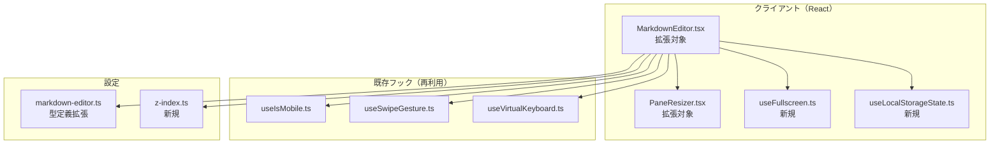
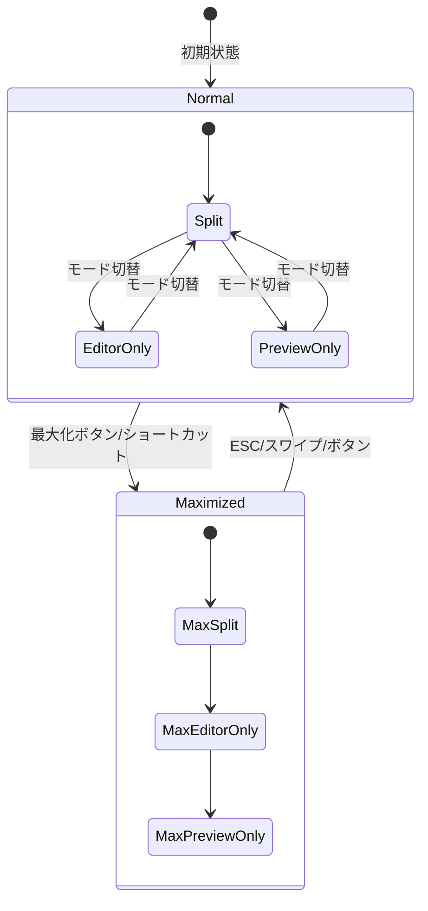

# Issue #99 マークダウンエディタ表示機能改善 設計方針書

## 1. 概要

### 1.1 目的
マークダウンエディタ（Issue #49）の表示機能を改善し、デスクトップ・モバイル両環境でより柔軟な編集体験を提供する。

### 1.2 スコープ
- 最大化表示機能（デスクトップ/モバイル）
- Split Viewの表示領域リサイズ
- モバイル専用UX改善（タブ切替UI、ツールバー最適化）

### 1.3 対象外
- マークダウン構文のサポート拡張
- 新しいファイル形式への対応
- 自動保存機能

### 1.4 関連Issue
- #49 マークダウンエディタとビューワー（ベース機能）

---

## 2. アーキテクチャ設計

### 2.1 システム構成図



### 2.2 レイヤー構成

| レイヤー | ディレクトリ | 責務 |
|---------|------------|------|
| プレゼンテーション | `src/components/worktree/` | UI表示、最大化/リサイズ操作 |
| フック | `src/hooks/` | 状態管理、ジェスチャー検出 |
| 設定 | `src/config/` | z-index値管理 |
| 型定義 | `src/types/` | EditorLayoutState型 |

### 2.3 状態管理アーキテクチャ



---

## 3. 技術選定

### 3.1 使用技術

| カテゴリ | 技術 | 選定理由 |
|---------|------|---------|
| 最大化（デスクトップ） | CSS `position: fixed` | ブラウザ互換性が高い |
| 最大化（モバイル） | Fullscreen API + フォールバック | 没入型体験、iOS Safari対応 |
| リサイズ | 既存PaneResizerを拡張 | コード再利用、一貫性 |
| 状態永続化 | localStorage | シンプル、即座に反映 |
| ジェスチャー | 既存useSwipeGesture | コード再利用 |

### 3.2 Fullscreen APIフォールバック戦略

```typescript
// src/hooks/useFullscreen.ts
export function useFullscreen() {
  const [fallbackMode, setFallbackMode] = useState(false);
  const [error, setError] = useState<Error | null>(null);

  const requestFullscreen = async (element: HTMLElement) => {
    try {
      if (element.requestFullscreen) {
        await element.requestFullscreen();
      } else if ((element as any).webkitRequestFullscreen) {
        await (element as any).webkitRequestFullscreen();
      } else {
        // CSS固定ポジションフォールバック
        setFallbackMode(true);
        return { fallbackMode: true };
      }
    } catch (err) {
      // Fullscreen API失敗時（権限拒否、ユーザー操作なし等）のエラーハンドリング
      // IA-005対応: エラーを捕捉し、fallbackModeに切り替え
      console.warn('Fullscreen API failed, using fallback mode:', err);
      setError(err instanceof Error ? err : new Error(String(err)));
      setFallbackMode(true);
      return { fallbackMode: true, error: err };
    }
  };

  return { requestFullscreen, exitFullscreen, isFullscreen, fallbackMode, error };
}
```

---

## 4. データモデル設計

### 4.1 型定義

```typescript
// src/types/markdown-editor.ts への追加

// 既存（Issue #49）
export type ViewMode = 'split' | 'editor' | 'preview';

// 新規追加
export interface EditorLayoutState {
  viewMode: ViewMode;
  isMaximized: boolean;
  splitRatio: number; // 0.2 - 0.8
}

// 既存定数（Issue #49で定義済み、変更なし）
export const LOCAL_STORAGE_KEY = 'commandmate:md-editor-view-mode';

// 新規追加定数（既存の命名パターンに合わせて単一定数として定義）
export const LOCAL_STORAGE_KEY_SPLIT_RATIO = 'commandmate:md-editor-split-ratio';
export const LOCAL_STORAGE_KEY_MAXIMIZED = 'commandmate:md-editor-maximized';

export const DEFAULT_LAYOUT_STATE: EditorLayoutState = {
  viewMode: 'split',
  isMaximized: false,
  splitRatio: 0.5,
};
```

### 4.2 z-index設定

```typescript
// src/config/z-index.ts（新規作成）
export const Z_INDEX = {
  DROPDOWN: 100,
  MODAL: 200,
  TOAST: 300,
  CONTEXT_MENU: 400,
  MAXIMIZED_EDITOR: 9999, // 最上位
} as const;
```

---

## 5. コンポーネント設計

### 5.1 MarkdownEditor拡張

```typescript
// src/components/worktree/MarkdownEditor.tsx

interface MarkdownEditorProps {
  // 既存props...
}

export function MarkdownEditor(props: MarkdownEditorProps) {
  // 既存状態（変更なし）
  const [viewMode, setViewMode] = useState<ViewMode>('split');

  // 新規状態（追加）
  const [isMaximized, setIsMaximized] = useState<boolean>(false);
  const [splitRatio, setSplitRatio] = useState<number>(0.5);

  // 既存フック活用
  const isMobile = useIsMobile();
  // useSwipeGestureはrefベースの実装
  // コールバックはoptionsで渡し、戻り値は{ref, isSwiping, swipeDirection, resetSwipeDirection}
  const { ref: swipeRef } = useSwipeGesture({
    onSwipeDown: () => setIsMaximized(false),
  });

  // 新規フック
  const { requestFullscreen, exitFullscreen, fallbackMode } = useFullscreen();

  // キーボードショートカット
  useEffect(() => {
    const handleKeyDown = (e: KeyboardEvent) => {
      if ((e.ctrlKey || e.metaKey) && e.shiftKey && e.key === 'F') {
        e.preventDefault();
        setIsMaximized(prev => !prev);
      }
      if (e.key === 'Escape' && isMaximized) {
        setIsMaximized(false);
      }
    };
    window.addEventListener('keydown', handleKeyDown);
    return () => window.removeEventListener('keydown', handleKeyDown);
  }, [isMaximized]);

  // VIEW_MODE_STRATEGIESとの関係:
  // - splitモード時: splitRatioに基づいて動的にスタイルを設定
  //   (VIEW_MODE_STRATEGIESのeditorWidth/previewWidth 'w-1/2'は使用しない)
  // - editor/previewモード時: VIEW_MODE_STRATEGIESの固定幅を使用
  const strategy = VIEW_MODE_STRATEGIES[viewMode];

  return (
    <div
      ref={swipeRef as React.RefObject<HTMLDivElement>}
      className={isMaximized ? 'fixed inset-0 z-[9999]' : ''}
    >
      <Toolbar onMaximize={() => setIsMaximized(true)} />
      {viewMode === 'split' && !isMobile && (
        <>
          {/* splitモード時はsplitRatioで動的幅を設定 */}
          <EditorPane style={{ width: `${splitRatio * 100}%` }} />
          <PaneResizer
            onResize={(delta) => {
              // SF-003対応: ピクセル→比率変換はMarkdownEditor側で実施
              // WorktreeDesktopLayoutと同じパターンを維持
              const containerWidth = containerRef.current?.clientWidth ?? 1;
              const newRatio = splitRatio + (delta / containerWidth);
              setSplitRatio(Math.max(0.2, Math.min(0.8, newRatio)));
            }}
            onDoubleClick={() => setSplitRatio(0.5)}
            minRatio={0.2}
          />
          <PreviewPane style={{ width: `${(1 - splitRatio) * 100}%` }} />
        </>
      )}
      {/* editor/previewモード時はstrategyの固定幅を使用 */}
      {viewMode !== 'split' && (
        <>
          {strategy.showEditor && <EditorPane className={strategy.editorWidth} />}
          {strategy.showPreview && <PreviewPane className={strategy.previewWidth} />}
        </>
      )}
    </div>
  );
}
```

### 5.2 PaneResizer拡張

```typescript
// src/components/worktree/PaneResizer.tsx

interface PaneResizerProps {
  // 既存props...

  // 新規props（すべてオプショナル - 後方互換性維持）
  onDoubleClick?: () => void;
  minRatio?: number; // デフォルト: 0.1
  // Note: onRatioChangeは追加しない（SF-003対応）
  // 比率計算はMarkdownEditor側で実施し、WorktreeDesktopLayoutと同じパターンを維持
}

export function PaneResizer({
  onDoubleClick,
  minRatio = 0.1,
  ...existingProps
}: PaneResizerProps) {
  // 既存実装 + 拡張
  // onResizeは既存通りピクセル単位のdeltaを返す
  // 呼び出し側（MarkdownEditor）でピクセル→比率変換を実施
}
```

**設計判断（SF-003対応）**: PaneResizerの`onResize`はピクセル単位のdeltaを返すインターフェースを維持する。比率への変換は`MarkdownEditor`側で行い、`WorktreeDesktopLayout.tsx`と同じパターン（ピクセル→比率変換を呼び出し側で実行）を採用することで一貫性を保つ。

### 5.3 モバイルタブUI

```typescript
// MarkdownEditor.tsx内

{isMobile && isPortrait && (
  <div className="flex border-b">
    <button
      className={viewMode === 'editor' ? 'tab-active' : 'tab'}
      onClick={() => setViewMode('editor')}
    >
      エディタ
    </button>
    <button
      className={viewMode === 'preview' ? 'tab-active' : 'tab'}
      onClick={() => setViewMode('preview')}
    >
      プレビュー
    </button>
  </div>
)}
```

---

## 6. API設計

本Issueでは新規APIエンドポイントは不要。
既存のファイル読み書きAPIをそのまま使用する。

---

## 7. セキュリティ設計

### 7.1 XSS対策
- 既存のrehype-sanitizeによるサニタイズを継続使用
- 最大化モードでも同一のセキュリティレベルを維持

### 7.2 キーボードショートカット
- ブラウザのデフォルトショートカットと競合しないよう`Ctrl/Cmd + Shift + F`を使用
- `e.preventDefault()`で意図しない動作を防止

### 7.3 localStorage
- 機密情報は保存しない（表示設定のみ）
- キー名にプレフィックス`commandmate:`を付与して衝突回避

### 7.4 localStorage読み込み時のバリデーション（REC-001対応）

localStorage から読み込んだ値は改ざんされている可能性があるため、型チェックと範囲チェックを実装する。

```typescript
// src/hooks/useLocalStorageState.ts

// バリデーション関数例
function isValidSplitRatio(value: unknown): value is number {
  return typeof value === 'number' && value >= 0.2 && value <= 0.8;
}

function isValidBoolean(value: unknown): value is boolean {
  return typeof value === 'boolean';
}

// 読み込み時のバリデーション適用例
export function useLocalStorageState<T>(
  key: string,
  defaultValue: T,
  validator?: (value: unknown) => value is T
): [T, (value: T) => void] {
  const [state, setState] = useState<T>(() => {
    if (typeof window === 'undefined') return defaultValue;
    try {
      const stored = localStorage.getItem(key);
      if (stored === null) return defaultValue;
      const parsed = JSON.parse(stored);
      // バリデーション関数が提供されている場合は検証
      if (validator && !validator(parsed)) {
        console.warn(`Invalid localStorage value for ${key}, using default`);
        return defaultValue;
      }
      return parsed;
    } catch {
      return defaultValue;
    }
  });
  // ...
}

// 使用例
const [splitRatio, setSplitRatio] = useLocalStorageState(
  LOCAL_STORAGE_KEY_SPLIT_RATIO,
  0.5,
  isValidSplitRatio
);

const [isMaximized, setIsMaximized] = useLocalStorageState(
  LOCAL_STORAGE_KEY_MAXIMIZED,
  false,
  isValidBoolean
);
```

### 7.5 最大化状態の視覚的インジケーター（REC-002対応）

最大化時にユーザーが「閉じ込められた」と感じないよう、ESCキーで解除できることを視覚的に示す。

```typescript
// MarkdownEditor.tsx内のToolbar部分
{isMaximized && (
  <span className="text-xs text-gray-500 ml-2">
    Press ESC to exit
  </span>
)}
```

**実装要件**:
- 最大化状態のツールバーに「Press ESC to exit」または「ESCで解除」のヒントを表示
- ヒントは控えめなスタイル（小さいフォント、グレー系の色）で表示
- モバイルでは「Swipe down to exit」等の適切なヒントに変更

### 7.6 Fullscreen APIのユーザーアクション要件（REC-003対応）

Fullscreen APIはセキュリティ上の理由から、ユーザーアクション（クリック、キー入力等）のイベントハンドラ内からのみ呼び出し可能。自動呼び出しはブラウザにブロックされる。

**実装上の注意点**:
- `requestFullscreen()`は必ずボタンのonClickハンドラまたはキーボードイベントハンドラから呼び出す
- useEffect内での自動呼び出しは避ける
- 設計書のコード例（最大化ボタンクリック時に呼び出す設計）に従う

```typescript
// 正しい実装例（ユーザーアクションから呼び出し）
<button onClick={() => {
  setIsMaximized(true);
  requestFullscreen(editorRef.current); // OK: クリックイベント内
}}>
  最大化
</button>

// 誤った実装例（自動呼び出し - ブロックされる）
useEffect(() => {
  if (isMaximized) {
    requestFullscreen(editorRef.current); // NG: ユーザーアクション外
  }
}, [isMaximized]);
```

---

## 8. パフォーマンス設計

### 8.1 リサイズ最適化
```typescript
// requestAnimationFrameでスロットリング
const handleResize = useCallback((e: MouseEvent) => {
  requestAnimationFrame(() => {
    const newRatio = calculateRatio(e.clientX);
    setSplitRatio(Math.max(minRatio, Math.min(1 - minRatio, newRatio)));
  });
}, [minRatio]);
```

### 8.2 プレビュー更新
- 既存のdebounce（300ms）を継続使用
- リサイズ中はプレビュー更新を一時停止

---

## 9. テスト戦略

### 9.1 単体テスト

| テスト対象 | テストケース |
|-----------|------------|
| useFullscreen | Fullscreen API呼び出し、フォールバック動作、エラーハンドリング（権限拒否等） |
| useLocalStorageState | 保存/読み込み、デフォルト値、SSR時のwindow未定義対応 |
| PaneResizer | ダブルクリックリセット、最小幅制限、**後方互換性テスト（既存propsのみでの動作確認）** |
| MarkdownEditor | 最大化切替、キーボードショートカット |

### 9.2 E2Eテスト（デスクトップ）

| シナリオ | 検証内容 |
|---------|---------|
| 最大化 | ボタンクリック→全画面→ESCで解除 |
| リサイズ | ドラッグ→比率変更→リロード後復元 |
| ショートカット | Ctrl+Shift+F→最大化切替 |

### 9.3 E2Eテスト（モバイル）

| シナリオ | 検証内容 |
|---------|---------|
| タブ切替 | 縦向き時のエディタ/プレビュー切替 |
| スワイプ | 最大化状態からスワイプダウンで解除 |
| タッチリサイズ | 横向き時のリサイズハンドル操作 |

---

## 10. 影響ファイル一覧

### 10.1 変更対象

| ファイル | 変更種別 | リスク |
|----------|----------|--------|
| `src/components/worktree/MarkdownEditor.tsx` | 大規模 | 高 |
| `src/components/worktree/PaneResizer.tsx` | 拡張 | 中 |
| `src/types/markdown-editor.ts` | 追加 | 低 |
| `tests/unit/components/MarkdownEditor.test.tsx` | 追加 | 中 |
| `tests/e2e/markdown-editor.spec.ts` | 追加 | 中 |

### 10.2 新規作成

| ファイル | 行数目安 | 説明 |
|----------|----------|------|
| `src/hooks/useFullscreen.ts` | 80行 | Fullscreen API + フォールバック |
| `src/hooks/useLocalStorageState.ts` | 50行 | localStorage永続化hook |
| `src/config/z-index.ts` | 20行 | z-index一元管理 |
| `tests/unit/hooks/useFullscreen.test.ts` | 50行 | useFullscreenフック単体テスト |
| `tests/unit/hooks/useLocalStorageState.test.ts` | 40行 | useLocalStorageStateフック単体テスト |
| `tests/e2e/markdown-editor-mobile.spec.ts` | 150行 | モバイルE2E |

### 10.3 既存使用箇所（動作確認必須）

- `src/components/worktree/WorktreeDesktopLayout.tsx` - PaneResizer使用箇所

---

## 11. 実装チェックリスト

### Phase 1: 基盤整備
- [ ] `src/types/markdown-editor.ts`にEditorLayoutState型追加
- [ ] `src/types/markdown-editor.ts`にLOCAL_STORAGE_KEY_SPLIT_RATIO, LOCAL_STORAGE_KEY_MAXIMIZED定数追加（既存のLOCAL_STORAGE_KEY命名パターンに準拠）
- [ ] `src/config/z-index.ts`新規作成
- [ ] `src/hooks/useFullscreen.ts`新規作成
  - [ ] ユーザーアクションからの呼び出しを前提とした設計（REC-003対応）
- [ ] `src/hooks/useLocalStorageState.ts`新規作成
  - [ ] isValidSplitRatio()バリデーション関数実装（REC-001対応）
  - [ ] isValidBoolean()バリデーション関数実装（REC-001対応）
  - [ ] バリデーション関数をhookに渡せるインターフェース実装（REC-001対応）

### Phase 2: コンポーネント拡張
- [ ] PaneResizerにonDoubleClick, minRatio props追加（後方互換性維持）
- [ ] MarkdownEditorに最大化状態追加
  - [ ] 最大化時に「Press ESC to exit」ヒント表示（REC-002対応）
- [ ] MarkdownEditorにリサイズ機能追加
- [ ] MarkdownEditorにモバイルタブUI追加
  - [ ] モバイル最大化時は「Swipe down to exit」ヒント表示（REC-002対応）

### Phase 3: テスト
- [ ] useFullscreen単体テスト
- [ ] useLocalStorageState単体テスト
- [ ] PaneResizer拡張テスト
- [ ] MarkdownEditor拡張テスト
- [ ] E2Eテスト（デスクトップ）
- [ ] E2Eテスト（モバイル）

### Phase 4: ドキュメント
- [ ] CLAUDE.md更新

---

## 12. 設計上の決定事項とトレードオフ

### 12.1 採用した設計

| 決定事項 | 理由 | トレードオフ |
|---------|------|-------------|
| 状態を個別管理 | 既存コードへの影響最小化 | 状態の統合が将来必要になる可能性 |
| PaneResizer再利用 | コード重複回避 | 拡張による複雑性増加 |
| CSS固定ポジション優先 | ブラウザ互換性 | Fullscreen APIの没入感は得られない |
| 比率計算をMarkdownEditor側で実施 | WorktreeDesktopLayoutとの一貫性維持（SF-003対応） | PaneResizerの汎用性はやや低下するが、インターフェースの混在を回避 |

### 12.2 将来の改善候補

**z-index一元管理の段階的統合（IA-002対応）**

本Issue（#99）では`src/config/z-index.ts`を新規作成し、最大化エディタ用の`MAXIMIZED_EDITOR: 9999`を定義する。既存コンポーネントのz-index値（下記参照）の統合は本Issueのスコープ外とし、将来のリファクタリングで対応する。

現在個別定義されているz-index:
- `MobilePromptSheet.tsx`: z-50
- `MobileHeader.tsx`: z-40
- `MobileTabBar.tsx`: z-40
- `Modal.tsx`: z-50
- `Header.tsx`: z-50
- `AppShell.tsx`: z-40, z-50
- `ContextMenu.tsx`: z-50
- `SlashCommandSelector.tsx`: z-40, z-50
- `WorktreeDetailRefactored.tsx`: z-30, z-50
- `Toast.tsx`: z-50

将来の統合計画:
1. 新規コンポーネントは`z-index.ts`の定数を使用する
2. 既存コンポーネントの移行は別Issueで対応する
3. `MAXIMIZED_EDITOR: 9999`は他の全てのz-index値より高いため、現時点で競合の問題はない

**MaximizableContainer抽出の検討（SF-001対応）**

現設計ではMarkdownEditor.tsx内で最大化状態管理を行うが、以下の条件が満たされた場合はMaximizableContainerコンポーネントへの抽出を検討する:

- 他のコンポーネント（ターミナル、ファイルツリー等）で最大化機能が必要になった場合
- MarkdownEditor.tsxの責務が更に増加し、可読性に影響が出た場合

抽出時の設計方針:
```typescript
// 将来的な抽出例（現段階では未実装）
// src/components/common/MaximizableContainer.tsx
interface MaximizableContainerProps {
  children: React.ReactNode;
  shortcutKey?: string; // デフォルト: 'Ctrl+Shift+F'
  onMaximizeChange?: (isMaximized: boolean) => void;
}
```

この設計により、最大化機能を他のコンポーネントでも再利用可能になる。現段階ではYAGNI原則に従い実装を見送り、必要になった時点で抽出を行う。

### 12.3 代替案との比較

| 代替案 | メリット | デメリット | 不採用理由 |
|--------|---------|-----------|-----------|
| 状態をオブジェクトで一括管理 | 型安全性向上 | 既存コード大幅変更 | 影響範囲が大きすぎる |
| 新規リサイズコンポーネント作成 | 自由度が高い | コード重複 | DRY原則違反 |
| react-resizableライブラリ使用 | 機能豊富 | 依存追加 | 既存コンポーネントで十分 |

---

## 13. レビュー履歴

### Stage 1: 設計原則レビュー（2026-01-30）

**レビュー結果**: approved_with_recommendations

**設計原則スコア**:
- SOLID: 4/5
- KISS: 3/5
- YAGNI: 4/5
- DRY: 5/5

#### 対応済みの指摘事項

| ID | 原則 | タイトル | 対応内容 |
|----|------|---------|---------|
| SF-001 | SOLID (SRP) | MarkdownEditor.tsxの責務集中 | 将来的なMaximizableContainer抽出の検討を設計上の決定事項に追記 |
| SF-003 | SOLID (O/C) | PaneResizerへの新規props追加方法 | onRatioChangeを削除し、比率計算はMarkdownEditor側で実施する設計に変更 |

#### ポジティブな評価

- **PO-001 (DRY)**: 既存PaneResizerコンポーネントの再利用は適切
- **PO-002 (DRY)**: useIsMobile、useSwipeGesture、useVirtualKeyboardの活用は良い設計
- **PO-003 (YAGNI)**: スコープ外の明確な定義により不要な機能実装を防止
- **PO-004 (LSP)**: PaneResizerの拡張propsが後方互換性を維持
- **PO-005 (KISS)**: localStorage選択は適切
- **PO-006 (ISP)**: EditorLayoutState型が適切に分離されている

### Stage 2: 整合性レビュー（2026-01-30）

**レビュー結果**: approved_with_recommendations

**整合性スコア**: B+

**整合性チェック結果**:
| 項目 | 状態 | 備考 |
|------|------|------|
| 型定義 | partial | ViewMode型は一致。LOCAL_STORAGE_KEYS命名に不整合あり（修正済み） |
| Hook API | partial | useSwipeGestureのAPI使用例に不整合あり（修正済み） |
| コンポーネントインターフェース | good | PaneResizerの拡張方針は後方互換性を維持 |
| 設計パターン | good | WorktreeDesktopLayoutのリサイズパターンとの一貫性が確保 |
| 命名規則 | good | ファイル名、関数名、型名は既存の命名規則に従っている |

#### 対応済みの指摘事項

| ID | 重要度 | タイトル | 対応内容 |
|----|--------|---------|---------|
| MF-001 (CS-001) | high | LOCAL_STORAGE_KEYS定数名の不整合 | 既存のLOCAL_STORAGE_KEYパターンに合わせて、LOCAL_STORAGE_KEY_SPLIT_RATIO、LOCAL_STORAGE_KEY_MAXIMIZEDとして定義する形式に修正 |
| SF-001 (CS-002) | medium | useSwipeGestureフックのAPI使用方法の不整合 | 設計書のコード例を実際のAPIに合わせて修正。`const { ref: swipeRef } = useSwipeGesture({...})`形式に変更し、refベースの実装であることをコメントで明記 |
| SF-002 (CS-007) | low | VIEW_MODE_STRATEGIESの使用方法 | splitモード時はsplitRatioで動的幅を設定し、VIEW_MODE_STRATEGIESの固定幅は使用しないことを設計書のコード例にコメントで明記。editor/previewモード時はstrategyの固定幅を使用する旨も追記 |

#### ポジティブな評価

- **PF-001**: 既存フック（useIsMobile, useSwipeGesture, useVirtualKeyboard）の再利用計画は適切
- **PF-002**: PaneResizerのonResize APIの一貫性が既存実装と一致
- **PF-003**: EditorLayoutState型がViewMode型を再利用しており、型定義の一貫性が保たれている
- **PF-004**: z-index一元管理の設計（z-index.ts新規作成）は将来の拡張性を考慮した良い設計

#### 確認済み事項（問題なし）

| ID | カテゴリ | 内容 |
|----|---------|------|
| CS-003 | PaneResizerインターフェース | onDoubleClickは新規propとして追加予定。後方互換性維持の記述は正確 |
| CS-004 | リサイズ実装パターン | ピクセル→比率変換をMarkdownEditor側で実施する方針はWorktreeDesktopLayoutと一致 |
| CS-005 | 新規機能 | MarkdownEditorへのsplitRatio、isMaximized状態追加は設計書の「新規状態（追加）」と整合 |
| CS-006 | 新規フック | useFullscreen、useLocalStorageStateは設計書通りPhase 1で新規作成予定 |
| CS-008 | フォーマット一貫性 | Issue #49設計書との構造・フォーマットが一致 |

### Stage 3: 影響分析レビュー（2026-01-30）

**レビュー結果**: approved_with_recommendations

**影響スコア**: B+

**影響範囲サマリ**:
| カテゴリ | 件数 | 備考 |
|----------|------|------|
| 高影響ファイル | 1 | MarkdownEditor.tsx（+100-150行） |
| 中影響ファイル | 2 | PaneResizer.tsx, markdown-editor.ts |
| 新規作成ファイル | 6 | フック2件、設定1件、テスト3件 |
| テストファイル影響 | 3 | 単体テスト2件、E2Eテスト1件に追加必要 |

#### 対応済みの指摘事項

| ID | 重要度 | タイトル | 対応内容 |
|----|--------|---------|---------|
| IA-001 | high | 新規フックのテストファイルが影響ファイル一覧に未記載 | 10.2新規作成に`tests/unit/hooks/useFullscreen.test.ts`（50行）、`tests/unit/hooks/useLocalStorageState.test.ts`（40行）を追加 |
| IA-002 | medium | 既存z-indexとの一元化計画が不明確 | 12.2将来の改善候補にz-index段階的統合計画を追記。本Issueのスコープ外として明記 |
| IA-003 | medium | 後方互換性テストの明示が必要 | 9.1単体テストのPaneResizerテストケースに「後方互換性テスト（既存propsのみでの動作確認）」を追加 |
| IA-005 | medium | Fullscreen API失敗時のエラーハンドリング | 3.2のuseFullscreen設計にtry-catchでエラーを捕捉し、fallbackModeをtrueに設定する処理を追加 |

#### スコープ外として記録した指摘事項

| ID | 重要度 | タイトル | 理由 |
|----|--------|---------|------|
| IA-004 | medium | VIEW_MODE_STRATEGIESとの整合性 | Stage 2 (SF-002)で対応済み。splitモード時の動的幅設定についてコード例にコメントで明記済み |

#### 情報として記録した指摘事項（実装時の注意点）

| ID | 重要度 | タイトル | 実装時の対応 |
|----|--------|---------|-------------|
| IA-006 | low | containerRef追加の影響 | 実装時にuseRefでcontainerRefを追加し、最外側divにアタッチする |
| IA-007 | low | CLAUDE.md更新の詳細が未定義 | 「最近の実装機能」セクションにIssue #99の機能概要を追記 |
| IA-008 | low | 最大化ボタンのaria属性 | 実装時にaria-label="Maximize editor", aria-expanded={isMaximized}を追加 |
| IA-009 | low | 既存E2Eテストへの影響確認 | 既存テストのセレクタ（data-testid）が変更されないことを確認 |
| IA-010 | low | Fullscreen APIのブラウザサポート | Safari 12+以降を想定。webkitRequestFullscreenフォールバック実装済み |
| IA-011 | low | localStorage読み込み時のSSR考慮 | typeof window !== 'undefined'のチェックを実装に含める |

#### ポジティブな評価

- **PF-001**: PaneResizerの後方互換設計（新規propsがすべてオプショナル）
- **PF-002**: WorktreeDesktopLayoutとのパターン統一（ピクセル→比率変換をMarkdownEditor側で実施）
- **PF-003**: 既存フック（useIsMobile, useSwipeGesture, useVirtualKeyboard）の有効活用
- **PF-004**: 包括的なテスト戦略（単体テスト、E2Eテストの計画が明確）
- **PF-005**: リサイズ最適化の考慮（requestAnimationFrameスロットリング、プレビュー更新一時停止）
- **PF-006**: セキュリティ設計の継承（rehype-sanitizeを最大化モードでも維持）

### Stage 4: セキュリティレビュー（2026-01-30）

**レビュー結果**: approved_with_recommendations

**セキュリティスコア**: A-

**OWASP Top 10チェック結果**:
| 項目 | 状態 | 備考 |
|------|------|------|
| A01: Broken Access Control | pass | 既存のisPathSafe()によるパストラバーサル防止が維持される |
| A02: Cryptographic Failures | N/A | 本機能では暗号化処理を行わない |
| A03: Injection | pass | 既存のrehype-sanitizeによるXSS防止が最大化モードでも継続使用 |
| A04: Insecure Design | pass_with_notes | z-index 9999は他UI要素を覆うが、ESCキーで解除可能 |
| A05: Security Misconfiguration | pass | localStorageには表示設定のみを保存 |
| A06: Vulnerable Components | pass | 新規外部依存パッケージは追加されない |
| A07: Authentication Failures | N/A | 本機能は認証機能に影響しない |
| A08: Data Integrity Failures | pass | ファイル保存は既存APIを使用 |
| A09: Logging/Monitoring Failures | pass_with_notes | Fullscreen API失敗時のconsole.warnは設計書に記載 |
| A10: SSRF | N/A | サーバーサイドリクエストを行わない |

#### 対応済みの指摘事項

| ID | 重要度 | タイトル | 対応内容 |
|----|--------|---------|---------|
| REC-001 | medium | localStorage読み込み時のバリデーション強化 | セクション7.4にバリデーション関数（型チェック、範囲チェック）の実装例を追加。isValidSplitRatio(), isValidBoolean()パターンを定義 |
| REC-002 | low | 最大化状態の視覚的インジケーター | セクション7.5に「Press ESC to exit」ヒント表示の実装要件を追加 |
| REC-003 | low | Fullscreen API呼び出しのユーザーアクション保証 | セクション7.6にFullscreen APIのユーザーアクション要件と正しい/誤った実装例を追加 |

#### セキュリティ上の確認済み事項

| ID | カテゴリ | 内容 |
|----|---------|------|
| SEC-001 | XSS防止 | 既存のrehype-sanitizeによるXSS保護が最大化モードでも維持される |
| SEC-002 | キーボードショートカット | Ctrl/Cmd+Shift+Fはブラウザのデフォルトショートカットと競合しない |
| SEC-003 | localStorage | 保存される値はviewMode、splitRatio、isMaximizedのみ。機密情報は含まれない |
| SEC-004 | Fullscreen API | CSS固定ポジションをフォールバックとして使用。ESCキー/スワイプで解除可能 |
| SEC-005 | z-index overlay | Toast通知はMarkdownEditor内部にあるため最大化時も表示される |
| SEC-006 | モバイルセキュリティ | タブ切替UI、useSwipeGestureは安全な実装 |
| SEC-007 | エラーメッセージ | クライアントサイドのみであり、サーバーサイドの機密情報漏洩リスクはない |
| SEC-008 | 入力バリデーション | splitRatioのクランプ処理（0.2-0.8）が設計書に記載 |

#### ポジティブな評価

- **PF-001 (XSS)**: 既存のrehype-sanitizeによるXSS保護を最大化モードでも維持する設計は適切
- **PF-002 (キーボードショートカット)**: Ctrl/Cmd+Shift+Fはブラウザのデフォルトショートカットと競合しない適切な選択
- **PF-003 (最小権限の原則)**: localStorageに機密情報を保存しない設計は情報漏洩リスクを最小化
- **PF-004 (フォールバック設計)**: Fullscreen APIが失敗した場合のCSS固定ポジションフォールバックは堅牢な設計
- **PF-005 (既存セキュリティ基盤の活用)**: ファイル操作は既存API（isPathSafe、rehype-sanitize）を使用し、新たな攻撃面を作らない
- **PF-006 (ユーザー制御)**: ESCキー、スワイプダウン、最大化ボタンと複数の解除方法を提供

#### 実装時のセキュリティ注意点

| フェーズ | コンポーネント | 注意点 |
|---------|---------------|--------|
| Phase 1 | useLocalStorageState | typeof window !== 'undefined'チェックでSSRエラーを防止、JSON.parseのtry-catchでmalformed dataを処理、バリデーション関数による値の検証 |
| Phase 1 | useFullscreen | try-catchでAPI失敗を捕捉しfallbackModeを使用、ユーザーアクションからの呼び出しを前提 |
| Phase 2 | MarkdownEditor | rehype-sanitizeの継続使用を確認、e.preventDefault()でショートカット競合を防止、splitRatioのクランプ処理（0.2-0.8） |

---

*作成日: 2026-01-30*
*最終更新: 2026-01-30*
