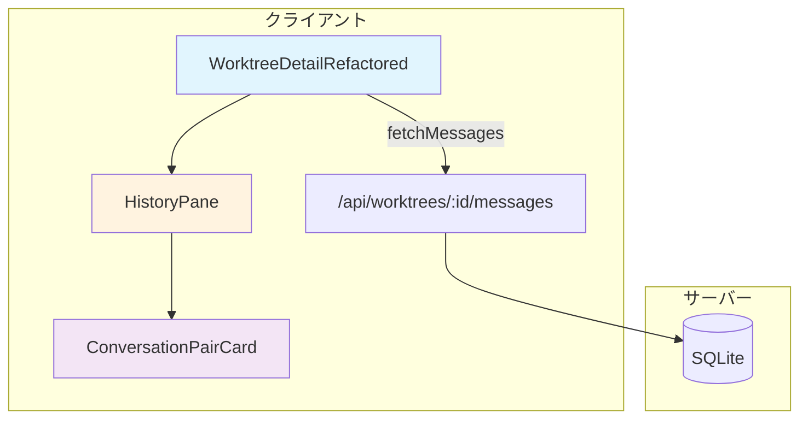
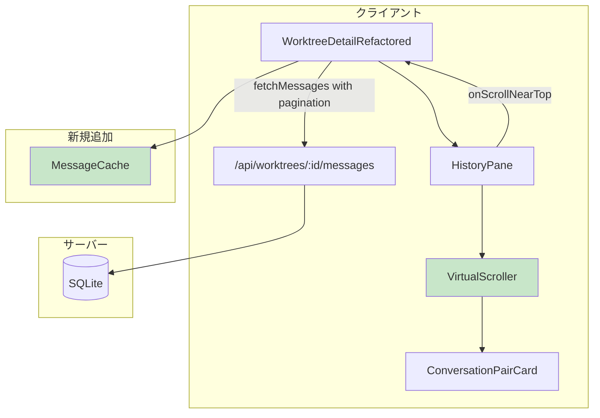

# Issue #28: 履歴表示改善 - 設計方針書

## 概要

| 項目 | 内容 |
|------|------|
| **Issue番号** | #28 |
| **タイトル** | 履歴表示改善 |
| **種別** | bug |
| **作成日** | 2026-01-12 |
| **状態** | レビュー修正完了・実装着手可 |

### 問題の概要
Assistantからの履歴表示が一部切れているケースが頻発している。

---

## 1. 問題分析

### 1.1 調査結果サマリー

調査の結果、以下の3つの主要な原因候補を特定しました：

#### 原因候補1: ページネーション未使用（高優先度）

```
現状:
├─ API側: before/limit パラメータは実装済み
├─ クライアント側: fetchMessages() でパラメータ未使用
└─ 結果: デフォルト50件のみ取得 → 古いメッセージが表示されない
```

**影響箇所:**
- `src/app/api/worktrees/[id]/messages/route.ts` - APIは対応済み
- `src/components/worktree/WorktreeDetailRefactored.tsx` - 呼び出し側が未対応

#### 原因候補2: スクロール管理の問題（中優先度）

```
現状:
├─ sticky ヘッダー (top-0, z-10) が固定
├─ スクロール位置復元ロジックがヘッダー高さを未考慮
└─ 結果: コンテンツの一部が隠れる可能性
```

**影響箇所:**
- `src/components/worktree/HistoryPane.tsx` L147-169, L219-221

#### 原因候補3: CSSオーバーフロー制約（中優先度）

```
現状:
├─ ユーザーメッセージ: max-w-[80%] 制約あり
├─ アシスタント応答: max-w 制約なし
└─ 結果: 長いコンテンツで水平方向の表示問題
```

**影響箇所:**
- `src/components/worktree/ConversationPairCard.tsx` L177, L240

---

## 2. アーキテクチャ設計

### 2.1 現行システム構成



### 2.2 改善後のシステム構成



---

## 3. 技術選定

| カテゴリ | 選定技術 | 選定理由 |
|---------|---------|---------|
| **仮想スクロール** | react-window | 軽量、広く採用、大量メッセージ対応 |
| **スクロール管理** | カスタムフック | 既存useLayoutEffect活用、sticky対応 |
| **キャッシュ** | useState + useRef | シンプル、外部依存なし |
| **テスト** | Vitest + React Testing Library | 既存スタック活用 |

### 代替案との比較

| 案 | メリット | デメリット | 採用 |
|----|---------|-----------|------|
| react-window | 軽量、十分な機能 | 設定が少し複雑 | ◯ |
| react-virtualized | 高機能、多オプション | 重量、過剰機能 | × |
| 自前実装 | 完全カスタマイズ | 工数大、バグリスク | × |
| tanstack-virtual | モダン、高性能 | 追加依存 | △（将来検討） |

---

## 4. 設計パターン

### 4.1 Infinite Scroll パターン

```typescript
// src/hooks/useInfiniteMessages.ts
export interface UseInfiniteMessagesOptions {
  worktreeId: string;
  cliToolId: string;
  pageSize?: number;  // デフォルト: 50
}

/**
 * エラー状態の型定義
 */
export interface InfiniteMessagesError {
  code: 'NETWORK_ERROR' | 'SERVER_ERROR' | 'PARSE_ERROR' | 'UNKNOWN';
  message: string;
  retryable: boolean;
  originalError?: Error;
}

export interface UseInfiniteMessagesReturn {
  // データ
  messages: ChatMessage[];
  conversationPairs: ConversationPair[];

  // ローディング状態
  isLoading: boolean;           // 初期ロード中
  isLoadingOlder: boolean;      // 古いメッセージ取得中
  isRefreshing: boolean;        // リフレッシュ中

  // ページネーション
  hasMore: boolean;
  loadMore: () => Promise<void>;

  // エラーハンドリング
  error: InfiniteMessagesError | null;
  retry: () => Promise<void>;   // 最後の失敗した操作をリトライ

  // その他
  refresh: () => Promise<void>;
  clearCache: () => void;       // CLIツール切り替え時などに使用
}

export function useInfiniteMessages(
  options: UseInfiniteMessagesOptions
): UseInfiniteMessagesReturn {
  // 1. 初期ロード: 最新50件
  // 2. スクロール上端到達時: 古いメッセージを追加取得
  // 3. 取得済みメッセージをキャッシュ
  // 4. ConversationPairへのグループ化をメモ化
  // 5. エラー発生時は error 状態を更新し、retry で再実行可能
  // 6. CLIツール切り替え時は clearCache でキャッシュクリア
}
```

#### エラーハンドリング実装例

```typescript
// src/hooks/useInfiniteMessages.ts (実装詳細)

const [error, setError] = useState<InfiniteMessagesError | null>(null);
const lastFailedOperationRef = useRef<(() => Promise<void>) | null>(null);

const handleError = useCallback((err: unknown, operation: () => Promise<void>) => {
  lastFailedOperationRef.current = operation;

  if (err instanceof TypeError && err.message.includes('fetch')) {
    setError({
      code: 'NETWORK_ERROR',
      message: 'ネットワークエラーが発生しました',
      retryable: true,
      originalError: err,
    });
  } else if (err instanceof Response && err.status >= 500) {
    setError({
      code: 'SERVER_ERROR',
      message: 'サーバーエラーが発生しました',
      retryable: true,
    });
  } else {
    setError({
      code: 'UNKNOWN',
      message: 'エラーが発生しました',
      retryable: true,
      originalError: err instanceof Error ? err : undefined,
    });
  }
}, []);

const retry = useCallback(async () => {
  if (lastFailedOperationRef.current) {
    setError(null);
    await lastFailedOperationRef.current();
  }
}, []);
```

### 4.2 Observer パターン（スクロール検出）

```typescript
// src/hooks/useScrollObserver.ts
export interface ScrollObserverOptions {
  threshold?: number;        // デフォルト: 100px
  onNearTop?: () => void;
  onNearBottom?: () => void;
}

export function useScrollObserver(
  containerRef: RefObject<HTMLElement>,
  options: ScrollObserverOptions
): void {
  // IntersectionObserver または scroll イベントで検出
}
```

### 4.3 Scroll Position Restoration パターン

```typescript
// src/hooks/useScrollRestoration.ts
export interface ScrollRestorationOptions {
  stickyHeaderHeight?: number;  // sticky ヘッダーの高さ
  preserveOnNewMessage?: boolean;
}

export function useScrollRestoration(
  containerRef: RefObject<HTMLElement>,
  options: ScrollRestorationOptions
): {
  savePosition: () => void;
  restorePosition: () => void;
  scrollToBottom: () => void;
};
```

---

## 5. データモデル設計

### 5.1 メッセージキャッシュ構造

```typescript
// src/types/message-cache.ts
interface MessageCache {
  worktreeId: string;
  cliToolId: string;
  messages: Map<string, ChatMessage>;  // id -> message
  oldestTimestamp: Date | null;
  newestTimestamp: Date | null;
  hasMoreOlder: boolean;
  hasMoreNewer: boolean;
}
```

### 5.2 ページネーション状態

```typescript
// src/types/pagination.ts
interface PaginationState {
  isLoadingOlder: boolean;
  isLoadingNewer: boolean;
  error: Error | null;
  lastFetchTime: Date | null;
}
```

---

## 6. API設計

### 6.1 既存APIの活用

現行API `GET /api/worktrees/:id/messages` を最大限活用：

```
Query Parameters:
├─ before: string (ISO 8601) - この日時より前のメッセージを取得
├─ after: string (ISO 8601) - この日時より後のメッセージを取得 [新規追加]
├─ limit: number (1-100) - 取得件数
└─ cliTool: 'claude'|'codex'|'gemini' - CLIツールフィルタ
```

### 6.2 レスポンス拡張

```typescript
// 現行レスポンス
ChatMessage[]

// 拡張レスポンス（オプション）
interface MessagesResponse {
  messages: ChatMessage[];
  pagination: {
    hasMore: boolean;
    oldestTimestamp: string | null;
    newestTimestamp: string | null;
    total: number;  // オプション: 全件数
  };
}
```

---

## 7. コンポーネント設計

### 7.1 改修対象コンポーネント

```
src/components/worktree/
├── HistoryPane.tsx           [改修: スクロール管理強化]
├── ConversationPairCard.tsx  [改修: CSS制約追加]
└── WorktreeDetailRefactored.tsx [改修: ページネーション対応]

src/hooks/
├── useInfiniteMessages.ts    [新規: 無限スクロール]
├── useScrollObserver.ts      [新規: スクロール検出]
└── useScrollRestoration.ts   [新規: スクロール復元]
```

### 7.2 HistoryPane改修設計

```tsx
// src/components/worktree/HistoryPane.tsx

interface HistoryPaneProps {
  // 既存Props
  pairs: ConversationPair[];
  // 新規Props
  hasMoreOlder?: boolean;
  isLoadingOlder?: boolean;
  onLoadOlder?: () => void;
}

export function HistoryPane({
  pairs,
  hasMoreOlder,
  isLoadingOlder,
  onLoadOlder,
  ...props
}: HistoryPaneProps) {
  const containerRef = useRef<HTMLDivElement>(null);
  const STICKY_HEADER_HEIGHT = 48; // px

  // スクロール位置復元（sticky ヘッダー考慮）
  useScrollRestoration(containerRef, {
    stickyHeaderHeight: STICKY_HEADER_HEIGHT,
  });

  // 上端到達検出
  useScrollObserver(containerRef, {
    threshold: 100,
    onNearTop: () => {
      if (hasMoreOlder && !isLoadingOlder) {
        onLoadOlder?.();
      }
    },
  });

  return (
    <div ref={containerRef} className="...">
      {/* ローディングインジケーター（上部） */}
      {isLoadingOlder && <LoadingSpinner />}

      {/* 会話ペア一覧 */}
      {pairs.map((pair) => (
        <ConversationPairCard key={pair.id} pair={pair} />
      ))}
    </div>
  );
}
```

### 7.3 ConversationPairCard改修設計

```tsx
// src/components/worktree/ConversationPairCard.tsx

// CSSクラスの統一
const MESSAGE_CONTAINER_CLASSES = {
  user: 'max-w-[80%] break-words',
  assistant: 'max-w-full break-words overflow-x-auto',
} as const;

// 長いコンテンツのラップ対応
const CONTENT_CLASSES = 'whitespace-pre-wrap break-words overflow-wrap-anywhere';
```

---

## 8. 実装フェーズ

### Phase 1: CSS修正（即時対応）

| タスク | 工数 | 優先度 |
|--------|------|--------|
| アシスタント応答にmax-w制約追加 | 0.5h | 高 |
| overflow-wrap: anywhere 追加 | 0.25h | 高 |
| word-break統一 | 0.25h | 高 |

**成果物:**
- ConversationPairCard.tsx の CSS 修正

### Phase 2: スクロール管理改善（短期）

| タスク | 工数 | 優先度 |
|--------|------|--------|
| sticky ヘッダー高さの定数化 | 0.5h | 高 |
| スクロール復元ロジック修正 | 1h | 高 |
| useScrollRestoration フック作成 | 1h | 中 |

**成果物:**
- useScrollRestoration.ts
- HistoryPane.tsx のスクロール管理改修

### Phase 3: ページネーション実装（中期）

| タスク | 工数 | 優先度 |
|--------|------|--------|
| useInfiniteMessages フック作成 | 2h | 高 |
| useScrollObserver フック作成 | 1h | 高 |
| HistoryPane のページネーション対応 | 2h | 高 |
| WorktreeDetailRefactored 統合 | 1h | 高 |
| API レスポンス拡張（オプション） | 1h | 低 |

**成果物:**
- useInfiniteMessages.ts
- useScrollObserver.ts
- HistoryPane/WorktreeDetailRefactored 改修

### Phase 4: 仮想スクロール（将来検討）

| タスク | 工数 | 優先度 |
|--------|------|--------|
| react-window 導入 | 2h | 低 |
| VariableSizeList 実装 | 3h | 低 |
| パフォーマンステスト | 2h | 低 |

---

## 9. テスト計画

### 9.1 単体テスト

```typescript
// tests/unit/hooks/useInfiniteMessages.test.ts
describe('useInfiniteMessages', () => {
  // 基本機能
  it('初期ロードで最新50件を取得する', async () => {});
  it('loadMore で古いメッセージを追加取得する', async () => {});
  it('hasMore が false のときは追加取得しない', async () => {});

  // エラーハンドリング
  it('ネットワークエラー時に error.code が NETWORK_ERROR になる', async () => {});
  it('サーバーエラー時に error.code が SERVER_ERROR になる', async () => {});
  it('エラー時にリトライ可能', async () => {});
  it('リトライ成功時に error が null にリセットされる', async () => {});

  // エッジケース
  it('空のworktreeでも正常動作する', async () => {});
  it('CLIツール切り替え時にキャッシュがクリアされる', async () => {});
  it('同時複数リクエストでレースコンディションが発生しない', async () => {});
  it('コンポーネントアンマウント時にメモリリークしない', async () => {});
});

// tests/unit/hooks/useScrollObserver.test.ts
describe('useScrollObserver', () => {
  it('スクロール上端到達時に onNearTop が呼ばれる', () => {});
  it('スクロール下端到達時に onNearBottom が呼ばれる', () => {});
  it('threshold 内でのみコールバックが発火する', () => {});
  it('デバウンス期間中は重複発火しない', () => {});
});

// tests/unit/hooks/useScrollRestoration.test.ts
describe('useScrollRestoration', () => {
  it('savePosition でスクロール位置を保存する', () => {});
  it('restorePosition で保存した位置を復元する', () => {});
  it('新規メッセージ時は復元をスキップする', () => {});
  it('scrollToBottom で最下部にスクロールする', () => {});
});
```

### 9.2 結合テスト

```typescript
// tests/integration/history-display.test.tsx
describe('履歴表示', () => {
  // 基本機能
  it('50件以上のメッセージがある場合、スクロールで追加読み込みする', async () => {});
  it('アシスタント応答の長いテキストが正しくラップされる', async () => {});
  it('sticky ヘッダーでコンテンツが隠れない', async () => {});

  // CSS表示確認
  it('長いURLが適切に折り返される', async () => {});
  it('コードブロックが水平スクロールなしで表示される', async () => {});
  it('日本語とASCII混合テキストが正しく表示される', async () => {});

  // エラーハンドリング
  it('ネットワークエラー時にリトライボタンが表示される', async () => {});
  it('リトライボタンクリックで再取得が実行される', async () => {});

  // CLIツール切り替え
  it('CLIツール切り替え時に履歴がクリアされ再取得される', async () => {});
});

// tests/integration/conversation-pair-card.test.tsx
describe('ConversationPairCard', () => {
  it('長いメッセージが折りたたまれて表示される', async () => {});
  it('展開ボタンクリックで全文が表示される', async () => {});
  it('ファイルパスがクリッカブルリンクになる', async () => {});
});
```

### 9.3 E2Eテスト

```typescript
// tests/e2e/history-display.spec.ts

test.describe('履歴表示機能', () => {
  test('長い会話履歴のスクロールと表示', async ({ page }) => {
    // 1. 100件のメッセージがあるワークツリーを表示
    // 2. 最新メッセージが表示されていることを確認
    // 3. 上にスクロール
    // 4. 古いメッセージが追加読み込みされることを確認
    // 5. すべてのメッセージが切れずに表示されることを確認
  });

  test('長いテキストの表示（Issue #28 回帰テスト）', async ({ page }) => {
    // 1. 1000文字以上のアシスタント応答を含むワークツリーを表示
    // 2. メッセージが水平にはみ出していないことを確認
    // 3. スクロールバーが垂直方向のみであることを確認
    // 4. 全文が読めることを確認（展開後）
  });

  test('ネットワークエラーからの復旧', async ({ page }) => {
    // 1. ネットワークをオフラインに設定
    // 2. ワークツリーを開く
    // 3. エラーメッセージとリトライボタンが表示されることを確認
    // 4. ネットワークをオンラインに復旧
    // 5. リトライボタンをクリック
    // 6. メッセージが正常に表示されることを確認
  });

  test('CLIツール切り替え時の動作', async ({ page }) => {
    // 1. Claude のメッセージを表示
    // 2. Codex に切り替え
    // 3. 履歴がクリアされることを確認
    // 4. Codex のメッセージが表示されることを確認
    // 5. Claude に戻す
    // 6. Claude のメッセージが再表示されることを確認
  });
});

// tests/e2e/cross-browser.spec.ts
test.describe('クロスブラウザ互換性', () => {
  test('Safari でテキストが正しく折り返される', async ({ page }) => {
    // word-break: break-word の動作確認
  });

  test('Firefox でスクロール位置が正しく復元される', async ({ page }) => {
    // requestAnimationFrame の動作確認
  });
});
```

---

## 10. 設計上の決定事項とトレードオフ

### 10.1 採用した設計

| 決定事項 | 理由 | トレードオフ |
|---------|------|-------------|
| 無限スクロール採用 | UX向上、一般的なパターン | 実装複雑度増加 |
| クライアントキャッシュ | パフォーマンス向上 | メモリ使用量増加 |
| カスタムフック分離 | 再利用性、テスト容易性 | ファイル数増加 |
| 段階的リリース | リスク軽減 | 完全解決まで時間 |

### 10.2 見送った設計

| 案 | 見送り理由 |
|----|-----------|
| サーバーサイドページネーション完全移行 | 既存APIが十分、過剰投資 |
| 仮想スクロール即時導入 | 現時点では過剰、将来検討 |
| GraphQL導入 | スコープ外、過剰投資 |
| IndexedDB キャッシュ | 複雑度増加、現時点では不要 |

---

## 11. セキュリティ・パフォーマンス考慮

### 11.1 セキュリティ

- XSS対策: メッセージ内容のサニタイズは既存実装を継続
- CSRF対策: API呼び出しは既存の認証機構を継続

### 11.2 パフォーマンス

| 指標 | 現状 | 目標 |
|------|------|------|
| 初期表示時間 | ~500ms | ~500ms（維持） |
| 追加読み込み | N/A | ~200ms |
| メモリ使用量 | ~10MB | ~20MB（上限） |
| 再レンダリング | 必要時のみ | 必要時のみ（維持） |

---

## 12. 制約条件の確認

CLAUDE.mdの原則への準拠:

| 原則 | 準拠状況 |
|------|---------|
| **SOLID** | ✓ 単一責任（フック分離）、インターフェース分離 |
| **KISS** | ✓ 段階的実装、必要最小限の変更 |
| **YAGNI** | ✓ 仮想スクロールは将来検討、現時点では見送り |
| **DRY** | ✓ カスタムフックで共通ロジック抽出 |

---

## 13. 関連ドキュメント

- [Issue #28](https://github.com/Kewton/MyCodeBranchDesk/issues/28) - 元Issue
- [アーキテクチャ](../../docs/architecture.md) - システム設計
- [ステータスインジケーター](../../docs/features/sidebar-status-indicator.md) - 関連機能

---

## 14. 承認履歴

| 日付 | 承認者 | ステータス |
|------|--------|-----------|
| 2026-01-12 | - | 設計方針策定完了 |
| 2026-01-12 | Claude Architect | アーキテクチャレビュー完了（条件付き承認） |
| 2026-01-12 | - | レビュー指摘事項修正完了・実装着手可 |

### レビュー修正内容

#### 必須改善項目（対応済み）

| ID | 内容 | 対応 |
|----|------|------|
| MF-1 | スクロール復元diffの修正 | ✅ 付録B修正: sticky top-0 はスクロール位置に影響しないことを明記 |
| MF-3 | エラーハンドリングの追加 | ✅ 4.1節: InfiniteMessagesError型とretry機能を追加 |

#### 推奨改善項目（対応済み）

| ID | 内容 | 対応 |
|----|------|------|
| SF-1 | CSS修正の詳細化（Safari対応） | ✅ 付録B修正: word-break: break-word を使用 |
| SF-3 | テストケースの追加 | ✅ 9.1-9.3節: エッジケース・クロスブラウザテスト追加 |

---

## 付録A: 主要ファイル一覧

| ファイル | 役割 | 改修種別 |
|---------|------|---------|
| `src/components/worktree/HistoryPane.tsx` | 履歴表示メイン | 改修 |
| `src/components/worktree/ConversationPairCard.tsx` | 会話カード | 改修 |
| `src/components/worktree/WorktreeDetailRefactored.tsx` | 統合コンテナ | 改修 |
| `src/hooks/useInfiniteMessages.ts` | 無限スクロール | 新規 |
| `src/hooks/useScrollObserver.ts` | スクロール検出 | 新規 |
| `src/hooks/useScrollRestoration.ts` | スクロール復元 | 新規 |
| `src/app/api/worktrees/[id]/messages/route.ts` | メッセージAPI | 軽微改修 |

---

## 付録B: コード差分プレビュー

### ConversationPairCard.tsx CSS修正

**注意**: `overflow-wrap: anywhere` は Safari 未サポートのため、`word-break: break-word` を使用します。

```diff
// アシスタント応答のコンテナ (L240付近)
- <div className="text-sm text-gray-200 whitespace-pre-wrap break-words">
+ <div className="text-sm text-gray-200 whitespace-pre-wrap break-words [word-break:break-word] max-w-full overflow-x-hidden">
```

```diff
// ユーザーメッセージのコンテナ (L194付近) - 既存は問題なし、一貫性のため確認
  <div className="text-sm text-gray-200 whitespace-pre-wrap break-words">
```

### HistoryPane.tsx スクロール管理

**注意**: `sticky top-0` はコンテンツのスクロール位置に影響しません。現行のスクロール復元ロジックは正しいため、大きな変更は不要です。

改善点:
1. sticky ヘッダー高さの定数化（可読性向上）
2. スクロール位置保存のタイミング改善

```diff
+ // 定数定義（可読性向上のため）
+ const STICKY_HEADER_HEIGHT = 48; // px - 将来の参照用

  // Restore scroll position after render if message count unchanged
  useLayoutEffect(() => {
    const container = scrollContainerRef.current;
    const prevCount = prevMessageCountRef.current;

    // Only restore scroll if message count hasn't increased
    // (new messages should allow natural scroll behavior)
    if (container && messages.length === prevCount) {
      requestAnimationFrame(() => {
        container.scrollTop = scrollPositionRef.current;
+       // Note: sticky header does not affect scrollTop calculation
+       // as content flows below the header naturally
      });
    }

    // Update previous count for next render
    prevMessageCountRef.current = messages.length;
  }, [messages.length]);
```
