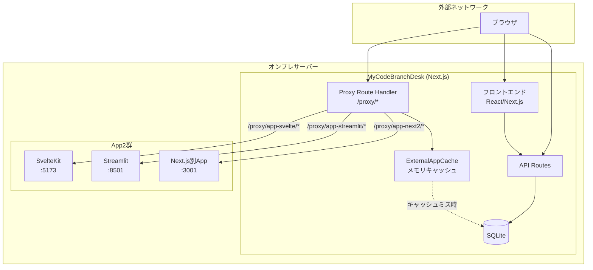
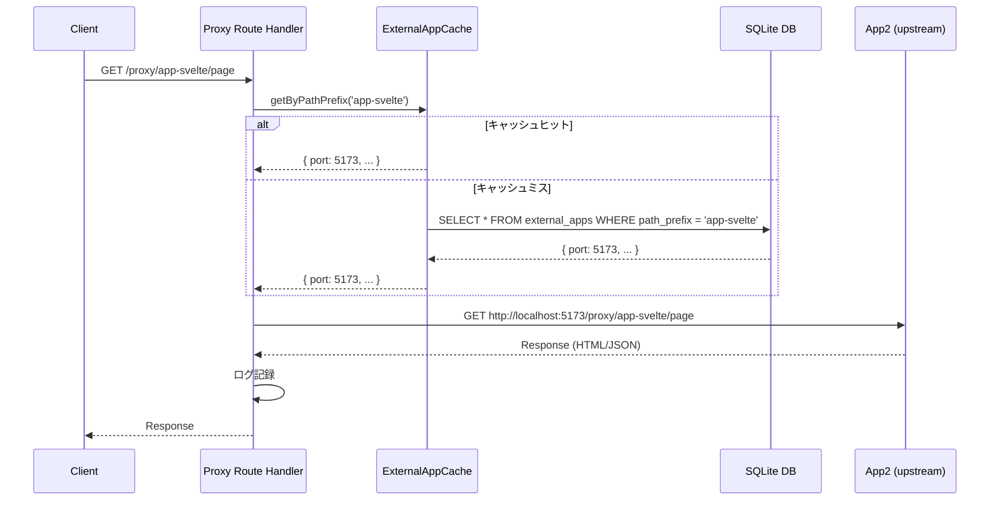
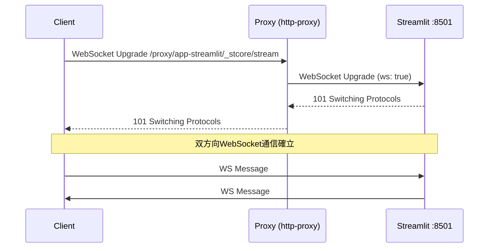
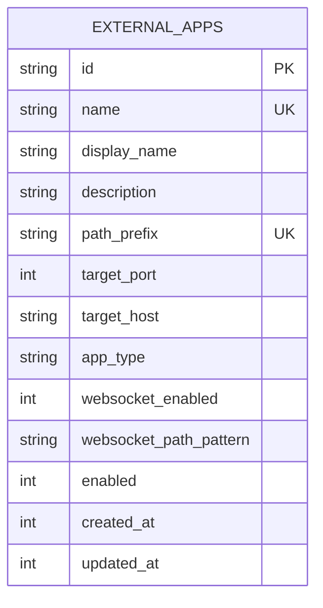

# Issue #42: 複数フロントエンドアプリへのパスベースルーティング - 設計方針書

## 概要

| 項目 | 内容 |
|------|------|
| Issue | #42 |
| タイトル | 複数フロントエンドアプリへのパスベースルーティング |
| 作成日 | 2026-01-15 |
| 更新日 | 2026-01-15 |
| 推奨方式 | **案B: Route Handler + http-proxy** |

---

## 1. アーキテクチャ設計

### 1.1 システム構成図



### 1.2 リクエストフロー（キャッシュ付き）



### 1.3 WebSocket対応フロー（Streamlit用）



---

## 2. 技術選定

| カテゴリ | 選定技術 | 選定理由 |
|---------|---------|---------|
| **プロキシライブラリ** | `http-proxy` | WebSocket対応、軽量、実績あり |
| **データベース** | SQLite (既存) | 設定情報の永続化、既存スキーマ拡張 |
| **API設計** | Next.js Route Handlers | 既存アーキテクチャとの整合性 |
| **状態管理** | React Context + SWR | 既存パターン踏襲 |
| **キャッシュ** | メモリキャッシュ (Map) | 軽量、TTLベース |

### 2.1 http-proxy vs 代替案

| ライブラリ | メリット | デメリット | 採用 |
|-----------|---------|-----------|------|
| **http-proxy** | WS対応、軽量、低レベル制御可能 | 設定が細かい | ✅ |
| http-proxy-middleware | Express互換、設定簡単 | Next.js App Routerと相性△ | ❌ |
| node-fetch + 手動プロキシ | 完全制御可能 | WS非対応、実装コスト大 | ❌ |

---

## 3. 型定義・インターフェース設計

### 3.1 型定義（`src/types/external-apps.ts`）

```typescript
/**
 * 外部アプリの種別
 */
export type ExternalAppType = 'sveltekit' | 'streamlit' | 'nextjs' | 'other';

/**
 * 外部アプリのエンティティ（DBレコード対応）
 * - DBカラム名: スネークケース
 * - TypeScriptプロパティ名: キャメルケース
 */
export interface ExternalApp {
  id: string;
  name: string;                    // DB: name
  displayName: string;             // DB: display_name
  description?: string;            // DB: description
  pathPrefix: string;              // DB: path_prefix
  targetPort: number;              // DB: target_port
  targetHost: string;              // DB: target_host
  appType: ExternalAppType;        // DB: app_type
  websocketEnabled: boolean;       // DB: websocket_enabled
  websocketPathPattern?: string;   // DB: websocket_path_pattern
  enabled: boolean;                // DB: enabled
  createdAt: number;               // DB: created_at
  updatedAt: number;               // DB: updated_at
}

/**
 * 外部アプリの作成リクエスト
 */
export interface CreateExternalAppInput {
  name: string;
  displayName: string;
  description?: string;
  pathPrefix: string;
  targetPort: number;
  targetHost?: string;             // デフォルト: 'localhost'
  appType: ExternalAppType;
  websocketEnabled?: boolean;      // デフォルト: false
  websocketPathPattern?: string;
}

/**
 * 外部アプリの更新リクエスト
 */
export interface UpdateExternalAppInput {
  displayName?: string;
  description?: string;
  targetPort?: number;
  targetHost?: string;
  websocketEnabled?: boolean;
  websocketPathPattern?: string;
  enabled?: boolean;
}

/**
 * 外部アプリのヘルスステータス
 */
export interface ExternalAppHealth {
  id: string;
  healthy: boolean;
  responseTime?: number;           // ミリ秒
  lastChecked: number;
  error?: string;
}
```

### 3.2 インターフェース（`src/lib/external-apps/interfaces.ts`）

```typescript
import type { ExternalApp, CreateExternalAppInput, UpdateExternalAppInput, ExternalAppHealth } from '@/types/external-apps';

/**
 * 外部アプリ管理インターフェース
 * CLIToolManagerと同様のパターンで拡張性を確保
 */
export interface IExternalAppManager {
  /**
   * パスプレフィックスから外部アプリを取得
   */
  getByPathPrefix(pathPrefix: string): Promise<ExternalApp | null>;

  /**
   * IDから外部アプリを取得
   */
  getById(id: string): Promise<ExternalApp | null>;

  /**
   * 全外部アプリを取得
   */
  getAll(): Promise<ExternalApp[]>;

  /**
   * 有効な外部アプリのみ取得
   */
  getEnabled(): Promise<ExternalApp[]>;

  /**
   * 外部アプリを登録
   */
  create(input: CreateExternalAppInput): Promise<ExternalApp>;

  /**
   * 外部アプリを更新
   */
  update(id: string, input: UpdateExternalAppInput): Promise<ExternalApp>;

  /**
   * 外部アプリを削除
   */
  delete(id: string): Promise<void>;

  /**
   * ヘルスチェック実行
   */
  checkHealth(id: string): Promise<ExternalAppHealth>;
}

/**
 * プロキシハンドラーインターフェース
 */
export interface IProxyHandler {
  /**
   * HTTPリクエストをプロキシ
   */
  proxyHttp(
    request: Request,
    app: ExternalApp,
    path: string
  ): Promise<Response>;

  /**
   * WebSocketをプロキシ
   */
  proxyWebSocket(
    request: Request,
    app: ExternalApp,
    path: string
  ): Promise<Response>;
}
```

---

## 4. データモデル設計

### 4.1 新規テーブル: `external_apps`

```sql
-- Migration v12: Add external_apps table for proxy routing
CREATE TABLE IF NOT EXISTS external_apps (
  id TEXT PRIMARY KEY,

  -- 基本情報
  name TEXT NOT NULL UNIQUE,           -- 識別名（英数字、ハイフン）
  display_name TEXT NOT NULL,          -- 表示名
  description TEXT,                    -- 説明

  -- ルーティング設定
  path_prefix TEXT NOT NULL UNIQUE,    -- パスプレフィックス（例: "app-svelte"）
  target_port INTEGER NOT NULL,        -- 転送先ポート
  target_host TEXT DEFAULT 'localhost',-- 転送先ホスト（将来の拡張用）

  -- アプリ種別
  app_type TEXT NOT NULL CHECK(app_type IN ('sveltekit', 'streamlit', 'nextjs', 'other')),

  -- WebSocket設定
  websocket_enabled INTEGER DEFAULT 0, -- WebSocket対応フラグ
  websocket_path_pattern TEXT,         -- WSパスパターン（正規表現）

  -- 状態管理
  enabled INTEGER DEFAULT 1,           -- 有効/無効フラグ

  -- メタ情報
  created_at INTEGER NOT NULL,
  updated_at INTEGER NOT NULL
);

-- インデックス
CREATE INDEX idx_external_apps_path_prefix ON external_apps(path_prefix);
CREATE INDEX idx_external_apps_enabled ON external_apps(enabled);
```

### 4.2 DB ⇔ TypeScript マッピング

```typescript
// src/lib/db-external-apps.ts

/**
 * DBレコード → TypeScriptオブジェクト変換
 */
function mapDbRowToExternalApp(row: DbExternalAppRow): ExternalApp {
  return {
    id: row.id,
    name: row.name,
    displayName: row.display_name,
    description: row.description ?? undefined,
    pathPrefix: row.path_prefix,
    targetPort: row.target_port,
    targetHost: row.target_host,
    appType: row.app_type as ExternalAppType,
    websocketEnabled: row.websocket_enabled === 1,
    websocketPathPattern: row.websocket_path_pattern ?? undefined,
    enabled: row.enabled === 1,
    createdAt: row.created_at,
    updatedAt: row.updated_at,
  };
}

/**
 * TypeScriptオブジェクト → DBレコード変換
 */
function mapExternalAppToDbRow(app: CreateExternalAppInput): DbExternalAppInsert {
  return {
    name: app.name,
    display_name: app.displayName,
    description: app.description ?? null,
    path_prefix: app.pathPrefix,
    target_port: app.targetPort,
    target_host: app.targetHost ?? 'localhost',
    app_type: app.appType,
    websocket_enabled: app.websocketEnabled ? 1 : 0,
    websocket_path_pattern: app.websocketPathPattern ?? null,
  };
}
```

### 4.3 ER図



### 4.4 初期データ例

```typescript
const defaultApps: CreateExternalAppInput[] = [
  {
    name: 'sveltekit-app',
    displayName: 'SvelteKit App',
    pathPrefix: 'app-svelte',
    targetPort: 5173,
    appType: 'sveltekit',
    websocketEnabled: true,
    websocketPathPattern: '.*'  // Vite HMR用
  },
  {
    name: 'streamlit-app',
    displayName: 'Streamlit App',
    pathPrefix: 'app-streamlit',
    targetPort: 8501,
    appType: 'streamlit',
    websocketEnabled: true,
    websocketPathPattern: '/_stcore/stream'
  },
  {
    name: 'nextjs-other',
    displayName: 'Next.js (Other)',
    pathPrefix: 'app-next2',
    targetPort: 3001,
    appType: 'nextjs',
    websocketEnabled: false
  }
];
```

---

## 5. キャッシュ層設計

### 5.1 キャッシュ仕様

| 項目 | 値 |
|------|-----|
| キャッシュ方式 | メモリキャッシュ（Map） |
| TTL | 30秒 |
| キャッシュキー | `pathPrefix` |
| 無効化タイミング | 登録/更新/削除時 |

### 5.2 実装（`src/lib/external-apps/cache.ts`）

```typescript
import type { ExternalApp } from '@/types/external-apps';
import { getExternalAppByPathPrefixFromDb, getAllExternalAppsFromDb } from './db-external-apps';

/**
 * 外部アプリ設定のキャッシュ
 * プロキシ処理時のDB参照オーバーヘッドを削減
 */
class ExternalAppCache {
  private cache: Map<string, ExternalApp> = new Map();
  private allAppsCache: ExternalApp[] | null = null;
  private lastRefresh: number = 0;
  private readonly TTL = 30000; // 30秒

  /**
   * キャッシュが期限切れかチェック
   */
  private isStale(): boolean {
    return Date.now() - this.lastRefresh > this.TTL;
  }

  /**
   * キャッシュをリフレッシュ
   */
  async refresh(): Promise<void> {
    const apps = await getAllExternalAppsFromDb();
    this.cache.clear();
    for (const app of apps) {
      this.cache.set(app.pathPrefix, app);
    }
    this.allAppsCache = apps;
    this.lastRefresh = Date.now();
  }

  /**
   * パスプレフィックスから取得
   */
  async getByPathPrefix(pathPrefix: string): Promise<ExternalApp | null> {
    if (this.isStale()) {
      await this.refresh();
    }
    return this.cache.get(pathPrefix) ?? null;
  }

  /**
   * 全アプリ取得
   */
  async getAll(): Promise<ExternalApp[]> {
    if (this.isStale()) {
      await this.refresh();
    }
    return this.allAppsCache ?? [];
  }

  /**
   * キャッシュを無効化（登録/更新/削除時に呼び出し）
   */
  invalidate(): void {
    this.cache.clear();
    this.allAppsCache = null;
    this.lastRefresh = 0;
  }
}

// シングルトンインスタンス
export const externalAppCache = new ExternalAppCache();
```

---

## 6. プロキシログ設計

### 6.1 ログ仕様

| 項目 | 内容 |
|------|------|
| ログ出力先 | 既存のlogger（`src/lib/logger.ts`）を使用 |
| ログレベル | INFO（成功）, WARN（エラー）, DEBUG（詳細） |
| 記録項目 | タイムスタンプ、パスプレフィックス、メソッド、パス、ステータス、レスポンスタイム |

### 6.2 ログ形式

```typescript
// src/lib/proxy/proxy-logger.ts
import { logger } from '@/lib/logger';

export interface ProxyLogEntry {
  timestamp: number;
  pathPrefix: string;
  method: string;
  path: string;
  statusCode: number;
  responseTime: number;  // ミリ秒
  isWebSocket: boolean;
  error?: string;
}

/**
 * プロキシリクエストのログを記録
 */
export function logProxyRequest(entry: ProxyLogEntry): void {
  const message = `[Proxy] ${entry.method} /proxy/${entry.pathPrefix}${entry.path} -> ${entry.statusCode} (${entry.responseTime}ms)`;

  if (entry.error) {
    logger.warn(message, { ...entry });
  } else {
    logger.info(message, { ...entry });
  }
}

/**
 * プロキシエラーのログを記録
 */
export function logProxyError(
  pathPrefix: string,
  method: string,
  path: string,
  error: Error
): void {
  logger.error(`[Proxy] ${method} /proxy/${pathPrefix}${path} failed: ${error.message}`, {
    pathPrefix,
    method,
    path,
    error: error.message,
    stack: error.stack,
  });
}
```

---

## 7. API設計

### 7.1 管理API

```
# 外部アプリ管理
GET    /api/external-apps              # 一覧取得
POST   /api/external-apps              # 新規登録
GET    /api/external-apps/:id          # 詳細取得
PATCH  /api/external-apps/:id          # 更新
DELETE /api/external-apps/:id          # 削除

# ステータス確認
GET    /api/external-apps/:id/health   # ヘルスチェック（ポート疎通確認）
```

### 7.2 プロキシAPI

```
# Catch-all プロキシルート
GET|POST|PUT|PATCH|DELETE /proxy/:pathPrefix/*  # 全HTTPメソッド対応
WebSocket                 /proxy/:pathPrefix/*  # WebSocket対応
```

### 7.3 リクエスト/レスポンス形式

```typescript
// POST /api/external-apps - リクエスト
// → CreateExternalAppInput 型を使用（セクション3.1参照）

// レスポンス共通形式
interface ApiResponse<T> {
  success: boolean;
  data?: T;
  error?: {
    code: string;
    message: string;
  };
}
```

---

## 8. ファイル構成

### 8.1 新規ファイル一覧

```
src/
├── app/
│   ├── api/
│   │   └── external-apps/
│   │       ├── route.ts              # GET(一覧), POST(登録)
│   │       └── [id]/
│   │           ├── route.ts          # GET, PATCH, DELETE
│   │           └── health/
│   │               └── route.ts      # ヘルスチェック
│   └── proxy/
│       └── [...path]/
│           └── route.ts              # プロキシ Route Handler
├── components/
│   └── external-apps/
│       ├── ExternalAppsManager.tsx   # トップページ統合コンポーネント
│       ├── ExternalAppCard.tsx       # アプリカード表示
│       ├── ExternalAppForm.tsx       # 登録/編集フォーム
│       └── ExternalAppStatus.tsx     # ステータスインジケーター
├── lib/
│   ├── external-apps/
│   │   ├── interfaces.ts             # インターフェース定義
│   │   ├── manager.ts                # ExternalAppManager実装
│   │   ├── cache.ts                  # キャッシュ層
│   │   └── db.ts                     # DB操作関数
│   └── proxy/
│       ├── handler.ts                # プロキシ処理ロジック
│       ├── websocket.ts              # WebSocket処理
│       └── logger.ts                 # プロキシログ
└── types/
    └── external-apps.ts              # 型定義（集約）
```

### 8.2 既存ファイル変更

| ファイル | 変更内容 |
|---------|---------|
| `src/app/page.tsx` | ExternalAppsManager追加 |
| `src/lib/db-migrations.ts` | v12マイグレーション追加 |
| `next.config.ts` | (変更不要) |

---

## 9. プロキシ実装詳細

### 9.1 Route Handler実装方針

```typescript
// src/app/proxy/[...path]/route.ts
import { externalAppCache } from '@/lib/external-apps/cache';
import { proxyHttp, proxyWebSocket } from '@/lib/proxy/handler';
import { logProxyRequest, logProxyError } from '@/lib/proxy/logger';

export async function GET(
  request: Request,
  { params }: { params: { path: string[] } }
) {
  const startTime = Date.now();
  const [pathPrefix, ...rest] = params.path;
  const path = '/' + rest.join('/');

  try {
    // キャッシュから取得（DB直接参照なし）
    const app = await externalAppCache.getByPathPrefix(pathPrefix);

    if (!app || !app.enabled) {
      return new Response('Not Found', { status: 404 });
    }

    // WebSocket判定
    const upgradeHeader = request.headers.get('upgrade');
    if (upgradeHeader === 'websocket') {
      return proxyWebSocket(request, app, path);
    }

    // HTTPプロキシ
    const response = await proxyHttp(request, app, path);

    // ログ記録
    logProxyRequest({
      timestamp: Date.now(),
      pathPrefix,
      method: 'GET',
      path,
      statusCode: response.status,
      responseTime: Date.now() - startTime,
      isWebSocket: false,
    });

    return response;
  } catch (error) {
    logProxyError(pathPrefix, 'GET', path, error as Error);
    return new Response('Bad Gateway', { status: 502 });
  }
}

// POST, PUT, PATCH, DELETE も同様に実装
export async function POST(request: Request, context: { params: { path: string[] } }) {
  // GET と同様の実装
}
export async function PUT(request: Request, context: { params: { path: string[] } }) {
  // GET と同様の実装
}
export async function PATCH(request: Request, context: { params: { path: string[] } }) {
  // GET と同様の実装
}
export async function DELETE(request: Request, context: { params: { path: string[] } }) {
  // GET と同様の実装
}
```

### 9.2 エラーハンドリング

| エラー | HTTPステータス | 対応 |
|-------|---------------|------|
| アプリ未登録 | 404 | エラーページ表示 |
| アプリ無効 | 503 | サービス利用不可メッセージ |
| 上流接続失敗 | 502 | Bad Gateway |
| タイムアウト | 504 | Gateway Timeout |

---

## 10. UI設計

### 10.1 トップページ統合

```tsx
// src/app/page.tsx
export default function Home() {
  return (
    <AppShell>
      <div className="container-custom py-8">
        {/* 既存: タイトル */}
        <h1>MyCodeBranchDesk</h1>

        {/* 既存: リポジトリ管理 */}
        <RepositoryManager />

        {/* 既存: ワークツリー一覧 */}
        <WorktreeList />

        {/* 新規: 外部アプリ管理 */}
        <ExternalAppsManager />
      </div>
    </AppShell>
  );
}
```

### 10.2 ExternalAppsManager コンポーネント

```tsx
// ワイヤーフレーム
┌─────────────────────────────────────────────────────┐
│ 外部アプリ                              [+ 追加]   │
├─────────────────────────────────────────────────────┤
│ ┌─────────────┐ ┌─────────────┐ ┌─────────────┐    │
│ │ SvelteKit   │ │ Streamlit   │ │ Next.js別   │    │
│ │ ● Running   │ │ ○ Stopped   │ │ ● Running   │    │
│ │ :5173       │ │ :8501       │ │ :3001       │    │
│ │ [開く][設定]│ │ [開く][設定]│ │ [開く][設定]│    │
│ └─────────────┘ └─────────────┘ └─────────────┘    │
└─────────────────────────────────────────────────────┘
```

### 10.3 登録フォーム

```
┌─────────────────────────────────────────┐
│ 外部アプリ登録                      [×] │
├─────────────────────────────────────────┤
│ 表示名 *                                │
│ [________________________]              │
│                                         │
│ 識別名 * (英数字、ハイフンのみ)         │
│ [________________________]              │
│                                         │
│ パスプレフィックス *                    │
│ /proxy/[________________]               │
│                                         │
│ ポート番号 *                            │
│ [____]                                  │
│                                         │
│ アプリ種別 *                            │
│ [SvelteKit ▼]                           │
│                                         │
│ □ WebSocket有効                         │
│                                         │
│              [キャンセル] [登録]        │
└─────────────────────────────────────────┘
```

---

## 11. App2側の必要設定

### 11.1 SvelteKit

```javascript
// svelte.config.js
const config = {
  kit: {
    paths: {
      base: '/proxy/app-svelte'
    }
  }
};
```

### 11.2 Streamlit

```bash
# 起動コマンド
streamlit run app.py \
  --server.baseUrlPath=/proxy/app-streamlit \
  --server.enableCORS=false \
  --server.enableXsrfProtection=false
```

または `.streamlit/config.toml`:
```toml
[server]
baseUrlPath = "/proxy/app-streamlit"
enableCORS = false
enableXsrfProtection = false
```

### 11.3 Next.js (別アプリ)

```javascript
// next.config.js
module.exports = {
  basePath: '/proxy/app-next2',
  assetPrefix: '/proxy/app-next2'
};
```

---

## 12. セキュリティ考慮事項

### 12.1 実装するセキュリティ対策

| 対策 | 実装方法 |
|------|---------|
| パスプレフィックス検証 | 登録済みプレフィックスのみ許可 |
| ホスト制限 | localhost / 127.0.0.1 のみ許可（デフォルト） |
| ポート範囲制限 | 1024-65535 の範囲のみ許可 |
| リクエストサイズ制限 | 10MB上限 |
| タイムアウト設定 | 30秒 |

### 12.2 将来の拡張（スコープ外）

- 認証連携（OAuth / Session共有）
- IPホワイトリスト
- レート制限

---

## 13. 実装ロードマップ

### Phase 1: 基盤実装
- [ ] 型定義作成（`src/types/external-apps.ts`）
- [ ] インターフェース定義（`src/lib/external-apps/interfaces.ts`）
- [ ] DBスキーマ追加（v12マイグレーション）
- [ ] DB操作関数実装（マッピング含む）

### Phase 2: キャッシュ・ログ
- [ ] キャッシュ層実装（`src/lib/external-apps/cache.ts`）
- [ ] プロキシログ実装（`src/lib/proxy/logger.ts`）

### Phase 3: 管理API
- [ ] CRUD API実装（/api/external-apps）
- [ ] ヘルスチェックAPI実装

### Phase 4: プロキシ実装
- [ ] HTTPプロキシ Route Handler実装
- [ ] WebSocket対応実装
- [ ] エラーハンドリング実装

### Phase 5: UI実装
- [ ] ExternalAppsManagerコンポーネント
- [ ] 登録/編集フォーム
- [ ] ステータス表示

### Phase 6: テスト・ドキュメント
- [ ] 単体テスト
- [ ] 結合テスト
- [ ] 各App2設定手順書

---

## 14. 設計上の決定事項とトレードオフ

| 決定事項 | 選択 | 代替案 | トレードオフ |
|---------|------|--------|-------------|
| プロキシ方式 | Route Handler + http-proxy | rewrites() / Nginx | 柔軟性↑、設定複雑度↑ |
| 設定保存先 | SQLite | 環境変数 / JSON | 動的変更可能、DB依存 |
| WebSocket対応 | http-proxy ws:true | 別WebSocketサーバー | 統合↑、デバッグ複雑 |
| パス形式 | /proxy/{prefix}/* | /apps/{prefix}/* | 明示的、パス長↑ |
| キャッシュ方式 | メモリ (Map) | Redis | シンプル、スケールアウト不可 |
| 型定義配置 | `src/types/` に集約 | 各モジュールに分散 | 一元管理↑、ファイルサイズ↑ |

---

## 15. 参考情報

### 15.1 関連Issue

- Issue #42: 本Issue
- Issue #4: 複数CLIツールサポート（参考実装パターン）

### 15.2 参考ライブラリ

- [http-proxy](https://github.com/http-party/node-http-proxy)
- [Next.js Route Handlers](https://nextjs.org/docs/app/building-your-application/routing/route-handlers)

### 15.3 参考ドキュメント

- [Streamlit Configuration](https://docs.streamlit.io/library/advanced-features/configuration)
- [SvelteKit paths.base](https://kit.svelte.dev/docs/configuration#paths)
- [Next.js basePath](https://nextjs.org/docs/app/api-reference/next-config-js/basePath)

---

## 16. 論理矛盾チェック結果

### 16.1 検出・修正済みの矛盾

| # | 矛盾内容 | 修正内容 |
|---|---------|---------|
| 1 | システム構成図のパス表記（`/app-svelte/*`）とAPI設計（`/proxy/*`）の不一致 | 構成図を`/proxy/app-svelte/*`に修正 |
| 2 | 型定義ファイルの重複（`src/lib/proxy/types.ts`と`src/types/external-apps.ts`） | `src/types/external-apps.ts`に集約、ファイル構成を修正 |
| 3 | DBカラム名（スネークケース）とTypeScriptプロパティ名の不一致 | マッピング関数を明示的に定義（セクション4.2） |
| 4 | リクエストフローにキャッシュ層が未反映 | シーケンス図にキャッシュを追加（セクション1.2） |

### 16.2 整合性確認済み項目

| 項目 | 確認内容 |
|------|---------|
| パス形式 | `/proxy/{pathPrefix}/*` で全モジュール統一 |
| 型定義 | `ExternalApp`, `CreateExternalAppInput`, `UpdateExternalAppInput` が一貫 |
| インターフェース | `IExternalAppManager` がDB操作関数・キャッシュ・APIで使用可能 |
| ファイル構成 | 型定義は `src/types/`、インターフェースは `src/lib/external-apps/` に明確に分離 |
