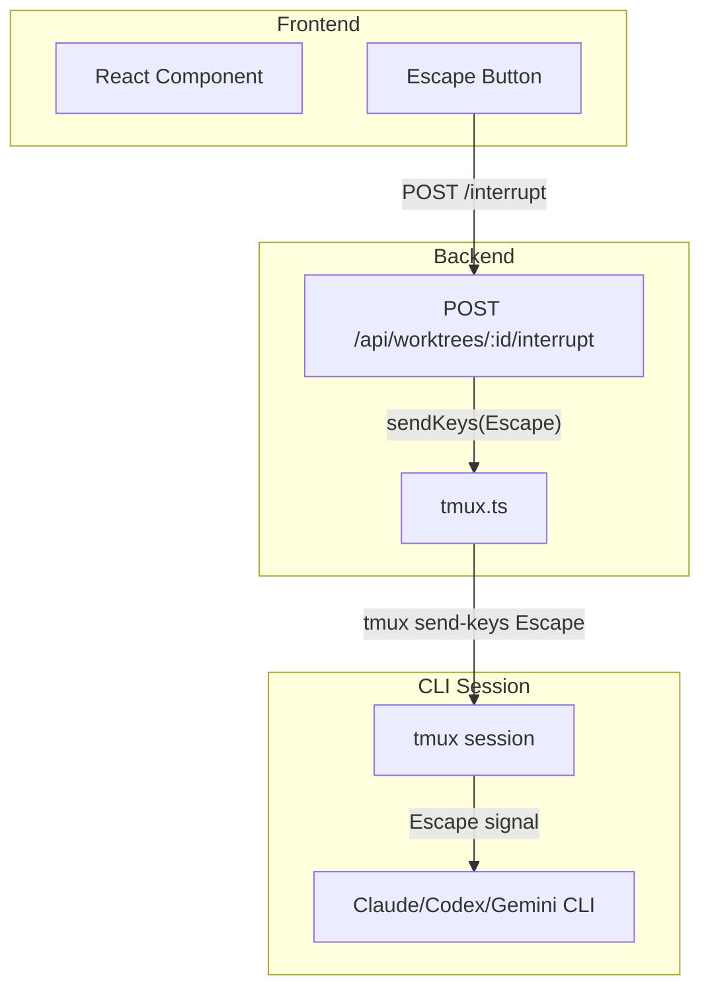
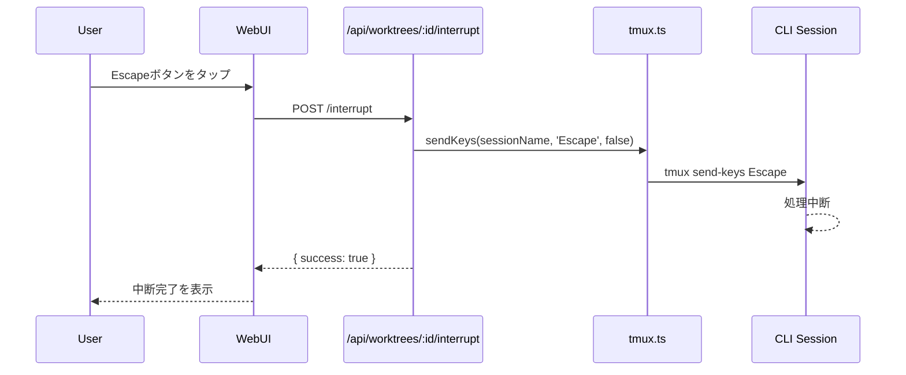
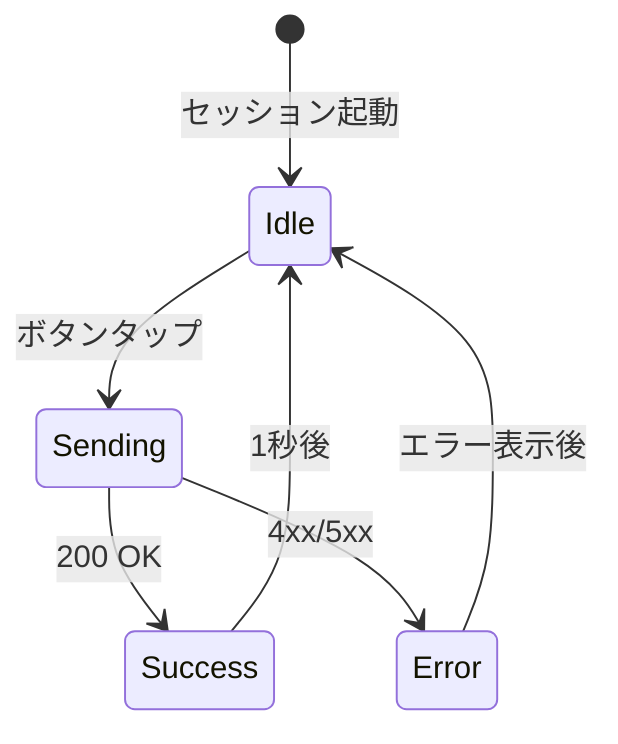

# Issue #46 設計方針書: エスケープ入力機能

## 概要

| 項目 | 内容 |
|------|------|
| **Issue番号** | #46 |
| **タイトル** | エスケープを入力可能にしたい |
| **目的** | 誤送信時にCLIツールの処理を一時停止できるようにする |
| **優先度** | Medium |

### 背景・課題

ユーザーが誤ってメッセージを送信してしまった場合、現状では処理の中断手段がない。Claude Code等のCLIツールはEscapeキーで処理を中断できるため、この機能をWebUIから利用可能にする必要がある。

---

## 1. アーキテクチャ設計

### 1.1 システム構成図



### 1.2 処理フロー



---

## 2. 技術選定

| カテゴリ | 選定技術 | 選定理由 |
|---------|---------|---------|
| キー送信 | tmux send-keys | 既存インフラを活用、新規依存なし |
| API | Next.js API Routes | 既存技術スタック |
| UI | React Component | 既存技術スタック |

### 2.1 代替案との比較

| 方式 | メリット | デメリット | 採用 |
|------|---------|----------|------|
| **tmux send-keys Escape** | シンプル、既存実装流用 | なし | ✅ |
| PTY直接制御 | 低レベル制御可能 | 複雑、既存アーキテクチャ変更 | ❌ |
| プロセスシグナル(SIGINT) | 確実な中断 | tmux経由で複雑 | ❌ |

---

## 3. API設計

### 3.1 新規エンドポイント

```
POST /api/worktrees/:id/interrupt
```

#### リクエスト

```typescript
interface InterruptRequest {
  cliToolId?: CLIToolType;  // Optional: 特定のCLIツールのみ中断
}
```

#### レスポンス

```typescript
// 成功時 (200)
interface InterruptResponse {
  success: true;
  message: string;
  interrupted: {
    cliToolId: CLIToolType;
    sessionName: string;
  }[];
}

// エラー時 (4xx/5xx)
interface ErrorResponse {
  error: string;
}
```

#### エラーケース

| ステータス | 条件 | メッセージ |
|-----------|------|----------|
| 404 | Worktree not found | `Worktree '{id}' not found` |
| 404 | No active sessions | `No active sessions found` |
| 500 | tmux error | `Failed to send interrupt` |

### 3.2 実装詳細

```typescript
// src/app/api/worktrees/[id]/interrupt/route.ts

export async function POST(
  request: NextRequest,
  { params }: { params: { id: string } }
) {
  // 1. Worktree存在確認
  // 2. 実行中のセッションを取得
  // 3. Escapeキーを送信
  // 4. 結果を返却
}
```

---

## 4. tmux拡張設計

### 4.1 新規関数

```typescript
// src/lib/tmux.ts に追加

/**
 * Send special key to tmux session
 *
 * @param sessionName - Target session name
 * @param key - Special key name (e.g., 'Escape', 'C-c')
 */
export async function sendSpecialKey(
  sessionName: string,
  key: 'Escape' | 'C-c' | 'C-d'
): Promise<void>;
```

### 4.2 tmuxキーマッピング

| 入力 | tmuxコマンド | 用途 |
|------|-------------|------|
| Escape | `tmux send-keys -t {session} Escape` | 処理中断 |
| Ctrl+C | `tmux send-keys -t {session} C-c` | シグナル送信（将来拡張） |

---

## 5. UI設計

### 5.1 ボタン配置

#### デスクトップ

```
┌─────────────────────────────────────────────┐
│ [メッセージ入力欄                  ] [⏹] [→] │
└─────────────────────────────────────────────┘
                                     ↑    ↑
                                  Stop  Send
```

#### モバイル

```
┌─────────────────────────────────────────────┐
│ [/] [メッセージ入力欄            ] [⏹] [→]  │
└─────────────────────────────────────────────┘
                                    ↑    ↑
                                 Stop  Send
```

### 5.2 ボタン表示条件

| 条件 | 表示 |
|------|------|
| セッション実行中 | 表示（アクティブ） |
| セッション未起動 | 非表示 or disabled |
| 処理完了待ち（ready） | 表示（アクティブ） |

### 5.3 UIコンポーネント

```typescript
// src/components/worktree/InterruptButton.tsx

interface InterruptButtonProps {
  worktreeId: string;
  cliToolId: CLIToolType;
  disabled?: boolean;
  onInterrupt?: () => void;
}

export function InterruptButton({
  worktreeId,
  cliToolId,
  disabled,
  onInterrupt,
}: InterruptButtonProps): JSX.Element;
```

### 5.4 アイコン・スタイル

```typescript
// アイコン: ストップアイコン ⏹
// 色: 警告色（オレンジ系）
// サイズ: 送信ボタンと同等

const buttonStyle = {
  base: 'p-2 rounded-full transition-colors',
  active: 'text-orange-600 hover:bg-orange-50',
  disabled: 'text-gray-300 cursor-not-allowed',
};

// SVGアイコン（ストップ）
const StopIcon = () => (
  <svg className="h-5 w-5" fill="currentColor" viewBox="0 0 24 24">
    <rect x="6" y="6" width="12" height="12" rx="2" />
  </svg>
);
```

---

## 6. CLI Tool インターフェース拡張

### 6.1 ICLITool拡張

```typescript
// src/lib/cli-tools/types.ts

export interface ICLITool {
  // 既存メソッド...

  /**
   * 処理を中断（Escapeキー送信）
   * @param worktreeId - Worktree ID
   */
  interrupt(worktreeId: string): Promise<void>;
}
```

### 6.2 BaseCLITool実装

```typescript
// src/lib/cli-tools/base.ts

abstract class BaseCLITool implements ICLITool {
  // 既存実装...

  /**
   * Default implementation: send Escape key
   */
  async interrupt(worktreeId: string): Promise<void> {
    const sessionName = this.getSessionName(worktreeId);
    await sendSpecialKey(sessionName, 'Escape');
  }
}
```

---

## 7. セキュリティ設計

### 7.1 認証・認可

- 既存の `MCBD_AUTH_TOKEN` による認証を継続
- Worktree所有者のみ中断可能（既存のWorktree存在チェックで担保）

### 7.2 レート制限

| 設定 | 値 | 理由 |
|------|-----|------|
| 連続呼び出し制限 | 1秒間隔 | 連打防止 |
| 最大呼び出し回数 | 10回/分 | DoS防止 |

実装はフロントエンドのdebounceで対応（バックエンドでの制限は過剰）。

---

## 8. エラーハンドリング

### 8.1 エラーケース

| ケース | 対応 | ユーザー表示 |
|--------|------|-------------|
| セッション未起動 | 404を返却 | 「セッションが起動していません」 |
| tmuxエラー | 500を返却 | 「中断に失敗しました」 |
| ネットワークエラー | リトライ1回 | 「通信エラー。再試行してください」 |

### 8.2 UI状態遷移



---

## 9. テスト設計

### 9.1 ユニットテスト

```typescript
// tests/unit/interrupt.test.ts

describe('sendSpecialKey', () => {
  it('should send Escape key to session', async () => {
    // ...
  });

  it('should throw error if session not found', async () => {
    // ...
  });
});
```

### 9.2 統合テスト

```typescript
// tests/integration/interrupt.test.ts

describe('POST /api/worktrees/:id/interrupt', () => {
  it('should interrupt running session', async () => {
    // 1. セッション起動
    // 2. メッセージ送信
    // 3. /interrupt呼び出し
    // 4. 処理中断確認
  });
});
```

### 9.3 E2Eテスト

```typescript
// tests/e2e/interrupt.spec.ts

test('user can interrupt processing with Escape button', async ({ page }) => {
  // 1. メッセージ送信
  // 2. Escapeボタンをクリック
  // 3. 処理が中断されたことを確認
});
```

---

## 10. 実装タスク

### Phase 1: バックエンド

| タスクID | タスク | 成果物 | 依存 |
|----------|--------|--------|------|
| 1.1 | sendSpecialKey関数追加 | `src/lib/tmux.ts` | なし |
| 1.2 | ICLITool.interrupt追加 | `src/lib/cli-tools/types.ts` | なし |
| 1.3 | BaseCLITool.interrupt実装 | `src/lib/cli-tools/base.ts` | 1.1, 1.2 |
| 1.4 | /interrupt APIエンドポイント | `src/app/api/worktrees/[id]/interrupt/route.ts` | 1.3 |

### Phase 2: フロントエンド

| タスクID | タスク | 成果物 | 依存 |
|----------|--------|--------|------|
| 2.1 | InterruptButton コンポーネント | `src/components/worktree/InterruptButton.tsx` | 1.4 |
| 2.2 | MessageInputへの統合 | `src/components/worktree/MessageInput.tsx` | 2.1 |
| 2.3 | モバイル対応 | `src/components/worktree/MessageInput.tsx` | 2.2 |

### Phase 3: テスト

| タスクID | タスク | 成果物 | 依存 |
|----------|--------|--------|------|
| 3.1 | ユニットテスト | `tests/unit/interrupt.test.ts` | 1.4 |
| 3.2 | 統合テスト | `tests/integration/interrupt.test.ts` | 2.3 |

---

## 11. 設計上の決定事項とトレードオフ

### 11.1 採用した設計

| 決定事項 | 理由 | トレードオフ |
|---------|------|-------------|
| tmux send-keys使用 | 既存インフラ活用 | CLI tool依存の中断挙動 |
| 単一Escapeボタン | シンプルなUX | 複数キー送信不可 |
| ICLITool拡張 | 将来のCLI tool追加に対応 | 実装コスト増 |

### 11.2 CLI tool別の挙動

| CLI Tool | Escape時の挙動 |
|----------|---------------|
| Claude Code | 処理中断、プロンプトに戻る |
| Codex CLI | 処理中断 |
| Gemini CLI | 未検証（要確認） |

---

## 12. 将来拡張

### 12.1 検討事項

- **Ctrl+C対応**: より強力な中断（SIGINT）
- **複数キー対応**: Ctrl+D（EOF）など
- **キーボードショートカット**: PC版でのEscキー直接入力

### 12.2 互換性

新規APIの追加のため、既存機能への影響なし。

---

## 13. 受入条件

- [ ] `/api/worktrees/:id/interrupt` APIが実装されている
- [ ] Escapeボタンがメッセージ入力欄に表示される
- [ ] ボタンタップでCLI処理が中断される
- [ ] モバイル/デスクトップ両方で動作する
- [ ] セッション未起動時は適切にエラーハンドリングされる
- [ ] ユニットテストが追加されている

---

## 14. 関連ドキュメント

- [tmux.ts](../../src/lib/tmux.ts) - tmuxラッパー
- [CLI Tools](../../src/lib/cli-tools/) - CLIツール抽象化層
- [MessageInput](../../src/components/worktree/MessageInput.tsx) - メッセージ入力コンポーネント
