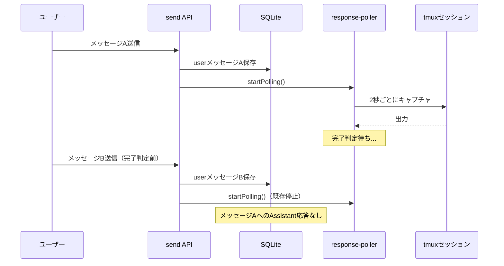
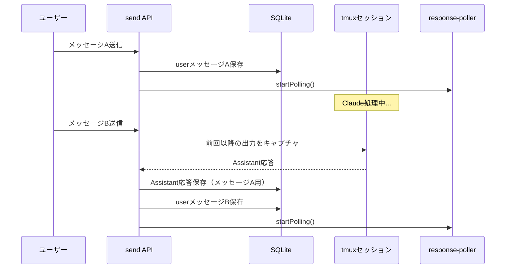
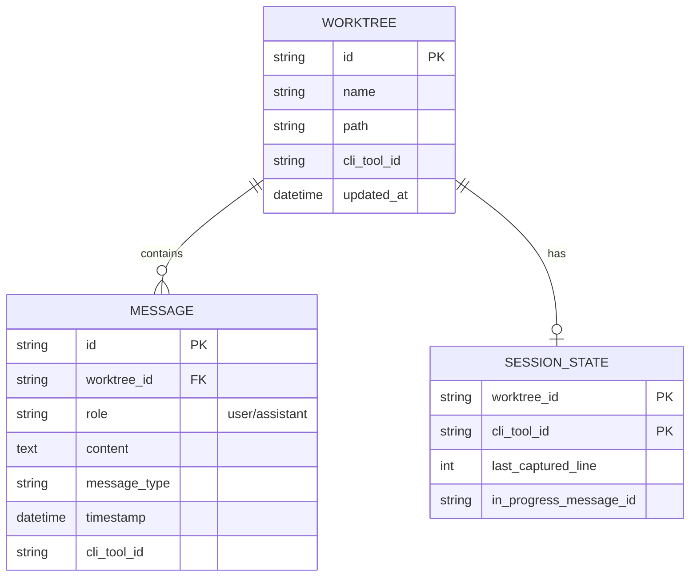

# 設計方針書: Issue #53 Assistant応答保存ロジック改善

## 1. 概要

### 対象Issue
- **Issue #53**: fix: Assistant応答の保存ロジックを「次のユーザー入力まで」方式に変更
- **関連Issue**: #51 assistantの履歴がうまく取得できていない

### 目的
Assistant（Claude CLI）の応答履歴が保存されないバグを修正する。現在の「完了判定ポーリング」方式から「次のユーザー入力トリガー」方式に変更し、確実にAssistant応答を保存する。

---

## 2. 現状分析

### 2.1 現在のアーキテクチャ



### 2.2 問題の根本原因

`src/app/api/worktrees/[id]/send/route.ts` の処理フロー:

```typescript
// 1. userメッセージ即座に保存
const message = createMessage(db, { role: 'user', ... });

// 2. セッション状態リセット（ここが問題）
updateSessionState(db, params.id, cliToolId, 0);  // lastCapturedLine = 0
clearInProgressMessageId(db, params.id, cliToolId);

// 3. 新規ポーリング開始（既存ポーラー停止）
startPolling(params.id, cliToolId);
```

**問題点**:
- userメッセージは同期的に即座保存
- Assistant応答は非同期（ポーリング完了判定待ち）
- 次のユーザー入力でセッション状態リセット → 前の応答追跡が消失

---

## 3. 新しいアーキテクチャ

### 3.1 設計方針: 「次のユーザー入力トリガー」方式



### 3.2 処理フロー（新）

```
ユーザーメッセージ送信時:
  1. [NEW] 前回userメッセージ以降のtmux出力をキャプチャ
  2. [NEW] クリーニングしてAssistant応答として保存（空でなければ）
  3. 新しいuserメッセージを保存
  4. セッション状態を更新
  5. ポーリング開始
```

---

## 4. データモデル設計

### 4.1 既存テーブル（変更なし）



### 4.2 セッション状態の役割変更

| フィールド | 現在の用途 | 新しい用途 |
|-----------|-----------|-----------|
| `last_captured_line` | ポーリング位置追跡 | 前回保存位置の記録 |
| `in_progress_message_id` | 進行中メッセージID | 廃止または補助的利用 |

---

## 5. API設計

### 5.1 変更対象API

#### POST `/api/worktrees/:id/send`

**変更前**:
```typescript
export async function POST(request, { params }) {
  // ... validation ...

  // Create user message
  const message = createMessage(db, { role: 'user', ... });

  // Reset session state
  updateSessionState(db, params.id, cliToolId, 0);
  clearInProgressMessageId(db, params.id, cliToolId);

  // Start polling
  startPolling(params.id, cliToolId);

  return NextResponse.json(message, { status: 201 });
}
```

**変更後**:
```typescript
export async function POST(request, { params }) {
  // ... validation ...

  // [NEW] Save pending assistant response before new user message
  await savePendingAssistantResponse(db, params.id, cliToolId);

  // Create user message
  const message = createMessage(db, { role: 'user', ... });

  // Update session state (記録位置のみ更新、リセットしない)
  const currentLineCount = await getCurrentLineCount(params.id, cliToolId);
  updateSessionState(db, params.id, cliToolId, currentLineCount);

  // Start polling (for realtime display and final save)
  startPolling(params.id, cliToolId);

  return NextResponse.json(message, { status: 201 });
}
```

### 5.2 新規関数設計

#### `savePendingAssistantResponse()`

```typescript
/**
 * 前回のuserメッセージ以降のAssistant応答を保存
 *
 * @param db - データベースインスタンス
 * @param worktreeId - ワークツリーID
 * @param cliToolId - CLIツールID
 * @param userMessageTimestamp - 新しいuserメッセージのタイムスタンプ（整合性確保用）
 * @returns 保存されたメッセージまたはnull
 */
async function savePendingAssistantResponse(
  db: Database.Database,
  worktreeId: string,
  cliToolId: CLIToolType,
  userMessageTimestamp: Date
): Promise<ChatMessage | null> {
  // 1. セッション状態から前回の保存位置を取得
  const sessionState = getSessionState(db, worktreeId, cliToolId);
  const lastCapturedLine = sessionState?.lastCapturedLine || 0;

  // 2. tmux出力をキャプチャ
  const output = await captureSessionOutput(worktreeId, cliToolId, 10000);
  if (!output) return null;

  // 3. 現在の行数を取得し、重複保存を防止
  const lines = output.split('\n');
  const currentLineCount = lines.length;

  // [MUST FIX #1] 重複保存防止: 新しい出力がない場合はスキップ
  if (currentLineCount <= lastCapturedLine) {
    console.log(`[savePendingAssistantResponse] No new output (current: ${currentLineCount}, last: ${lastCapturedLine})`);
    return null;
  }

  // 4. 前回位置以降の出力を抽出
  const newLines = lines.slice(lastCapturedLine);
  const newOutput = newLines.join('\n');

  // 5. クリーニング
  const cleanedResponse = cleanCliResponse(newOutput, cliToolId);

  // 6. 空チェック
  if (!cleanedResponse || cleanedResponse.trim() === '') {
    // 出力はあったが、クリーニング後に空の場合は位置のみ更新
    updateSessionState(db, worktreeId, cliToolId, currentLineCount);
    return null;
  }

  // [MUST FIX #2] タイムスタンプ整合性: userメッセージより1ms前に設定
  // これにより会話の時系列順序が正しく保たれる
  const assistantTimestamp = new Date(userMessageTimestamp.getTime() - 1);

  // 7. DB保存
  const message = createMessage(db, {
    worktreeId,
    role: 'assistant',
    content: cleanedResponse,
    messageType: 'normal',
    timestamp: assistantTimestamp,
    cliToolId,
  });

  // 8. セッション状態を更新（保存位置を記録）
  updateSessionState(db, worktreeId, cliToolId, currentLineCount);

  // 9. WebSocket配信
  broadcastMessage('message', { worktreeId, message });

  console.log(`[savePendingAssistantResponse] Saved assistant response (lines ${lastCapturedLine}-${currentLineCount})`);

  return message;
}
```

#### `cleanCliResponse()` - 共通クリーニング関数

```typescript
/**
 * CLIツールの出力をクリーニング
 * response-poller.ts の cleanClaudeResponse/cleanGeminiResponse を統合
 *
 * @param output - 生の出力
 * @param cliToolId - CLIツールID
 * @returns クリーニング後の出力
 */
function cleanCliResponse(output: string, cliToolId: CLIToolType): string {
  // CLIツール別にクリーニング関数を呼び出し
  switch (cliToolId) {
    case 'claude':
      return cleanClaudeResponse(output);
    case 'gemini':
      return cleanGeminiResponse(output);
    case 'codex':
      return cleanCodexResponse(output);
    default:
      return output;
  }
}
```

### 5.3 API変更（更新）

#### POST `/api/worktrees/:id/send`

```typescript
export async function POST(request, { params }) {
  // ... validation ...

  // タイムスタンプを先に生成（整合性確保）
  const userMessageTimestamp = new Date();

  // [NEW] Save pending assistant response before new user message
  // タイムスタンプを渡して時系列順序を保証
  await savePendingAssistantResponse(db, params.id, cliToolId, userMessageTimestamp);

  // Create user message with the pre-generated timestamp
  const message = createMessage(db, {
    role: 'user',
    content: body.content,
    timestamp: userMessageTimestamp,  // 同じタイムスタンプを使用
    // ...
  });

  // Update session state with current line count (not reset to 0)
  const currentLineCount = await getCurrentLineCount(params.id, cliToolId);
  updateSessionState(db, params.id, cliToolId, currentLineCount);

  // Start polling (for realtime display and final save)
  startPolling(params.id, cliToolId);

  return NextResponse.json(message, { status: 201 });
}
```

---

## 6. 設計パターン

### 6.1 採用パターン

| パターン | 適用箇所 | 理由 |
|---------|---------|------|
| **Event-Driven** | ユーザー入力をトリガーに | 確実なタイミング制御 |
| **Lazy Evaluation** | 次の入力時に前の応答保存 | リソース効率化 |
| **Fallback** | ポーリングを補助的に維持 | 最終メッセージ対応 |

### 6.2 責務分離

```
src/app/api/worktrees/[id]/send/route.ts
  └─ メッセージ送信のオーケストレーション

src/lib/assistant-response-saver.ts [NEW]
  └─ Assistant応答保存ロジックの集約

src/lib/response-poller.ts
  └─ リアルタイム表示用ポーリング（補助的役割に変更）

src/lib/db.ts
  └─ データアクセス（変更なし）
```

---

## 7. エラーハンドリング

### 7.1 エラーケースと対応

| ケース | 対応 |
|--------|------|
| tmuxセッション未起動 | 保存スキップ、userメッセージのみ保存 |
| キャプチャ失敗 | ログ出力、userメッセージは保存継続 |
| クリーニング後に空 | 保存スキップ（正常動作） |
| DB保存失敗 | エラーログ、リトライなし（次回で回復） |

### 7.2 例外処理方針

```typescript
async function savePendingAssistantResponse(...) {
  try {
    // ... 保存処理 ...
  } catch (error) {
    // ログ出力のみ、例外は伝播させない
    // userメッセージ保存を妨げない
    console.error('[savePendingAssistantResponse] Error:', error);
    return null;
  }
}
```

---

## 8. 最後のメッセージへの対応

### 8.1 問題
「次のユーザー入力トリガー」方式では、最後のuserメッセージへのAssistant応答は次の入力がないと保存されない。

### 8.2 解決策

#### 方式A: ポーリング維持（推奨）
現在のポーリング機構を補助的に維持し、完了判定成功時に保存。

```typescript
// response-poller.ts の checkForResponse() 内で重複保存を防止

async function checkForResponse(worktreeId: string, cliToolId: CLIToolType): Promise<boolean> {
  const db = getDbInstance();
  const sessionState = getSessionState(db, worktreeId, cliToolId);
  const lastCapturedLine = sessionState?.lastCapturedLine || 0;

  // ... 既存の出力キャプチャとレスポンス抽出ロジック ...

  // [MUST FIX #1] 重複保存防止:
  // savePendingAssistantResponse()で既に保存済みの場合をスキップ
  // result.lineCount が lastCapturedLine と同じなら、既に保存済み
  if (result.lineCount <= lastCapturedLine) {
    console.log(`[checkForResponse] Already saved up to line ${lastCapturedLine}, skipping`);
    return false;
  }

  // 既存の保存ロジック...
  // ただし、保存前に再度行数チェックを行い、
  // savePendingAssistantResponse()との競合を防止
  const currentSessionState = getSessionState(db, worktreeId, cliToolId);
  if (currentSessionState && result.lineCount <= currentSessionState.lastCapturedLine) {
    console.log(`[checkForResponse] Race condition detected, skipping save`);
    return false;
  }

  // DB保存とセッション状態更新
  const message = createMessage(db, { ... });
  updateSessionState(db, worktreeId, cliToolId, result.lineCount);
  broadcastMessage('message', { worktreeId, message });

  return true;
}
```

#### 方式B: セッション終了時保存
セッション終了検出時（`isSessionRunning() === false`）に保存。

#### 方式C: タイムアウト保存
一定時間（例: 5分）ユーザー入力がない場合に保存。

### 8.3 採用方針
**方式Aを採用**。既存のポーリング機構を活用し、変更を最小限に抑える。

### 8.4 重複保存防止の仕組み

```
┌─────────────────────────────────────────────────────────────┐
│                    重複保存防止フロー                        │
├─────────────────────────────────────────────────────────────┤
│                                                             │
│  session_states.last_captured_line = 100                    │
│                                                             │
│  ┌─────────────────────┐    ┌─────────────────────┐        │
│  │ savePending...()    │    │ checkForResponse()  │        │
│  │ (send API経由)      │    │ (ポーリング)        │        │
│  └─────────┬───────────┘    └─────────┬───────────┘        │
│            │                          │                     │
│            ▼                          ▼                     │
│  currentLine=150 > 100?    currentLine=150 > 100?          │
│       ✓ YES                     ✓ YES                       │
│            │                          │                     │
│            ▼                          │                     │
│  保存 & 更新                          │                     │
│  last_captured_line=150               │                     │
│            │                          ▼                     │
│            │               再チェック: 150 > 150?           │
│            │                    ✗ NO (スキップ)             │
│            │                          │                     │
│            ▼                          ▼                     │
│     Assistant応答            重複保存を防止                 │
│     1件のみ保存                                             │
└─────────────────────────────────────────────────────────────┘
```

---

## 9. 変更影響範囲

### 9.1 変更対象ファイル

| ファイル | 変更内容 | 影響度 |
|----------|---------|--------|
| `src/app/api/worktrees/[id]/send/route.ts` | 保存ロジック追加 | 高 |
| `src/lib/assistant-response-saver.ts` | 新規作成 | 新規 |
| `src/lib/response-poller.ts` | 重複保存防止追加 | 低 |

### 9.2 影響を受けないファイル
- `src/lib/db.ts` - 変更なし
- `src/app/api/worktrees/[id]/current-output/route.ts` - 変更なし
- フロントエンドコンポーネント - 変更なし

---

## 10. テスト戦略

### 10.1 単体テスト

```typescript
// __tests__/lib/assistant-response-saver.test.ts

describe('savePendingAssistantResponse', () => {
  it('前回位置以降の出力をAssistant応答として保存する', async () => {
    // Setup: lastCapturedLine = 10, 現在の出力 = 20行
    // Assert: 11-20行目がAssistant応答として保存される
  });

  it('クリーニング後に空の場合は保存しない', async () => {
    // Setup: バナーのみの出力
    // Assert: 保存されない、nullが返る
  });

  it('tmuxセッション未起動時はnullを返す', async () => {
    // Setup: セッション未起動
    // Assert: 例外なし、nullが返る
  });

  // [MUST FIX #1] 重複保存防止のテスト
  it('currentLineCount <= lastCapturedLine の場合は保存しない', async () => {
    // Setup: lastCapturedLine = 100, 現在の出力 = 100行（変化なし）
    // Assert: 保存されない、nullが返る
    const db = getDbInstance();
    updateSessionState(db, 'test-worktree', 'claude', 100);

    const result = await savePendingAssistantResponse(
      db, 'test-worktree', 'claude', new Date()
    );

    expect(result).toBeNull();
  });

  // [MUST FIX #2] タイムスタンプ整合性のテスト
  it('Assistant応答のタイムスタンプはuserメッセージより前になる', async () => {
    // Setup: userMessageTimestamp = 2026-01-15T12:00:00.000Z
    // Assert: assistantTimestamp = 2026-01-15T11:59:59.999Z (1ms前)
    const userTimestamp = new Date('2026-01-15T12:00:00.000Z');
    const db = getDbInstance();

    const result = await savePendingAssistantResponse(
      db, 'test-worktree', 'claude', userTimestamp
    );

    if (result) {
      expect(result.timestamp.getTime()).toBeLessThan(userTimestamp.getTime());
      expect(result.timestamp.getTime()).toBe(userTimestamp.getTime() - 1);
    }
  });
});
```

### 10.2 結合テスト

```typescript
// __tests__/integration/message-flow.test.ts

describe('メッセージフロー', () => {
  it('連続送信時にAssistant応答が保存される', async () => {
    // 1. メッセージA送信
    // 2. Claude応答を模擬
    // 3. メッセージB送信
    // Assert: メッセージAへのAssistant応答がDBに存在
  });

  // [MUST FIX #1] 重複保存防止の結合テスト
  it('savePendingとpollerが競合しても重複保存されない', async () => {
    // Setup:
    // 1. メッセージA送信 → ポーリング開始
    // 2. Claude応答生成（line 100-150）
    // 3. メッセージB送信 → savePendingAssistantResponse実行
    // 4. ポーリングがcheckForResponseを実行

    // Assert:
    // - Assistant応答は1件のみ保存される
    // - last_captured_lineは150に更新される
    const messages = getMessages(db, 'test-worktree');
    const assistantMessages = messages.filter(m => m.role === 'assistant');
    expect(assistantMessages.length).toBe(1);
  });

  // [MUST FIX #2] タイムスタンプ整合性の結合テスト
  it('会話履歴が正しい時系列順序で表示される', async () => {
    // Setup:
    // 1. メッセージA送信 (T=1000)
    // 2. Claude応答生成
    // 3. メッセージB送信 (T=2000) → Assistant応答保存 (T=1999)

    // Assert:
    // - メッセージの順序: userA → assistantA → userB
    // - assistantA.timestamp < userB.timestamp
    const messages = getMessages(db, 'test-worktree');
    const sorted = [...messages].sort((a, b) =>
      a.timestamp.getTime() - b.timestamp.getTime()
    );

    expect(sorted[0].role).toBe('user');     // userA
    expect(sorted[1].role).toBe('assistant'); // assistantA
    expect(sorted[2].role).toBe('user');     // userB
    expect(sorted[1].timestamp.getTime()).toBeLessThan(sorted[2].timestamp.getTime());
  });
});
```

### 10.3 エッジケーステスト

```typescript
// __tests__/lib/assistant-response-saver.edge-cases.test.ts

describe('エッジケース', () => {
  it('tmuxバッファがリセットされた場合も正しく動作する', async () => {
    // Setup: lastCapturedLine = 500, 現在の出力 = 50行（バッファリセット）
    // Assert: 全50行を新しい応答として扱う
  });

  it('プロンプト応答後のAssistant出力が正しく保存される', async () => {
    // Setup: messageType='prompt'の後に通常応答
    // Assert: 通常応答が正しく保存される
  });

  it('超高速連続送信でも整合性が保たれる', async () => {
    // Setup: 100ms間隔で5メッセージ連続送信
    // Assert: 全てのAssistant応答が正しく保存される
  });
});
```

---

## 11. 実装計画

### Phase 1: 基盤実装
1. `assistant-response-saver.ts` 新規作成
2. `savePendingAssistantResponse()` 実装
3. 単体テスト作成

### Phase 2: API統合
1. `send/route.ts` に保存ロジック組み込み
2. セッション状態更新ロジック修正
3. 結合テスト作成

### Phase 3: 重複防止
1. `response-poller.ts` に重複保存チェック追加
2. エッジケーステスト

---

## 12. トレードオフと決定事項

| 決定事項 | 採用理由 | トレードオフ |
|---------|---------|-------------|
| 次の入力をトリガーに | 確実性、シンプルさ | 最後の応答は別途対応必要 |
| ポーリング維持 | 最後の応答対応、リアルタイム表示 | 複雑性は残る |
| 重複保存チェック | データ整合性 | 若干のオーバーヘッド |
| 新規ファイル作成 | 責務分離、テスト容易性 | ファイル数増加 |

---

## 13. 制約条件の遵守

### CLAUDE.md原則チェック

| 原則 | 遵守状況 | 説明 |
|------|---------|------|
| SOLID - 単一責任 | ✅ | `assistant-response-saver.ts`に保存ロジック集約 |
| SOLID - 開放閉鎖 | ✅ | 既存コードへの変更を最小化 |
| KISS | ✅ | 複雑な完了判定を回避 |
| YAGNI | ✅ | 必要な機能のみ実装 |
| DRY | ✅ | クリーニングロジックは既存を再利用 |

---

## 14. 受け入れ条件

- [ ] ユーザーが連続でメッセージを送信しても、各userメッセージに対応するassistantメッセージが保存される
- [ ] 履歴表示で「Waiting for response」が不適切に表示されない
- [ ] 既存のリアルタイム表示（current-output API）は維持される
- [ ] 単体テストが追加されている
- [ ] 既存テストが全てパスする
