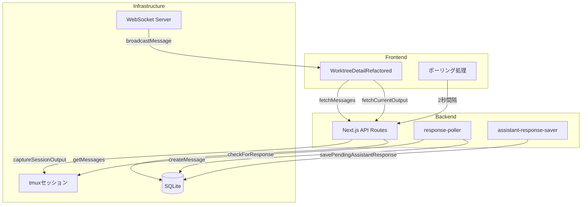
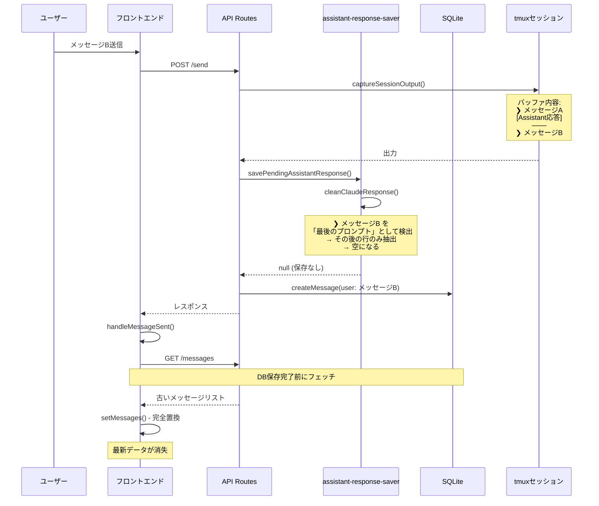
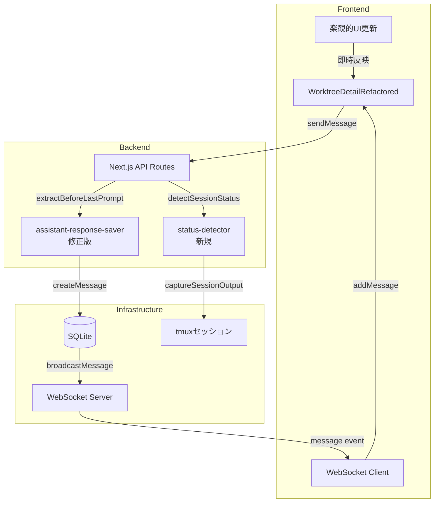

# 設計方針書: Issue #54 セッション状態管理の改善

**作成日**: 2026-01-16
**更新日**: 2026-01-16
**ステータス**: レビュー済み・実装準備完了

---

## 1. 概要

### 1.1 対象Issue
- **Issue #54**: セッションが切り替わるとステータス管理がうまくいかなくなる

### 1.2 症状
1. 処理中にもかかわらず緑（ready）が点灯する
2. yes/noの指示があるにもかかわらず、それに対する応答ができない
3. Assistant履歴が正しく更新されない（最新の応答が消える、古い応答が表示される）
4. Assistant応答がDBに保存されない

### 1.3 根本原因
フロントエンドの状態更新とバックエンドのDB保存/ステータス検出のタイミングがずれる**レースコンディション**、および**`cleanClaudeResponse()`のロジック問題**

---

## 2. アーキテクチャ設計

### 2.1 現在のシステム構成



### 2.2 問題のあるデータフロー



### 2.3 新しいアーキテクチャ



---

## 3. 問題の詳細分析

### 3.1 問題1: ステータス検出ロジックの欠陥

**ファイル**: `src/app/api/worktrees/route.ts` (lines 74-80)

```typescript
const hasInputPrompt = /^[>❯]\s*$/m.test(lastLines);
if (!hasInputPrompt) {
  isProcessing = true;  // ← 入力プロンプトがないと無条件で「処理中」判定
}
```

**問題点**:
- セッション切り替え直後、出力が不安定な状態で誤判定
- 中間状態（初期化中、遷移中）の考慮がない

### 3.2 問題2: メッセージの完全置換（表示の問題）

**ファイル**: `src/components/worktree/WorktreeDetailRefactored.tsx` (lines 825-836)

```typescript
const fetchMessages = useCallback(async (): Promise<void> => {
  const data: ChatMessage[] = await response.json();
  actions.setMessages(parseMessageTimestamps(data));  // ← 全メッセージを置換
}, [worktreeId, actions]);
```

**問題点**:
- 新しいメッセージ配列で全体を置換
- DB保存とフェッチのタイミングがずれると古いデータで上書き

### 3.3 問題3: DB保存待たずにフェッチ実行

**ファイル**: `src/components/worktree/WorktreeDetailRefactored.tsx` (lines 959-967)

```typescript
const handleMessageSent = useCallback(() => {
  void fetchMessages();  // ← メッセージ送信直後にフェッチ（DB保存完了を待たない）
  void fetchCurrentOutput();
}, [fetchMessages, fetchCurrentOutput]);
```

### 3.4 問題4: Assistant応答がDBに保存されない（保存の問題）

**ファイル**: `src/lib/response-poller.ts` (lines 66-77)

```typescript
// Find the last user prompt line index
let lastUserPromptIndex = -1;
for (let i = lines.length - 1; i >= 0; i--) {
  if (/^❯\s+\S/.test(lines[i])) {
    lastUserPromptIndex = i;
    break;
  }
}

// Extract lines after the last user prompt
const startIndex = lastUserPromptIndex >= 0 ? lastUserPromptIndex + 1 : 0;
const responseLines = lines.slice(startIndex);  // ← 問題: 最後のプロンプト以降のみ抽出
```

**発生フロー**:
```
tmuxバッファの状態（ユーザーがメッセージBを送信した時点）:
─────────────────────────────────────
❯ メッセージA（前回のユーザー入力）
[前回のassistant応答 - 保存したい内容]
───
❯ メッセージB（今回のユーザー入力）  ← cleanClaudeResponse()はここを検出
[Claude処理中...]
─────────────────────────────────────

savePendingAssistantResponse()の処理:
1. lastCapturedLineから現在までの行を抽出
2. cleanClaudeResponse()を呼び出し
3. 「最後のユーザープロンプト」= ❯ メッセージB を検出
4. その後の行だけを抽出 → Claude処理中なので空
5. 結果: 前回のassistant応答が保存されない
```

---

## 4. 詳細設計

### 4.1 ステータス検出ロジックの改善

**新規作成**: `src/lib/status-detector.ts`

```typescript
import { stripAnsi } from './cli-patterns';
import { detectPrompt } from './prompt-detector';
import { detectThinking } from './prompt-detector';
import type { CLIToolType } from './cli-tools/types';

export type SessionStatus = 'idle' | 'ready' | 'running' | 'waiting';
export type StatusConfidence = 'high' | 'low';

export interface StatusDetectionResult {
  status: SessionStatus;
  confidence: StatusConfidence;
  reason: string;
}

/**
 * Detect session status with confidence level
 */
export function detectSessionStatus(
  output: string,
  cliToolId: CLIToolType,
  lastOutputTimestamp?: Date
): StatusDetectionResult {
  const cleanOutput = stripAnsi(output);
  const lastLines = cleanOutput.split('\n').slice(-15).join('\n');

  // 1. 対話型プロンプト検出（最優先）
  const promptDetection = detectPrompt(cliToolId, lastLines);
  if (promptDetection.isPrompt) {
    return { status: 'waiting', confidence: 'high', reason: 'prompt_detected' };
  }

  // 2. 思考インジケーター検出
  if (detectThinking(cliToolId, lastLines)) {
    return { status: 'running', confidence: 'high', reason: 'thinking_indicator' };
  }

  // 3. 入力プロンプト検出
  const hasInputPrompt = /^[>❯]\s*$/m.test(lastLines);
  if (hasInputPrompt) {
    return { status: 'ready', confidence: 'high', reason: 'input_prompt' };
  }

  // 4. 出力の経過時間をチェック（新規追加）
  if (lastOutputTimestamp) {
    const elapsed = Date.now() - lastOutputTimestamp.getTime();
    if (elapsed > 5000) {
      // 5秒以上出力がない場合は処理完了の可能性
      return { status: 'ready', confidence: 'low', reason: 'no_recent_output' };
    }
  }

  // 5. デフォルト: 処理中（低信頼度）
  return { status: 'running', confidence: 'low', reason: 'default' };
}
```

### 4.2 Assistant応答保存ロジックの修正

**変更**: `src/lib/assistant-response-saver.ts`

```typescript
import { stripAnsi } from './cli-patterns';
import type { CLIToolType } from './cli-tools/types';

/**
 * Skip patterns for Claude-specific UI elements
 */
const CLAUDE_SKIP_PATTERNS = [
  /^[╭╮╰╯│─\s]+$/,  // Box drawing characters
  /Claude Code v[\d.]+/,  // Version info
  /^─{10,}$/,  // Separator lines
  /^❯\s*$/,  // Empty prompt lines
  /^\s*$/,  // Empty lines
  /CLAUDE_HOOKS_/,
  /\/bin\/claude/,
  /@.*\s+%/,
  /localhost/,
  /:3000/,
  /curl.*POST/,
  /export\s+/,
  /Tips for getting started/,
  /Welcome back/,
  /\?\s*for shortcuts/,
];

/**
 * Extract assistant response BEFORE the last user prompt
 *
 * This is the key fix for Issue #54 Problem 4:
 * - cleanClaudeResponse() extracts AFTER the last prompt (for response-poller)
 * - This function extracts BEFORE the last prompt (for savePendingAssistantResponse)
 *
 * @param output - Raw tmux output (new lines since last capture)
 * @param cliToolId - CLI tool ID
 * @returns Cleaned assistant response content
 */
export function extractAssistantResponseBeforeLastPrompt(
  output: string,
  cliToolId: CLIToolType
): string {
  if (cliToolId !== 'claude') {
    // For non-Claude tools, use simple trimming
    return output.trim();
  }

  const cleanOutput = stripAnsi(output);
  const lines = cleanOutput.split('\n');

  // Find the LAST user prompt (the new message that triggered this save)
  let lastUserPromptIndex = lines.length;
  for (let i = lines.length - 1; i >= 0; i--) {
    // User prompt pattern: ❯ followed by actual content
    if (/^❯\s+\S/.test(lines[i])) {
      lastUserPromptIndex = i;
      break;
    }
  }

  // Extract lines BEFORE the last user prompt
  const responseLines = lines.slice(0, lastUserPromptIndex);

  // Filter out UI elements
  const cleanedLines = responseLines.filter(line => {
    const trimmed = line.trim();
    if (!trimmed) return false;
    return !CLAUDE_SKIP_PATTERNS.some(pattern => pattern.test(trimmed));
  });

  return cleanedLines.join('\n').trim();
}

// Update savePendingAssistantResponse to use the new function
export async function savePendingAssistantResponse(
  db: Database.Database,
  worktreeId: string,
  cliToolId: CLIToolType,
  userMessageTimestamp: Date
): Promise<ChatMessage | null> {
  try {
    const sessionState = getSessionState(db, worktreeId, cliToolId);
    const lastCapturedLine = sessionState?.lastCapturedLine || 0;

    let output: string;
    try {
      output = await captureSessionOutput(worktreeId, cliToolId, SESSION_OUTPUT_BUFFER_SIZE);
    } catch {
      console.log(`[savePendingAssistantResponse] Failed to capture session output for ${worktreeId}`);
      return null;
    }

    if (!output) return null;

    const lines = output.split('\n');
    const currentLineCount = lines.length;

    if (currentLineCount <= lastCapturedLine) {
      console.log(`[savePendingAssistantResponse] No new output`);
      return null;
    }

    // Extract new lines since last capture
    const newLines = lines.slice(lastCapturedLine);
    const newOutput = newLines.join('\n');

    // ★ FIX: Use extractAssistantResponseBeforeLastPrompt instead of cleanCliResponse
    const cleanedResponse = extractAssistantResponseBeforeLastPrompt(newOutput, cliToolId);

    if (!cleanedResponse || cleanedResponse.trim() === '') {
      updateSessionState(db, worktreeId, cliToolId, currentLineCount);
      console.log(`[savePendingAssistantResponse] Cleaned response is empty`);
      return null;
    }

    const assistantTimestamp = new Date(userMessageTimestamp.getTime() - ASSISTANT_TIMESTAMP_OFFSET_MS);

    const message = createMessage(db, {
      worktreeId,
      role: 'assistant',
      content: cleanedResponse,
      messageType: 'normal',
      timestamp: assistantTimestamp,
      cliToolId,
    });

    updateSessionState(db, worktreeId, cliToolId, currentLineCount);
    broadcastMessage('message', { worktreeId, message });

    console.log(`[savePendingAssistantResponse] Saved assistant response`);
    return message;
  } catch (error) {
    console.error('[savePendingAssistantResponse] Error:', error);
    return null;
  }
}
```

### 4.3 メッセージ同期ユーティリティ

**新規作成**: `src/lib/message-sync.ts`

```typescript
import type { ChatMessage } from '@/types/models';

/** メッセージの最大保持数（メモリリーク対策） */
export const MAX_MESSAGES = 200;

/**
 * メッセージ同期ユーティリティ
 * 既存メッセージと新規メッセージをマージし、上限を維持
 */
export function mergeMessages(
  existing: ChatMessage[],
  incoming: ChatMessage[],
  maxMessages: number = MAX_MESSAGES
): ChatMessage[] {
  const existingIds = new Set(existing.map(m => m.id));
  const newMessages = incoming.filter(m => !existingIds.has(m.id));

  const merged = [...existing, ...newMessages]
    .sort((a, b) => new Date(a.timestamp).getTime() - new Date(b.timestamp).getTime());

  // 古いメッセージを削除して上限を維持
  if (merged.length > maxMessages) {
    return merged.slice(-maxMessages);
  }
  return merged;
}

/**
 * 楽観的メッセージを追加
 */
export function addOptimisticMessage(
  messages: ChatMessage[],
  newMessage: Omit<ChatMessage, 'id'>,
  tempId: string
): ChatMessage[] {
  const optimistic: ChatMessage = {
    ...newMessage,
    id: tempId,
    timestamp: new Date(),
  } as ChatMessage;

  const result = [...messages, optimistic];
  return result.slice(-MAX_MESSAGES);
}

/**
 * 楽観的メッセージを確定（一時IDを実IDに置換）
 */
export function confirmOptimisticMessage(
  messages: ChatMessage[],
  tempId: string,
  realId: string
): ChatMessage[] {
  return messages.map(m =>
    m.id === tempId ? { ...m, id: realId } : m
  );
}

/**
 * 楽観的メッセージを削除（サーバーエラー時）
 */
export function removeOptimisticMessage(
  messages: ChatMessage[],
  tempId: string
): ChatMessage[] {
  return messages.filter(m => m.id !== tempId);
}
```

### 4.4 handleMessageSentの改善

**変更**: `src/components/worktree/WorktreeDetailRefactored.tsx`

```typescript
/**
 * Handle message sent with optimistic UI update and rollback
 */
const handleMessageSent = useCallback(
  async (messageContent: string) => {
    const tempId = `temp-${Date.now()}`;
    const optimisticMessage: Partial<ChatMessage> = {
      id: tempId,
      role: 'user',
      content: messageContent,
      timestamp: new Date(),
      worktreeId,
    };

    // 1. 楽観的UI更新
    actions.addOptimisticMessage(optimisticMessage as ChatMessage);

    try {
      // 2. APIに送信
      const response = await worktreeApi.sendMessage(
        worktreeId,
        messageContent,
        effectiveCliTool
      );

      // 3. 成功: 一時IDを実IDに置換
      actions.confirmMessage(tempId, response.userMessage?.id || response.id);

      // 4. Assistant応答がある場合は追加
      if (response.assistantMessage) {
        actions.addMessage(response.assistantMessage);
      }
    } catch (error) {
      // 5. 失敗: 楽観的メッセージを削除
      actions.removeMessage(tempId);
      console.error('[handleMessageSent] Failed to send message:', error);
      // TODO: エラー通知をUIに表示
    }

    // 6. 現在の出力状態を更新（メッセージはWebSocket経由で受信）
    void fetchCurrentOutput();
  },
  [worktreeId, effectiveCliTool, actions, fetchCurrentOutput]
);
```

### 4.5 セッション切り替え時の状態リセット

**変更**: `src/components/worktree/WorktreeDetailRefactored.tsx`

```typescript
// worktreeIdが変更された時の処理
useEffect(() => {
  // 前のセッションの状態をクリア
  actions.clearPrompt();
  actions.setMessages([]);
  actions.setTerminalOutput('', '');

  // 初期ロードフラグをリセット
  initialLoadCompletedRef.current = false;
}, [worktreeId, actions]);
```

### 4.6 WebSocket統合（フォールバック対応）

**変更**: `src/components/worktree/WorktreeDetailRefactored.tsx`

```typescript
// WebSocket接続管理（フォールバック対応）
useEffect(() => {
  let ws: WebSocket | null = null;
  let fallbackInterval: NodeJS.Timeout | null = null;
  let reconnectTimeout: NodeJS.Timeout | null = null;
  let reconnectAttempts = 0;
  const MAX_RECONNECT_ATTEMPTS = 5;
  const RECONNECT_DELAY_MS = 5000;

  const startFallbackPolling = () => {
    if (fallbackInterval) return;
    console.log('[WS] Starting fallback polling');
    fallbackInterval = setInterval(() => {
      void fetchMessages();
    }, ACTIVE_POLLING_INTERVAL_MS);
  };

  const stopFallbackPolling = () => {
    if (fallbackInterval) {
      console.log('[WS] Stopping fallback polling');
      clearInterval(fallbackInterval);
      fallbackInterval = null;
    }
  };

  const connect = () => {
    try {
      ws = new WebSocket(`ws://${window.location.host}/ws`);

      ws.onopen = () => {
        console.log('[WS] Connected');
        reconnectAttempts = 0;
        stopFallbackPolling();
        ws?.send(JSON.stringify({ type: 'subscribe', worktreeId }));
      };

      ws.onmessage = (event) => {
        try {
          const data = JSON.parse(event.data);
          if (data.type === 'broadcast' && data.data?.type === 'message') {
            actions.addMessage(data.data.message);
          }
        } catch (e) {
          console.error('[WS] Failed to parse message:', e);
        }
      };

      ws.onclose = () => {
        console.log('[WS] Disconnected');
        startFallbackPolling();

        if (reconnectAttempts < MAX_RECONNECT_ATTEMPTS) {
          reconnectAttempts++;
          console.log(`[WS] Reconnecting (${reconnectAttempts}/${MAX_RECONNECT_ATTEMPTS})...`);
          reconnectTimeout = setTimeout(connect, RECONNECT_DELAY_MS);
        }
      };

      ws.onerror = (error) => {
        console.error('[WS] Error:', error);
      };
    } catch (error) {
      console.error('[WS] Failed to create connection:', error);
      startFallbackPolling();
    }
  };

  connect();

  return () => {
    if (ws) {
      ws.send(JSON.stringify({ type: 'unsubscribe', worktreeId }));
      ws.close();
    }
    stopFallbackPolling();
    if (reconnectTimeout) clearTimeout(reconnectTimeout);
  };
}, [worktreeId, actions, fetchMessages]);
```

---

## 5. API設計

### 5.1 エンドポイント変更

#### POST /api/worktrees/:id/send

**レスポンス変更**:
```typescript
interface SendMessageResponse {
  userMessage: ChatMessage;
  assistantMessage?: ChatMessage;  // 保存された直前のAssistant応答
  status: 'success' | 'partial';
}
```

#### GET /api/worktrees/:id/messages

**パラメータ追加**:
```
GET /api/worktrees/:id/messages?after=<timestamp>&limit=50
```

| パラメータ | 型 | 説明 |
|-----------|-----|------|
| `after` | ISO8601 timestamp | 指定タイムスタンプ以降のメッセージのみ取得 |
| `limit` | number | 取得件数（デフォルト50、最大200） |

### 5.2 WebSocketメッセージタイプ

| タイプ | ペイロード | 説明 |
|--------|-----------|------|
| `message` | `{ worktreeId, message: ChatMessage }` | 新規メッセージ |
| `status` | `{ worktreeId, status: SessionStatus, confidence: StatusConfidence }` | ステータス変更 |
| `prompt` | `{ worktreeId, promptData: PromptData }` | 対話型プロンプト |

---

## 6. データモデル

### 6.1 セッション状態テーブル拡張

```sql
-- Migration: Add status tracking columns
ALTER TABLE session_states ADD COLUMN last_output_timestamp INTEGER;
ALTER TABLE session_states ADD COLUMN status_confidence TEXT DEFAULT 'high';
```

### 6.2 型定義

```typescript
// src/types/session.ts
export type SessionStatus = 'idle' | 'ready' | 'running' | 'waiting';
export type StatusConfidence = 'high' | 'low';

export interface SessionState {
  worktreeId: string;
  cliToolId: CLIToolType;
  status: SessionStatus;
  confidence: StatusConfidence;
  lastOutputTimestamp?: Date;
  lastCapturedLine: number;
}
```

---

## 7. 実装計画

### Phase 1: 保存ロジックの修正（優先度最高）

| タスク | ファイル | 工数 |
|--------|----------|------|
| `extractAssistantResponseBeforeLastPrompt()`実装 | `assistant-response-saver.ts` | S |
| `savePendingAssistantResponse()`の修正 | `assistant-response-saver.ts` | S |
| ユニットテスト追加 | `__tests__/assistant-response-saver.test.ts` | S |

### Phase 2: ステータス検出の改善（優先度高）

| タスク | ファイル | 工数 |
|--------|----------|------|
| `status-detector.ts`新規作成 | `lib/status-detector.ts` | M |
| API統合 | `api/worktrees/route.ts`, `api/worktrees/[id]/route.ts` | S |
| セッション切り替え時の状態リセット | `WorktreeDetailRefactored.tsx` | S |

### Phase 3: メッセージ同期の改善（優先度高）

| タスク | ファイル | 工数 |
|--------|----------|------|
| `message-sync.ts`新規作成 | `lib/message-sync.ts` | S |
| `handleMessageSent()`の改善 | `WorktreeDetailRefactored.tsx` | M |
| useWorktreeUIStateのReducer更新 | `hooks/useWorktreeUIState.ts` | S |

### Phase 4: WebSocket統合（優先度中）

| タスク | ファイル | 工数 |
|--------|----------|------|
| WebSocket接続管理（フォールバック対応） | `WorktreeDetailRefactored.tsx` | M |
| `/send`レスポンス拡張 | `api/[id]/send/route.ts` | S |
| `/messages`の`after`パラメータ対応 | `api/[id]/messages/route.ts` | S |

### Phase 5: テストとドキュメント（優先度中）

| タスク | ファイル | 工数 |
|--------|----------|------|
| E2Eテスト追加 | `tests/e2e/session-state.spec.ts` | M |
| CLAUDE.md更新 | `CLAUDE.md` | S |

---

## 8. 設計判断とトレードオフ

### 8.1 採用した設計

| 決定事項 | 理由 | トレードオフ |
|---------|------|-------------|
| 楽観的UI更新 | UX向上、レスポンス改善 | 整合性リスク（ロールバック機構で対応） |
| WebSocket活用 | リアルタイム性、ポーリング削減 | 接続管理の複雑化（フォールバックで対応） |
| インクリメンタル更新 | レースコンディション回避 | メモリ使用量増加（上限200件で対応） |
| 関数分離 | 責務の明確化 | コード量増加 |

### 8.2 代替案との比較

#### 代替案1: ポーリング頻度の増加
- **メリット**: 実装が簡単
- **デメリット**: サーバー負荷増加、根本解決にならない
- **判断**: 不採用

#### 代替案2: サーバー側で完全同期
- **メリット**: 一貫性保証
- **デメリット**: レイテンシ増加、UX低下
- **判断**: 不採用

#### 代替案3: cleanClaudeResponse()の修正
- **メリット**: 変更箇所が少ない
- **デメリット**: response-pollerの動作に影響する可能性
- **判断**: 不採用（別関数として実装）

---

## 9. テスト計画

### 9.1 ユニットテスト

```typescript
// src/lib/__tests__/assistant-response-saver.test.ts
describe('extractAssistantResponseBeforeLastPrompt', () => {
  it('should extract response before the last user prompt', () => {
    const output = `❯ First message
Assistant response to first message
This is the content we want to capture
───
❯ Second message
`;
    const result = extractAssistantResponseBeforeLastPrompt(output, 'claude');
    expect(result).toContain('Assistant response to first message');
    expect(result).not.toContain('Second message');
  });

  it('should return empty for output with only new prompt', () => {
    const output = `❯ New message
`;
    const result = extractAssistantResponseBeforeLastPrompt(output, 'claude');
    expect(result).toBe('');
  });
});

// src/lib/__tests__/message-sync.test.ts
describe('mergeMessages', () => {
  it('should merge without duplicates', () => {
    const existing = [{ id: '1', content: 'Hello' }];
    const incoming = [{ id: '1', content: 'Hello' }, { id: '2', content: 'World' }];
    const result = mergeMessages(existing, incoming);
    expect(result).toHaveLength(2);
  });

  it('should respect max limit', () => {
    const existing = Array.from({ length: 250 }, (_, i) => ({ id: `${i}` }));
    const result = mergeMessages(existing, [], 200);
    expect(result).toHaveLength(200);
  });
});
```

### 9.2 E2Eテスト

```typescript
// tests/e2e/session-state.spec.ts
test('should save assistant response when sending new message', async ({ page }) => {
  await page.goto('/worktrees/test-worktree');

  // Send first message
  await page.fill('[data-testid="message-input"]', 'First message');
  await page.click('[data-testid="send-button"]');

  // Wait for assistant response
  await page.waitForSelector('[data-testid="assistant-message"]');

  // Send second message
  await page.fill('[data-testid="message-input"]', 'Second message');
  await page.click('[data-testid="send-button"]');

  // Verify first assistant response is still visible
  const messages = await page.locator('[data-testid="message"]').all();
  expect(messages.length).toBeGreaterThanOrEqual(4); // 2 user + 2 assistant
});

test('session switch should reset state', async ({ page }) => {
  await page.goto('/worktrees/session-a');
  await expect(page.locator('.status-indicator')).toBeVisible();

  await page.goto('/worktrees/session-b');
  await expect(page.locator('.history-pane')).toBeEmpty();
});
```

---

## 10. 関連ファイル一覧

### 変更対象

| ファイル | 変更内容 |
|----------|----------|
| `src/lib/assistant-response-saver.ts` | `extractAssistantResponseBeforeLastPrompt()`追加、`savePendingAssistantResponse()`修正 |
| `src/app/api/worktrees/route.ts` | ステータス検出ロジック改善 |
| `src/app/api/worktrees/[id]/route.ts` | 同上 |
| `src/app/api/worktrees/[id]/send/route.ts` | レスポンス拡張 |
| `src/app/api/worktrees/[id]/messages/route.ts` | `after`パラメータ対応 |
| `src/components/worktree/WorktreeDetailRefactored.tsx` | メッセージ同期、状態リセット、WebSocket統合 |
| `src/hooks/useWorktreeUIState.ts` | Reducer更新 |

### 新規作成

| ファイル | 内容 |
|----------|------|
| `src/lib/message-sync.ts` | メッセージ同期ユーティリティ |
| `src/lib/status-detector.ts` | ステータス検出ロジック |
| `src/lib/__tests__/assistant-response-saver.test.ts` | ユニットテスト |
| `src/lib/__tests__/message-sync.test.ts` | ユニットテスト |
| `tests/e2e/session-state.spec.ts` | E2Eテスト |

---

## 11. 参考資料

- [Issue #53 設計方針書](./issue53-assistant-response-save-design-policy.md)
- [Issue #31 サイドバーUX設計](./issue-31-sidebar-ux-design-policy.md)
- [WebSocket Server実装](../../src/lib/ws-server.ts)
- [アーキテクチャレビュー](../review/20260115-issue54-architecture-review.md)
