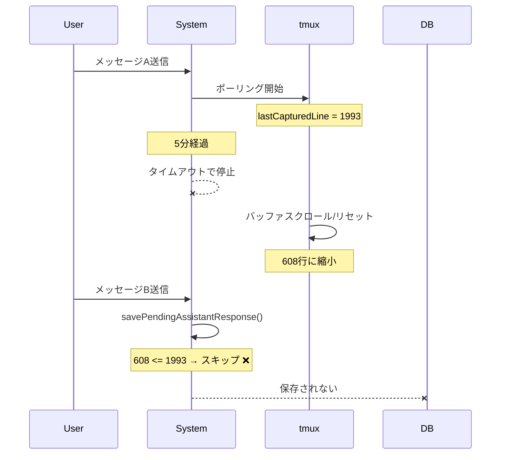
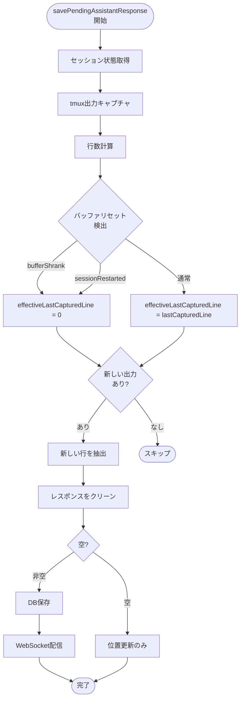

# Issue #59 設計方針書: バッファリセット検出ロジック追加

## 概要

`assistant-response-saver.ts` に tmuxバッファリセット検出ロジックを追加し、特定の条件下でassistant応答が保存されない問題を解決する。

---

## 1. 問題分析

### 発生条件



### 根本原因

| モジュール | バッファリセット検出 | 状態 |
|-----------|---------------------|------|
| `response-poller.ts` | あり | ✅ 正常動作 |
| `assistant-response-saver.ts` | なし | ❌ 問題あり |

`response-poller.ts` の実装（205-208行目）:
```typescript
const BUFFER_RESET_TOLERANCE = 25;
const bufferShrank = totalLines > 0 && lastCapturedLine > BUFFER_RESET_TOLERANCE
                     && (totalLines + BUFFER_RESET_TOLERANCE) < lastCapturedLine;
const sessionRestarted = totalLines > 0 && lastCapturedLine > 50 && totalLines < 50;
const bufferReset = bufferShrank || sessionRestarted;
```

`assistant-response-saver.ts` の問題箇所（193-199行目）:
```typescript
// バッファリセット検出がない ❌
if (currentLineCount <= lastCapturedLine) {
  console.log(`No new output...`);
  return null;  // ここでスキップされてしまう
}
```

### 関連する問題: ブランチ頻繁切り替え時の履歴未登録

スマホから複数のブランチを頻繁に切り替える際にも履歴が登録されない事象が報告されている。

| シナリオ | 発生メカニズム | 本対応で改善 |
|---------|---------------|-------------|
| ブランチA→B→A切り替え | ブランチAのtmuxバッファがスクロール/縮小 | ✅ `bufferShrank` で検出 |
| 長時間の別ブランチ作業 | 戻った時にバッファが大幅縮小 | ✅ `bufferShrank` で検出 |
| CLIセッション再起動 | バッファが50行未満に | ✅ `sessionRestarted` で検出 |

**結論**: 本Issue #59の対応により、ブランチ切り替え時の問題も**改善される可能性が高い**。

---

## 2. アーキテクチャ設計

### 2.1 解決アプローチ

**方針**: `response-poller.ts` と同様のバッファリセット検出ロジックを `assistant-response-saver.ts` に追加する。



### 2.2 変更箇所

| ファイル | 変更内容 |
|---------|---------|
| `src/lib/assistant-response-saver.ts` | バッファリセット検出ロジック追加 |
| `src/lib/__tests__/assistant-response-saver.test.ts` | テストケース追加 |

---

## 3. 詳細設計

### 3.1 バッファリセット検出ロジック

```typescript
/**
 * Buffer reset tolerance (lines)
 * If buffer shrinks by more than this, consider it a reset
 */
const BUFFER_RESET_TOLERANCE = 25;

/**
 * Detect buffer reset conditions
 *
 * @param currentLineCount - Current tmux buffer line count
 * @param lastCapturedLine - Last captured line position
 * @returns Whether buffer was reset and the reason
 */
function detectBufferReset(
  currentLineCount: number,
  lastCapturedLine: number
): { bufferReset: boolean; reason: 'shrink' | 'restart' | null } {
  // Condition 1: Buffer shrink (e.g., 1993 → 608 lines)
  // When buffer significantly shrinks, it indicates scrolling or reset
  const bufferShrank = currentLineCount > 0
    && lastCapturedLine > BUFFER_RESET_TOLERANCE
    && (currentLineCount + BUFFER_RESET_TOLERANCE) < lastCapturedLine;

  // Condition 2: Session restart (e.g., 500 → 30 lines)
  // When buffer drops below 50 lines from a larger state
  const sessionRestarted = currentLineCount > 0
    && lastCapturedLine > 50
    && currentLineCount < 50;

  if (bufferShrank) {
    return { bufferReset: true, reason: 'shrink' };
  }
  if (sessionRestarted) {
    return { bufferReset: true, reason: 'restart' };
  }
  return { bufferReset: false, reason: null };
}
```

### 3.2 savePendingAssistantResponse の修正

```typescript
export async function savePendingAssistantResponse(
  db: Database.Database,
  worktreeId: string,
  cliToolId: CLIToolType,
  userMessageTimestamp: Date
): Promise<ChatMessage | null> {
  try {
    // 1. Get session state
    const sessionState = getSessionState(db, worktreeId, cliToolId);
    const lastCapturedLine = sessionState?.lastCapturedLine || 0;

    // 2. Capture current tmux output
    let output: string;
    try {
      output = await captureSessionOutput(worktreeId, cliToolId, SESSION_OUTPUT_BUFFER_SIZE);
    } catch {
      console.log(`[savePendingAssistantResponse] Failed to capture session output for ${worktreeId}`);
      return null;
    }

    if (!output) {
      return null;
    }

    // 3. Calculate current line count
    const lines = output.split('\n');
    const currentLineCount = lines.length;

    // 4. Detect buffer reset (NEW)
    const { bufferReset, reason } = detectBufferReset(currentLineCount, lastCapturedLine);

    if (bufferReset) {
      console.log(
        `[savePendingAssistantResponse] Buffer reset detected (${reason}): ` +
        `current=${currentLineCount}, last=${lastCapturedLine}`
      );
    }

    // 5. Determine effective last captured line
    // If buffer was reset, treat as if starting from 0
    const effectiveLastCapturedLine = bufferReset ? 0 : lastCapturedLine;

    // 6. Check for new output (using effective position)
    if (!bufferReset && currentLineCount <= lastCapturedLine) {
      console.log(
        `[savePendingAssistantResponse] No new output ` +
        `(current: ${currentLineCount}, last: ${lastCapturedLine})`
      );
      return null;
    }

    // 7. Extract new lines since effective last capture position
    const newLines = lines.slice(effectiveLastCapturedLine);
    const newOutput = newLines.join('\n');

    // ... rest of the function remains unchanged
  } catch (error) {
    console.error('[savePendingAssistantResponse] Error:', error);
    return null;
  }
}
```

### 3.3 共通ロジックの抽出（DRY対応）

**Issue #59完了後、次スプリントで `src/lib/buffer-utils.ts` への共通化を実施する。**

```typescript
// src/lib/buffer-utils.ts
/**
 * Buffer reset detection utilities
 * Shared between response-poller.ts and assistant-response-saver.ts
 */

export const BUFFER_RESET_TOLERANCE = 25;

export interface BufferResetResult {
  bufferReset: boolean;
  reason: 'shrink' | 'restart' | null;
}

/**
 * Detect buffer reset conditions
 *
 * @param currentLineCount - Current tmux buffer line count
 * @param lastCapturedLine - Last captured line position
 * @returns Whether buffer was reset and the reason
 */
export function detectBufferReset(
  currentLineCount: number,
  lastCapturedLine: number
): BufferResetResult {
  const bufferShrank = currentLineCount > 0
    && lastCapturedLine > BUFFER_RESET_TOLERANCE
    && (currentLineCount + BUFFER_RESET_TOLERANCE) < lastCapturedLine;

  const sessionRestarted = currentLineCount > 0
    && lastCapturedLine > 50
    && currentLineCount < 50;

  if (bufferShrank) return { bufferReset: true, reason: 'shrink' };
  if (sessionRestarted) return { bufferReset: true, reason: 'restart' };
  return { bufferReset: false, reason: null };
}
```

**共通化タイムライン**:
| フェーズ | 内容 |
|---------|------|
| Issue #59 | `assistant-response-saver.ts` 内にロジック追加（コード重複許容） |
| 次スプリント | `buffer-utils.ts` に抽出、両モジュールからインポート |

---

## 4. テスト設計

### 4.1 新規テストケース

| テストケース | 説明 | 期待結果 |
|-------------|------|---------|
| バッファ縮小ケース | lastCapturedLine=1993, currentLineCount=608 | bufferReset=true, 処理続行 |
| セッション再起動ケース | lastCapturedLine=500, currentLineCount=30 | bufferReset=true, 処理続行 |
| 通常の重複防止ケース | lastCapturedLine=100, currentLineCount=100 | bufferReset=false, スキップ |
| 境界値ケース (tolerance内) | lastCapturedLine=50, currentLineCount=30 | bufferReset=false, スキップ |
| **境界値ケース (toleranceちょうど)** | lastCapturedLine=55, currentLineCount=30 | bufferReset=false (55+25=80 > 55) |
| **初回実行ケース** | lastCapturedLine=0, currentLineCount=100 | bufferReset=false, 通常処理 |
| **空バッファケース** | lastCapturedLine=100, currentLineCount=0 | bufferReset=false, スキップ |

### 4.2 テストコード

```typescript
describe('Buffer Reset Detection', () => {
  it('should detect buffer shrink (e.g., 1993 → 608 lines)', async () => {
    // Setup: lastCapturedLine = 1993, current buffer = 608 lines
    updateSessionState(testDb, 'test-worktree', 'claude', 1993);

    // Create mock output with 608 lines + assistant response
    const lines = Array(607).fill(0).map((_, i) => `Line ${i}`);
    lines.push('Assistant response content');
    mockCaptureSessionOutput.mockResolvedValue(lines.join('\n'));

    const result = await savePendingAssistantResponse(
      testDb,
      'test-worktree',
      'claude',
      new Date()
    );

    // Should detect buffer reset and save response
    expect(result).not.toBeNull();
    expect(result?.content).toContain('Assistant response content');
  });

  it('should detect session restart (e.g., 500 → 30 lines)', async () => {
    // Setup: lastCapturedLine = 500, current buffer = 30 lines
    updateSessionState(testDb, 'test-worktree', 'claude', 500);

    // Create mock output with 30 lines
    const lines = Array(28).fill(0).map((_, i) => `Line ${i}`);
    lines.push('New session response');
    mockCaptureSessionOutput.mockResolvedValue(lines.join('\n'));

    const result = await savePendingAssistantResponse(
      testDb,
      'test-worktree',
      'claude',
      new Date()
    );

    // Should detect session restart and save response
    expect(result).not.toBeNull();
  });

  it('should skip when no new output (normal case, no buffer reset)', async () => {
    // Setup: lastCapturedLine = 100, current buffer = 100 lines
    updateSessionState(testDb, 'test-worktree', 'claude', 100);

    const lines = Array(100).fill(0).map((_, i) => `Line ${i}`);
    mockCaptureSessionOutput.mockResolvedValue(lines.join('\n'));

    const result = await savePendingAssistantResponse(
      testDb,
      'test-worktree',
      'claude',
      new Date()
    );

    // Should return null (no new output, no buffer reset)
    expect(result).toBeNull();
  });

  it('should not detect buffer reset when within tolerance', async () => {
    // Setup: lastCapturedLine = 50, current buffer = 30 lines
    // Difference is 20, which is within BUFFER_RESET_TOLERANCE (25)
    updateSessionState(testDb, 'test-worktree', 'claude', 50);

    const lines = Array(30).fill(0).map((_, i) => `Line ${i}`);
    mockCaptureSessionOutput.mockResolvedValue(lines.join('\n'));

    const result = await savePendingAssistantResponse(
      testDb,
      'test-worktree',
      'claude',
      new Date()
    );

    // Should skip (within tolerance, not a reset)
    expect(result).toBeNull();
  });

  // 追加テストケース: 境界値テスト (tolerance=25 ちょうど)
  it('should not detect buffer reset at exact tolerance boundary', async () => {
    // Setup: lastCapturedLine = 55, current buffer = 30 lines
    // bufferShrank = 30 > 0 && 55 > 25 && (30 + 25) < 55 = true && true && false = false
    updateSessionState(testDb, 'test-worktree', 'claude', 55);

    const lines = Array(30).fill(0).map((_, i) => `Line ${i}`);
    mockCaptureSessionOutput.mockResolvedValue(lines.join('\n'));

    const result = await savePendingAssistantResponse(
      testDb,
      'test-worktree',
      'claude',
      new Date()
    );

    // Should skip (at tolerance boundary, not a reset)
    expect(result).toBeNull();
  });

  // 追加テストケース: 初回実行 (lastCapturedLine=0)
  it('should handle first execution (lastCapturedLine=0)', async () => {
    // Setup: no session state exists (lastCapturedLine defaults to 0)
    // Don't call updateSessionState

    const mockOutput = 'First assistant response\nLine 2';
    mockCaptureSessionOutput.mockResolvedValue(mockOutput);

    const result = await savePendingAssistantResponse(
      testDb,
      'test-worktree',
      'claude',
      new Date()
    );

    // Should process normally (not a buffer reset, just first execution)
    expect(result).not.toBeNull();
    expect(result?.content).toContain('First assistant response');
  });

  // 追加テストケース: 空バッファ (currentLineCount=0)
  it('should handle empty buffer (currentLineCount=0)', async () => {
    // Setup: lastCapturedLine = 100, but current buffer is empty
    updateSessionState(testDb, 'test-worktree', 'claude', 100);

    mockCaptureSessionOutput.mockResolvedValue('');

    const result = await savePendingAssistantResponse(
      testDb,
      'test-worktree',
      'claude',
      new Date()
    );

    // Should return null (empty output)
    expect(result).toBeNull();
  });

  // 追加テストケース: ブランチ切り替えシナリオ
  it('should handle branch switching scenario (buffer shrink after returning)', async () => {
    // Simulate: Branch A (1000 lines) → Branch B → Back to A (200 lines)
    updateSessionState(testDb, 'test-worktree', 'claude', 1000);

    // Branch A buffer shrunk to 200 lines while working on Branch B
    const lines = Array(199).fill(0).map((_, i) => `Line ${i}`);
    lines.push('Response after branch switch');
    mockCaptureSessionOutput.mockResolvedValue(lines.join('\n'));

    const result = await savePendingAssistantResponse(
      testDb,
      'test-worktree',
      'claude',
      new Date()
    );

    // Should detect buffer reset (shrink) and save response
    expect(result).not.toBeNull();
    expect(result?.content).toContain('Response after branch switch');
  });
});
```

---

## 5. 実装計画

### 5.1 タスク分割

| 順序 | タスク | 依存関係 |
|------|--------|---------|
| 1 | テストケース追加（7ケース） | なし |
| 2 | バッファリセット検出関数実装 | 1 |
| 3 | savePendingAssistantResponse修正 | 2 |
| 4 | テスト実行・確認 | 3 |
| 5 | 手動テスト（実環境確認） | 4 |
| 6 | ブランチ切り替え時の動作確認 | 5 |

### 5.2 チェックリスト

- [ ] `BUFFER_RESET_TOLERANCE` 定数定義
- [ ] `detectBufferReset()` 関数実装
- [ ] `savePendingAssistantResponse()` にバッファリセット検出統合
- [ ] ログメッセージにリセット理由を含める
- [ ] 単体テスト追加（7ケース）
- [ ] 既存テスト通過確認
- [ ] TypeScript型チェック通過
- [ ] ESLint通過
- [ ] ブランチ切り替え時の手動動作確認

---

## 6. トレードオフと決定事項

### 6.1 採用した設計

| 決定事項 | 理由 | トレードオフ |
|---------|------|-------------|
| `response-poller.ts` と同じ検出ロジック | 一貫性、実績あり | コード重複（次スプリントで共通化） |
| effectiveLastCapturedLine方式 | 既存ロジックへの影響最小化 | 追加の変数が必要 |
| 理由付きログ出力 | デバッグ容易性 | ログ増加 |

### 6.2 代替案

| 代替案 | メリット | デメリット | 採否 |
|-------|---------|-----------|------|
| 共通ユーティリティに抽出 | DRY原則、保守性 | 変更範囲拡大 | 次スプリントで実施 |
| lastCapturedLineをリセット | シンプル | 副作用リスク | 不採用 |
| タイムスタンプベース検出 | 行数に依存しない | 実装複雑、時刻同期問題 | 不採用 |

---

## 7. セキュリティ・品質考慮

### 7.1 影響範囲

- **変更対象**: `assistant-response-saver.ts` のみ
- **既存機能への影響**: なし（追加ロジックのみ）
- **パフォーマンス**: 無視可能（行数比較のみ）

### 7.2 リスク

| リスク | 対策 |
|-------|------|
| 誤ったバッファリセット検出 | tolerance値(25)で誤検出を防止 |
| ログ増加によるディスク圧迫 | 検出時のみログ出力 |

---

## 8. 関連ドキュメント

- [Issue #59](https://github.com/Kewton/MyCodeBranchDesk/issues/59)
- [response-poller.ts](../../src/lib/response-poller.ts) - 参考実装
- [assistant-response-saver.ts](../../src/lib/assistant-response-saver.ts) - 修正対象

---

## 9. レビューチェックリスト

- [ ] バッファリセット検出条件が `response-poller.ts` と一致しているか
- [ ] テストケースが Issue に記載の再現条件をカバーしているか
- [ ] ログメッセージが適切か
- [ ] 既存テストが全て通過するか
- [ ] CLAUDE.md のコーディング規約に準拠しているか
- [ ] ブランチ切り替え時のシナリオがテストでカバーされているか

---

## 10. 今後の改善計画

### 10.1 次スプリントでの共通化作業

| タスク | 内容 |
|-------|------|
| `buffer-utils.ts` 作成 | 共通のバッファリセット検出ロジック |
| `response-poller.ts` 修正 | `buffer-utils.ts` からインポート |
| `assistant-response-saver.ts` 修正 | `buffer-utils.ts` からインポート |
| テスト追加 | `buffer-utils.ts` の単体テスト |

### 10.2 ブランチ切り替え問題の追加調査

本対応で改善されない場合、以下の追加調査を実施:

| 調査項目 | 内容 |
|---------|------|
| ポーリング管理 | ブランチ切り替え時のポーリング状態 |
| セッション状態初期化 | 切り替え時のlastCapturedLine管理 |
| WebSocket接続 | 切り替え時の接続状態 |
