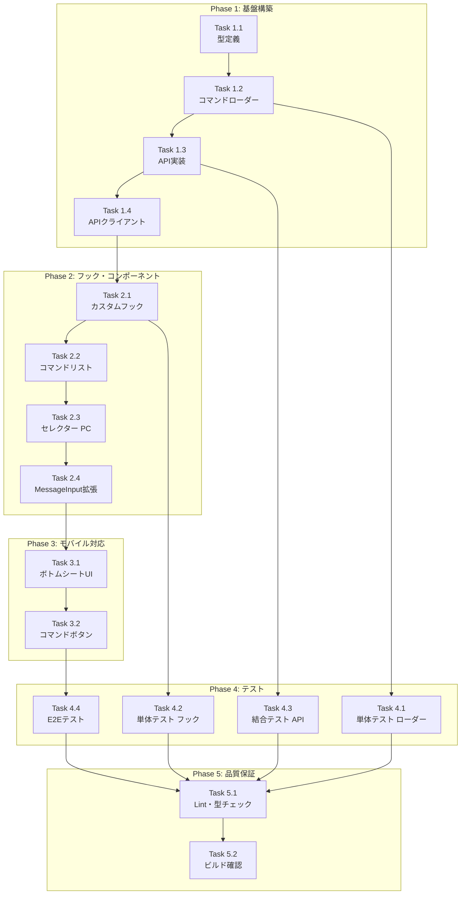

# Issue #10: スラッシュコマンド対応 - 作業計画書

**作成日**: 2026-01-09
**Issue番号**: #10
**サイズ**: M（Medium）
**優先度**: High
**依存Issue**: なし

---

## Issue概要

**タイトル**: スラッシュコマンド対応

**要件**:
スマホおよびPCのメッセージ送信時、Claude Codeのスラッシュコマンドを選択可能にしたい。なぜなら、スラッシュコマンドが多く覚えきれない、またタイプミスも考えられるからだ。

**関連ドキュメント**:
- 設計方針書: `dev-reports/design/issue-10-slash-command-design-policy.md`
- アーキテクチャレビュー: `dev-reports/review/2026-01-09-issue-10-architecture-review.md`

---

## 詳細タスク分解

### Phase 1: 基盤構築

#### Task 1.1: 型定義作成
- **成果物**: `src/types/slash-commands.ts`
- **依存**: なし
- **内容**:
  - `SlashCommand` インターフェース
  - `SlashCommandCategory` 型
  - `SlashCommandGroup` インターフェース
  - `SlashCommandsResponse` 型

```typescript
// 実装する型
export type SlashCommandCategory = 'planning' | 'development' | 'testing' | 'review' | 'automation' | 'reporting';

export interface SlashCommand {
  name: string;
  displayName: string;
  description: string;
  category: SlashCommandCategory;
  example?: string;
  requiresArgs?: boolean;
  argsPlaceholder?: string;
}
```

#### Task 1.2: コマンドローダー実装
- **成果物**: `src/lib/slash-commands.ts`
- **依存**: Task 1.1
- **内容**:
  - `.claude/commands/*.md` ファイルの読み込み
  - フロントマター（gray-matter）でのメタデータ抽出
  - カテゴリ分類ロジック
  - メモリキャッシュ機構

```typescript
// 主要関数
export async function loadSlashCommands(): Promise<SlashCommand[]>;
export function getSlashCommandGroups(commands: SlashCommand[]): SlashCommandGroup[];
export function getCachedCommands(): SlashCommand[] | null;
```

#### Task 1.3: API実装
- **成果物**: `src/app/api/slash-commands/route.ts`
- **依存**: Task 1.2
- **内容**:
  - `GET /api/slash-commands` エンドポイント
  - キャッシュ制御ヘッダー
  - エラーハンドリング

#### Task 1.4: APIクライアント拡張
- **成果物**: `src/lib/api-client.ts`（既存ファイル拡張）
- **依存**: Task 1.3
- **内容**:
  - `slashCommandApi` オブジェクト追加
  - 既存の `fetchApi` パターンに準拠

```typescript
export const slashCommandApi = {
  async getAll(): Promise<SlashCommandsResponse> {
    return fetchApi<SlashCommandsResponse>('/api/slash-commands');
  },
};
```

---

### Phase 2: フック・コンポーネント実装

#### Task 2.1: カスタムフック実装
- **成果物**: `src/hooks/useSlashCommands.ts`
- **依存**: Task 1.4
- **内容**:
  - コマンド一覧の取得・キャッシュ
  - フィルタリング機能
  - ローディング・エラー状態管理

```typescript
export function useSlashCommands(): {
  commands: SlashCommand[];
  groups: SlashCommandGroup[];
  loading: boolean;
  error: Error | null;
  filterCommands: (query: string) => SlashCommand[];
};
```

#### Task 2.2: コマンドリストコンポーネント実装
- **成果物**: `src/components/worktree/SlashCommandList.tsx`
- **依存**: Task 2.1
- **内容**:
  - カテゴリ別グループ表示
  - コマンドアイテム表示（名前＋説明）
  - 選択状態のハイライト
  - キーボードナビゲーション対応

#### Task 2.3: セレクターコンポーネント実装（PC版）
- **成果物**: `src/components/worktree/SlashCommandSelector.tsx`
- **依存**: Task 2.2
- **内容**:
  - ドロップダウン形式のUI
  - 検索/フィルタリング入力
  - アニメーション（既存の `usePromptAnimation` 活用）
  - アクセシビリティ対応（`role="listbox"`）

#### Task 2.4: MessageInput拡張
- **成果物**: `src/components/worktree/MessageInput.tsx`（既存ファイル拡張）
- **依存**: Task 2.3
- **内容**:
  - `/` 入力検知ロジック
  - セレクター表示/非表示制御
  - コマンド選択時のテキスト挿入
  - Lazy loading実装

---

### Phase 3: モバイル対応

#### Task 3.1: ボトムシートUI実装
- **成果物**: `src/components/worktree/SlashCommandSelector.tsx`（レスポンシブ拡張）
- **依存**: Task 2.4
- **内容**:
  - モバイル判定（既存の `useIsMobile` 活用）
  - ボトムシート形式のUI（既存の `MobilePromptSheet` パターン参考）
  - スワイプで閉じる機能
  - タッチ操作最適化

#### Task 3.2: コマンドボタン追加
- **成果物**: `src/components/worktree/MessageInput.tsx`
- **依存**: Task 3.1
- **内容**:
  - モバイル用コマンドアイコンボタン
  - タップでボトムシート表示

---

### Phase 4: テスト実装

#### Task 4.1: 単体テスト - コマンドローダー
- **成果物**: `tests/unit/slash-commands.test.ts`
- **依存**: Task 1.2
- **カバレッジ目標**: 90%以上
- **テスト項目**:
  - コマンドファイル読み込み
  - フロントマターパース
  - カテゴリ分類
  - キャッシュ動作

#### Task 4.2: 単体テスト - カスタムフック
- **成果物**: `tests/unit/hooks/useSlashCommands.test.ts`
- **依存**: Task 2.1
- **カバレッジ目標**: 80%以上
- **テスト項目**:
  - 初期状態
  - データ取得成功
  - エラーハンドリング
  - フィルタリング機能

#### Task 4.3: 結合テスト - API
- **成果物**: `tests/integration/api-slash-commands.test.ts`
- **依存**: Task 1.3
- **ポート**: 3001（テスト用）
- **テスト項目**:
  - 正常レスポンス
  - レスポンス形式検証
  - キャッシュヘッダー確認

#### Task 4.4: E2Eテスト
- **成果物**: `tests/e2e/slash-commands.spec.ts`
- **依存**: Task 3.2
- **ポート**: 3001（テスト用）
- **テスト項目**:
  - PC: `/` 入力でドロップダウン表示
  - PC: キーボードナビゲーション
  - PC: コマンド選択・挿入
  - モバイル: ボトムシート表示
  - モバイル: タップ選択

---

### Phase 5: 品質保証・完了

#### Task 5.1: Lint・型チェック修正
- **成果物**: 全ソースファイル
- **依存**: Phase 1-4完了
- **コマンド**:
  ```bash
  npm run lint
  npx tsc --noEmit
  ```

#### Task 5.2: ビルド確認
- **成果物**: `.next/` ビルド成果物
- **依存**: Task 5.1
- **コマンド**:
  ```bash
  npm run build
  ```

---

## タスク依存関係



---

## テスト設定（ポート3001使用）

### Playwrightテスト設定

`playwright.config.ts` の修正:

```typescript
export default defineConfig({
  // ...
  use: {
    baseURL: process.env.TEST_BASE_URL || 'http://localhost:3001',
    // ...
  },
  webServer: {
    command: 'PORT=3001 npm run dev',
    url: 'http://localhost:3001',
    reuseExistingServer: !process.env.CI,
  },
});
```

### 結合テスト用環境変数

`tests/integration/api-slash-commands.test.ts`:

```typescript
const TEST_PORT = process.env.TEST_PORT || '3001';
const BASE_URL = `http://localhost:${TEST_PORT}`;
```

### テスト実行コマンド

```bash
# 単体テスト
npm run test:unit

# 結合テスト（ポート3001）
TEST_PORT=3001 npm run test:integration

# E2Eテスト（ポート3001）
TEST_BASE_URL=http://localhost:3001 npm run test:e2e
```

---

## 成果物一覧

### 新規ファイル

| ファイル | 種別 | Phase |
|---------|------|-------|
| `src/types/slash-commands.ts` | 型定義 | 1 |
| `src/lib/slash-commands.ts` | ビジネスロジック | 1 |
| `src/app/api/slash-commands/route.ts` | API | 1 |
| `src/hooks/useSlashCommands.ts` | フック | 2 |
| `src/components/worktree/SlashCommandList.tsx` | コンポーネント | 2 |
| `src/components/worktree/SlashCommandSelector.tsx` | コンポーネント | 2 |
| `tests/unit/slash-commands.test.ts` | テスト | 4 |
| `tests/unit/hooks/useSlashCommands.test.ts` | テスト | 4 |
| `tests/integration/api-slash-commands.test.ts` | テスト | 4 |
| `tests/e2e/slash-commands.spec.ts` | テスト | 4 |

### 既存ファイル修正

| ファイル | 修正内容 | Phase |
|---------|---------|-------|
| `src/lib/api-client.ts` | `slashCommandApi` 追加 | 1 |
| `src/components/worktree/MessageInput.tsx` | セレクター統合 | 2-3 |
| `playwright.config.ts` | ポート3001対応 | 4 |

---

## 品質チェック項目

| チェック項目 | コマンド | 基準 |
|-------------|----------|------|
| ESLint | `npm run lint` | エラー0件 |
| TypeScript | `npx tsc --noEmit` | 型エラー0件 |
| Unit Test | `npm run test:unit` | 全テストパス |
| Integration Test | `TEST_PORT=3001 npm run test:integration` | 全テストパス |
| E2E Test | `TEST_BASE_URL=http://localhost:3001 npm run test:e2e` | 全テストパス |
| Build | `npm run build` | 成功 |
| Coverage | `npm run test:unit -- --coverage` | 80%以上 |

---

## Definition of Done

Issue #10 完了条件:

- [ ] Phase 1〜5 の全タスク完了
- [ ] 全12コマンドが正しく表示・選択可能
- [ ] PC: キーボードナビゲーション動作（↑↓Enter Escape）
- [ ] モバイル: ボトムシートUI動作
- [ ] 単体テストカバレッジ80%以上
- [ ] 結合テスト全パス（ポート3001）
- [ ] E2Eテスト全パス（ポート3001）
- [ ] CIチェック全パス（lint, type-check, test, build）
- [ ] コードレビュー承認

---

## 次のアクション

1. **ブランチ作成**
   ```bash
   git checkout -b feature/10-slash-command-support
   ```

2. **Phase 1 開始**: Task 1.1（型定義作成）から着手

3. **進捗報告**: `/progress-report` で定期報告

4. **PR作成**: Phase 5完了後 `/create-pr` で自動作成

---

## 備考

- gray-matter ライブラリの追加が必要
  ```bash
  npm install gray-matter
  npm install -D @types/gray-matter
  ```

- アーキテクチャレビューの承認条件（APIクライアント統合、XSSサニタイズ）は Task 1.4 と Task 2.3 で対応

---

*Generated by Claude Code /work-plan*
