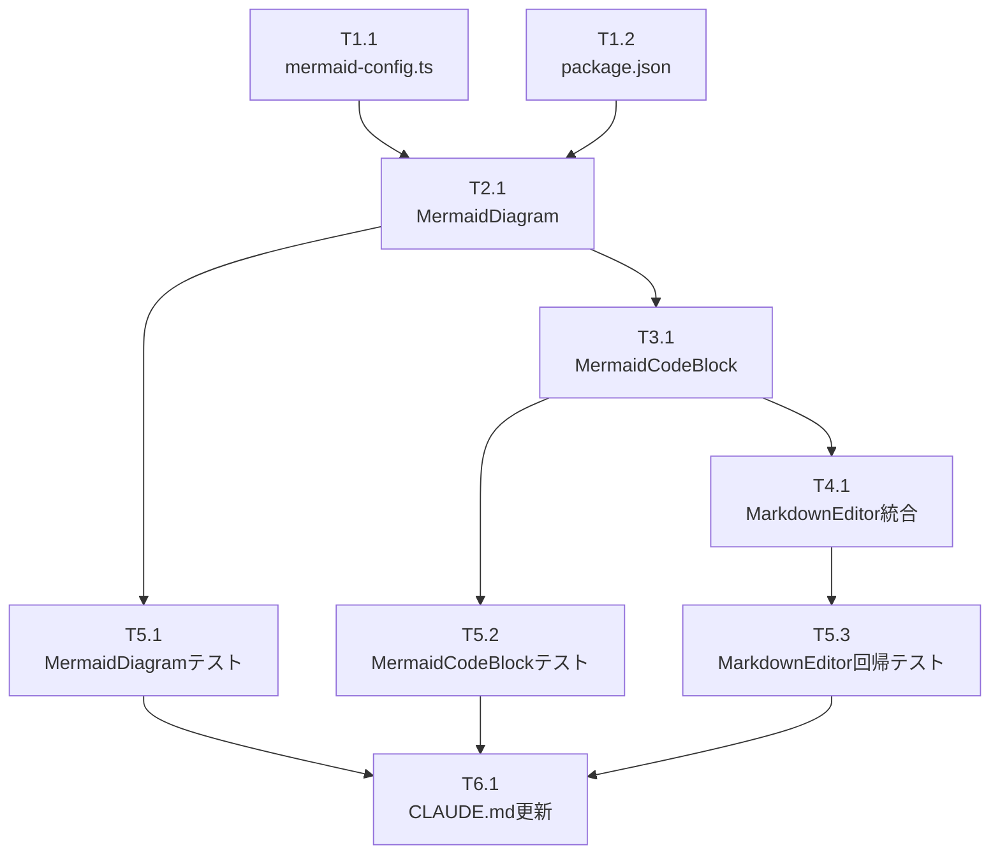

# 作業計画: Issue #100

## Issue概要

**Issue番号**: #100
**タイトル**: feat: マークダウンプレビューでmermaidダイアグラムを描画できるようにする
**サイズ**: M（中規模）
**優先度**: Medium
**ラベル**: enhancement
**依存Issue**: なし
**関連Issue**: #49（マークダウンエディタ本体）, #99（表示改善）, #95（SVG XSS対策参考）

### 概要

マークダウンエディタのプレビュー機能で、mermaidダイアグラム（フローチャート、シーケンス図、ER図など）をSVGとして描画する機能を追加する。

---

## 詳細タスク分解

### Phase 1: 設定ファイル作成

| タスクID | タスク名 | 成果物 | 依存 |
|---------|---------|--------|------|
| T1.1 | mermaid設定ファイル作成 | `src/config/mermaid-config.ts` | なし |
| T1.2 | 依存パッケージ追加 | `package.json` (mermaid ^11.12.2) | なし |

**T1.1 詳細**:
- [ ] MERMAID_CONFIG定数を定義（securityLevel: 'strict', startOnLoad: false, theme: 'default'）
- [ ] MermaidConfig型を定義（as const + typeof）
- [ ] securityLevel変更禁止のセキュリティコメント追加
- [ ] @moduleタグ付きJSDocを追加

**T1.2 詳細**:
- [ ] `npm install mermaid@^11.12.2`
- [ ] package-lock.jsonの更新確認

---

### Phase 2: MermaidDiagramコンポーネント実装

| タスクID | タスク名 | 成果物 | 依存 |
|---------|---------|--------|------|
| T2.1 | MermaidDiagramコンポーネント作成 | `src/components/worktree/MermaidDiagram.tsx` | T1.1, T1.2 |

**T2.1 詳細**:
- [ ] 'use client' ディレクティブ追加
- [ ] MermaidDiagramProps インターフェース定義（code: string, id?: string）
- [ ] mermaid-configからの設定読み込み
- [ ] initializeMermaidWithValidation()関数実装（securityLevel検証フェイルセーフ）
- [ ] useEffect内でmermaid.render()実装
- [ ] 状態管理: svg, error, isLoading
- [ ] エラーハンドリング（SyntaxError, RenderError）
- [ ] エラー表示UI（Tailwind CSS）
- [ ] dangerouslySetInnerHTMLでSVG描画

---

### Phase 3: MermaidCodeBlockコンポーネント実装

| タスクID | タスク名 | 成果物 | 依存 |
|---------|---------|--------|------|
| T3.1 | MermaidCodeBlockコンポーネント作成 | `src/components/worktree/MermaidCodeBlock.tsx` | T2.1 |

**T3.1 詳細**:
- [ ] 'use client' ディレクティブ追加
- [ ] MermaidCodeBlockPropsインターフェース定義（ReactMarkdown互換）
  - className?: string
  - children?: React.ReactNode | string | string[]
  - node?: Element
  - inline?: boolean
- [ ] next/dynamicでMermaidDiagramを遅延読み込み（ssr: false）
- [ ] Loader2スピナー付きloading UI
- [ ] className解析による言語判定（language-mermaid）
- [ ] mermaidの場合はMermaidDiagramに委譲
- [ ] 非mermaidの場合は既存のcode要素をパススルー
- [ ] inline codeブロックはパススルー

---

### Phase 4: MarkdownEditor統合

| タスクID | タスク名 | 成果物 | 依存 |
|---------|---------|--------|------|
| T4.1 | MarkdownEditor.tsx修正 | `src/components/worktree/MarkdownEditor.tsx` | T3.1 |

**T4.1 詳細**:
- [ ] MermaidCodeBlockのimport追加
- [ ] ReactMarkdownのcomponents prop追加
  ```tsx
  components={{
    code: MermaidCodeBlock,
  }}
  ```
- [ ] 2箇所のReactMarkdownに適用（モバイル/デスクトップ）

---

### Phase 5: ユニットテスト追加

| タスクID | タスク名 | 成果物 | 依存 |
|---------|---------|--------|------|
| T5.1 | MermaidDiagramテスト作成 | `tests/unit/components/MermaidDiagram.test.tsx` | T2.1 |
| T5.2 | MermaidCodeBlockテスト作成 | `tests/unit/components/MermaidCodeBlock.test.tsx` | T3.1 |
| T5.3 | MarkdownEditor回帰テスト追加 | `tests/unit/components/MarkdownEditor.test.tsx` | T4.1 |

**T5.1 詳細**:
- [ ] @vitest-environment jsdom ディレクティブ
- [ ] 正常系: flowchart描画成功
- [ ] 正常系: sequenceDiagram描画成功
- [ ] 異常系: 構文エラー時のエラー表示
- [ ] 異常系: 空コードの処理
- [ ] セキュリティ設定検証テスト（securityLevel='strict'）
- [ ] XSS回帰テスト（script, event handlers, javascript: URL, nested malicious content）
- [ ] Issue #95 SVG XSS整合性テスト（5項目）

**T5.2 詳細**:
- [ ] @vitest-environment jsdom ディレクティブ
- [ ] mermaid言語判定テスト（className='language-mermaid'）
- [ ] 非mermaidコードブロックのパススルーテスト
- [ ] inline codeブロックのパススルーテスト

**T5.3 詳細**:
- [ ] mermaidコードブロックを含むマークダウンのレンダリングテスト
- [ ] 既存機能の回帰テスト（GFMテーブル、リスト、コードブロック）
- [ ] rehype-sanitizeとの互換性テスト
- [ ] rehype-highlightとの互換性テスト（シンタックスハイライト）

---

### Phase 6: ドキュメント更新

| タスクID | タスク名 | 成果物 | 依存 |
|---------|---------|--------|------|
| T6.1 | CLAUDE.md更新 | `CLAUDE.md` | T5.1, T5.2, T5.3 |

**T6.1 詳細**:
- [ ] 「## 最近の実装機能」セクションに Issue #100 を追加
- [ ] 機能概要: mermaidダイアグラム描画
- [ ] 対応ファイル形式、セキュリティ対策（securityLevel='strict'）を記載
- [ ] 主要コンポーネント一覧を追加

---

## タスク依存関係



---

## 変更ファイル一覧

### 新規作成

| ファイル | 変更内容 |
|---------|---------|
| `src/config/mermaid-config.ts` | mermaid設定定数（securityLevel, startOnLoad, theme） |
| `src/components/worktree/MermaidDiagram.tsx` | mermaid描画コンポーネント |
| `src/components/worktree/MermaidCodeBlock.tsx` | コードブロックラッパー |
| `tests/unit/components/MermaidDiagram.test.tsx` | MermaidDiagramユニットテスト |
| `tests/unit/components/MermaidCodeBlock.test.tsx` | MermaidCodeBlockユニットテスト |

### 修正

| ファイル | 変更内容 |
|---------|---------|
| `src/components/worktree/MarkdownEditor.tsx` | components prop追加（2箇所） |
| `package.json` | mermaid依存追加 |
| `tests/unit/components/MarkdownEditor.test.tsx` | 回帰テスト追加 |
| `CLAUDE.md` | 最近の実装機能セクション更新 |

---

## 品質チェック項目

| チェック項目 | コマンド | 基準 |
|-------------|----------|------|
| TypeScript | `npx tsc --noEmit` | 型エラー0件 |
| ESLint | `npm run lint` | エラー0件 |
| Unit Test | `npm run test:unit` | 全テストパス |
| Build | `npm run build` | 成功 |

---

## 受け入れ条件チェックリスト

| AC | 内容 | テスト方法 |
|----|------|----------|
| AC-01 | mermaidコードブロックがSVGダイアグラムとして描画される | T5.1, T5.3 |
| AC-02 | 構文エラー時にエラーメッセージが表示される（UIがクラッシュしない） | T5.1 |
| AC-03 | 既存のマークダウンプレビュー機能に影響がない | T5.3（回帰テスト） |
| AC-04 | テストが追加されている | T5.1, T5.2, T5.3 |
| AC-05 | mermaidのsecurityLevelが'strict'に設定されている | T5.1（設定検証テスト） |
| AC-06 | CLAUDE.mdが更新されている | T6.1 |

---

## セキュリティチェックリスト

| 項目 | 対策 | 検証方法 |
|-----|------|---------|
| mermaid SVG XSS | securityLevel='strict' | T5.1 セキュリティ設定検証テスト |
| scriptタグ実行 | DOMPurifyで除去 | T5.1 XSS回帰テスト |
| イベントハンドラ | securityLevel='strict'で除去 | T5.1 XSS回帰テスト |
| 危険なURLスキーム | DOMPurifyで無害化 | T5.1 XSS回帰テスト |
| Issue #95整合性 | 5項目すべてカバー確認 | T5.1 Issue #95整合性テスト |
| securityLevel検証 | フェイルセーフ機構 | T5.1 設定検証テスト |

---

## Definition of Done

Issue完了条件：

- [ ] 全タスク（T1.1〜T6.1）が完了
- [ ] すべての単体テストがパス
- [ ] TypeScript型エラー0件
- [ ] ESLintエラー0件
- [ ] npm run buildが成功
- [ ] AC-01〜AC-06すべてが満たされている
- [ ] セキュリティチェックリスト全項目OK
- [ ] CLAUDE.md更新完了

---

## 推定工数

| Phase | タスク数 | 複雑度 |
|-------|---------|-------|
| Phase 1: 設定ファイル | 2 | 低 |
| Phase 2: MermaidDiagram | 1 | 中 |
| Phase 3: MermaidCodeBlock | 1 | 低 |
| Phase 4: MarkdownEditor統合 | 1 | 低 |
| Phase 5: ユニットテスト | 3 | 中 |
| Phase 6: ドキュメント | 1 | 低 |

---

## リスクと対策

| リスク | 影響 | 対策 |
|-------|------|------|
| mermaidライブラリのサイズ（66.2MB） | npm ci時間増加 | dynamic import、既存キャッシュ活用 |
| SSR非互換 | ハイドレーションエラー | ssr: false、'use client' |
| rehype-sanitizeとの競合 | mermaid SVGがブロック | 分離設計（mermaidは別経路） |
| 初回レンダリング遅延（100-300ms） | UX低下 | Loader2スピナー表示 |

---

## 次のアクション

作業計画承認後：

1. **ブランチ作成**: `feature/100-mermaid-diagram`
2. **タスク実行**: Phase 1から順次実装
3. **進捗報告**: `/progress-report`で定期報告
4. **PR作成**: `/create-pr`で自動作成

---

## 参考資料

- [設計方針書](./multi-stage-design-review/summary-report.md)
- [Issueレビュー結果](./issue-review/summary-report.md)
- [Mermaid 公式サイト](https://mermaid.js.org/)
- [Issue #100](https://github.com/Kewton/CommandMate/issues/100)

---

*作成日: 2026-01-31*
*設計方針書: dev-reports/design/issue-100-mermaid-diagram-design-policy.md*
