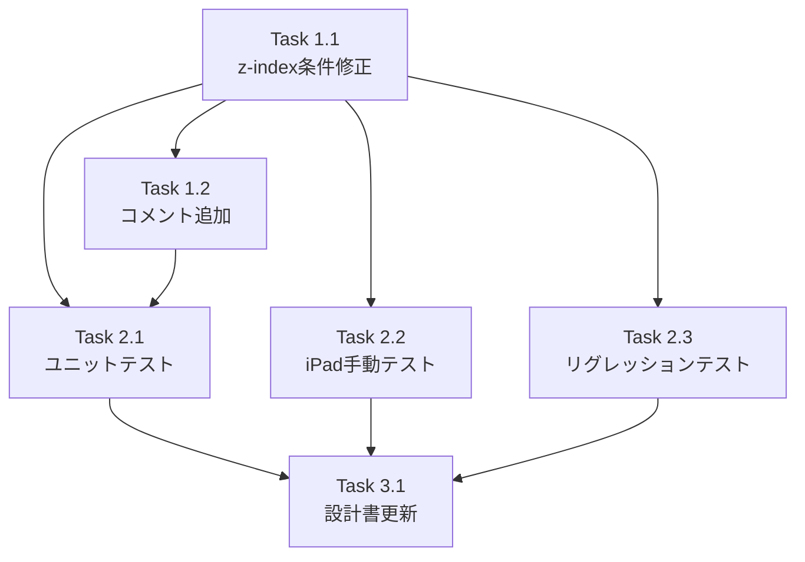

# Issue #104 作業計画

## Issue概要

**タイトル**: iPadにて横置きでmarkdownファイルを編集しようとするとターミナル画面に遷移してしまう

**Issue番号**: #104
**ラベル**: bug
**サイズ**: S（Small）
**優先度**: High
**依存Issue**: なし（#99の機能バグ修正）

### 問題概要

iPad Chrome（横置き）でMarkdownエディタの全画面ボタンをクリックすると、ターミナルタブが前面に表示されてMarkdownエディタが見えなくなる。

### 根本原因

`MarkdownEditor.tsx`のz-index設定条件が`isMaximized && isFallbackMode`となっており、iPad ChromeでFullscreen APIが成功する場合（`isFallbackMode=false`）にz-indexが設定されないため。

### 修正方針

z-index条件を`isMaximized`のみに変更する（1行の条件修正）。

---

## 詳細タスク分解

### Phase 1: 修正実装

#### Task 1.1: z-index条件の修正

- **成果物**: `src/components/worktree/MarkdownEditor.tsx`
- **変更箇所**: L436-441
- **変更内容**:
  ```typescript
  // 修正前
  if (isMaximized && isFallbackMode) {

  // 修正後
  if (isMaximized) {
  ```
- **依存**: なし

#### Task 1.2: コード内コメント追加

- **成果物**: `src/components/worktree/MarkdownEditor.tsx`
- **変更箇所**: L424-441付近
- **変更内容**: `containerClasses`と`containerStyle`の条件差異についてコメント追加
  - `containerClasses`: `isFallbackMode`時のみ`fixed inset-0`（CSSフォールバック用）
  - `containerStyle`: `isMaximized`時にz-index設定（iPad Chrome対応のため常時設定）
- **依存**: Task 1.1

---

### Phase 2: テスト

#### Task 2.1: ユニットテスト追加

- **成果物**: `tests/unit/components/MarkdownEditor.test.tsx`
- **追加テストケース**:
  1. `isMaximized=true, isFallbackMode=false` → z-index=40
  2. `isMaximized=true, isFallbackMode=true` → z-index=40
  3. `isMaximized=false` → z-index未設定
- **カバレッジ目標**: z-index設定ロジックの100%カバー
- **依存**: Task 1.1

#### Task 2.2: 手動テスト（iPad Chrome）

- **テスト項目**:
  | ID | 環境 | テスト内容 | 期待結果 |
  |----|------|----------|---------|
  | MT-001 | iPad Chrome（横置き） | 全画面ボタンクリック | エディタが最前面に表示 |
  | MT-002 | iPad Chrome（縦置き） | 全画面ボタンクリック | エディタが最前面に表示 |
  | MT-003 | iPad Chrome | オリエンテーション変更 | 全画面状態が維持される |
- **依存**: Task 1.1

#### Task 2.3: リグレッションテスト

- **テスト項目**:
  | ID | 環境 | テスト内容 | 期待結果 |
  |----|------|----------|---------|
  | RR-001 | デスクトップ Chrome | 全画面表示 | 既存動作維持 |
  | RR-002 | デスクトップ Safari | 全画面表示 | 既存動作維持 |
  | RR-003 | iOS Safari | フォールバックモード | 既存動作維持 |
  | RR-004 | 全環境 | Modal内Maximize | Modalが前面維持 |
- **依存**: Task 1.1

---

### Phase 3: ドキュメント更新

#### Task 3.1: Issue #99設計書更新

- **成果物**: `dev-reports/design/issue-99-markdown-editor-display-improvement-design-policy.md`
- **変更内容**: z-index条件変更の経緯を追記（#104対応として）
- **依存**: Task 1.1, Task 2.1, Task 2.2完了後

---

## タスク依存関係



---

## 品質チェック項目

| チェック項目 | コマンド | 基準 |
|-------------|----------|------|
| ESLint | `npm run lint` | エラー0件 |
| TypeScript | `npx tsc --noEmit` | 型エラー0件 |
| Unit Test | `npm run test:unit` | 全テストパス |
| Build | `npm run build` | 成功 |

---

## 成果物チェックリスト

### コード

- [ ] `src/components/worktree/MarkdownEditor.tsx` L436-441のz-index条件修正
- [ ] `src/components/worktree/MarkdownEditor.tsx` containerClasses/containerStyle差異のコメント追加

### テスト

- [ ] `tests/unit/components/MarkdownEditor.test.tsx` z-indexテストケース3件追加
- [ ] iPad Chrome手動テスト（横置き）完了
- [ ] iPad Chrome手動テスト（縦置き）完了
- [ ] デスクトップリグレッションテスト完了
- [ ] Modal内Maximizeテスト完了

### ドキュメント

- [ ] Issue #99設計書にz-index条件変更の経緯を追記

---

## Definition of Done

Issue完了条件：

1. [ ] すべてのタスクが完了
2. [ ] ユニットテスト追加済み（z-indexテストケース3件）
3. [ ] CIチェック全パス（lint, type-check, test, build）
4. [ ] iPad Chrome手動テストで問題が解消されていることを確認
5. [ ] デスクトップ・iOS Safariでリグレッションなし
6. [ ] Issue #99設計書更新完了

---

## 受け入れ条件（Issueより）

1. iPad Chrome（横置き）で全画面ボタンをクリックした際、Markdownエディタが最前面に表示される
2. ターミナルタブが前面に表示されない
3. 既存のデスクトップ・モバイル動作に影響がない
4. `isMaximized=true` 時にz-indexが設定されることを確認するユニットテストが追加されている

---

## 次のアクション

作業計画承認後：

1. **ブランチ作成**: `fix/104-ipad-fullscreen-bugfix`
2. **TDD実装**: `/tdd-impl` でRed-Green-Refactorサイクルで実装
3. **手動テスト**: iPad Chrome実機で動作確認
4. **進捗報告**: 必要に応じて `/progress-report` で報告
5. **PR作成**: `/create-pr` で自動作成

---

## 関連ドキュメント

| ドキュメント | パス |
|-------------|------|
| Issue本文 | https://github.com/Kewton/CommandMate/issues/104 |
| 設計方針書 | `dev-reports/design/issue-104-ipad-fullscreen-bugfix-design-policy.md` |
| Issueレビュー結果 | `dev-reports/issue/104/issue-review/summary-report.md` |
| 設計レビュー結果 | `dev-reports/issue/104/multi-stage-design-review/summary-report.md` |
| 関連Issue #99設計書 | `dev-reports/design/issue-99-markdown-editor-display-improvement-design-policy.md` |

---

*作成日: 2026-02-01*
