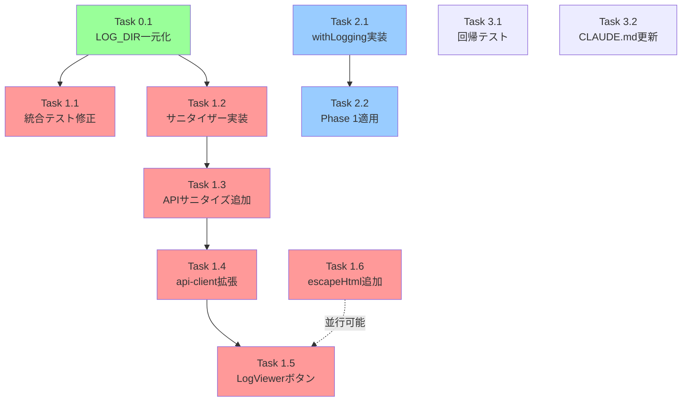

# 作業計画書: Issue #11 バグ原因調査目的のデータ収集機能強化

## Issue概要

**Issue番号**: #11
**タイトル**: バグ原因調査目的のデータ収集機能強化
**サイズ**: L（大規模）
**優先度**: Medium
**依存Issue**: なし
**関連Issue**: #41（構造化ログ）、#211（clipboard-utils）

### 概要

開発環境と本番環境の双方でデータ収集機能を強化する。

- **本番環境**: ワークツリー詳細画面にログエクスポート機能を追加し、サニタイズ済み会話ログをMarkdown形式でクリップボードにコピー
- **開発環境**: APIリクエスト/レスポンスの詳細ログを記録（NODE_ENV=development）

---

## 詳細タスク分解

### Phase 0: 前提タスク（共通基盤）

#### Task 0.1: LOG_DIR定数の一元管理

**目的**: LOG_DIRの重複定義を解消（DRY原則）

**成果物**:
- `src/config/log-config.ts`（新規作成）
- `src/lib/log-manager.ts`（LOG_DIR定義を削除、log-configからインポート）
- `src/app/api/worktrees/[id]/logs/[filename]/route.ts`（LOG_DIR定義を削除、log-configからインポート）

**依存**: なし

**作業内容**:
1. `src/config/log-config.ts`を新規作成
   ```typescript
   import { getEnv } from '@/lib/env';

   export function getLogDir(): string {
     return process.env.CM_LOG_DIR || `${getEnv().CM_ROOT_DIR}/data/logs`;
   }
   ```
2. `src/lib/log-manager.ts`のLOG_DIR定義（14行目）を削除し、`getLogDir()`をインポート
3. `src/app/api/worktrees/[id]/logs/[filename]/route.ts`のLOG_DIR定義（14行目）を削除し、`getLogDir()`をインポート
4. `npm run build`で循環依存がないことを確認

**検証**:
- [ ] `npm run build` が成功すること
- [ ] 依存関係チェーン（log-config.ts → env.ts → db-path-resolver.ts）に循環依存がないこと

---

### Phase 1: ログエクスポート機能（本番環境向け）

#### Task 1.1: 既存統合テストの修正

**目的**: サニタイズ機能追加の前提条件として、既存テストと実装の乖離を解消

**成果物**: `tests/integration/api-logs.test.ts`（修正）

**依存**: Task 0.1

**作業内容**:
1. fsモックを`fs/promises`に変更
   - `vi.mock('fs/promises')`を使用
   - `vi.mocked(fs.stat)`、`vi.mocked(fs.readFile)`、`vi.mocked(fs.readdir)`等を設定
2. ファイル拡張子を`.jsonl`→`.md`に統一
3. エラーメッセージを「must be a .jsonl file」→「Invalid filename」に修正
4. worktreeIdプレフィックス検証テストを追加

**検証**:
- [ ] `npm run test:integration` が全パスすること
- [ ] fs/promisesの以下の関数がモックされていること:
  - `logs/route.ts`用: `access`, `mkdir`, `readdir`, `stat`
  - `logs/[filename]/route.ts`用: `readFile`, `stat`

---

#### Task 1.2: ログエクスポートサニタイザーの実装

**目的**: パス・環境変数・機密データをマスキングするサニタイズ機能

**成果物**:
- `src/lib/log-export-sanitizer.ts`（新規作成）
- `src/lib/utils.ts`（escapeRegExp()のJSDoc更新）
- `tests/unit/log-export-sanitizer.test.ts`（新規作成）

**依存**: Task 0.1

**作業内容**:
1. `log-export-sanitizer.ts`を新規作成
   - `buildSanitizeRules()`関数: 7カテゴリのルール生成
     1. HOMEパス（`process.env.HOME`）
     2. CM_ROOT_DIRパス（`getEnv().CM_ROOT_DIR`）
     3. CM_DB_PATHパス（`getEnv().CM_DB_PATH`）
     4. ホスト名（`os.hostname()`）
     5. Bearerトークン（`Bearer [A-Za-z0-9-_.]+`）
     6. Authorizationヘッダー（`Authorization: Bearer ...`等）
     7. パスワード・トークン・シークレットのkey-valueペア
     8. SSHプライベートキー（`-----BEGIN ... PRIVATE KEY-----`）
     9. 既知の環境変数名（`CM_ROOT_DIR`, `CM_DB_PATH`, `HOME`等）
   - `sanitizeForExport(content: string): string`関数: ルール適用
   - 最長一致を優先するためルールをソート
   - `escapeRegExp()`をutilsからインポート
2. `src/lib/utils.ts`のescapeRegExp() JSDocを更新
   - 既存: "CLIENT-SIDE highlight rendering only"
   - 更新後: "Used for client-side highlighting and server-side sanitization. Note: This is a simple escaping for ReDoS prevention (SEC-MF-001)"
3. 単体テストを作成（17件のテストケース）

**検証**:
- [ ] HOMEディレクトリパスが`[HOME]`に置換されること
- [ ] CM_ROOT_DIRが`[PROJECT]`に置換されること
- [ ] CM_DB_PATHが`[DB_PATH]`に置換されること
- [ ] ホスト名が`[HOST]`に置換されること
- [ ] Bearerトークンが`[REDACTED_TOKEN]`に置換されること
- [ ] 相対パス・ファイル名が保持されること
- [ ] 最長一致で二重置換が防がれること
- [ ] CM_ROOT_DIR未設定時もエラーにならないこと
- [ ] `/Users/*`, `/home/*`パターンが結果に含まれないこと（正規表現検証）
- [ ] `npm run test:unit -- log-export-sanitizer.test.ts` が全パスすること
- [ ] `os.hostname()`のモック方法が文書化されていること

---

#### Task 1.3: ログAPIへのサニタイズオプション追加

**目的**: 既存ログ取得APIに`?sanitize=true`クエリパラメータを追加

**成果物**: `src/app/api/worktrees/[id]/logs/[filename]/route.ts`（修正）

**依存**: Task 1.2

**作業内容**:
1. `request.nextUrl.searchParams`から`sanitize`パラメータを取得
2. ファイル読み取り後、サニタイズ条件分岐を1行で実装
   ```typescript
   if (sanitize) content = sanitizeForExport(content);
   ```
3. `log-export-sanitizer.ts`からsanitizeForExport()をインポート

**検証**:
- [ ] `GET /api/worktrees/:id/logs/:filename?sanitize=true` でサニタイズ済みコンテンツが返ること
- [ ] `GET /api/worktrees/:id/logs/:filename` で通常コンテンツが返ること（デフォルト=非サニタイズ）
- [ ] サニタイズ処理がサーバーサイドで実行されること

---

#### Task 1.4: api-client.tsの拡張

**目的**: サニタイズ済みログ取得メソッドの追加と型修正

**成果物**: `src/lib/api-client.ts`（修正）

**依存**: Task 1.3

**作業内容**:
1. `getLogFile()`メソッドシグネチャにoptionsパラメータを追加
   ```typescript
   getLogFile(
     id: string,
     filename: string,
     options?: { sanitize?: boolean }
   ): Promise<LogFileResponse>
   ```
2. URLにクエリパラメータを付加
   ```typescript
   const queryParams = options?.sanitize ? '?sanitize=true' : '';
   const url = `/api/worktrees/${id}/logs/${filename}${queryParams}`;
   ```
3. `LogFileResponse`型に`cliToolId`を追加（既存の型欠落を修正）
   ```typescript
   interface LogFileResponse {
     filename: string;
     cliToolId: string;  // 追加
     content: string;
     size: number;
     modifiedAt: string;
   }
   ```

**検証**:
- [ ] 型定義に`cliToolId`が含まれること
- [ ] `grep -r "getLogFile" src/components/` で呼び出し箇所がLogViewer.tsx 75行目のみであることを確認

---

#### Task 1.5: LogViewer.tsxのエクスポートボタンUI追加

**目的**: ユーザーがログをエクスポートできるUIを提供

**成果物**: `src/components/worktree/LogViewer.tsx`（修正）

**依存**: Task 1.4

**作業内容**:
1. エクスポートボタンをLogタブ内に追加
2. `handleExport()`関数を実装
   - `api-client.getLogFile(worktreeId, selectedFile, { sanitize: true })`を呼び出し
   - `copyToClipboard(content)`でクリップボードにコピー
   - トースト通知で成功/失敗を表示
3. ログ未選択時はボタンを無効化
4. XSS対策: `highlightedContent`生成時に`escapeHtml()`を適用（別途Task 1.6で実装）

**検証**:
- [ ] エクスポートボタンが表示されること
- [ ] ログ未選択時はボタンが無効化されること
- [ ] ボタン押下でクリップボードにサニタイズ済みログがコピーされること
- [ ] モバイル表示でもボタンが適切に配置されること

---

#### Task 1.6: XSS対策（escapeHtml関数の追加）

**目的**: LogViewer.tsxのdangerouslySetInnerHTMLによるXSSリスクを防止

**成果物**:
- `src/lib/utils.ts`（escapeHtml()関数追加）
- `tests/unit/utils.test.ts`（escapeHtml()テスト追加）

**依存**: なし（Task 1.5と並行可能）

**作業内容**:
1. `src/lib/utils.ts`に`escapeHtml()`関数を追加
   ```typescript
   export function escapeHtml(text: string): string {
     return text
       .replace(/&/g, '&amp;')
       .replace(/</g, '&lt;')
       .replace(/>/g, '&gt;')
       .replace(/"/g, '&quot;')
       .replace(/'/g, '&#039;');
   }
   ```
2. `LogViewer.tsx`の`highlightedContent`生成時に適用
   ```typescript
   const parts = fileContent.split(regex);
   const escaped = parts.map(part => escapeHtml(part));
   // ... <mark>タグで囲む
   ```
3. 単体テストを追加

**検証**:
- [ ] `<script>`タグが`&lt;script&gt;`にエスケープされること
- [ ] `highlightedContent`にHTML特殊文字が含まれないこと
- [ ] LogViewer.tsxの既存インラインエスケープが`escapeRegExp()`インポートに置き換わっていること

---

### Phase 2: APIロギング機能（開発環境向け）

#### Task 2.1: withLogging()ヘルパーの実装

**目的**: 開発環境でのAPIリクエスト/レスポンスログ出力

**成果物**:
- `src/lib/api-logger.ts`（新規作成）
- `tests/unit/api-logger.test.ts`（新規作成）

**依存**: なし（Phase 1と並行可能）

**作業内容**:
1. ジェネリクス型`ApiHandler<P>`を定義
   ```typescript
   type ApiHandler<P extends Record<string, string> = Record<string, string>> = (
     request: NextRequest,
     context: { params: P | Promise<P> }
   ) => Promise<NextResponse>;
   ```
2. `WithLoggingOptions`インターフェースを定義
   ```typescript
   interface WithLoggingOptions {
     logLevel?: 'debug' | 'info';
     maxResponseBodyLength?: number;
     skipResponseBody?: boolean;  // S4-SF-001対応
   }
   ```
3. `withLogging<P>()`関数を実装
   - NODE_ENV !== 'development'の場合は即座にバイパス
   - `request.nextUrl.pathname`からパス情報を取得（params非依存）
   - レスポンスボディを`response.clone()`で読み取り
   - 1KB超はtruncate（`maxResponseBodyLength`で設定可能）
   - `skipResponseBody=true`の場合はボディログ出力をスキップ
4. 単体テストを作成（10件のテストケース）

**検証**:
- [ ] 開発環境でリクエスト/レスポンスがログ出力されること
- [ ] 本番環境ではログ出力されないこと
- [ ] NODE_ENV=testではログ出力されないこと
- [ ] debugレベル指定時はdebugでログ出力されること
- [ ] レスポンスボディが1KB超の場合はtruncateされること
- [ ] skipResponseBody=trueの場合はボディがログ出力されないこと
- [ ] 元のハンドラーのレスポンスがそのまま返ること
- [ ] ハンドラーのエラーが伝播すること
- [ ] ジェネリクス型パラメータが正しく推論されること
- [ ] paramsにアクセスしない設計であることがテストで確認されること

---

#### Task 2.2: Phase 1対象APIへのwithLogging()適用

**目的**: ログ関連APIにwithLogging()を適用

**成果物**:
- `src/app/api/worktrees/[id]/logs/route.ts`（GET withLoggingでラップ）
- `src/app/api/worktrees/[id]/logs/[filename]/route.ts`（GET/DELETE withLoggingでラップ）

**依存**: Task 2.1

**作業内容**:
1. `logs/route.ts` GETハンドラーをwithLoggingでラップ
   ```typescript
   export const GET = withLogging<{ id: string }>(async (request, context) => {
     // 既存のハンドラーロジック
   });
   ```
2. `logs/[filename]/route.ts` GET/DELETEハンドラーをwithLoggingでラップ
   ```typescript
   export const GET = withLogging<{ id: string; filename: string }>(async (request, context) => {
     const params = await context.params; // Promise対応
     // 既存のハンドラーロジック
   }, { skipResponseBody: true }); // ファイルコンテンツのログ出力を防止

   export const DELETE = withLogging<{ id: string; filename: string }>(async (request, context) => {
     const params = await context.params; // Promise対応
     // 既存のハンドラーロジック
   });
   ```
3. 型パラメータを明示的に指定

**検証**:
- [ ] 開発環境で以下のAPIのログが出力されること:
  - `GET /api/worktrees/:id/logs`
  - `GET /api/worktrees/:id/logs/:filename`
  - `DELETE /api/worktrees/:id/logs/:filename`
- [ ] `GET /api/worktrees/:id/logs/:filename`のレスポンスボディがスキップされること
- [ ] `export const dynamic`設定がある場合も正常に動作すること

---

### Phase 3: テスト・ドキュメント

#### Task 3.1: log-manager.ts回帰テストの作成

**目的**: エクスポート機能追加によるlog-manager.tsへの影響がないことを保証

**成果物**: `tests/unit/log-manager.test.ts`（新規作成）

**依存**: なし

**作業内容**:
1. 回帰テストを作成
   - `createLog()`: 新規ログファイル作成
   - `readLog()`: ログファイル読み取り
   - `listLogs()`: ログファイル一覧取得
   - `appendToLog()`: ログファイルへの追記

**検証**:
- [ ] `npm run test:unit -- log-manager.test.ts` が全パスすること

---

#### Task 3.2: CLAUDE.md更新

**目的**: 新規モジュールをドキュメントに記載

**成果物**: `CLAUDE.md`（更新）

**依存**: なし

**作業内容**:
1. 主要機能モジュールテーブルに以下を追加
   - `src/config/log-config.ts`: LOG_DIR定数の一元管理
   - `src/lib/log-export-sanitizer.ts`: エクスポート用パス・環境情報・機密データサニタイズ
   - `src/lib/api-logger.ts`: 共通withLogging()ヘルパー
   - `src/lib/utils.ts`: escapeHtml()関数追加

**検証**:
- [ ] CLAUDE.mdの主要機能モジュールテーブルが更新されていること

---

## タスク依存関係



**凡例**: 🟢緑=共通基盤、🔴赤=エクスポート機能系、🔵青=APIロギング系

**並列実行可能なグループ**:
- 前提: Task 0.1（LOG_DIR一元化）
- Group A (エクスポート): Task 0.1 → Task 1.1 → Task 1.2 → Task 1.3 → Task 1.4 → Task 1.5
- Group A-1 (XSS対策): Task 1.6（Task 1.5と並行可能）
- Group B (APIロギング): Task 2.1 → Task 2.2
- 独立タスク: Task 3.1（回帰テスト）、Task 3.2（CLAUDE.md更新）

---

## 品質チェック項目

| チェック項目 | コマンド | 基準 |
|-------------|----------|------|
| ESLint | `npm run lint` | エラー0件 |
| TypeScript | `npx tsc --noEmit` | 型エラー0件 |
| Unit Test | `npm run test:unit` | 全テストパス |
| Integration Test | `npm run test:integration` | 全テストパス |
| Build | `npm run build` | 成功 |

---

## 成果物チェックリスト

### 前提タスク（Phase 0）
- [ ] `src/config/log-config.ts`（新規）
- [ ] `src/lib/log-manager.ts`（LOG_DIR削除、getLogDir()インポート）
- [ ] `src/app/api/worktrees/[id]/logs/[filename]/route.ts`（LOG_DIR削除、getLogDir()インポート）

### エクスポート機能（Phase 1）
- [ ] `tests/integration/api-logs.test.ts`（fs/promises対応、.md統一）
- [ ] `src/lib/log-export-sanitizer.ts`（新規）
- [ ] `tests/unit/log-export-sanitizer.test.ts`（新規）
- [ ] `src/lib/utils.ts`（escapeRegExp() JSDoc更新、escapeHtml()追加）
- [ ] `src/app/api/worktrees/[id]/logs/[filename]/route.ts`（?sanitize=true追加）
- [ ] `src/lib/api-client.ts`（getLogFile()拡張、型修正）
- [ ] `src/components/worktree/LogViewer.tsx`（エクスポートボタン、escapeHtml適用）

### APIロギング（Phase 2）
- [ ] `src/lib/api-logger.ts`（新規）
- [ ] `tests/unit/api-logger.test.ts`（新規）
- [ ] `src/app/api/worktrees/[id]/logs/route.ts`（withLogging適用）
- [ ] `src/app/api/worktrees/[id]/logs/[filename]/route.ts`（withLogging適用）

### テスト・ドキュメント（Phase 3）
- [ ] `tests/unit/log-manager.test.ts`（新規）
- [ ] `tests/unit/utils.test.ts`（escapeHtml()テスト追加）
- [ ] `CLAUDE.md`（主要機能モジュールテーブル更新）

---

## Definition of Done

Issue完了条件：

### 機能要件
- [ ] LogViewerのエクスポートボタンからサニタイズ済みログをコピーできる
- [ ] サニタイズによりHOME/CM_ROOT_DIR/CM_DB_PATH/ホスト名/機密データがマスクされる
- [ ] サニタイズ後もエラー調査に必要な情報（相対パス、ファイル名、エラーメッセージ）が保持される
- [ ] 開発環境でAPIリクエスト/レスポンスの詳細ログが記録される
- [ ] 本番環境ではAPIログが出力されない

### テスト要件
- [ ] 単体テストカバレッジ80%以上
- [ ] 統合テスト全パス（api-logs.test.ts修正済み）
- [ ] 回帰テスト全パス（log-manager.ts）

### 品質要件
- [ ] ESLintエラー0件
- [ ] TypeScript型エラー0件
- [ ] ビルド成功
- [ ] XSS対策実施（escapeHtml適用）

### ドキュメント要件
- [ ] CLAUDE.md更新完了

---

## 次のアクション

作業計画承認後：

1. **ブランチ作成**
   ```bash
   git checkout -b feature/11-data-collection-enhancement
   ```

2. **タスク実行順序**
   1. Phase 0: Task 0.1（LOG_DIR一元化）
   2. Phase 1: Task 1.1 → 1.2 → 1.3 → 1.4 → 1.5 + Task 1.6（並行）
   3. Phase 2: Task 2.1 → 2.2
   4. Phase 3: Task 3.1 + 3.2

3. **進捗報告**
   - 各Phaseごとに `/progress-report` で報告
   - 問題発生時は即座に報告

4. **PR作成**
   - 全タスク完了後、`/create-pr` で自動作成
   - レビュー承認後マージ

---

## リスク管理

| リスク | 影響度 | 対策 |
|-------|--------|------|
| 統合テストモック修正の複雑さ | 中 | Task 1.1を最優先で実施、早期に問題検出 |
| サニタイズルールの漏れ | 高 | SENSITIVE_PATTERNS参照、17件の網羅的テストケース |
| XSS脆弱性 | 高 | escapeHtml()を確実に適用、セキュリティレビュー実施 |
| paramsのPromise/非Promise混在 | 中 | withLogging()内でparams非使用設計、request.nextUrl.pathname使用 |

---

*Generated by work-plan skill for Issue #11*
*Date: 2026-02-10*
