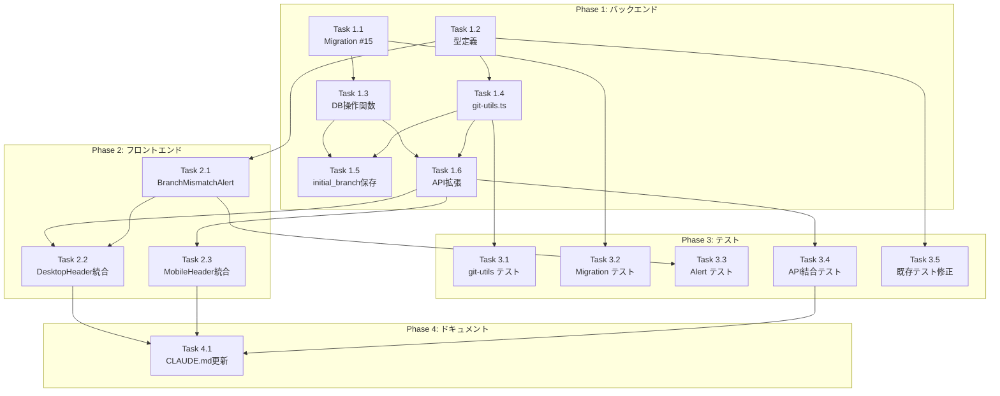

# 作業計画: Issue #111 現在の作業ブランチを可視化して欲しい

## Issue: 現在の作業ブランチを可視化して欲しい

**Issue番号**: #111
**サイズ**: L（Large）
**優先度**: Medium
**依存Issue**: なし
**設計方針書**: `dev-reports/design/issue-111-branch-visualization-design-policy.md` (v1.4)

---

## 詳細タスク分解

### Phase 1: バックエンド実装

#### Task 1.1: DBマイグレーション（Migration #15）
- **成果物**: `src/lib/db-migrations.ts`
- **依存**: なし
- **内容**:
  - `CURRENT_SCHEMA_VERSION` を 14 → 15 に更新
  - `add-initial-branch-column` マイグレーション追加
  - `worktrees` テーブルに `initial_branch TEXT` カラム追加
  - `down()` 関数でrollback手順実装

#### Task 1.2: 型定義追加
- **成果物**: `src/types/models.ts`
- **依存**: なし
- **内容**:
  - `GitStatus` interface 追加（JSDoc付き）
  - `Worktree` interface に `gitStatus?: GitStatus` 追加

#### Task 1.3: DB操作関数追加
- **成果物**: `src/lib/db.ts`
- **依存**: Task 1.1
- **内容**:
  - `saveInitialBranch(db, worktreeId, branchName)` 関数
  - `getInitialBranch(db, worktreeId)` 関数
  - プリペアドステートメント使用（SQLインジェクション対策）

#### Task 1.4: git-utils.ts 作成
- **成果物**: `src/lib/git-utils.ts`（新規）
- **依存**: Task 1.2
- **内容**:
  - `getGitStatus(worktreePath, initialBranch)` 関数
  - `execFile` 使用（コマンドインジェクション対策）
  - 1秒タイムアウト設定
  - detached HEAD / エラーハンドリング

#### Task 1.5: initial_branch保存処理追加
- **成果物**: `src/app/api/worktrees/[id]/send/route.ts`
- **依存**: Task 1.3, Task 1.4
- **内容**:
  - `startSession()` 呼び出し後に `saveInitialBranch()` 実行
  - 現在のブランチを取得して保存

#### Task 1.6: API拡張（gitStatus追加）
- **成果物**: `src/app/api/worktrees/[id]/route.ts`
- **依存**: Task 1.3, Task 1.4
- **内容**:
  - `getGitStatus()` 呼び出し
  - レスポンスに `gitStatus` フィールド追加
  - 既存スプレッドパターンに統合

---

### Phase 2: フロントエンド実装

#### Task 2.1: BranchMismatchAlert.tsx 作成
- **成果物**: `src/components/worktree/BranchMismatchAlert.tsx`（新規）
- **依存**: Task 1.2
- **内容**:
  - `BranchMismatchAlertProps` interface（ISP準拠）
  - 警告UI（amber/yellow、AlertTriangle アイコン）
  - 閉じるボタン
  - `dismissed` 状態管理（KISS準拠）
  - `useEffect` でブランチ変更時にリセット

#### Task 2.2: DesktopHeader統合
- **成果物**: `src/components/worktree/WorktreeDetailRefactored.tsx`
- **依存**: Task 2.1, Task 1.6
- **内容**:
  - ブランチ名表示UI追加
  - `BranchMismatchAlert` 配置（ヘッダーとコンテンツの間）
  - XSS対策（React自動エスケープ）

#### Task 2.3: MobileHeader統合
- **成果物**: `src/components/mobile/MobileHeader.tsx`
- **依存**: Task 1.6
- **内容**:
  - モバイル用ブランチ表示追加
  - 長いブランチ名のtruncate処理

---

### Phase 3: テスト実装

#### Task 3.1: git-utils.ts 単体テスト
- **成果物**: `tests/unit/git-utils.test.ts`（新規）
- **依存**: Task 1.4
- **内容**:
  - 正常系: ブランチ名取得
  - タイムアウト: `(unknown)` 返却
  - detached HEAD: `(detached HEAD)` 返却
  - Vitestモック使用

#### Task 3.2: Migration #15 テスト
- **成果物**: `tests/unit/db-migrations.test.ts`（追記）
- **依存**: Task 1.1
- **内容**:
  - up() マイグレーション検証
  - initial_branch カラム存在確認

#### Task 3.3: BranchMismatchAlert テスト
- **成果物**: `tests/unit/components/BranchMismatchAlert.test.tsx`（新規）
- **依存**: Task 2.1
- **内容**:
  - 表示条件テスト
  - 閉じるボタンテスト
  - ブランチ変更時のリセットテスト

#### Task 3.4: API結合テスト
- **成果物**: `tests/integration/api-worktrees-git-status.test.ts`（新規）
- **依存**: Task 1.6
- **内容**:
  - gitStatus フィールド存在確認
  - 各フィールド値検証

#### Task 3.5: 既存テスト修正
- **成果物**: `tests/unit/db.test.ts`, `tests/integration/api-worktrees.test.ts`
- **依存**: Task 1.2
- **内容**:
  - gitStatus オプショナルフィールド対応

---

### Phase 4: ドキュメント

#### Task 4.1: CLAUDE.md 更新
- **成果物**: `CLAUDE.md`
- **依存**: Phase 1-3 完了
- **内容**:
  - 「最近の実装機能」セクションに Issue #111 追加
  - git-utils.ts を主要機能モジュールセクションに追加

---

## タスク依存関係

---

## 品質チェック項目

| チェック項目 | コマンド | 基準 |
|-------------|----------|------|
| ESLint | `npm run lint` | エラー0件 |
| TypeScript | `npx tsc --noEmit` | 型エラー0件 |
| Unit Test | `npm run test:unit` | 全テストパス |
| Build | `npm run build` | 成功 |

---

## 成果物チェックリスト

### コード
- [ ] `src/lib/db-migrations.ts` - Migration #15
- [ ] `src/types/models.ts` - GitStatus interface
- [ ] `src/lib/db.ts` - saveInitialBranch, getInitialBranch
- [ ] `src/lib/git-utils.ts` - getGitStatus（新規）
- [ ] `src/app/api/worktrees/[id]/route.ts` - gitStatus追加
- [ ] `src/app/api/worktrees/[id]/send/route.ts` - initial_branch保存
- [ ] `src/components/worktree/BranchMismatchAlert.tsx`（新規）
- [ ] `src/components/worktree/WorktreeDetailRefactored.tsx` - 統合
- [ ] `src/components/mobile/MobileHeader.tsx` - 統合

### テスト
- [ ] `tests/unit/git-utils.test.ts`（新規）
- [ ] `tests/unit/db-migrations.test.ts`（追記）
- [ ] `tests/unit/components/BranchMismatchAlert.test.tsx`（新規）
- [ ] `tests/integration/api-worktrees-git-status.test.ts`（新規）
- [ ] 既存テスト修正

### ドキュメント
- [ ] `CLAUDE.md` 更新

---

## Definition of Done

Issue完了条件：
- [ ] すべての実装タスクが完了
- [ ] 単体テストカバレッジ80%以上
- [ ] CIチェック全パス（lint, type-check, test, build）
- [ ] 受け入れ条件9項目すべて満たす
- [ ] ドキュメント更新完了

### 受け入れ条件（Issue #111より）
1. [ ] ワークツリー詳細画面のヘッダーに現在のgitブランチ名が表示される
2. [ ] セッション開始時のブランチと現在のブランチが異なる場合、視覚的に警告が表示される
3. [ ] モバイル表示でもブランチ情報が確認できる
4. [ ] ブランチ情報は定期的に更新される（アクティブ時: 2秒、アイドル時: 5秒）
5. [ ] パフォーマンスへの影響が最小限である
6. [ ] DBマイグレーション（Migration #15）が正常に適用される
7. [ ] detached HEAD状態でも警告が不適切に表示されない
8. [ ] gitコマンドタイムアウト時もアプリが正常に動作する
9. [ ] 既存テストが全てパスする（後方互換性維持）

---

## 次のアクション

作業計画承認後：
1. **ブランチ作成**: `feature/111-branch-visualization`
2. **タスク実行**: Phase 1 → Phase 2 → Phase 3 → Phase 4 の順で実装
3. **進捗報告**: `/progress-report`で定期報告
4. **PR作成**: `/create-pr`で自動作成

---

## 関連ドキュメント

- Issue: https://github.com/Kewton/CommandMate/issues/111
- 設計方針書: `dev-reports/design/issue-111-branch-visualization-design-policy.md`
- Issueレビュー: `dev-reports/issue/111/issue-review/summary-report.md`
- 設計レビュー: `dev-reports/issue/111/multi-stage-design-review/summary-report.md`

---

*Generated by /work-plan command*
