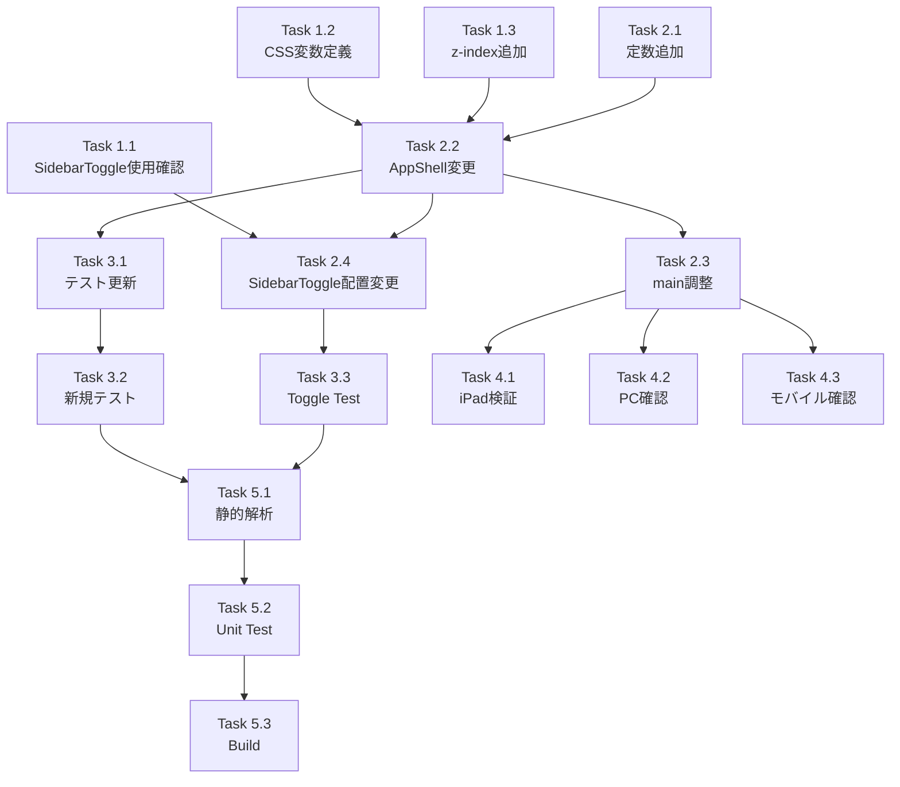

# Issue #112 作業計画書

## Issue概要

**Issue番号**: #112
**タイトル**: perf: サイドバートグルのパフォーマンス改善（transform方式への変更）
**サイズ**: M（中規模）
**優先度**: Medium
**依存Issue**: なし
**関連Issue**: #104（iPad フルスクリーン対応）, #99（z-index管理）

---

## 1. 目標

iPadでサイドバーの表示/非表示を切り替える際の動作遅延（モッサリ感）を改善する。
デスクトップレイアウトのサイドバーアニメーション方式を`width`方式から`transform`方式に変更し、GPUアクセラレーションを活用する。

---

## 2. 詳細タスク分解

### Phase 1: 準備作業

- [ ] **Task 1.1**: SidebarToggle使用箇所の確認
  - 作業: `grep -r "SidebarToggle" src/`で全使用箇所を特定
  - 成果物: 使用箇所リスト
  - 依存: なし

- [ ] **Task 1.2**: CSS変数定義
  - 作業: `globals.css`に`--sidebar-width: 18rem`を追加
  - 成果物: `src/app/globals.css`
  - 依存: なし

- [ ] **Task 1.3**: z-index定数追加
  - 作業: `z-index.ts`に`SIDEBAR: 20`を追加
  - 成果物: `src/config/z-index.ts`
  - 依存: なし

### Phase 2: コア実装

- [ ] **Task 2.1**: AppShell.tsx トランジション定数追加
  - 作業: `SIDEBAR_TRANSITION_CLASSES`定数を定義
  - 成果物: `src/components/layout/AppShell.tsx`
  - 依存: なし

- [ ] **Task 2.2**: AppShell.tsx デスクトップレイアウト変更
  - 作業:
    - `aside`をfixed配置に変更
    - width方式からtransform方式に変更
    - CSS変数`var(--sidebar-width)`を使用
    - `inert`属性でアクセシビリティ対応
  - 成果物: `src/components/layout/AppShell.tsx`
  - 依存: Task 1.2, Task 1.3, Task 2.1

- [ ] **Task 2.3**: AppShell.tsx メインコンテンツ調整
  - 作業:
    - 不要な`transition-all`を削除
    - 無意味な条件分岐を削除
    - `padding-left`によるサイドバー分の余白制御
  - 成果物: `src/components/layout/AppShell.tsx`
  - 依存: Task 2.2

- [ ] **Task 2.4**: SidebarToggle配置変更
  - 作業:
    - SidebarToggleをサイドバー内部（右端）に配置
    - 状態依存の`left`位置計算を削除
  - 成果物: `src/components/layout/AppShell.tsx`, `src/components/layout/SidebarToggle.tsx`
  - 依存: Task 2.2

### Phase 3: テスト更新

- [ ] **Task 3.1**: AppShell.test.tsx 既存テスト更新
  - 作業:
    - `w-72`/`w-0`チェック → `translate-x-0`/`-translate-x-full`に変更
    - Line 281: `'should start with sidebar open on desktop by default'`
    - Line 302: `'should render with custom initial state'`
  - 成果物: `tests/unit/components/layout/AppShell.test.tsx`
  - 依存: Task 2.2

- [ ] **Task 3.2**: AppShell.test.tsx 新規テスト追加
  - 作業:
    - `inert`属性（またはaria-hidden）の存在確認テスト
    - `transform`/`transition-transform`クラスの確認テスト
    - CSS変数使用クラスの検証テスト
  - 成果物: `tests/unit/components/layout/AppShell.test.tsx`
  - 依存: Task 3.1

- [ ] **Task 3.3**: SidebarToggle.test.tsx 確認・更新
  - 作業:
    - テストファイルの存在確認
    - 配置変更に伴うテスト更新（必要な場合）
  - 成果物: `tests/unit/components/layout/SidebarToggle.test.tsx`
  - 依存: Task 2.4

### Phase 4: 検証

- [ ] **Task 4.1**: iPad実機プロトタイプ検証
  - 作業:
    - サイドバートグル時のアニメーション確認
    - padding-left変更時の視覚的ジャンプ確認
    - 必要に応じて代替案を採用
  - 成果物: 検証レポート
  - 依存: Task 2.3

- [ ] **Task 4.2**: デスクトップPC動作確認
  - 作業:
    - 既存動作に問題がないことを確認
    - 768px境界でのレイアウト遷移確認
  - 成果物: 確認完了
  - 依存: Task 2.3

- [ ] **Task 4.3**: モバイル動作確認
  - 作業:
    - モバイル表示に影響がないことを確認
    - 既存のtransform方式が維持されていることを確認
  - 成果物: 確認完了
  - 依存: Task 2.3

### Phase 5: 品質チェック

- [ ] **Task 5.1**: 静的解析
  - 作業: ESLint, TypeScriptチェック
  - コマンド: `npm run lint && npx tsc --noEmit`
  - 依存: Phase 2, Phase 3完了

- [ ] **Task 5.2**: ユニットテスト実行
  - 作業: 全ユニットテスト実行
  - コマンド: `npm run test:unit`
  - 依存: Task 5.1

- [ ] **Task 5.3**: ビルド確認
  - 作業: プロダクションビルド
  - コマンド: `npm run build`
  - 依存: Task 5.2

---

## 3. タスク依存関係

---

## 4. 変更ファイル一覧

### 直接変更
| ファイル | 変更種別 | 内容 |
|---------|---------|------|
| `src/app/globals.css` | 追加 | `--sidebar-width: 18rem` |
| `src/config/z-index.ts` | 追加 | `SIDEBAR: 20` |
| `src/components/layout/AppShell.tsx` | 変更 | transform方式に変更 |
| `src/components/layout/SidebarToggle.tsx` | 変更 | 配置方式変更 |
| `tests/unit/components/layout/AppShell.test.tsx` | 変更 | テスト更新 |

### 確認のみ（変更なし想定）
| ファイル | 確認内容 |
|---------|---------|
| `src/contexts/SidebarContext.tsx` | DEFAULT_SIDEBAR_WIDTH定数との同期 |
| `src/components/layout/Header.tsx` | z-50使用箇所との相互作用 |
| `src/components/layout/Sidebar.tsx` | 変更不要の確認 |

---

## 5. 品質チェック項目

| チェック項目 | コマンド | 基準 |
|-------------|----------|------|
| ESLint | `npm run lint` | エラー0件 |
| TypeScript | `npx tsc --noEmit` | 型エラー0件 |
| Unit Test | `npm run test:unit` | 全テストパス |
| Build | `npm run build` | 成功 |

---

## 6. 成果物チェックリスト

### コード
- [ ] CSS変数`--sidebar-width`定義
- [ ] z-index定数`SIDEBAR`追加
- [ ] AppShell.tsx transform方式実装
- [ ] SidebarToggle配置変更
- [ ] `inert`属性によるアクセシビリティ対応

### テスト
- [ ] 既存テスト更新（translate-x方式）
- [ ] 新規テスト追加（inert, transform, CSS変数）

### 検証
- [ ] iPad実機検証完了
- [ ] デスクトップPC動作確認完了
- [ ] モバイル動作確認完了

---

## 7. リスクと対策

| リスク | 影響度 | 対策 |
|-------|-------|------|
| padding-left変更時の視覚的ジャンプ | 中 | iPad実機で事前検証、必要に応じてtransition追加 |
| z-index競合 | 低 | z-20に設定し、z-30のモバイル要素と分離済み |
| SidebarToggle配置変更の影響範囲拡大 | 低 | 事前にgrep確認、AppShell外での使用なしを確認 |

---

## 8. Definition of Done

Issue完了条件：
- [ ] すべてのタスクが完了
- [ ] CIチェック全パス（lint, type-check, test, build）
- [ ] iPad実機でモッサリ感が解消されていることを確認
- [ ] デスクトップPC/モバイルで既存動作に問題がないことを確認
- [ ] アクセシビリティ要件（inert属性）が実装されている
- [ ] 設計方針書のチェックリストがすべて完了

---

## 9. 次のアクション

作業計画承認後：
1. **ブランチ作成**: `feature/112-sidebar-transform-performance`
2. **タスク実行**: Phase 1から順次実装
3. **進捗報告**: `/progress-report`で定期報告
4. **PR作成**: `/create-pr`で自動作成

---

## 10. 関連ドキュメント

- [設計方針書](../design/issue-112-sidebar-transform-design-policy.md)
- [Issueレビュー結果](./issue-review/)
- [マルチステージ設計レビュー結果](./multi-stage-design-review/)

---

*Created: 2026-02-01*
*設計書: dev-reports/design/issue-112-sidebar-transform-design-policy.md*
