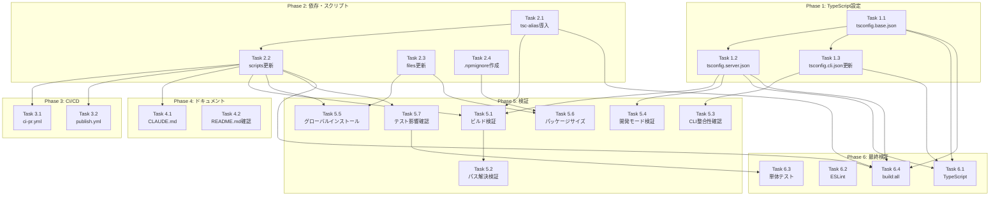

# Issue #113 作業計画

## Issue: server.tsをビルド済みJSに変換してtsxランタイム依存を解消

**Issue番号**: #113
**サイズ**: M（中規模）
**優先度**: High（グローバルインストールの根本問題解決）
**依存Issue**: #96（npm CLIサポート）
**設計方針書**: `dev-reports/design/issue-113-server-build-design-policy.md`
**マルチステージレビュー完了**: 2026-02-01（4段階完了）

---

## 1. 実装概要

`npm install -g commandmate` 後に `commandmate start` で発生する `tsx: command not found` エラーを解消するため、`server.ts`をビルド済みJavaScriptに変換する。

### 主要変更点

1. `tsconfig.base.json` / `tsconfig.server.json` の新規作成
2. `tsc-alias` の導入（@/パスエイリアス解決）
3. `package.json` のスクリプト・files更新
4. CI/CDパイプラインの更新

---

## 2. 詳細タスク分解

### Phase 1: TypeScript設定（基盤構築）

- [ ] **Task 1.1**: tsconfig.base.json新規作成
  - 成果物: `tsconfig.base.json`
  - 内容: 共通compilerOptions（target, module, moduleResolution, esModuleInterop, strict, skipLibCheck, baseUrl, paths）
  - 依存: なし

- [ ] **Task 1.2**: tsconfig.server.json新規作成
  - 成果物: `tsconfig.server.json`
  - 内容: server.ts用ビルド設定（extends base、outDir: dist/server、必要なincludeリスト）
  - 依存: Task 1.1
  - **重要**: 以下のファイルをincludeに含める
    - server.ts
    - src/lib/env.ts, ws-server.ts, worktrees.ts, db.ts, db-instance.ts, db-migrations.ts
    - src/lib/response-poller.ts, cli-session.ts, prompt-detector.ts, conversation-logger.ts, claude-output.ts, cli-patterns.ts
    - src/lib/cli-tools/**/*.ts, src/types/**/*.ts

- [ ] **Task 1.3**: tsconfig.cli.json更新
  - 成果物: `tsconfig.cli.json`（更新）
  - 内容: `extends: "./tsconfig.base.json"`追加、`paths: {}`でオーバーライド
  - 依存: Task 1.1

### Phase 2: 依存関係・スクリプト更新

- [ ] **Task 2.1**: tsc-alias導入
  - コマンド: `npm install -D tsc-alias@~1.8.16`
  - 成果物: `package.json`（devDependencies更新）
  - 依存: なし

- [ ] **Task 2.2**: package.json scriptsセクション更新
  - 成果物: `package.json`（scripts更新）
  - 変更内容:
    - `build:server`: `"tsc --project tsconfig.server.json && tsc-alias -p tsconfig.server.json"`
    - `build:all`: `"npm run build && npm run build:cli && npm run build:server"`
    - `start`: `"NODE_ENV=production node dist/server/server.js"`
    - `prepublishOnly`: `"npm run build:all"`
  - 依存: Task 2.1

- [ ] **Task 2.3**: package.json filesフィールド更新
  - 成果物: `package.json`（files更新）
  - 変更内容: `["bin/", "dist/", ".next/", "public/", ".env.example"]`（src/除外）
  - 依存: なし

- [ ] **Task 2.4**: .npmignoreファイル作成
  - 成果物: `.npmignore`（新規）
  - 内容: `src/`, `tests/`, `*.ts`, `!*.d.ts`
  - 依存: なし

### Phase 3: CI/CD更新

- [ ] **Task 3.1**: ci-pr.yml更新
  - 成果物: `.github/workflows/ci-pr.yml`（更新）
  - 変更内容: buildジョブにbuild:serverステップ追加（ステップ分離）
  - 依存: Task 2.2

- [ ] **Task 3.2**: publish.yml更新
  - 成果物: `.github/workflows/publish.yml`（更新）
  - 変更内容: build:serverステップ追加、パッケージサイズ計測ステップ追加
  - 依存: Task 2.2

### Phase 4: ドキュメント更新

- [ ] **Task 4.1**: CLAUDE.md更新
  - 成果物: `CLAUDE.md`（更新）
  - 内容: `build:server`コマンドを開発コマンドセクションに追記
  - 依存: Task 2.2

- [ ] **Task 4.2**: README.md確認
  - 確認内容: インストール手順に影響がないことを確認
  - 依存: なし

### Phase 5: 検証・テスト

- [ ] **Task 5.1**: ビルド検証
  - コマンド: `npm run build:server`
  - 確認: dist/server/server.jsが生成されること
  - 確認: tsc-aliasが@/パスを相対パスに変換すること
  - 依存: Task 1.1, 1.2, 2.1, 2.2

- [ ] **Task 5.2**: パス解決検証
  - 確認: `dist/server/src/types/models.js`のimportパスが相対パスに変換されていること
  - 依存: Task 5.1

- [ ] **Task 5.3**: bin/commandmate.jsパス整合性確認
  - コマンド: `node -e "require('./bin/commandmate.js')" --help`
  - 確認: CLIが正常に動作すること
  - 依存: Task 1.3

- [ ] **Task 5.4**: 開発モード検証
  - コマンド: `npm run dev`
  - 確認: tsconfig.server.json追加後も正常に動作すること
  - 依存: Task 1.2

- [ ] **Task 5.5**: グローバルインストール検証
  - 手順:
    1. `npm pack`
    2. `npm install -g commandmate-*.tgz`
    3. `commandmate init --defaults`
    4. `commandmate start --daemon`
    5. `commandmate status`
    6. `commandmate stop`
    7. `npm uninstall -g commandmate`
  - 依存: Task 2.2, 2.3

- [ ] **Task 5.6**: パッケージサイズ確認
  - コマンド: `npm pack --dry-run`
  - 確認: 50MB以下であること
  - 確認: src/が含まれていないこと
  - 依存: Task 2.3, 2.4

- [ ] **Task 5.7**: 既存テスト影響確認
  - 確認ファイル:
    - `tests/unit/cli/commands/start.test.ts`
    - `tests/unit/cli/utils/daemon.test.ts`
  - 確認: startスクリプト変更の影響有無
  - 依存: Task 2.2

### Phase 6: 最終検証・品質チェック

- [ ] **Task 6.1**: TypeScriptチェック
  - コマンド: `npx tsc --noEmit`
  - 依存: Task 1.1, 1.2, 1.3

- [ ] **Task 6.2**: ESLintチェック
  - コマンド: `npm run lint`
  - 依存: なし

- [ ] **Task 6.3**: 単体テスト実行
  - コマンド: `npm run test:unit`
  - 依存: Task 5.7

- [ ] **Task 6.4**: ビルド確認
  - コマンド: `npm run build:all`
  - 依存: Task 1.1, 1.2, 2.1, 2.2

---

## 3. タスク依存関係

---

## 4. 品質チェック項目

| チェック項目 | コマンド | 基準 |
|-------------|----------|------|
| ESLint | `npm run lint` | エラー0件 |
| TypeScript | `npx tsc --noEmit` | 型エラー0件 |
| Unit Test | `npm run test:unit` | 全テストパス |
| Build | `npm run build:all` | 成功 |
| Package Size | `npm pack --dry-run` | 50MB以下 |

---

## 5. 成果物チェックリスト

### 新規ファイル
- [ ] `tsconfig.base.json`
- [ ] `tsconfig.server.json`
- [ ] `.npmignore`
- [ ] `dist/server/server.js`（ビルド成果物）

### 更新ファイル
- [ ] `tsconfig.cli.json`
- [ ] `package.json`
- [ ] `.github/workflows/ci-pr.yml`
- [ ] `.github/workflows/publish.yml`
- [ ] `CLAUDE.md`

### 確認のみ
- [ ] `README.md`（影響なし確認）
- [ ] `bin/commandmate.js`（パス整合性確認）

---

## 6. Definition of Done

Issue完了条件:

### 機能要件
- [ ] `npm install -g commandmate` でインストール後、`commandmate start`が正常に動作する
- [ ] `tsx`が`devDependencies`のままで動作する
- [ ] 開発モード（`npm run dev`）が引き続き動作する

### 品質要件
- [ ] 全テストがパスする
- [ ] ESLint/TypeScriptチェックがパスする
- [ ] パッケージサイズが50MB以下

### CI/CD要件
- [ ] ci-pr.ymlでbuild:serverが検証される
- [ ] publish.ymlでbuild:serverが実行される

### ドキュメント要件
- [ ] CLAUDE.mdにbuild:serverコマンドが追記されている
- [ ] README.mdのインストール手順に影響がないことを確認

---

## 7. リスクと対策

| リスク | 影響度 | 対策 |
|--------|--------|------|
| tsc-aliasが@/パスを正しく解決しない | 高 | Task 5.2で検証、問題時は相対パス化を検討 |
| パッケージサイズが50MBを超える | 中 | Task 5.6で計測、超過時はstandaloneモード検討 |
| 既存テストが失敗する | 中 | Task 5.7で事前確認、必要に応じてテスト更新 |
| bin/commandmate.jsのパスが壊れる | 高 | Task 5.3で検証、tsconfig.cli.jsonのoutDirは変更しない |

### ロールバック手順

問題発生時は設計方針書Section 4.5に従い、以下の順序でロールバック:

1. `package.json`のscripts/files/devDependenciesを元に戻す
2. `tsconfig.base.json`, `tsconfig.server.json`を削除
3. `tsconfig.cli.json`のextends/pathsオーバーライドを削除
4. CI/CDワークフローからbuild:serverステップを削除
5. `tsx`を`dependencies`に追加（暫定対応）

---

## 8. 次のアクション

作業計画承認後:

1. **ブランチ作成**: `feature/113-server-build-js`
2. **タスク実行**: Phase 1 → Phase 6 の順に実装
3. **進捗報告**: `/progress-report` で定期報告
4. **PR作成**: `/create-pr` で自動作成

---

## 9. 参考資料

- **設計方針書**: `dev-reports/design/issue-113-server-build-design-policy.md`
- **マルチステージレビュー結果**: `dev-reports/issue/113/multi-stage-design-review/`
- **関連Issue**: #96（npm CLIサポート）

---

*作成日: 2026-02-01*
