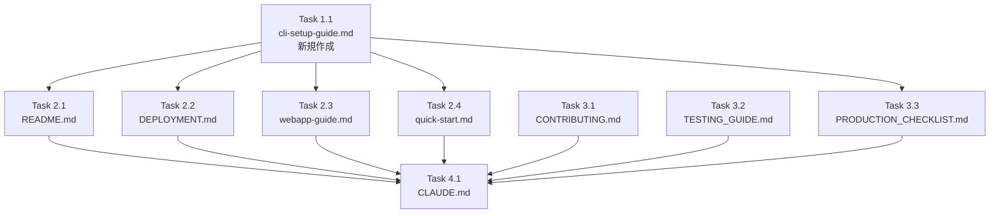

# Issue #114 作業計画

## Issue概要

| 項目 | 内容 |
|------|------|
| **Issue番号** | #114 |
| **タイトル** | 「npm install -g commandmate」によるセットアップを前提としたドキュメンテーション |
| **サイズ** | M（中規模） |
| **優先度** | High |
| **依存Issue** | #113（完了）, #96（完了） |
| **タイプ** | Documentation |

## 作業概要

`npm install -g commandmate` を標準のセットアップ方法とし、git clone方式は開発者向けとして位置づけを明確化するドキュメント更新。

---

## Phase 1: 新規ドキュメント作成

### Task 1.1: cli-setup-guide.md の作成
- **成果物**: `docs/user-guide/cli-setup-guide.md`
- **依存**: なし
- **内容**:
  - [ ] 前提条件チェックリスト（Node.js v20+, npm, tmux, openssl）
  - [ ] npm install -g commandmate のインストール手順
  - [ ] 初回実行ガイド（commandmate init → start）
  - [ ] CLI コマンドリファレンス（version, init, start, stop, status）
  - [ ] トラブルシューティング
    - command not found エラー対応
    - 権限エラー（EACCES）対応
    - ポート競合対応
    - サーバー起動失敗対応
  - [ ] アップグレード手順
  - [ ] アンインストール手順

---

## Phase 2: 主要ドキュメント更新

### Task 2.1: README.md の更新
- **成果物**: `README.md`
- **依存**: Task 1.1
- **変更内容**:
  - [ ] Quick Start セクションを npm install -g 方式に変更
  - [ ] 新セクション「開発者向けセットアップ」に git clone 手順を移動
  - [ ] commandmate CLI コマンドの説明を追加
  - [ ] cli-setup-guide.md へのリンクを追加
  - [ ] `./scripts/*` 参照を「開発環境のみ」と明記

### Task 2.2: docs/DEPLOYMENT.md の更新
- **成果物**: `docs/DEPLOYMENT.md`
- **依存**: Task 1.1
- **変更内容**:
  - [ ] セットアップ手順の冒頭に npm install -g 方式を追加
  - [ ] 「自動セットアップ」を npm install -g に変更
  - [ ] git clone 方式は「開発環境セットアップ」として残す
  - [ ] PM2/Systemd との組み合わせ例を npm install -g 対応に更新
  - [ ] `./scripts/*` 参照を「開発環境のみ」と明記

### Task 2.3: docs/user-guide/webapp-guide.md の更新
- **成果物**: `docs/user-guide/webapp-guide.md`
- **依存**: Task 1.1
- **変更内容**:
  - [ ] 「アプリの起動とアクセス」セクションを npm install -g 前提に更新
  - [ ] commandmate start/stop コマンドの使い方を追加
  - [ ] cli-setup-guide.md へのリンクを追加

### Task 2.4: docs/user-guide/quick-start.md の更新
- **成果物**: `docs/user-guide/quick-start.md`
- **依存**: Task 1.1
- **変更内容**:
  - [ ] 前提条件としてのインストール方法を追加
  - [ ] cli-setup-guide.md へのリンクを追加

---

## Phase 3: 補助ドキュメント更新

### Task 3.1: CONTRIBUTING.md の更新
- **成果物**: `CONTRIBUTING.md`
- **依存**: なし
- **変更内容**:
  - [ ] 「コントリビューターは git clone を使用」と明記
  - [ ] 開発環境セットアップを強調

### Task 3.2: docs/internal/TESTING_GUIDE.md の更新
- **成果物**: `docs/internal/TESTING_GUIDE.md`
- **依存**: なし
- **変更内容**:
  - [ ] 環境変数を `MCBD_*` から `CM_*` に更新（25行目付近）
  - [ ] データベースパスを `cm.db` に統一
  - [ ] その他の旧名称参照を更新

### Task 3.3: docs/internal/PRODUCTION_CHECKLIST.md の更新
- **成果物**: `docs/internal/PRODUCTION_CHECKLIST.md`
- **依存**: Task 1.1
- **変更内容**:
  - [ ] npm install -g 方式のセクションを追加
  - [ ] データベースパスを `cm.db` に統一
  - [ ] `./scripts/*` 参照を「開発環境のみ」と明記

---

## Phase 4: CLAUDE.md 更新

### Task 4.1: CLAUDE.md の更新
- **成果物**: `CLAUDE.md`
- **依存**: Phase 1-3 完了
- **変更内容**:
  - [ ] Issue #114 の記載を「最近の実装機能」セクションに追加

---

## タスク依存関係

---

## 品質チェック項目

| チェック項目 | コマンド/確認方法 | 基準 |
|-------------|-----------------|------|
| Markdownリント | 目視確認 | 構文エラーなし |
| リンク確認 | 全リンクのクリック確認 | デッドリンクなし |
| 環境変数統一 | `grep -r "MCBD_" docs/` | CM_* に統一 |
| 一貫性確認 | 全ドキュメント読み合わせ | 矛盾なし |

---

## 成果物チェックリスト

### 新規作成ファイル
- [ ] `docs/user-guide/cli-setup-guide.md`

### 更新ファイル
- [ ] `README.md`
- [ ] `docs/DEPLOYMENT.md`
- [ ] `docs/user-guide/webapp-guide.md`
- [ ] `docs/user-guide/quick-start.md`
- [ ] `CONTRIBUTING.md`
- [ ] `docs/internal/TESTING_GUIDE.md`
- [ ] `docs/internal/PRODUCTION_CHECKLIST.md`
- [ ] `CLAUDE.md`

---

## Definition of Done

Issue完了条件：
- [ ] すべてのタスクが完了
- [ ] README.md の Quick Start が npm install -g 方式になっている
- [ ] commandmate init / start / stop / status の使い方が記載されている
- [ ] git clone 方式が「開発者向け」として明確に分離されている
- [ ] 全ドキュメントで一貫した記載になっている
- [ ] 全ドキュメントで環境変数が `CM_*` に統一されている
- [ ] `./scripts/*` 参照が「開発環境のみ」と明記されている
- [ ] cli-setup-guide.md が新規作成されている
- [ ] トラブルシューティングが記載されている
- [ ] コードレビュー承認

---

## テストシナリオ

### シナリオ1: ドキュメント通りの新規インストール
1. `npm install -g commandmate` を実行
2. `commandmate --version` でバージョン確認
3. `commandmate init --defaults` を実行
4. `commandmate start --daemon` を実行
5. http://localhost:3000 にアクセスできることを確認
6. `commandmate status` で状態確認
7. `commandmate stop` で停止できることを確認

### シナリオ2: 開発者向けセットアップ（ドキュメント通り）
1. `git clone` を実行
2. `npm install` を実行
3. `.env` を設定
4. `npm run dev` で開発サーバー起動
5. 動作確認

---

## 想定作業時間

| Phase | タスク数 | 想定時間 |
|-------|---------|---------|
| Phase 1 | 1 | 30分 |
| Phase 2 | 4 | 60分 |
| Phase 3 | 3 | 30分 |
| Phase 4 | 1 | 10分 |
| レビュー・修正 | - | 20分 |
| **合計** | **9** | **約2.5時間** |

---

## 次のアクション

作業計画承認後：
1. **ブランチ作成**: `docs/114-npm-install-documentation`
2. **タスク実行**: Phase 1 → Phase 2 → Phase 3 → Phase 4 の順で実装
3. **進捗報告**: `/progress-report` で定期報告
4. **PR作成**: `/create-pr` で自動作成

---

## 関連ドキュメント

- [Issue #114](https://github.com/Kewton/CommandMate/issues/114)
- [Issue #113 - server.tsビルド済みJS変換](https://github.com/Kewton/CommandMate/issues/113)
- [Issue #96 - npm CLIサポート](https://github.com/Kewton/CommandMate/issues/96)
