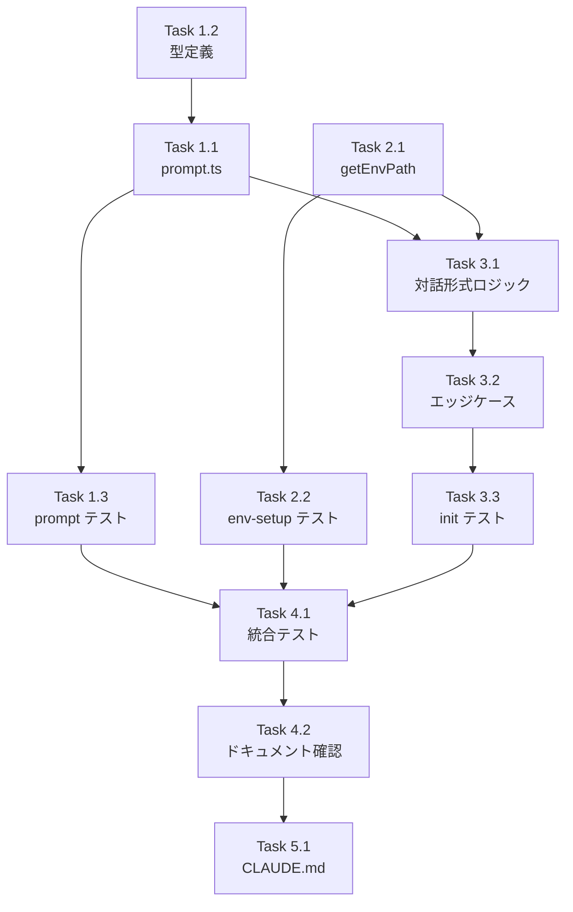

# Issue #119 作業計画

## Issue概要

| 項目 | 内容 |
|------|------|
| **Issue番号** | #119 |
| **タイトル** | commandmate init: 対話形式セットアップの実装 |
| **サイズ** | M（中規模） |
| **優先度** | High |
| **依存Issue** | なし |
| **タイプ** | Enhancement |

## 作業概要

`commandmate init` コマンドに対話形式のセットアップ機能を実装する。`scripts/setup-env.sh` の機能を TypeScript に移植し、ユーザーが CLI から直接設定を入力できるようにする。

---

## Phase 1: 対話ユーティリティの実装

### Task 1.1: prompt.ts の新規作成
- **成果物**: `src/cli/utils/prompt.ts`
- **依存**: なし
- **内容**:
  - [ ] `prompt()` 関数 - デフォルト値付き入力プロンプト
  - [ ] `confirm()` 関数 - Yes/No 確認プロンプト
  - [ ] `expandTilde()` 関数 - チルダをホームディレクトリに展開
  - [ ] `validatePort()` 関数 - ポート番号バリデーション
  - [ ] readline インターフェースのラッパー

### Task 1.2: 型定義の追加
- **成果物**: `src/cli/types/index.ts`
- **依存**: なし
- **内容**:
  - [ ] `PromptOptions` インターフェース追加
  - [ ] `PromptResult` 型追加（必要に応じて）

### Task 1.3: prompt.ts のユニットテスト
- **成果物**: `tests/unit/cli/utils/prompt.test.ts`
- **依存**: Task 1.1
- **内容**:
  - [ ] `expandTilde()` のテスト
  - [ ] `validatePort()` のテスト
  - [ ] stdin モックを使用した `prompt()` テスト
  - [ ] stdin モックを使用した `confirm()` テスト

---

## Phase 2: env-setup.ts の拡張

### Task 2.1: getEnvPath() の実装
- **成果物**: `src/cli/utils/env-setup.ts`
- **依存**: なし
- **内容**:
  - [ ] グローバルインストール判定ロジック
  - [ ] `~/.commandmate/` ディレクトリ作成
  - [ ] 環境に応じた `.env` パス返却

### Task 2.2: env-setup.ts のテスト追加
- **成果物**: `tests/unit/cli/utils/env-setup.test.ts`
- **依存**: Task 2.1
- **内容**:
  - [ ] `getEnvPath()` のグローバル判定テスト
  - [ ] `getEnvPath()` のローカル判定テスト
  - [ ] ディレクトリ作成のテスト

---

## Phase 3: init コマンドの修正

### Task 3.1: 対話形式ロジックの実装
- **成果物**: `src/cli/commands/init.ts`
- **依存**: Task 1.1, Task 2.1
- **内容**:
  - [ ] `promptForConfig()` 関数の実装
    - CM_ROOT_DIR の入力
    - CM_PORT の入力
    - 外部アクセス有効化の確認
    - CM_DB_PATH の入力
  - [ ] TTY 判定による分岐
  - [ ] `--defaults` オプション時のバイパス
  - [ ] 設定サマリー表示 `displayConfigSummary()`

### Task 3.2: エッジケース処理の実装
- **成果物**: `src/cli/commands/init.ts`
- **依存**: Task 3.1
- **内容**:
  - [ ] 存在しないパスの警告と作成確認
  - [ ] 無効なポート番号の再入力ループ
  - [ ] 認証トークン生成時のメッセージ表示
  - [ ] 空入力時のデフォルト値適用

### Task 3.3: init コマンドのテスト追加
- **成果物**: `tests/unit/cli/commands/init.test.ts`
- **依存**: Task 3.1, Task 3.2
- **内容**:
  - [ ] 対話形式モードのテスト（stdin モック）
  - [ ] `--defaults` モードのテスト（既存テスト確認）
  - [ ] `--force` モードのテスト（既存テスト確認）
  - [ ] TTY 判定のテスト
  - [ ] エッジケーステスト

---

## Phase 4: 統合テストとドキュメント確認

### Task 4.1: 統合テスト
- **成果物**: 手動テスト結果
- **依存**: Phase 1-3 完了
- **内容**:
  - [ ] `commandmate init` 対話形式の動作確認
  - [ ] `commandmate init --defaults` の動作確認
  - [ ] `commandmate init --force` の動作確認
  - [ ] グローバルインストール環境での動作確認

### Task 4.2: ドキュメント整合性確認
- **成果物**: ドキュメント修正（必要に応じて）
- **依存**: Task 4.1
- **内容**:
  - [ ] `docs/user-guide/cli-setup-guide.md` の確認
  - [ ] `docs/DEPLOYMENT.md` の確認
  - [ ] `docs/internal/PRODUCTION_CHECKLIST.md` の確認
  - [ ] `README.md` の確認

---

## Phase 5: CLAUDE.md 更新

### Task 5.1: CLAUDE.md の更新
- **成果物**: `CLAUDE.md`
- **依存**: Phase 1-4 完了
- **内容**:
  - [ ] Issue #119 の記載を「最近の実装機能」セクションに追加

---

## タスク依存関係



---

## 品質チェック項目

| チェック項目 | コマンド | 基準 |
|-------------|----------|------|
| ESLint | `npm run lint` | エラー0件 |
| TypeScript | `npx tsc --noEmit` | 型エラー0件 |
| Unit Test | `npm run test:unit` | 全テストパス |
| Build | `npm run build` | 成功 |
| CLI Build | `npm run build:cli` | 成功 |

---

## 成果物チェックリスト

### 新規作成ファイル
- [ ] `src/cli/utils/prompt.ts`
- [ ] `tests/unit/cli/utils/prompt.test.ts`

### 更新ファイル
- [ ] `src/cli/commands/init.ts`
- [ ] `src/cli/utils/env-setup.ts`
- [ ] `src/cli/types/index.ts`
- [ ] `tests/unit/cli/commands/init.test.ts`
- [ ] `tests/unit/cli/utils/env-setup.test.ts`
- [ ] `CLAUDE.md`

---

## Definition of Done

Issue完了条件：
- [ ] すべてのタスクが完了
- [ ] `commandmate init` で対話形式プロンプトが表示される
- [ ] `CM_ROOT_DIR`, `CM_PORT` を対話で設定できる
- [ ] 外部アクセス有効化で `CM_AUTH_TOKEN` が自動生成される
- [ ] `--defaults` で非対話形式が動作する
- [ ] `--force` で既存ファイルを上書きできる
- [ ] TTY でない環境では `--defaults` 相当の動作になる
- [ ] グローバルインストール時は `~/.commandmate/.env` に保存される
- [ ] チルダ（~）が正しく展開される
- [ ] 設定サマリーが表示される
- [ ] 単体テストカバレッジ80%以上
- [ ] CIチェック全パス（lint, type-check, test, build）
- [ ] ドキュメントと実装が一致する

---

## テストシナリオ

### シナリオ1: 対話形式での初期設定

```bash
$ commandmate init
# 1. CM_ROOT_DIR を入力: ~/work/git
# 2. CM_PORT をデフォルト（Enter）
# 3. 外部アクセス: N
# 4. CM_DB_PATH をデフォルト（Enter）
# → .env 作成、サマリー表示
```

### シナリオ2: 非対話形式での初期設定

```bash
$ commandmate init --defaults
# → 対話なしで ~/repos をルートとして .env 作成
```

### シナリオ3: 既存ファイルの上書き

```bash
$ commandmate init --force
# → 既存 .env をバックアップ後、対話形式で新規作成
```

### シナリオ4: CI/CD 環境（TTY なし）

```bash
# CI 環境で実行
$ commandmate init
# → TTY がないため --defaults 相当の動作
```

### シナリオ5: 外部アクセス有効化

```bash
$ commandmate init
# 1. CM_ROOT_DIR を入力
# 2. CM_PORT を入力
# 3. 外部アクセス: Y
# → CM_AUTH_TOKEN 自動生成、トークン全文表示
```

---

## 実装メモ

### readline の使用方法

```typescript
import * as readline from 'readline';

const rl = readline.createInterface({
  input: process.stdin,
  output: process.stdout,
});

function prompt(question: string): Promise<string> {
  return new Promise((resolve) => {
    rl.question(question, (answer) => {
      resolve(answer);
    });
  });
}
```

### TTY 判定

```typescript
const isInteractive = process.stdin.isTTY && !options.defaults;
```

### グローバルインストール判定

```typescript
const isGlobal = __dirname.includes('/lib/node_modules/')
             || __dirname.includes('\\node_modules\\');
```

---

## 次のアクション

作業計画承認後：
1. **ブランチ作成**: `feature/119-interactive-init`
2. **タスク実行**: Phase 1 → Phase 2 → Phase 3 → Phase 4 → Phase 5 の順で実装
3. **進捗報告**: `/progress-report` で定期報告
4. **PR作成**: `/create-pr` で自動作成

---

## 関連ドキュメント

- [Issue #119](https://github.com/Kewton/CommandMate/issues/119)
- [scripts/setup-env.sh](../../scripts/setup-env.sh) - 参照実装
- [Node.js readline](https://nodejs.org/api/readline.html)
