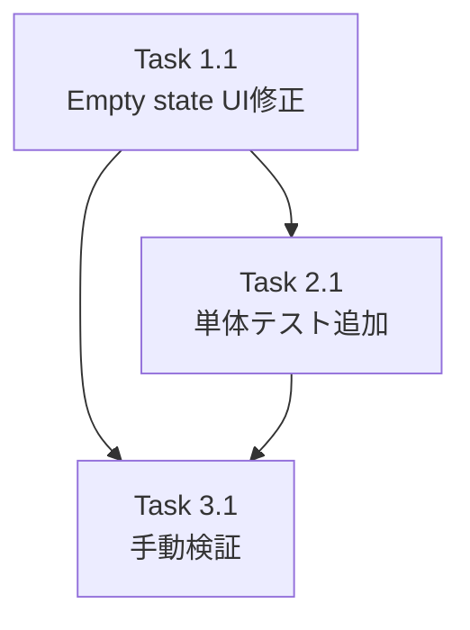

# Issue #122 作業計画

## Issue: ファイルが存在しない状態でディレクトリやファイルの新規登録が出来ない

| 項目 | 内容 |
|------|------|
| **Issue番号** | #122 |
| **サイズ** | S（Small） |
| **優先度** | Medium |
| **ラベル** | bug |
| **依存Issue** | なし |
| **関連Issue** | #49（マークダウンエディタ）、#71（クローンURL登録） |

## 概要

空のリポジトリをCloneした場合、Filesタブで「No files found」と表示されるだけで、ファイル/ディレクトリを作成する手段がない。Empty stateに「+ New File」「+ New Directory」ボタンを追加して解決する。

---

## 詳細タスク分解

### Phase 1: 実装タスク

#### Task 1.1: FileTreeViewのEmpty state UI修正
- **成果物**: `src/components/worktree/FileTreeView.tsx`
- **依存**: なし
- **作業内容**:
  - lucide-reactから`FilePlus`、`FolderPlus`アイコンをインポート
  - Empty state（行664-674）に「+ New File」「+ New Directory」ボタンを追加
  - 既存の`onNewFile`/`onNewDirectory` propsを使用（空文字列を渡す）
  - ContextMenu.tsxと整合したスタイリングを適用

```tsx
// 変更箇所: 行664-674のEmpty state処理
// Before:
if (rootItems.length === 0) {
  return (
    <div data-testid="file-tree-empty" className={`p-4 text-center text-gray-500 ${className}`}>
      <p className="text-sm">No files found</p>
    </div>
  );
}

// After: ボタン追加（Issueに記載のコード例を参照）
```

### Phase 2: テストタスク

#### Task 2.1: Empty state単体テスト追加
- **成果物**: `tests/unit/components/worktree/FileTreeView.test.tsx`
- **依存**: Task 1.1
- **作業内容**:
  - 4件のテストケースを追加
  - カバレッジ目標: 80%以上

```typescript
// 追加するテストケース
describe('Empty state', () => {
  it('should show New File and New Directory buttons when directory is empty');
  it('should call onNewFile with empty string when New File button is clicked');
  it('should call onNewDirectory with empty string when New Directory button is clicked');
  it('should not show buttons when onNewFile and onNewDirectory are undefined');
});
```

### Phase 3: 検証タスク

#### Task 3.1: 手動検証
- **依存**: Task 1.1, Task 2.1
- **作業内容**:
  - 空のリポジトリをCloneして動作確認
  - ボタンクリック → ダイアログ表示 → ファイル作成 → ツリー更新の一連の流れを確認
  - 既存機能（ファイルがある場合の右クリックメニュー）が正常動作することを確認

---

## タスク依存関係



---

## 実装詳細

### 変更ファイル

| ファイル | 変更種別 | 変更内容 |
|---------|---------|---------|
| `src/components/worktree/FileTreeView.tsx` | 修正 | Empty stateにボタン追加 |
| `tests/unit/components/worktree/FileTreeView.test.tsx` | 追加 | Empty stateテストケース4件 |

### 変更不要ファイル（参照のみ）

| ファイル | 理由 |
|---------|------|
| `src/components/worktree/ContextMenu.tsx` | スタイル参照用 |
| `src/components/worktree/WorktreeDetailRefactored.tsx` | 既存のhandleNewFile/handleNewDirectoryを使用 |
| `src/lib/file-operations.ts` | 変更不要 |

### コード変更箇所

**FileTreeView.tsx（行664-674付近）**:

```tsx
// インポート追加（ファイル先頭）
import { FilePlus, FolderPlus } from 'lucide-react';

// Empty state修正
if (rootItems.length === 0) {
  return (
    <div
      data-testid="file-tree-empty"
      className={`p-4 text-center text-gray-500 ${className}`}
    >
      <p className="text-sm">No files found</p>
      <div className="mt-3 flex justify-center gap-2">
        {onNewFile && (
          <button
            data-testid="empty-state-new-file-btn"
            onClick={() => onNewFile('')}
            className="flex items-center gap-2 px-3 py-2 text-sm text-gray-700 bg-white border border-gray-300 rounded-md hover:bg-gray-100 transition-colors"
          >
            <FilePlus className="w-4 h-4" />
            <span>New File</span>
          </button>
        )}
        {onNewDirectory && (
          <button
            data-testid="empty-state-new-directory-btn"
            onClick={() => onNewDirectory('')}
            className="flex items-center gap-2 px-3 py-2 text-sm text-gray-700 bg-white border border-gray-300 rounded-md hover:bg-gray-100 transition-colors"
          >
            <FolderPlus className="w-4 h-4" />
            <span>New Directory</span>
          </button>
        )}
      </div>
    </div>
  );
}
```

---

## 品質チェック項目

| チェック項目 | コマンド | 基準 |
|-------------|----------|------|
| ESLint | `npm run lint` | エラー0件 |
| TypeScript | `npx tsc --noEmit` | 型エラー0件 |
| Unit Test | `npm run test:unit` | 全テストパス |
| Build | `npm run build` | 成功 |

---

## 成果物チェックリスト

### コード
- [ ] `src/components/worktree/FileTreeView.tsx` - Empty stateにボタン追加

### テスト
- [ ] `tests/unit/components/worktree/FileTreeView.test.tsx` - 4件のテストケース追加

### 検証
- [ ] 空リポジトリでのファイル作成動作確認
- [ ] 既存機能の回帰テスト

---

## Definition of Done

Issue完了条件：

- [ ] Task 1.1: FileTreeViewのEmpty state UI修正完了
- [ ] Task 2.1: Empty state単体テスト追加完了（4件）
- [ ] Task 3.1: 手動検証完了
- [ ] CIチェック全パス（lint, type-check, test, build）
- [ ] 受入条件すべて満たす:
  - [ ] 空のディレクトリでファイル/ディレクトリ作成可能
  - [ ] ボタンクリック → ダイアログ表示
  - [ ] 作成成功後、ファイルツリー更新
  - [ ] 既存の右クリックメニュー機能正常
  - [ ] UIスタイリング一貫

---

## リスク・注意事項

| リスク | 対策 |
|-------|------|
| 既存のEmpty stateスタイルとの整合 | ContextMenu.tsxのスタイルを参照して統一 |
| onNewFile/onNewDirectoryがundefinedの場合 | 条件付きレンダリングで対応（既にIssueに記載） |

---

## 次のアクション

作業計画承認後：

1. **ブランチ作成**: `feature/122-empty-state-file-creation`（既存ブランチ`feature/122-worktree`を使用）
2. **TDD実装**: `/tdd-impl`でテスト駆動開発
3. **PR作成**: `/create-pr`で自動作成

---

*Generated by /work-plan command*
*作成日: 2026-02-03*
