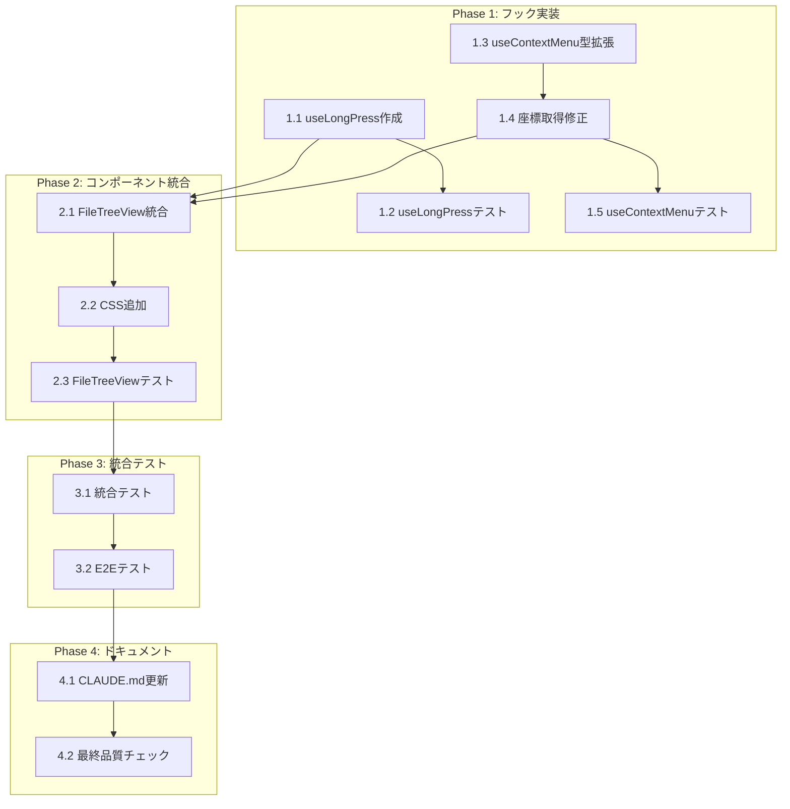

# Issue #123 作業計画

## Issue: iPad利用時ファイルの追加が出来ない

| 項目 | 内容 |
|------|------|
| **Issue番号** | #123 |
| **サイズ** | M（Medium） |
| **優先度** | High |
| **ラベル** | bug |
| **依存Issue** | なし |
| **設計方針書** | `dev-reports/design/issue-123-ipad-touch-context-menu-design-policy.md` |

---

## 1. 概要

iPadでファイルツリーを長押ししてもコンテキストメニューが表示されない問題を修正する。
`useLongPress`カスタムフックを新規作成し、`useContextMenu`の型を拡張、`FileTreeView`にタッチイベントハンドラを追加する。

---

## 2. 詳細タスク分解

### Phase 1: フック実装（TDD）

| # | タスク | 成果物 | 依存 | サイズ |
|---|--------|--------|------|--------|
| 1.1 | useLongPressフック作成 | `src/hooks/useLongPress.ts` | なし | S |
| 1.2 | useLongPressテスト作成 | `tests/unit/hooks/useLongPress.test.ts` | 1.1 | S |
| 1.3 | useContextMenu型拡張 | `src/hooks/useContextMenu.ts` | なし | XS |
| 1.4 | useContextMenu座標取得修正 | `src/hooks/useContextMenu.ts` | 1.3 | XS |
| 1.5 | useContextMenuテスト追加 | `tests/unit/hooks/useContextMenu.test.ts` | 1.4 | XS |

### Phase 2: コンポーネント統合

| # | タスク | 成果物 | 依存 | サイズ |
|---|--------|--------|------|--------|
| 2.1 | FileTreeView統合 | `src/components/worktree/FileTreeView.tsx` | 1.1, 1.4 | S |
| 2.2 | CSS追加（touch-action等） | `src/components/worktree/FileTreeView.tsx` | 2.1 | XS |
| 2.3 | FileTreeViewテスト追加 | `tests/unit/components/worktree/FileTreeView.test.tsx` | 2.2 | S |

### Phase 3: 統合テスト・E2E

| # | タスク | 成果物 | 依存 | サイズ |
|---|--------|--------|------|--------|
| 3.1 | 統合テスト作成 | `tests/integration/touch-context-menu.test.tsx` | 2.3 | S |
| 3.2 | E2Eテスト作成（タッチエミュレーション） | `tests/e2e/touch-menu.spec.ts` | 3.1 | M |

### Phase 4: ドキュメント・品質

| # | タスク | 成果物 | 依存 | サイズ |
|---|--------|--------|------|--------|
| 4.1 | CLAUDE.md更新 | `CLAUDE.md` | 3.2 | XS |
| 4.2 | 最終品質チェック | - | 4.1 | XS |

---

## 3. タスク依存関係

---

## 4. 新規ファイル一覧

| ファイル | 説明 |
|---------|------|
| `src/hooks/useLongPress.ts` | 長押し検出カスタムフック |
| `tests/unit/hooks/useLongPress.test.ts` | useLongPressユニットテスト |
| `tests/integration/touch-context-menu.test.tsx` | タッチコンテキストメニュー統合テスト |
| `tests/e2e/touch-menu.spec.ts` | E2Eテスト（タッチエミュレーション） |

---

## 5. 変更ファイル一覧

| ファイル | 変更内容 |
|---------|---------|
| `src/hooks/useContextMenu.ts` | openMenu型をUnion型に拡張、座標取得ロジック追加 |
| `src/components/worktree/FileTreeView.tsx` | タッチイベントハンドラ追加、CSS追加 |
| `tests/unit/hooks/useContextMenu.test.ts` | TouchEventテスト追加 |
| `tests/unit/components/worktree/FileTreeView.test.tsx` | 長押しテスト追加 |
| `CLAUDE.md` | Issue #123機能追加の記録 |

---

## 6. テスト計画

### 6.1. useLongPress.test.ts（6ケース）

| # | テストケース | 期待結果 |
|---|-------------|---------|
| 1 | 500ms後にonLongPressが呼ばれる | コールバック実行 |
| 2 | 10px以上移動でタイマーがクリア | コールバック未実行 |
| 3 | touchendでタイマーがクリア | コールバック未実行 |
| 4 | touchcancelでタイマーがクリア | コールバック未実行 |
| 5 | アンマウント時にタイマーがクリア | メモリリークなし |
| 6 | マルチタッチ（2本指以上）では発火しない | コールバック未実行 |

### 6.2. useContextMenu.test.ts（2ケース追加）

| # | テストケース | 期待結果 |
|---|-------------|---------|
| 1 | TouchEventでopenMenuを呼び出せる | menuState更新 |
| 2 | タッチ座標からメニュー位置が設定される | position正確 |

### 6.3. FileTreeView.test.tsx（4ケース追加）

| # | テストケース | 期待結果 |
|---|-------------|---------|
| 1 | 長押し（500ms）でコンテキストメニュー表示 | メニュー表示 |
| 2 | 10px以上移動でメニューキャンセル | メニュー非表示 |
| 3 | タッチキャンセル時にタイマークリア | メモリリークなし |
| 4 | アンマウント時にタイマークリア | メモリリークなし |

### 6.4. マウス右クリックベースライン（4ケース追加）

| # | テストケース | 期待結果 |
|---|-------------|---------|
| 1 | 右クリックでコンテキストメニュー表示 | メニュー表示 |
| 2 | メニュー項目クリックで操作実行 | 操作実行 |
| 3 | メニュー外クリックでメニュー閉じる | メニュー非表示 |
| 4 | ESCキーでメニュー閉じる | メニュー非表示 |

---

## 7. 品質チェック項目

| チェック項目 | コマンド | 基準 |
|-------------|----------|------|
| ESLint | `npm run lint` | エラー0件 |
| TypeScript | `npx tsc --noEmit` | 型エラー0件 |
| Unit Test | `npm run test:unit` | 全テストパス |
| Integration Test | `npm run test:integration` | 全テストパス |
| Build | `npm run build` | 成功 |

---

## 8. リグレッションリスク対策

| ID | リスク | 対策 |
|----|--------|------|
| RR-001 | マウス右クリック既存動作 | Union型で後方互換性確保、ベースラインテスト追加 |
| RR-002 | スクロールとの競合 | 10px移動閾値でスクロール開始時にキャンセル |
| RR-003 | TreeNodeパフォーマンス | useCallback/memo化で最適化 |
| RR-004 | z-index競合 | 既存z-index管理（z-50）を維持 |

---

## 9. 成果物チェックリスト

### コード
- [ ] `src/hooks/useLongPress.ts` - 長押し検出フック
- [ ] `src/hooks/useContextMenu.ts` - 型拡張、座標取得修正
- [ ] `src/components/worktree/FileTreeView.tsx` - タッチイベント統合

### テスト
- [ ] `tests/unit/hooks/useLongPress.test.ts` - 6ケース
- [ ] `tests/unit/hooks/useContextMenu.test.ts` - 2ケース追加
- [ ] `tests/unit/components/worktree/FileTreeView.test.tsx` - 8ケース追加
- [ ] `tests/integration/touch-context-menu.test.tsx` - 2ケース
- [ ] `tests/e2e/touch-menu.spec.ts` - タッチエミュレーション

### ドキュメント
- [ ] `CLAUDE.md` - Issue #123機能追加の記録

---

## 10. Definition of Done

Issue完了条件：

- [ ] すべてのタスクが完了
- [ ] 単体テストカバレッジ80%以上
- [ ] CIチェック全パス（lint, type-check, test, build）
- [ ] iPadで長押しコンテキストメニューが動作確認済み
- [ ] PC右クリックの既存動作が維持されている
- [ ] コードレビュー承認
- [ ] ドキュメント更新完了

---

## 11. 次のアクション

作業計画承認後：

1. **ブランチ**: `feature/123-ipad-touch-context-menu`（既存）
2. **TDD実装開始**: `/tdd-impl 123` または `/pm-auto-dev 123`
3. **進捗報告**: `/progress-report 123`で定期報告
4. **PR作成**: `/create-pr`で自動作成

---

*作成日: 2026-02-04*
*設計方針書: dev-reports/design/issue-123-ipad-touch-context-menu-design-policy.md*
