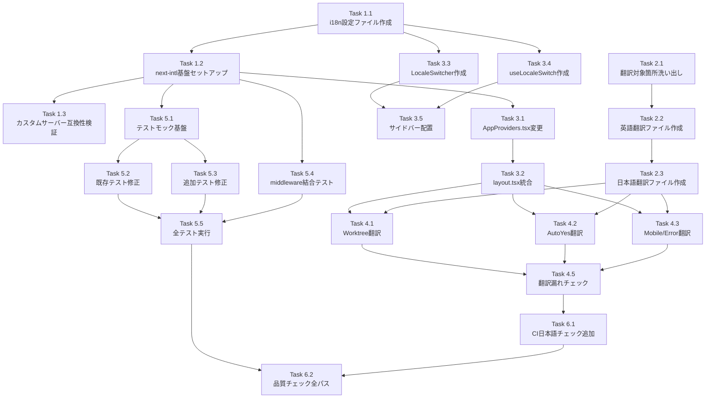

# Issue #124 作業計画書

## Issue: i18n対応（多言語化）

**Issue番号**: #124
**サイズ**: L
**優先度**: High
**依存Issue**: なし

---

## Issue概要

CommandMateにi18n（国際化）対応を実装し、英語と日本語の2言語をサポートする。海外ユーザーの利用を促進し、OSSプロジェクトとしての英語化を実現する。

### 背景
- 海外ユーザー対応が必要（GitHubスター獲得、コミュニティ拡大）
- OSSプロジェクトとして英語がデフォルトであるべき

### スコープ
- **対象**: UI文言（全コンポーネント）+ 言語切替機能
- **対象外**: ドキュメント英語化（別Issue）

### デフォルト言語
- 英語 (en)

### 技術方針
- next-intl（Next.js 14 App Router最適化）
- Cookie/Headerベース方式（URL構造維持、カスタムサーバー互換）

---

## 詳細タスク分解

### Phase 1: 基盤構築（Dependencies: なし）

#### Task 1.1: i18n設定ファイル作成
- **成果物**:
  - `src/config/i18n-config.ts` [MF-001: Single Source of Truth]
  - `src/lib/locale-cookie.ts` [MF-002: Cookie永続化]
  - `src/lib/date-locale.ts` [SF-004: date-fns連動]
- **依存**: なし
- **内容**:
  - `SUPPORTED_LOCALES = ['en', 'ja']`
  - `DEFAULT_LOCALE = 'en'`
  - `LOCALE_LABELS = {en: 'English', ja: '日本語'}`
  - `setLocaleCookie()` 実装（SameSite=Lax, Secure対応）
  - `getDateFnsLocale()` マッピング関数実装

#### Task 1.2: next-intl基盤セットアップ
- **成果物**:
  - `src/i18n.ts`
  - `src/middleware.ts`
  - `next.config.js` 更新 [SF-S2-001: CommonJS形式]
- **依存**: Task 1.1
- **内容**:
  - next-intl パッケージインストール
  - i18n.ts 作成（i18n-config.ts参照）
  - middleware.ts 作成（ロケール検出、フォールバック順序明記 [SF-002]）
  - next.config.js に createNextIntlPlugin 適用（CommonJS形式で検証）

#### Task 1.3: カスタムサーバー互換性検証（PoC）
- **成果物**: 検証レポート（dev-reports/issue/124/poc-custom-server.md）
- **依存**: Task 1.2
- **内容**:
  - server.ts でmiddleware.tsが動作することを確認
  - WebSocket/APIルートへの影響確認（matcher設定で除外）
  - CSPヘッダーとの互換性確認
  - CommonJS形式のnext.config.js動作確認

---

### Phase 2: 翻訳ファイル作成（Dependencies: Task 1.1）

#### Task 2.1: 翻訳対象箇所の洗い出し（最新化）
- **成果物**: 翻訳箇所リスト（dev-reports/issue/124/translation-targets.md）
- **依存**: なし
- **内容**:
  - grep で全日本語箇所を最新確認 [SF-003]
  - 14ファイル・約118箇所のリスト最新化
  - コメント・JSDocの除外確認 [CO-S2-002]

#### Task 2.2: 英語翻訳ファイル作成
- **成果物**:
  - `locales/en/common.json`
  - `locales/en/worktree.json`
  - `locales/en/autoYes.json`
  - `locales/en/error.json`
  - `locales/en/prompt.json`
- **依存**: Task 2.1
- **内容**:
  - 全namespace分の英語翻訳キー・値を定義
  - [MF-S2-001] MessageList.tsx用共通テキスト（yes, no, send, cancel等）を common.json に追加
  - [MF-S2-002] PromptPanel.tsx/PromptMessage.tsx用テキストを prompt.json に追加
  - [SF-001] DURATION_LABELS 翻訳キー（1h, 3h, 8h）を autoYes.json に追加

#### Task 2.3: 日本語翻訳ファイル作成
- **成果物**:
  - `locales/ja/common.json`
  - `locales/ja/worktree.json`
  - `locales/ja/autoYes.json`
  - `locales/ja/error.json`
  - `locales/ja/prompt.json`
- **依存**: Task 2.2
- **内容**:
  - 英語版と同じキー構造で日本語テキストを定義
  - 既存の日本語ハードコードを正確に転記

#### Task 2.4: auto-yes-config.ts に DURATION_LABELS 追加
- **成果物**: `src/config/auto-yes-config.ts` 更新
- **依存**: なし
- **内容**:
  - [SF-001] DURATION_LABELS 翻訳キーマッピング追加
  - ALLOWED_DURATIONS は変更しない（OCP準拠）

---

### Phase 3: Provider・UI統合（Dependencies: Task 1.2, Task 2.2, Task 2.3）

#### Task 3.1: AppProviders.tsx インターフェース変更
- **成果物**: `src/components/providers/AppProviders.tsx`
- **依存**: Task 1.2
- **内容**:
  - [SF-S2-003] interface AppProvidersProps に locale, messages プロパティ追加
  - NextIntlClientProvider 追加

#### Task 3.2: layout.tsx ロケール統合
- **成果物**: `src/app/layout.tsx`
- **依存**: Task 3.1
- **内容**:
  - [SF-S2-002] `import { getLocale, getMessages } from 'next-intl/server'`
  - html lang 属性を動的化（`<html lang={locale}>`）
  - AppProviders に locale, messages を props 渡し

#### Task 3.3: LocaleSwitcher コンポーネント作成
- **成果物**: `src/components/common/LocaleSwitcher.tsx`
- **依存**: Task 1.1
- **内容**:
  - [MF-001] LOCALE_LABELS, SUPPORTED_LOCALES を i18n-config.ts から参照
  - select 要素で言語切替UI実装

#### Task 3.4: useLocaleSwitch カスタムフック作成
- **成果物**: `src/hooks/useLocaleSwitch.ts`
- **依存**: Task 1.1
- **内容**:
  - [MF-002] setLocaleCookie ユーティリティに委譲（SRP準拠）
  - localStorage永続化
  - window.location.reload() でProvider再初期化

#### Task 3.5: LocaleSwitcher サイドバー配置
- **成果物**: サイドバー親コンポーネント更新（page.tsx またはサイドバーレイアウト）
- **依存**: Task 3.3, Task 3.4
- **内容**:
  - [CO-S2-001] 実際のサイドバー構成を確認し、適切な親コンポーネントに配置
  - デスクトップ: サイドバー下部
  - モバイル: ドロワー内

---

### Phase 4: コンポーネント翻訳適用（Dependencies: Task 3.1, Task 3.2, Task 2.2, Task 2.3）

#### Task 4.1: Worktree関連コンポーネント翻訳（6ファイル）
- **成果物**:
  - `src/components/worktree/WorktreeCard.tsx`
  - `src/components/worktree/PromptMessage.tsx`
  - `src/components/worktree/PromptPanel.tsx` [MF-S2-001: 4箇所]
  - `src/components/worktree/MessageList.tsx` [MF-S2-001: 17箇所]
  - `src/components/worktree/WorktreeDetailRefactored.tsx` [MF-S2-001: 13箇所]
  - `src/components/worktree/InterruptButton.tsx`
- **依存**: Task 3.2
- **内容**:
  - 日本語ハードコードを useTranslations() に置換
  - [MF-S2-001] PromptPanel: prompt, common namespace使用
  - [MF-S2-001] MessageList: common, worktree namespace使用
  - [MF-S2-001] WorktreeDetailRefactored: worktree, common namespace使用
  - [SF-004] date-fns利用箇所で getDateFnsLocale() 使用

#### Task 4.2: Auto-Yes関連コンポーネント翻訳（3ファイル）
- **成果物**:
  - `src/components/worktree/AutoYesConfirmDialog.tsx`
  - `src/components/worktree/AutoYesToggle.tsx`
  - `src/components/worktree/HistoryPane.tsx`
- **依存**: Task 3.2
- **内容**:
  - 日本語ハードコードを useTranslations('autoYes') に置換
  - [SF-001] DURATION_LABELS を使用した期間選択ラベル翻訳

#### Task 4.3: Mobile・Error関連コンポーネント翻訳（3ファイル）
- **成果物**:
  - `src/components/mobile/MobilePromptSheet.tsx`
  - `src/components/error/ErrorBoundary.tsx`
  - `src/components/error/fallbacks.tsx`
- **依存**: Task 3.2
- **内容**:
  - 日本語ハードコードを useTranslations() に置換

#### Task 4.4: Config翻訳（1ファイル）
- **成果物**: `src/config/auto-yes-config.ts`
- **依存**: Task 2.4
- **内容**:
  - 既存の日本語文字列を翻訳キー参照に変更

#### Task 4.5: 翻訳漏れチェック
- **成果物**: 翻訳漏れレポート（dev-reports/issue/124/translation-coverage.md）
- **依存**: Task 4.1, Task 4.2, Task 4.3, Task 4.4
- **内容**:
  - [SF-003] grep で日本語残存チェック（コメント行除外）
  - 翻訳漏れ0件を確認

---

### Phase 5: テスト対応（Dependencies: Task 4.5）

#### Task 5.1: テストモック基盤構築
- **成果物**:
  - `tests/setup.ts` 更新
  - `tests/helpers/intl-test-utils.ts` 新規
- **依存**: Task 1.2
- **内容**:
  - next-intl グローバルモック追加
  - useTranslations モック実装（キーをそのまま返す）
  - テスト用翻訳ヘルパー作成

#### Task 5.2: 既存テスト修正（6ファイル）
- **成果物**:
  - `PromptMessage.test.tsx`
  - `MobilePromptSheet.test.tsx`
  - `AutoYesConfirmDialog.test.tsx`
  - `AutoYesToggle.test.tsx`
  - `auto-yes-config.test.ts`
  - `HistoryPane.test.tsx`
- **依存**: Task 5.1
- **内容**:
  - 日本語文字列アサーション → 翻訳キー or 英語文字列
  - DURATION_LABELS のアサーション更新

#### Task 5.3: 追加テスト修正（3ファイル）
- **成果物**:
  - `PromptPanel.test.tsx` （存在する場合）
  - `MessageList.test.tsx` （存在する場合）
  - `WorktreeDetailRefactored.test.tsx` （存在する場合）
- **依存**: Task 5.1
- **内容**:
  - [SF-S2-004] 上記テストファイルが存在する場合、アサーションを更新
  - 存在しない場合は新規テスト作成の必要性を判断

#### Task 5.4: middleware フォールバック結合テスト
- **成果物**: `tests/integration/middleware-locale.test.ts`
- **依存**: Task 1.2
- **内容**:
  - [SF-002] フォールバック順序検証（4ケース）
    - Cookie優先
    - Accept-Languageフォールバック
    - デフォルトフォールバック
    - 非サポートロケール

#### Task 5.5: 全テスト実行・パス確認
- **成果物**: テスト結果レポート（dev-reports/issue/124/test-results.md）
- **依存**: Task 5.2, Task 5.3, Task 5.4
- **内容**:
  - npm run test:unit 全パス確認
  - npm run test:integration 全パス確認
  - カバレッジ80%以上維持確認

---

### Phase 6: CI/CD対応（Dependencies: Task 5.5）

#### Task 6.1: CI日本語残存チェック追加
- **成果物**: `.github/workflows/ci.yml` 更新（またはスクリプト追加）
- **依存**: Task 4.5
- **内容**:
  - [SF-003, CO-S2-002] 日本語残存チェックスクリプト組み込み
  - コメント行除外ルール適用
  - 初期は警告のみ（安定後にエラー化）

#### Task 6.2: 品質チェック全パス
- **成果物**: CI全パスレポート
- **依存**: Task 6.1
- **内容**:
  - ESLint: npm run lint
  - TypeScript: npx tsc --noEmit
  - Unit Test: npm run test:unit
  - Build: npm run build

---

## タスク依存関係

---

## 品質チェック項目

| チェック項目 | コマンド | 基準 |
|-------------|----------|------|
| ESLint | `npm run lint` | エラー0件 |
| TypeScript | `npx tsc --noEmit` | 型エラー0件 |
| Unit Test | `npm run test:unit` | 全テストパス、カバレッジ80%以上 |
| Integration Test | `npm run test:integration` | 全テストパス |
| Build | `npm run build` | 成功 |
| 翻訳漏れチェック | `grep -rn '[ぁ-ん\|ァ-ヶ\|亜-熙]' src/components/ src/config/` | 0件（コメント除外） |

---

## 成果物チェックリスト

### コード
- [ ] i18n設定ファイル（i18n-config.ts, locale-cookie.ts, date-locale.ts）
- [ ] next-intl基盤（i18n.ts, middleware.ts, next.config.js更新）
- [ ] 翻訳ファイル（locales/en/*.json, locales/ja/*.json）
- [ ] Provider統合（AppProviders.tsx, layout.tsx更新）
- [ ] LocaleSwitcher UI（コンポーネント、フック）
- [ ] 全14ファイルのコンポーネント翻訳適用

### テスト
- [ ] テストモック基盤（setup.ts, intl-test-utils.ts）
- [ ] 既存テスト修正（9ファイル）
- [ ] middleware結合テスト（4ケース）
- [ ] 全テストパス確認

### CI/CD
- [ ] 日本語残存チェックスクリプト

### ドキュメント
- [ ] カスタムサーバー互換性検証レポート
- [ ] 翻訳箇所リスト
- [ ] 翻訳漏れレポート
- [ ] テスト結果レポート

---

## Definition of Done

Issue #124 完了条件：

- [ ] **基盤**: next-intl導入、middleware.ts/i18n.ts作成完了
- [ ] **設計原則準拠**:
  - [MF-001] i18n-config.ts Single Source of Truth実装
  - [MF-002] Cookie永続化SRP準拠
  - [SF-001] DURATION_LABELS OCP準拠
  - [SF-002] middlewareフォールバック順序明記・テスト完了
  - [SF-003] 翻訳対象完全リスト化・CI検出
  - [SF-004] date-fns連動実装
- [ ] **整合性確保**:
  - [MF-S2-001] PromptPanel.tsx, MessageList.tsx, WorktreeDetailRefactored.tsx翻訳適用（計34箇所）
  - [SF-S2-001] next.config.js CommonJS形式動作確認
  - [SF-S2-002] layout.tsx Server Component対応
  - [SF-S2-003] AppProviders.tsx インターフェース変更
- [ ] **翻訳完了**: 14ファイル・約118箇所すべて翻訳キー化、漏れ0件
- [ ] **UI完成**: LocaleSwitcher配置、言語切替動作確認
- [ ] **テスト**: 全テストパス、カバレッジ80%以上維持
- [ ] **CIパス**: lint, type-check, test, build全パス
- [ ] **日本語残存チェック**: CI組み込み完了

---

## 次のアクション

作業計画承認後：

1. **ブランチ作成**: `feature/124-i18n` （既存: `feature/124-worktree`）
2. **Phase 1実行**: `/tdd-impl` または手動実装（Task 1.1 → 1.2 → 1.3）
3. **Phase 2-6実行**: 各Phaseを順次実行
4. **進捗報告**: `/progress-report` で定期報告
5. **PR作成**: `/create-pr` で自動作成（または5PR分割戦略に従う）

---

## PR分割戦略

Issue #124 は以下の5PRに分割してマージする：

| PR# | 範囲 | 内容 |
|-----|------|------|
| PR1 | Phase 1-2 | next-intl基盤構築 + 翻訳ファイル作成 |
| PR2 | Phase 3 | Provider統合 + LocaleSwitcher UI |
| PR3 | Phase 4.1-4.2 | Worktree + AutoYes コンポーネント翻訳 |
| PR4 | Phase 4.3-4.4 + Phase 5 | Mobile/Error翻訳 + テスト対応 |
| PR5 | Phase 6 | CI/CD対応 |

---

## リスク管理

| リスク | 影響度 | 軽減策 | 担当Phase |
|-------|--------|--------|----------|
| カスタムサーバーでmiddleware.ts動作しない | 高 | Phase 1でPoC実施 | Task 1.3 |
| next.config.js CommonJS形式互換性 | 中 | Phase 1でPoC検証、問題あれば.mjs移行 | Task 1.3 |
| 翻訳漏れ（日本語取り残し） | 中 | 14ファイル完全リスト化 + grep + CI | Task 4.5, Task 6.1 |
| 既存テスト大量破壊 | 中 | グローバルモック方式で影響最小化 | Task 5.1 |
| layout.tsx Server Component制約 | 低 | next-intl/server API使用 | Task 3.2 |
| middlewareフォールバック順序変化 | 低 | 結合テストで検証、アップデート時回帰テスト | Task 5.4 |

---

## タイムライン見積り

| Phase | 所要時間（概算） | 理由 |
|-------|----------------|------|
| Phase 1 | 2-3時間 | 基盤構築、PoC検証含む |
| Phase 2 | 3-4時間 | 14ファイル・118箇所の翻訳抽出・キー設計 |
| Phase 3 | 2-3時間 | Provider統合、UI実装 |
| Phase 4 | 5-6時間 | 14ファイルの翻訳適用（最大ボリューム） |
| Phase 5 | 3-4時間 | テストモック基盤 + 既存テスト修正 |
| Phase 6 | 1-2時間 | CI組み込み |
| **合計** | **16-22時間** | 約2-3日（集中作業時） |

---

*Generated by /work-plan command for Issue #124*
*Date: 2026-02-11*
*Based on: dev-reports/design/issue-124-i18n-design-policy.md*
*Multi-stage Issue Review: dev-reports/issue/124/issue-review/summary-report.md*
*Multi-stage Design Review: dev-reports/issue/124/multi-stage-design-review/* (Stage 1-2 completed)*
