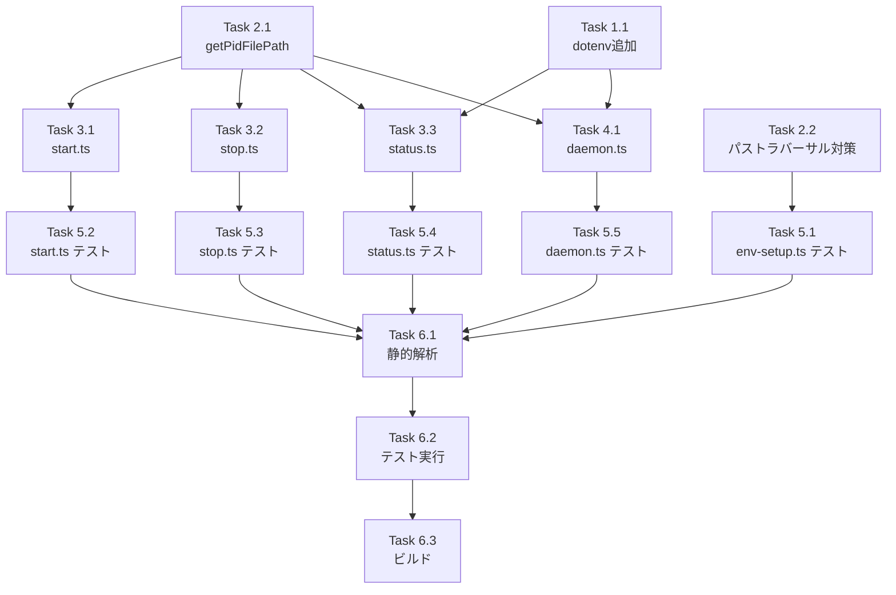

# 作業計画書: Issue #125

## Issue: グローバルインストール時に start コマンドが ~/.commandmate/.env を読み込まない

**Issue番号**: #125
**サイズ**: M（中規模）
**優先度**: High（ユーザーがグローバルインストールで使用できない致命的バグ）
**依存Issue**: なし（#119, #96は完了済み）
**設計方針書**: [issue-125-global-install-env-loading-design-policy.md](../design/issue-125-global-install-env-loading-design-policy.md)
**レビューステータス**: 4段階レビュー完了（設計原則・整合性・影響分析・セキュリティ）

---

## 概要

CommandMateをグローバルインストール（`npm install -g commandmate`）した場合、`init`コマンドは`.env`を`~/.commandmate/.env`に保存するが、`start`/`stop`/`status`コマンドは`process.cwd()`から設定ファイルを探す不整合を修正する。

---

## 詳細タスク分解

### Phase 1: 依存関係の追加

#### Task 1.1: dotenvパッケージの追加
- **成果物**: `package.json`, `package-lock.json`
- **作業内容**: `npm install dotenv`を実行しdependenciesに追加
- **依存**: なし

### Phase 2: ユーティリティ関数の追加・修正

#### Task 2.1: getPidFilePath()関数の追加
- **成果物**: `src/cli/utils/env-setup.ts`
- **作業内容**:
  - `getPidFilePath()`関数を追加（DRY原則対応）
  - 適切なJSDocコメントを追加
- **依存**: なし

#### Task 2.2: パストラバーサル対策の追加
- **成果物**: `src/cli/utils/env-setup.ts`
- **作業内容**:
  - `resolveSecurePath()`関数を追加
  - `getConfigDir()`に`fs.realpathSync()`によるシンボリックリンク解決を追加
  - 許可ディレクトリ内チェックを追加
- **依存**: なし
- **セキュリティ**: OWASP A01:2021 - Broken Access Control対応

### Phase 3: CLIコマンドの修正

#### Task 3.1: start.tsの修正
- **成果物**: `src/cli/commands/start.ts`
- **作業内容**:
  - `getEnvPath()`, `getPidFilePath()`のimport追加
  - `PID_FILE`定数を`pidFilePath`変数に変更
  - 環境変数読み込みロジックを削除（daemon.tsに委譲）
  - エラーメッセージにパス情報を追加
- **依存**: Task 2.1

#### Task 3.2: stop.tsの修正
- **成果物**: `src/cli/commands/stop.ts`
- **作業内容**:
  - `getPidFilePath()`のimport追加
  - `PID_FILE`定数を`pidFilePath`変数に変更
- **依存**: Task 2.1

#### Task 3.3: status.tsの修正
- **成果物**: `src/cli/commands/status.ts`
- **作業内容**:
  - `getPidFilePath()`, `getEnvPath()`のimport追加
  - `PID_FILE`定数を`pidFilePath`変数に変更
  - `dotenvConfig()`による.env読み込みを追加（正しい設定値表示のため）
- **依存**: Task 1.1, Task 2.1

### Phase 4: デーモン管理の修正

#### Task 4.1: daemon.tsの修正
- **成果物**: `src/cli/utils/daemon.ts`
- **作業内容**:
  - `dotenv`のimport追加
  - `getEnvPath()`のimport追加
  - `start()`メソッドで`.env`読み込みを追加
  - `envResult.error`のエラーハンドリング追加
  - 外部公開設定時のセキュリティ警告追加
  - 認証トークン未設定時の警告追加
  - 起動成功ログに正確な設定値を出力
- **依存**: Task 1.1, Task 2.1
- **セキュリティ**: OWASP A05:2021 - Security Misconfiguration対応

### Phase 5: 単体テストの作成

#### Task 5.1: env-setup.tsのテスト
- **成果物**: `tests/unit/cli/utils/env-setup.test.ts`
- **作業内容**:
  - `getPidFilePath()`のテスト（グローバル/ローカル）
  - `getConfigDir()`のシンボリックリンク解決テスト
  - パストラバーサル検出テスト
- **依存**: Task 2.1, Task 2.2
- **カバレッジ目標**: 80%以上

#### Task 5.2: start.tsのテスト
- **成果物**: `tests/unit/cli/commands/start.test.ts`
- **作業内容**:
  - グローバルインストール時の.envパステスト
  - ローカルインストール時の.envパステスト
  - .envが見つからない場合のエラーメッセージテスト
- **依存**: Task 3.1
- **カバレッジ目標**: 80%以上

#### Task 5.3: stop.tsのテスト
- **成果物**: `tests/unit/cli/commands/stop.test.ts`
- **作業内容**:
  - グローバルインストール時のPIDファイルパステスト
  - ローカルインストール時のPIDファイルパステスト
- **依存**: Task 3.2
- **カバレッジ目標**: 80%以上

#### Task 5.4: status.tsのテスト
- **成果物**: `tests/unit/cli/commands/status.test.ts`
- **作業内容**:
  - グローバルインストール時のPIDファイルパステスト
  - ローカルインストール時のPIDファイルパステスト
  - .env設定値の反映テスト
- **依存**: Task 3.3
- **カバレッジ目標**: 80%以上

#### Task 5.5: daemon.tsのテスト
- **成果物**: `tests/unit/cli/utils/daemon.test.ts`
- **作業内容**:
  - .env環境変数の子プロセス伝播テスト（spawnモック化）
  - コマンドラインオプションのオーバーライドテスト
  - envResult.errorのフォールバック動作テスト
  - セキュリティ警告のログ出力テスト
- **依存**: Task 4.1
- **カバレッジ目標**: 80%以上

### Phase 6: 品質チェックとビルド

#### Task 6.1: 静的解析の実行
- **作業内容**:
  - `npm run lint`の実行
  - `npx tsc --noEmit`の実行
- **依存**: Phase 1〜5

#### Task 6.2: テストの実行
- **作業内容**:
  - `npm run test:unit`の実行
  - カバレッジ確認
- **依存**: Phase 5

#### Task 6.3: ビルドの実行
- **作業内容**:
  - `npm run build:all`の実行（Next.js + CLI + server）
- **依存**: Task 6.1, Task 6.2

---

## タスク依存関係

---

## 品質チェック項目

| チェック項目 | コマンド | 基準 |
|-------------|----------|------|
| ESLint | `npm run lint` | エラー0件 |
| TypeScript | `npx tsc --noEmit` | 型エラー0件 |
| Unit Test | `npm run test:unit` | 全テストパス |
| Build | `npm run build:all` | 成功 |

---

## 成果物チェックリスト

### コード変更
- [ ] `package.json` - dotenv依存追加
- [ ] `src/cli/utils/env-setup.ts` - getPidFilePath(), resolveSecurePath()追加、getConfigDir()修正
- [ ] `src/cli/commands/start.ts` - getEnvPath(), getPidFilePath()使用
- [ ] `src/cli/commands/stop.ts` - getPidFilePath()使用
- [ ] `src/cli/commands/status.ts` - getPidFilePath()使用、dotenvConfig()追加
- [ ] `src/cli/utils/daemon.ts` - dotenv読み込み、セキュリティ警告追加

### テスト
- [ ] `tests/unit/cli/utils/env-setup.test.ts`
- [ ] `tests/unit/cli/commands/start.test.ts`
- [ ] `tests/unit/cli/commands/stop.test.ts`
- [ ] `tests/unit/cli/commands/status.test.ts`
- [ ] `tests/unit/cli/utils/daemon.test.ts`

---

## セキュリティチェックリスト

### OWASP A01:2021 - Broken Access Control（パストラバーサル対策）
- [ ] `getConfigDir()`でfs.realpathSync()を使用してシンボリックリンクを解決
- [ ] グローバルインストール時に`~/.commandmate/`がホームディレクトリ内にあることを検証
- [ ] ローカルインストール時にprocess.cwd()をrealpathで解決
- [ ] パストラバーサル検出時のエラーメッセージとログ出力

### OWASP A05:2021 - Security Misconfiguration（機密情報の取り扱い）
- [ ] daemon.tsのstart()で.env読み込み後のenv変数から設定値を取得
- [ ] CM_BIND=0.0.0.0の場合にセキュリティ警告を表示
- [ ] CM_AUTH_TOKEN未設定かつ外部公開時に追加警告を表示
- [ ] 起動成功ログに正確なポート/バインド値を出力

---

## Definition of Done

Issue完了条件：

### 必須条件
- [ ] すべてのタスクが完了
- [ ] 単体テストカバレッジ80%以上
- [ ] CIチェック全パス（lint, type-check, test, build）
- [ ] コードレビュー承認

### 受け入れ条件（設計方針書より）
- [ ] グローバルインストール時に任意のディレクトリから`commandmate start`できること
- [ ] `~/.commandmate/.env`の設定が正しく読み込まれること
- [ ] PIDファイルが`~/.commandmate/.commandmate.pid`に作成されること
- [ ] `stop`/`status`コマンドが正しいPIDファイルを参照すること
- [ ] エラー発生時に期待される設定ファイルパスが表示されること
- [ ] ローカルインストール時の動作が維持されること（後方互換性）
- [ ] daemon.tsで.env読み込みエラー時にフォールバック動作すること
- [ ] statusコマンドで正しい設定値が表示されること
- [ ] getConfigDir()でシンボリックリンク解決とパストラバーサル検証が実装されていること
- [ ] CM_BIND=0.0.0.0の場合にセキュリティ警告が表示されること
- [ ] 外部公開+認証未設定時に追加警告が表示されること
- [ ] 起動成功ログに正確な設定値が表示されること

---

## 次のアクション

作業計画承認後：

1. **ブランチ作成**: `fix/125-global-install-env-loading`
2. **タスク実行**: 計画に従って実装
3. **進捗報告**: `/progress-report`で定期報告
4. **PR作成**: `/create-pr`で自動作成

---

## 関連ドキュメント

- [設計方針書](../design/issue-125-global-install-env-loading-design-policy.md)
- [マルチステージレビュー結果](./multi-stage-design-review/summary-report.md)

---

## 備考

- 4段階レビュー（設計原則・整合性・影響分析・セキュリティ）完了済み
- Must Fix項目9件はすべて設計方針書に反映済み
- Should Fix項目は今後の検討事項として記録済み
- セキュリティ対策（パストラバーサル、外部公開警告）を含む

---

*作成日: 2026-02-02*
*作成者: テックリード*
